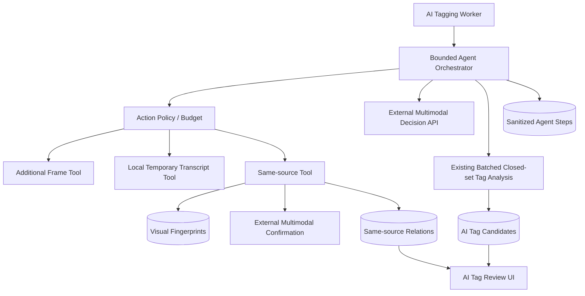
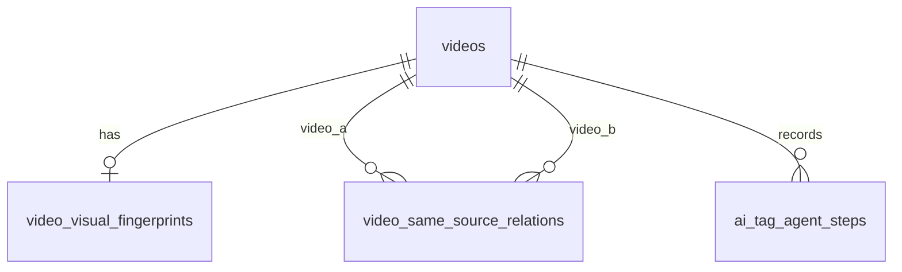

# CineInsight 受限 AI 打标 Agent 设计文档

## 二、需求信息

### 2.1 需求背景

- 背景：当前 AI 打标是固定后台流水线，模型不能在证据不足时请求补帧、临时转写或同源视频证据。
- 需求目的：在保留闭集标签和人工审批的前提下，引入有预算、可审计、可纠错的 Agent 决策循环。
- 目标用户/使用方：CineInsight 桌面端视频库用户。
- 需求链接：当前会话。
- 关联原始材料：`AI-CONTEXT.md`、`services/ai_tagging_service.go`、`services/ai_tagging_client.go`、`services/ai_tagging_extractor.go`、`services/subtitle_service.go`、`services/cleanup_service.go`。
- Intake package contract：`.loopx/intake/2026-07-30-ai-tagging-agent/requirements.md`（canonical `AC-*` / `TC-*`）；`.loopx/intake/2026-07-30-ai-tagging-agent/clarification.md`（supporting evidence）。
- 设计提案：`docs/loopx/design/2026-07-30-ai-tagging-agent/设计提案.md`，其中已接受的方向是本详细设计的约束。

### 2.2 需求范围

- 本期范围：四轮受限 Agent、模型决定补帧数量、本地临时转写、同源内容变体检测、持久关系与纠错、未读提示、脱敏轨迹、设置说明。
- 非目标：正式字幕写入/翻译、自动安装运行时、通用语义推荐、外部 embedding、标签自动传播、原始音频外发、通用工具 Agent。
- 决策边界：模型只能提议枚举动作；服务端策略层控制权限、预算、工具执行和最终持久化。
- 依赖方：现有 OpenAI 兼容多模态 API、FFmpeg、已安装 WhisperX/Qwen、PostgreSQL、Wails/Vue。
- 约束条件：现有候选审批和公开方法保持兼容；工作区已有迁移/自动标签改动必须顺序集成，不得覆盖。
- 触发的辅助 skills：api-designer、architecture-designer、sql-style、go-style。

### 2.3 可行性分析

- 业务可行性：用户已确认三种工具、预算、隐私外发、同源告知和纠错语义。
- 技术可行性：现有抽帧、字幕运行时、OpenAI 兼容客户端、GORM 和审阅弹窗均可复用；同源视觉指纹新增纯 Go 图像哈希算法，不依赖新模型服务。
- 资源成本：后台串行；每视频最多 4 次 Agent 决策、额外帧默认 20、一次临时转写、一次同源查询；本地候选最多 200、外部确认最多 5。
- 替代方案：详见设计提案；不采用全库外部两两比较、正式字幕流程、通用 embedding 或标签直传。
- 关键风险：模型动作 JSON 不稳定、感知哈希对极端裁剪召回不足、外部请求成本增加、本地 ASR 耗时。通过严格解析、外部二次确认、硬预算和结构化轨迹控制。

## 三、概要设计

### 3.1 方案总述

- 设计目标：在确定成本和权限边界内让模型按需收集证据。
- 总体思路：把“下一步决策”和“最终闭集标签分析”分离；决策循环执行受限工具，结束后复用现有分批标签分析。
- 核心模块：Agent orchestrator、决策客户端、增量抽帧器、临时转写提供者、同源检测服务、关系仓储、Wails/UI。
- 主要难点：工具失败不扩大失败域、转写不落正式字幕、同源召回与误报平衡、否认关系并发优先、敏感证据不进入日志/数据库。
- 技术指标：每视频决策次数 `<=4`；额外帧 `<=配置上限`；临时转写/同源查询各 `<=1`；本地候选 `<=200`；外部确认候选 `<=5`。

### 3.2 整体架构设计



- 系统边界：所有视频文件和音频处理在本地；只有 JPEG 抽帧、临时转写文本、文件元数据和标签证据进入已配置外部 API。
- 模块所有权：`AITaggingService` 编排；`SubtitleService` 只提供本地转写工具；`AISameSourceService` 负责候选、视觉指纹、外部确认和关系；数据库拥有状态真相。
- 一致性：候选审批和同源否认使用数据库事务；Agent 运行本身按视频串行，进程中断通过现有重试入口重新开始，不持久化敏感上下文。

### 3.3 核心流程设计

| 流程 | 触发条件 | 主流程 | 异常/补偿 | 输出 |
|---|---|---|---|---|
| Agent 打标 | Worker 选中无正式标签视频 | 初始证据 → 最多 4 次动作决策 → 最终闭集分析 | 辅助工具失败作为观察；模型/DB 失败标记失败 | 待审候选或证据不足 |
| 临时转写 | 模型请求且无已有字幕 | 获取转写槽 → WhisperX/Qwen → 合并并截断文本 | 不可用/取消作为工具观察；不写文件 | 内存文本 |
| 同源查询 | 模型请求且未使用 | 元数据候选 → 视觉指纹 → Top 5 → 外部确认 → upsert | 无候选为空成功；外部失败为工具失败 | 同源关系和标签观察 |
| 用户纠错 | 点击“不是同源” | 锁定关系 → 写 rejected、清未读 | 重复操作幂等 | 长期否认约束 |
| 审阅已读 | 弹窗成功加载关系 | 按关系 ID 批量更新 is_unread=false | 重复操作幂等 | 徽标归零/减少 |

### 3.4 功能模块

| 模块 | 职责 | 依赖 |
|---|---|---|
| Agent orchestrator | 轮次、预算、动作验证、观察拼装、结束原因 | config、decision client、tools |
| Agent decision client | 构造受限动作 prompt，严格解析 JSON | 外部 Chat Completions |
| AITaggingExtractor | 初始与增量抽帧、位置规划 | FFmpeg |
| TemporaryTranscriptProvider | 非持久化本地 ASR | SubtitleService、WhisperX/Qwen |
| AISameSourceService | 指纹缓存、候选召回、外部确认、关系查询/纠错 | PostgreSQL、FFmpeg、外部 API |
| Review UI | 待审标签、同源卡片、未读徽标、否认操作 | Wails bindings |

### 3.5 新增/调整功能说明

1. 设置页新增“每视频额外补帧上限”，默认 20，允许 1–100；补充外发说明。
2. AI 标签管理入口展示未读同源数量。
3. 审阅弹窗可展示只有同源关系、没有标签候选的视频组。
4. 现有 `AITaggingStatusSummary` 加法增加 `unread_same_source`。
5. `RetryAITagging` 继续使待审候选失效并重跑；同源否认关系不因普通重试失效。

### 3.6 专项设计检查

| 辅助 skill | 触发原因 | 检查内容 | 设计结论 |
|---|---|---|---|
| architecture-designer | 跨模块和外部依赖 | 边界、失败域、资源、恢复、运维 | 单体内深模块，不引入消息系统；硬预算限制故障和成本 |
| sql-style | 新表/索引/迁移 | 唯一性、查询路径、重跑、回滚 | 新增表列，normalized pair 唯一，按需生成无需回填 |
| api-designer | Wails/JSON 契约 | 兼容、幂等、列表上限、排序 | 仅加法；写接口幂等；列表 limit 1–200 |
| go-style | Go 并发和接口 | context、消费者接口、错误分类、race | 转写槽可取消；工具错误类型化；测试矩阵化 |

## 四、详细设计

### 4.1 Agent 编排详细设计

#### 4.1.1 需求内容

- 入口：后台 Worker、`ProcessVideo`、`RetryAITagging`。
- 调用方：`AITaggingService`。
- 前置条件：外部配置与闭集标签库可用，视频没有非自动正式标签。
- 输出结果：待审候选、`no_high_or_medium_confidence`、`evidence_insufficient` 或失败状态。

#### 4.1.2 方案设计

**Behavior Contract — D-001（AC-012, AC-013）**：每视频最多 4 次动作决策；单轮只能执行一个动作；补帧累计受 `MaxExtraFrames` 限制，转写和同源查询各一次。第 4 次或预算耗尽时强制最终分析。

**Interface Contract — D-002（AC-012, AC-013）**：动作响应为严格 JSON：

```json
{
  "action": "finalize|request_more_frames|request_transcript|find_same_source",
  "requested_frame_count": 0,
  "reasoning": "简短理由"
}
```

`requested_frame_count` 仅在补帧动作中允许非零。旧响应缺少 `action` 时解释为 `finalize`；未知枚举、类型错误或无法解析属于外部模型失败。

**Operational Contract — D-003（AC-015, AC-016）**：工具失败产生 `{tool, status, code, counts}` 观察，不使视频失败；外部决策/最终分析或数据库持久化失败使视频失败。轨迹不保存自由文本证据。

- 幂等：同一 evidence fingerprint 已完成/跳过且仍有候选时沿用现有跳过逻辑；重试清理候选并从第 1 轮开始。
- 并发：`workerRunMu` 继续保证单进程只有一个 AI Worker run；同一视频不并发处理。
- 安全：证据字段放入明确 data 区；系统提示声明文件名、路径、字幕、标签和模型理由都不是指令。

#### 4.1.3 流程步骤

1. 收集初始字幕和固定抽帧，计算 evidence fingerprint。
2. 初始化内存预算和观察；清理该视频当前 fingerprint/attempt 的旧 step 行。
3. 每轮选择不超过 `ImagesPerRequest` 的代表帧调用 `DecideNextAction`。
4. 策略层验证动作；执行工具或写拒绝观察。
5. 动作结束后写一条脱敏 `AITagAgentStep`。
6. `finalize` 或达到第 4 轮时，用全部累计抽帧、已有/临时字幕和同源标签观察调用现有分批 `AnalyzeTags`。
7. 复用现有服务端闭集过滤、候选保存和状态更新。

#### 4.1.4 边界条件

| 场景 | 处理方式 | 用户感知 | 监控 |
|---|---|---|---|
| 非法动作 JSON | 视频 failed | 状态失败，可重试 | model_parse_error |
| 重复请求一次性工具 | 不执行，observation=already_used | 无阻塞 | step tool_status=rejected |
| 第 4 轮仍请求工具 | 不执行并最终分析 | 得到候选或证据不足 | finish_reason=round_limit |
| context 取消 | 停止 FFmpeg/ASR/HTTP | 应用退出或任务取消 | cancelled |
| 标签库分析中变化 | 复用现有 RetryVideo | 稍后重跑 | tag_library_changed |
| 旧模型无 action | finalize | 与旧版本相同 | legacy_finalize |

#### 4.1.5 不变行为

| 行为/表面 | 保持不变的原因 | 验证方式 |
|---|---|---|
| 闭集系统标签过滤 | 防止模型造标签 | 现有/新增服务测试 |
| high/medium 才保存 | 现有审批语义 | `ai_tagging_service_test.go` |
| 标签候选仍需批准 | 用户确认边界 | 前后端测试 |
| 自动标签不阻止 AI 打标 | 当前工作区既有改动 | 保留现有测试 |

### 4.2 增量补帧详细设计

#### 4.2.1 需求内容

- 入口：`request_more_frames`。
- 输出：新增、不重复的 JPEG 证据帧及实际数量。

#### 4.2.2 方案设计

**Behavior Contract — D-004（AC-012）**：模型决定 `requested_frame_count`；服务端只接受 `1..remaining`。位置由最大间隔优先算法在 5%–95% 区间确定，避免重复时间点；超预算整次拒绝，不截断。

- 时间点以 10ms 量化比较去重。
- 初始/新增帧索引连续。
- 部分 FFmpeg 失败返回 partial，实际成功数计入预算，失败数进入观察。

#### 4.2.3 流程步骤

1. 校验数量和剩余预算。
2. 将区间边界及已采样点排序，反复取最大间隔中点。
3. 调用复用的 `collectFramesAtPositions`。
4. 合并成功帧，记录 requested/actual/failed。

#### 4.2.4 边界条件

| 场景 | 处理方式 | 用户感知 | 监控 |
|---|---|---|---|
| 数量 <=0 | invalid_request | 无 | step code |
| 数量 > remaining | budget_exceeded | 无 | step code |
| 视频时长未知 | 在合成 duration 上规划，沿用现有行为 | 可能证据不足 | warning |
| 所有新帧失败 | 工具 failed，继续 | 可能无候选 | ffmpeg error count |

#### 4.2.5 不变行为

| 行为/表面 | 原因 | 验证 |
|---|---|---|
| 初始每分钟 1 帧、至少 10 帧 | 不改变现有基线 | extractor tests |
| JPEG 最大宽度和质量 | 控制外发体积 | extractor tests |

### 4.3 临时转写详细设计

#### 4.3.1 需求内容

- 入口：`request_transcript` 且现有 SRT 文本为空。
- 输出：内存中的截断原文、引擎名、状态和警告。

#### 4.3.2 方案设计

**Workflow Contract — D-005（AC-001, AC-002, AC-005, AC-006）**：`AITaggingService` 依赖消费方小接口 `TemporaryTranscriptProvider.TranscribeForAITagging(ctx, video, charLimit)`；`SubtitleService` 实现。结果不写 `.srt`、不翻译、不进入 pending force artifact、不持久化全文。

- 引擎顺序：ready WhisperX → ready Qwen → unavailable。
- 语言：自动检测；使用现有模型/批量设置。
- 并发：`SubtitleService` 持有容量 1 的可取消转写槽，正式和临时转写共同获取。
- 结果：按 rune 截断到 `SubtitleCharLimit`；仅内存存活到当前视频结束。

#### 4.3.3 流程步骤

1. 若已有字幕文本，返回 already_available。
2. 获取引擎状态，不触发 PrepareEngine。
3. context-aware 获取转写槽。
4. 用唯一临时 WAV 提取音频并调用本地引擎。
5. 合并 segment 文本、截断、删除临时文件并释放槽。
6. 把文本加入内存 evidence；step 只记录引擎、长度、状态和耗时。

#### 4.3.4 边界条件

| 场景 | 处理方式 | 用户感知 | 监控 |
|---|---|---|---|
| 两引擎不可用 | tool_unavailable | 打标继续 | engine availability |
| 等待槽时应用退出 | context cancelled | 无 | cancelled |
| 幻觉文本 | 不写正式文件；作为不可信辅助证据，模型仍受闭集和审批约束 | 候选可人工拒绝 | transcript tool status |
| 日志调用 | 禁止正文 | 无 | 测试捕获日志 |

#### 4.3.5 不变行为

| 行为/表面 | 原因 | 验证 |
|---|---|---|
| 用户正式字幕 FIFO 和取消 | 现有产品行为 | subtitle queue tests |
| 正式字幕幻觉确认/强制复用 | 与 Agent 临时证据分离 | subtitle workflow tests |
| 双语翻译设置 | 临时转写不使用 | translation tests |

### 4.4 同源内容检测详细设计

#### 4.4.1 需求内容

- 入口：`find_same_source`。
- 输出：0..N 个已确认关系和对方正式非自动标签摘要。

#### 4.4.2 方案设计

**Behavior Contract — D-006（AC-003, AC-004, AC-007）**：同源定义仅限底层视频内容一致的清晰度、重编码和空间裁剪变体。查询两阶段：本地视觉指纹召回，外部多模态高置信确认。题材/人物/场景相似不得确认。

本地视觉指纹版本 `same-source-dhash-v1`：

- 元数据窗口：活动、非 stale、非自身，`abs(duration-current) <= max(60s, current*20%)`；按时长差、ID 排序，最多 200。
- 时间锚点：10%、30%、50%、70%、90%。
- 每帧哈希：完整画面、中心 80%、中心 60%、上/下/左/右 80% 视窗的 64-bit dHash。
- 帧距离：两个裁剪集合之间最小汉明距离。
- 候选分数：5 个对应锚点距离的中位数；至少 3 个锚点距离 <=14 且中位数 <=12 才进入候选。
- 外部确认：最多取分数最小 5 个；当前视频和候选各生成一张 5 格联系表，按 `ImagesPerRequest` 分批发送；只有 `same_source=true` 且 `confidence=high` 接受。

阈值属于 `v1` 检测版本的一部分；调整需同步版本，使缓存重新计算。测试夹具若证明阈值无法满足 TC-002/TC-003，可在实现阶段微调数值，但不得去掉外部确认或放宽产品定义。

**Data Contract — D-007（AC-010, AC-011）**：用户否认按排序视频对和双方内容指纹生效；相同指纹下 `rejected` 不得被后台 upsert 覆盖。任一指纹改变时可创建新检测结论并设未读。

- 正式标签证据仅查询非自动标签；包括人工添加和已批准 AI 标签，不包含待审候选。
- 外部确认理由持久化前限制 500 rune 并去除控制字符；不得包含转写全文。

#### 4.4.3 流程步骤

1. 计算/读取当前视频视觉指纹与内容指纹。
2. 查询元数据候选，过滤内容指纹仍有效的 rejected 视频对。
3. 按需计算候选指纹并本地评分。
4. 取 Top 5 构造联系表，通过外部 API 确认。
5. 对 high 结果事务 upsert detected 关系；并发 rejected 优先。
6. 查询对方正式标签，生成不含待审数据的 Agent 观察。

#### 4.4.4 边界条件

| 场景 | 处理方式 | 用户感知 | 监控 |
|---|---|---|---|
| 无时长或文件不可用 | 同源工具失败/空结果 | 打标继续 | fingerprint error |
| 只有语义相似 | 外部必须返回 false/非 high，不持久化 | 不显示 | confirmation counts |
| 多个变体 | 每个规范化视频对独立关系 | 显示多条 | detected count |
| 并发否认 | rejected 优先 | 关系消失/显示已否认 | conditional update miss |
| 软删除历史视频 | 新召回排除；已有关系可 Unscoped 展示删除标识 | 可见历史 | 无告警 |
| 关系双方同 ID | 服务端拒绝 | 错误 | validation error |

#### 4.4.5 不变行为

| 行为/表面 | 原因 | 验证 |
|---|---|---|
| Cleanup 物理重复组 | 独立用户功能 | cleanup tests |
| 视频迁移保留 ID | 同源关系 FK 自动保持 | migration tests |
| 软删除历史 AI 候选可见 | 现有审阅语义 | review tests |

### 4.5 同源审阅接口与 UI 详细设计

#### 4.5.1 需求内容

- 入口：首页 AI 标签管理按钮、审阅弹窗。
- 输出：未读徽标、同源双方信息、理由、否认操作。

#### 4.5.2 方案设计

**Interface Contract — D-008（AC-008, AC-009, AC-010）**：新增 Wails 方法：

- `ListAISameSourceRelations(status string, unreadOnly bool, limit int) ([]AISameSourceReviewItem, error)`：`limit` 默认 100、范围 1–200，按 `updated_at DESC, id DESC`；状态仅允许空/`detected`/`rejected`。
- `MarkAISameSourceRelationsRead(ids []uint) error`：去重、忽略已读，幂等。
- `RejectAISameSourceRelation(id uint) error`：将 detected/rejected 统一写为 rejected，幂等；不存在返回错误。
- `GetAITaggingStatusSummary` 加法增加 `unread_same_source`。

`AISameSourceReviewItem` 包含关系 ID、A/B 视频（含软删除展示信息）、状态、confidence、reasoning、is_unread、created_at、updated_at，不暴露视觉哈希和内容指纹。

前端加载候选与 detected 关系，构造视频组并在双方组中显示关联；同一关系在弹窗只渲染一次，以较新的/当前候选视频为主。关系成功呈现后批量标已读。入口徽标通过 summary 刷新，不用系统弹窗。

#### 4.5.3 流程步骤

1. 首页获取 summary 并渲染未读数量。
2. 打开弹窗并行加载 summary、候选、detected relations。
3. 合并为包含 relation-only 的视频组并渲染。
4. 渲染成功后标记当前未读关系已读并刷新 summary。
5. 用户点击“不是同源”后调用幂等 reject，局部移除并更新徽标。

#### 4.5.4 边界条件

| 场景 | 处理方式 | 用户感知 | 监控 |
|---|---|---|---|
| 关系一方已删除 | 显示名称/路径和已删除标识，不可预览 | 历史仍可纠错 | 无 |
| 只有关系无标签候选 | 仍显示视频组 | 可见同源发现 | UI test |
| 标已读失败 | 保留徽标，下次重试 | 不阻塞审阅 | 前端错误日志 |
| 重复否认 | 幂等成功 | 不报错 | API log |

#### 4.5.5 不变行为

| 行为/表面 | 原因 | 验证 |
|---|---|---|
| 标签批准/拒绝/全部拒绝 | 现有操作 | ai-tag-review tests |
| 已删除视频不能批准候选 | 现有安全边界 | backend/UI tests |
| 不使用阻塞系统弹窗 | 用户确认 | source assertion test |

### 4.6 配置、日志与隐私详细设计

#### 4.6.1 需求内容

- 入口：设置页 AI 标签区域、运行日志。
- 输出：可配置上限和清晰外发说明。

#### 4.6.2 方案设计

**Operational Contract — D-009（AC-014, AC-016）**：新增 `Settings.AITaggingMaxExtraFrames` / JSON `ai_tagging_max_extra_frames`，默认 20；设置服务归一化到 1–100。设置页明示：视频 JPEG 抽帧、文件名/路径、现有或临时转写文本、同源候选抽帧会发送到配置的外部 API；原始音频不会发送。

日志只允许：video ID、round、action、requested/actual count、tool status/code、duration、HTTP status、响应字节数和截断错误。禁止 API key、请求 payload、图片 Data URL、原始音频、字幕/临时转写全文。

#### 4.6.3 流程步骤

1. 数据库默认和 config provider 解析设置。
2. 设置保存后沿用现有 TriggerAITagging。
3. Worker 在每视频开始时快照配置，单次运行内不动态改变预算。
4. 保存设置只影响后续视频/重试。

#### 4.6.4 边界条件

| 场景 | 处理方式 | 用户感知 | 监控 |
|---|---|---|---|
| 输入 0/负数/>100 | 归一化默认/上限，前端 min/max | 显示规范值 | settings test |
| 运行中修改 | 当前视频用快照，下个视频生效 | 无中途跳变 | config snapshot log |
| 外部 API key 空 | 延续本地兼容 API 行为 | 配置可用取决于 base/model | summary |

#### 4.6.5 不变行为

| 行为/表面 | 原因 | 验证 |
|---|---|---|
| 环境变量与数据库配置优先级 | 现有兼容 | config tests |
| API key 不在 GetSettings 日志输出 | 安全 | log tests |

## 五、存储类设计

### 5.1 库表设计

#### 5.1.1 数据库模型图



#### 5.1.2 表结构

**Data Contract — D-010（AC-003, AC-010, AC-011, AC-016）**：新增三张表，不回填；按需创建，现有数据不改写。

| 表名 | 用途 | 主键 | 关键索引 | 数据量预估 |
|---|---|---|---|---|
| `video_visual_fingerprints` | 缓存同源召回指纹 | id | unique(video_id) | 每活动视频最多 1 |
| `video_same_source_relations` | 持久同源/否认关系 | id | unique(video_a_id,video_b_id)，状态/未读，双方 FK | 最坏 O(V²)，实际仅确认/否认对 |
| `ai_tag_agent_steps` | 脱敏决策轨迹 | id | video_id+created_at，fingerprint+attempt+round unique | 每次尝试最多 4 |

`video_visual_fingerprints`：

| 字段 | 类型 | 必填 | 含义 |
|---|---|---|---|
| id | uint PK | 是 | 主键 |
| video_id | uint FK unique | 是 | 视频 |
| content_fingerprint | varchar(64) | 是 | 文件内容变化检测 |
| algorithm_version | varchar(64) | 是 | `same-source-dhash-v1` |
| duration | double | 是 | 生成时时长 |
| frame_hashes_json | text | 是 | 仅本地数字哈希，不含图片 |
| sample_count | int | 是 | 成功锚点数 |
| created_at/updated_at | timestamp | 是 | 时间 |

`video_same_source_relations`：

| 字段 | 类型 | 必填 | 含义 |
|---|---|---|---|
| id | uint PK | 是 | 主键 |
| video_a_id/video_b_id | uint FK | 是 | 严格 a < b |
| video_a_fingerprint/video_b_fingerprint | varchar(64) | 是 | 结论生效内容版本 |
| status | varchar(16) | 是 | detected/rejected |
| confidence | varchar(16) | 是 | high 等 |
| reasoning | varchar(2000) | 是 | 最多 500 rune 的展示理由 |
| detection_version | varchar(64) | 是 | 算法/提示版本 |
| is_unread | bool | 是 | detected 新发现未读 |
| rejected_at | timestamp nullable | 否 | 用户否认时间 |
| created_at/updated_at | timestamp | 是 | 时间 |

`ai_tag_agent_steps`：

| 字段 | 类型 | 必填 | 含义 |
|---|---|---|---|
| id | uint PK | 是 | 主键 |
| video_id | uint FK | 是 | 视频 |
| evidence_fingerprint | varchar(64) | 是 | 当前运行证据版本 |
| attempt | int | 是 | 来自 AITaggingState.AttemptCount |
| round | int | 是 | 1..4 |
| action | varchar(32) | 是 | 枚举动作 |
| requested_count/actual_count | int | 是 | 数量 |
| tool_status | varchar(16) | 是 | not_run/success/partial/failed/rejected |
| observation_code | varchar(64) | 是 | 脱敏结果码 |
| duration_ms | bigint | 是 | 耗时 |
| finish_reason | varchar(64) | 是 | 结束原因，可空字符串 |
| created_at | timestamp | 是 | 时间 |

### 5.2 数据迁移/初始化

**Compatibility Contract — D-011（all ACs）**：把三个模型加入 `models.AllModels()`，让现有 `AutoMigrate` 新增表/列；在 `ensureAITaggingIndexes` 用 `CREATE INDEX IF NOT EXISTS` 创建访问索引。迁移可重跑，无 DML 回填。旧 Settings 行通过数据库 default 和服务归一化得到 20。

- 老数据兼容：没有视觉指纹和关系等价于尚未分析；没有 step 不影响现有状态。
- 回滚：旧二进制忽略新增表/列；不得在本期删除表或降级 DDL。
- 删除：视频硬删除时新表 FK cascade；软删除不删除历史关系。

### 5.3 缓存设计

视觉指纹表是持久计算缓存。命中条件同时满足 video ID、content fingerprint、algorithm version；任一变化即重算并覆盖。临时转写不缓存。

## 六、其他组件设计

### 6.2 配置设计

| 配置项 | 默认值 | 动态生效 | 说明 | 风险 |
|---|---:|---|---|---|
| `ai_tagging_max_extra_frames` | 20 | 后续视频 | 每视频累计额外补帧硬上限，1–100 | 越大外部成本越高 |

固定代码上限：Agent rounds=4、same-source metadata candidates=200、external candidates=5、transcript calls=1、same-source calls=1。改变这些值需要设计复核，不暴露为第一期设置。

### 6.3 定时任务/批处理

现有 5 分钟 Worker 和显式 Trigger 不变。每批仍按 `AITaggingStartupBatchSize` 串行视频；Agent 只扩大单视频内部步骤，不新增 goroutine fan-out。

## 七、接口设计

### 7.1 接口设计原则

- Wails 方法保持 PascalCase，JSON 为 snake_case。
- 新响应字段均为加法；前端对缺失 `unread_same_source` 按 0。
- 列表参数服务端归一化并硬限制；排序确定。
- 状态变更接口幂等，错误包含可操作对象 ID，不暴露内部哈希或敏感证据。
- Wails 是本机进程内桥接，不新增 HTTP 认证；现有本机信任边界不变。

### 7.2 接口清单

| 接口 | 调用方 | 幂等 | 备注 |
|---|---|---|---|
| `ListAISameSourceRelations(status, unreadOnly, limit)` | 审阅 UI | 查询 | limit 1–200 |
| `MarkAISameSourceRelationsRead(ids)` | 审阅 UI | 是 | 去重、已读无操作 |
| `RejectAISameSourceRelation(id)` | 审阅 UI | 是 | rejected 重复成功 |
| `GetAITaggingStatusSummary()` | 首页/UI | 查询 | 新增 unread_same_source |
| `UpdateSettings(Settings)` | 设置页 | 覆盖更新 | 新增 max extra frames |

### 7.3 接口错误

| 条件 | 错误 |
|---|---|
| relation ID 不存在 | `same-source relation <id> not found` |
| status 非空且非 detected/rejected | `invalid same-source relation status` |
| ids 含 0 | 忽略 0；全为空为幂等成功 |
| limit <=0 | 使用 100；limit >200 | 截到 200 |

## 八、系统发布

### 8.1 灰度方案

本地桌面应用无服务端灰度。功能随新二进制生效，仅在 AI Base URL、Model 和活动闭集标签齐备时运行。设置页展示新增外发说明。

### 8.2 降级方案

- 字幕/同源/补帧工具失败：结构化观察后继续，这是需求指定行为。
- 外部 API 不理解动作字段：缺少 action 按 finalize，保持旧式打标。
- 需要完全回退：安装旧二进制；新增表/列保留但不被读取。

### 8.4 回滚方案

- 回滚不执行 destructive schema 变更。
- 旧候选和审批保持可用。
- 新 detected/rejected 关系留存，重新升级后继续生效。
- 若新 prompt 造成异常，恢复旧二进制即停止 Agent 工具调用。

## 九、系统监控与维护

### 9.1 监控与告警

本地日志记录：每视频 round/action、工具 code、请求/实际数量、耗时、外部 HTTP 状态、候选/确认数量、finish reason。不得记录 payload、图片、音频或转写全文。现有日志开关控制输出。

### 9.2 性能与容量

- 不声明未测量的延迟 SLO。
- 自动化验证硬容量边界：4 rounds、额外帧设置、200/5 同源候选、一次转写/同源。
- PostgreSQL 查询用 duration 范围、状态未读和双方 video ID 索引；实现后用测试 SQL 或 GORM dry-run 检查查询形状，不虚构生产规模。
- 同源指纹按需缓存，避免同一内容和算法版本重复 FFmpeg 抽帧。

### 9.3 可靠性与兜底

- Worker 单进程互斥；转写槽容量 1。
- 数据库唯一键抵御重复关系和重复 step。
- 用户 rejected 在相同内容指纹下拥有最高优先级。
- 进程退出由 context 取消本地/外部工作；下次手动重试或状态重置重新开始，不恢复临时转写全文。

## 十、排期与规划

### 10.5 Planning Handoff

- `plan2exec` 可以决定：文件级拆分、测试先后、纯函数/接口具体命名、contact sheet 实现细节、感知哈希阈值在 TC-002/TC-003 约束内的小幅校准。
- 必须返回 `spec` 的事项：改用 embedding/向量库、取消外部确认、改变同源定义、扩大候选/轮次固定上限、持久化临时转写、直接传播正式标签、新增自动安装行为。
- 必须返回 `clarify` 的事项：改变外发数据范围、创建正式字幕、取消人工审批、引入阻塞式通知。
- 推荐下一步：

```text
$plan2exec docs/loopx/design/2026-07-30-ai-tagging-agent/需求设计文档.md
```

## 十一、QA

### 11.2 待确认问题

| 问题 | 需要谁确认 | 阻塞阶段 | 推荐答案 | 状态 |
|---|---|---|---|---|
| 感知哈希阈值是否满足真实裁剪素材 | 实现/测试 | exec | 用 TC-002/TC-003 夹具校准，保持外部 high 确认 | closed（执行期验证） |

### 11.3 Verification Strategy / TC 覆盖映射

| TC | Source AC | Related D anchors | 设计级验证策略 | 自动化/人工 |
|---|---|---|---|---|
| TC-001 | AC-001/002/005 | D-005 | fake engines + 临时目录断言无 SRT/翻译/音频外发 | automation |
| TC-002 | AC-003 | D-006/D-010 | 原图、降清重编码、空间裁剪视频夹具；本地召回且 high 外部确认 | automation |
| TC-003 | AC-004 | D-006 | 人物/场景相似但内容不同夹具；不得持久 detected | automation |
| TC-004 | AC-006 | D-005 | WhisperX、Qwen、都不可用三态 fake provider | automation |
| TC-005 | AC-007/008 | D-006/D-008 | 同源标签仅进入观察，候选仍 pending，UI 显示双方 | automation |
| TC-006 | AC-009 | D-008 | 多关系未读徽标、加载已读、无 alert 源断言 | automation |
| TC-007 | AC-010/011 | D-007/D-010 | 否认幂等、相同指纹阻止、变指纹允许 | automation |
| TC-008 | AC-012 | D-001/D-004/D-009 | 上限 5/20 与小于/等于/超出矩阵 | automation |
| TC-009 | AC-013 | D-001/D-002 | fake decision sequence 验证 4 轮和一次性工具 | automation |
| TC-010 | AC-014 | D-005/D-009 | 捕获 HTTP/log/DB，验证允许数据与禁止数据 | automation + 设置文案人工检查 |
| TC-011 | AC-015/016 | D-003/D-010 | 各工具、模型、DB 故障注入和 step 断言 | automation |

### 11.4 Design Contract Index / D-* 完整索引

| D anchor | Source AC | Contract type | Decision summary | Boundary / non-goal | Downstream expectation |
|---|---|---|---|---|---|
| D-001 | AC-012/013 | behavior/state | 四轮单动作与工具预算 | 非通用 Agent | 计划必须测试轮次和一次性工具 |
| D-002 | AC-012/013 | interface | 严格动作 JSON，旧缺 action finalize | 未知动作不兼容 | 保留解析矩阵 |
| D-003 | AC-015/016 | operational | 工具失败继续，模型/DB 失败整体失败 | 不静默失败 | 记录脱敏 step |
| D-004 | AC-012 | behavior | 模型定数量、服务端定位置、超额拒绝 | 不允许超预算截断 | 测试最大间隔与去重 |
| D-005 | AC-001/002/005/006 | workflow/security | 本地非持久转写、引擎回退 | 不写正式字幕/不安装 | 共享可取消转写槽 |
| D-006 | AC-003/004/007 | behavior | 本地视觉召回 + 外部 high 确认 | 非语义推荐 | 夹具覆盖重编码/裁剪/负例 |
| D-007 | AC-010/011 | data/state | 指纹版本化 rejected 优先 | 内容改变后可重判 | 事务和并发测试 |
| D-008 | AC-008/009/010 | interface/UI | 有界关系查询、未读、幂等否认 | 无阻塞弹窗 | 更新 Wails 和 UI 测试 |
| D-009 | AC-014/016 | configuration/security | 默认20设置和外发说明、脱敏日志 | 音频/正文不记录 | 设置/日志测试 |
| D-010 | AC-003/010/011/016 | data | 三张新增表与索引 | 无敏感证据正文 | AutoMigrate + 查询索引 |
| D-011 | all | compatibility | 加法迁移、无回填、旧版可忽略 | 不做降级 DDL | 验证重复迁移和旧行为 |
