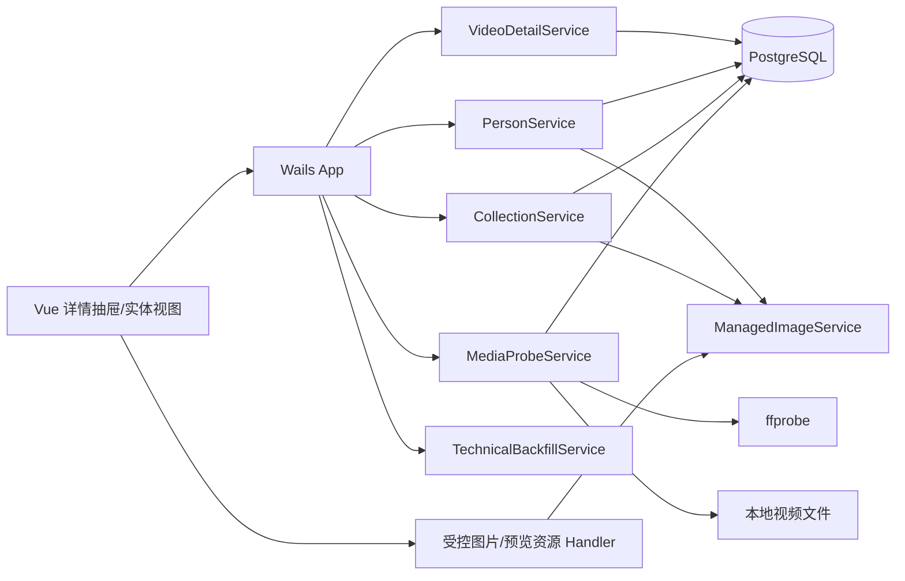
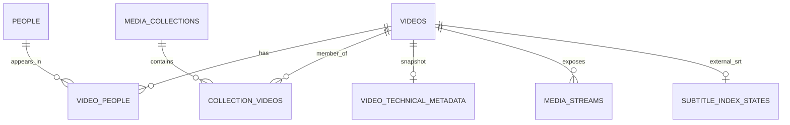

# 析微影策视频详情与结构化媒体信息设计文档

## 二、需求信息

### 2.1 需求背景

- 背景：当前片库已具备预览、观看状态、标签、字幕、保存视图和清理闭环，但视频模型只有基础文件与观看信息，缺少作品标题、个人评分、演员、作品集和详细媒体流信息。
- 需求目的：建立完整的本地视频详情读写面，同时保持源文件、片库查询、预览和回收站语义稳定。
- 目标用户/使用方：本地单用户桌面应用使用者。
- 需求链接：当前用户会话。
- 关联原始材料：`AI-CONTEXT.md`、同目录 `设计提案.md`。
- Intake package contract：`.loopx/intake/2026-07-30-video-details-metadata/requirements.md` 是 canonical `AC-*` / `TC-*`；`clarification.md` 仅保存问答证据。

### 2.2 需求范围

- 本期范围：单页详情抽屉；显示/原始标题；个人评分；人物与头像；作品集与封面及排序；人物/作品集片库视图；详细技术快照；评分筛选排序；旧库显式补全；回收站关系保留。
- 非目标：在线资料源、导演/角色/生日/人物简介、季集模型、人物自动合并、技术字段编辑、启动自动回填、人物显式删除。
- 决策边界：只新增本地数据、Wails 接口和受控资产；不改变磁盘文件真源、现有播放统计和删除安全边界。
- 依赖方：PostgreSQL、GORM、Wails、Vue、FFmpeg/ffprobe、现有字幕索引、预览资源 Handler、回收站。
- 约束条件：旧记录零破坏迁移；后台探测串行且可取消；详情打开不启动 ffprobe；所有图片路径必须由应用托管。
- 触发的辅助 skills：architecture-designer、sql-style、go-style。

### 2.3 可行性分析

- 业务可行性：字段和实体均来自用户确认；不依赖在线匹配或新凭证。
- 技术可行性：当前已使用 PostgreSQL/GORM AutoMigrate、ffprobe、资源 Handler、右侧抽屉和后台状态轮询，可以增量扩展。
- 团队接受能力：沿用现有 service/App/Vue 分层，无新语言、服务或部署单元。
- 资源成本：技术快照增加数据库行；头像和封面增加少量持久文件；批量探测产生可控磁盘 IO 和 ffprobe 子进程。
- 替代方案：JSONB 快照、独立全页、姓名唯一、启动回填均在设计提案中拒绝。
- 关键风险：nullable 评分稳定分页、流字段差异、托管文件与数据库的一致性、软删除成员排序、前端抽屉复杂度。

## 三、概要设计

### 3.1 方案总述

- 设计目标：把“预览一个文件”扩展为“查看和维护一个本地作品”，同时保持源文件和现有用户状态稳定。
- 总体思路：高频一对一描述字段放入 `videos`；人物、作品集和媒体流规范化建模；托管图片独立存储；技术探测保存最后成功快照；新页面使用增量 Wails API。
- 核心模块：`VideoDetailService`、`PersonService`、`CollectionService`、`MediaProbeService`、`ManagedImageService`、`TechnicalBackfillService`、Wails App、详情抽屉及实体浏览视图。
- 主要难点：跨数据库与文件系统补偿、探测时源文件变化、软删除关系保留、作品集稳定排序、评分键集分页。
- 技术指标：不虚构 SLO；所有列表 limit 上限 200；技术补全并发固定为 1；打开详情不得派生 ffprobe 子进程。

### 3.2 整体架构设计

- 业务模式：本地单用户媒体库；无新远程服务。
- 系统边界：Vue 调用 Wails App；Go service 访问 PostgreSQL、源视频、应用托管图片目录和 ffprobe。
- 上下游系统：上游只有用户输入和本地文件；下游只有 PostgreSQL、受控本地资源路由和 ffprobe 子进程。
- 应用架构：维持现有单体分层；详情领域新增聚合读取服务，不把文件系统逻辑放入 Vue 或 GORM hooks。
- 技术架构：PostgreSQL 记录用户意图和快照；源视频仍是技术信息真源；头像/封面是应用拥有的持久资产。
- 数据流转：详情读取只查数据库；显式刷新调用 probe；probe 成功事务替换快照；托管图片先落唯一新文件、事务切换引用、再清理旧文件。



### 3.3 核心流程设计

| 流程 | 触发条件 | 参与系统/模块 | 主流程 | 异常/补偿 | 输出 |
|---|---|---|---|---|---|
| 打开视频详情 | 用户点击详情/预览 | Vue、App、DetailService | 并行读取详情 DTO 与预览会话；抽屉连续渲染 | 技术快照缺失只显示空态，不触发探测 | 单页详情 |
| 保存描述信息 | 用户保存标题/评分/演员/作品集 | App、Detail/Person/Collection、PG | 校验；事务更新字段和关系；清理显式失联人物 | 任一校验或事务失败则不提交 | 更新后 DTO |
| 更新头像/封面 | 用户选择本地图片 | Wails dialog、ManagedImageService、PG | 验证并复制唯一新文件；事务切换路径；清理旧文件 | DB 失败删除新文件；旧文件删除失败返回明确错误并记录 | 新资源 URL |
| 刷新技术快照 | 导入、手动刷新或文件变化 | ProbeService、ffprobe、PG | 探测前后 stat；解析；事务替换 metadata/streams | 源变化或 ffprobe 失败只更新错误，不删除旧快照 | 新快照或错误状态 |
| 批量补全 | 用户显式启动 | BackfillService、ProbeService | 计算缺失/过期集合；串行处理；事件/轮询进度 | 取消停止当前命令和后续取件；成功项保留 | 可续跑状态 |
| 作品集重排 | 用户拖拽保存 | CollectionService、PG | 锁作品集；验证完整活跃成员集合；按已有活跃位置槽重排 | 冲突或成员变化时拒绝并返回最新详情 | 稳定顺序 |
| 软删除/恢复 | 现有回收站流程 | VideoService、PG | 只软删除/恢复 video；关系不动 | 恢复失败沿用现有回收站补偿 | 关系自动隐藏/恢复 |

### 3.4 功能模块

| 模块 | 职责 | 关键功能 | 依赖 | 备注 |
|---|---|---|---|---|
| VideoDetailService | 聚合视频详情 | 读写描述、关系、字幕与技术快照 | Video/Person/Collection/Probe models | 不负责文件对话框 |
| PersonService | 人物生命周期 | 搜索、创建、编辑、关联、显式失联清理 | PG、ManagedImageService | 姓名不唯一 |
| CollectionService | 作品集生命周期 | CRUD、成员关系、稳定排序 | PG、ManagedImageService | 活跃名称唯一 |
| MediaProbeService | 技术信息真源读取 | ffprobe、解析、指纹校验、事务替换 | 本地文件、PG | 接受 context |
| TechnicalBackfillService | 旧库补全 | 单 worker、状态、取消、续跑 | MediaProbeService | 不自动启动 |
| ManagedImageService | 托管图片 | 验证、复制、替换、删除补偿 | 应用数据目录 | 不接受 URL |
| DetailsDrawer | 单页详情交互 | 视频/人物/作品集详情与返回栈 | Wails API、Preview player | 无标签页 |
| EntityViews | 人物/作品集浏览 | 搜索、分页、打开详情 | Wails API | 与视频视图并列 |

### 3.5 新增/调整功能说明

- 视频列表主标题优先显示 `display_title`，文件名降为次要信息。
- 文件搜索扩展到显示标题、原始标题、文件名和路径。
- 片库筛选新增个人评分范围，排序新增评分升序/降序，保存视图保存上述状态。
- 现有预览抽屉升级为统一详情抽屉；字幕跳转和继续观看优先级保持不变。
- 片库增加人物与作品集浏览面，不把管理动作继续堆入现有视频工具栏。
- 设置或片库维护区增加显式“补全技术信息”任务入口。

### 3.6 专项设计检查

| 辅助 skill | 触发原因 | 检查内容 | 设计结论 |
|---|---|---|---|
| architecture-designer | 跨 DB/文件/子进程/前端 | 所有权、失败模式、恢复、NFR | 数据和文件所有权明确；详情读取与重任务隔离；回滚保留新增数据 |
| sql-style | schema、约束、分页、批处理 | nullable、唯一键、FK、索引、迁移和锁 | 纯增量迁移；评分键集游标显式处理 NULL；集合重排锁单行；回填可重复 |
| go-style | Go service、context 和并发 | 接口边界、错误、goroutine、测试 | service 按消费者边界拆分；探测 context-first；单 worker 有明确 Stop/Cancel；生成绑定不手改 |

## 四、详细设计

### 4.1 视频详情与片库查询详细设计

#### 4.1.1 需求内容

- 入口：视频列表/网格的详情或预览动作；人物/作品集中的关联视频。
- 操作人/调用方：本地用户、Vue 主片库。
- 前置条件：视频活跃且 ID 有效。
- 输出结果：聚合详情 DTO、更新后 DTO 或明确校验错误。

#### 4.1.2 方案设计

**Behavior Contract — D-001（AC-001）**：详情使用现有右侧区域的单页抽屉，按预览、描述信息、演员、作品集、技术信息顺序连续展示；内部滚动，关闭或切换详情不重置片库查询、滚动位置和已加载页。人物/作品集详情复用抽屉容器并使用内部返回栈，不引入页面路由。

**Data Contract — D-002（AC-002、AC-003）**：`videos` 增加非空 `display_title`、`original_title` 和 nullable `personal_rating`。空显示标题的有效展示值是 `name`；更新标题绝不调用 `RenameVideo` 或修改 `path/name`。

**Behavior Contract — D-003（AC-002、AC-004）**：评分接受 `nil` 或 0–10 的 0.5 倍数。服务端使用整数半分校验（`rating*2` 为 0–20 整数，带浮点容差），数据库增加同等 CHECK；0 与 NULL 不互换。

**Interface Contract — D-004（AC-003、AC-004）**：新增 `SearchLibraryVideoPage(request)`，请求 DTO 包含 `filter`、可省略的 `cursor` 和 `limit`，返回 `{videos,next_cursor}`。`LibraryFilter` 增加 `min_rating`、`max_rating`、`sort_mode`；枚举为 `balanced`、`rating_desc`、`rating_asc`。默认 `balanced` 委托现有排序。评分排序分别为 `personal_rating DESC/ASC NULLS LAST, id DESC`；游标显式带 `rating_is_null`，保证 NULL 段稳定分页。旧 `SearchLibraryVideos` 保留。

**Data Contract — D-005（AC-004）**：`saved_library_views` 增加 nullable 评分上下限和非空默认 `balanced` 的排序模式。评分范围上下限均为包含边界；设置任一边界后 NULL 评分不匹配。

- 幂等：以相同字段和关系重复保存得到同一终态；关系集合去重。
- 权限：本地 Wails 调用，不新增远程权限面。
- 异常：无效评分、无效实体 ID、已删除视频、关系中包含已删除实体均在事务前拒绝。
- 日志：只记录 video ID、变更字段名和关系数量，不记录用户输入正文。

#### 4.1.3 流程步骤

1. 前端打开抽屉，并行调用 `GetVideoDetails` 与现有 `GetPreviewSession`。
2. 服务聚合视频、标签、人物、活跃作品集、技术快照、流和外置字幕索引。
3. 用户编辑后调用 `UpdateVideoDetails`，请求携带三个描述字段及完整人物/作品集 ID 集合。
4. 服务校验并在事务中更新视频及关系；新加入作品集时追加到该作品集最后一个位置。
5. 返回最新聚合 DTO；前端窄 patch 当前列表项，若评分筛选/排序导致成员资格或位置改变则刷新当前视图。

#### 4.1.4 边界条件

| 场景 | 处理方式 | 用户/调用方感知 | 监控/告警 |
|---|---|---|---|
| 空显示标题 | 保存为空串并回退文件名 | 主标题仍有值 | 无 |
| 评分 0 与未评分 | 分别保存 0 和 NULL | UI 明确区分 | 单元测试 |
| 非半分评分 | 服务与 DB 双重拒绝 | 明确校验错误 | 前端错误日志 |
| 评分分页进入 NULL 段 | 游标设置 `rating_is_null=true` | 无重复、无漏项 | 分页测试 |
| 保存期间实体被删除 | 事务验证失败，不部分保存 | 刷新详情后重试 | 错误日志 |
| 技术信息缺失 | 展示“尚未读取”及刷新入口 | 详情其他区块可用 | 无 |
| 预览不可用 | 沿用外部预览或占位 | 详情其余内容仍可编辑 | 既有日志 |
| 旧前端/旧调用 | 继续调用旧接口 | 行为不变 | 兼容测试 |

#### 4.1.5 不变行为

| 行为/表面 | 保持不变的原因 | 验证方式 |
|---|---|---|
| 文件名与路径由 Rename/Move 管理 | 显示标题不是文件操作 | video/file migration tests |
| 默认 balanced 排序与游标 | 现有大库稳定性契约 | library_service tests |
| 字幕 seek 优先于续播 | 已批准观看行为 | subtitle-seek/library-2 tests |
| 播放统计仅成功后写入 | 可靠性契约 | playback tests |

### 4.2 人物与头像详细设计

#### 4.2.1 需求内容

- 入口：视频详情演员选择器、人物视图和人物详情。
- 操作人/调用方：本地用户。
- 前置条件：关联视频活跃；人物编辑时人物存在。
- 输出结果：人物 DTO、关联视频页或更新后视频详情。

#### 4.2.2 方案设计

**Data Contract — D-006（AC-005、AC-007）**：`people` 保存 `display_name`、`original_name`、`avatar_path`，姓名不唯一；`video_people` 只保存 `(video_id,person_id)`。人物不使用软删除。显式删除最后一个关系时，在同一事务内确认全库不存在任何关系后硬删除人物；视频软删除不删除 join row，因此不会触发清理。

**Behavior Contract — D-007（AC-005）**：创建人物前，UI 使用显示/原始名称搜索相似候选；服务不自动合并、不把相似候选当冲突。选择器展示头像、原始名称和活跃关联视频数量。

**Operational Contract — D-008（AC-006）**：头像只接受本地常规文件，限制 JPEG/PNG/WebP 且不超过 20 MiB。新文件使用实体 ID 与内容摘要生成唯一名称并保存到 `media-details/people/{id}/`。更新流程为“写入唯一新文件 → DB 事务切换相对路径 → 清理旧文件”；DB 失败删除新文件，旧文件清理失败返回明确错误并保留无引用文件供日志定位。资源路由不暴露数据库路径。

- 人物显示名称必填、trim 后不超过 200 rune；原始名称可空且同限。
- 幂等关联：重复添加使用 `ON CONFLICT DO NOTHING`。
- 头像同内容重复设置仍产生同一摘要目标；已存在且内容一致可复用。

#### 4.2.3 流程步骤

1. 用户输入姓名，前端查询 `ListPeople` 并显示候选。
2. 用户复用或调用 `CreatePerson` 明确新建。
3. `UpdateVideoDetails` 计算人物关系增删集合并在事务中写入。
4. 删除关系后，对被移除人物执行关系存在性检查；确实无关系才删除人物。
5. 点击人物打开详情，活跃视频使用键集分页返回；软删除视频不显示。

#### 4.2.4 边界条件

| 场景 | 处理方式 | 用户/调用方感知 | 监控/告警 |
|---|---|---|---|
| 同名人物 | 允许新建 | 候选提示但不阻止 | 无 |
| 空显示名称 | 拒绝 | 字段错误 | 无 |
| 并发移除最后关系 | 事务内删除关系后重新计数 | 最多一个删除成功 | DB 错误日志 |
| 只关联软删除视频 | join row 仍存在，不清理人物 | 人物视图暂时无活跃视频 | 无 |
| 头像路径是目录/软链逃逸 | 拒绝或只读取最终常规源文件并复制内容 | 明确错误 | 安全日志 |
| DB 更新失败 | 删除新托管文件，保留旧引用 | 头像不变 | 补偿失败日志 |
| 头像缺失 | Handler 404，前端占位 | 人物仍可使用 | 资源错误日志 |

#### 4.2.5 不变行为

| 行为/表面 | 保持不变的原因 | 验证方式 |
|---|---|---|
| 标签仍是内容分类 | 人物不是标签命名空间 | tag tests |
| AI 标签不会创建人物 | 本期无在线/自动人物识别 | AI tagging tests |
| 视频软删除可恢复 | 关系必须保留 | trash tests + TC-007 |

### 4.3 作品集与成员排序详细设计

#### 4.3.1 需求内容

- 入口：作品集视图、视频详情的作品集选择器、作品集详情。
- 操作人/调用方：本地用户。
- 前置条件：作品集活跃；成员视频存在。
- 输出结果：作品集详情、成员顺序或删除结果。

#### 4.3.2 方案设计

**Data Contract — D-009（AC-008）**：`media_collections` 保存名称、规范化名称、简介、封面路径和软删除时间。规范化规则为 trim 后 lowercase；活跃 `normalized_name` 唯一。创建同名软删除记录时创建新 ID，不恢复旧记录。

**Data Contract — D-010（AC-008、AC-009、AC-014）**：`collection_videos` 保存 `(collection_id,video_id,position)`。视频可属于多个作品集。视频软删除不删除关系。显式删除作品集在事务中删除全部关系并软删除作品集；成功后清理封面，不触碰视频。

**Behavior Contract — D-011（AC-009）**：每次成员变更在事务中锁定作品集行。新增成员追加到最大 position 后；显式移除后压缩活跃与隐藏成员组成的完整序列。重排请求必须精确包含当前全部活跃成员且无重复；服务把新顺序映射到活跃成员原有 position 槽，隐藏成员保留 position，确保恢复后回到原槽位。

**Operational Contract — D-012（AC-008）**：封面使用与头像相同的托管和补偿算法，目录为 `media-details/collections/{id}/`；允许 JPEG/PNG/WebP、最大 20 MiB。无封面时展示固定占位，不自动选择在线或视频帧封面。

- 作品集名称必填且不超过 200 rune；简介不超过 4000 rune。
- 删除重复请求：第二次返回 not found，不触碰任何视频。

#### 4.3.3 流程步骤

1. 创建时规范化名称并依赖数据库活跃唯一索引裁决并发冲突。
2. 从视频详情加入作品集时锁定作品集并追加成员；从详情移除时删除关系并重排完整序列。
3. 作品集详情查询活跃成员并按 position、video_id 返回。
4. 拖拽保存提交活跃成员完整 ID 列表；服务校验版本和成员集合后更新位置。
5. 删除作品集事务删除关系并软删除主记录，提交后清理封面。

#### 4.3.4 边界条件

| 场景 | 处理方式 | 用户/调用方感知 | 监控/告警 |
|---|---|---|---|
| 大小写/空格同名 | 规范化后冲突 | 明确“名称已存在” | 唯一约束错误分类 |
| 删除后新建同名 | 生成新 ID | 新空作品集 | 无 |
| 重排含缺失/重复 ID | 整体拒绝 | 刷新后重试 | 冲突日志 |
| 重排时另一操作改成员 | 行锁和成员集合校验拒绝陈旧请求 | 显示冲突 | 冲突计数日志 |
| 成员视频软删除 | 查询隐藏但关系/position 保留 | 恢复后重新出现 | 无 |
| 删除作品集封面清理失败 | DB 终态保持删除，返回清理错误 | 视频不受影响 | 文件清理错误日志 |
| 同一视频加入多个作品集 | 独立关系 | 均正常显示 | 关系测试 |

#### 4.3.5 不变行为

| 行为/表面 | 保持不变的原因 | 验证方式 |
|---|---|---|
| 目录与扫描目录不由作品集管理 | 作品集是逻辑编排 | directory/file migration tests |
| 删除视频仍走回收站 | 作品集不拥有视频文件 | trash tests |
| 保存视图仍是筛选定义 | 作品集不是保存视图 | library tests |

### 4.4 技术快照与 ffprobe 详细设计

#### 4.4.1 需求内容

- 入口：新视频导入、元数据刷新、检测到文件变化、详情手动刷新、后台补全。
- 操作人/调用方：VideoService、用户、BackfillService。
- 前置条件：视频活跃且源文件是可读常规文件。
- 输出结果：成功快照和流记录，或保留旧快照的失败状态。

#### 4.4.2 方案设计

**Data Contract — D-013（AC-011、AC-012）**：`video_technical_metadata` 是视频一对一探测状态，分别保存“最后成功快照”的源大小/mtime/时间与“最后一次尝试”的时间/错误。`media_streams` 以 `(video_id,stream_index)` 唯一，保存类型及类型相关字段。外置 SRT 不复制进流表，详情实时聚合现有 `SubtitleIndexState`。

**Interface Contract — D-014（AC-011、AC-012）**：探测命令固定为参数数组调用 `ffprobe -v error -show_format -show_streams -print_format json <path>`，不经过 shell。解析允许缺失字段；无法可靠获得的位深、码率、语言或 HDR 显示 unknown，不推测。HDR 仅由明确 transfer/primaries 字段派生。

**State Contract — D-015（AC-012）**：探测前后分别 stat；大小或 mtime 变化则以 `source_changed_during_probe` 失败，不写成功快照。成功时一个事务更新 metadata、删除旧 streams、插入新 streams，并同步 `videos.size/duration/resolution/width/height`。失败时只 upsert `last_attempt_at/last_error`，不改成功指纹、streams 或基础元数据。

**Behavior Contract — D-016（AC-011）**：打开详情只读数据库，不触发探测。快照不存在显示未读取；成功指纹与当前文件不一致显示已过期；存在错误同时展示最后成功时间和最后错误。

- mtime 使用 Unix 纳秒；bit_rate、sample_rate 等数值解析为 int64，非法或溢出保存 NULL。
- avg_frame_rate/r_frame_rate 保留原始有理数字符串，展示层安全计算小数；分母 0 显示 unknown。
- stream 类型只接受 video/audio/subtitle；attachment/data 流忽略但不视为失败。
- context 取消必须终止 ffprobe 子进程并返回 cancelled，不覆盖旧快照。

#### 4.4.3 流程步骤

1. 读取视频记录并对真实路径 stat，构造 attempt fingerprint。
2. 使用 context 启动 ffprobe，限制 stdout 最大 16 MiB，stderr 日志片段最大 4 KiB。
3. 解析 format 和 streams，选择首个非 attached-pic 视频流同步现有基础字段。
4. 再次 stat；文件变化则丢弃结果。
5. 成功事务替换快照和流；失败窄更新 attempt 状态。

#### 4.4.4 边界条件

| 场景 | 处理方式 | 用户/调用方感知 | 监控/告警 |
|---|---|---|---|
| ffprobe 不存在 | 记录依赖错误，不阻止导入 | 技术信息未读取 | 错误计数 |
| 非法 JSON/超大输出 | 拒绝快照 | 保留旧值并显示错误 | probe 错误日志 |
| 多视频流含封面 | 跳过 attached_pic 选择主视频流；所有受支持视频流仍保存 | 技术区按流展示 | fixture 测试 |
| 缺失 duration/bitrate | 保存 NULL，不伪造 0 | 显示未知 | 无 |
| 文件探测中变化 | 丢弃 | 提示文件发生变化，可重试 | source_changed 日志 |
| DB 插入部分失败 | 事务回滚，旧快照完整保留 | 显示失败 | DB 错误日志 |
| 外置 SRT 无可识别语言 | language=unknown | 仍显示路径和索引信息 | 无 |
| 软删除视频 | 不自动探测 | 详情不可操作 | 无 |

#### 4.4.5 不变行为

| 行为/表面 | 保持不变的原因 | 验证方式 |
|---|---|---|
| 字幕段落仍由现有索引拥有 | 技术快照不复制正文 | subtitle search tests |
| 预览 MIME/Range 行为 | 流快照不改变媒体服务 | preview tests |
| AI 临时字幕不持久化 | 本期不改变隐私边界 | AI agent tests |

### 4.5 技术信息后台补全详细设计

#### 4.5.1 需求内容

- 入口：片库维护入口“补全技术信息”。
- 操作人/调用方：本地用户。
- 前置条件：没有正在运行的同类任务。
- 输出结果：进度状态、逐项持久快照和失败统计。

#### 4.5.2 方案设计

**Operational Contract — D-017（AC-013）**：`TechnicalBackfillService` 进程内只允许一个 worker，并发固定 1。启动时查询活跃且没有成功快照或成功指纹与当前 stat 不同的视频 ID；任务状态包含 running、cancelled、completed、total、processed、succeeded、skipped、failed、current_video_id/name、started_at、updated_at 和最多 50 条失败摘要。

**Workflow Contract — D-018（AC-013）**：任务只由显式 Wails 方法启动，不在 startup、schema migration 或详情读取中隐式触发。取消 context 后停止当前 probe 和后续取件；成功结果已逐项提交。应用重启不恢复内存状态，但重新启动会依据已持久化成功指纹跳过完成项，从数据层实现续跑。

- 重复 Start 在运行中返回当前快照，不启动第二 worker。
- 单个失败不中止全批；取消不记为失败。
- 每项完成后发 `technical-backfill-state` 事件，同时保留轮询 API。

#### 4.5.3 流程步骤

1. Start 获取互斥状态并加载候选 ID 快照。
2. worker 逐 ID 重新加载记录并 stat；已变为最新或已删除则 skipped。
3. 调用 `MediaProbeService.Refresh(ctx,id)`。
4. 更新计数与有限失败摘要并发事件。
5. 完成或取消后释放 worker 所有权；状态保留到下一次 Start。

#### 4.5.4 边界条件

| 场景 | 处理方式 | 用户/调用方感知 | 监控/告警 |
|---|---|---|---|
| 空候选 | 立即 completed | 0 项需补全 | 无 |
| 重复启动 | 返回现有状态 | 不重复工作 | 单 worker 测试 |
| 运行中删除视频 | 重新加载后 skipped | 计入跳过 | 无 |
| ffprobe 连续失败 | 逐项失败并继续 | 失败数和摘要 | 错误计数 |
| 取消 | 终止当前命令，停止取件 | cancelled，可再次启动 | 取消测试 |
| 应用崩溃 | 内存状态丢失，成功数据保留 | 再次启动继续缺失项 | 数据续跑测试 |
| 外置硬盘离线 | 对应项失败，不标 stale | 失败摘要 | 现有扫描负责 stale |

#### 4.5.5 不变行为

| 行为/表面 | 保持不变的原因 | 验证方式 |
|---|---|---|
| 应用启动不扫描全库 | 用户明确确认 | startup tests |
| 字幕队列仍独立串行 | 本期不统一所有任务模型 | subtitle queue tests |
| Cleanup 状态不受影响 | 独立资源所有者 | cleanup tests |

### 4.6 托管资源、软删除与兼容详细设计

#### 4.6.1 需求内容

- 入口：头像/封面显示与替换，视频软删除/恢复，旧数据库升级。
- 操作人/调用方：详情 UI、资源 Handler、现有 VideoService、database.Init。
- 前置条件：应用数据目录可写，数据库迁移成功。
- 输出结果：受控图片响应、完整关系恢复、兼容 schema。

#### 4.6.2 方案设计

**Interface Contract — D-019（AC-006、AC-008）**：新增 GET/HEAD `/preview/person-avatar/{id}` 与 `/preview/collection-cover/{id}`。Handler 只按实体 ID 查询相对路径，使用 `filepath.Rel`/真实路径检查确保目标位于 `~/.video-master/media-details`，并通过 `ServeContent` 返回；其他方法 405，缺失 404。

**Compatibility Contract — D-020（AC-014、AC-015）**：视频软删除不级联删除 `video_people` 或 `collection_videos`。人物/作品集的活跃视频查询显式过滤 `videos.deleted_at IS NULL`。恢复不执行关系重建。新增列/表纯增量；不做破坏 DML；旧二进制可忽略新增结构。

**Security Contract — D-021（AC-016）**：详情、人物、作品集、图片和技术探测不包含任何 HTTP 客户端、在线 endpoint 或第三方 API 配置。所有来源必须是本地 Wails 文件选择、现有数据库或被管理视频路径。

- 数据库关键 CHECK、唯一索引和 FK 创建失败必须使 Init 返回错误，不能只写日志继续运行。
- 图片目录创建权限沿用应用数据目录；文件默认 0644，目录 0755，与当前本地单用户策略一致。

#### 4.6.3 流程步骤

1. `AutoMigrate` 创建列和表，再由 `ensureMediaDetailConstraints` 幂等创建关键 CHECK、部分唯一索引和查询索引。
2. 启动不回填技术快照，也不创建人物/作品集数据。
3. 资源请求解析 ID、加载当前相对路径、验证托管根并返回文件。
4. 现有软删除/恢复只改变 video 终态，新关系随查询过滤自然隐藏/恢复。

#### 4.6.4 边界条件

| 场景 | 处理方式 | 用户/调用方感知 | 监控/告警 |
|---|---|---|---|
| 旧 DB 无新列 | AutoMigrate 增量添加空值 | 旧视频正常使用 | migration error |
| 关键索引创建失败 | 启动失败并给出明确错误 | 不进入约束不完整状态 | startup error |
| DB 相对路径越界 | Handler 拒绝 | 图片占位 | security log |
| 图片文件被外部删除 | 404，不删除实体 | 占位，可重新设置 | resource log |
| 代码回滚 | 新表/列和文件保留 | 旧 UI 不显示新信息 | rollback smoke |
| 无网络环境 | 所有功能正常 | 无额外配置 | TC-016 |
| 永久硬删除视频 | FK cascade 清理 join/streams | 不影响其他视频或实体；人物孤儿清理由显式维护路径处理 | DB integration test |

#### 4.6.5 不变行为

| 行为/表面 | 保持不变的原因 | 验证方式 |
|---|---|---|
| 回收站状态机与文件补偿 | 已有安全边界 | video_service trash tests |
| 缩略图缓存独立 | 头像/封面是用户资产而非派生缩略图 | thumbnail tests |
| PostgreSQL 是唯一运行时数据库 | 已批准迁移决策 | database tests |

## 五、存储类设计

### 5.1 库表设计

#### 5.1.1 数据库模型图



#### 5.1.2 表结构

| 表名 | 用途 | 主键 | 关键索引 | 数据量预估 | 备注 |
|---|---|---|---|---|---|
| videos | 增加标题与评分 | id | rating+id、现有路径/视图索引 | 现有规模 | 增量列 |
| people | 可复用演员 | id | lower(display/original)+id | 人物数量 | 姓名不唯一 |
| video_people | 视频—人物关系 | video_id+person_id | person_id+video_id | 关系数量 | 无角色/顺序 |
| media_collections | 通用作品集 | id | active normalized_name unique | 作品集数量 | 软删除 |
| collection_videos | 有序成员 | collection_id+video_id | collection_id+position+video_id、video_id | 关系数量 | 保留软删除视频关系 |
| video_technical_metadata | 探测成功/尝试状态 | video_id | success fingerprint | 视频数量 | 一对一 |
| media_streams | ffprobe 流快照 | id | video_id+stream_index unique、video_id+type | 流数量 | 成功时整组替换 |

`videos` 新字段：

| 字段 | 类型 | 是否必填 | 默认值 | 含义 | 来源/取值逻辑 | 备注 |
|---|---|---|---|---|---|---|
| display_title | varchar(255) | 是 | '' | 用户显示标题 | 手工 | 空则回退 name |
| original_title | varchar(255) | 是 | '' | 原始标题 | 手工 | 可空 |
| personal_rating | numeric(3,1) | 否 | NULL | 个人评分 | 手工 | CHECK 0..10 且 0.5 步进 |

`people`：

| 字段 | 类型 | 是否必填 | 默认值 | 含义 | 来源/取值逻辑 | 备注 |
|---|---|---|---|---|---|---|
| id | bigserial | 是 | sequence | 主键 | DB | 与现有 uint 映射一致 |
| display_name | varchar(200) | 是 | - | 显示名称 | 手工 trim | 不唯一 |
| original_name | varchar(200) | 是 | '' | 原始名称 | 手工 trim | 不唯一 |
| avatar_path | text | 是 | '' | 托管相对路径 | ManagedImageService | 不返回绝对路径 |
| created_at/updated_at | timestamptz | 是 | now | 时间 | GORM | - |

`media_collections`：

| 字段 | 类型 | 是否必填 | 默认值 | 含义 | 来源/取值逻辑 | 备注 |
|---|---|---|---|---|---|---|
| id | bigserial | 是 | sequence | 主键 | DB | - |
| name | varchar(200) | 是 | - | 展示名称 | 手工 trim | - |
| normalized_name | varchar(200) | 是 | - | 唯一比较键 | lower(trim(name)) | 活跃唯一 |
| description | text | 是 | '' | 简介 | 手工 | <=4000 rune |
| cover_path | text | 是 | '' | 托管相对路径 | ManagedImageService | - |
| created_at/updated_at/deleted_at | timestamptz | 见语义 | - | 生命周期 | GORM | soft delete |

`collection_videos`：

| 字段 | 类型 | 是否必填 | 默认值 | 含义 | 来源/取值逻辑 | 备注 |
|---|---|---|---|---|---|---|
| collection_id | bigint | 是 | - | 作品集 | FK | 复合 PK |
| video_id | bigint | 是 | - | 视频 | FK | 复合 PK |
| position | integer | 是 | - | 完整成员顺序 | service | >0 |
| created_at/updated_at | timestamptz | 是 | now | 时间 | GORM | - |

`video_technical_metadata`：

| 字段 | 类型 | 是否必填 | 默认值 | 含义 | 来源/取值逻辑 | 备注 |
|---|---|---|---|---|---|---|
| video_id | bigint | 是 | - | 视频主键 | FK | PK/unique |
| format_name/format_long_name | text | 是 | '' | 容器 | ffprobe format | - |
| total_bit_rate | bigint | 否 | NULL | 总码率 bps | ffprobe | - |
| successful_source_size | bigint | 否 | NULL | 成功快照文件大小 | stat | - |
| successful_source_mod_time_ns | bigint | 否 | NULL | 成功快照 mtime | stat | - |
| probed_at | timestamptz | 否 | NULL | 最后成功时间 | service | - |
| last_attempt_source_size/mod_time_ns | bigint | 否 | NULL | 最近尝试指纹 | stat | - |
| last_attempt_at | timestamptz | 否 | NULL | 最近尝试时间 | service | - |
| last_error | text | 是 | '' | 最近错误 | sanitized error | 成功清空 |
| created_at/updated_at | timestamptz | 是 | now | 时间 | GORM | - |

`media_streams` 保留共同字段 `video_id/stream_index/stream_type/codec_name/codec_long_name/profile/bit_rate/language/title/is_default`，视频字段 `width/height/avg_frame_rate/r_frame_rate/pixel_format/bits_per_raw_sample/color_range/color_space/color_transfer/color_primaries/is_hdr/is_attached_pic`，音频字段 `sample_rate/channels/channel_layout`；不适用字段为 NULL 或空串。

### 5.2 数据迁移/初始化

- DDL：`AutoMigrate` 扩展列/表；`ensureMediaDetailConstraints` 使用幂等 SQL 创建评分 CHECK、作品集活跃唯一索引、关系索引和分页索引。
- DML：不回填标题、评分、人物、作品集或技术快照。
- 数据回填：只有用户显式启动技术补全任务才运行 ffprobe；成功逐条提交。
- 老数据兼容：新增 string 为 ''、评分为 NULL、关系和快照缺失；现有查询默认行为不变。
- 新老系统读写关系：旧接口不写新字段；新接口不改旧文件字段。技术刷新成功同时维护现有基础元数据，保证单一文件事实。
- 关键索引：`videos(personal_rating DESC,id DESC) WHERE deleted_at IS NULL`、`media_collections(normalized_name) WHERE deleted_at IS NULL` unique、`collection_videos(collection_id,position,video_id)`、`video_people(person_id,video_id)`、`media_streams(video_id,stream_index)` unique。
- 事务：视频详情字段与关系一次提交；技术流整组替换；作品集成员更新锁定作品集行。

### 5.3 缓存设计

| 场景 | Key | Value | 数据结构 | 过期时长 | 容量预估 | 失效/刷新策略 |
|---|---|---|---|---|---|---|
| 技术快照 | video_id | format + streams | PostgreSQL rows | 无 TTL | 每视频 1+N rows | 文件 size/mtime 变化即过期 |
| 人物头像 | person ID + content digest | 原图片副本 | 文件 | 无 TTL | 每人物至多 1 个活跃文件 | 替换/移除/人物清理 |
| 作品集封面 | collection ID + content digest | 原图片副本 | 文件 | 无 TTL | 每作品集至多 1 个活跃文件 | 替换/移除/作品集删除 |

## 六、其他组件设计

### 6.3 定时任务/批处理

| 任务 | 触发时间 | 处理范围 | 幂等 | 失败重试 | 影响评估 |
|---|---|---|---|---|---|
| 技术信息补全 | 用户显式启动 | 活跃且缺失/过期视频 | 成功指纹跳过 | 用户再次启动续跑；单项失败继续 | 串行 ffprobe，可能唤醒外置硬盘 |

### 6.4 技术组件

- 分布式锁：不涉及；单进程使用 service mutex，作品集写入使用 PostgreSQL 行锁。
- 唯一 ID：沿用 PostgreSQL/GORM 自增 uint ID。
- 加解密/验签：不涉及；无网络与敏感凭证。
- 文件处理：`exec.CommandContext` 调 ffprobe；托管图片使用独占目标、常规文件检查和路径根验证。
- 限流/熔断：不涉及远程依赖；后台并发固定 1，详情 API 不触发探测。

## 七、接口设计

### 7.1 接口设计原则

- 保留现有 Wails 方法；新增方法使用 PascalCase，JSON 使用 snake_case。
- DTO 不返回托管绝对路径，图片只返回受控资源 URL。
- 所有修改接口服务端校验；批量/重排请求整体原子。
- 前端生成绑定以 Go 源为真，统一重新生成，不手工修改 `wailsjs`。
- 错误沿用当前 Go error 到 Wails Promise rejection 形式，但服务内部保留可 `errors.Is` 的 not-found/conflict/cancelled 分类。

### 7.2 接口清单

| 接口 | 调用方 | 服务方 | 权限/认证 | 幂等 | 文档地址 | 备注 |
|---|---|---|---|---|---|---|
| GetVideoDetails | 详情抽屉 | App/DetailService | 本地 Wails | 查询 | 本文 | 不触发 ffprobe |
| UpdateVideoDetails | 详情抽屉 | App/DetailService | 本地 Wails | 终态幂等 | 本文 | 字段+关系事务 |
| SearchLibraryVideoPage | 视频视图 | App/VideoService | 本地 Wails | 查询 | 本文 | 新稳定游标 |
| ListPeople/GetPersonDetail/CreatePerson/UpdatePerson | 人物 UI | App/PersonService | 本地 Wails | 查询/终态 | 本文 | 无 DeletePerson |
| SelectPersonAvatar/SetPersonAvatar/RemovePersonAvatar | 人物 UI | App/ImageService | 本地 Wails | 终态 | 本文 | Select 只选路径，Set 托管 |
| ListCollections/GetCollectionDetail/Create/Update/DeleteCollection | 作品集 UI | App/CollectionService | 本地 Wails | 查询/终态 | 本文 | delete 不删视频 |
| Set/RemoveCollectionCover | 作品集 UI | App/ImageService | 本地 Wails | 终态 | 本文 | 托管图片 |
| Add/RemoveCollectionVideo/ReorderCollectionVideos | 作品集 UI | App/CollectionService | 本地 Wails | 终态/完整序列 | 本文 | 行锁 |
| RefreshVideoTechnicalMetadata | 详情抽屉 | App/ProbeService | 本地 Wails | 以当前文件为终态 | 本文 | 可取消 context |
| Start/Get/CancelTechnicalBackfill | 维护 UI | App/BackfillService | 本地 Wails | 单 worker | 本文 | 事件+轮询 |
| person-avatar/collection-cover asset routes | WebView | asset handler | 本地 WebView | GET/HEAD | 本文 | 仅实体 ID |

### 7.3 接口明细

#### 7.3.1 GetVideoDetails / UpdateVideoDetails

- 路径/方法：Wails `GetVideoDetails(videoID)`；`UpdateVideoDetails(input)`。
- 请求参数：更新请求包含 `video_id`、`display_title`、`original_title`、nullable `personal_rating`、去重后的 `person_ids`、`collection_ids`。
- 响应参数：`VideoDetailsDTO` 包含 video、display fields、people、collections、technical metadata、streams、external_subtitle、technical_status。
- 错误：invalid input、not found、relation target not found、rating invalid、transaction failed。
- 数据变更：视频列和关系在一个事务中更新；新作品集关系追加；显式失联人物按 D-006 清理。

#### 7.3.2 SearchLibraryVideoPage

- 请求参数：`LibraryVideoPageRequest` 包含扩展 `LibraryFilter`、可省略 cursor、limit 1–200；省略 cursor 表示第一页。
- 响应参数：`items` 和 opaque-shaped `next_cursor` DTO；调用方不得自行改写游标字段。
- 校验：cursor sort_mode 必须与 filter sort_mode 一致；不完整游标拒绝。
- 数据变更：无。

#### 7.3.3 人物接口

- `ListPeople(keyword,cursor,limit)` 按 `LOWER(display_name),id` 稳定分页，返回 active_video_count。
- `GetPersonDetail(id,cursor,limit)` 返回人物及活跃关联视频页。
- `CreatePerson` 不以同名为冲突；`UpdatePerson` 只更新名称。
- 头像选择通过 Wails file dialog；Set/Remove 调用托管文件流程。
- 不暴露 `DeletePerson`。

#### 7.3.4 作品集接口

- `ListCollections(keyword,cursor,limit)` 按 `normalized_name,id` 稳定分页。
- `Create/UpdateCollection` 依赖规范化活跃唯一索引返回 conflict。
- `ReorderCollectionVideos(collectionID,activeVideoIDs)` 要求完整活跃成员集合。
- `DeleteCollection` 删除关系并软删除集合；提交后删除封面。

#### 7.3.5 技术探测与补全接口

- `RefreshVideoTechnicalMetadata(videoID)` 同步等待单视频探测，返回 `TechnicalMetadataDTO` 或错误状态；不清空旧快照。
- `StartTechnicalBackfill()` 返回当前/新任务状态；`GetTechnicalBackfillStatus()` 查询；`CancelTechnicalBackfill()` 无任务时返回 not found。
- 事件：`technical-backfill-state`，payload 与状态 DTO 相同。

## 八、系统发布

### 8.2 降级方案

- 技术探测不可用时，详情继续展示描述、人物、作品集和上一份快照；新视频仍可导入。
- 托管图片不可用时显示占位，不阻塞实体或视频详情。
- 新详情查询失败时，现有视频列表、播放、外部预览和文件操作仍可使用。

### 8.3 关联系统/功能影响

| 系统/功能 | 影响 | 依赖动作 | 负责人 | 验证方式 |
|---|---|---|---|---|
| 主片库 | 新标题、评分筛选排序、三视图 | 新分页 API 和 UI | 当前实现者 | TC-001..004、TC-010 |
| 预览抽屉 | 扩展为详情抽屉 | 保留播放器时序 | 当前实现者 | subtitle seek/preview tests |
| 扫描/导入 | 成功后尝试详细探测 | 探测失败不阻止导入 | 当前实现者 | TC-012、现有 scan tests |
| 回收站 | 新关系保留 | 查询过滤 deleted_at | 当前实现者 | TC-007、TC-014 |
| Wails bindings | 新增方法与 DTO | 统一重新生成 | 当前实现者 | build + generated diff |

### 8.4 回滚方案

- 回滚条件：新详情导致主片库不可用、迁移失败或关系/托管文件出现一致性缺陷。
- 回滚步骤：回退应用代码；保留新增表、列和托管文件；旧二进制继续使用旧接口。
- 数据回滚：不执行 DROP 或清空；采用前向修复。
- 配置回滚：无新增配置。
- 风险：旧 UI 不显示新标题和评分，但文件、标签、观看状态和新数据本身不丢失。

## 九、系统监控与维护

### 9.1 监控与告警

- 系统异常：schema/关键约束创建失败作为启动错误。
- 业务异常：记录人物/作品集冲突、托管文件补偿失败、probe parse/source-change 错误数量。
- 重试异常：补全状态保留最多 50 条失败摘要，完整错误写脱敏日志。
- 超时：ffprobe 由用户取消/应用 context 控制；不设置虚构固定超时。
- 关键接口指标：详情聚合耗时、单次 probe 耗时、补全成功/失败/跳过数。
- 告警渠道：本地日志与 UI 状态；本项目没有远程告警系统。

### 9.2 性能与容量

- 详情查询使用有限 preload/显式 DTO，不加载人物或作品集的全库视频。
- 人物和作品集列表使用键集分页，limit 最大 200，默认 20。
- 评分排序使用 partial index；实现后用本地代表性数据执行 `EXPLAIN ANALYZE`，无证据前不宣称性能提升。
- 补全并发 1，stdout 上限 16 MiB，失败摘要上限 50。
- 托管图片单文件最大 20 MiB；无自动网络下载。

### 9.3 可靠性与兜底

- 幂等击穿：关系复合主键、作品集规范化唯一索引和单 worker mutex 为最终裁决。
- 并发失效：作品集成员更新锁定主记录并校验完整集合。
- 关键任务独立性：详情读取不依赖 probe worker；单视频刷新与批量 worker通过同视频互斥避免并发替换。
- 字段兜底：缺失流字段用 unknown；不从文件名以外来源猜测人物或作品信息。
- 老新数据兼容：空详情字段、无快照和无实体关系都是合法状态。

## 十、排期与规划

### 10.4 遗留问题与后续规划

| 问题 | 影响 | 处理计划 | 负责人 | 截止时间 |
|---|---|---|---|---|
| 在线影视资料匹配 | 本期不提供自动填充 | 如后续需要，重新 clarify/spec 数据来源、匹配和隐私 | 待定 | 待定 |
| 导演/角色/季集模型 | 本期无法表达这些关系 | 有明确使用场景后独立设计 | 待定 | 待定 |
| 人物合并 | 同一人物可能被重复创建 | 基于真实重复数据另立需求，不自动合并 | 待定 | 待定 |

### 10.5 Planning Handoff

- `plan2exec` 可以决定：文件拆分、内部 helper 命名、DTO 组装顺序、Vue 子组件拆分、测试夹具实现、提交切片和局部样式。
- 必须返回 `spec` 的事项：改变表关系、评分游标语义、作品集排序/删除、技术快照失败覆盖规则、托管图片所有权、回滚策略或旧接口兼容。
- 必须返回 `clarify` 的事项：增加在线数据、导演/角色/季集、人物删除/合并、自动启动回填、技术字段手工编辑或改变详情为独立全页。
- 推荐下一步：

```text
$plan2exec docs/loopx/design/2026-07-30-video-details-metadata/需求设计文档.md
```

## 十一、QA

### 11.2 待确认问题

| 问题 | 需要谁确认 | 阻塞阶段 | 推荐答案 | 状态 |
|---|---|---|---|---|
| 产品与数据边界 | 用户 | clarify/spec | 使用本 intake 已确认边界 | closed |
| 详细设计方向 | 用户/评审者 | spec | 采用同目录已接受提案 | closed |

### 11.3 Verification Strategy / TC 覆盖映射

| TC | Source AC | Related D anchors | 设计级验证策略 | 自动化/人工 | Deferred rationale |
|---|---|---|---|---|---|
| TC-001 | AC-001, AC-003 | D-001, D-002 | Vue 组件行为测试抽屉连续布局、上下文与标题 fallback | automation + manual visual | 无 |
| TC-002 | AC-002 | D-003 | Go 表驱动校验 + DB CHECK 集成测试 | automation | 无 |
| TC-003 | AC-003 | D-002, D-004 | PostgreSQL 查询测试四种字段命中 | automation | 无 |
| TC-004 | AC-004 | D-003, D-004, D-005 | NULL/0/半分评分键集分页、范围和保存视图测试 | automation | 无 |
| TC-005 | AC-005 | D-006, D-007 | 同名候选、复用与明确新建 service/UI 测试 | automation | 无 |
| TC-006 | AC-006 | D-008, D-019 | 临时目录测试导入/替换/移除及资源路由 | automation | 原生文件选择器只做人工 smoke |
| TC-007 | AC-007, AC-014 | D-006, D-020 | 软删除隐藏、恢复、显式失联清理事务测试 | automation | 无 |
| TC-008 | AC-008 | D-009, D-010, D-012 | 多重归属、活跃同名冲突及封面生命周期测试 | automation | 无 |
| TC-009 | AC-009 | D-010, D-011 | 重排/重启、隐藏成员槽位和删除不删视频测试 | automation | 拖拽手感人工 smoke |
| TC-010 | AC-010 | D-001, D-004 | 三视图分页/搜索和抽屉导航组件测试 | automation + manual visual | 无 |
| TC-011 | AC-011 | D-013, D-014, D-016 | 多流 JSON fixture、外置 SRT 聚合和“打开不 probe”测试 | automation | HDR 实际样片人工抽查 |
| TC-012 | AC-012 | D-013, D-015 | stat 变化、成功替换、失败保留、取消测试 | automation | 无 |
| TC-013 | AC-013 | D-017, D-018 | 混合候选、重复 start、取消、续跑和失败摘要测试 | automation | 无 |
| TC-014 | AC-014 | D-010, D-020 | 有人物/多作品集视频回收与恢复集成测试 | automation | 无 |
| TC-015 | AC-015 | D-004, D-005, D-020 | 旧 schema fixture migration + `go test ./...` + 前端测试/build | automation | Wails GUI smoke 人工 |
| TC-016 | AC-016 | D-021 | 禁网环境运行 service/前端流程并静态检查无资料库客户端 | automation + manual | 无 |

前端新测试不得只检查源码正则；关键编辑、抽屉导航、评分、人物候选、作品集重排和任务取消需使用真实组件状态/事件测试。完整验证至少包括 `go test ./...`、`go test -race ./services`、`go vet ./...`、`npm test`、`npm run build`、Wails build/package smoke 和 `git diff --check`。

### 11.4 Design Contract Index / D-* 完整索引

| D anchor | Source AC | Contract type | Decision summary | Boundary / non-goal | Downstream expectation |
|---|---|---|---|---|---|
| D-001 | AC-001 | behavior contract | 单页右侧详情抽屉并保留片库上下文 | 不新增全页路由/标签页 | 保留播放器时序与抽屉返回栈 |
| D-002 | AC-002, AC-003 | data contract | videos 增加标题和 nullable 评分 | 不改文件名/路径 | 旧记录安全默认值 |
| D-003 | AC-002, AC-004 | behavior contract | 评分 0..10、0.5 步进、NULL 未评分 | 0 不等于未评分 | 服务和 DB 双重校验 |
| D-004 | AC-003, AC-004 | interface contract | 新片库分页接口支持评分排序与 NULL 游标 | 旧接口保留 | 无重复/漏项分页测试 |
| D-005 | AC-004 | data contract | 保存视图保存评分范围和排序 | 默认 balanced | 旧视图行为不变 |
| D-006 | AC-005, AC-007 | data contract | 人物允许同名，关系无角色/顺序，显式失联清理 | 软删除视频不清理 | 关系事务与孤儿测试 |
| D-007 | AC-005 | behavior contract | 相似人物提示但允许明确新建 | 不自动合并 | UI 必须提供复用/新建分支 |
| D-008 | AC-006 | operational contract | 头像应用托管与补偿 | 不保存外部原路径 | 覆盖替换/失败清理 |
| D-009 | AC-008 | data contract | 作品集活跃规范化名称唯一 | 删除后新建新 ID | 数据库最终裁决冲突 |
| D-010 | AC-008, AC-009, AC-014 | data contract | 多重归属、有序成员、软删除保留 | 删除集合不删视频 | FK/关系语义测试 |
| D-011 | AC-009 | behavior contract | 行锁下完整活跃成员重排，隐藏成员保槽 | 不接受部分/重复序列 | 并发冲突测试 |
| D-012 | AC-008 | operational contract | 封面应用托管 | 无封面固定占位 | 文件补偿测试 |
| D-013 | AC-011, AC-012 | data contract | 技术成功快照与最后尝试分离 | 外置 SRT 不复制正文 | 成功/失败状态均可表达 |
| D-014 | AC-011, AC-012 | interface contract | ffprobe 全格式/流 JSON、缺失字段不猜测 | 忽略 data/attachment 流 | 多容器 fixture 测试 |
| D-015 | AC-012 | state contract | 前后 stat，成功事务替换，失败保留 | 文件变化结果不入库 | 竞态与事务测试 |
| D-016 | AC-011 | behavior contract | 打开详情只读快照 | 不隐式探测 | 测试无子进程调用 |
| D-017 | AC-013 | operational contract | 单 worker 串行补全与有限状态 | 不并行打盘 | race/取消测试 |
| D-018 | AC-013 | workflow contract | 只显式启动，数据层续跑 | 不在 startup/migration 触发 | 计划不得引入隐式回填 |
| D-019 | AC-006, AC-008 | interface contract | 实体 ID 受控图片路由 | 不暴露任意路径 | 路径逃逸与 GET/HEAD 测试 |
| D-020 | AC-014, AC-015 | compatibility contract | 软删除保留关系、schema 纯增量 | 不做破坏降级 | 迁移/回收/回滚验证 |
| D-021 | AC-016 | security contract | 全功能本地数据源 | 不增加在线客户端/API Key | 禁网验收 |
