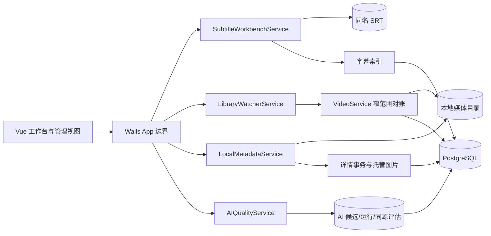

# CineInsight 本地媒体工作流需求设计文档

Author(s): Codex / CineInsight
Last updated: 2026-07-31
Status: Approved
Source: `.loopx/intake/2026-07-31-media-workflows-roadmap/requirements.md`
Proposal: `docs/loopx/design/2026-07-31-media-workflows-roadmap/设计提案.md`

## 1. 目标与范围

本文定义四个可独立发布的本地工作流：字幕编辑工作台、文件目录实时监听、本地元数据导入与匹配、AI 质量评估。实现保持现有 Wails v2、Go、Vue 3、GORM/PostgreSQL 模块化单体，不增加远程服务。

发布优先级固定为：

1. P0 字幕编辑工作台。
2. P1 文件目录实时监听。
3. P2 本地元数据导入与匹配。
4. P2 AI 质量评估。

各迭代共享兼容规则但不存在运行时强依赖。关闭任一功能不得删除其数据，也不得影响其他三项或既有工作流。

## 2. 现状约束

- 视频路径和扫描目录变更受 `libraryPathMutationMu` 保护，扫描由 `scanSyncMu` 串行化。
- `VideoService.SyncScanDirectories` 已负责导入、迁移识别、失效纠偏、技术元数据刷新和字幕索引更新。
- `subtitleparser.ParseFile` 是面向检索的宽松解析器，会跳过坏块，不能直接用于编辑保存。
- `SubtitleSegment` 和 `SubtitleIndexState` 是 SRT 的派生索引，不是字幕事实源。
- 人物允许同名；活跃作品集的规范化名称唯一。
- 托管图片当前只接受 JPEG/PNG/WebP，单文件上限 20 MiB，并以内容哈希命名。
- AI 候选已经持久化批准、拒绝、待审和被替代状态；同源关系会随内容指纹刷新。

## 3. 总体架构



模块共同遵循以下规则：

- 文件或既有业务表是事实源；派生状态可以重建。
- 后台 goroutine 由单一服务拥有，支持 `context.Context` 取消和幂等关闭。
- 文件系统事件、预览结果和 UI 草稿都不直接成为数据库写入。
- 所有新表/列只通过加法迁移创建。

## 4. 字幕编辑工作台

### 4.1 事实源与文档模型

**D-001**：首版唯一可编辑来源是视频同目录、同 basename 的外置 `.srt`。文件内容是事实源；编辑文档和数据库索引均为派生数据。ASS/SSA/VTT 和容器内嵌字幕不进入编辑 API。

服务端返回的编辑文档：

```go
type SubtitleEditDocument struct {
    VideoID     uint                `json:"video_id"`
    Fingerprint SubtitleFingerprint `json:"fingerprint"`
    Entries     []SubtitleEditEntry `json:"entries"`
}

type SubtitleFingerprint struct {
    Size      int64  `json:"size"`
    ModTimeNS int64  `json:"mod_time_ns"`
    SHA256    string `json:"sha256"`
}

type SubtitleEditEntry struct {
    ClientID    string `json:"client_id"`
    StartTimeMs int64  `json:"start_time_ms"`
    EndTimeMs   int64  `json:"end_time_ms"`
    Text        string `json:"text"`
}
```

`client_id` 只用于前端会话内稳定定位和撤销重做，不写入 SRT 或数据库。保存时按数组顺序重新编号为 `1..N`。

### 4.2 严格解析与校验

**D-002**：新增独立严格 SRT codec。打开时任何无法无损归入一个条目的非空内容都导致整个文档不可编辑，不得沿用宽松解析器的“跳过坏块”行为。

硬限制：

- 输入和序列化后文件不超过 16 MiB。
- 条目数不超过 100,000。
- 单条文本 UTF-8 字节数不超过 64 KiB。
- 时间使用非负 `int64` 毫秒；`start < end`。
- 文本经换行规范化后不得为空。
- 按展示顺序要求 `current.start >= previous.end`；重叠为阻断保存的错误。

文件可包含 UTF-8 BOM 和 CRLF；读取时规范化为内存 UTF-8/LF，保存统一输出 UTF-8/LF、条目间一个空行。多行和双语文本保持原有行结构。时间超过 99 小时仍允许并使用至少两位小时格式。

校验结果包含全局错误和按 `client_id` 定位的错误。前端可即时执行同构的轻量校验，但服务端保存校验是权威边界。

### 4.3 编辑和预览

**D-003**：前端新增独立 `SubtitleWorkbench` 视图，不继续扩大 `VideoListPage.vue`。它包含固定高度的视频预览、当前播放时间、可虚拟滚动的字幕列表和编辑工具栏。

支持：

- 点击条目跳转视频，播放时间变化时定位当前条目。
- 修改文本、起止时间，插入、删除、拆分、合并。
- 对全部或选中条目施加毫秒偏移。
- 查找和替换，替换前显示命中数量。
- 会话内撤销/重做；保存成功后建立新的干净基线。
- dirty 标识；关闭、切换视频或返回时阻止无提示丢弃。

不实现自动保存、持久历史、波形、自动对齐和样式编辑。

### 4.4 选区重新翻译

**D-004**：`RetranslateSubtitleEntries` 只接收选中条目的 `client_id + text`，复用当前独立字幕翻译配置和已有 translator。响应必须与请求条数、顺序和 ID 完全一致；否则整次失败。成功结果只修改前端编辑缓冲区，仍需用户显式保存。

翻译调用支持现有本地/远程 provider 选择。一次调用失败或取消不得部分修改选择区，也不得写 SRT。

### 4.5 冲突保护与原子保存

**D-005**：保存请求携带打开或上次成功保存后的完整指纹。服务端在持有每视频字幕写锁后重新打开源文件，验证其仍是普通文件、可写，并比较大小、修改时间和内容 SHA-256。任何不一致返回 `subtitle_conflict`。

保存顺序：

1. 验证请求和当前源指纹。
2. 严格校验并序列化完整文档。
3. 在源文件同目录创建不可预测临时文件，继承原文件权限，写入并 `Sync`。
4. 使用平台实现原子替换：Unix 使用同文件系统 rename；Windows 使用不带备份路径的 `ReplaceFile` 等价实现。
5. 支持目录同步的平台同步父目录。
6. 重新读取并计算新指纹。
7. 在数据库事务中完整替换字幕索引和索引状态。

若步骤 1-4 失败，原 SRT 必须保持不变；清理临时文件。若文件已成功替换但索引更新失败，保存仍返回“文件已保存、索引待重建”的可区分结果，并立即调度幂等重建，不能谎报文件未修改。全流程不产生 `.bak` 或历史副本。

### 4.6 Wails 接口

```text
GetSubtitleEditDocument(videoID) -> SubtitleEditDocument
ValidateSubtitleEditDocument(request) -> SubtitleValidationResult
RetranslateSubtitleEntries(request) -> SubtitleRetranslateResult
SaveSubtitleEditDocument(request) -> SubtitleSaveResult
```

请求只接受 `video_id`，服务端从数据库解析真实路径。响应不需要暴露新的本地绝对路径。

## 5. 文件目录实时监听

### 5.1 设置迁移与运行所有权

**D-101**：`Settings` 新增 `realtime_library_sync_enabled bool not null default false`。迁移前记录设置表是否已存在：全新数据库创建默认设置行时显式写 `true`；已有数据库新增列保持 `false`。不得通过历史行为猜测或自动开启。

**D-102**：`LibraryWatcherService` 拥有一个 `fsnotify.Watcher`、一个事件循环、一个合并定时器集合和一个根目录状态表。`Start(ctx)`、`Reconfigure()`、`RetryRoot(id)`、`Snapshot()` 和 `Close()` 均为幂等操作。关闭先停止接收新工作，再取消稳定探测和待执行对账，最后释放 watcher。

根状态 DTO：

```go
type LibraryWatchRootStatus struct {
    DirectoryID uint      `json:"directory_id"`
    State       string    `json:"state"` // watching, unavailable, error, disabled
    ReasonCode  string    `json:"reason_code"`
    Message     string    `json:"message"`
    WatchCount  int       `json:"watch_count"`
    UpdatedAt   time.Time `json:"updated_at"`
}
```

状态只在内存中保存，通过 `GetLibraryWatcherStatus` 和 `library-watcher-status` 事件发布。

### 5.2 文件系统能力和递归注册

**D-103**：通过窄接口封装 watcher 和平台卷类型探测，生产实现使用 `github.com/fsnotify/fsnotify`。已知网络/伪文件系统在注册前标记 `unavailable`；未知但能成功注册的本地类型进入 `watching`。注册失败、事件通道错误和 OS 资源上限进入 `error`，保留可重试原因。

服务递归 `WalkDir` 注册根目录内的每个真实目录，不跟随逃出根目录的符号链接。新目录 Create 事件先注册该子树，再把子树加入对账批次，以补足注册前窗口。删除/改名目录会移除已失效的注册记录。忽略纯 Chmod 事件。

目录配置 CRUD 成功后调用 `Reconfigure`，无需重启：

- 新增根目录：注册并发布状态。
- 更新路径：先构建新注册集合，成功后替换旧集合；失败时旧路径若仍有效则继续工作，状态说明新配置失败。
- 删除根目录：取消其注册和待处理任务。
- 关闭全局开关：关闭 watcher 并清空瞬时队列。

### 5.3 合并、稳定和窄范围对账

**D-104**：事件仅转换为“受影响父目录”信号。默认静默窗口为 750 ms；每次新事件重置对应根目录批次的定时器。批次包含所有受影响父目录及新建子树，并去除被祖先目录覆盖的路径。

稳定探测对同一批次执行两次目录快照，间隔 1 秒。快照记录相关普通文件的名称、大小和纳秒修改时间；两次完全一致才进入对账。最多等待 30 秒，期间响应取消。超时后根状态进入 `error/stability_timeout`，不写数据库；后续新事件或手工重试可重新执行。

**D-105**：`VideoService` 新增受影响路径对账入口，内部复用全量同步的扫描、唯一迁移匹配、元数据刷新、字幕索引和软删除实现，而不是复制一套规则。一次批次在 `libraryPathMutationMu.RLock` 和 `scanSyncMu` 下串行处理所有受影响目录，使跨目录 rename/create/remove 可共同匹配。

对账只枚举受影响目录子树，但迁移候选查询可在全部活跃和可恢复视频记录中按现有身份规则匹配。源消失与目标出现不在同批时，后续批次仍必须能恢复并迁移对应软删除记录，而不是创建断开关系的新视频。

### 5.4 失败、降级和删除语义

**D-106**：watcher 不提供轮询 fallback，不自动反复重试错误根目录，也不永久删除文件或硬删除数据库记录。错误根目录继续保留启动扫描和用户手工扫描能力；UI 不能把 `unavailable`/`error` 显示为“实时同步中”。

根目录暂时不可访问、源路径消失或事件含义不明确时，只允许进入既有 `is_stale`、软删除和可恢复语义。任何清理原文件的操作仍需走现有显式删除工作流。

### 5.5 Wails 接口与事件

```text
GetLibraryWatcherStatus() -> LibraryWatcherStatus
RetryLibraryWatcherRoot(directoryID) -> LibraryWatchRootStatus
UpdateSettings(settings) -> existing response, adds realtime flag
event: library-watcher-status
event: library-reconciled
```

`library-reconciled` 只包含根 ID、增加/更新/迁移/失效计数和完成时间，不发送完整本地路径。

## 6. 本地元数据导入与匹配

### 6.1 来源发现与安全边界

**D-201**：对视频 `/dir/name.ext`，只发现 `/dir/name.nfo` 以及同一真实目录内的图片。图片扩展支持 `.jpg`、`.jpeg`、`.png`、`.webp`，匹配大小写不敏感，优先级固定为：

- poster：`name-poster`、`poster`、`cover`、`folder`。
- fanart：`name-fanart`、`fanart`。

同一类别命中多个文件时选择优先级最高且文件名排序最小者，并在预览中给出非阻断警告。符号链接解析后若逃出视频目录则忽略。

NFO 最大 4 MiB，XML 深度最大 64，单文本字段最大 64 KiB，人物候选最大 1,000。解析器拒绝 DTD、处理指令和非 `<movie>` 根节点。`<thumb>` 等 URL、路径、播放次数、进度和技术流字段直接忽略。服务不构造网络客户端、不读取 Token，也不执行远程图片下载。

### 6.2 字段映射

**D-202**：支持以下 XML 到领域字段映射：

| NFO | CineInsight | 规则 |
|---|---|---|
| `title` | `Video.DisplayTitle` | 去首尾空白，保留内部 Unicode |
| `originaltitle` | `Video.OriginalTitle` | 同上 |
| `plot`，缺失时 `outline` | `Video.Description` | `plot` 优先 |
| `actor/name` | `VideoPerson` 候选 | 去空白后按现有规范化名称匹配 |
| `set/name` | `CollectionVideo` 候选 | 首版一个 NFO set；复用活跃唯一名称 |
| 本地 poster | `Video.PosterPath` | 托管复制后保存相对路径 |
| 本地 fanart | `Video.FanartPath` | 托管复制后保存相对路径 |

`Video` 新增 `Description text not null default ''`、`PosterPath text not null default ''` 和 `FanartPath text not null default ''`。图片路径不进入普通 JSON DTO；详情响应只暴露是否存在和受控资源标识。

### 6.3 观察状态与差异

**D-203**：新增一对一状态表：

```go
type VideoLocalMetadataState struct {
    VideoID                 uint
    ObservedManifestSHA256  string
    AppliedManifestSHA256   string
    Status                  string // missing, current, update_available, error
    LastErrorCode           string
    LastError               string
    LastCheckedAt           time.Time
    AppliedAt               *time.Time
    CreatedAt               time.Time
    UpdatedAt               time.Time
}
```

manifest 按类型、规范化文件名、文件大小、mtime ns 和内容 SHA-256 排序后哈希，不保存绝对源路径。发现变化时更新 observed 指纹和状态；完整字段 diff 在请求时重新解析并计算，避免保存陈旧候选。

新视频首次入库后若本地资料有效，自动执行“只填空”应用：标量空字符串、空人物关系、空作品集关系、空图片路径才可写。已有视频只更新观察状态为 `update_available`，不自动覆盖数据库。

### 6.4 Diff 与显式选择

**D-204**：预览响应把标题、原始标题、简介、人物集合、作品集集合、poster 和 fanart 作为独立字段。每项包含当前值、来源值、变更类型、默认是否选中和是否需要 overwrite 确认。

- 当前为空且来源非空：默认选中。
- 当前非空且不同：默认不选中，并标记 `requires_overwrite=true`。
- 相同：不产生可执行变更。
- 来源为空：首版不提出清空当前值。

人物和作品集关系按完整集合比较。覆盖现有非空关系必须明确选择；不会按缺失来源项隐式删除关系。

### 6.5 人物与作品集映射

**D-205**：规范化来源名称后构建一次批次映射：

- 人物零匹配：预选 `create_new`。
- 人物唯一匹配：预选对应 `person_id`。
- 人物多个匹配：不预选，必须选择具体 ID 或 `create_new`。
- 作品集存在唯一活跃规范化名称：预选其 ID。
- 作品集无匹配：预选 `create_new`。

请求携带 `source_normalized_name -> resolution`，同名来源在批次内只能出现一个决定。服务端重算名称并验证目标仍存在；确认前绝不创建实体。既有人物永不自动合并。

### 6.6 应用事务与图片补偿

**D-206**：批量应用由 `LocalMetadataService` 串行协调共享映射，每个视频使用独立数据库事务，满足部分成功和安全重跑。

单视频顺序：

1. 重新解析来源并验证请求携带的 manifest 指纹，变化则返回 `metadata_conflict`。
2. 验证选中字段、overwrite 确认和全部映射决定。
3. 对选中图片调用扩展后的 `ManagedImageService.Import("videos", videoID, source)`，记录新建资产。
4. 开始数据库事务并锁定视频；再次读取当前字段，拒绝陈旧 diff。
5. 按批次映射懒创建所需人物/作品集，再写选中标量、关系和图片相对路径。
6. 更新 applied/observed 指纹与状态并提交。
7. 事务失败时删除本次新建且未引用的托管图片；成功后清理被替换且已无引用的旧图片。

作品集创建受活跃规范化唯一约束保护；并发冲突后重读并复用。人物创建允许同名，只有显式 `create_new` 才执行。锁顺序固定为视频、人物映射、作品集映射，避免与现有服务反向获取锁。

### 6.7 批量预览与补全任务

**D-207**：支持选中视频批量预览/应用，以及显式“补全缺失元数据”后台任务。后台任务只处理仍有可填空字段且存在本地来源的视频；一次只运行一个，状态保存在内存，支持取消，逐视频提交并报告成功/跳过/失败。

批量失败响应包含 `video_id + error_code + message`，不因一个视频失败回滚其他成功项。重跑时重新计算 diff，已完成字段自然变为相同并被跳过。

### 6.8 Wails 接口

```text
GetLocalMetadataDiff(videoID) -> LocalMetadataDiff
PreviewLocalMetadataBatch(videoIDs) -> LocalMetadataBatchPreview
ApplyLocalMetadata(request) -> LocalMetadataApplyResult
ApplyLocalMetadataBatch(request) -> LocalMetadataBatchResult
StartLocalMetadataBackfill() -> LocalMetadataBackfillStatus
GetLocalMetadataBackfillStatus() -> LocalMetadataBackfillStatus
CancelLocalMetadataBackfill() -> void
ResolveVideoArtwork(videoID, kind) -> controlled asset response
event: local-metadata-status
event: local-metadata-backfill
```

## 7. AI 质量评估

### 7.1 运行归因

**D-301**：新增 `AITaggingRun`，每次实际 AI 标签任务创建一条，不覆盖历史：

```go
type AITaggingRun struct {
    ID                  uint
    VideoID             uint
    Status              string
    ModelIdentifier     string
    PromptSchemaVersion string
    DurationMS          int64
    RequestCount        int
    ToolCallCount       int
    StartedAt           time.Time
    CompletedAt         *time.Time
    CreatedAt           time.Time
}
```

`AITagCandidate` 新增可空 `RunID` 并建索引。新任务创建候选时关联当前 run；历史候选保持 NULL。模型标识与版本去控制字符并限制 255 字节；不得包含 base URL、API key、路径、字幕、帧或 payload。请求数是实际外部请求次数，工具数是服务端实际执行的 Agent 工具次数；duration 是完整任务墙钟耗时。

运行状态使用现有语义 `processing/completed/skipped/failed`。进程退出留下的 `processing` 在下次启动改为 `failed/interrupted`，不自动重跑。

### 7.2 同源评估历史

**D-302**：新增 `AISameSourceEvaluation` 保存实际展示给用户的一次关系样本：

```go
type AISameSourceEvaluation struct {
    ID                      uint
    RelationID              uint
    LeftVideoID             uint
    RightVideoID            uint
    RunID                   *uint
    Status                  string // detected, rejected
    Confidence              string
    ModelIdentifier         string
    ComparisonPromptVersion string
    DetectionVersion        string
    DetectedAt              time.Time
    RejectedAt              *time.Time
    CreatedAt               time.Time
    UpdatedAt               time.Time
}
```

`VideoSameSourceRelation` 新增可空 `CurrentEvaluationID`。当一对视频在新的内容指纹组合下被确认并展示时创建 evaluation，并让 relation 指向它；相同指纹的重复任务只刷新关系，不增加样本。用户点击“不是同源”时，在同一事务内把关系和当前 evaluation 更新为 `rejected`。旧关系没有 evaluation 时归入同源历史未知样本，按已有 `detection_version` 统计。

### 7.3 指标语义

**D-303**：质量服务返回三个区块：

1. 标签质量：已批准数、已拒绝数、已决样本数、批准率、拒绝率，并按标签/置信度/模型/提示词版本分组。
2. 同源质量：检测数、用户否认数、样本数、否认率，并按 detection version、模型和比较提示词版本分组。
3. 运行质量：任务总数、完成/失败数、失败率、耗时 p50/p95、平均请求数和平均工具数。

标签窗口时间使用 `COALESCE(approved_at, rejected_at)`；只查询 `approved/rejected`，明确排除 `pending/superseded`。同源窗口使用 `COALESCE(rejected_at, detected_at)`。运行窗口使用 `completed_at`，未完成中断项使用最后更新时间。

所有比例同时返回分子、分母和浮点率；分母为零时率为 `null`，不得显示 0% 误导。时间窗口是 `all`、`30d`、`7d`，按本地当前时间换算为数据库绝对时间边界。过滤器支持 tag ID、confidence、model identifier 和 version；空归因统一映射为稳定键 `historical_unknown`、显示“历史/未知版本”。

软删除视频不从聚合中排除。质量查询不 preload Video，也不返回已删除视频的可操作记录。

### 7.4 查询与索引

**D-304**：聚合直接查询候选、运行和同源评估表，不创建可漂移的日汇总表。新增访问路径：

- `ai_tagging_runs(completed_at, model_identifier, prompt_schema_version)`。
- `ai_tag_candidates(status, approved_at)` 和 `(status, rejected_at)`，并保留现有 video/status 索引。
- `ai_tag_candidates(run_id)`。
- `ai_same_source_evaluations(status, detected_at)`、`(status, rejected_at)`、`(detection_version, status)`。
- `video_same_source_relations(current_evaluation_id)`。

SQL 必须兼容生产 PostgreSQL 与现有 SQLite 测试。p50/p95 在 PostgreSQL 可用 percentile 聚合；共享服务采用可测试的排序后分位数 helper 或方言分支，避免把 PostgreSQL 专用 SQL 放进通用查询。

### 7.5 UI 与隐私

**D-305**：现有 AI 标签管理增加 `待审` 和 `质量` tabs。质量页默认 30 天，显示样本数优先于比例，并提供时间、标签、置信度、模型和版本过滤。加载、空数据、错误和过滤后零样本均有明确状态。

质量视图是只读的，不提供批准、拒绝、重跑或阈值修改。评估过程不调用 AI client，不读媒体文件，不持久化或输出本地路径、字幕、帧、API key、base URL、请求/响应 body。

## 8. 共享兼容、迁移与生命周期

**D-401**：`models.AllModels()` 只追加新模型；现有表只追加 nullable 或有稳定默认值的列。迁移不执行历史 SRT/NFO/详情改写，不为旧 AI 数据补请求，不把旧记录猜测归因到当前模型。

**D-402**：每项功能具备独立运行边界：

- 字幕工作台没有后台 worker，入口可独立隐藏。
- Watcher 由 `realtime_library_sync_enabled` 控制。
- 元数据自动发现/新视频填空和 backfill 可由独立本地元数据开关控制；手工详情不受影响。
- AI 质量页面可独立隐藏；新增归因写入可继续保留，因为它不改变 AI 结果语义。

关闭只停止行为，不删除表、列、托管图片或结果。

**D-403**：所有后台服务在 `App.startup` 完成数据库和依赖初始化后启动，在 `App.shutdown` 中按“停止入口 -> 取消上下文 -> 等待 worker -> 释放资源”关闭。Wails 事件发送前检查上下文仍有效。

## 9. 非功能要求

### 9.1 正确性与可靠性

- SRT 冲突检测 RPO 为 0：发现外部变化不得覆盖一个字节。
- 原子保存失败时原文件保持可读；不允许截断式覆盖。
- Watcher 是加速层，手工/启动扫描始终是最终恢复路径。
- 元数据批量以单视频为事务边界，失败结果可重放。
- 质量统计以业务事实表为准，不缓存不可审计的比例。

### 9.2 性能与资源边界

- 10,000 条 SRT 的打开和服务端校验在开发基准机上 p95 小于 500 ms；前端列表使用虚拟滚动，编辑不因条目数线性增加 DOM。
- Watcher 事件合并后，同一根目录在 750 ms 窗口内最多启动一个稳定探测；任何稳定探测最长 30 秒。
- 窄范围对账只遍历受影响子树；测试必须证明单目录事件不会调用全根目录枚举入口。
- NFO 4 MiB、图片 20 MiB、批量选择 500 个视频为硬上限。超过上限立即拒绝，不静默截断选择。
- AI 质量默认窗口查询在 100,000 候选、10,000 run、10,000 同源样本的测试数据上目标 p95 小于 1 秒；用 `EXPLAIN` 验证索引访问路径。

### 9.3 安全与隐私

- 所有文件路径从 `video_id`/`directory_id` 在服务端解析，并验证仍位于配置根或对应媒体目录。
- SRT 临时文件、NFO 和图片均拒绝非普通文件与越界符号链接。
- XML 禁止 DTD/指令，所有输入均有大小和数量限制。
- WebView 不接收新增加的绝对本地路径；托管图片经受控 resolver 返回。
- AI 质量记录和日志禁止敏感内容与配置值，只允许计数、耗时、稳定版本和模型名称。

### 9.4 可观测性

- 字幕保存记录 video ID、结果码、条目数和耗时，不记录正文或路径。
- Watcher 状态记录 directory ID、reason code、watch count、批次目录数和对账计数；日志可以按既有策略记录路径，但 UI 事件不发送路径。
- 元数据记录 video ID、manifest 前缀、解析/应用结果和字段计数，不记录 NFO 全文。
- AI 质量查询记录过滤器类别、样本数和耗时，不记录 key、路径或原始证据。

## 10. 测试策略

### 10.1 单元测试

- 严格 SRT codec：BOM、CRLF、多行、双语、长小时、空块、坏时间、重叠、极限大小和稳定序列化。
- 原子替换：源变化、删除、权限失败、替换失败、临时文件清理和索引失败的部分成功结果。
- Watcher：fake watcher 的事件合并、递归注册、动态配置、稳定超时、取消和状态转换；运行 `go test -race`。
- 窄对账：新增、原地修改、跨目录改名、分批 move、暂时消失、SRT 替换和软删除恢复。
- NFO：Kodi/Jellyfin fixtures、DTD、超限、字段忽略、图片优先级、符号链接逃逸和 manifest 稳定性。
- 元数据映射：人物 0/1/N 匹配、作品集唯一冲突、陈旧 diff、逐项 overwrite、图片补偿和部分成功重跑。
- AI 质量：状态分母、时间窗、unknown 归因、软删除视频、同源 evaluation 更新和零分母。

### 10.2 集成与前端测试

- PostgreSQL 和 SQLite 迁移测试覆盖全新安装与已有 Settings 行升级。
- App 启停测试验证 watcher/backfill 无 goroutine 泄漏。
- 使用挂载 Vue 组件测试工作台编辑状态、撤销重做、关闭保护、翻译整次应用和保存结果。
- 使用挂载 Vue 组件测试 watcher 根状态和 retry，元数据 diff/mapping/确认，AI 质量过滤和零样本。
- Wails 绑定生成后执行 TypeScript 构建，禁止只用字符串/正则测试代替复杂交互测试。

### 10.3 全量验证

```text
go test -count=1 ./...
go test -race ./services/...
go vet ./...
npm test
npm run build
git diff --check
```

## 11. 验收映射

| Acceptance | Design anchors | Test scenarios |
|---|---|---|
| AC-001, AC-002 | D-001, D-002, D-003 | TC-001 |
| AC-003, AC-004, AC-005, AC-008 | D-002, D-005 | TC-002, TC-003 |
| AC-006 | D-004 | TC-004 |
| AC-007 | D-003 | TC-001 |
| AC-101, AC-102 | D-101, D-102, D-103 | TC-101 |
| AC-103, AC-104 | D-104, D-105 | TC-102, TC-103 |
| AC-105, AC-107 | D-105, D-106 | TC-103 |
| AC-106, AC-108 | D-102, D-103, D-106 | TC-104 |
| AC-201, AC-202, AC-203 | D-201, D-202 | TC-201 |
| AC-204, AC-205, AC-206 | D-203, D-204 | TC-202 |
| AC-207, AC-208 | D-205, D-206 | TC-203 |
| AC-209, AC-210 | D-206, D-207 | TC-204 |
| AC-301 | D-301, D-302, D-305 | TC-301 |
| AC-302, AC-303, AC-304 | D-303, D-304, D-305 | TC-302 |
| AC-305, AC-307 | D-302, D-303, D-305 | TC-303 |
| AC-306 | D-303, D-305 | TC-301 |
| AC-401, AC-402, AC-403 | D-401, D-402, D-403 | TC-401 |

## 12. 已决取舍与延期项

- 字幕保存不保留旧内容；外部冲突只允许重新加载后再编辑。
- Watcher 不保证网络盘，不增加轮询 fallback。
- 元数据仅本地；在线提供商、Token、attribution 和联网隐私需未来重新 clarify/spec。
- 首版人物关系不增加角色/排序，NFO 中相关字段忽略。
- AI 评估只观察，不自动优化模型、提示词或阈值。
- ASS/SSA/VTT/内嵌字幕编辑、波形、自动对齐、跨设备同步均延期。

## 13. Handoff

本设计无未决产品、数据、兼容或安全决策，可交给 `plan2exec` 生成实施计划。实施必须保持四个独立可验收切片，并完整覆盖本文件的 `D-*` 与来源 `AC-*`、`TC-*`。
