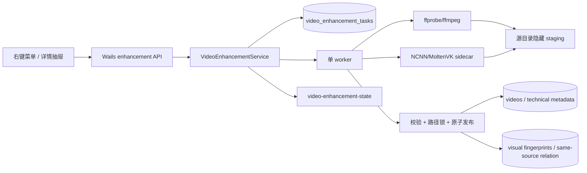
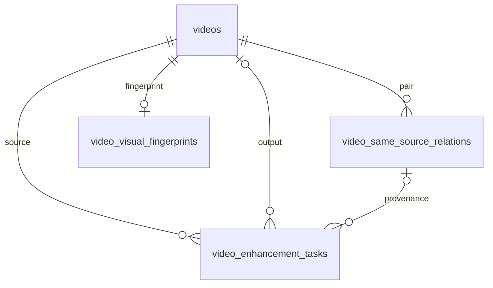

# CineInsight 视频超分设计文档

> 状态：送审定稿（Under review）。本文已关闭全部设计选择，但 P-012 只有在用户明确批准后才完成；批准前不得实施 P-013。
>
> 方向提案：[`设计提案.md`](./设计提案.md)

## 二、需求信息

### 2.1 需求背景

- 背景：`docs/video-super-resolution-model-selection.md` 已比较 Real-ESRGAN、BasicVSR++、RealBasicVSR 与扩散方案，但停留在阶段性建议，无法直接约束运行时、文件生命周期、持久任务和同源关系实现。
- 需求目的：将 P-012 收敛为全部实现选择均有唯一结论的首版设计，为 P-013 提供可验证、不可自行重开的契约。
- 目标用户/使用方：在 Apple M4 Mac mini（32GB 统一内存）上管理本地片库并显式生成增强副本的 CineInsight 用户；后续 P-013 的 Go/Wails/Vue 实现者与评审者。
- 需求链接：`docs/loopx/plans/2026-08-04-feature-expansion.md` P-012、P-013。
- 关联原始材料：`AI-CONTEXT.md`、`docs/video-super-resolution-model-selection.md`、`services/technical_backfill_service.go`、`services/media_probe_service.go`、`services/ai_same_source_service.go`、`models/ai_tagging.go`、`services/video_service.go`。
- 来源验收等价项：`P012-CC-01` = 定稿位于 `docs/loopx/design/`，覆盖模型与运行方式、命名与存放、任务表、同源关联、失败/取消/磁盘不足和首版非目标，且每项只有一个确定结论；`P012-CC-02` = 用户明确批准后才允许 P-013 开工。

### 2.2 需求范围

- 本期范围：首版超分运行时和模型；输入闭集；输出命名、容器、编码与流保留；持久单 worker 队列；磁盘预检与分块工作目录；取消、失败、崩溃恢复；原子发布；视频入库与同源关系；Wails/事件契约；迁移、发布和验证边界。
- 非目标：非 macOS arm64 平台；Rosetta/CPU/Python/云端 fallback；4×/8×；HDR/10-bit/VFR/隔行/多主视频流/大于 1080p；自动内容分类；多帧/扩散模型；覆盖原文件；复制标签、播放状态和外置 SRT；在线下载模型。
- 决策边界：本文决定 P-013 的可观察行为和实现约束，不实现代码、不修改计划状态、不代表用户已批准。
- 依赖方：现有 FFmpeg/ffprobe 探测；Wails 应用生命周期；`VideoService` 入库和路径锁；`VideoVisualFingerprint`/`VideoSameSourceRelation`；PostgreSQL/GORM 加法迁移；应用签名与 sidecar 资源打包。
- 约束条件：原视频只读且完成前后 SHA-256 相同；媒体目录同名目标不覆盖；单 worker；无网络；路径和帧不进入新增日志/持久 payload；数据库只做加法迁移；现有 UI 信息层级不变。
- 触发的辅助 skills：architecture-designer、sql-style、go-style。

### 2.3 可行性分析

- 业务可行性：固定 2× 将 480p/720p/1080p 输出控制在 960p/1440p/4K；用户显式选择一般或动漫 profile，避免自动误判造成长时间无效任务。
- 技术可行性：Real-ESRGAN 官方 NCNN/Vulkan CLI 支持两个选定模型和 2×；NCNN 官方提供 macOS arm64 + Vulkan/MoltenVK 构建路径。仓库已经有 context 子进程取消、长任务事件、媒体探测、路径锁与同源表。
- 团队接受能力：Go 只编排 sidecar 与 ffmpeg，不嵌入 C++ 或 Python runtime；资源包由构建链固定版本和哈希。
- 时间成本：最大实现成本在可恢复分块流水线、最终文件/数据库一致性与真机发布验证，不在模型训练。
- 资源成本：单 worker、NCNN 自动 tile、120 帧批次限制并发和临时帧峰值；输出 HEVC 以较慢编码换较低长期磁盘占用。
- 替代方案：PyTorch/MPS、CoreML、多帧模型和一次性全量帧目录均已在提案中拒绝。
- 关键风险：单帧模型可能闪烁；x4 网络输出 2× 的吞吐低于原生 x2；MKV 的浏览器内嵌兼容性弱于 MP4；MoltenVK/签名包必须在 M4 真机验证。这些是已接受风险，不改变本文选择。

## 三、概要设计

### 3.1 方案总述

- 设计目标：完全本地、可预测、可取消、可续跑、原文件零修改、文件与数据库终态一致。
- 总体思路：用户创建持久任务；单 worker 以 120 帧批次调用 ffmpeg -> NCNN -> ffmpeg；隐藏同卷目录保存续跑点；校验后在路径锁内原子发布并事务入库。
- 核心模块：`VideoEnhancementRuntime`、`VideoEnhancementService`、持久任务仓储、分块媒体流水线、发布/对账器、Wails API 与状态事件。
- 主要难点：源文件并发变化、磁盘耗尽、子进程组取消、应用崩溃、rename 与数据库提交之间的补偿、同源关系不污染 AI 质量样本。
- 技术指标：增强并发固定 1；profile 与倍率闭集；临时帧批次固定 120；输出尺寸精确 2×；原视频 SHA-256 不变；失败/取消后无隐藏工作目录和未登记最终文件。

**Operational Contract — D-001（P012-CC-01）**：运行时固定为随应用签名发布的 darwin/arm64 `realesrgan-ncnn-vulkan-v0.2.0-cineinsight1`，包含锁定 NCNN/MoltenVK 和模型资源；执行前校验 manifest SHA-256、架构与 Vulkan GPU。禁止网络下载、Rosetta、CPU、Python/MPS 或云端 fallback。

**Behavior Contract — D-002（P012-CC-01）**：首版 profile 只有 `general` 和 `anime`，模型分别为 `realesrgan-x4plus` 与 `realesr-animevideov3`，倍率固定 2×；两者参数固定 `-s 2 -t 0 -g 0 -j 1:2:2 -f png`。用户显式选择，默认 `general`，不得自动分类。

### 3.2 整体架构设计



- 业务模式：本地桌面应用中的显式用户作业，不是自动后台增强。
- 系统边界：Go 服务拥有任务状态、子进程、工作目录和发布；sidecar 只做图片推理；ffmpeg 只做媒体解复用、抽帧、编码与封装；PostgreSQL 是任务事实源。
- 上下游系统：上游是活跃 `videos` 记录和本地源文件；下游是新 `videos` 记录、技术快照、视觉指纹、同源关系和现有扫描/详情/清理消费者。
- 应用架构：不建立通用任务框架；新增服务沿用技术补全的单 owner 模式，但任务本身持久化以支持长视频恢复。
- 技术架构：Go context + 参数数组子进程；NCNN Vulkan GPU；同卷 staging；PostgreSQL 事务；Wails 事件加轮询。
- 数据流转：新增持久化只含任务元数据、指纹、计数和错误摘要，不含帧、音频、字幕正文、命令 payload 或新增绝对路径副本。

### 3.3 核心流程设计

| 流程 | 触发条件 | 参与系统/模块 | 主流程 | 异常/补偿 | 输出 |
|---|---|---|---|---|---|
| 能力检查 | 打开入口或创建任务 | runtime、ffprobe、VideoService | 校验平台/manifest/Vulkan/输入闭集/目标/磁盘 | 返回稳定 reason code，不 fallback | capability |
| 创建任务 | 用户确认 profile | service、DB | 计算源 SHA-256 和输出 basename，事务去重入队 | 冲突返回既有任务或明确错误 | queued task |
| 分块增强 | worker 取得 FIFO task | ffmpeg、NCNN、staging | 每 120 帧抽取、推理、编码、提交 checkpoint | 当前批次失败即清理并 failed；shutdown 可恢复 | 视频分段 |
| 最终发布 | 全部分段完成 | verifier、路径锁、DB | 拼接/复用流、验证、源复验、rename、事务入库/关系/完成任务 | rename 后失败补偿；崩溃由启动对账 | completed task |
| 用户取消 | queued/running 且未 publish | service、worker | 持久 cancel_requested，cancel context/进程组，清理 | publish 已开始拒绝中断 | cancelled task |
| 启动恢复 | 存在非终态任务/工作目录 | reconciler、worker | 校验源/manifest/checkpoint/最终文件，续跑或补完发布 | 非法残留删除并 failed | 可解释终态 |

### 3.4 功能模块

| 模块 | 职责 | 关键功能 | 依赖 | 备注 |
|---|---|---|---|---|
| Runtime capability | 验证本地推理能力 | manifest/哈希/架构/Vulkan/模型 | 应用资源目录 | 只读、可缓存，资源变化后失效 |
| Enhancement service | 任务命令与 worker owner | 创建、去重、FIFO、取消、重试、事件 | DB、app context | 单 goroutine owner |
| Media pipeline | 分块处理 | ffmpeg 抽帧、NCNN、x265 分段、流复用 | ffmpeg、sidecar | 不经 shell |
| Workspace manager | 临时文件与 checkpoint | 同卷隐藏目录、批次 manifest、清理 | 文件系统 | 不扫描为视频 |
| Publisher/reconciler | 终态一致性 | 校验、路径锁、rename、事务、补偿、启动对账 | VideoService、DB | 临界区不运行推理 |
| UI/Wails | 显式入口与状态 | capability、创建、列表、取消、重试、事件 | 现有原语 | 不重排现有页面 |

### 3.5 新增/调整功能说明

- 视频右键菜单与详情抽屉增加“视频超分”；入口先读取 capability，不可用时显示原因。
- 确认层展示 profile、固定 2×、输出文件名、最低空间要求与原文件只读承诺。
- 全局任务状态可显示当前项和 FIFO 排队项；关闭界面不取消任务。
- 完成后详情通过同源关系发现原版/增强版；AI 同源待审不会出现该确定性关系。
- 输出作为普通新视频参与现有扫描、详情、软删除、回收站和清理；业务字段不从原版复制。

### 3.6 专项设计检查

| 辅助 skill | 触发原因 | 检查内容 | 设计结论 |
|---|---|---|---|
| architecture-designer | 新 GPU sidecar、长任务、文件发布和恢复 | 边界、NFR、失败域、部署、恢复、可观测性 | 单运行时、单 worker、无 fallback、同卷原子发布、持久续跑 |
| sql-style | 新表、状态机、索引、跨表事务 | FK/NULL/唯一性、加法迁移、重复执行、事务终态 | 部分唯一索引保证每源一个活跃任务；发布数据一次提交；旧版可忽略 |
| go-style | context、goroutine、子进程、锁、错误 | owner、参数数组、错误类型、取消、race | service 独占 worker；context 第一参数；typed error code；子进程组清理；窄锁 |

## 四、详细设计

### 4.1 运行时与输入资格详细设计

#### 4.1.1 需求内容

- 入口：能力查询与任务创建 preflight。
- 操作人/调用方：右键/详情 UI、`VideoEnhancementService`。
- 前置条件：应用资源完整；目标视频活跃且文件可读。
- 输出结果：可用 profile 与输出预览，或单一稳定不可用原因。

#### 4.1.2 方案设计

**Interface Contract — D-003（P012-CC-01）**：runtime manifest 固定包含 runtime ID、构建来源 `Real-ESRGAN-ncnn-vulkan v0.2.0`、目标 `darwin/arm64`、可执行文件/动态库/模型相对路径及 SHA-256、许可证相对路径。任何文件缺失、哈希不符、非 arm64、签名无效或 Vulkan 无可用 GPU 均返回 `runtime_unavailable`，不执行安装或降级。

输入闭集：

| 属性 | 接受 | 拒绝 |
|---|---|---|
| 记录 | 活跃、`is_stale=false` | 软删除、stale、不存在 |
| 文件 | 可读常规文件 | 目录、符号链接目标异常、权限失败 |
| 视频流 | 一个非 attached-pic 主视频流 | 0 个或多个主视频流 |
| 尺寸 | 1..1920 × 1..1080，旋转归一化后仍不超限 | 任一维 0、归一化后超过 1080p |
| 色彩 | 8-bit SDR | HDR transfer/primaries、10-bit/12-bit |
| 扫描 | progressive | interlaced |
| 时间基 | CFR 且 fps 有效 | VFR、fps 0/非法 |

profile 参数是闭集，未知值返回 `invalid_profile`；scale 不在请求中暴露。runtime stderr 上限 4 KiB，先替换源、输出、staging 绝对路径再进入任务摘要或日志。

#### 4.1.3 流程步骤

1. 加载活跃视频并 stat，拒绝 stale/非常规/不可读文件。
2. 验证 manifest、SHA-256、Mach-O arm64 和 Vulkan GPU；缓存结果与 manifest mtime 绑定。
3. 参数数组调用 ffprobe，复用现有 16 MiB stdout 与 4 KiB stderr 上限。
4. 校验主视频流、尺寸、位深、HDR、隔行与帧率。
5. 规范化 profile，计算固定输出 basename、尺寸、帧数和磁盘下限。
6. 检查目标文件系统权限与冲突，返回 capability。

#### 4.1.4 边界条件

| 场景 | 处理方式 | 用户/调用方感知 | 监控/告警 |
|---|---|---|---|
| Intel Mac/Windows/Linux | capability unavailable | “首版仅支持 Apple Silicon Mac” | platform code |
| Rosetta 中运行 | 以当前进程/sidecar 架构不符拒绝 | 不尝试翻译运行 | runtime code |
| manifest 被改动 | 哈希失败 | 运行时损坏，需重装应用 | 不记录绝对路径 |
| Vulkan 枚举为空 | 拒绝 | GPU 运行时不可用 | runtime code |
| 输入属性缺失 | 无法证明在闭集即拒绝 | 显示具体 unsupported reason | probe code |
| profile 重复/大小写变化 | 只接受规范小写枚举 | 非法 profile | validation test |
| 权限失败 | 不创建任务 | 显示源不可读或目录不可写 | permission code |
| 无网络 | 正常可用 | 无差异 | 断网集成测试 |

#### 4.1.5 不变行为

| 行为/表面 | 保持不变的原因 | 验证方式 |
|---|---|---|
| WhisperX/Qwen runtime 独立 | 不建立共享 Python 环境 | subtitle runtime tests |
| 现有 ffprobe 快照规则 | 复用本地媒体事实源 | media probe tests |
| AI 配置和网络边界 | 超分完全不使用 AI API | 网络 mock/静态检查 |
| 详情读取不隐式创建任务 | 用户必须显式确认媒体写入 | Wails/UI tests |

### 4.2 输出命名、编码与工作目录详细设计

#### 4.2.1 需求内容

- 入口：任务创建与 worker 执行。
- 操作人/调用方：Enhancement service。
- 前置条件：capability 可用、目标未占用、空间达到下限。
- 输出结果：隐藏分块产物或已验证的最终 MKV。

#### 4.2.2 方案设计

**Behavior Contract — D-004（P012-CC-01）**：最终路径固定为源目录的 `<stem>.enhanced-<general|anime>-2x.mkv`。任意同名文件/目录、活跃或软删除视频记录都构成 `output_conflict`；禁止覆盖、删除冲突物或自动追加序号。

**Operational Contract — D-005（P012-CC-01）**：视频固定编码 HEVC Main：`libx265 -preset medium -crf 18 -pix_fmt yuv420p`，MKV 复制全部 audio/subtitle streams、chapters 与安全 metadata，忽略 attachment/data；外置字幕不复制。归一化旋转，保持 CFR、显示比例和源 audio/subtitle 数量。

工作目录为源目录下 `.cineinsight-enhance-<task-id>/`，权限不宽于 `0700`。批次固定 120 帧，目录含版本化 `checkpoint.json`、已编码 segment 和当前批次临时 PNG。所有 segment 与 staging final 使用不在扫描扩展名中的 `.cispart` 后缀，ffmpeg 通过显式 `-f matroska` 读写；不能依赖“隐藏目录”阻止递归扫描。checkpoint 原子替换并记录 task ID、源 SHA-256、profile、runtime/model version、总帧数、最后完成批次、每段 basename/size/SHA-256；不记录绝对路径。

磁盘下限：

```text
raw_chunk_bytes = 120 * (source_width * source_height * 4
                       + (source_width * 2) * (source_height * 2) * 4)
required_bytes  = max(source_size * 4, 8 GiB) + raw_chunk_bytes + 1 GiB
```

所有乘加使用 checked int64；溢出视为 `unsupported_input`。创建、恢复、每批开始和 publish 前重新读取工作目录所在卷可用空间。

#### 4.2.3 流程步骤

1. 以排他创建建立工作目录和 checkpoint 临时文件。
2. 按帧号与 CFR 有理帧率计算当前 120 帧区间，ffmpeg 输出连续无损 PNG。
3. 校验抽帧数量和编号连续，调用固定 NCNN profile 输出 2× PNG。
4. 校验输出数量、尺寸和可读性，ffmpeg 以显式 Matroska 格式编码无音频 `.cispart` segment。
5. fsync segment 与新 checkpoint，原子替换 checkpoint 后删除当前批次 PNG。
6. 全批完成后 concat 视频 segment，再从原文件 remux audio/subtitle/chapter/metadata 到 staging final。

#### 4.2.4 边界条件

| 场景 | 处理方式 | 用户/调用方感知 | 监控/告警 |
|---|---|---|---|
| 空视频/总帧数 0 | preflight 拒绝 | 不支持的媒体 | probe code |
| 最后一批少于 120 帧 | 只处理剩余帧，数量必须相等 | 正常进度到 100% | partial-batch test |
| PNG 编号缺口/尺寸错误 | 当前任务 failed，删除 workspace | 推理输出无效 | inference code |
| segment 已存在但 checkpoint 未提交 | 恢复时删除该 segment 并重做当前批次 | 自动续跑 | crash fixture |
| checkpoint 已提交但 segment 哈希不符 | 整个任务 failed 并清理 | 工作文件损坏 | reconcile code |
| 源目录不支持原子 rename | preflight/publish 失败 | 文件系统不支持安全发布 | publish code |
| ENOSPC | 停止进程、清理、failed | 磁盘空间不足 | disk code |
| attachment/data 流存在 | 不映射，不视为失败 | 输出不含附件/数据流 | ffprobe fixture |
| audio/subtitle remux 失败 | 整个任务失败，不发布无声/缺字幕版本 | 封装失败 | encode code |

#### 4.2.5 不变行为

| 行为/表面 | 保持不变的原因 | 验证方式 |
|---|---|---|
| 原视频 basename/path/bytes | 超分只产生副本 | 前后 stat + SHA-256 |
| 同目录外置 SRT | 首版不复制也不改名 | 文件清单比较 |
| 已有目标文件 | 媒体目录安全约束 | collision tests |
| 扫描扩展名配置 | 不隐式加入或重写用户设置 | settings tests |

### 4.3 持久任务与取消恢复详细设计

#### 4.3.1 需求内容

- 入口：创建、状态查询、取消、重试、应用启动/退出。
- 操作人/调用方：用户、App lifecycle。
- 前置条件：数据库迁移完成，service 是 worker 唯一 owner。
- 输出结果：可恢复且可解释的任务终态。

#### 4.3.2 方案设计

**State Contract — D-006（P012-CC-01）**：任务状态闭集为 `queued/running/cancel_requested/completed/failed/cancelled`；phase 闭集为 `preflight/extract/enhance/encode/publish/verify`。合法转换：

```text
queued -> running -> completed
queued -> cancel_requested -> cancelled
running -> cancel_requested -> cancelled
queued|running -> failed
failed|cancelled -> queued        (显式 Retry，复用 task ID)
```

`completed` 终态不可重试；进入 `publish` 后取消返回 `publish_in_progress`，任务继续至 completed 或 failed。单 worker 按 `(created_at,id)` FIFO；每个 source_video_id 只允许一个 `queued/running/cancel_requested`。

**Workflow Contract — D-007（P012-CC-01）**：创建任务是唯一新作业入口。应用启动可自动恢复已由用户创建的 queued/running 任务，但不得自动创建任务。生命周期 shutdown 取消当前子进程并保留任务/完整 checkpoint；用户 Cancel 必须持久化 cancel_requested、终止进程组、删除 workspace/未发布文件后写 cancelled。失败/取消不得留下临时文件。

错误摘要最大 4 KiB 且路径清洗；进度以 `processed_frames/total_frames` 表示，仅在 checkpoint 提交后前进。事件快照包含当前任务、排队任务和最近终态，不包含源/输出绝对路径。

#### 4.3.3 流程步骤

1. Create 在事务中检查现有活跃任务、任务资格与部分唯一索引；已有则返回该任务。
2. worker 以事务取得最早 queued，写 running/started_at/phase 后启动子进程。
3. 每个 checkpoint 事务更新 processed_frames、phase、updated_at 并发事件。
4. Cancel 先 CAS 到 cancel_requested，再取消对应 task context 和进程组。
5. 用户取消清理完成后写 cancelled；普通失败清理后写 failed/error_code/error_summary。
6. Retry 对 failed/cancelled 全量重做 preflight，清零执行字段并写 queued。
7. startup reconciler 按任务 ID 串行处理非终态和孤立 workspace，随后 worker 恢复 FIFO。

#### 4.3.4 边界条件

| 场景 | 处理方式 | 用户/调用方感知 | 监控/告警 |
|---|---|---|---|
| 并发 Create | DB 唯一约束后重读活跃任务 | 返回同一 task | concurrency test |
| queued Cancel | 不启动 runtime，清理可能空 workspace | cancelled | state test |
| running Cancel | 杀整个进程组，等待退出再清理 | cancel_requested -> cancelled | process test |
| 重复 Cancel | cancelled 幂等返回；publish 返回固定错误 | 无第二次副作用 | idempotency test |
| Cancel 与 worker 取件竞态 | 行锁/CAS 决定单一转换 | queued 或 running 路径均可收敛 | race test |
| Retry 时输入已不支持 | 保持 failed/cancelled，返回当前错误 | 不重新排队 | validation test |
| App shutdown | 停进程但不写 cancelled/failed | 下次继续 | lifecycle test |
| App crash | checkpoint 前批次重做，已提交批次复用 | 自动继续 | crash integration |
| DB 暂时失败 | 停止当前 worker；不在未提交 checkpoint 后继续 | 状态可见 | DB error test |
| source 被软删除 | 当前任务 failed/source_unavailable，清理 | 不生成软删除来源副本 | deletion race test |

#### 4.3.5 不变行为

| 行为/表面 | 保持不变的原因 | 验证方式 |
|---|---|---|
| TechnicalBackfill worker | 不合并异质任务状态 | backfill tests |
| Subtitle FIFO | 保持现有字幕并发语义 | subtitle queue tests |
| 关闭 UI | 后台任务继续 | component test |
| App startup 不扫描/增强全库 | 只恢复显式任务 | startup tests |

### 4.4 验证、原子发布与入库详细设计

#### 4.4.1 需求内容

- 入口：staging final 已封装完成。
- 操作人/调用方：worker/publisher/reconciler。
- 前置条件：任务 running，phase 进入 verify/publish。
- 输出结果：完整的新视频、同源关系和 completed 任务，或无最终残留的 failed。

#### 4.4.2 方案设计

**Behavior Contract — D-008（P012-CC-01）**：任务创建时记录源 `size + mtime_ns`；worker 进入 preflight 后先确认二者未变，再计算并持久化初始 SHA-256。每批以 size/mtime 快速复验，最终发布前后都重新计算 SHA-256。任一不一致立即 `source_changed`，不得发布。完成条件包括原视频最终 SHA-256 与初始值完全相同。

输出验证闭集：ffprobe 成功；一个主视频流；宽高为归一化源的精确 2×；帧数相同；时长误差不超过 `max(1 frame,100ms)`；audio/subtitle 流数量分别相同；首/中/尾三帧可解码；输出非空。任一失败都删除 workspace/staging final。

**Workflow Contract — D-009（P012-CC-01）**：发布只在 `libraryPathMutationMu` 独占锁的短临界区执行。锁内重查目标占用，fsync staging final 后同卷原子 rename；随后一个数据库事务创建输出 `videos`、技术快照/streams、视觉指纹、同源关系，并将任务 completed/关联 output 和 relation。不得在锁内做模型推理、全片编码或源 SHA-256 计算。

输出视频业务字段：只填文件/技术事实；`display_title/original_title/description` 空，rating NULL，收藏/已看/播放计数/观看进度为默认，不复制 tags/people/collections。短视频自动标签、缩略图与 AI worker 继续通过现有新视频规则处理。

#### 4.4.3 流程步骤

1. ffprobe staging final 并执行结构、尺寸、帧、时长和流数量校验。
2. 解码首/中/尾帧；计算最终文件 SHA-256 与 size。
3. 重新读取原视频并校验初始 SHA-256。
4. 预生成双方本地视觉指纹材料；不调用外部 AI。
5. 进入路径独占锁，重查源记录/path/目标冲突和磁盘空间。
6. fsync 文件与目录，rename 到最终 basename。
7. 数据库事务创建输出记录、技术记录、指纹、关系，更新 task completed。
8. 事务成功后释放锁、删除 workspace、触发既有片库/详情局部刷新。
9. 事务失败则在锁内将文件移回 workspace 或删除；补偿失败持久化 publish_failed 并由 startup reconciler 接管。

#### 4.4.4 边界条件

| 场景 | 处理方式 | 用户/调用方感知 | 监控/告警 |
|---|---|---|---|
| 验证尺寸/帧/流不符 | failed，删除 staging | 输出校验失败 | verify code |
| verify 后源变化 | source_changed | 原文件变化，请重试 | source code |
| publish 锁等待时扫描/迁移 | 等锁；锁内重新加载事实 | 无不一致终态 | race test |
| 锁内发现目标新占用 | output_conflict，删除 staging | 目标已存在 | conflict code |
| rename 失败 | 不写 DB | 发布失败 | publish code |
| rename 后 DB 事务失败 | 移回/删除；task failed | 发布失败，无入库结果 | compensation test |
| rename 后进程崩溃 | startup 依据 task/hash 补完或删除 | 自动恢复 | crash injection |
| output video Create 唯一冲突 | 事务回滚并补偿文件 | 输出冲突 | DB constraint test |
| 视觉指纹生成失败 | 不发布；全任务 failed | 同源登记失败 | fingerprint code |
| completed 后源被用户修改 | 不反向修改 task/输出；现有指纹变化语义接管 | 历史任务仍保留 | existing relation tests |

#### 4.4.5 不变行为

| 行为/表面 | 保持不变的原因 | 验证方式 |
|---|---|---|
| `idx_videos_path_active` | 继续作为路径最终约束 | database tests |
| 软删除/回收站 | 输出就是普通视频记录 | trash tests |
| 用户标签不自动复制 | 同源证据不等于正式标签 | tag relation assertions |
| 原视频播放统计/详情 | 生成副本不算播放或编辑 | before/after DB fixture |
| 扫描与迁移锁语义 | 复用同一事实边界 | race tests |

### 4.5 同源关系与发现详细设计

#### 4.5.1 需求内容

- 入口：输出视频成功入库事务。
- 操作人/调用方：publisher；详情与清理消费者。
- 前置条件：源/输出视觉指纹已生成。
- 输出结果：自动确认、不进入 AI 待审的规范化同源关系。

#### 4.5.2 方案设计

**Data Contract — D-010（P012-CC-01）**：源与输出按现有 `normalizedVideoPair` 写 `VideoSameSourceRelation`：`status=detected`、`confidence=high`、`reviewed_at=completed_at`、`is_unread=false`、`rejected_at=NULL`、`detection_version=enhancement-v1:<profile>:<model-version>`，`reasoning` 只含 task ID/profile/model，不含路径。双方 fingerprint 字段来自现有本地视觉指纹算法。

该关系不创建 `AISameSourceEvaluation`、`CurrentEvaluationID=NULL`，因为不是 AI 判断样本；不会进入 `ListRelations` 的未审列表，但详情关联和清理中心按现有 `status=detected` 可读取。task 持有 relation ID，形成确定性溯源。

若同一规范化对已存在任何关系，publisher 不覆盖用户否认或其他检测数据，返回 `relation_conflict` 并补偿输出文件/记录。正常路径中输出 video ID 新建，不应发生该冲突。

#### 4.5.3 流程步骤

1. 生成/复用 source 的当前视觉指纹，生成 output 指纹。
2. 规范化视频 ID 顺序并同步调整 fingerprint 顺序。
3. 在发布事务中确认关系不存在。
4. 创建 auto-confirmed relation，不创建 AI evaluation。
5. 更新 task.relation_id，事务完成后让详情/清理缓存失效。

#### 4.5.4 边界条件

| 场景 | 处理方式 | 用户/调用方感知 | 监控/告警 |
|---|---|---|---|
| source 已有视觉指纹且新鲜 | 复用 | 正常 | fingerprint cache test |
| source 指纹陈旧 | 本地重算 | 正常，可能增加 verify 耗时 | duration metric |
| 关系唯一冲突 | 不覆盖，回滚发布 | 同源登记冲突 | relation code |
| 关系随后被确认 | Confirm 幂等；已 reviewed | 无变化 | existing service test |
| 用户从清理中心否认 | 沿用现有 rejected 语义 | 关系不再作为同源候选 | cleanup/reject test |
| 任一视频软删除 | 现有列表 join 隐藏；task 历史保留 | 不展示失效关系 | existing tests |
| AI 质量聚合 | 没有 evaluation，不进样本 | 指标不变 | quality report test |

#### 4.5.5 不变行为

| 行为/表面 | 保持不变的原因 | 验证方式 |
|---|---|---|
| AI 检测关系仍需人工审阅 | 只对 deterministic enhancement 自动确认 | AI same-source tests |
| 用户否认按指纹阻止重判 | 不改变现有关系状态机 | rejection tests |
| 清理中心默认不选中 | 增强版不自动删除 | cleanup UI tests |
| 标签仅作为 AI 证据 | 同源关系不复制正式标签 | tagging tests |

### 4.6 Wails 与 UI 详细设计

#### 4.6.1 需求内容

- 入口：视频右键菜单、详情抽屉、任务状态展示。
- 操作人/调用方：本地用户。
- 前置条件：视频记录可加载。
- 输出结果：显式任务命令和一致状态反馈。

#### 4.6.2 方案设计

**Interface Contract — D-011（P012-CC-01）**：新增 Wails 方法固定为：

| 方法 | 请求 | 返回 | 幂等/错误 |
|---|---|---|---|
| `GetVideoEnhancementCapability(videoID)` | video ID | capability、profiles、output names、required/free bytes | 只读；not_found/runtime/input/permission/conflict |
| `CreateVideoEnhancementTask(videoID, profile)` | ID + enum | task | 活跃任务存在时返回该 task |
| `ListVideoEnhancementTasks(videoID, limit)` | videoID=0 表示全部；limit 1..100 | created_at/id 倒序 task | 只读；稳定排序 |
| `GetVideoEnhancementState()` | 无 | current + queued + recent terminal | 只读 |
| `CancelVideoEnhancementTask(taskID)` | task ID | task | cancelled 幂等；publish_in_progress |
| `RetryVideoEnhancementTask(taskID)` | failed/cancelled ID | task | 复用 task ID；completed 拒绝 |

`video-enhancement-state` 事件 payload 与 `GetVideoEnhancementState` 相同。公开 task 只含 ID、source/output video ID、relation ID、source name、output basename、profile、scale、status、phase、frames、百分比、时间、error code/summary；不含路径、SHA-256 或内部 checkpoint。

UI 复用 `BaseModal`、`btn-*` 和现有 tokens。确认层不提供 tile、倍率、编码器、容器或输出目录设置。状态显示实际帧进度，不伪造 ETA；可显示 elapsed。

#### 4.6.3 流程步骤

1. 入口打开时读取 capability。
2. 用户选择 general/anime，查看 2×、输出 basename、空间下限和只读承诺。
3. 确认后调用 Create；UI 立即以返回 task patch 局部状态。
4. 监听事件；丢事件时用 GetState/List 恢复。
5. Cancel/Retry 以返回 task 更新，不进行整页 reload。
6. completed 后局部刷新源视频同源关联与输出记录。

#### 4.6.4 边界条件

| 场景 | 处理方式 | 用户/调用方感知 | 监控/告警 |
|---|---|---|---|
| capability 不可用 | 按钮 disabled/说明 reason | 不出现可提交确认 | component test |
| 双击确认 | Create 幂等 | 一个 task | component/service test |
| 关闭 modal | 不 cancel | 后台继续 | component test |
| 事件丢失/前端重载 | poll state 恢复 | 状态连续 | event test |
| Cancel 已 publish | 显示“正在提交，无法取消” | 等待终态 | error mapping test |
| task 很多 | limit 约束和稳定倒序 | 分页范围内显示 | API test |
| source 软删除 | capability 拒绝；历史 task 可读 | 不能重试/新建 | deleted fixture |
| 权限模型 | 单用户本地 Wails，无远程 caller | 不新增认证层 | Wails boundary test |

#### 4.6.5 不变行为

| 行为/表面 | 保持不变的原因 | 验证方式 |
|---|---|---|
| 现有页面布局和信息层级 | 全局约束 | visual tests |
| 现有右键操作语义 | 只新增一个独立入口 | menu tests |
| 详情抽屉连续页/返回栈 | 不引入新 tab 架构 | PreviewDrawer tests |
| 播放/预览统计 | 超分任务不是播放 | service tests |

## 五、存储类设计

### 5.1 库表设计

#### 5.1.1 数据库模型图



#### 5.1.2 表结构

**Data Contract — D-012（P012-CC-01）**：`video_enhancement_tasks` 是增强任务与恢复事实源；每个 source 同时只允许一个 `queued/running/cancel_requested`。output/relation 仅在成功事务中同时写入，终态历史不级联删除。

| 表名 | 用途 | 主键 | 关键索引 | 数据量预估 | 备注 |
|---|---|---|---|---|---|
| `video_enhancement_tasks` | 请求、进度、恢复、结果溯源 | id | active source partial unique；status+created_at+id；source+created_at | 每次显式任务一行 | 加法表 |

字段明细：

| 字段 | 类型 | 必填 | 默认值 | 含义 | 来源/取值逻辑 | 备注 |
|---|---|---|---|---|---|---|
| id | bigint | 是 | identity | task ID | DB | PK |
| source_video_id | bigint | 是 | - | 源视频 | request | FK videos RESTRICT physical delete |
| output_video_id | bigint | 否 | NULL | 成功输出 | publish | FK videos SET NULL |
| same_source_relation_id | bigint | 否 | NULL | 成功关系 | publish | FK relation SET NULL |
| profile | varchar(16) | 是 | - | general/anime | request | CHECK |
| scale | smallint | 是 | 2 | 输出倍率 | service | CHECK scale=2 |
| runtime_version | varchar(128) | 是 | - | runtime ID | manifest | 不猜测升级 |
| model_version | varchar(128) | 是 | - | model ID | profile | - |
| source_name | varchar(255) | 是 | - | UI 快照 | videos.name | 不含 path |
| output_basename | varchar(255) | 是 | - | 固定目标名 | naming | 不含 path |
| source_size | bigint | 是 | - | 初始大小 | stat | >=0 |
| source_mtime_ns | bigint | 是 | - | 初始 mtime | stat | - |
| source_sha256 | char(64) | 否 | NULL | 原文件不变校验 | worker preflight hash | queued/preflight 可为 NULL；开始首批前必须非 NULL；API 不返回 |
| status | varchar(24) | 是 | queued | 状态闭集 | worker | CHECK |
| phase | varchar(24) | 是 | preflight | 阶段闭集 | worker | CHECK |
| total_frames | bigint | 是 | 0 | 总帧 | ffprobe | >=0 |
| processed_frames | bigint | 是 | 0 | 已 checkpoint 帧 | worker | 0..total |
| error_code | varchar(64) | 是 | '' | 稳定错误类 | service | 无路径 |
| error_summary | varchar(4096) | 是 | '' | 清洗摘要 | service | <=4KiB |
| created_at/updated_at | timestamptz | 是 | now | 审计时间 | GORM | - |
| started_at/completed_at | timestamptz | 否 | NULL | 执行/终态时间 | worker | - |

索引/约束：

```sql
CREATE UNIQUE INDEX idx_video_enhancement_tasks_active_source
ON video_enhancement_tasks (source_video_id)
WHERE status IN ('queued', 'running', 'cancel_requested');

CREATE INDEX idx_video_enhancement_tasks_queue
ON video_enhancement_tasks (status, created_at, id);

CREATE INDEX idx_video_enhancement_tasks_source_history
ON video_enhancement_tasks (source_video_id, created_at DESC, id DESC);
```

### 5.2 数据迁移/初始化

- DDL：GORM 加法迁移创建表；CHECK 与部分索引使用幂等 PostgreSQL migration helper，重复启动不报错。
- DML：无 seed、无历史回填；旧视频不会自动创建任务。
- 数据回填：不涉及。
- 老数据兼容：旧数据库升级得到空表；旧应用忽略新表和输出记录。
- 新老系统读写关系：只有新版本读写 task；现有 consumers 通过 videos/relation 读取完成结果。
- 回滚：不删除表/行；回滚前新版本停止 worker并对账，已完成媒体文件保留。

## 六、其他组件设计

### 6.2 配置设计

首版没有用户可调配置。运行参数属于版本化 manifest，不写 `Settings`：

| 配置项 | 环境 | 默认值 | 动态生效 | 说明 | 风险 |
|---|---|---|---|---|---|
| runtime ID | darwin/arm64 | `realesrgan-ncnn-vulkan-v0.2.0-cineinsight1` | 否 | 资源版本 | 升级需新 manifest/回归 |
| chunk frames | all | 120 | 否 | 峰值磁盘与续跑粒度 | 改动会使旧 checkpoint 不兼容 |
| tile | all | 0 auto | 否 | NCNN 自动 tile | 运行时选择需真机验证 |
| worker concurrency | all | 1 | 否 | 全局增强并发 | 不允许配置放大资源 |
| output | all | MKV/HEVC CRF18 medium | 否 | 固定格式 | 编码耗时较高 |

### 6.4 技术组件

- 进程内所有权：`VideoEnhancementService` 的一个 goroutine；DB 部分唯一索引防止重复活跃任务。
- 唯一 ID：PostgreSQL/GORM bigint identity；workspace 名只使用数值 task ID。
- 文件处理：ffprobe/ffmpeg 与 NCNN 均用参数数组；进程组随 context 终止；checkpoint 与最终文件同卷原子 rename。
- 签名：sidecar、MoltenVK 和资源随应用签名/公证；manifest 做内容完整性检查，不替代 OS 签名。
- 隐私：无网络；错误清洗路径；数据库不保存媒体 payload；临时 PNG 仅在源卷隐藏目录并及时删除。

## 七、接口设计

### 7.1 接口设计原则

- Wails DTO 明确 enum、默认和错误码；不暴露内部路径、SHA-256 或 checkpoint。
- Create/Cancel/Retry 有明确幂等规则；并发正确性由 DB 约束而非前端按钮保证。
- 业务错误使用 typed code，Go 错误保留 `%w` cause 供内部诊断；前端只显示清洗文案。
- 状态事件不是事实源，查询 API 必须能在事件丢失后重建 UI。
- list 稳定排序并限制 1..100；videoID=0 是显式全局查询语义。

### 7.2 接口清单

| 接口 | 调用方 | 服务方 | 权限/认证 | 幂等 | 文档地址 | 备注 |
|---|---|---|---|---|---|---|
| capability | Vue | App/Service | 本地 Wails | 只读 | 本文 D-011 | 不触发 hash 全片以外的写入 |
| create | Vue | App/Service | 本地 Wails | 返回 active | 本文 D-011 | 显式用户确认 |
| list/state | Vue | App/Service | 本地 Wails | 只读 | 本文 D-011 | 事件恢复 |
| cancel | Vue | App/Service | 本地 Wails | terminal 幂等 | 本文 D-011 | publish 门槛 |
| retry | Vue | App/Service | 本地 Wails | 复用 ID | 本文 D-011 | 全量 preflight |

### 7.3 接口明细

公开错误码闭集：

| code | 触发 |
|---|---|
| `not_found` | task/video 不存在 |
| `runtime_unavailable` | manifest/签名/架构/Vulkan/model 失败 |
| `unsupported_input` | 输入不在首版闭集 |
| `invalid_profile` | 非 general/anime |
| `permission_denied` | 源不可读或目录不可写 |
| `output_conflict` | 固定 basename 被占用 |
| `disk_insufficient` | 低于公式下限或 ENOSPC |
| `source_changed` | size/mtime/SHA-256 变化 |
| `decode_failed` | ffmpeg 抽帧/解码失败 |
| `inference_failed` | NCNN 失败或帧校验失败 |
| `encode_failed` | segment/concat/remux 失败 |
| `verify_failed` | 最终结构/尺寸/帧/流/解码失败 |
| `relation_conflict` | 规范化关系意外已存在 |
| `publish_failed` | rename/DB/补偿失败 |
| `publish_in_progress` | publish 后取消 |
| `invalid_state` | 非法 Retry/状态转换 |

日志字段固定为 task_id、source_video_id、output_video_id、profile、runtime/model version、status/phase、frame counts、duration_ms、error_code；禁止源路径、输出完整路径、帧、字幕正文和 stderr 原文。

## 八、系统发布

### 8.1 灰度方案

- 灰度范围：首个可用构建只在 darwin/arm64 暴露能力；其他平台返回 unavailable。
- 灰度开关：不是远程开关；只有通过 manifest/Vulkan preflight 才启用入口。
- 验证指标：真实 M4 样片成功率、processed frames、耗时、峰值 RSS/磁盘、取消清理、源 SHA-256、输出校验。
- 放量节奏：签名开发包 -> M4 真机固定样片 -> 安装包/公证验证 -> 正式启用；任一步失败不进入下一步。

### 8.2 降级方案

- 降级触发：runtime/模型/签名/Vulkan 失败。
- 降级行为：功能明确不可用；不排队，不切 CPU/Python，不影响片库其他功能。
- 用户影响：只能继续正常使用原视频与其他功能。
- 恢复方式：安装包含正确已签名资源的新应用版本；不在线修复。

### 8.3 关联系统/功能影响

| 系统/功能 | 影响 | 依赖动作 | 负责人 | 验证方式 |
|---|---|---|---|---|
| 应用打包 | 增加 sidecar/MoltenVK/model/licenses | arm64 build/sign/notarize | P-013 | 安装包真机 |
| 数据库 | 新 task 表和索引 | 加法 migration | P-013 | 旧库升级测试 |
| 扫描/watcher | publish 后出现新 MKV | 路径锁内原子提交 | P-013 | race test |
| AI 同源/质量 | 自动确认关系但无 evaluation | detection_version 区分 | P-013 | quality fixture |
| 清理中心 | 完成关系可被发现 | 复用 detected query | P-013 | cleanup test |

### 8.4 回滚方案

- 回滚条件：真机 runtime、签名、取消清理、输出校验或源不变性任一失败。
- 回滚步骤：新版本先停止 worker并对账/清理非终态 workspace，再回滚应用；不得由旧版直接处理 running task。
- 数据回滚：不 drop 新表、不删已完成 task/video/relation。
- 配置回滚：无 Settings 变更；旧版本忽略资源和表。
- 文件风险：已完成输出属于用户媒体，回滚不自动删除；非终态临时文件必须由新版本清理。

## 九、系统监控与维护

### 9.1 监控与告警

- 系统异常：runtime capability code、worker panic guard、startup reconcile 结果。
- 业务异常：按稳定 error_code 计数，不写 payload/path。
- 重试异常：Retry 次数由同 task 状态历史日志体现；首版不增加自动失败重试。
- 超时：外部命令受 task context；不设虚构总时长 SLO，取消必须可终止。
- 关键接口指标：create/cancel/retry 数、队列长度、当前 phase、frames、duration。
- 告警渠道：本地 UI 状态与应用日志；无远程遥测。

### 9.2 性能与容量

- 吞吐：固定单任务；不承诺实时倍率。
- CPU/内存/GPU：NCNN auto tile；`1:2:2` pipeline；x265 medium；真机记录峰值但不把未测值写成 SLO。
- 磁盘：120 帧峰值 + 明确预留公式；每批复验 free bytes。
- 数据容量：task 每次一行；workspace 只存在非终态；输出由用户自行通过回收站管理。
- 压测：不是 API QPS 压测；使用 10 秒、1 分钟、10 分钟固定样片和崩溃注入。

### 9.3 可靠性与兜底

- 幂等击穿：部分唯一索引 + Create 重读。
- 并发失效：单 owner、DB CAS、路径独占锁、目标唯一索引。
- 关键任务独立性：不与字幕/技术补全共享队列；GPU 增强仅自身并发 1。
- 字段兜底：未知输入属性不是“默认值”，而是拒绝；禁止猜测 HDR/VFR。
- 老新数据兼容：空表升级，无回填；旧 app 忽略新数据。
- 恢复：checkpoint 只承认完整批次；publish window 由 startup reconciler 收敛。

## 十、排期与规划

### 10.5 Planning Handoff

**Workflow Contract — D-013（P012-CC-02）**：P-013 的进入条件是用户对本目录下 `设计提案.md` 与 `需求设计文档.md` 的明确批准。文档存在、内容完整或工程自评通过都不等同批准；本次交付不得修改计划状态为 completed，也不得实施代码。

- `plan2exec` 可以决定：在本文固定契约内的内部类型拆分、测试文件布局、私有函数命名、具体 SQL migration helper、Vue 组件内局部状态组织、构建脚本目录。
- 必须返回 `spec` 的事项：更换 runtime/model、开放 4×/自定义参数、改容器/编码器/输出目录、修改状态机、改变自动确认关系、改变恢复/补偿或原文件不变契约。
- 必须返回 `clarify` 的事项：支持新平台/HDR/VFR/覆盖原文件、复制标签或字幕、允许自动选择模型、允许在线下载或 fallback。
- 推荐下一步：用户显式批准后，才可把本文作为 P-013 的执行输入；现有总计划已经包含 P-013，不新建重复计划。

```text
审批前：STOP
审批后：按 docs/loopx/plans/2026-08-04-feature-expansion.md P-013 执行，并以本文 D-* 为约束
```

## 十一、QA

### 11.2 待确认问题

无设计待确认问题。当前唯一未满足项是 `P012-CC-02` 的用户显式批准；这是执行审批状态，不是需要实现者自行选择的设计问题。

### 11.3 Verification Strategy / TC 覆盖映射

| TC | Source AC | Related D anchors | 设计级验证策略 | 自动化/人工 | Deferred rationale |
|---|---|---|---|---|---|
| TC-P012-001 | P012-CC-01 | D-001..D-013 | 搜索模型、runtime、输出、表、关系、失败/取消/磁盘、非目标均有固定且唯一的结论 | 文档自动+人工 | 无 |
| TC-P012-002 | P012-CC-02 | D-013 | 会话中必须有用户明确批准记录；否则 P-013 保持 blocked/pending | 人工 | 本交付不能代替用户审批 |
| TC-P013-001 | P012-CC-01 | D-001,D-002,D-003 | M4 签名安装包断网运行两个 profile；验证 arm64/Vulkan、固定参数与无 fallback | 真机人工+集成 | 必须在 P-013 有产物后执行 |
| TC-P013-002 | P012-CC-01 | D-004,D-005 | 10s/1m/10m 一般与动漫样片验证固定 basename、MKV/HEVC、2×、帧/时长/流 | 集成+人工画质 | 必须在 P-013 执行 |
| TC-P013-003 | P012-CC-01 | D-006,D-007,D-012 | 并发创建、FIFO、Cancel、Retry、shutdown/crash checkpoint 恢复、部分唯一索引 | 自动化+崩溃注入 | 必须在 P-013 执行 |
| TC-P013-004 | P012-CC-01 | D-004,D-007,D-008,D-009 | 磁盘预检/ENOSPC/源变化/rename 后 DB 失败；断言 workspace/最终文件/DB 终态 | 自动化+故障注入 | 必须在 P-013 执行 |
| TC-P013-005 | P012-CC-01 | D-008,D-009,D-010 | 完成前后源 SHA-256 相同；输出 video、技术快照、已确认关系、task 一致；无 AI evaluation | 自动化+真实样片 | 必须在 P-013 执行 |
| TC-P013-006 | P012-CC-01 | D-011 | 右键/详情入口、双击幂等、关闭 UI 继续、事件丢失轮询恢复、publish 取消反馈 | 前端自动化+人工 | 必须在 P-013 执行 |
| TC-P013-007 | P012-CC-01 | D-001,D-003,D-011,D-012 | 反射/fixture 检查新增 DTO、DB、日志无路径/SHA/payload 泄漏；断网无请求 | 自动化 | 必须在 P-013 执行 |

P-013 新鲜验证最低命令与证据：`go test -count=1 ./services`、`go test -race ./services/...`、`go vet ./...`、`cd frontend && npm test && npm run build`，以及 M4 真机完整样片。命令通过不能替代真机 GPU、签名、公证、源 SHA-256 和文件清理证据。

### 11.4 Design Contract Index / D-* 完整索引

| D anchor | Source AC | Contract type | Decision summary | Boundary / non-goal | Downstream expectation |
|---|---|---|---|---|---|
| D-001 | P012-CC-01 | operations contract | 原生 arm64 NCNN/MoltenVK 随包运行时，无 fallback | 不支持其他平台/运行时 | 打包、签名、哈希、真机 Vulkan 必测 |
| D-002 | P012-CC-01 | behavior contract | general/anime 两 profile，固定模型与 2× 参数 | 不自动分类、不开放参数 | API/UI/runtime 必须使用闭集 |
| D-003 | P012-CC-01 | interface contract | manifest 字段与 fail-fast capability | 不在线安装/修复 | capability 错误稳定且无降级 |
| D-004 | P012-CC-01 | behavior contract | 固定同目录 basename，冲突拒绝 | 不覆盖/不自动后缀 | 文件与 DB 双重检查 |
| D-005 | P012-CC-01 | operations contract | MKV/HEVC CRF18，复制音频字幕章节 | 不复制外置 SRT/附件 | 固定 ffmpeg fixture 与流校验 |
| D-006 | P012-CC-01 | state contract | 六状态、六 phase、FIFO、Retry 边界 | completed 不重试、publish 不取消 | 状态机和并发测试必须逐边覆盖 |
| D-007 | P012-CC-01 | workflow contract | 显式创建，shutdown 可恢复，用户取消全清理 | 启动不创建新作业 | lifecycle/cancel 区分 |
| D-008 | P012-CC-01 | behavior contract | 源 size/mtime/SHA-256 全程不变 | 不接受源并发修改 | 完成必须提交 hash 证据 |
| D-009 | P012-CC-01 | workflow contract | 短路径锁内 rename + DB 事务 + 补偿/对账 | 锁内不做长计算 | 故障注入覆盖 publish window |
| D-010 | P012-CC-01 | data contract | 自动确认 detected/high 同源，无 AI evaluation | 不覆盖已有关系/不进待审 | 详情/清理可见，质量指标不变 |
| D-011 | P012-CC-01 | interface contract | 六个 Wails 方法与统一状态事件 | DTO 不含路径/哈希/checkpoint | 生成绑定与前端恢复测试 |
| D-012 | P012-CC-01 | data contract | task 表、FK、CHECK、部分唯一索引 | 无历史回填/破坏迁移 | 幂等加法 migration + 事务一致性 |
| D-013 | P012-CC-02 | workflow contract | 用户明确批准前禁止 P-013 | 文档完成不等于批准 | 计划/执行必须保留审批门槛 |
