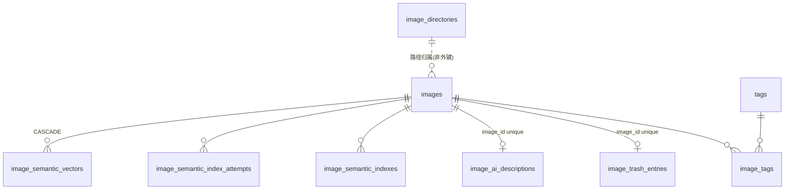

# 图片管理功能设计文档

> 本文档的方向性决策以同目录《设计提案.md》为准（Status: Under review）；提案已接受的决策在本文档中作为固定约束，不再重新论证。

## 二、需求信息

### 2.1 需求背景

- 背景：应用当前只管理视频；用户磁盘上存在大量图片（含 HEIC 与相机 RAW）需要纳入同一应用管理。
- 需求目的：提供图片的扫描入库、独立照片页浏览、标签/收藏/评分、AI 描述、照片页内语义检索、重复清理与可恢复删除。
- 目标用户/使用方：应用唯一本地用户。
- 需求链接：`.loopx/intake/2026-08-07-image-library/`
- 关联原始材料：用户裁决原话见 `clarification.md`（"方案B。独立照片页，RAW/HEIC需要支持。AI打标可以考虑调整方向，应该是一个描述而不是打标签"）。
- Intake package contract：`requirements.md`（canonical `AC-1..AC-11` / `TC-1..TC-9`）；`clarification.md`（supporting evidence，仅按需引用）

### 2.2 需求范围

- 本期范围：图片独立扫描管线、照片页（网格 + 查看器）、共享标签体系、收藏/评分、AI 描述、照片页内语义检索、图片清理审阅（精确/近似重复）、图片回收站、洞察图片维度。
- 非目标：见提案 Goals And Non-Goals；重点重申——不改 `videos` 表、人物/作品集不覆盖图片、不混排、非 macOS 不承诺 RAW/HEIC 解码、无 EXIF、无 watcher、无字幕/播放/超分/同源/AI 质量评估。
- 决策边界：产品级决策已全部在 intake 关闭；本文档只固化技术契约。`plan2exec` 可决定与不可决定事项见 10.5。
- 依赖方：本地 ffmpeg/ffprobe（现有前提）、macOS `sips`（系统自带）、用户配置的 OpenAI 兼容 AI 端点（现有配置）、Postgres + pgvector 0.5+（现有前提）。
- 约束条件：纯增量迁移；`go test ./...` 基线不降；不新增图像解码外部依赖；AI 描述调用不新增独立 Token 配置。
- 触发的辅助 skills：architecture-designer / sql-style / go-style

## 三、概要设计

### 3.1 方案总述

- 设计目标：以最小回归面把图片做成与视频并行的一等实体，尽量复用纯函数级资产（TrashService、differenceHash、getPartialHash、ManagedImage 的原子发布模式、语义/AI 客户端）。
- 总体思路：**复制模式而非泛化现有代码**。八张新表 + 两条新 `/preview/` 路由 + 一组 `Image*` Wails API + 一个新前端页面；现有视频路径零改动（唯一例外：`tag_service` 的删除/合并需补 `image_tags` 分支，见 4.4）。
- 核心模块：ImageService（扫描/CRUD/回收站/清理分析）、ImageThumbnailService（含 sips runner）、ImageAIDescriptionService、ImageSemanticIndexService、PhotoLibraryPage.vue。
- 主要难点：HEIC/RAW 的平台隔离解码；共享 SemanticIndexProfile 下的双索引一致性；近似重复配对的规模控制。
- 技术指标：无量化 SLO；照片页分页每页 60 张流畅加载；近似重复分析在 10 万张量级不发生 O(n²) 全配对。

### 3.3 核心流程设计

| 流程 | 触发条件 | 参与系统/模块 | 主流程 | 异常/补偿 | 输出 |
|---|---|---|---|---|---|
| 图片扫描 | 手动"同步图片目录" / 启动时 `auto_scan_on_startup` | ImageService + image_directories + Settings | 遍历目录→扩展名过滤→与库内对账（新增/迁移/失踪） | 单文件失败跳过留痕；失踪记录软删除入待清理 | ImageScanResult{Added,Relocated,Removed} |
| 缩略图 | 照片页请求 `/preview/image-thumbnail/<id>` | ImageThumbnailService + sips/ffmpeg | 缓存命中→返回；未命中→按格式选解码器→临时文件→原子 rename | 解码失败 404→前端占位 | JPEG 缩略图 |
| AI 描述 | 批量任务或单张重跑 | ImageAIDescriptionService + AI 端点 | 取降采样 JPEG→chat 多模态→写 image_ai_descriptions | 未配置/解码不支持/调用失败→状态与错误码留痕，可重试 | 中文描述文本 |
| 语义索引 | 手动启动图片语义索引 | ImageSemanticIndexService + pgvector | 构建索引文本→embeddings→双写 image_semantic_indexes + image_semantic_vectors | 无描述 Skipped；失败 attempt 留痕可续跑 | 可检索向量 |
| 语义检索 | 照片页内搜索 | ImageSemanticIndexService | 查询向量→`<=>` 距离排序→offset/limit | 能力不可用→明确原因提示 | 图片命中列表 |
| 清理审阅 | 照片页内启动分析 | ImageService 分析方法 | size+采样MD5 精确分组；dHash 汉明近似分组 | stale 哈希跳过并计数 | 候选分组（不自动勾选） |
| 删除/恢复 | 用户操作 | ImageService + TrashService | 镜像视频回收站状态机 | 崩溃后对账；恢复冲突拒绝 | 可恢复回收站条目 |

### 3.4 功能模块

| 模块 | 职责 | 关键功能 | 依赖 | 备注 |
|---|---|---|---|---|
| ImageService | 图片实体生命周期 | 扫描、迁移检测、CRUD、收藏/评分、回收站、清理分析 | Settings、TrashService、imagePathMutationMu | 详见 4.1/4.4/4.5/4.8 |
| ImageThumbnailService | 解码与缓存 | 缩略图、查看大图、尺寸探测、dHash 输入 | ffmpeg、sips(darwin) | 详见 4.2 |
| ImageAIDescriptionService | AI 描述 | 批量三件套、单张重跑、状态机 | AITaggingConfig、缩略图产物 | 详见 4.6 |
| ImageSemanticIndexService | 语义索引与检索 | 索引三件套、照片页检索 | SemanticIndexProfile、pgvector | 详见 4.7 |
| PhotoLibraryPage.vue | 前端照片页 | 网格、查看器、筛选、语义搜索、清理审阅、回收站入口 | Image* Wails API | 详见 4.3 |
| 设置/洞察扩展 | 配置与统计 | 图片目录管理、扩展名设置、图片洞察分区 | SettingsPage、InsightsPage | 详见 4.1/4.9 |

### 3.6 专项设计检查

| 辅助 skill | 触发原因 | 检查内容 | 设计结论 |
|---|---|---|---|
| architecture-designer | 新增并行子系统边界 | 边界/所有权/失败模式/降级 | 并行复制、纯函数级复用；唯一共享状态为 SemanticIndexProfile + 全局语义任务互斥；降级行为逐条固化于各 4.x.4 |
| sql-style | 8 张新表、pgvector、keyset 分页 | 键/唯一性/可空性/幂等迁移/索引论证/分页确定性 | 见五章：全部索引对应明确访问路径；迁移可重复执行；游标排序含 id 决胜列 |
| go-style | 新 Go 服务与平台隔离 | build tag、context、哨兵错误、评分精度 | sips runner 以 `//go:build darwin` 隔离；评分沿用 `*float64`（与 Video.PersonalRating 同型同语义，0–10 半分制由服务层校验）；`gofmt` + `go test ./...` |

## 四、详细设计

### 4.1 图片扫描与目录管理

#### 4.1.1 需求内容

- 入口：设置页"图片扫描目录"块（增/改/删）；照片页与设置页的"同步图片目录"按钮；启动时随 `auto_scan_on_startup` 自动同步。
- 操作人/调用方：前端 → `AddImageDirectory` / `UpdateImageDirectory` / `DeleteImageDirectory` / `GetAllImageDirectories` / `SyncImageDirectories`。
- 前置条件：目录存在且可读。
- 输出结果：`images` 表与磁盘对账一致；返回 `{added, relocated, removed}` 计数。

#### 4.1.2 方案设计

- 核心逻辑（**D-003**，behavior contract）：镜像 `VideoService.SyncScanDirectories` 的对账语义——遍历 `image_directories` 全部活跃目录，按扩展名过滤收集 `ScannedFile{Path,Size}`；与库内活跃图片求差得到新增/失踪集合；失踪与新增先做迁移匹配，剩余新增走 `addImage`，剩余失踪走 `deleteImage(id, false)`（仅删记录不动文件，与视频扫描失踪语义一致）。遍历过滤链：`ScanExcludePaths`（**复用**全局排除路径设置）→ 隐藏路径 → `trash` 目录名 SkipDir → `isTrashPath`。
- 扩展名（**D-004**，data contract）：`Settings` 新增 `ImageExtensions string`（json `image_extensions`）；空值时代码回退默认清单 `.jpg,.jpeg,.png,.gif,.webp,.heic,.heif,.dng,.cr2,.cr3,.nef,.arw,.orf,.raf,.rw2`（镜像 `VideoExtensions` 的空值回退模式，老库升级零回填）。新库 `database.Init` 默认设置块写入该清单。
- 迁移检测（**D-005**，behavior contract）：指纹 `{filepath.Base(path), size}`，**双向唯一**（该指纹在失踪集与新文件集各恰好一条）才认定迁移并原地改写 `path/directory`，保留标签/收藏/评分/描述/向量；否则按新增+失踪分别处理。与视频侧算法一致（`video_service.go:1392-1420` 同款）。
- `addImage`：`os.Stat` → `Unscoped` 路径预查（命中返回已存在错误）→ 创建记录（仅 `name/path/directory/size`）→ 异步探测尺寸（4.2）与 dHash 回填。
- 并发控制：全部路径变更操作持 `imagePathMutationMu`（镜像 `libraryPathMutationMu` 读写锁语义）；扫描同步互斥锁防止并发同步。
- 目录表（**D-001** 之一部分）：`image_directories` 镜像 `scan_directories`（软删除，四个写方法持路径锁）。
- 日志与审计：API 层 `log.Printf` 惯例（镜像 app.go 现有方法体）。

#### 4.1.3 流程步骤

1. 读 `Settings.ImageExtensions`（空则默认清单）与 `ScanExcludePaths`。
2. 逐目录 `filepath.Walk` 收集候选文件。
3. 库内活跃图片按路径建集合，求新增/失踪差集。
4. 迁移匹配（双向唯一）→ relocate。
5. 剩余新增逐个 `addImage`；剩余失踪 `deleteImage(id, false)`。
6. 返回计数，前端刷新照片页。

#### 4.1.4 边界条件

| 场景 | 处理方式 | 用户/调用方感知 | 监控/告警 |
|---|---|---|---|
| 目录不存在/不可读 | 该目录报错计入结果，不中断其他目录 | 同步结果提示失败目录 | log |
| 空目录 | 正常返回 0 新增 | 空态 | 无 |
| 重复添加同一路径记录 | `idx_images_path_active` + 预查拒绝 | "已存在" | log |
| 与视频目录重叠 | 允许；按扩展名分流，默认清单两侧不相交 | 无感知 | 无 |
| 同名不同目录文件迁移歧义 | 双向唯一不满足→按新增+失踪处理，不猜测 | 旧记录进失踪清理 | log |
| 扫描与删除并发 | `imagePathMutationMu` 串行化 | 无感知 | 无 |
| 单文件 Stat 失败 | 跳过该文件 | 无 | log |
| 回收站目录 | `isTrashPath` 过滤，绝不扫回 | 无 | 无 |

#### 4.1.5 不变行为

| 行为/表面 | 保持不变的原因 | 验证方式 |
|---|---|---|
| 视频扫描目录与 `SyncScanDirectories` | AC-1 后半句：互不影响 | 现有测试 + TC-1 |
| `Settings.VideoExtensions` 语义 | 兼容承诺 | 现有测试 |
| `scan_exclude_paths` 对视频的作用 | 复用但不改写解析函数 | 现有测试 |

### 4.2 缩略图与查看管线

#### 4.2.1 需求内容

- 入口：`/preview/image-thumbnail/<id>`（网格）、`/preview/image/<id>`（查看器）。
- 前置条件：图片记录存在且源文件可读。
- 输出结果：JPEG 缩略图 / 原图或转码大图。

#### 4.2.2 方案设计

- 解码矩阵（**D-006**，behavior + operations contract）：

| 格式 | 尺寸探测 | 缩略图（480 高） | 查看大图 |
|---|---|---|---|
| jpg/jpeg/png/gif/webp | ffprobe | ffmpeg `scale=480:-2:force_original_aspect_ratio=decrease -q:v 4`（无 `-ss`） | 原文件直出 |
| heic/heif/RAW @ darwin | `sips -g pixelWidth -g pixelHeight` | `sips -s format jpeg --resampleHeight 480` | `sips` 转 JPEG 长边 2560，缓存 `<id>.view.jpg` |
| heic/heif/RAW @ 其他平台 | 不探测（0×0） | 404 | 404 |

- sips runner：`image_decode_darwin.go`（`//go:build darwin`）+ `image_decode_other.go` stub 返回哨兵错误 `ErrImageDecodeUnsupported`（复刻 `library_watcher_support_*.go` 平台隔离先例）；`exec.CommandContext` 超时 30s、输出有界截断。
- 缓存：独立目录 `~/.video-master/image-thumbnails/`，文件名 `<imageID>.jpg` 与 `<imageID>.view.jpg`（与视频 `thumbnails/<videoID>.jpg` 隔离避免 ID 冲突）。失效判定复刻 `validThumbnailCache`（存在+非空+mtime≥源）。生成用 per-ID `sync.Map` 锁 + 临时文件 + `os.Rename`。`.view.jpg` 参与 LRU 淘汰（上限 256 MiB，镜像 seek-sprite 的 `pruneSeekSpriteCacheLocked` 模式）。
- 路由（**D-007**，interface contract）：`newAssetHandler` 新增两条前缀，GET/HEAD（否则 405+Allow），ID 复用 `assetVideoIDFromPath` 纯数字解析，`http.ServeContent` 直出；缩略图 `Content-Type: image/jpeg` + `Cache-Control: private, max-age=300`；`/preview/image/` 按实际内容类型（原文件时由扩展名映射，转码时 image/jpeg）。`os.ErrNotExist`/`ErrImageDecodeUnsupported` → 404，其余 500。
- dHash 回填：缩略图 JPEG 生成后 `image.Decode` → `differenceHash`（全图 region）→ 写 `images.perceptual_hash` + `hash_source_size/hash_source_mod_time_ns`；随扫描后台任务或缩略图首次生成时机会式回填（实现选其一或两者，plan 决定）。

#### 4.2.4 边界条件

| 场景 | 处理方式 | 用户/调用方感知 | 监控/告警 |
|---|---|---|---|
| 非 darwin 请求 HEIC/RAW 缩略图 | stub 哨兵错误→404 | 占位卡片+格式徽标 | 无 |
| sips 失败/超时（损坏文件） | 404，不写缓存，不中断批量 | 占位 | log |
| 源文件被外部修改 | mtime 失效→重新生成 | 缩略图自动刷新 | 无 |
| 源文件消失 | 404；扫描对账负责记录清理 | 占位 | log |
| 并发首次请求同一图片 | per-ID 锁串行生成 | 稍慢 | 无 |
| 缓存目录超限 | LRU 按 mtime 淘汰 `.view.jpg` 与缩略图 | 重新生成 | 无 |
| 非数字 ID / 非 GET/HEAD | 400 / 405 | 错误码 | 无 |
| 巨幅图片（>100MP） | sips/ffmpeg 自行处理；超时 30s 兜底 | 失败→占位 | log |

#### 4.2.5 不变行为

| 行为/表面 | 保持不变的原因 | 验证方式 |
|---|---|---|
| `/preview/` 现有五条路由 | 兼容承诺 | 现有测试 |
| 视频 `thumbnails/` 缓存目录内容 | 目录隔离，互不写入 | 目录检查 |
| ffmpeg 查找逻辑（LookPath + homebrew fallback） | 复用不改写 | 现有测试 |

### 4.3 照片页与查看器（前端）

#### 4.3.1 需求内容

- 入口：顶部导航新增"图片"（`currentPage === 'photos'`，`v-if` 挂载）。
- 输出结果：网格浏览、筛选、查看器、并承载语义搜索/清理审阅/回收站入口。

#### 4.3.2 方案设计

- 页面契约（**D-015**，behavior contract）：`PhotoLibraryPage.vue` 新组件；CSS Grid `repeat(auto-fill, minmax(180px, 1fr))`，卡片 `aspect-ratio: 1` + `object-fit: cover`，`` + `@error` 占位降级；IntersectionObserver 哨兵（root=`.main-view`，rootMargin 320px）+ 手动"加载更多"兜底；每页 60 张。**首期不做网格虚拟化**（提案已裁决），滚动加载依赖分页节流。竞态防护用 token（照抄 EntityLibraryPage 的 Symbol token 模式）。
- 数据流（**D-017** 之一部分）：`SearchImagePage(request)` request-DTO + 不透明游标（照抄 `LibraryVideoPageRequest` 模式）；筛选条 = 关键词（文件名）、标签多选、仅收藏、评分区间、体积区间；排序 = 最近添加（默认）/体积/评分。
- 查看器：页内 lightbox 覆盖层；``；左右方向键切换、Esc 关闭、F 收藏切换（对齐现有快捷键风格）；侧栏显示文件名、路径、尺寸、大小、格式、标签、评分、AI 描述与"重新生成描述"按钮。非 darwin 的 HEIC/RAW 显示占位与技术信息。
- 语义搜索：照片页内搜索框切换"文件名/语义"模式；语义模式调 `SearchImagesSemantic`，offset 追加分页；能力不可用时显示原因（未配置 AI、无描述、pgvector 不可用）。
- 设置页：新增"图片扫描目录"块（复刻现有目录块 UI + BaseModal）与 `image_extensions` textarea（复刻 `video_extensions`，含空值前端回退默认清单与 `saveSettings` 全量提交、App.vue settings 默认值同步）。

#### 4.3.4 边界条件

| 场景 | 处理方式 | 用户/调用方感知 | 监控/告警 |
|---|---|---|---|
| 空库/无目录 | 空态引导添加目录 | 引导文案 | 无 |
| 缩略图 404 | 占位卡片（文件名+格式徽标） | 可点开查看详情 | 无 |
| 快速滚动大库 | lazy img + 分页节流 | 顺滑加载 | 无 |
| 筛选变更竞态 | token 校验丢弃过期响应 | 无错乱 | 无 |
| 查看器打开时图片被删除 | img error→提示并关闭 | 提示 | 无 |
| 语义不可用 | 搜索模式切换处显示原因禁用 | 明确提示 | 无 |

#### 4.3.5 不变行为

| 行为/表面 | 保持不变的原因 | 验证方式 |
|---|---|---|
| 现有五个页面与导航行为 | 兼容承诺 | 手动回归 + 现有前端测试 |
| VideoListPage.vue 不改动（清理审阅入口除外亦不动） | 控制回归面 | diff 审查 |
| `.main-view` 滚动宿主结构 | 虚拟列表与哨兵依赖 | 现有测试 |

### 4.4 标签、收藏与评分

#### 4.4.2 方案设计

- 标签（**D-002**，data contract）：`Image.Tags []Tag gorm:"many2many:image_tags"` 指向现有 `tags` 表；打标/去标 API 镜像视频侧（含批量，返回 `BatchImageOperationResult`）。**现有 `tag_service` 需要的唯一改动**：`DeleteTag` 软删除标签时同步清理 `image_tags` 行；`MergeTags` 把源标签的 `image_tags` 行改写到目标标签并去重。视频侧行为不变。首期不在标签管理对话框展示图片使用计数；现有一切"标签使用统计"查询保持视频口径。
- 收藏/评分（**D-013**，behavior contract）：`is_favorite bool` + `personal_rating`（与 `Video.PersonalRating` 同 Go 类型、同 GORM 标签、同 0–10 半分制校验：0.5 步进、范围 [0,10]、可清空为 NULL）。`SetImageFavorite(id, fav)` / `SetImageRating(id, rating)`；照片页可按收藏与评分区间筛选、按评分排序（NULL 排后，镜像 `RatingIsNull` 游标处理）。

#### 4.4.4 边界条件

| 场景 | 处理方式 | 用户/调用方感知 | 监控/告警 |
|---|---|---|---|
| 给图片打已软删除标签 | 拒绝（镜像视频侧行为） | 错误提示 | 无 |
| 重复打同一标签 | 幂等（关联表唯一键冲突忽略或预查） | 无变化 | 无 |
| 合并标签时图片与视频同时挂两个源标签 | UNION 改写后按唯一键去重 | 标签合并正确 | 测试覆盖 |
| 评分越界/非 0.5 步进 | 服务层校验拒绝 | 错误提示 | 无 |
| 清空评分 | 置 NULL | 筛选不命中 | 无 |

#### 4.4.5 不变行为

| 行为/表面 | 保持不变的原因 | 验证方式 |
|---|---|---|
| 视频打标/去标/12 色自动分配 | AC-4 后半句 | 现有测试 + TC-3 |
| 视频侧标签统计口径 | 兼容承诺 | 现有测试 |
| 短视频自动标签逻辑 | 只作用于视频 | 现有测试 |

### 4.5 图片回收站

#### 4.5.2 方案设计

（**D-008**，data + behavior contract）`image_trash_entries` 镜像 `video_trash_entries` 全字段（`image_id` uniqueIndex、`original_path/trash_path/file_moved/file_size/file_mod_time/file_identity/file_sha256/state/last_error`）与四态状态机（`pending_move/deleted/restoring/rollback`）；文件操作直接复用 `TrashService`（同级 `trash/` 目录、硬链接优先、`O_EXCL` 拷贝校验、绝不覆盖）。删除流程：先写 `pending_move` 条目→移文件→指纹校验→事务 CAS 置 `deleted` + 软删图片。恢复：`RestoreImageTrashEntry` 持写锁，目标存在即拒绝；成功后物理删除条目并复活记录（标签/评分/描述/向量随软删除复活自然保留——除向量表外均为软删除；向量表 CASCADE 只在硬删时触发）。启动对账镜像 `cancelInterruptedDeletion/reconcilePendingDelete`。`DeleteImage(id, deleteFile)` / `BatchDeleteImages(ids, deleteFile)`；`deleteFile=false` 时仅软删记录不建条目（与视频语义一致）。

#### 4.5.4 边界条件

| 场景 | 处理方式 | 用户/调用方感知 | 监控/告警 |
|---|---|---|---|
| 恢复目标已存在同名文件 | 拒绝不覆盖 | 明确报错（TC-5） | log |
| 重复删除同一图片 | `image_id` uniqueIndex 拒绝 | 错误提示 | 无 |
| 删除中崩溃 | 启动对账按 state 恢复/回滚 | 无数据丢失 | log |
| 回收站文件被外部改动 | 恢复前指纹校验失败→拒绝并留痕 | 明确报错 | log |
| 跨设备移动 | 硬链接失败→O_EXCL 拷贝+双 SHA 校验 | 稍慢 | 无 |
| 软删记录路径被新文件复用后恢复 | 部分唯一索引冲突→拒绝恢复 | 明确报错 | log |

#### 4.5.5 不变行为

| 行为/表面 | 保持不变的原因 | 验证方式 |
|---|---|---|
| 视频回收站条目与状态机 | 兼容承诺 | 现有测试 |
| `TrashService` 公共函数签名 | 两侧共用 | 现有测试 |

### 4.6 AI 描述

#### 4.6.2 方案设计

（**D-009**，data + interface contract）

- 存储：`image_ai_descriptions` 单表承载结果与状态：`image_id` uniqueIndex + CASCADE、`status`（pending/processing/completed/failed）、`description text`、`model_identifier size:255`、`error_code size:64`、`last_error text`、`attempt_count`、`generated_at *time`。不建 run 历史表（AI 质量评估不覆盖图片）。
- 请求：复用 `SettingsAITaggingConfigProvider` 配置与 `doChatCompletion` 模式；单图一次请求，messages = system 提示 + user content [提示文本, `{"type":"image_url","image_url":{"url":"data:image/jpeg;base64,<缩略图管线产物，最长边 512>"}}`]；`temperature 0.1`、超时 5 分钟、无客户端重试（重试语义由 `attempt_count` 承担）。落库前对描述执行现有脱敏（API key/绝对路径正则）。
- 提示词契约：要求输出一段 80–200 字中文自然语言描述（内容、场景、风格），禁止标签列表/JSON/Markdown；响应直接取 `choices[0].message.content` 全文。
- 任务：批量三件套 `StartImageAIDescription / GetImageAIDescriptionStatus / CancelImageAIDescription`（单 worker，目标 = 无 completed 描述且非 processing 的图片；可取消、进度事件推送镜像语义索引模式）；单张 `RegenerateImageAIDescription(imageID)` 同步执行并覆盖旧描述（描述变化会使语义索引指纹失配，下次索引任务自动重建该图）。启动时 `processing` 复位为 `failed/interrupted`（镜像 `recoverInterruptedRuns`）。
- 输入取材：直接使用缩略图管线的 480 高 JPEG（≤512 约束天然满足；HEIC/RAW 被转码覆盖）；缩略图不可得（非 darwin 的 HEIC/RAW、损坏文件）→ 该图记 `failed/decode_unsupported`，批量任务继续。

#### 4.6.4 边界条件

| 场景 | 处理方式 | 用户/调用方感知 | 监控/告警 |
|---|---|---|---|
| AI 未配置 | Start/Regenerate 返回明确错误 | 设置引导提示 | 无 |
| 单图调用失败/超时 | failed + error_code，批量继续 | 状态面板可见失败数 | log |
| 响应为空/超长 | 空→failed/empty_response；超长截断到 4000 runes | 描述可用 | log |
| 取消 | context 取消，当前图状态回退 pending | 任务停止 | 无 |
| 中途崩溃 | processing→failed/interrupted | 可重跑 | log |
| 重复 Start | 运行中拒绝二次启动 | "任务运行中" | 无 |
| 图片在任务中被删除 | 软删检查跳过；硬删由 CASCADE 清理 | 无 | 无 |

#### 4.6.5 不变行为

| 行为/表面 | 保持不变的原因 | 验证方式 |
|---|---|---|
| 视频 AI 打标全链路（候选/审批/同源/质量评估） | AI 描述是独立平行链路 | 现有测试 |
| `ai_tagging_*` 配置字段语义 | 只读复用 | 现有测试 |
| AI 数据外发边界（仅降采样帧+提示词） | 安全承诺 | diff 审查 |

### 4.7 语义索引与照片页语义检索

#### 4.7.2 方案设计

（**D-010** data contract；**D-011** behavior + interface contract）

- 表：`image_semantic_indexes` / `image_semantic_index_attempts` 镜像视频侧同名表（`image_id` 替换 `video_id`，唯一键 `(image_id, model_identifier, dimension)` / `(image_id, model_identifier, generation)`）；`image_semantic_vectors` DDL 镜像 `video_semantic_vectors`（PK `(image_id, model_identifier, dimension)`、`REFERENCES images(id) ON DELETE CASCADE`、`CHECK (vector_dims(embedding)=dimension)`、HNSW `vector_cosine_ops`）。`PrepareImageSemanticVectorStorage` / `EnsureImageSemanticVectorANNIndex` 镜像现有幂等 DDL。
- Profile 共享：图片索引使用全局 `SemanticIndexProfile`（id=1）的 ActiveModel/Dimension/Generation；图片任务不单独触发 rebuild（模型变更仍由现有入口驱动，generation 递增对两侧同时生效）。**应用层互斥：同一时间仅允许一个语义索引构建任务（视频或图片）**，另一侧 Start 返回"已有语义索引任务运行中"。
- 索引文本：`标题`（文件名）+ `标签` + `AI 描述` 三段，复用 `appendSemanticSection` 结构、脱敏、截断（总 8192 runes）与 sha256 指纹。**无 completed 描述的图片跳过（Skipped）**。续跑判定与失败码集合镜像视频侧（`embedding_failed/dimension_mismatch/persist_failed/...`）。
- 检索：`SearchImagesSemantic(request{Query, Filter(标签/收藏/评分/体积), Offset, Limit})`；SQL 镜像 `querySemanticDistances`——`images JOIN image_semantic_vectors`、`WHERE model_identifier/dimension/generation 匹配 AND images.deleted_at IS NULL`、`embedding <=> CAST(? AS vector)`、`ORDER BY distance ASC, images.id ASC OFFSET ? LIMIT ?+1`；score=`1-distance` 截断 [-1,1]；查询向量缓存复用现有 TTL/容量模式。**视频页任何搜索路径不查图片表；照片页语义结果不含视频**（AC-6）。

#### 4.7.4 边界条件

| 场景 | 处理方式 | 用户/调用方感知 | 监控/告警 |
|---|---|---|---|
| pgvector 不可用/非 Postgres | capability 不可用+原因码，检索与索引拒绝 | 明确提示 | log |
| profile 不存在（从未跑过视频索引） | 图片索引任务按现有 prepare 逻辑创建 profile（同款 CAS） | 正常使用 | 无 |
| 视频重建后图片索引过期 | generation 失配→下次图片任务全量重建 | 需重跑索引提示 | 状态面板 |
| 无描述图片 | Skipped 计数 | 状态面板可见 | 无 |
| 描述更新 | 指纹失配→下次任务重建该图 | 检索反映新描述 | 无 |
| 两侧任务并发 Start | 全局互斥拒绝 | "任务运行中" | 无 |
| 维度漂移（端点换模型未换名） | `dimension_mismatch` 失败留痕，镜像现有语义 | 明确错误 | log |
| offset 翻页间隙索引变动 | 与现有视频语义搜索同款已知边界（可能漏/重） | 文档化 | 无 |

#### 4.7.5 不变行为

| 行为/表面 | 保持不变的原因 | 验证方式 |
|---|---|---|
| `video_semantic_vectors` 表与视频语义搜索 | 兼容承诺 | 现有测试 + TC-4 后半句 |
| `SemanticIndexProfile` 单行语义与 rebuild 入口 | 共享但不改写 | 现有测试 |
| embedding 端点、请求形态、超时 | 只读复用 | diff 审查 |

### 4.8 图片清理审阅

#### 4.8.2 方案设计

（**D-012**，behavior contract）

- 产出结构：`ImageCleanupAnalysis{ DuplicateGroups []ImageCleanupDuplicateGroup, NearDuplicateGroups []ImageCleanupDuplicateGroup, StaleHashCount int64 }`；组结构镜像 `CleanupDuplicateGroup`（Original + Candidates + Reason），Original 选择规则：像素数优先、次按体积（镜像 `isPreferredCleanupVideo` 思路）。**无 LowDuration/LowResolution/SameSourceGroups**（判据不适用，已裁决）。
- 精确重复：分析时实时 `os.Stat` → 按 size 分桶 → 桶内 ≥2 计算 `getPartialHash`（复用采样 MD5）→ `size:hash` 分组；Reason="文件大小和采样哈希一致"。
- 近似重复：读库内已回填的 `perceptual_hash`；`hash_source_size/mod_time` 与当前文件失配 → `StaleHashCount++` 跳过；按哈希 16 位前缀分桶 + 邻居上限（镜像 `perceptualHashMaxBandNeighbors=64/MaxCandidates=256` 常量思路）；组内汉明距离 ≤ 8（64 位 dHash）判相似，连通分量成组。已属精确重复的对与 `image_near_duplicate_dismissals` 排除。
- 任务形态：`StartImageCleanupAnalysis() / GetImageCleanupStatus()` 异步 + 进度事件（镜像 CleanupService）；候选一律不自动勾选；删除走 `BatchDeleteImages(ids, true)` → 回收站；忽略走 `DismissImageNearDuplicateGroup(ids)`（成对写低/高 ID）。删除/恢复后 `InvalidateAnalysis` 失效缓存。UI 在照片页内。

#### 4.8.4 边界条件

| 场景 | 处理方式 | 用户/调用方感知 | 监控/告警 |
|---|---|---|---|
| 哈希未回填（新库/新格式） | 不参与近似分析；StaleHashCount 不计（无哈希≠stale） | 提示可先跑回填 | 状态面板 |
| 文件已被外部修改 | stale 跳过+计数 | StaleHashCount 展示 | 无 |
| 全库无候选 | 空分析结果 | 空态 | 无 |
| 巨型桶（连拍上千张相似图） | 邻居上限截断，分组仍产出 | 候选可能不完整（文档化） | log |
| 分析中删除图片 | 分析快照语义；删除后 Invalidate | 重新分析 | 无 |
| 忽略后再次分析 | dismissals 排除 | 不再出现 | 无 |

#### 4.8.5 不变行为

| 行为/表面 | 保持不变的原因 | 验证方式 |
|---|---|---|
| 视频清理审阅五类候选与行为 | AC-9 末句 | 现有测试 |
| `near_duplicate_dismissals`（视频表） | 图片用独立表 | 现有测试 |

### 4.9 洞察（图片维度）

#### 4.9.2 方案设计

（**D-014**，interface contract）新增 `GetImageInsights() (*services.ImageStats, error)`：`summary{image_count, total_size, favorite_count}` + `storage_by_directory[]` + `storage_by_format[]`（按扩展名聚合）。全部只查 `images` 活跃行。前端 InsightsPage 新增"图片"分区：摘要卡 + 两个 `BucketChart`（目录/格式），复用现有组件与布局断点，不引入图表库。**`GetLibraryInsights()` 及其返回结构一字不改**（AC-11 后半句）。

#### 4.9.4 边界条件

| 场景 | 处理方式 | 用户/调用方感知 | 监控/告警 |
|---|---|---|---|
| 空图片库 | 全零摘要+空图表 | 空态 | 无 |
| 目录/格式桶超过 8 个 | BucketChart 现有 slice(0,8) 截断 | Top8 展示 | 无 |
| 与视频统计并排展示 | 两个独立 API 各自加载 | 图片区加载失败不影响视频区 | 无 |

#### 4.9.5 不变行为

| 行为/表面 | 保持不变的原因 | 验证方式 |
|---|---|---|
| `GetLibraryInsights` 返回结构与数值 | AC-11、TC-9 | 现有测试 + TC-9 |

## 五、存储类设计

### 5.1 库表设计

#### 5.1.1 数据库模型图



#### 5.1.2 表结构

（**D-001**，data contract；全部经 `models.AllModels()` 追加注册 + AutoMigrate；向量表走独立 `PrepareImageSemanticVectorStorage`）

| 表名 | 用途 | 主键 | 关键索引 | 数据量预估 | 备注 |
|---|---|---|---|---|---|
| images | 图片主表 | id | `idx_images_path_active (path) WHERE deleted_at IS NULL`（唯一）；`(directory)/(size)/(is_favorite)/(created_at DESC,id DESC)/(personal_rating)` 均为 `WHERE deleted_at IS NULL` 部分索引 | 10万级 | 软删除 |
| image_tags | 图片-标签关联 | (image_id, tag_id) | 双向索引 (image_id,tag_id) 唯一 + (tag_id,image_id) | 数十万 | GORM many2many |
| image_directories | 扫描目录 | id | 无额外 | 个位数 | 镜像 scan_directories |
| image_trash_entries | 回收站条目 | id | image_id 唯一；trash_path 条件唯一 | 千级 | 镜像 video_trash_entries |
| image_ai_descriptions | AI 描述结果+状态 | id | image_id 唯一；status | 10万级 | CASCADE |
| image_semantic_indexes | 索引元数据 | id | (image_id,model,dimension) 唯一 | 10万级 | 镜像视频侧 |
| image_semantic_index_attempts | 尝试留痕 | id | (image_id,model,generation) 唯一；status | 10万级 | 镜像视频侧 |
| image_semantic_vectors | 向量本体 | (image_id,model_identifier,dimension) | HNSW (embedding vector_cosine_ops) | 10万级 | 原生 SQL 建表，FK CASCADE |
| image_near_duplicate_dismissals | 近似重复忽略 | id | (image_low_id,image_high_id) 唯一 | 千级 | 低 ID 存 low |

`images` 字段明细：

| 字段 | 类型 | 是否必填 | 默认值 | 含义 | 来源/取值逻辑 | 备注 |
|---|---|---|---|---|---|---|
| id | uint | 是 | 自增 | 主键 | — | |
| name | string | 是 | — | 文件名 | `filepath.Base(path)` | |
| path | string | 是 | — | 绝对路径 | 扫描 | 部分唯一索引 |
| directory | string | 是 | — | 所在目录 | `filepath.Dir(path)` | 筛选/统计 |
| size | int64 | 是 | 0 | 字节数 | os.Stat | 迁移指纹之一 |
| width / height | int | 否 | 0 | 像素尺寸 | ffprobe / sips | 0=未探测 |
| format | string(size:16) | 是 | '' | 小写扩展名（无点） | 路径推导 | 洞察聚合 |
| is_stale | bool | 是 | false | 路径失效标记 | 对账 | 镜像视频语义 |
| is_favorite | bool | 是 | false | 收藏 | 用户操作 | D-013 |
| personal_rating | 与 Video.PersonalRating 同型 | 否 | NULL | 0–10 半分制 | 用户操作 | D-013 |
| perceptual_hash | string(size:16) | 是 | '' | 64 位 dHash hex | 缩略图产物计算 | ''=未回填 |
| hash_source_size | int64 | 是 | 0 | 哈希时源大小 | 回填时 | stale 判定 |
| hash_source_mod_time_ns | int64 | 是 | 0 | 哈希时源 mtime | 回填时 | stale 判定 |
| created_at / updated_at | time | 是 | — | 时间戳 | GORM | |
| deleted_at | SoftDeleteTime | 否 | NULL | 软删除 | GORM | index |

其余各表字段与被镜像的视频侧表逐列一致（仅 `video_id → image_id`），不在此重复；`image_ai_descriptions` 字段见 4.6.2。

### 5.2 数据迁移/初始化

- DDL：`models.AllModels()` 追加 8 个模型 → `db.AutoMigrate`（幂等）；`ensureImageQueryIndexes`（best-effort，镜像 `ensureCoreQueryIndexes` 风格）+ `ensureImagePathUniqueIndex`（返回 error，镜像 `ensureVideoPathUniqueIndex`）；`PrepareImageSemanticVectorStorage` 幂等建向量表与 HNSW 索引。
- DML：新库默认设置写入 `ImageExtensions` 默认清单；老库零值由代码回退，无回填。
- 数据回填：无强制回填。dHash 随缩略图生成机会式回填；语义向量随任务显式构建。
- 老数据兼容：不触碰任何现有表。
- 新老系统读写关系：不存在双写；回退二进制后新表静置无害（**D-016**，compatibility contract）。

### 5.3 缓存设计

| 场景 | Key | Value | 数据结构 | 过期时长 | 容量预估 | 失效/刷新策略 |
|---|---|---|---|---|---|---|
| 图片缩略图 | `image-thumbnails/<id>.jpg` | 480 高 JPEG | 磁盘文件 | 无 TTL | ~50KB/张 | mtime≥源否则重建；LRU 上限 256 MiB |
| 查看大图（HEIC/RAW 转码） | `image-thumbnails/<id>.view.jpg` | 长边 2560 JPEG | 磁盘文件 | 无 TTL | ~1MB/张 | 同上，参与同一 LRU |
| 语义查询向量 | sha256(baseURL+model+query) | []float64 | 内存 LRU | 10 分钟 | 8 条 | 复用现有模式 |

## 六、其他组件设计

### 6.2 配置设计

| 配置项 | 环境 | 默认值 | 是否动态生效 | 说明 | 风险 |
|---|---|---|---|---|---|
| Settings.ImageExtensions（`image_extensions`） | DB 单行 | 新库写默认清单；老库 '' 代码回退 | 是（下次扫描生效） | 图片扫描扩展名，逗号分隔 | 用户加入视频扩展名会导致双侧入库——文档提示，不做强校验 |
| 复用 `scan_exclude_paths` | DB | 现状 | 是 | 图片扫描同样生效 | 无 |
| 复用 `auto_scan_on_startup` | DB | 现状 | 是 | 启动同步同时覆盖视频与图片目录 | 无 |
| 复用 `ai_tagging_base_url/api_key/model` | DB/env | 现状 | 是 | AI 描述与图片语义 embedding 复用 | 无新增外发端点 |

## 七、接口设计

### 7.1 接口设计原则

沿用现有 Wails 绑定惯例：方法挂 `*App`、`log.Printf` 审计、错误直接返回 `error`、批量操作返回 `BatchImageOperationResult`（镜像 `BatchVideoOperationResult`，含逐项失败原因，无顶层 error）、长任务三件套 Start/Status/Cancel + Wails 事件推送进度。

### 7.2 接口清单

（**D-017**，interface contract；全部为新增，调用方=前端，服务方=App，无鉴权——本地单用户 Wails 绑定）

| 接口 | 幂等 | 备注 |
|---|---|---|
| GetAllImageDirectories / AddImageDirectory(path,alias) / UpdateImageDirectory(id,path,alias) / DeleteImageDirectory(id) | 查询幂等；写操作按唯一路径幂等 | 镜像目录四件套 |
| SyncImageDirectories() → ImageScanResult | 重复执行收敛 | 对账语义 |
| SearchImagePage(ImagePageRequest{Filter,Cursor,Limit}) → ImagePage{Images,NextCursor} | 幂等 | DTO 游标（D-017） |
| GetImageDetail(id) → ImageDetail | 幂等 | 含标签/描述/技术信息 |
| SetImageFavorite(id,bool) / SetImageRating(id,*float64) | 幂等 | D-013 |
| AddTagToImage / RemoveTagFromImage / BatchAddTagToImages / BatchRemoveTagFromImages | 幂等 | D-002 |
| DeleteImage(id,deleteFile) / BatchDeleteImages(ids,deleteFile) | 重复删除被唯一条目拒绝 | D-008 |
| ListImageTrashEntries() / RestoreImageTrashEntry(entryID) | 恢复冲突拒绝 | D-008 |
| StartImageAIDescription / GetImageAIDescriptionStatus / CancelImageAIDescription / RegenerateImageAIDescription(id) | Start 运行中拒绝；Regenerate 覆盖式 | D-009 |
| StartImageSemanticIndex / GetImageSemanticIndexStatus / CancelImageSemanticIndex | 全局语义互斥 | D-010 |
| SearchImagesSemantic(ImageSemanticSearchRequest{Query,Filter,Offset,Limit}) → ImageSemanticSearchPage{Hits,HasMore,Coverage} | 幂等 | D-011 |
| StartImageCleanupAnalysis / GetImageCleanupStatus / DismissImageNearDuplicateGroup(ids) | 分析可重跑；忽略幂等 | D-012 |
| GetImageInsights() → ImageStats | 幂等 | D-014 |

HTTP 路由（D-007）：

| 路径 | 方法 | 响应 | 错误码 |
|---|---|---|---|
| `/preview/image/<id>` | GET/HEAD | 原文件或转码 JPEG（ServeContent，支持 Range） | 400 非数字 / 404 缺失或平台不支持 / 405 / 500 |
| `/preview/image-thumbnail/<id>` | GET/HEAD | JPEG，`private, max-age=300` | 同上 |

## 八、系统发布

### 8.2 降级方案

- 非 macOS 平台 HEIC/RAW：入库与元数据操作可用，缩略图/查看/AI 描述降级为占位与 `decode_unsupported`；恢复方式=在 macOS 上使用。
- AI 未配置：描述与语义功能明确不可用并引导设置；其余功能不受影响。
- pgvector 不可用：图片语义显示原因码不可用；浏览/标签/清理/回收站不受影响。
- 全功能回退：不提供功能开关；回退二进制即整体下线，无数据风险。

### 8.4 回滚方案

- 回滚条件：图片功能引发严重回归。
- 回滚步骤：回退到上一版本二进制。
- 数据回滚：不需要——新表对老版本不可见且无老代码读取；`Settings.image_extensions` 列被老版本忽略。可选手工 `DROP TABLE image_*`。
- 风险：无；不存在改写老数据的路径（D-016）。

## 十、排期与规划

### 10.5 Planning Handoff

- `plan2exec` 可以决定：切片划分与顺序（建议沿提案第 7 节的落地顺序）；dHash 回填的具体触发时机（扫描后任务 vs 缩略图生成时机会式，二选一或并用）；前端组件内部拆分与样式细节；测试文件组织；汉明阈值/分桶常量的命名；提示词具体措辞（在 4.6.2 契约内）。
- 必须返回 `spec` 的事项：任何对 `videos` 表或现有 API 签名的改动需求；共享 SemanticIndexProfile 方案不成立时的替代；解码矩阵新增平台或依赖；表结构对本文档 5.1 的实质偏离。
- 必须返回 `clarify` 的事项：EXIF/watcher/网格虚拟化等已列非目标若被要求进入首期；人物/作品集覆盖图片；搜索混排。
- 推荐下一步：

```text
$plan2exec docs/loopx/design/2026-08-07-image-library/需求设计文档.md
```

## 十一、QA

### 11.2 待确认问题

| 问题 | 需要谁确认 | 阻塞阶段 | 推荐答案 | 状态 |
|---|---|---|---|---|
| EXIF 拍摄时间/相机信息是否立项后续需求 | 用户 | 不阻塞（非目标已裁决） | 后续独立 clarify | open |
| 网格虚拟化性能优化时机 | 用户 | 不阻塞 | 首版实测后再定 | open |

### 11.3 Verification Strategy / TC 覆盖映射

| TC | Source AC | Related D anchors | 设计级验证策略 | 自动化/人工 | Deferred rationale |
|---|---|---|---|---|---|
| TC-1 | AC-1 | D-001/D-003/D-004/D-005 | 扫描服务单测：入库、幂等重扫、迁移双向唯一、排除路径 | automation | 无 |
| TC-2 | AC-2/AC-3 | D-006/D-007/D-015 | darwin 上 sips runner 单测（样例 heic/nef 夹具）+ 路由 handler 测试；查看器人工验证 | automation + manual | 非 darwin CI 覆盖 stub 404 路径 |
| TC-3 | AC-4 | D-002 | 打标/筛选单测 + 视频侧标签行为回归（含 DeleteTag/MergeTags 双表用例） | automation | 无 |
| TC-4 | AC-5/AC-6 | D-009/D-010/D-011 | 描述状态机单测（mock client）；索引/检索单测（mock embed + pgvector 集成测试跟随现有语义测试形态）；视频页不混排断言 | automation | 无 |
| TC-5 | AC-7 | D-008 | 回收站状态机单测：删除、恢复、冲突拒绝、崩溃对账（镜像现有 trash 测试） | automation | 无 |
| TC-6 | AC-8 | D-016 | 全量 `go test ./...` + 前端现有测试基线对比 | automation | 无 |
| TC-7 | AC-9 | D-012 | 精确/近似分组单测（构造同字节与缩放差异夹具）；忽略与回收站链路 | automation | 无 |
| TC-8 | AC-10 | D-013 | 收藏/评分校验与筛选单测 | automation | 无 |
| TC-9 | AC-11 | D-014/D-016 | ImageStats 聚合单测 + GetLibraryInsights 结果不变断言 | automation | 无 |

### 11.4 Design Contract Index / D-* 完整索引

| D anchor | Source AC | Contract type | Decision summary | Boundary / non-goal | Downstream expectation |
|---|---|---|---|---|---|
| D-001 | AC-1 | data | `images` 表结构 + `idx_images_path_active` 部分唯一索引 + 8 表族注册 AutoMigrate | 不含 EXIF、不含视频专属列 | 表列与索引按 5.1 落地，不增删列 |
| D-002 | AC-4 | data | image_tags 共享 tags 表；DeleteTag/MergeTags 补 image_tags 分支 | 不做图片使用计数展示；视频统计口径不变 | 合并/删除必须双表处理并有测试 |
| D-003 | AC-1 | behavior | 独立目录表 + 对账扫描语义；复用 exclude/auto_scan；无 watcher | 不与视频目录互斥校验 | 扫描幂等、失踪仅删记录 |
| D-004 | AC-1 | data | Settings.ImageExtensions + 默认清单 + 空值代码回退 | 不做格式白名单强校验 | 老库升级无回填 |
| D-005 | AC-1 | behavior | name+size 双向唯一迁移检测，保留全部元数据 | 歧义不猜测 | relocate 保留标签/评分/描述/向量 |
| D-006 | AC-2/AC-3 | behavior/operations | 解码矩阵：ffmpeg 常规 / sips darwin HEIC+RAW / 其他占位；独立缓存目录 + LRU | 不引入 libheif/libraw；非 darwin 不解码 | build tag 隔离 + 30s 超时 + 原子发布 |
| D-007 | AC-2 | interface | `/preview/image/`、`/preview/image-thumbnail/` 两条路由契约 | 不改现有五条路由 | GET/HEAD、数字 ID、404/405 语义 |
| D-008 | AC-7 | data/behavior | image_trash_entries 镜像状态机 + TrashService 复用；恢复绝不覆盖 | 不泛化视频条目表 | 崩溃对账与冲突拒绝有测试 |
| D-009 | AC-5 | data/interface | 描述单表契约 + chat 多模态单图请求（512px、temp 0.1、5min）+ 复用 AITagging 配置 + 中文 80–200 字禁标签 | 无 run 历史表；不进 AI 质量评估 | 状态机可续跑、脱敏落库 |
| D-010 | AC-6 | data | 共享 SemanticIndexProfile；镜像三件套表 + image_semantic_vectors（HNSW cosine）；索引文本=标题+标签+描述；无描述 Skipped | 图片不触发 rebuild | 全局语义任务互斥 |
| D-011 | AC-6 | behavior/interface | 照片页内 offset/limit 语义检索，limit+1 探测 hasMore | 视频页不混排、全局搜索不含图片 | 混排断言测试 |
| D-012 | AC-9 | behavior | 精确=size+采样MD5 实时；近似=缩略图 dHash 汉明≤8 + 前缀分桶限流；独立 dismissals 表；删除走回收站 | 无 LowDuration/LowResolution/同源 | 候选不自动勾选 |
| D-013 | AC-10 | behavior | is_favorite + personal_rating（与视频同型同校验 0–10 半分制） | 不参与播放权重类逻辑 | 筛选/排序含 NULL 语义 |
| D-014 | AC-11 | interface | 独立 GetImageInsights；GetLibraryInsights 一字不改 | 图片不进视频统计 | TC-9 不变断言 |
| D-015 | AC-2 | behavior | 照片页 CSS Grid + 哨兵分页（60/页）+ lightbox 查看器 + v-if 挂载 | 首期无网格虚拟化 | 竞态 token、占位降级 |
| D-016 | AC-8 | compatibility | 纯增量：videos/现有 API/现有路由/现有行为零改动（唯一例外 D-002 的 tag_service 增量分支） | 不提供功能开关 | TC-6 基线不降 |
| D-017 | AC-1 | interface | Wails API 清单（7.2）：Image* 命名 + DTO 游标 + 批量结果对象 + 长任务三件套 | 不改现有方法签名 | 前端只透传不构造游标 |
