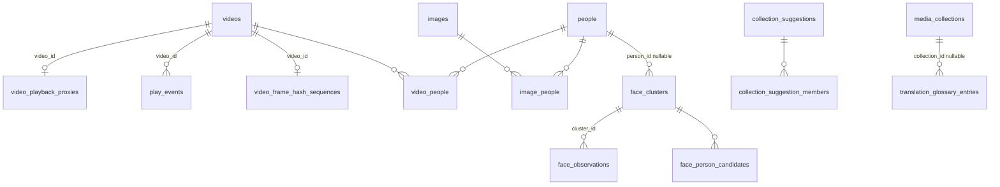

# CineInsight 九项能力扩展与代码健康治理设计文档

> 来源：intake package `.loopx/intake/2026-09-02-capability-batch/`，canonical 契约为其 `requirements.md`（AC-01..AC-25、TC-01..TC-12）；`clarification.md` 仅在引用用户原话与三轮裁决时使用。方向性取舍见同目录《设计提案.md》，本文不重开其已接受的决定。

## 一、修订历史

| 版本号 | 修订内容 | 修订时间 | 修订人 |
|---|---|---|---|
| V1.0.0 | 新建初稿：十个模块的详细设计、七张新表、Settings 新列、接口清单、发布与回滚、TC 覆盖映射、D-001..D-039 索引 | 2026-09-02 | Claude（受 zhangyukun 委托） |
| V1.0.1 | 独立计划评审（2 Critical / 14 Important）回写：① D-019 删去「named 簇吸收新观测自动写关系」——与 canonical requirements D-4f / AC-11 直接冲突，改为生成追加候选；② D-002 软删除时也连带删代理，回到 requirements D-1b（初稿写成软删除保留，与来源相悖）；③ D-009 命名真实函数 `dispatchFormalPlayback` 并写明统计事务失败时沿用今天「只记日志、播放仍成功」的语义——初稿的「recordPlay」不存在且回避了这个行为契约；④ 4.4.1 入口收窄为设置页分区 + 命令面板任务组，去掉视频列表/照片页独立入口；⑤ 10.5 把「人脸切片写入不相交」改为「串行排最后」——共享文件决定了不可能不相交；⑥ D-011 类型名更正为 `services.LibraryStats`；⑦ 11.2 增加「named 簇自动追加」作为用户可选放宽项 | 2026-09-02 | Claude（受 zhangyukun 委托） |
| V1.0.16 | P-006 最后一轮回写：① D-004 补充——手机端 `ResolveMedia` 对「白名单不命中且无可用代理（从未有过或已失效）」的视频返回不可入选（404），不回落源文件 MIME；② D-038 落地形态：`models/schema_test.go::TestAllModelsIsTopologicallyOrdered` 作为结构性守卫，迁移器夹具每表至少一行并以任一表为空即失败自守 | 2026-09-02 | Claude（受 zhangyukun 委托） |
| V1.0.15 | P-013 实施回写：① 新增错误码 `cluster_not_named`（确认追加要求簇已命名）；② 人物被删除时外键只能置空 `person_id`，`reconcileFaceClusterPeople` 在列举与动作前把 `named AND person_id IS NULL` 的簇拉回 `unnamed`（实现 4.4.4 边界所必需）；③ `Dismiss` 不要求簇 named、`Confirm` 要求；④ 观测数按观测行现算；⑤ `Ignore`/`Confirm`/`Dismiss` 返回 error，`Name`/`Link` 返回簇视图；⑥ 候选漂移在读侧按当前相似度过滤（分析侧只增不删）；⑦ 软删除媒体照样建关系，只跳过永久删除的；⑧ 11.2「named 簇自动追加」维持不放宽；⑨ 未提供「预览簇内媒体」入口（记为后续产品决定） | 2026-09-02 | Claude（受 zhangyukun 委托） |
| V1.0.14 | 复核回写：D-038 补两条硬规则——`models.AllModels()` 必须按外键拓扑排序（被引用表在前，many2many 的连接表由迁移器最后处理），由结构性守卫测试钉住；迁移器往返夹具每张表至少一行。起因：复核发现既有的 `ShortFeedImageInteraction` 排在 `Image` 之前会让已上线的后端切换对看过手机端图片的用户失败（与本批人脸表的同类问题一起修）。另：手机端对「白名单不命中且代理失效」的视频必须返回不可入选，不得回落源文件 MIME（D-004 补充） | 2026-09-02 | Claude（受 zhangyukun 委托） |
| V1.0.13 | P-006/P-008/P-012 独立评审（0 Critical / 6 Important / 24 Minor）回写：① D-003 转码改为按**长边** ≤1920 约束（初稿只约束宽度，竖屏 4K 会产出 1920×3413 违反 AC-03）；② D-005 淘汰保护窗口必须严格大于 `last_used_at` 节流窗口（等长会让正在播放的代理被淘汰），且行陈旧超过 grace 时绕过节流强制刷新；③ D-001 异常处理与 D-G4 的矛盾定为：持久化的 stderr 尾部**擦除绝对路径**后保留（P-006、P-008 同口径）；④ D-039 表述修正：本批新增网络出口是显式 `PrepareFaceRuntime` 的三项——PyPI 依赖安装、可能的托管 Python tarball、模型包——准备完成后分析全程离线，设置页披露须如实；⑤ D-017 补：重新分析删旧观测时必须重算受影响簇的 `observation_count`（否则候选门、质心加权与幽灵簇全错）；图片/头像观测的 `frame_ms` 存哨兵 `-1` 而非 NULL，让数据库唯一键真实生效；⑥ D-038 补：迁移器往返测试必须为六张新表各造非空行并逐字节断言三个 BLOB 列；⑦ 评审项 #12（旧五类输入集被扫描根裁剪）核实为本批开工前的未提交改动，非本批引入，快照测试改为配置扫描根后钉住含裁剪的现状；⑧ 记录不改：`clip_dismissals` 无外键（惰性无害）、粗筛为有意非等价剪枝 | 2026-09-02 | Claude（受 zhangyukun 委托） |
| V1.0.12 | P-006 / P-008 / P-012 实施回写。**P-006**：① 新增 `BatchCreatePlaybackProxiesForFilter(filter)`（服务端解析筛选成 ID，与 NFO 批量写出同套路）与 `ScanSyncResult.AddedVideoIDs`（D-006「本次新增」的载体）；② HEVC 一律 `-tag:v hvc1`（`media_streams` 无 `codec_tag_string`，对 hvc1 源打 hvc1 是空操作）；③ transcode 也 `-map 0:v:0 -map 0:a:0?`（否则默认流选择把 ASS 带进 mp4 报错）；④ 取消后 worker 退出前再触发报 `ErrPlaybackProxyStopping`（与 `LocalMetadataService` 口径一致）；⑤ 「队列取空」与「翻 Running」同锁判定；⑥ 行菜单项落 `VideoListPage.vue`（`VideoListRow` 只 emit），「为当前筛选生成代理」落管理菜单「补全」组；⑦ 代理表不存路径，文件名由 `videoID + sha256(size:mtimeNS)[:16]` 推导。**P-008**：① `stale_frame_hash_count` = 未回填 + 失效（pHash 同名计数只数失效）；② 一个片段只报一条候选（取命中率最高、同率取更长完整片）；③ ffmpeg 加 `-v warning -fflags +discardcorrupt`；④ 真实 fixture 用 `mandelbrot`（`testsrc` 缩到 9×8 后帧间差异不足以区分偏移）；⑤ D-026 基准分档：1080p H.264 两小时约 80 s 达标，4K HEVC 软解约 12 min 不达标，`-hwaccel` 留后续。**P-012**：① 走 insightface 1.0.1 纯 Python wheel（`--no-deps` 单装避免 GUI 版 opencv 覆盖 headless），运行时约 700 MB 接受；② 托管 Python 区间 3.10–3.13（onnxruntime wheel 只到 cp313）；③ 被忽略簇继续参与比对吸收新观测、不再冒成新簇（ID-02 推断）；④ 多态 `media_id` 无法数据库级联，孤儿观测由分析前 `pruneOrphanFaceData` 清理（软删不清、硬删才清）；⑤ 无脸写 `bbox_hash='no_face'` 标记行，全部帧检测失败按失败记账不写 no_face；⑥ `quality`/`similarity` 在 Postgres 为 `numeric`（GORM float64 默认映射）；⑦ `whisperx_runtime.go` 抽出四个共用函数并让托管 Python 下载接 ctx，WhisperX 行为逐字不变；⑧ 命令面板给运行中的人脸分析补取消绑定，启动带 scope 参数不进面板 | 2026-09-02 | Claude（受 zhangyukun 委托） |
| V1.0.11 | P-007 实施回写：① 7.3.2 `Confirm` 由「单事务」改为「每步自身原子（复用 `CollectionService` 各自事务）+ 整体可重入」——SQLite `_txlock=immediate` 下外层再套事务必然自锁；任何一步失败候选留 `pending`，重试走加入同名分支、Add 跳过已存在成员、Reorder 重排，结果与一次成功等价，`Confirm`/`Dismiss` 由 `confirmMu` 串行；② D-023 规则补充：集号由 `[NN]` 模式命中且去噪后系列名为空时，取紧邻集号括号之前、非质量标签且非纯数字的方括号组作为系列名（覆盖 `[字幕组][片名][05][1080p]` 番剧命名）；③ `series_name` 保留大小写供展示、`normalized_series` 小写作分组键；④ 不在任何扫描根下的视频跳过（凑空根等于跨根合并）；⑤ 轻任务不经 `MediaWorkSlot`、无项间检查点，`Status` 无 `Gate` 字段；⑥ 面板由 `LibraryToolbar` 自持渲染。**D-005 补充**：`proxy_cache_limit_bytes` 等默认非零数值列同样不用 gorm default 标签（0 = 不限会被迁移器翻回默认），默认值由显式迁移与新库显式行给出 | 2026-09-02 | Claude（受 zhangyukun 委托） |
| V1.0.10 | P-004 实施回写：① 通知开关放「基本设置」分区而非独立分区（设计 4.3.1 只要求开关；并行期避免四处改 `SettingsPage.vue`）；② 通知文案含任务名与显示名、**不含失败原因**——底层报错常带绝对路径，通知会进系统通知中心留存，用测试断言正文无 `/`；③ 设置不可读时不发通知（fail-closed，通知是外显副作用，读不到开关等于无法确认同意；与 D-032 空闲门 fail-open 有意相反）；④ 前端挂载时额外同步一次前后台，避免启动即前台却按「默认后台」白发一条；⑤ 触发清单维持 D-013 原文，备份**恢复**失败与「转储成功但轮转失败」不发；⑥ darwin 非 bundle 运行时用 `NSBundle.bundleIdentifier` 判定并记一行日志 | 2026-09-02 | Claude（受 zhangyukun 委托） |
| V1.0.9 | P-009 实施回写：① ⌘K 在片库页早已绑定「清理审阅」且菜单印有 ⌘K，D-029 的「⌘K」与「不改现有快捷键」冲突，裁决命令面板改用 **⌘⇧P / Ctrl+Shift+P**，既有快捷键与文案零改动；② 任务组只列零参 `Start*`/`Cancel*` 绑定，需要选参数的任务（字幕、超分、语义索引、清理分析）闲置时不出现；③ 作品集/人物懒加载各取前 50 条（已知限制）；④ 业务逻辑放 `utils/appCommands.js`（mixin）与 `utils/taskCommands.js`，`App.vue` 只留挂载点；`SettingsPage.SETTINGS_SECTIONS` 改命名导出；`EntityLibraryPage` 新增可选 `focusEntity` prop 承接跨页落点 | 2026-09-02 | Claude（受 zhangyukun 委托） |
| V1.0.8 | P-003 复验暴露修复引入的丢唤醒（`Release` 先于 `Wait` 注册）：D-032 先补 per-key release epoch，复验指出仍留几条指令的窗口，最终改为钩子实例上的 sticky `detached` 标记（epoch 移除）；`Release` 只释放 pause-hook 等待者；`ErrIdleGateTaskNotWaiting` 前端静默处理；正文与索引行同步改写为 `StartWithPauseHook` / `TaskPauseHook` 接口口径（初稿的 `SetPauseHook` 描述已过时） | 2026-09-02 | Claude（受 zhangyukun 委托） |
| V1.0.7 | P-003 独立评审（7 Important）回写到 D-032：① 装钩子必须与翻 Running 同锁——服务提供 `StartWithPauseHook(ctx, hook)`，显式 `Start` 在同一锁内摘钩子并 `Release` 已停在检查点的 worker；② `TaskPauseHook` 是接口（`Wait`/`Release`），`IdleGate.Release(taskKey)` 可唤醒等待者；③ `RunGatedTaskNow` 只对当前被挡住的任务生效否则报错，bypass 在本轮结束或 Run 返回且从未进登记表时清除，10 分钟兜底；④ 门按 key 去重 Run 等待者，项间检查点不去重；⑤ 探测只用独立 `context.Background()`；⑥ `idle_scheduling_enabled` 不带 gorm default 标签（GORM Create 跳零值会让迁移器翻回 true），默认开只靠显式迁移与新库显式行——**此规则推广到本批全部默认 true 布尔列**（D-013 的 `desktop_notifications_enabled` 同此）；⑦ `GetIdleSchedulerStatus` 只读缓存并后台补探测，状态含 `probed`/`settings_error`；保存设置即时失效缓存 | 2026-09-02 | Claude（受 zhangyukun 委托） |
| V1.0.6 | P-003 实施回写：① D-030 口径收窄——AI 打标 worker 循环同时服务显式 `TriggerAITagging` / `RetryVideo`，无法在不误伤显式路径的前提下装项间检查点，因此其启动批次与 5 分钟 ticker 不受门，只有自动唤醒（startup、片库监听、扫描后）经 `IdleGate.Run`；清理分析无逐项循环也只在 `Run` 层过门；② bypass 的「一次性」定义为「到这一轮跑完」而非「放行一项」；③ 钩子只在服务空闲时由自动路径安装、显式路径启动前 `SetPauseHook(nil)` 摘除；④ 设置读取失败时门直通（把任务卡在查不到状态的门后比恢复旧行为更糟）；⑤ 顺带修范围外既有缺陷：`UpdateSettings` 漏保存四个 `auto_*` 开关 | 2026-09-02 | Claude（受 zhangyukun 委托） |
| V1.0.5 | P-010 实施回写：① `note` 加 500 字符上限（服务端校验 + 前端 maxlength），源词/目标词维持 200；② 作品集软删除时条目不级联、留库不生效（`ResolveForVideo` 排除已删作品集），与 4.9.4「级联删条目」行为等价但存储不同，有意选择；③ 术语命中筛选放在提示词构造处而非两个调用循环，任何调用方绕不过；④ 只有翻译器实现 `ContextualTranslator` 时才解析术语集，DeepL 路径不新增失败面；解析失败在生成路径按翻译失败保留原文，在工作台直接报错；⑤ `Upsert` 带 ID 按 ID 改写并在撞唯一键时报 `ErrGlossaryTermConflict`；⑥ 术语表编辑区不受双语开关控制；⑦ 作品集级编辑入口只做预览抽屉一处；⑧ `database.go` 未改：唯一索引与 collection 索引由 GORM tag 在两后端建出 | 2026-09-02 | Claude（受 zhangyukun 委托） |
| V1.0.4 | P-011 实施与独立评审回写：① `UpdateVideoDetails` → `replaceVideoPeopleRelations` 是第三条孤儿人物清理路径，同样改用 `personHasRemainingRelations`（初稿 D-015 只点名了 Remove/Set 两类）；② 7.2 补三个纯加法表面：`ImageDetail.people`（单图人物维护需要）、`PersonListItem.active_image_count`（最后关系确认需要）、`GetPersonImages(personID, cursorImageID, limit)` + `PersonImagePage`（`GetPersonDetail` 签名被钉住后图片区块需要独立翻页入口）；③ 记录三项有意选择：确认框按活跃媒体计数而后端按关系行（只会多提示不会少提示）、语义模式下人物筛选置灰但 chips 仍计入徽标（与 ai_tag_state / 拍摄日期一致）、人物筛选放筛选浮层而非工具栏 chip 行（人物无法像标签那样在客户端枚举） | 2026-09-02 | Claude（受 zhangyukun 委托） |
| V1.0.3 | P-005 实施回写：4.2.2「日志与审计：无额外日志」与 4.2.4「启动日志一行」矛盾，定为仅实际回填行数 > 0 时打一行；`PlaysBySource` 形态定为 `map[string]int64`；热力图口径由「每日最后播放落点的视频数」改为「每日播放次数」，前端 tooltip 随之改文案；`recordFormalPlaybackStats` 经 `database.Transaction`，因此恢复模式的维护门也会拦下统计写入（只记日志、播放仍成功，与 D-009 一致） | 2026-09-02 | Claude（受 zhangyukun 委托） |
| V1.0.2 | 复验暴露 D-019 改写后的一致性缺口：追加候选没有接口与存储。补 `face_observations.append_status`（5.1.2）、`ConfirmFaceClusterAppend` / `DismissFaceClusterAppend`（7.2、D-019）、3.3/3.4/4.4.3 的动作清单 | 2026-09-02 | Claude（受 zhangyukun 委托） |

## 二、需求信息

### 2.1 需求背景

- 背景：项目已具备视频/图片两条媒体线、AI 闭集打标、字幕生成与编辑、统一清理、手机端 Feed、双数据库后端。2026-09-02 评估指出九个明确的口子（见《设计提案.md》Background）与四个超过 2000 行的文件。
- 需求目的：以加法方式补齐九项能力，同时把巨型文件拆到可维护规模，为后续每一项功能降低改动成本。
- 目标用户/使用方：单机 macOS 桌面用户（本人）；手机端 Feed 的局域网访客间接受益于代理。
- 需求链接：`.loopx/intake/2026-09-02-capability-batch/requirements.md`
- 关联原始材料：`clarification.md`（用户原话「1，2，3，4，5，6，7，8，9 这些我都觉得有必要，你说的代码健康我觉得也有必要处理」与 Round 1–3 裁决）；`search/` 下三个参考项目（Viso、FrameStack、Caption-Trans）。
- Intake package contract：`requirements.md`（canonical `AC-*` / `TC-*`）；`clarification.md`（supporting evidence，仅按需引用）

### 2.2 需求范围

- 本期范围：requirements.md「Confirmed Scope」十项。
- 非目标：requirements.md「Non-goals」全部条目；本文不再复述。
- 决策边界：CD-01..CD-05 为用户裁决不可重开；ID-01..ID-14 为推断默认，用户复核未否决即固定；《设计提案.md》Detailed Design Handoff 八条为本文固定约束。
- 依赖方：ffmpeg / ffprobe（既有）；VideoToolbox（macOS 内置）；托管 Python + onnxruntime + InsightFace 模型（新，显式下载）；`ioreg` / `pmset`（macOS 内置）；cgo 工具链（Wails darwin 构建已要求）。
- 约束条件：requirements.md「Constraints」全部条目；另加《设计提案.md》Implementation And Transition 的顺序约束（代码健康先于触碰同文件的功能切片）。
- 触发的辅助 skills：architecture-designer, sql-style, go-style

### 2.3 可行性分析

- 业务可行性：九项都直接对应仓库证据中的口子，不引入新的用户概念，除「人物覆盖图片」外无语义重开。
- 技术可行性：每项都有仓库内先例——长任务模式（`TechnicalBackfillService`）、候选审阅（AI 标签/同源）、并行表（短视频交互）、Python 运行时管理（WhisperX）、sidecar manifest 校验（超分）、平台文件对拆（`image_decode_darwin.go`）。真正的新技术面只有两处：darwin cgo 桥接（约 40 行 Objective-C）与 InsightFace sidecar。
- 团队接受能力：单人维护；文档与测试沿用既有格式。
- 时间成本：十个模块、七张表、约二十个新 Wails 方法与七个新前端组件；人脸识别与代码健康各占约四分之一。
- 资源成本：代理磁盘可调上限；人脸模型约 300 MB 一次下载。
- 替代方案：见《设计提案.md》Rationale 表。
- 关键风险：① InsightFace 在 Apple Silicon 的 onnxruntime wheel 与 CoreML EP 兼容性需真机验证；② cgo 文件是首例，构建脚本需确认不影响 `wails build` 签名；③ `VideoListPage.vue` 是 Options API，抽子组件时 `this` 依赖面广，需要逐块搬运并靠既有 `data-test` 测试钉住；④ 帧哈希阈值需要真实截取样本校准，设计给出初值与 fixture 要求。

## 三、概要设计

### 3.1 方案总述

- 设计目标：加法接入、独立开关、行为保持、双后端可用、零新网络出口（显式模型下载除外）。
- 总体思路：每项能力 = 一个新服务（或对既有服务的窄扩展）+ 加法表 + 新 Wails 方法与事件 + 新前端组件/section。共享两个新的进程内基础件：`IdleGate`（空闲门）与 `MediaWorkSlot`（重媒体处理串行槽），以及一个 `BackgroundTaskRegistry`（角标与命令面板的数据源）。
- 核心模块：PlaybackProxyService、PlayEventRecorder（嵌入既有播放路径）、DesktopNotifier + BackgroundTaskRegistry、FaceRuntime + FaceAnalysisService + FaceReviewService、CollectionSuggestionService、FrameHashService + CleanupService 扩展、CommandPalette（前端）、IdleGate、TranslationGlossaryService + 翻译器提示词扩展、代码拆分。
- 主要难点：人脸 sidecar 的打包与真机兼容；Options API 巨型组件的无损拆分；空闲门与既有单 worker 的「项间检查点」接入不改契约。
- 技术指标：remux 路径单文件 ≤ 源时长的 2%；帧哈希两小时片 ≤ 3 分钟（M4，单槽）；人脸暴力比对十万观测 ≤ 300 ms；命令面板打开 ≤ 100 ms；代码健康后四个文件各 ≤ 原行数 40%。

### 3.3 核心流程设计

| 流程 | 触发条件 | 参与系统/模块 | 主流程 | 异常/补偿 | 输出 |
|---|---|---|---|---|---|
| 转封装 | 单视频/批量显式触发；或 AutoCompatibilityProxy + 扫描发现新视频 | PlaybackProxyService、MediaWorkSlot、IdleGate（仅自动）、ffprobe 快照 | 校验源指纹 → 选策略 → ffmpeg 到临时文件 → 校验产物 → rename 到 proxies/ → 写表 → LRU 淘汰检查 | 指纹变化丢弃；ffmpeg 失败记 error；磁盘不足报错不淘汰 | 代理文件 + 表行 + `playback-proxy-state` 事件 |
| 播放事件 | 桌面播放/随机、手机端播放 | VideoService、ShortFeedService | 在递增计数的同一事务内 INSERT play_events | 事务失败整体回滚，计数与事件一致 | 事件行 |
| 通知 | 长任务终态 | 各任务服务 → DesktopNotifier；BackgroundTaskRegistry | 服务 finish → registry 减计数 → 若窗口非前台且开关开 → NSUserNotification | cgo 调用失败只记日志 | 系统通知、角标更新 |
| 人脸分析 | 显式启动；或 AutoFaceAnalysis + 扫描 | FaceRuntime、FaceAnalysisService、MediaWorkSlot、IdleGate | 运行时就绪检查 → 候选媒体（指纹变化或未分析）→ 抽帧/解码 → sidecar 检测+向量 → 写观测 → 增量聚类 → 生成候选 | sidecar 崩溃 → interrupted 可续；单媒体失败逐项记录 | 观测、簇、候选、`face-analysis-state` |
| 人脸审阅 | 用户在待审工作台操作 | FaceReviewService、PersonService | 未命名簇：命名/关联/忽略；已命名簇：确认追加/忽略追加 → 事务写 people / video_people / image_people / 簇与观测状态 | 并发命名冲突返回错误 | 关系、簇状态、观测 append_status |
| 建议作品集 | 显式启动；或 AutoCollectionSuggestions + 扫描 | CollectionSuggestionService | 取活跃视频 → 解析文件名 → 按扫描根+系列名分组 → 排除已入集与已忽略 → 写候选 | 解析不出直接跳过 | 候选表、`collection-suggestion-state` |
| 帧哈希与截取识别 | 显式回填；或 AutoFrameHashSequence + 扫描；清理分析 | FrameHashService、CleanupService | 回填：ffmpeg 抽帧 → dHash 序列 → 写表；清理：时长预筛 → 滑动匹配 → 排除忽略 → 输出 ClipGroups | 回填逐项失败记录；清理只用有效序列 | 序列表、清理结果新类别 |
| 空闲门 | 自动任务启动路径 | IdleGate、各任务服务项间检查点 | Acquire → 空闲则放行；否则 waiting_idle；项间检查点决定暂停/继续 | ioreg 失败视为不空闲并报因 | 任务状态附带 `gate` 字段 |
| 术语翻译 | 双语字幕生成；工作台重译 | SubtitleService / SubtitleWorkbench、TranslationGlossaryService、OpenAI 翻译器 | 取视频所属作品集 → 合并术语 → 每批注入命中术语 + 前批尾部 5 条 → 校验条数 | 条数不符整批失败（既有） | 双语 SRT |

### 3.4 功能模块

| 模块 | 职责 | 关键功能 | 依赖 | 备注 |
|---|---|---|---|---|
| PlaybackProxyService | 代理生命周期 | 创建/批量/删除/清空/LRU/失效/用量 | ffprobe 快照、ffmpeg、MediaWorkSlot | 新 |
| PlayEventRecorder | 事件写入与查询 | 三处写入、洞察聚合、legacy 回填 | VideoService、ShortFeedService、LibraryStats | 嵌入既有服务 |
| BackgroundTaskRegistry | 运行中任务登记 | 增减计数、快照 | 各任务服务 | 新，角标与面板共用 |
| DesktopNotifier | 系统通知与角标 | notify、setBadge | cgo darwin | `_darwin.go` / `_other.go` |
| FaceRuntime | sidecar 生命周期 | 探测、托管 Python、venv、模型下载、健康检查 | WhisperX 运行时模式 | 新 |
| FaceAnalysisService | 观测与聚类 | 候选媒体、抽帧、调用 sidecar、增量聚类 | FaceRuntime、AITaggingExtractor 抽帧、ImageThumbnailService | 新 |
| FaceReviewService | 审阅动作 | 命名/关联/忽略/确认追加/忽略追加/清除 | PersonService | 新 |
| PersonService 扩展 | 图片关系 | Add/RemovePersonImage、详情图片区块、清理判定 | image_people | 扩展 |
| ImageLibraryService 扩展 | 人物筛选 | `PersonIDs` | image_people | 扩展 |
| CollectionSuggestionService | 剧集解析与候选 | 解析、分组、确认、忽略 | CollectionService | 新 |
| FrameHashService | 逐帧哈希 | 回填任务、序列读写 | ffmpeg、MediaWorkSlot | 新 |
| CleanupService 扩展 | 截取类别 | ClipGroups、忽略 | FrameHashService | 扩展 |
| CommandPalette（前端） | 全局面板 | 注册表、模糊匹配、执行 | 各页面注册 | 新组件 |
| IdleGate | 空闲门 | Acquire、项间检查点、立即运行 | ioreg/pmset | 新 |
| TranslationGlossaryService | 术语表 | CRUD、按视频解析生效集 | CollectionService | 新 |
| 翻译器扩展 | 提示词注入 | 术语区块、上下文窗口 | OpenAICompatibleSubtitleTranslator | 扩展 |
| 代码拆分 | 行为保持重构 | app.go / video_service.go / VideoListPage.vue / SettingsPage.vue | 既有测试 | 无新行为 |

### 3.6 专项设计检查

| 辅助 skill | 触发原因 | 检查内容 | 设计结论 |
|---|---|---|---|
| architecture-designer | sidecar、cgo、集中门、共享槽、缓存层 | 事实源/派生边界；失败域；goroutine 所有权；平台隔离；数据外发 | 代理、事件、人脸向量均为可重建派生数据；每个 worker 单一所有者；cgo 与 sidecar 以 build tag 与运行时探测隔离；仅一处显式模型下载出口 |
| sql-style | 七张新表、Settings 新列、回填、双后端 | 键与空值设计；索引对应访问路径；回填幂等；SQLite 方言 | 见第五章：`play_events` 双索引；默认 true 布尔列显式迁移；日期分组 Go 侧归并；BLOB 两端为 `bytes`；SQLite 无 `FOR UPDATE` 依赖 |
| go-style | 新服务、并发、cgo、拆分 | context 首参；`%w`；消费者侧小接口；不为单实现加抽象；拆分零签名变化 | `IdleGate`、`MediaWorkSlot`、`BackgroundTaskRegistry` 为具体类型；服务只加「项间检查点」回调不改 Start/Cancel/Status |
## 四、详细设计

> 每个模块 4.x.4 边界条件与 4.x.5 不变行为必填。`D-*` 内联于决策处，完整索引见 11.4。

### 4.1 兼容性转封装（PlaybackProxyService）

#### 4.1.1 需求内容

- 入口：详情抽屉「生成播放代理」；视频行右键菜单；批量操作栏「为选中生成代理」；结果条「为当前筛选生成代理」；设置页「播放代理」分区（用量、上限、清空）。
- 操作人/调用方：用户显式触发；`AutoCompatibilityProxy` 开启时由 `runPostScanAutomation` 经 IdleGate 触发。
- 前置条件：源文件存在、非目录；技术快照可用（缺失时先同步探测一次）。
- 输出结果：`~/.CineInsight/proxies/<videoID>-<fp16>.mp4` + `video_playback_proxies` 行 + 事件。

#### 4.1.2 方案设计

**D-001｜代理身份与位置（AC-01；behavior + data contract）**：代理是派生缓存，唯一位置 `~/.CineInsight/proxies/`，文件名 `<videoID>-<源指纹 sha256 前 16 位>.mp4`。不进 `videos`，不建同源关系，不写用户媒体目录。边界：任何把代理暴露成片库条目、Finder 可见文件或迁移对象的做法都越界。下游：plan 不得为代理增加「入库」或「替换原文件」选项。

**D-002｜生命周期与失效（AC-02；data contract）**：源指纹 = `size + mtime_ns`（与缩略图、pHash 同口径）。`GetPreviewSession` / 手机端 `ResolveMedia` 命中代理前先 `os.Stat` 源文件并比对指纹；不一致则同步删除代理文件与表行，本次请求按无代理处理。视频记录软删除（`DeleteVideo` 进回收站）或永久删除时都连带删除代理文件与表行（requirements D-1b）；`DeleteVideo` 与永久清理路径都调用 `proxies.DeleteForVideo(videoID)`；回收站恢复后如需代理可再次触发重建。边界：不做后台巡检；失效只在访问时或扫描对账时发现。（V1.0.1：初稿的「软删除保留」与来源相悖，已更正。）

**D-003｜编码策略（AC-03；behavior contract）**：读 `media_streams` 最后成功快照：首个视频流 `codec_name ∈ {h264, hevc}` 且首个音频流 `codec_name ∈ {aac, mp3}`（或无音频）→ `remux`：`ffmpeg -i <src> -map 0:v:0 -map 0:a:0? -c copy -movflags +faststart <tmp>`；否则 `transcode`：`-c:v h264_videotoolbox -b:v <按源码率上限 8 Mbps> -vf <长边 ≤1920 的 scale 表达式，如 scale='if(gt(iw,ih),min(1920,iw),-2)':'if(gt(iw,ih),-2,min(1920,ih))'> -c:a aac -b:a 160k -movflags +faststart`（V1.0.13：按长边约束，竖屏同样不高于 1080p）。永不放大。快照缺失时先调用 `MediaProbeService` 探测一次，失败则任务失败 `probe_failed`。边界：不做多音轨/字幕流保留（代理只服务预览与手机端）。下游：策略常量集中一处，测试用 stub 断言参数数组。

**D-004｜消费与统计不变（AC-01；behavior + compatibility contract）**：`GetPreviewSession` 在 `inlinePreviewMIME(video.Path)` 失败后查有效代理；有则返回 `mode=inline`，`InlineSource.LocatorValue` 仍为 `previewMediaPath(video.ID)`，`ResolvePreviewMedia` 解析到代理路径与 `video/mp4`。手机端 `shortFeedEligible` 与 `ResolveMedia` 同理。`PreviewSession` 新增可选字段 `proxy: {strategy, size}` 供 UI 标注「经代理」。统计语义不变：内嵌预览不计播放、`play_count` 不动。边界：代理不改变正式播放（系统播放器仍打开源文件）。下游：review 检查 `PlayVideo` 路径未引用代理。

**D-005｜体积上限与 LRU（AC-04；operations + data contract）**：`ProxyCacheLimitBytes` 默认 `50 GiB`，`0` 不限。每次代理写入成功后在同一 worker 内执行 `enforceLimit()`：`SELECT ... ORDER BY last_used_at ASC` 逐个删除直到总占用 ≤ 上限；跳过 `last_used_at` 在保护窗口内的行，保护窗口严格大于节流窗口（如 2×），行陈旧超过 grace 时绕过节流强制刷新（V1.0.13）。`last_used_at` 由 `GetPreviewSession` 与手机端媒体路由更新，节流：内存 map 记录每视频上次写入时间，60 秒内不重复 UPDATE。设置页调低上限不立即淘汰，下一次写入时生效（AC-04 场景）；提供「立即按上限整理」按钮显式触发。边界：淘汰只删代理，永不触碰源文件。

**D-006｜触发与自动开关（AC-01；behavior contract）**：显式触发接口 `CreatePlaybackProxy(videoID)`、`BatchCreatePlaybackProxies(videoIDs)`；批量走单 worker FIFO，逐项结果。`AutoCompatibilityProxy` 默认 `false`；开启时 `runPostScanAutomation` 对本次新增视频中 `inlinePreviewMIME` 失败者入队，经 IdleGate。边界：自动模式不重建被 LRU 淘汰的代理（避免抖动）。

**D-007｜重媒体处理槽（not_applicable；operations contract）**：新增 `services.MediaWorkSlot`（容量 1 的 channel 信号量，`Acquire(ctx)` / `Release()`），转封装、帧哈希回填、人脸抽帧三类 ffmpeg 重任务在处理每一项前获取。字幕转写槽与超分队列不并入。边界：槽只限制并发，不排序优先级；FIFO 由 channel 语义保证。

- 幂等设计：同一视频已有有效代理返回 `already_exists`；进行中返回 `in_progress`；批量中重复 ID 去重。
- 异常处理：ffmpeg 非零退出 → `encode_failed` 带 stderr 尾部 2 KB；磁盘不足（`ENOSPC`）→ `disk_full`，不触发淘汰（淘汰只在成功写入后）；临时文件始终清理。
- 日志与审计：只记 video_id、策略、耗时、产物大小、错误码；不记路径全文（沿用仓库日志纪律）。

#### 4.1.3 流程步骤

1. 入队（显式或自动）；自动路径先 `IdleGate.Acquire`。
2. worker 取任务 → `MediaWorkSlot.Acquire`。
3. `os.Stat` 源 → 指纹 A；已有有效代理则 `already_exists`。
4. 取技术快照（缺则探测）→ 选策略。
5. ffmpeg 输出到 `proxies/.tmp/<uuid>.mp4`。
6. 再 `os.Stat` 源 → 指纹 B；A≠B → 删临时、`source_changed`。
7. `ffprobe` 产物可读且时长 ≈ 源（±2%）→ `rename` 到最终路径。
8. 写表（upsert by video_id）→ `enforceLimit()` → 释放槽 → 事件。

#### 4.1.4 边界条件

| 场景 | 处理方式 | 用户/调用方感知 | 监控/告警 |
|---|---|---|---|
| 源文件缺失/目录 | 任务失败 `file_missing`，标 `is_stale` 沿用既有 | 批量结果逐项显示 | 状态事件 |
| 源在编码期间被替换 | 步骤 6 丢弃 | 「源文件已变化，未生成」 | 事件 |
| 重复触发 | `already_exists` / `in_progress` | 提示已存在 | 无 |
| 上限 0 | 不淘汰 | 设置页显示「不限」 | 无 |
| 正在播放的代理被淘汰 | 60 秒窗口保护；已 open 的 fd 可读完 | 无感 | 无 |
| 磁盘满 | `disk_full`，临时清理 | 明确错误 | 状态事件 |
| 无音频流 | remux 只 map 视频 | 正常 | 无 |
| HEVC 10-bit | remux（WKWebView 支持 hvc1）；若 ffprobe 标签为 `hev1` 则加 `-tag:v hvc1` | 正常 | 无 |
| 关闭自动开关 | 停止入队；已有代理保留 | 无 | 无 |
| 回退旧版本 | 表被忽略，目录成死文件 | 需手工删 | README 说明 |
| 不变：无代理时的一切 | 逐字节一致 | 无 | 既有测试 |

#### 4.1.5 不变行为

| 行为/表面 | 保持不变的原因 | 验证方式 |
|---|---|---|
| `inlinePreviewMIMEs` 白名单 | 短视频 Feed 文档明示不得扩宽该表 | `go test ./services -run Preview` |
| 内嵌预览不计播放 | 统计语义 | 既有 `preview_service_test.go` |
| 正式播放打开源文件 | 代理只服务预览与手机端 | 新增断言 `PlayVideo` 路径不含 proxies |
| 缩略图/sprite 路由 | 与代理无关 | 既有测试 |

### 4.2 播放历史流水表（PlayEventRecorder）

#### 4.2.1 需求内容

- 入口：无 UI 入口；洞察页热力图与观看统计读它。
- 调用方：`VideoService.PlayVideo` / 随机播放路径、`ShortFeedService.RecordPlayback`（视频分支）。
- 前置条件：无。
- 输出结果：`play_events` 行；洞察聚合。

#### 4.2.2 方案设计

**D-008｜账本 schema 与只追加（AC-05；data contract）**：`play_events(id PK, video_id FK→videos ON DELETE CASCADE, played_at NOT NULL, source VARCHAR(16) NOT NULL, created_at)`；索引 `(video_id, played_at)` 与 `(played_at)`。应用层无 UPDATE/DELETE 路径；软删除视频的事件保留。

**D-009｜事件产生点与失败语义（AC-05；behavior contract）**：桌面侧在 `dispatchFormalPlayback`（`services/video_service.go:2471-2512`）：播放器启动成功后，今天用一条无事务的 `Updates` 更新计数并在失败时只记日志。改为把计数更新与事件 `INSERT` 放进同一个数据库事务；事务失败沿用今天的语义——只记日志、`PlaybackAttemptResult` 仍为成功、计数与事件都不写，两者永远一致。`source` 依随机与否取 `desktop_random` / `desktop_play`；手机端 `short_feed_service.go:550` 处 `source=mobile_feed`。内嵌预览、IINA 回读、观看进度不产生事件。边界：任何新增播放入口必须同时递增计数并写事件，否则视为缺陷。（V1.0.1：初稿的「recordPlay」不存在，且未写明失败语义。）

**D-010｜计数列与算法不变（AC-07；compatibility contract）**：`play_count` / `random_play_count` / `last_played_at` 继续递增；`ALGORITHM.md` 增加一句「播放事件账本不参与算法」。下游：plan 不得含任何算法或排序键改动。

**D-011｜洞察改读事件与 legacy 回填（AC-06、AC-07；data + behavior contract）**：`libraryWatchHeatmap` 改为查 `play_events.played_at >= now-1y`，Go 侧按本地日期归并（沿用 SQLite 后端 D-002 先例）；新增 `TotalPlayEvents`、`PlaysBySource` 到 `services.LibraryStats`（`GetLibraryInsights` 的返回类型；加字段不改既有字段）。`ApplySchema` 新增 `backfillLegacyPlayEvents(db)`：`INSERT ... SELECT id, last_played_at, 'legacy' FROM videos WHERE last_played_at IS NOT NULL AND NOT EXISTS (SELECT 1 FROM play_events WHERE video_id = videos.id AND source = 'legacy')`，两后端 SQL 一致。边界：不为 `play_count > 1` 合成多条事件。

- 幂等设计：回填 `NOT EXISTS`；事件写入随播放事务。
- 日志与审计：仅当 legacy 回填实际插入行数 > 0 时打一行启动日志（V1.0.3）；其余无额外日志。

#### 4.2.3 流程步骤

1. 播放路径开事务 → 更新计数 → INSERT 事件 → 提交。
2. 洞察请求 → 查事件 → Go 侧按日归并 → 返回。
3. 启动 `ApplySchema` → AutoMigrate 建表 → legacy 回填。

#### 4.2.4 边界条件

| 场景 | 处理方式 | 用户/调用方感知 | 监控/告警 |
|---|---|---|---|
| 播放分发失败 | 事务不提交，计数与事件都不写（既有语义） | 明确错误 | 既有 |
| 回填重跑 | NOT EXISTS 跳过 | 无 | 启动日志一行 |
| 视频永久删除 | 级联删事件 | 无 | 无 |
| 软删除视频 | 事件保留、进聚合 | 热力图含之 | 无 |
| `last_played_at` 为空的老视频 | 不回填 | 无 | 无 |
| SQLite 日期分组 | Go 侧归并 | 无 | 既有测试模式 |
| 时区 | `played_at` 存 UTC，归并用本地时区（与现状一致） | 无 | 无 |
| 不变：随机算法 | 计数列不动 | 无 | 回归用例比对分数序 |

#### 4.2.5 不变行为

| 行为/表面 | 保持不变的原因 | 验证方式 |
|---|---|---|
| 随机算法与游标排序键 | requirements 非目标 | `go test ./services -run Random` + 分数序快照 |
| `LibraryInsights` 既有字段 | 前端已消费 | 既有 `library_stats_service_test.go` |
| 失败不污染统计 | 2.6 播放可靠性 | 既有测试 |

### 4.3 桌面通知与 Dock 角标（DesktopNotifier + BackgroundTaskRegistry）

#### 4.3.1 需求内容

- 入口：设置页「通知」开关；无其他 UI。
- 调用方：各长任务服务 finish 钩子。
- 前置条件：darwin；应用为 .app bundle（NSUserNotification 需要 bundle id）。
- 输出结果：系统通知；Dock 角标数字。

#### 4.3.2 方案设计

**D-012｜darwin cgo 实现与隔离（AC-08、AC-09；operations + compatibility contract）**：`services/desktop_notify_darwin.go`（`//go:build darwin`，cgo，`#import <Cocoa/Cocoa.h>`）导出 `notify(title, body string)` 与 `setDockBadge(label string)`；`services/desktop_notify_other.go`（`//go:build !darwin`）空实现。cgo 调用都在主线程外 `dispatch_async(dispatch_get_main_queue())`。构建脚本 `scripts/build_and_install_app.sh` 不变（Wails darwin 已 cgo）。边界：不引入第三方通知库；不使用 `UNUserNotificationCenter`（需授权弹窗与签名 entitlement，留待将来）。

**D-013｜触发清单与前台抑制（AC-08；behavior contract）**：（`DesktopNotificationsEnabled` 默认 true 的实现方式同 D-032 V1.0.7：显式迁移 + 新库显式行，不用 gorm default 标签。）触发点固定为：字幕任务 `subtitle-success` / 失败 / 需确认幻觉；超分 completed / failed；转封装批量完成；备份失败；语义索引（视频与图片）完成 / 失败；人脸分析完成 / 失败。判定前台：Wails `runtime.WindowIsNormal/…` 不直接给焦点，改由前端在 `visibilitychange` / `focus` / `blur` 时调用 `SetWindowForeground(bool)` 更新后端标记；后台标记为前台则不发系统通知（前端 `AppFeedback` 已有提示）。`DesktopNotificationsEnabled` 默认 `true`（默认 true 布尔需显式迁移，见 5.2）。

**D-014｜角标数据源（AC-09；operations contract）**：`BackgroundTaskRegistry`（进程内，`sync.Mutex` + `map[taskKey]struct{}`）；每个长任务服务在进入 running 时 `registry.Begin(key)`、终态 `registry.End(key)`；registry 变化时调 `setDockBadge`（0 → 空串）并发 `background-tasks` 事件（命令面板复用）。taskKey 与设置页任务面板一一对应：`subtitle, enhancement, proxy, face, frame_hash, phash, technical, local_metadata, semantic, image_semantic, ai_tagging, image_ai_tagging, exif, cleanup, collection_suggest, backup`。边界：registry 不持久化；进程重启即清零。

#### 4.3.3 流程步骤

1. 服务 running → `Begin` → 角标 +1。
2. 服务终态 → `End` → 角标 -1 → 若属触发清单且开关开且非前台 → `notify`。

#### 4.3.4 边界条件

| 场景 | 处理方式 | 用户/调用方感知 | 监控/告警 |
|---|---|---|---|
| 非 darwin | 空实现 | 设置页标注「仅 macOS」 | 无 |
| 非 bundle 运行（`wails dev`） | NSUserNotification 可能静默不显示 | 日志一行 | 无 |
| 开关关闭 | 不发；角标仍更新 | 无通知 | 无 |
| 前台 | 只 AppFeedback | 应用内提示 | 无 |
| 前端未上报前后台 | 默认视为后台（宁多不少） | 可能多一条 | 无 |
| 同一任务多次终态（重试） | 每次终态各一条 | 多条 | 无 |
| registry 计数漂移（服务 panic） | 服务 worker 用 defer End | 无 | 无 |
| 不变：`AppFeedback` 行为 | 前端提示不变 | 无 | 既有 feedback.test.js |

#### 4.3.5 不变行为

| 行为/表面 | 保持不变的原因 | 验证方式 |
|---|---|---|
| 既有事件名（`subtitle-success` 等） | 前端已订阅 | grep 事件名不变 |
| 非 darwin 构建 | 平台隔离 | `GOOS=windows go vet ./...` |

### 4.4 人脸识别与人物覆盖图片（FaceRuntime / FaceAnalysisService / FaceReviewService / PersonService 扩展）

#### 4.4.1 需求内容

- 入口：设置页「人脸识别」分区（运行时状态、模型下载、分析启动/取消、自动开关、数据占用、清除）；命令面板任务组（经登记表自然获得）；待审工作台新 section「人物候选」；照片页人物筛选；人物详情「图片」区块。（V1.0.1：去掉视频列表与照片页的独立「分析人脸」入口，AC-10 的「入口不可用与原因」在设置页分区体现。）
- 调用方：用户；`AutoFaceAnalysis` 时后扫描自动化经 IdleGate。
- 前置条件：运行时就绪（托管 Python + venv + 模型）。
- 输出结果：观测、簇、候选；确认后 `video_people` / `image_people`。

#### 4.4.2 方案设计

**D-015｜人物覆盖图片（AC-11、AC-13；data + behavior contract）**：新表 `image_people(image_id, person_id)` 复合主键、双向级联删除，与 `video_people` 对称。`PersonService` 新增 `AddPersonImages / RemovePersonImage / SetImagePeople`；`PersonDetail` 增加 `Images []models.Image` 与 `NextImageID`，视频与图片分开分页。`ImageFilter.PersonIDs []uint`（AND 语义，与 `TagIDs` 一致）。最后关系清理判定改为「`video_people` 与 `image_people` 均无该人物」时才确认清理。NFO 导入「只改关系不删实体」的例外保持不变。边界：作品集仍不覆盖图片。

**D-016｜运行时（AC-10；operations contract）**：`services/face_runtime.go` 复制 WhisperX 的托管 Python / venv 模式：`~/.CineInsight/face-runtime/{python,venv,models}`；`PrepareFaceRuntime()` 显式安装 `onnxruntime`、`insightface`（pinned 版本）与下载 `buffalo_l` 模型包，来源 URL 与 sha256 在 `face_runtime_manifest.go` 固定，`FaceModelMirrorURL` 设置可替换前缀；`GetFaceRuntimeStatus()` 返回 `available / missing_python / missing_venv / missing_model / download_failed / incompatible` 与原因。worker 脚本 `services/face_worker.py` 随二进制 embed，协议为 stdin JSON 行（图片路径列表）→ stdout JSON 行（每张 bbox、quality、512 维向量 base64）。边界：不自动安装；不联网除显式下载。

**D-017｜数据与相似度（AC-11；data contract）**：三张表见 5.1。向量 `BLOB`（float32 × 512 = 2048 字节），L2 归一化后存储；相似度 = 点积，在 Go 侧计算。增量聚类：新观测与现有簇代表（簇内向量均值再归一化）比对，≥ 0.55 归入最相似簇并更新代表，否则新建簇；簇内观测 ≥ 3 才进入候选面板（单张脸噪声太大）。人物种子：人物头像经同一 sidecar 提取一条 `media_kind=person_avatar` 观测，命中 ≥ 0.6 的簇生成 `face_person_candidates`。阈值为常量并由 fixture 钉住。边界：不做在线学习、不改人物头像。

**D-018｜证据来源（AC-11；behavior contract）**：视频复用 `sampleAITaggingFrames` 的位置规划（`planAITaggingFramePositions`）抽 JPEG 到临时目录；图片用 `ImageThumbnailService.ResolveImageView` 产出的 JPEG（RAW/HEIC 经 sips）；两者都经 `MediaWorkSlot`。每媒体记录源指纹（视频 size+mtime、图片 `HashSourceSize/ModTimeNS` 同口径）；指纹未变则跳过。边界：不使用 AI 打标外发的帧缓存（那是临时文件且会清理）。

**D-019｜审阅流程与不自动写（AC-11、AC-12；behavior contract）**：`ListFaceClusters(status, mediaKind)` 返回未命名簇及代表裁剪图、观测数、涉及媒体数、候选人物；动作 `NameFaceCluster(clusterID, displayName, originalName)` → 事务：`CreatePerson` + 对簇内全部观测按媒体去重写 `video_people` / `image_people` + 簇 `named`；`LinkFaceCluster(clusterID, personID)` 同理不建人物；`IgnoreFaceCluster(clusterID)` → `ignored`，观测保留。已 `named` 的簇在后续分析中吸收到新观测时**不自动写关系**：把这些观测标为 `face_observations.append_status = pending`，section 内按簇展示「追加候选」（人物 + 新增媒体列表）；`ConfirmFaceClusterAppend(clusterID)` 在事务内为 pending 观测涉及的媒体写两表并把状态置 `confirmed`，`DismissFaceClusterAppend(clusterID)` 置 `dismissed`（同一观测不再提示）；任何路径都不自动写 `video_people` / `image_people`（requirements D-4f、AC-11）。边界：不提供「全部接受」。（V1.0.1：初稿允许 named 簇自动写，被评审判定与来源冲突，已删；用户若想放宽见 11.2。）

**D-020｜隐私与清除（AC-14；operations contract）**：裁剪图 `~/.CineInsight/faces/<observationID>.jpg`（≤ 160px 边），只经 `/preview/face-crop/{id}` 读取。`ClearFaceData()` 事务删 `face_person_candidates`、`face_clusters`、`face_observations` 后删目录；不触碰 `people` / `video_people` / `image_people`。设置页披露文案与占用。日志不记向量、不记路径全文。

**D-021｜照片页人物筛选与详情双区块（AC-13；behavior contract）**：照片页筛选栏增加人物组合框（与标签组合框同一交互）；人物详情抽屉「视频」「图片」两个区块各自游标分页；移除图片关系走 `RemovePersonImage`，触发 D-015 清理判定。

**D-022｜自动开关（not_applicable；behavior contract）**：`AutoFaceAnalysis` 默认 `false`；开启时后扫描自动化对新增/指纹变化媒体入队，经 IdleGate；运行时不可用时自动路径静默跳过并在状态里报因。

- 幂等设计：观测表 `(media_kind, media_id, source_fingerprint, frame_ms, bbox_hash)` 唯一；重跑同源不重复插入。
- 异常处理：sidecar 崩溃 → 当前媒体记 `failed`，任务 `interrupted`，下次启动对账可续；单媒体解码失败逐项记录。
- 补偿：`ClearFaceData` 后重跑即完全重建。

#### 4.4.3 流程步骤

1. `GetFaceRuntimeStatus` 不可用 → 入口置灰并说明。
2. `StartFaceAnalysis(scope)` → 候选媒体 = 指纹变化或无观测者。
3. 每媒体：`MediaWorkSlot.Acquire` → 抽帧/取 JPEG → 批量送 sidecar → 写观测 + 裁剪图。
4. 增量聚类 → 更新簇代表 → 对 ≥3 观测的未命名簇算人物种子候选。
5. 前端「人物候选」section 拉簇 → 未命名簇：命名/关联/忽略；已命名簇有 pending 观测时：确认追加/忽略追加。

#### 4.4.4 边界条件

| 场景 | 处理方式 | 用户/调用方感知 | 监控/告警 |
|---|---|---|---|
| 运行时缺失 | 入口灰 + 原因 + 「准备运行时」按钮 | 明确 | 状态 |
| 模型下载失败/中断 | 临时删除、`download_failed` 带 URL | 明确错误与镜像提示 | 状态 |
| 非 arm64 / 非 darwin | `incompatible` | 「仅 macOS」 | 无 |
| 图片无人脸 | 记一条 `no_face` 标记观测（无向量）避免重跑 | 无 | 无 |
| 同一人多簇（角度差异） | 用户把第二簇 `Link` 到同一人物即合并语义 | 正常 | 无 |
| 两次命名冲突 | 第二次 `cluster_not_unnamed` | 刷新 | 无 |
| 人物被删除 | 簇 `person_id` 置空回 `unnamed`（外键 SET NULL） | 簇重新出现 | 无 |
| 图片/视频删除 | 观测级联删；簇代表重算 | 无 | 无 |
| sidecar 崩溃 | interrupted 可续 | 状态显示 | 日志 |
| 人物头像检不到脸 | 无种子，不生成候选 | 无建议 | 无 |
| 十万观测比对 | Go 侧点积 ≤ 300 ms | 无感 | 基准测试 |
| 关闭自动开关 | 停入队；数据保留 | 无 | 无 |
| 回退旧版本 | 三表与 `image_people` 被忽略 | 无 | 无 |
| 不变：NFO 导入不删人物 | 2.15 语义 | 既有测试 |

#### 4.4.5 不变行为

| 行为/表面 | 保持不变的原因 | 验证方式 |
|---|---|---|
| `video_people` 结构与既有方法 | 详情页与 NFO 依赖 | 既有 `person_service_test.go` |
| 作品集不覆盖图片 | 本批未涉及 | 无 `collection_images` |
| 手机端 Feed | 人物与 Feed 无关 | 既有测试 |
| AI 打标帧缓存清理 | 人脸不复用其临时文件 | 代码审查 |

### 4.5 建议作品集（CollectionSuggestionService）

#### 4.5.1 需求内容

- 入口：清理中心同级「建议作品集」面板；工具栏任务菜单「分析剧集」。
- 调用方：用户；`AutoCollectionSuggestions` 时后扫描自动化（轻任务，不经 MediaWorkSlot，但经 IdleGate）。
- 前置条件：无。
- 输出结果：`collection_suggestions` 候选；确认后 `media_collections` + `collection_videos`。

#### 4.5.2 方案设计

**D-023｜解析与成组规则（AC-15、AC-16；behavior contract）**：对活跃视频文件名（不含扩展名）依次去掉方括号组名/质量标签（`[...]`、`(1080p|720p|x264|...)`）后匹配模式（优先级从高到低）：`S(\d{1,2})E(\d{1,3})`、`第\s*(\d{1,4})\s*[集话話]`、`\bEP?\s*(\d{1,3})\b`、`\[(\d{1,3})\]`、`\s-\s(\d{1,3})(?:v\d)?$`。系列名 = 命中前缀去分隔符、折叠空白（`series_name` 保留大小写供展示，`normalized_series` 小写作分组键）；若集号由 `[NN]` 模式命中且去噪后系列名为空，取紧邻集号括号之前、非质量标签且非纯数字的方括号组作为系列名，且该组不得是第一个方括号组（第一个按惯例是发布组名；V1.0.11）。分组键 = `(scan_root, normalized_series)`；不在任何扫描根下的视频跳过；成员 ≥ 2 才成候选；成员按 `(season, episode)` 排序。边界：跨扫描根不合并；不解析目录名。

**D-024｜候选与确认（AC-15；data + behavior contract）**：`collection_suggestions(id, scan_root, series_name, normalized_series, status ∈ {pending, confirmed, dismissed}, fingerprint, created_at, updated_at)` + `collection_suggestion_members(suggestion_id, video_id, season, episode, position)`。`fingerprint` = 成员 ID 排序后的 sha256，成员变化视为新候选。确认 `ConfirmCollectionSuggestion(id, name, orderedVideoIDs)` → 事务：`CreateCollection(name)`（同名活跃作品集存在时改为加入该集）+ `AddCollectionVideos` + `ReorderCollectionVideos`；不改任何标题。

**D-025｜排除与忽略（AC-16；behavior contract）**：已在任何作品集中的视频不进入候选；`dismissed` 候选按 `fingerprint` 记忆，成员集合不变时不再出现。

#### 4.5.3 流程步骤

1. 取活跃视频（分页）→ 解析 → 分组。
2. 排除已入集视频 → 组内 ≥2 → 算 fingerprint → 与 dismissed / confirmed 比对 → upsert pending。
3. 用户确认/忽略。

#### 4.5.4 边界条件

| 场景 | 处理方式 | 用户/调用方感知 | 监控/告警 |
|---|---|---|---|
| 单文件 | 不成组 | 无 | 无 |
| 同集两版本（`03` 与 `03v2`） | 同一 position，UI 标注「同集多版本」 | 可手工去掉一个 | 无 |
| 同名不同季（S01/S02） | 同一系列、按季集排序 | 一条候选 | 无 |
| 同名活跃作品集已存在 | 确认时加入而非新建 | 提示 | 无 |
| 成员被删除 | fingerprint 变化 → 旧候选作废重算 | 无 | 无 |
| 模式误判（`Video 2019 - 12.mp4`） | 需 ≥2 且系列名相同才成组 | 可忽略 | 无 |
| 中文全角数字 | 规范化为半角 | 正常 | 无 |
| 不变：手工作品集 | 不动 | 既有测试 |

#### 4.5.5 不变行为

| 行为/表面 | 保持不变的原因 | 验证方式 |
|---|---|---|
| `display_title` / `name` / 文件名 | requirements D-5a | 断言确认前后不变 |
| `CreateCollection` 唯一名语义 | 复用 | 既有 `collection_service_test.go` |
### 4.6 截取片段识别（FrameHashService + CleanupService 扩展）

#### 4.6.1 需求内容

- 入口：清理中心「补全帧哈希」任务按钮；清理结果新类别「截取片段」。
- 调用方：用户；`AutoFrameHashSequence` 时后扫描自动化经 IdleGate。
- 前置条件：视频文件存在、时长已知。
- 输出结果：`video_frame_hash_sequences`；`CleanupAnalysis.ClipGroups`。

#### 4.6.2 方案设计

**D-026｜序列表与回填（AC-17；data + operations contract）**：`video_frame_hash_sequences(video_id PK/FK CASCADE, interval_ms INT NOT NULL DEFAULT 2000, hashes BLOB NOT NULL, frame_count INT, source_size, source_mod_time_ns, computed_at, last_error)`。`hashes` = 连续 uint64 big-endian。回填：`ffmpeg -i <src> -vf "fps=1/2,scale=9:8:flags=area,format=gray" -f rawvideo -` 单趟输出，Go 侧逐帧算 dHash（复用 `differenceHash` 思路，9×8 灰度 → 64 bit）。单 worker、经 `MediaWorkSlot`、指纹跳过、可取消可续。现有三点 pHash 不动。

**D-027｜匹配规则（AC-17；behavior contract）**：候选对预筛：`dur(B) ≤ 0.9 × dur(A)` 且 `dur(B) ≥ 10 s`。对每个偏移 `o ∈ [0, len(A)-len(B)]`：命中率 = `#{i : popcount(A[o+i] XOR B[i]) ≤ 10} / len(B)`；取最大命中率与其偏移；`≥ 0.70` 成候选。为控制 O(N·M)：先用 B 的前 16 帧在 A 上找命中 ≥ 12/16 的偏移集合再全量验证。常量集中在 `clip_match.go`，由 fixture（真实截取 + 无关视频对）钉住。边界：不识别倍速、镜像、裁剪画面的截取。

**D-028｜清理类别与既有不变（AC-17、AC-18；behavior contract）**：`CleanupAnalysis` 新增 `ClipGroups []CleanupClipGroup{Full, Clip models.Video, OffsetSeconds, MatchRate, EstimatedSavings}`；建议保留 `Full`；前端默认不勾选；删除走回收站；`ClipDismissal(video_full_id, video_clip_id, fingerprints)` 忽略表，双方指纹不变不再出现。`DuplicateGroups / NearDuplicateGroups / SameSourceGroups / LowDuration / LowResolution` 计算路径不变。

#### 4.6.3 流程步骤

1. 回填任务产出序列。
2. 清理分析末尾：取所有有效序列 → 时长预筛配对 → 粗筛偏移 → 全量验证 → 排除忽略 → 输出。

#### 4.6.4 边界条件

| 场景 | 处理方式 | 用户/调用方感知 | 监控/告警 |
|---|---|---|---|
| 未回填序列 | 不参与；`StaleFrameHashCount` 提示 | 提示可补全 | 无 |
| 源变化 | 指纹失效、`stale`，重算 | 计数 | 无 |
| B 为 A 前 5% 片头 | `dur ≥ 10 s` 与命中率共同判定 | 可能候选 | 无 |
| 黑场/静态画面导致误配 | 命中率要求 70% 全序列 | 低风险 | fixture |
| 万级视频 O(N²) 预筛 | 先按时长桶排序，只比 `dur(B) ≤ 0.9·dur(A)` 的对 | 秒级 | 基准 |
| 精确重复对 | 已在 DuplicateGroups 的对不进 Clip | 不重复 | 无 |
| 忽略后一方重编码 | 指纹变 → 重新出现 | 合理 | 无 |
| 不变：旧三类 | 独立路径 | 既有 `cleanup_service_test.go` |

#### 4.6.5 不变行为

| 行为/表面 | 保持不变的原因 | 验证方式 |
|---|---|---|
| `VideoPerceptualHash` 三点表与近重复 | 不重做 | 既有测试 |
| 清理默认不勾选 | 安全边界 | 前端测试 |

### 4.7 命令面板（前端）

#### 4.7.1 需求内容

- 入口：⌘K（macOS）/ Ctrl+K；顶栏无新按钮。
- 调用方：用户。
- 输出结果：导航、动作执行、打开视频详情。

#### 4.7.2 方案设计

**D-029｜注册表驱动、不改布局（AC-19；behavior contract）**：`frontend/src/utils/commandRegistry.js` 导出 `registerCommands(scopeKey, commands[])` / `unregisterCommands(scopeKey)` / `commandList()` / `filterCommands(query)`；命令项 `{id, group ∈ {navigate, action, task}, label, keywords, run(), enabled()}`。各页面在 `mounted/unmounted` 注册。`CommandPalette.vue` 基于 `BaseModal`，输入即过滤（label + keywords 子串，权重：前缀 > 包含 > 关键词），第四组「视频」在输入 ≥ 2 字时调用既有 `SearchLibraryVideoPage`（限 8 条）→ 回车打开详情抽屉。快捷键 **⌘⇧P / Ctrl+Shift+P**（V1.0.9：⌘K 已归清理审阅），焦点在输入框内时也生效；任务组只列零参启动/取消绑定。任务组条目读取 `background-tasks` 事件与 `IdleGate` 状态显示「运行中 / 等待空闲」。边界：不改任何现有快捷键；不新增顶栏按钮。

#### 4.7.3 流程步骤

1. ⌘K → 打开 → 焦点输入框。
2. 输入 → 过滤本地注册表；≥2 字并行搜视频。
3. 回车 → `run()` 或打开详情 → 关闭。

#### 4.7.4 边界条件

| 场景 | 处理方式 | 用户/调用方感知 | 监控/告警 |
|---|---|---|---|
| 无注册动作 | 只显示导航 | 正常 | 无 |
| 当前页面动作不可用（`enabled()` false） | 灰显 | 可见不可执行 | 无 |
| 弹窗打开时 ⌘K | 允许，面板在最上层 | 正常 | 无 |
| 视频搜索接口失败 | 视频组显示错误行，其他组可用 | 局部 | 无 |
| 不变：现有快捷键 J/K/空格等 | 面板关闭时不拦截 | 无 | 既有测试 |

#### 4.7.5 不变行为

| 行为/表面 | 保持不变的原因 | 验证方式 |
|---|---|---|
| 顶栏与各页面 DOM | 布局裁决 | 快照测试 / data-test 不变 |

### 4.8 后台任务空闲调度（IdleGate）

#### 4.8.1 需求内容

- 入口：设置页「后台任务调度」分区；各任务面板「忽略空闲立即运行」。
- 调用方：`runPostScanAutomation` 与自动唤醒路径。
- 输出结果：任务状态附 `gate: {waiting_idle, reason}`。

#### 4.8.2 方案设计

**D-030｜门控范围（AC-20；behavior contract）**：受门任务 = 自动触发的：技术信息、pHash、清理分析、图片 EXIF、AI 打标自动唤醒（startup、片库监听、扫描后三处唤醒；worker 自身的启动批次与周期 ticker 不受门，V1.0.6）、图片 AI 打标自动、转封装自动、帧哈希自动、人脸自动、建议作品集自动。用户显式调用的 `Start*`/`Trigger*` 不经门。实现：自动路径调用 `a.idleGate.Run(ctx, taskKey, func(ctx) error { return svc.Start(ctx) })`；显式路径直接调 `svc.Start`。

**D-031｜空闲判定（AC-20；operations contract）**：`idle_probe_darwin.go`：`ioreg -c IOHIDSystem -d 4 | grep HIDIdleTime` 取纳秒；`pmset -g batt` 判 AC；`idle_probe_other.go` 始终空闲。探测每 30 秒一次，结果缓存。判定 = `idle ≥ IdleThresholdMinutes` ∧ (`!IdleRequireACPower` ∨ onAC) ∧ (窗口空 ∨ now ∈ 窗口)。探测命令失败 → 视为不空闲并记 `reason=probe_failed`。

**D-032｜项间检查点与覆盖（AC-21；behavior contract）**：各单 worker 服务提供 `StartWithPauseHook(ctx, hook TaskPauseHook)`（自动路径用）与既有 `Start`（显式路径，hook 为 nil）；装钩子与翻 Running 在服务同一把锁内完成，服务已在跑则不补装；显式 `Start` 在锁内摘钩子并调用 `IdleGate.Release(taskKey)` 放行已停在检查点上的 worker。`TaskPauseHook` 是接口（`Wait(ctx)` / `Release()`），worker 在处理每一项前于锁外调用 `Wait`，不空闲时阻塞（可取消）并把服务状态标 `waiting_idle`，`Gate` 由钩子返回时清零；`Release` 只释放 pause-hook 等待者、不放行排队的自动 `Run` 等待者，并以钩子实例上的 sticky `detached` 标记（`Release` 先置位再唤醒；`Wait` 在入口、注册后与每轮 select 前检查）精确闭合「先 Release 后注册」的丢唤醒。`Run` 等待者按 key 去重（后来者合并返回 `ErrIdleGateTaskAlreadyWaiting`）。`RunGatedTaskNow(taskKey)` 只对当前被挡住的任务生效（否则 `ErrIdleGateTaskNotWaiting`，前端静默刷新），bypass 在本轮结束或 Run 返回且从未进登记表时清除，10 分钟兜底。（V1.0.7 / V1.0.8 按独立评审改写。）设置：`IdleSchedulingEnabled` 默认 `true`（显式迁移 + 新库显式行，**不用 gorm default 标签**，V1.0.7），`IdleThresholdMinutes` 默认 5（范围 1–120），`IdleRequireACPower` 默认 false，`IdleWindowStart/End` 默认空（`HH:MM`）。

#### 4.8.3 流程步骤

1. 扫描后自动化 → `idleGate.Run` → 不空闲则登记 waiting 并阻塞。
2. 空闲 → 放行 `Start` → worker 每项前 hook 检查。
3. 用户活跃 → 当前项完成 → hook 阻塞 → 状态 waiting_idle。
4. 「立即运行」→ bypass → 放行。

#### 4.8.4 边界条件

| 场景 | 处理方式 | 用户/调用方感知 | 监控/告警 |
|---|---|---|---|
| 探测失败 | 不空闲 + 原因 | 面板显示原因，可立即运行 | 状态 |
| 多个任务同时等待 | 各自阻塞；放行后仍受 MediaWorkSlot 串行 | 顺序运行 | 无 |
| 应用退出 | ctx 取消 → 等待者退出 | 无 | 无 |
| 关闭开关 | hook 直接放行 | 立即恢复旧行为 | 无 |
| 时间窗跨午夜 | `22:00–06:00` 正确判定 | 正常 | 单测 |
| 非 darwin | 始终空闲 | 等同关闭 | 无 |
| 不变：显式任务 | 无 hook | 既有测试 |

#### 4.8.5 不变行为

| 行为/表面 | 保持不变的原因 | 验证方式 |
|---|---|---|
| 各服务 Start/Cancel/Status 签名 | 契约不变 | 编译 + 既有测试 |
| 用户显式启动不受影响 | requirements D-8a | 新增测试 |

### 4.9 字幕翻译术语表与滑动窗口（TranslationGlossaryService + 翻译器扩展）

#### 4.9.1 需求内容

- 入口：设置页「字幕翻译」分区全局术语表；作品集详情「术语表」区块。
- 调用方：字幕生成双语翻译、工作台选区重译。
- 输出结果：注入后的提示词；双语 SRT。

#### 4.9.2 方案设计

**D-033｜术语表 schema 与作用域（AC-22；data contract）**：`translation_glossary_entries(id, collection_id NULL FK CASCADE, source_term NOT NULL, target_term NOT NULL, note DEFAULT '', created_at, updated_at)`；唯一 `(COALESCE(collection_id,0), lower(source_term))`——SQLite 与 Postgres 都用普通列 `scope_key` 物化（`0` 表示全局）避免表达式索引方言差异。生效集解析：视频所属全部活跃作品集的条目 + 全局条目；同源词作品集级覆盖全局级；多作品集冲突取 `updated_at` 最新并计数日志。

**D-034｜只注入 OpenAI 兼容（AC-22；behavior + compatibility contract）**：`SubtitleTranslator.Translate` 签名不变；新增可选接口 `ContextualTranslator{ TranslateWithContext(ctx, req TranslationRequest) }`，`TranslationRequest{Texts, SourceLang, TargetLang, Glossary []GlossaryTerm, PrecedingContext []ContextPair}`；调用方类型断言，DeepL 只实现旧接口、请求体不变。提示词新增两段：「术语表（必须遵循）」只列命中本批原文（大小写不敏感子串）的条目；「上文（只读，勿翻译，勿计入返回）」。设置页在 provider=DeepL 时显示「术语表不适用于 DeepL」。

**D-035｜滑动窗口（AC-23；behavior contract）**：两处调用循环维护 `preceding = 前一批最后 5 条 (原文, 译文)`；首批为空。返回条数校验仍为本批 `len(texts)`。

#### 4.9.3 流程步骤

1. 解析视频作品集 → 取术语生效集。
2. 每批：筛命中术语 → 组装请求 → 翻译 → 校验 → 更新 preceding。

#### 4.9.4 边界条件

| 场景 | 处理方式 | 用户/调用方感知 | 监控/告警 |
|---|---|---|---|
| 术语 5000 条 | 只注入命中项 | 无感 | 无 |
| 模型把上下文也翻回来 | 条数校验失败整批重试一次后失败（既有语义） | 明确错误 | 日志计数 |
| DeepL | 不变 | 设置页提示 | 无 |
| 视频无作品集 | 仅全局 | 无 | 无 |
| 作品集删除 | 级联删条目 | 无 | 无 |
| 不变：批大小 50 | 不改 | 既有测试 |

#### 4.9.5 不变行为

| 行为/表面 | 保持不变的原因 | 验证方式 |
|---|---|---|
| `SubtitleTranslator` 接口与 DeepL 实现 | 兼容 | DeepL stub 请求体断言 |
| 翻译失败保留原文 | 2.2 语义 | 既有测试 |

### 4.10 代码健康（行为保持拆分）

#### 4.10.1 需求内容

- 入口：无。
- 输出结果：拆分后的文件；暗色令牌；文档。

#### 4.10.2 方案设计

**D-036｜拆分规则与证据（AC-24；compatibility contract）**：
- `app.go` → `app.go`（结构体、构造、startup/shutdown、日志）+ `app_video.go`、`app_library.go`、`app_media_details.go`、`app_ai.go`、`app_subtitle.go`、`app_cleanup.go`、`app_image.go`、`app_settings.go`、`app_tasks.go`；方法零改动、只搬运；`wails generate module` 后 `git diff --exit-code frontend/wailsjs` 通过。
- `services/video_service.go` → `video_service.go`（核心 CRUD）+ `video_scan.go`、`video_playback.go`、`video_random.go`、`video_rename_move.go`、`video_pagination.go`；包内可见性不变。
- `VideoListPage.vue`（Options API）→ 抽 `CleanupReviewPanel.vue`、`SubtitlePreviewModal.vue`、`SubtitleGenerateDialog.vue`、`EnhanceDialog.vue`、`RenameDialogs.vue`、`SaveViewDialog.vue`、`BatchActionBar.vue`、`BackgroundTaskStatusBars.vue`；父子以 props/emit 通信；全部 `data-test` 与 emit 事件名保留；每抽一个组件跑一次 `npm test`。
- `SettingsPage.vue` → 按分区抽子组件，父保留锚点导航与保存流程。
- 完成定义：三套测试全绿；四文件各 ≤ 原行数 40%；`data-test` 钩子集合 diff 为空（脚本对比前后集合）。

**D-037｜暗色令牌、Windows TODO、文档（AC-25；behavior + operations contract）**：清理/字幕弹窗约 20 处字面色改 `var(--*)`，新增令牌进 `tokens.css` 两主题；`subtitle_service.go:1190` 分支改为返回 `ErrSubtitleDependencyUnsupportedPlatform`（Windows 明确不支持自动下载）；README/GUIDE 新增「平台支持」小节列 macOS 专属能力。

#### 4.10.4 边界条件

| 场景 | 处理方式 | 用户/调用方感知 | 监控/告警 |
|---|---|---|---|
| 抽组件后 `this.$refs` 跨层引用 | 改 emit/expose，不用 `$parent` | 无 | 测试 |
| 拆 Go 文件引入循环依赖 | 同包内不可能；跨包不做 | 无 | 编译 |
| 绑定 diff 非空 | 视为失败回退 | 无 | CI 命令 |
| 与功能切片并发改同文件 | 顺序约束：拆分先行 | 无 | plan 依赖 |
| 不变：一切用户可见行为 | 无新行为 | 全量测试 |

#### 4.10.5 不变行为

| 行为/表面 | 保持不变的原因 | 验证方式 |
|---|---|---|
| Wails 绑定 | 前端契约 | `git diff --exit-code frontend/wailsjs` |
| 全部 `data-test` | 测试契约 | 集合 diff 脚本 |
| 主题令牌两主题同值原则 | 样式统一裁决 | 视觉核对 |
## 五、存储类设计

### 5.1 库表设计

#### 5.1.1 数据库模型图



#### 5.1.2 表结构

| 表名 | 用途 | 主键 | 关键索引 | 数据量预估 | 备注 |
|---|---|---|---|---|---|
| `video_playback_proxies` | 代理元数据 | id | `uniq(video_id)`、`(last_used_at)` | ≤ 视频数 | D-001/002/005 |
| `play_events` | 播放账本 | id | `(video_id, played_at)`、`(played_at)` | 万–十万 | D-008 |
| `image_people` | 图片人物关系 | `(image_id, person_id)` | `(person_id, image_id)` | 万 | D-015 |
| `face_observations` | 人脸观测 | id | `uniq(media_kind, media_id, source_fingerprint, frame_ms, bbox_hash)`、`(cluster_id)`、`(media_kind, media_id)` | 十万 | D-017 |
| `face_clusters` | 人脸簇 | id | `(status)`、`(person_id)` | 千 | D-017 |
| `face_person_candidates` | 簇→人物建议 | id | `uniq(cluster_id, person_id)` | 千 | D-017 |
| `collection_suggestions` | 作品集候选 | id | `uniq(fingerprint)`、`(status)` | 百 | D-024 |
| `collection_suggestion_members` | 候选成员 | `(suggestion_id, video_id)` | — | 千 | D-024 |
| `video_frame_hash_sequences` | 逐帧哈希 | video_id | `(computed_at)` | ≤ 视频数，每行 ~30 KB | D-026 |
| `clip_dismissals` | 截取忽略 | id | `uniq(video_full_id, video_clip_id)` | 百 | D-028 |
| `translation_glossary_entries` | 术语表 | id | `uniq(scope_key, source_term_lower)`、`(collection_id)` | 千 | D-033 |

字段明细（仅列非自明字段）：

| 字段 | 类型 | 是否必填 | 默认值 | 含义 | 来源/取值逻辑 | 备注 |
|---|---|---|---|---|---|---|
| `video_playback_proxies.strategy` | varchar(16) | 是 | — | remux / transcode | D-003 | |
| `video_playback_proxies.status` | varchar(16) | 是 | — | ready / failed | 任务终态 | 进行中不落表 |
| `video_playback_proxies.source_size` / `source_mod_time_ns` | bigint | 是 | — | 源指纹 | `os.Stat` | 与缩略图同口径 |
| `video_playback_proxies.output_size` | bigint | 是 | 0 | 产物大小 | 写入后 stat | LRU 求和 |
| `video_playback_proxies.last_used_at` | timestamp | 是 | created_at | LRU 键 | 预览/手机端访问，60 s 节流 | D-005 |
| `play_events.source` | varchar(16) | 是 | — | desktop_play / desktop_random / mobile_feed / legacy | D-009 | |
| `face_observations.media_kind` | varchar(16) | 是 | — | video / image / person_avatar | D-017/018 | |
| `face_observations.frame_ms` | bigint | 是 | -1 | 视频帧时间；图片/头像/无脸标记为哨兵 `-1`（V1.0.13：NULL 会让唯一键失效） | 抽帧位置 | `models.FaceFrameMSNone` |
| `face_observations.bbox` | varchar(64) | 是 | — | `x,y,w,h` 相对 0–1 | sidecar | |
| `face_observations.bbox_hash` | varchar(16) | 是 | — | bbox 量化哈希 | 唯一键的一部分 | |
| `face_observations.quality` | real | 是 | 0 | 检测置信 × 尺寸因子 | sidecar | 簇代表选取 |
| `face_observations.embedding` | blob | 否 | NULL | 2048 字节 float32×512，L2 归一化 | sidecar | `no_face` 标记行为 NULL |
| `face_observations.crop_path` | text | 否 | '' | 裁剪图相对路径 | 写入时 | 仅路由读取 |
| `face_observations.append_status` | varchar(16) | 是 | none | none / pending / confirmed / dismissed | 被吸收进已命名簇时置 pending；D-019 | 索引 `(cluster_id, append_status)` |
| `face_clusters.status` | varchar(16) | 是 | unnamed | unnamed / named / ignored | D-019 | |
| `face_clusters.centroid` | blob | 是 | — | 簇代表向量 | 增量均值再归一化 | |
| `face_clusters.representative_observation_id` | bigint | 否 | NULL | 代表观测 | 质量最高 | UI 头像 |
| `face_person_candidates.similarity` | real | 是 | — | 与人物种子相似度 | D-017 | |
| `collection_suggestions.fingerprint` | varchar(64) | 是 | — | 成员集合 sha256 | D-024 | 忽略记忆键 |
| `collection_suggestion_members.season` / `episode` | int | 否 | NULL | 解析出的季/集 | D-023 | 排序 |
| `video_frame_hash_sequences.hashes` | blob | 是 | — | uint64 序列 | D-026 | |
| `translation_glossary_entries.scope_key` | bigint | 是 | 0 | 0=全局，否则 collection_id | D-033 | 物化以避方言 |
| `translation_glossary_entries.source_term_lower` | varchar(200) | 是 | — | 小写源词 | 写入时 | 唯一键 |

Settings 新列：

| 列 | 类型 | 默认 | 说明 |
|---|---|---|---|
| `auto_compatibility_proxy` | bool | false | D-006 |
| `proxy_cache_limit_bytes` | bigint | 53687091200 | D-005；0 不限 |
| `desktop_notifications_enabled` | bool | **true** | D-013；需显式迁移 |
| `auto_face_analysis` | bool | false | D-022 |
| `face_model_mirror_url` | text | '' | D-016 |
| `auto_collection_suggestions` | bool | false | 4.5 |
| `auto_frame_hash_sequence` | bool | false | D-026 |
| `idle_scheduling_enabled` | bool | **true** | D-032；需显式迁移 |
| `idle_threshold_minutes` | int | 5 | D-032 |
| `idle_require_ac_power` | bool | false | D-032 |
| `idle_window_start` / `idle_window_end` | text | '' | D-032，`HH:MM` |

### 5.2 数据迁移/初始化

**D-038｜加法迁移与双后端（not_applicable；compatibility contract）**：全部新表新列只增不删，进入 `models.AllModels()`，由既有双后端测试基座覆盖；不引入 pgvector 或任何单后端特性。

- DDL：全部经 `models.AllModels()` + `AutoMigrate`；部分唯一索引与 BLOB 类型在两后端一致（`bytes` ↔ `bytea` / `blob`）。
- DML：`backfillLegacyPlayEvents`（D-011，`NOT EXISTS` 幂等）。
- 数据回填：代理、帧哈希、人脸观测全部由显式或自动任务生成，不在迁移期做。
- 老数据兼容：默认 true 的两列沿用 `migrateLibraryWatchSetting` 模式——`settings` 表已存在且该列刚被创建时执行 `UPDATE settings SET col = true`；新装库由默认值覆盖。
- 新老系统读写关系：旧版本忽略新表新列；新版本对缺失代理/序列/观测按「未生成」处理。
- 双向迁移器：新表自动进入迁移范围；`face_observations.embedding` 与 `hashes` 为 BLOB，两端 `[]byte` 对齐。

### 5.3 缓存设计

| 场景 | Key | Value | 数据结构 | 过期时长 | 容量预估 | 失效/刷新策略 |
|---|---|---|---|---|---|---|
| 播放代理 | `<videoID>-<fp16>.mp4` | mp4 文件 | 文件 + 表 | 无 TTL | ≤ `ProxyCacheLimitBytes` | 源指纹变化删除；LRU 超限淘汰；视频永久删除级联 |
| `last_used_at` 节流 | videoID | 上次写入时间 | 内存 map | 60 s | ≤ 视频数 | 进程重启清空 |
| 空闲探测 | — | idle 纳秒、onAC | 内存 | 30 s | 1 | 定时刷新 |
| 人脸裁剪图 | observationID | jpg ≤ 160px | 文件 | 无 TTL | ~10 KB × 观测 | 观测删除时删；`ClearFaceData` 清空 |
| 面板注册表 | scopeKey | 命令数组 | 前端内存 | 页面生命周期 | 数百 | 页面卸载注销 |

## 六、其他组件设计

### 6.2 配置设计

见 5.1.2 Settings 新列表；全部经既有 `UpdateSettings` 保存、即时生效（空闲门读设置快照每 30 秒；代理上限在下一次写入生效；通知开关即时）。风险：默认 true 布尔列迁移遗漏会让老用户静默失去通知与调度——由迁移测试钉住。

### 6.3 定时任务/批处理

| 任务 | 触发时间 | 处理范围 | 幂等 | 失败重试 | 影响评估 |
|---|---|---|---|---|---|
| 代理批量 | 显式 / 扫描后自动（门控） | 指定视频 | 指纹 + `already_exists` | 逐项可重试 | 单槽 ffmpeg |
| 帧哈希回填 | 显式 / 自动（门控） | 无序列或指纹变化 | 指纹 | 逐项 | 单槽 ffmpeg，两小时片 ≤3 min |
| 人脸分析 | 显式 / 自动（门控） | 无观测或指纹变化 | 唯一键 | interrupted 续跑 | 单槽 + sidecar |
| 建议作品集 | 显式 / 自动（门控） | 全部活跃视频 | fingerprint | 整体重跑 | 轻 |
| 空闲探测 | 每 30 s | — | — | 失败视为不空闲 | 两个 exec |
| LRU 整理 | 每次代理写入后 / 显式 | 代理表 | 幂等 | — | 删文件 |

### 6.4 技术组件

- 并发控制：`MediaWorkSlot`（容量 1 channel）、`IdleGate`（条件等待 + bypass）、既有 `transcriptionSlot` 与超分队列各自独立。
- 唯一 ID：沿用自增。
- cgo：`desktop_notify_darwin.go` 唯一 cgo 点；`_other.go` 空实现。
- 文件处理：代理临时目录 `proxies/.tmp/` 同卷 rename；裁剪图写入 `faces/`。

## 七、接口设计

### 7.2 接口清单（新增 Wails 方法；既有方法签名零变化）

| 接口 | 调用方 | 服务方 | 幂等 | 备注 |
|---|---|---|---|---|
| `CreatePlaybackProxy(videoID)` / `BatchCreatePlaybackProxies(ids)` / `CancelPlaybackProxyTask()` / `GetPlaybackProxyStatus()` / `DeletePlaybackProxy(videoID)` / `ClearPlaybackProxies()` / `EnforcePlaybackProxyLimit()` / `GetPlaybackProxyUsage()` | 前端 | PlaybackProxyService | 是 | 事件 `playback-proxy-state` |
| `SetWindowForeground(bool)` | 前端 | App | 是 | D-013 |
| `GetBackgroundTasks()` | 前端 | BackgroundTaskRegistry | 查询 | 事件 `background-tasks` |
| `GetFaceRuntimeStatus()` / `PrepareFaceRuntime()` / `CancelFaceRuntimePrepare()` | 前端 | FaceRuntime | 是 | 事件 `face-runtime-state` |
| `StartFaceAnalysis(scope)` / `GetFaceAnalysisStatus()` / `CancelFaceAnalysis()` | 前端 | FaceAnalysisService | 是 | 事件 `face-analysis-state` |
| `ListFaceClusters(filter)` / `NameFaceCluster(id, display, original)` / `LinkFaceCluster(id, personID)` / `IgnoreFaceCluster(id)` / `ConfirmFaceClusterAppend(id)` / `DismissFaceClusterAppend(id)` / `ClearFaceData()` / `GetFaceDataUsage()` | 前端 | FaceReviewService | 是（状态机） | 追加候选见 D-019 |
| `AddPersonImages(personID, imageIDs)` / `RemovePersonImage(personID, imageID)` / `SetImagePeople(imageID, personIDs)` / `GetPersonImages(personID, cursorImageID, limit) → PersonImagePage` | 前端 | PersonService | 是 | D-015；V1.0.4 补 `GetPersonImages` |
| `GetPersonDetail` 返回结构加 `images`、`next_image_id`；`PersonListItem` 加 `active_image_count`；`GetImageDetail` 返回加 `people` | 前端 | PersonService / ImageLibraryService | 查询 | 加字段不改既有字段（V1.0.4） |
| `SearchImagePage` 的 `ImageFilter` 加 `person_ids` | 前端 | ImageLibraryService | 查询 | 空数组等同不筛 |
| `StartCollectionSuggestionAnalysis()` / `GetCollectionSuggestionStatus()` / `ListCollectionSuggestions()` / `ConfirmCollectionSuggestion(id, name, orderedIDs)` / `DismissCollectionSuggestion(id)` | 前端 | CollectionSuggestionService | 是 | 事件 `collection-suggestion-state` |
| `StartFrameHashBackfill()` / `GetFrameHashBackfillStatus()` / `CancelFrameHashBackfill()` / `DismissClipCandidate(fullID, clipID)` | 前端 | FrameHashService / CleanupService | 是 | `CleanupAnalysis` 加 `clip_groups`、`stale_frame_hash_count` |
| `GetIdleSchedulerStatus()` / `RunGatedTaskNow(taskKey)` | 前端 | IdleGate | 是 | 事件 `idle-scheduler-state` |
| `ListGlossaryEntries(collectionID)` / `UpsertGlossaryEntry(entry)` / `DeleteGlossaryEntry(id)` | 前端 | TranslationGlossaryService | 是 | |
| `GetLibraryInsights` 返回加 `total_play_events`、`plays_by_source` | 前端 | LibraryStats | 查询 | 加字段 |

HTTP 资源路由（`preview_asset_handler.go`）：新增 `/preview/face-crop/{observationID}`；`/preview/media/{videoID}` 与手机端 `/short-media/video/{id}` 在有效代理存在时解析到代理路径，路径形态不变。

### 7.3 接口明细（选两个关键）

#### 7.3.1 `NameFaceCluster(clusterID uint, displayName, originalName string) (FaceClusterView, error)`

- 业务校验：簇存在且 `status = unnamed`；`displayName` 非空 ≤ 200。
- 数据变更：事务内 `CreatePerson` → 遍历簇观测按 `(media_kind, media_id)` 去重 → `INSERT IGNORE` 到 `video_people` / `image_people` → 簇 `named`、`person_id` → 删除该簇的 `face_person_candidates`。
- 错误码：`cluster_not_found`、`cluster_not_unnamed`、`person_name_invalid`。
- 日志字段：cluster_id、person_id、写入关系数。

#### 7.3.2 `ConfirmCollectionSuggestion(id uint, name string, orderedVideoIDs []uint) (CollectionDetail, error)`

- 业务校验：候选 `pending`；`orderedVideoIDs ⊆ 成员`；名称非空。
- 数据变更：事务内 `CreateCollection`（同名活跃存在则取其 ID）→ `AddCollectionVideos` → `ReorderCollectionVideos` → 候选 `confirmed`。
- 错误码：`suggestion_not_pending`、`member_mismatch`、`collection_name_invalid`。

## 八、系统发布

### 8.2 降级方案

- 触发：任一功能开关关闭；运行时不可用；非 darwin。
- 行为：停 worker、藏/灰入口、状态说明原因；数据保留。
- 用户影响：退回本批前行为。
- 恢复：开启开关或修复运行时即恢复。

### 8.4 回滚方案

- 回滚条件：发现行为回归或数据问题。
- 回滚步骤：回退二进制；新表新列被忽略。
- 数据回滚：不需要——旧表未被修改；`play_events` 只追加；`image_people` 仅在用户确认时写入。
- 配置回滚：`settings` 新列被旧版本忽略。
- 风险：代理目录与人脸目录成为无引用文件，需手工删除；README 说明路径。

## 九、系统监控与维护

### 9.1 监控与告警

- 每个新任务有 `*-state` 事件与 `Get*Status()`；失败带错误码与摘要。
- `BackgroundTaskRegistry` 提供运行中任务总览。
- 日志只记计数、耗时、状态、错误码；不记路径全文、向量、payload。
- **D-039｜无新网络出口（not_applicable；operations contract）**：本批新增的网络出口只有显式触发的 `PrepareFaceRuntime` 内的三项——PyPI 依赖安装、可能的托管 Python tarball 下载、人脸模型包下载（D-016，V1.0.13 修正表述）；准备完成后分析全程离线，设置页披露须如实列出；review 需 grep 新增的 `http.` 客户端与 `exec` 调用并逐一对照。

### 9.2 性能与容量

- 代理：remux 秒级；transcode 约实时 1–3×（VideoToolbox）。
- 帧哈希：两小时片单趟解码 ≤ 3 min（M4）。
- 人脸：sidecar 每张图 ~50 ms（CPU）；十万观测比对 ≤ 300 ms。
- 磁盘：代理 ≤ 上限；裁剪图 ~10 KB/观测；帧哈希 ~30 KB/视频。
- 是否压测：帧哈希与人脸比对各一基准测试。

### 9.3 可靠性与兜底

- 幂等：指纹 + 唯一键 + `NOT EXISTS`。
- 并发：`MediaWorkSlot` 单槽；`IdleGate` 可取消等待；LRU 跳过 60 s 内使用。
- 独立性：任一功能崩溃不影响其他；registry 用 defer End。
- 老新兼容：见 5.2。

## 十、排期与规划

### 10.5 Planning Handoff

- `plan2exec` 可以决定：切片切分与顺序（须满足「代码健康拆分先于触碰 `VideoListPage.vue` / `app.go` / `video_service.go` 的功能切片」与「人脸切片串行排在最后」——共享文件决定了写入不可能不相交）；文件与函数命名；测试 fixture 构造；阈值在本文给出的初值上按 fixture 微调（D-017 0.55/0.6、D-027 10/0.70 允许 ±20%）；命令面板动作清单的具体条目；前端子组件的粒度。
- 必须返回 `spec` 的事项：改变代理身份或位置（D-001）；增加事件产生点或改计数语义（D-009/010）；人脸数据留存或外发（D-020）；`image_people` 语义（D-015）；取消 cgo 或改用 UNUserNotificationCenter（D-012）；阈值超出 ±20%；新增任何网络出口；DeepL 术语表接入。
- 必须返回 `clarify` 的事项：OQ-02（先提交未提交文件）、OQ-03（退役旧 spec）；任何要求 AI/算法产出自动写关系或自动删除文件的诉求；改随机算法；作品集覆盖图片。
- 推荐下一步：

```text
$design-review docs/loopx/design/2026-09-02-capability-batch/需求设计文档.md
```

若用户选择不评审，则：

```text
$plan2exec docs/loopx/design/2026-09-02-capability-batch/需求设计文档.md
```

## 十一、QA

### 11.2 待确认问题

| 问题 | 需要谁确认 | 阻塞阶段 | 推荐答案 | 状态 |
|---|---|---|---|---|
| OQ-02 是否先提交 72 个未提交文件 | 用户 | exec | 先提交 | open |
| OQ-03 `.loopx/specs/general` Rust/SwiftUI 要求是否退役 | 用户 | 无（代码健康切片顺带） | 归档退役 | open |
| ID-01..ID-14 推断默认整体复核 | 用户 | plan | 未否决即固定 | open |
| InsightFace onnxruntime 在 Apple Silicon 的实际可用性 | 真机验证 | exec（人脸切片） | 先跑 `PrepareFaceRuntime` 验证 | open |
| 已命名人物的簇吸收新观测时是否允许自动写关系（当前按 requirements D-4f 不允许，走追加候选） | 用户 | 无（可选放宽，需改 requirements 与 D-019） | 保持不允许 | open |

### 11.3 Verification Strategy / TC 覆盖映射

| TC | Source AC | Related D anchors | 设计级验证策略 | 自动化/人工 | Deferred rationale |
|---|---|---|---|---|---|
| TC-01 | AC-01, AC-02, AC-04 | D-001..D-006 | Go 测试用 ffmpeg stub 断言参数与文件落位；指纹变化用 fixture 改 mtime；LRU 用三代理 + 调低上限；真机 mkv 演练 | automation + manual | 真机部分不可单测替代 |
| TC-02 | AC-03 | D-003 | stub 断言 transcode 参数含 `h264_videotoolbox` 与 `scale=min(1920,iw)`；真机 avi 一次 | automation + manual | — |
| TC-03 | AC-05, AC-06, AC-07 | D-008..D-011 | 双后端测试：播放两次不同日期 → 热力图；回填幂等；随机分数序快照对比 | automation | — |
| TC-04 | AC-08, AC-09 | D-012..D-014 | registry 单测；notifier 用接口 stub 断言调用与前台抑制；真机看通知与角标 | automation + manual | cgo 视觉效果需人工 |
| TC-05 | AC-10, AC-11, AC-12, AC-14 | D-016..D-020, D-022 | sidecar 用假 worker（固定向量）测聚类/命名/忽略/清除事务；运行时状态机单测；真机模型下载与真实人脸 | automation + manual | 真实模型效果需人工 |
| TC-06 | AC-13 | D-015, D-021 | 双后端测试 `ImageFilter.PersonIDs`、详情双区块分页、最后关系清理判定；前端组件测试 | automation | — |
| TC-07 | AC-15, AC-16 | D-023..D-025 | 文件名 fixture 表驱动测试；确认事务；忽略 fingerprint | automation | — |
| TC-08 | AC-17, AC-18 | D-026..D-028 | 合成序列 fixture（A + 截取 B + 无关 C）钉阈值；旧三类结果快照不变 | automation | 真实视频抽帧只做一次人工 |
| TC-09 | AC-19 | D-029 | Vitest：注册/过滤/回车/Esc；快照断言现有 DOM 不变 | automation | — |
| TC-10 | AC-20, AC-21 | D-030..D-032 | 探测器 stub；gate 单测（等待/放行/bypass/取消）；集成测试自动 pHash 等待 vs 显式不等待 | automation | — |
| TC-11 | AC-22, AC-23 | D-033..D-035 | 翻译器 stub 捕获请求体断言术语区块、覆盖、前批 5 条；DeepL stub 请求体不变 | automation | — |
| TC-12 | AC-24, AC-25 | D-036, D-037 | 三套测试；`git diff --exit-code frontend/wailsjs`；行数脚本；`data-test` 集合 diff；字面色 grep 为零；暗色截图 | automation + manual | 截图人工 |

### 11.4 Design Contract Index / D-* 完整索引

| D anchor | Source AC | Contract type | Decision summary | Boundary / non-goal | Downstream expectation |
|---|---|---|---|---|---|
| D-001 | AC-01 | behavior + data | 代理是 `~/.CineInsight/proxies/` 下的隐藏派生文件，不入库 | 不暴露为片库条目、不写媒体目录 | plan 无「入库/替换」选项 |
| D-002 | AC-02 | data | 源 size+mtime 指纹；访问时校验；失效即删；软删除与永久删除都级联删代理 | 不做后台巡检 | review 检查所有访问路径都校验 |
| D-003 | AC-03 | behavior | H.264/HEVC + AAC/MP3 → remux；否则 VideoToolbox ≤1080p | 不保留多音轨/字幕 | 参数数组集中且被 stub 断言 |
| D-004 | AC-01 | behavior + compatibility | 预览与手机端在有代理时换源；统计语义不变 | 正式播放仍开源文件 | review 检查 PlayVideo 不引用代理 |
| D-005 | AC-04 | operations + data | 50 GiB 默认上限；LRU by `last_used_at`；60 s 保护；节流 | 只删代理 | 设置页显示占用/上限/清空 |
| D-006 | AC-01 | behavior | 显式单/批量；`AutoCompatibilityProxy` 默认关 | 自动不重建被淘汰者 | 自动路径经 IdleGate |
| D-007 | not_applicable | operations | `MediaWorkSlot` 容量 1，三类 ffmpeg 重任务共享 | 转写槽与超分不并入 | 三服务每项前 Acquire |
| D-008 | AC-05 | data | `play_events` 只追加、级联删、双索引 | 无 UPDATE/DELETE 路径 | 迁移进 AllModels |
| D-009 | AC-05 | behavior | `dispatchFormalPlayback` 与手机端播放：计数与事件同事务；事务失败只记日志、播放仍成功；预览不写 | 新播放入口必须同时写 | review 检查事务边界与播放结果语义 |
| D-010 | AC-07 | compatibility | 计数列与随机算法不变 | 无算法改动 | 分数序快照测试 |
| D-011 | AC-06, AC-07 | data + behavior | 洞察读事件，Go 侧按日归并；legacy 幂等回填 | 不合成多条 | 双后端测试 |
| D-012 | AC-08, AC-09 | operations + compatibility | darwin cgo NSUserNotification + dockTile；`_other.go` 空实现 | 不用 UNUserNotificationCenter | `GOOS=windows go vet` 通过 |
| D-013 | AC-08 | behavior | 固定触发清单；前台抑制；开关默认 true | 前端上报前后台 | 默认 true 显式迁移 |
| D-014 | AC-09 | operations | registry 计数 = 角标；taskKey 固定集合 | 不持久化 | 各服务 Begin/End 配对（defer） |
| D-015 | AC-11, AC-13 | data + behavior | `image_people` 对称表；详情双区块；清理判定两表皆空 | 作品集不覆盖图片 | PersonService 扩展测试 |
| D-016 | AC-10 | operations | 托管 Python sidecar；显式下载；镜像；manifest 校验；状态机 | 不自动安装 | 状态原因可展示 |
| D-017 | AC-11 | data | BLOB 向量、Go 点积；增量聚类 0.55；种子 0.6；≥3 观测进面板 | 无在线学习 | 阈值 fixture，±20% 内可调 |
| D-018 | AC-11 | behavior | 视频复用打标抽帧位置；图片用解码矩阵 JPEG；经 MediaWorkSlot | 不复用打标临时帧 | 指纹跳过 |
| D-019 | AC-11, AC-12 | behavior | 命名/关联/忽略；任何路径不自动写；named 簇吸收新观测标 `append_status=pending`，经确认追加/忽略追加 | 无「全部接受」 | 事务测试含追加候选两个动作 |
| D-020 | AC-14 | operations | 裁剪图受控路由；`ClearFaceData` 不动关系；日志无向量 | 不外发 | 隐私披露文案 |
| D-021 | AC-13 | behavior | 照片页人物筛选；详情双区块分页 | 不混排 | 前端测试 |
| D-022 | not_applicable | behavior | `AutoFaceAnalysis` 默认关；运行时不可用自动跳过 | — | 经 IdleGate |
| D-023 | AC-15, AC-16 | behavior | 五种模式、去噪、`(scan_root, series)` 分组、≥2 | 不跨根、不解析目录 | 表驱动测试 |
| D-024 | AC-15 | data + behavior | 候选表 + 成员表；fingerprint；确认复用 CollectionService；不改标题 | 同名活跃集则加入 | 事务测试 |
| D-025 | AC-16 | behavior | 已入集排除；dismissed 按 fingerprint 记忆 | — | 测试 |
| D-026 | AC-17 | data + operations | 2 s 间隔 uint64 序列；单趟 ffmpeg；单 worker；三点 pHash 不动 | — | 基准 ≤ 3 min/2h |
| D-027 | AC-17 | behavior | ≤0.9 时长、汉明 ≤10、命中 ≥0.70、16 帧粗筛 | 不识别倍速/镜像/裁剪 | fixture 钉住 |
| D-028 | AC-17, AC-18 | behavior | 新类别 ClipGroups；默认不勾选；保留较长；忽略表 | 旧三类不变 | 快照测试 |
| D-029 | AC-19 | behavior | 注册表驱动面板；⌘⇧P（⌘K 归清理审阅）；视频快速打开复用搜索；任务组只列零参绑定 | 不改既有快捷键/布局 | data-test 集合守卫 |
| D-030 | AC-20 | behavior | 只门控自动任务；显式永不 | — | 集成测试 |
| D-031 | AC-20 | operations | `ioreg`/`pmset` exec 探测；30 s 缓存；失败=不空闲 | 非 darwin 始终空闲 | stub 测试 |
| D-032 | AC-21 | behavior | `StartWithPauseHook` 同锁装钩子；`TaskPauseHook` 接口 + `Release` 唤醒；bypass 仅对被挡住任务且本轮清除；Run 等待者按 key 去重；默认开 5 min | 显式任务无 hook 且能放行 parked worker | 默认 true 显式迁移、不用 gorm default |
| D-033 | AC-22 | data | 术语表 schema；`scope_key` 物化唯一；覆盖规则 | — | 双后端测试 |
| D-034 | AC-22 | behavior + compatibility | 可选 `ContextualTranslator`；只 OpenAI 注入；DeepL 不变 | 不接 DeepL glossary | DeepL 请求体断言 |
| D-035 | AC-23 | behavior | 前批尾部 5 条只读上下文；条数校验本批 | — | stub 断言 |
| D-036 | AC-24 | compatibility | 同包多文件、签名零变化、绑定 diff 为空、`data-test` 全保留、≤40% 行数 | 不改行为 | 三套测试 + 脚本 |
| D-037 | AC-25 | behavior + operations | 字面色改令牌；Windows 下载改明确不支持；README 平台节 | 不实现 Windows 下载 | grep + 文档核对 |
| D-038 | not_applicable | compatibility | 全部加法迁移；双后端测试基座覆盖新表 | — | `go test ./database` |
| D-039 | not_applicable | operations | 无新网络出口，仅显式人脸模型下载 | — | review grep `http.` 新增点 |
