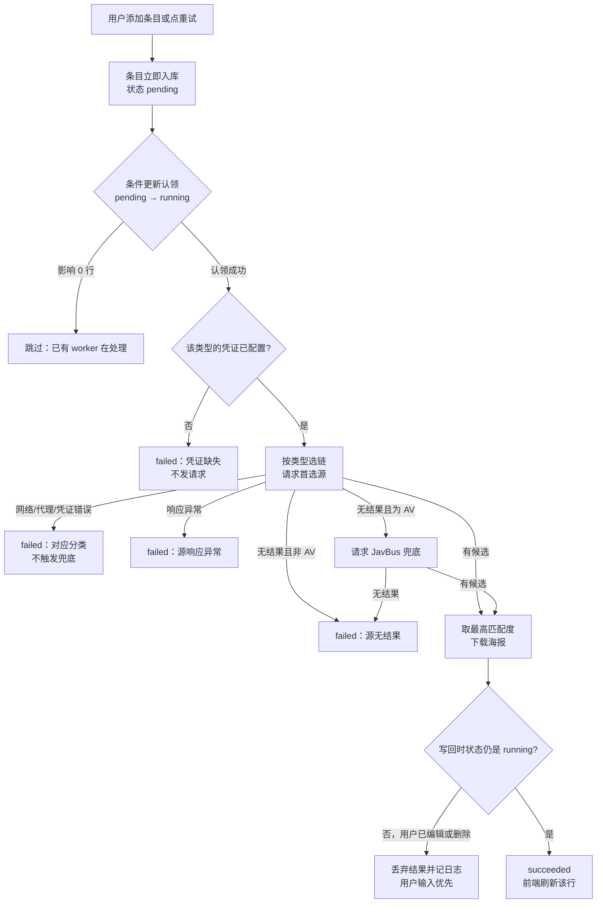

# 想看片单在线补全 · 概要设计

状态：v1.2，2026-09-11。**已接受，未实现**。用户于同日指示「进 plan2exec」，D-WM01~14 全部接受。未经过混合受众评审——用户直接批准进入计划。
来源与详细设计：[需求来源](../../../../.loopx/intake/2026-09-11-watchlist-online-metadata/requirements.md) · [设计提案](设计提案.md) · [需求设计文档](需求设计文档.md)
修订：v1.0 于实现前记录。v1.1（2026-09-11）回写用户对 D-WM03 的裁决，§4 的阻塞项随之关闭；v1.2（2026-09-11）记录用户批准整份提案进入计划。全程未进行过混合受众评审，本文中没有评审结论。

## 1. 背景与范围

想看片单目前只能记片名（`models/watchlist.go` 只有 `Title` 一个用户字段）。用户要求它能自动带回影片信息。本次范围：五个分类、三个外部源、后台异步补全、海报落本地、设置页的凭证与代理入口。

需要特别指出的排除：**主片库的分类语义不动**。全库当前没有内容类型概念——`models.Video` 没有分类字段，Jellyfin 兼容层把条目类型恒定报成 `Movie`，本地 NFO 解析只接受 `<movie>` 根节点。本次新增的类型维度只属于想看片单，不向这三处扩散。这不是暂缓，是划定的边界。

同时不做：想看条目与已入库视频的自动关联、下载任务、Jellyfin 与手机端的片单暴露。

## 2. 核心方案

### 2.1 职责划分

| 模块 | 职责 | 状态归属 |
|---|---|---|
| 片单服务 | 条目 CRUD、补全状态机、结果落库、图片生命周期 | `watchlist_entries` 表与该条目的图片文件 |
| 源路由表 | 按类型选择适配器链 | 无状态 |
| 源适配器（TMDB / Bangumi / FANZA / JavBus） | 向外部请求并映射成内部结构 | 无状态，不碰数据库 |
| 受管图片服务（复用） | 图片落盘、去重、清理 | `dataDir/media-details/` |
| 后台任务注册表（复用） | 任务运行状态可见性 | 内存 |
| 设置（复用） | 凭证与出网代理 | `settings` 表 |

依赖方向与模块视图由 [设计提案 §设计方案](设计提案.md#D-WM01) 持有（提案接受后该视图迁入本文，届时提案改为链接）。本文不重复维护同一张图。

### 2.2 补全流程与出口

这张图回答的是：一次补全有哪些分支，各自的出口是什么。

图：拟议的补全流程（当前为提案状态，非已实现行为）。`failed` 的六种分类互相区分，不合并为一个泛化错误。决定见 [D-WM04](设计提案.md#D-WM04)、[D-WM07](设计提案.md#D-WM07)、[D-WM12](设计提案.md#D-WM12)。

三个分支值得单独说明理由：

**认领用条件更新，不用数据库锁。** 仓库现有多处使用 `SELECT ... FOR UPDATE`，本次刻意不沿用，改用 `UPDATE ... WHERE id=? AND enrichment_status='pending'` 判断影响行数。理由见 [D-WM05](设计提案.md#D-WM05)，那里也记录了与既有代码的差异和不改写既有代码的界线。

**兜底只在「无结果」时触发。** FANZA 报网络错误或凭证错误不会走到 JavBus。把配置问题伪装成「查无此片」会让用户对着错误的方向排查，而且每次失败都白白多发一次抓取请求。

**用户编辑永远赢。** 补全期间用户改名或删除，写回守卫失效、结果丢弃。这条既是产品取向，也顺带消掉了「后台结果覆盖用户输入」的竞争。

### 2.3 类型与源的对应

电影、剧集、综艺纪录片走 TMDB；动画走 Bangumi；AV 先 FANZA 后 JavBus。类型在添加时由用户从下拉框选择，默认电影；输入匹配番号形态时前端把下拉切到 AV，用户可改回——判定只是输入辅助，提交时以下拉框的值为准。

## 3. 变更与影响

**新增**：一个类型字段与五个补全状态字段、一张复合唯一索引、一个后台任务 key、一组源适配器、一个图片路由、设置页一个分区。

**改既有的三处**：受管图片服务的 entityType 白名单加 `watchlist`；想看片单的唯一约束从 title 改为 (title, kind)；`Settings` 增加代理与凭证列。

**受保护、本次不得改变的行为**：想看片单的增删改查与搜索在任何外部源故障、凭证缺失或代理错误下都必须照常工作；主片库、扫描、Jellyfin、手机端、本地元数据链路零改动。这是可验证约束，不是已验证结论——本设计未实现，没有测试结果支撑。

**需要用户配合的**：三家凭证与出网代理由用户自行获取并填写。设置页的代理项须命名为「资料源出网代理」，与既有「播放代理」区分——后者是本地转码缓存，与出网无关，同名会造成真实误解。

**兼容性**：对既有调用方是增量的，四个 Wails 方法签名不变。唯一的语义变化是唯一约束放宽后 `CreateWatchlistEntry` 的重名报错条件改变。回滚窗口止于用户添加第一条同名不同类型的记录，详见 [设计提案 §兼容性](设计提案.md#兼容性)。

## 4. 风险、验证与待决事项

**已裁决**：唯一约束改为 (title, kind)（[D-WM03](设计提案.md#D-WM03)，2026-09-11 用户裁定）。同名不同类型可共存，同名同类型仍拒绝。随之接受的代价：`CreateWatchlistEntry` 的重名报错条件改变，回滚窗口止于第一条同名不同类型记录写入之时。

**其余决定已接受**：D-WM01~02、D-WM04~14 于 2026-09-11 随「进 plan2exec」的指示一并接受，未逐项评审。

**已知风险**：JavBus 兜底依赖 HTML 结构，源站改版即失效，表现为「源响应异常」；三家源的接口细节（Bangumi 匿名可读范围、TMDB 限流、JavBus 可达性）均未实测，字段映射以公开文档为准，实现时须以实际响应校正；明文凭证数量从 3 个增加到 6 个。

**FANZA 可获得性由用户接管**：用户明确表示自行解决申请，设计只提供配置入口。若最终拿不到，AV 类型退化为只有 JavBus 一条链，[D-WM07](设计提案.md#D-WM07) 的优先级语义需重定。

**验证**：源 TC-01~06 的覆盖与文档推演结果由 [需求设计文档](需求设计文档.md) 的 Verification Strategy 持有，本文不重复维护测试矩阵。

**评审状态**：尚未评审。本文与提案刚刚产出，没有任何评审人提过问题，也没有任何结论被采纳或搁置。
