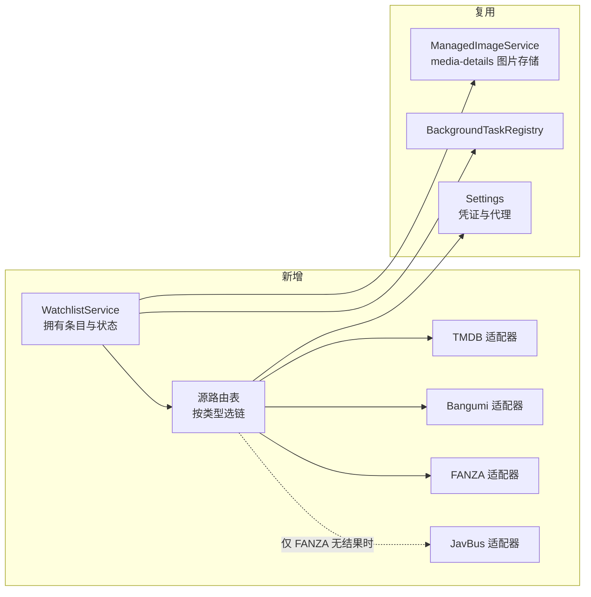

# 想看片单按类型路由到三个外部资料源，后台异步补全

Author(s): Claude / CineInsight
Last updated: 2026-09-11
Status: Accepted（2026-09-11 用户指示「进 plan2exec」，即批准本提案进入实施计划；未实现）
Discussion: 当前用户会话
Source requirements: `.loopx/intake/2026-09-11-watchlist-online-metadata/requirements.md`
Support lenses: architecture-designer, sql-style

## 摘要

我们给想看条目增加一个类型维度（电影 / 剧集 / 动画 / 综艺纪录片 / AV），按类型把补全请求路由到 TMDB、Bangumi 和 AV 源链（FANZA 官方 API 优先、JavBus 抓取兜底）。补全在后台异步执行，条目先入库再填充，失败只标记在该条目上。海报下载进既有 `ManagedImageService`，出网代理与三家凭证在设置页配置。

最重要的承诺：**外部源的任何故障都不能影响想看片单的增删改查**。条目先落库、补全后置，是为了兑现这一条。

## 背景与动机

`models.WatchlistEntry` 目前只有 `Title` 一个用户字段（`models/watchlist.go`）。片单页是一个纯文本列表（`frontend/src/components/WatchlistPage.vue`），用户只能靠自己在片名里写年份来区分同名作品——这一点在 2026-09-10 的设计里是明确接受的代价（`docs/loopx/design/2026-09-10-watchlist/概要设计.md` §6「同名影片可能不同版本……用户可在片名中写年份」）。用户本轮明确提出这不够。

本提案要推翻两条已接受的裁决，两处都须在接受后回写原文档：

| 文档 | 原裁决 | 本提案 |
|---|---|---|
| `docs/loopx/design/2026-07-30-video-details-metadata/设计提案.md` 第 40 行 | 「不接入 TMDB、豆瓣或任何在线资料源」 | 接入三个源，但只作用于想看片单，不进主片库 |
| 同上 第 97 行 | 否决理由：「引入匹配、隐私、凭证和来源治理问题」 | 匹配交给用户确认，凭证和代理交给用户配置，隐私范围见「运行与安全影响」 |
| `docs/loopx/design/2026-09-10-watchlist/概要设计.md` D-W01 | 「无后台工作、外部接口或文件操作」 | 三者全部引入 |

原否决理由在本提案中没有消失，只是有了承担方：匹配准确率由用户在候选列表里兜底，凭证与网络可达性由用户自行配置，来源治理靠「哪个源给的结果」可追溯。

## 目标与非目标

目标：按类型路由到正确的源；补全失败不影响片单可用性；用户能改正任何自动填入的结果；离线仍能看到已补全的内容。

非目标（非显然的排除）：

- **不改主片库的分类语义**。类型维度只属于想看片单。`models.Video` 无分类字段、Jellyfin 兼容层 `Type` 恒为 `"Movie"`（`services/jellyfin_detail_test.go:147`）、本地 NFO 解析只接受 `<movie>` 根节点（`services/local_metadata_parser.go:65`）——这三处本提案都不动。
- 不做想看条目与已入库视频的自动关联。
- 不引入下载任务。
- Jellyfin 与手机端仍不暴露想看片单（沿用 2026-09-10 §5）。

## 设计方案

### 最小版本：一条链路

用户添加「沙丘」→ 条目立即入库、状态 `pending` → 后台取到 TMDB 候选 → 写入年份/简介/评分并下载海报 → 前端刷新该行。整条链路里只有「写入结果」一步碰数据库主数据。

### 源适配器与路由

**D-WM01 · Architecture Contract · Accepted（AC-02）**：新增 `services/watchlist_metadata_*.go`，定义一个源适配器接口（按片名或番号搜索候选、按源条目 ID 取详情），三个实现分别对接 TMDB、Bangumi、FANZA，外加一个 JavBus 抓取实现。路由表按类型选链，AV 类型的链是有序的两个适配器。依赖方向：`App` → `WatchlistService` → 源注册表 → 各适配器 → `net/http`。适配器不反向依赖 `WatchlistService`，不写数据库。边界：适配器只负责「问外部要数据并映射成内部结构」，落库、状态机和图片归 `WatchlistService`。

把 AV 的兜底做成**链上的两个适配器**而不是藏在一个适配器内部，是为了让「结果来自哪个源」可追溯，也让兜底是一条声明的策略而非隐藏行为。用户本轮明确要求了这个兜底，它不是自行添加的降级路径。

图：拟议的模块归属与依赖方向（箭头＝调用方向）。虚线是有序兜底，不是并发调用。全部为新增或复用，无删除。决定见 [D-WM01](#D-WM01)。

### 类型维度与唯一约束

**D-WM02 · Data Contract · Accepted（AC-01）**：`WatchlistEntry` 增加 `Kind string`，取值 `movie` / `tv` / `anime` / `show` / `av`，`gorm:"size:16;not null;default:'movie'"`。边界：该字段不进入 `models.Video`，不参与扫描、Jellyfin 或手机端投影。

这里的 `default:'movie'` 是安全的，尽管仓库对 gorm 默认值有一条硬规则。`models/video.go` 中 `IdleSchedulingEnabled` 的注释记录了那条规则的成因：默认值为 true 的**布尔**列会被 GORM 的 `Create` 当成「零值即未设置」跳过，双向迁移器的 `Unscoped().Create` 会把用户关掉的开关翻回 true。字符串列的同构风险是 `""` 被改写成 `'movie'`，而 `""` 不是合法取值，因此这次改写无害。

**D-WM03 · Data Contract · Accepted（AC-01 / TC-06）**：唯一约束从 `idx_watchlist_title`（仅 title）改为 `idx_watchlist_title_kind`（title + kind）。同名不同类型的条目可以共存；同名同类型仍然拒绝，报错文案不变。

2026-09-11 用户裁决：「D-WM03 是的」。一并接受的代价见 [兼容性](#兼容性)——`CreateWatchlistEntry` 的重名报错条件改变，且回滚窗口止于第一条同名不同类型记录写入之时。

迁移是安全的：存量行全部获得 `kind='movie'`，而它们的标题在 2026-09-10 的 V1.0.2 迁移后已经互不相同，因此复合唯一索引一次就能建成，不需要再做一轮去重。

### 补全的生命周期与并发

**D-WM04 · Workflow Contract · Accepted（AC-03）**：条目增加 `EnrichmentStatus`（`pending` / `running` / `succeeded` / `failed` / `manual`）、`EnrichmentError`、`SourceName`、`SourceItemID`、`EnrichedAt`。完整转换表在详细设计。应用启动时把残留的 `running` 刷回 `pending`，沿用 `services/ai_run_service.go:91 recoverInterruptedRuns` 的思路。

**D-WM05 · Data Contract · Accepted（AC-03）**：后台 worker 用条件更新认领任务——`UPDATE watchlist_entries SET enrichment_status='running' WHERE id=? AND enrichment_status='pending'`，`RowsAffected=0` 即认领失败、跳过该条。写回结果同样带 `AND enrichment_status='running'` 守卫。不变量：任一条目同一时刻最多一个 worker 在写补全字段。

**这与仓库现有做法不同，是有意的**。`services/person_service.go:315`、`services/ai_tagging_service.go:585`、`services/face_review_service.go:246` 等处使用 `clause.Locking{Strength: "UPDATE"}`（`SELECT ... FOR UPDATE`）。loopx 的并发合同禁止在新设计中引入或沿用应用控制的数据库锁，要求优先用唯一性、条件更新或 CAS。本提案按合同用条件更新，**不改写上述既有代码**——那超出本次范围，且属于另一次决定。这个差异是已知的、被记录的，不是疏忽。

**D-WM06 · Behavior Contract · Accepted（AC-04）**：用户手动编辑条目时，`enrichment_status` 置为 `manual`。后台写回因带 `running` 守卫而失效，结果被丢弃并记日志。理由：用户的显式输入永远优先于自动结果；这同时解决了「补全中途用户改名，结果回来把用户输入覆盖掉」的竞争。

### AV 源链与类型判定

**D-WM07 · Behavior Contract · Accepted（AC-02）**：AV 类型先请求 FANZA；仅当 FANZA 明确返回「无此条目」时才请求 JavBus。FANZA 报凭证错误、网络错误或超时**不触发**兜底——那会把一次配置问题伪装成「查无此片」，并在每次失败时多打一次抓取请求。

**D-WM08 · Behavior Contract · Accepted（AC-01）**：添加时类型来自下拉框，默认 `movie`；输入文本匹配番号形态时前端把下拉框切到 `av`，用户可以改回去。判定只是输入辅助，最终以提交时下拉框的值为准——不存在「后端偷偷改了用户选的类型」。

### 复用既有能力

**D-WM09 · Operational Contract · Accepted（AC-05）**：海报先下到临时文件，再交 `ManagedImageService.Import`（`services/managed_image_service.go:41`）落到 `dataDir/media-details/watchlist/<id>/<sha256>.<ext>`，条目存相对路径。需要把该方法的 entityType 白名单从 `people` / `collections` / `videos` 扩到含 `watchlist`。前端经 `/preview/watchlist-poster/<id>` 取图，照 `preview_asset_handler.go:107 servePersonAvatar` 的形状新增一个 handler。删除条目时调 `Remove` 清理。

复用而非新建的理由：该服务已经提供了本次需要的全部性质——内容寻址去重、临时文件加 rename 的原子发布、20 MiB 上限、仅 JPEG/PNG/WebP、路径必须落在根目录内。新写一套只会得到一个能力更弱的副本。

**D-WM10 · Operational Contract · Accepted（AC-06 / AC-07）**：`Settings` 增加资料源出网代理地址（HTTP 与 SOCKS5 都要支持——`http.Transport` 的 `Proxy` 原生接受 `socks5://`）与三家凭证字段，沿用 `AITaggingAPIKey` 的既有形态：明文列加环境变量兜底，**Settings 的非空值覆盖环境变量**（`services/ai_tagging_config.go:80`），不是反过来。设置页新增「在线资料源」分区，**代理项必须叫「资料源出网代理」**——设置页已有一个 `ProxySection.vue`，标题是「播放代理」，指的是本地转码缓存，与出网无关。两者同名会造成真实误解。连接测试按 `services/ai_tagging_connection.go:41 ProbeAITaggingConnection` 的形状提供。

**D-WM11 · Operational Contract · Accepted（AC-03）**：新增后台任务 key `watchlist_enrich`。用户添加或手动重试触发的补全**不过空闲门**；若将来做存量条目的批量回填，那属于自动触发，须过 `IdleGate`。这一区分不是本提案发明的，`services/background_task_registry.go` 中 `BackgroundTaskBrowserDownload` 的注释已经确立：「那道门只挡自动触发的任务」。

**D-WM12 · Behavior Contract · Accepted（AC-03 / AC-07）**：补全失败不自动重试。失败原因分类落到 `EnrichmentError`：凭证缺失、凭证无效、代理不通、网络不可达、源无结果、源响应异常。用户在该条目上手动重试。不做自动重试是因为没有任何来源要求它，而静默重试会把配置错误变成反复的对外请求。

## 专项设计检查

| Support lens | 触发原因 | 应用的检查 | 结果 |
|---|---|---|---|
| architecture-designer | 新增出网依赖、新模块归属、后台任务故障边界 | 复用点定位、依赖方向、状态与故障爆炸半径、维护代价 | 复用 `ManagedImageService` / `BackgroundTaskRegistry` / `Settings` / `IdleGate` 四处；新增仅限源适配器族与片单侧状态。外部源故障边界收敛在补全 worker 内，不波及片单 CRUD |
| sql-style | 新列、唯一索引变更、双后端迁移、worker 队列访问路径 | 迁移顺序与幂等、方言差异、约束保真、索引访问路径、并发合同 | 见下方「迁移顺序」；新迁移不需要 `LOCK TABLE`；worker 队列需 `(enrichment_status, id)` 索引 |

### 迁移顺序（sql-style 结论）

新迁移 `migrateWatchlistKindUniqueness` 必须跑在 `AutoMigrate` **之后**，这与既有的 `migrateWatchlistTitleUniqueness` 相反——后者在 `database/database.go:307` 跑在 `AutoMigrate` 之前。原因是新迁移依赖 `kind` 列存在，而该列由 `AutoMigrate` 创建。顺序写反会在空列上建索引或直接报错。

迁移做三件事，每件都幂等可重跑：把 `kind` 为空的行刷成 `'movie'`（集合操作，一条 UPDATE）；确认复合唯一索引存在；`HasIndex` 守卫下删除旧的 `idx_watchlist_title`。

它**不需要** `LOCK TABLE ... ACCESS EXCLUSIVE`，而既有的 `migrateWatchlistTitleUniqueness` 需要——因为那一个要把全表读进内存做去重判断（读后改），本次只有集合写和 DDL。这是刻意不沿用，不是遗漏。

`AllModels()` 的拓扑序不受影响：本次只加列，不加表、不加外键，`WatchlistEntry` 在清单中的位置不动。

## 边界场景

| 场景 | 本提案的处理 |
|---|---|
| 源返回多个候选 | 取最高匹配度写入并记录 `SourceItemID`；用户可在该条目上重选 |
| 源无结果 | `failed` + 「源无结果」，条目和标题保留 |
| 凭证未配置 | 补全不发起，条目直接置 `failed` + 「凭证缺失」；不发空请求 |
| 代理不通 / 网络不可达 | `failed` + 对应分类；与「源无结果」严格区分 |
| 补全中用户改名 | 状态转 `manual`，后台写回被守卫丢弃（[D-WM06](#D-WM06)） |
| 补全中用户删除条目 | 写回影响 0 行；已下载的图片由删除路径清理 |
| 应用退出时有 running | 启动时刷回 `pending`，下一轮重新认领 |
| 同名不同类型 | 允许共存（[D-WM03](#D-WM03)）。同名**同**类型仍然拒绝，沿用既有报错文案 |
| 海报超 20 MiB 或非图片格式 | `ManagedImageService.Import` 拒绝，文字字段仍然保留，海报缺失 |
| 存量条目 | 迁移后一律 `kind='movie'`、`enrichment_status='manual'`，不自动发起补全，不产生启动时的批量出网 |
| 片单 CRUD | 不变。源不可用、凭证为空、代理错误都不影响增删改查和搜索 |

## 理由与取舍

| 备选 | 不选的理由 |
|---|---|
| 复用现有 AI 接口生成影片信息 | 零新增配置，但年份和演员表会被模型编造，且拿不到海报和稳定的源条目 ID，无法去重与重查 |
| 抓豆瓣 | 中文条目最全，但无官方 API、反爬强、HTML 结构漂移，维护成本三者最高 |
| 不分类，全部走 TMDB 多类型搜索 | 改动最小，但动画中文条目质量差，AV 完全无覆盖——用户明确要这两类 |
| 添加时同步等待补全结果 | 无需状态机，但跨境请求动辄数秒到超时，添加体验被网络质量绑架 |
| 只存图片 URL，前端在线加载 | 不碰文件系统，但国内取图经常失败，且离线完全不可用 |
| AV 兜底藏在 FANZA 适配器内部 | 少一个适配器，但「结果来自哪个源」不可追溯，排查时分不清是官方数据还是抓取数据 |

## 兼容性

**对既有消费者是纯增量的。** 想看片单的四个 Wails 方法保持签名不变，只在返回的条目结构上增加字段；前端旧字段读取不受影响。`models.Video`、扫描、Jellyfin、手机端、本地元数据链路零改动。

有一项**破坏性变更，已被用户接受**：唯一约束从 title 改为 (title, kind)（[D-WM03](#D-WM03)）。这放宽了约束，原先被拒绝的输入现在会被接受。方向上不会让既有数据失效，但会改变 `CreateWatchlistEntry` 的可观察行为——原先「该片名已在想看片单中」的报错，在类型不同的情况下不再出现。这是本提案唯一改变既有接口语义的地方。

回滚：删掉新列即可回到旧行为，但需要先把复合唯一索引换回 title 唯一，而这一步在存在同名不同类型记录时会失败。回滚窗口实际上止于用户添加第一条同名不同类型的记录。这个代价要在接受前知道。

## 运行与安全影响

- **凭证**：三家的 key 与现有 `AITaggingAPIKey` / `DeepLApiKey` / `SubtitleTranslationAPIKey` 一样明文存在 `settings` 表。这不是本提案引入的新风险等级，但它扩大了范围。若用户认为不可接受，须在接受前提出（见待决问题）。
- **出网暴露**：补全会把用户输入的片名或番号发给第三方。这是功能的固有属性，不可规避，但**只在用户添加条目或手动重试时发生**，不存在后台自发扫描全库外传的路径。
- **落盘内容**：AV 分类的封面会以图片文件落到 `dataDir/media-details/watchlist/`。用户已知悉并选择了下载到本地。
- **诊断**：每次补全记录源名、耗时、HTTP 状态与失败分类，沿用 `services/ai_tagging_client.go:144` 的日志形态。
- **抓取兜底的脆弱性**：JavBus 路径依赖 HTML 结构，源站改版即失效。失败会表现为「源响应异常」，不会伪装成「无此片」。这是接受该兜底时一并接受的维护代价。

## 实现与过渡

顺序上只有一处约束影响兼容性：**迁移必须先于任何写 `kind` 的代码上线**，且新迁移在 `AutoMigrate` 之后。其余顺序（适配器、worker、前端、设置页）不影响正确性。

存量条目不自动补全（见边界场景），因此不存在升级即触发大批出网请求的窗口。

## 待决问题

1. ~~**[阻塞接受] 唯一约束改不改**（[D-WM03](#D-WM03)）。~~ **已解决**：2026-09-11 用户裁定改为 (title, kind)。随之接受了回滚窗口受限这一代价。
2. **[不阻塞] 三家凭证明文存库是否可接受**。沿用仓库既有做法，但本提案把明文凭证的数量从 3 个增加到 6 个。
3. **[不阻塞] FANZA 的 API ID 与联盟 ID 的可获得性**。用户本轮明确接管：「FANZA 啥的我去想办法，留给我配置就好了」。因此设计只提供配置入口，不为申请失败预设替代路径；若最终拿不到，AV 类型实际退化为只有 JavBus 一条链，[D-WM07](#D-WM07) 的优先级语义需重定。
4. **[不阻塞，未验证] 三家源的接口细节**。Bangumi 的匿名可读范围与 User-Agent 规范、TMDB 的限流口径、JavBus 的当前可达性均未实测。详细设计中的字段映射以公开文档为准，实现时须以实际响应校正。

## 详细设计交接

建议现在写详细设计。详细设计须把以下视为固定约束：模块归属与依赖方向（[D-WM01](#D-WM01)）、类型维度只属片单（[D-WM02](#D-WM02)）、条件更新认领而非数据库锁（[D-WM05](#D-WM05)）、用户编辑优先（[D-WM06](#D-WM06)）、兜底仅在「无结果」时触发（[D-WM07](#D-WM07)）、复用 `ManagedImageService`（[D-WM09](#D-WM09)）、迁移在 `AutoMigrate` 之后。

[D-WM03](#D-WM03) 已于 2026-09-11 由用户裁决接受，详细设计据此写死一种约束，不再保留两种分支。其余十三项决定于同日随「进 plan2exec」的指示一并接受。
