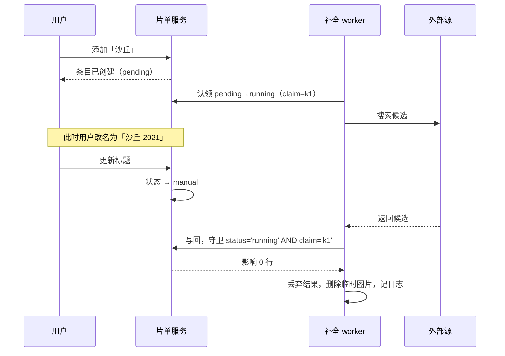

# 想看片单在线补全设计

状态：**已接受，未实现，未评审**。D-WM01~14 全部接受：D-WM03 由用户明确裁决，其余十三项随 2026-09-11「进 plan2exec」的指示一并接受。未经过独立设计评审——用户直接批准进入计划。
来源：[需求](../../../../.loopx/intake/2026-09-11-watchlist-online-metadata/requirements.md)（AC-01~07 / TC-01~06） · [设计提案](设计提案.md)（决定与取舍） · [概要设计](概要设计.md)（架构、核心流程、模块边界）
修订：

| 版本 | 日期 | 内容 |
|---|---|---|
| V1.0.3 | 2026-09-11 | 独立计划评审发现三处实现契约缺口：既有 `migrateWatchlistTitleUniqueness` 未退役会硬删数据并使 `ApplySchema` 失败（§2.3 新增退役方案）；`ai_tagging_config` 的配置优先级本文原先写反，实为 Settings 覆盖环境变量（§一）；§2.1 漏列 `EnrichmentClaim`。同时补明代理需支持 SOCKS5 |
| V1.0.2 | 2026-09-11 | 用户指示「进 plan2exec」，D-WM01~14 全部转 Accepted，交接状态改为已就绪 |
| V1.0.1 | 2026-09-11 | 用户裁定 D-WM03 改为 (title, kind) 唯一。§2.2 索引、§2.3 迁移、TC-06 的条件表述去掉，Planning Handoff 的阻塞项关闭。同时实测 SQLite 撞名报错文案，记录索引列顺序对 `watchlistTitleConflict` 承重（§2.2）——本文 V1.0.1 初稿曾断言两个判据都会失配，实测证伪后改正 |
| V1.0.0 | 2026-09-11 | 按用户本轮六项裁决记录实现契约；全部决定为 Proposed |

## 一、范围与设计依据

本文只补充实现所需的精确契约：字段与约束、状态机的完整转换、并发不变量、接口形状、错误映射、迁移步骤。业务背景、模块职责与核心流程由 [概要设计](概要设计.md) 拥有，决定与取舍由 [设计提案](设计提案.md) 拥有，本文不复述。

复用点与既有 owner（实现时须先核对这些路径仍然成立）：

| 能力 | 现有 owner | 本次用法 |
|---|---|---|
| 图片落盘与清理 | `services/managed_image_service.go:41` `Import` / `:138` `Remove` / `:170` `Resolve` | 扩 entityType 白名单加 `watchlist`，其余不改 |
| 图片对外路由 | `preview_asset_handler.go:107` `servePersonAvatar` | 照形状新增 `/preview/watchlist-poster/<id>` |
| 后台任务可见性 | `services/background_task_registry.go` | 新增 key `watchlist_enrich` |
| 空闲门语义 | 同上，`BackgroundTaskBrowserDownload` 的注释 | 用户触发的补全不过门 |
| 凭证配置形态 | `services/ai_tagging_config.go:80` | 明文列 + 环境变量兜底。**Settings 的非空值覆盖环境变量**，不是反过来——先 `config := envConfig` 再逐项覆盖；既有测试 `services/ai_tagging_service_test.go:149` 断言取到 DB 值 |
| 连接测试形态 | `services/ai_tagging_connection.go:41` | 每个源一个探测入口 |
| 中断任务恢复 | `services/ai_run_service.go:91` `recoverInterruptedRuns` | 启动时 `running` 刷回 `pending` |
| 分页与 LIKE 转义 | `services/watchlist_service.go` 现有 `List` | 不变 |

## 二、数据合同

### 2.1 字段

`models.WatchlistEntry` 新增：

| 字段 | 类型与约束 | 含义 | 来源 |
|---|---|---|---|
| `Kind` | `size:16;not null;default:'movie'` | `movie` / `tv` / `anime` / `show` / `av` | 用户选择 |
| `EnrichmentStatus` | `size:16;not null;default:'pending'` | 见 §三 状态机 | 系统 |
| `EnrichmentError` | `size:32;not null;default:''` | 失败分类码，见 §五 | 系统 |
| `SourceName` | `size:16;not null;default:''` | `tmdb` / `bangumi` / `fanza` / `javbus` | 系统 |
| `SourceItemID` | `size:64;not null;default:''` | 源侧稳定 ID，供重查与去重 | 系统 |
| `EnrichmentClaim` | `size:32;not null;default:''` | 本次认领的随机标识，写回时比对，见 §3.1 的 ABA 讨论 | 系统 |
| `EnrichedAt` | `*time.Time` | 最近一次成功补全时间 | 系统 |
| 影片字段 | 年份、简介、类型标签、主创、评分、海报相对路径 | 补全结果，用户可改 | 源或用户 |

`Kind` 用 `default:'movie'` 是安全的：`models/video.go` 中 `IdleSchedulingEnabled` 的注释记录的 gorm 默认值禁令针对**默认为 true 的布尔列**（`Create` 把零值当未设置，双向迁移器会把用户关掉的开关翻回 true）。字符串列的同构风险是 `""` 被改写为 `'movie'`，而 `""` 不是合法取值，改写无害。`EnrichmentStatus` 同理。

### 2.2 索引与访问路径

- `idx_watchlist_title_kind`（title, kind）唯一，取代 `idx_watchlist_title`（[D-WM03](设计提案.md#D-WM03)，已裁决）。同名不同类型可共存；同名同类型仍由该索引拒绝。
- **索引的列顺序 (title, kind) 是承重的，不得调换。** 现有 `watchlistTitleConflict`（`services/watchlist_service.go`）用 `strings.Contains` 匹配 `idx_watchlist_title` 和 `UNIQUE constraint failed: watchlist_entries.title` 两个字符串来识别撞名。改名后两个判据**仍然成立，但靠的是子串巧合**：
  - SQLite（实测）：报错原文为 `UNIQUE constraint failed: watchlist_entries.title, watchlist_entries.kind`，判据 A 失配、判据 B 因前缀匹配而命中，`watchlistTitleConflict` 返回 true。列顺序若改成 (kind, title)，报错会以 `watchlist_entries.kind` 开头，判据 B 随即失配。
  - PostgreSQL（**2026-09-11 实测通过**，postgres:18-alpine）：报错包含索引名 `idx_watchlist_title_kind`，它包含 `idx_watchlist_title`，判据 A 命中。`TestWatchlistDuplicateTitleMessage` 与六个迁移用例在 PG 后端全绿。索引若改名为不以 `idx_watchlist_title` 开头的形式（如 `idx_watchlist_kind_title`），判据 A 立刻失配。
  两个判据同时失配时，撞名会退化成一条通用数据库错误，用户看到的不再是「该片名已在想看片单中」。因此实现时要么保持列顺序与索引名前缀，要么把判据改成显式匹配新名——两条路都可以，但必须有测试钉住报错文案，见 TC-06。
- `idx_watchlist_enrichment`（enrichment_status, id）：worker 取待办的访问路径，按 id 升序保证认领顺序确定。这是本次新增索引的唯一理由；不为尚无查询的字段建索引。
- 现有 `List` 的 `id DESC` + 游标分页不变，不新增索引。

### 2.3 迁移

新增 `database/watchlist_kind_schema.go`，在 `database.go` 的 `ApplySchema` 中**放在 `AutoMigrate` 之后**调用。这与既有 `migrateWatchlistTitleUniqueness`（`database/database.go:307`，在 `AutoMigrate` 之前）相反，因为本迁移依赖 `AutoMigrate` 创建的 `kind` 列。

#### 既有 `migrateWatchlistTitleUniqueness` 必须同时退役，否则会删数据并让应用起不来

这是 D-WM03 的直接实现后果，不是可选清理。既有迁移的守卫是
`if !HasTable(...) || db.Migrator().HasIndex(&models.WatchlistEntry{}, "idx_watchlist_title") { return nil }`（`database/watchlist_schema.go:15`）。本次删掉该索引之后：

1. 守卫失效放行——GORM 的 `HasIndex` 在结构体标签里查不到该名字时按字面名查库，而库里已经没有它了。
2. 放行后它按 **title 单键**判重并 `tx.Delete`。`models.WatchlistEntry` 没有 `DeletedAt`，这是**硬删除**——删掉的正是 D-WM03 刚刚允许共存的同名不同类型记录，直接违反 AC-01 与 TC-06。
3. 它接着调 `CreateIndex(&models.WatchlistEntry{}, "idx_watchlist_title")`。GORM 在 `LookIndex` 返回 nil 时走 `return fmt.Errorf("failed to create index with name %s", name)`，`ApplySchema` 因此报错，应用启动失败。

退役方式：保留去重能力但换掉目标与守卫。它仍在 `AutoMigrate` **之前**运行，仍按 title 去重（存量行都会变成 `kind='movie'`，按 title 去重恰好正确），但**不再创建任何索引**——复合唯一索引交给 `AutoMigrate`。新守卫的**首要条件是「库里还没有 `kind` 列」**，不是看索引——这一点原文写漏了，已于实现期改正。原文给的三条件（表不存在 / 已有 `idx_watchlist_title_kind` / 已有 `idx_watchlist_title`）不够：一个有 `kind` 列但两个索引都不在的库（手工删过索引，或上次升级在建索引前就中断）会通过索引判断而放行，随后按 title 单键硬删掉合法的同名不同类型记录。真正的前置条件是 `kind` 列不存在——那时每一行都隐含是 `movie`，按 title 去重才恰好等价于按 (title, kind) 去重。索引判断保留为冗余兜底。

三种存量状态因此都成立：从未做过唯一性迁移的老库仍会去重；已是 title 唯一的库直接跳过；已升级到复合索引的库跳过。`database/watchlist_schema_test.go` 的 `TestWatchlistUpgradeDeduplicatesAndEnforcesUniqueTitle` 断言的是旧行为（先 `DropIndex` 再连跑两次 `ApplySchema`），必须一并改写。

三步，每步幂等可重跑：

1. `UPDATE watchlist_entries SET kind='movie' WHERE kind IS NULL OR kind=''`。
   **本步对 `enrichment_status` 的原始写法是错的，已于实现期改正**：原文写「把 `enrichment_status` 为空的存量行刷成 `manual`」，但 `AutoMigrate` 加列时执行的是 `ADD COLUMN ... NOT NULL DEFAULT 'pending'`，存量行会被填成 `pending` 而不是空串，`WHERE enrichment_status=''` 一行都匹配不到——存量条目会全部变成可自动补全，正好违反本步要防的「升级即触发批量出网」。
   正确做法是沿用仓库既有的 `*ColumnExisted` 模式（与 `migrateIdleSchedulingSetting` 等五个同胞迁移一致）：在 `AutoMigrate` **之前**记录该列是否已存在，若本次才新增，则在迁移中把此刻表内所有 `pending` 行改判 `manual`（此时表里的行必然都是升级前就有的）。
2. 确认 `idx_watchlist_title_kind` 存在（`AutoMigrate` 依结构体标签创建；本步只断言）。
3. `HasIndex` 守卫下删除 `idx_watchlist_title`。

**不使用** `LOCK TABLE ... ACCESS EXCLUSIVE`，而既有 `migrateWatchlistTitleUniqueness` 使用了——那一个要把全表读进内存做去重判断（读后改），本次只有集合写与 DDL，没有读改写窗口。这是刻意不沿用。

迁移可行性：存量行全部得到 `kind='movie'`；标题去重由退役后的 `migrateWatchlistTitleUniqueness` 在 `AutoMigrate` 之前完成（它覆盖从未做过唯一性迁移的老库），因此复合唯一索引一次建成，本迁移无需再去重。`AllModels()` 的拓扑序不受影响——只加列，不加表、不加外键。

## 三、状态机

### 3.1 完整转换表

初始状态：`Create` 写入 `pending`（凭证是否配置由 worker 判定，不在创建时短路）。存量行经迁移为 `manual`。

| 当前 | 事件 | 守卫 | 新状态 | 效果 |
|---|---|---|---|---|
| pending | worker 认领 | `UPDATE ... WHERE id=? AND enrichment_status='pending'` 影响 1 行 | running | 开始请求 |
| pending | worker 认领 | 影响 0 行 | 不变 | 跳过该条，另一 worker 已持有 |
| pending | 用户编辑 | — | manual | — |
| running | 写回成功 | 写回时 `AND enrichment_status='running'` 影响 1 行 | succeeded | 写影片字段、海报路径、`SourceName`、`SourceItemID`、`EnrichedAt` |
| running | 写回失败 | 同上守卫成立 | failed | 写 `EnrichmentError` 分类码 |
| running | 写回时守卫不成立 | 影响 0 行 | 不变 | **丢弃结果并记日志**；已下载的临时图片删除 |
| running | 用户编辑 | — | manual | 后续写回必然被守卫丢弃 |
| running | 应用启动恢复 | 进程重启后残留 | pending | 下一轮重新认领 |
| succeeded / failed / manual | 用户手动重试 | — | pending | 清空 `EnrichmentError` |
| succeeded / failed / manual | 用户编辑 | — | manual | — |
| 任意 | 用户删除 | — | 行消失 | 调 `ManagedImageService.Remove` 清理海报 |

未列出的转换一律不发生。写回路径只认 `running`，任何其他状态下到达的结果按「守卫不成立」处理——这是丢弃，不是报错，不改变条目状态。

ABA 判断：状态可以回到 `pending`（重试），因此仅凭状态值不足以区分「同一次认领」与「新一轮认领」。写回守卫因此除状态外还须匹配本次认领写入的运行标识；实现可用一列 `enrichment_claim` 存随机串，认领时写入、写回时比对。没有它，一次慢响应可能落到用户重试后的新一轮上。

### 3.2 并发：用户编辑与后台写回

图：已接受的竞争处理（尚未实现）。结果丢弃是设计意图，不是错误路径——用户输入优先，见 [D-WM06](设计提案.md#D-WM06)。

不变量：任一条目在任一时刻最多一个 worker 持有其 `running` 认领；补全字段的写入只发生在持有认领且认领未被打断时。协调手段是条件更新与认领标识，**不使用** `SELECT ... FOR UPDATE`。仓库其他服务（`services/person_service.go:315`、`services/ai_tagging_service.go:585`、`services/face_review_service.go:246`）使用数据库锁；本设计按 loopx 并发合同不沿用，也不改写它们——那是另一次决定。

回滚边界：写回是单条 `UPDATE`，与海报落盘不在同一原子单元。因此顺序是**先落盘图片，再写回数据库**；写回失败时删除刚落盘的图片。反过来会留下指向不存在文件的路径。`ManagedImageService.Import` 内容寻址，重复落盘同一张图不产生新文件。

## 四、接口合同

**D-WM13 · Interface Contract · Accepted（AC-01/03/04）**：既有四个 Wails 方法签名不变，`CreateWatchlistEntry` 增加类型入参，返回的条目结构增量增加 §2.1 的字段。新增手动重试与重选候选两个方法。前端按新字段渲染，旧字段读取不受影响。

| 方法 | 变化 | 说明 |
|---|---|---|
| `ListWatchlist(keyword, cursorID, limit)` | 签名不变 | 返回条目含新字段；不新增按类型筛选（无需求） |
| `CreateWatchlistEntry(title, kind)` | 增加 `kind` | 空值按 `movie`；非法值拒绝，不静默回退 |
| `UpdateWatchlistEntry(id, title)` | 签名不变 | 触发状态转 `manual` |
| `DeleteWatchlistEntry(id)` | 签名不变 | 连带清理海报 |
| `RetryWatchlistEnrichment(id)` | 新增 | 状态转 `pending`，清空错误码 |
| `ListWatchlistCandidates(id)` / `ApplyWatchlistCandidate(id, sourceItemID)` | 新增 | 用户重选匹配结果 |

进度经 Wails 事件推送，事件名 `watchlist-enrich-progress`，沿用仓库既有 kebab-case 约定（`image-ai-tagging-progress`、`directory-scan-progress`）。

返回字段按调用方实际需要给：列表页需要标题、类型、状态、错误码、海报有无、年份；详情展开才需要简介与主创。不直接透传存储对象。

## 五、失败分类与用户可见文案

**D-WM14 · Behavior Contract · Accepted（AC-07）**：内部错误与用户可见文案分开。六类互不合并——把配置问题和「查无此片」混为一谈会让用户排查错方向。

| 分类码 | 触发 | 用户可见 | 是否触发 AV 兜底 |
|---|---|---|---|
| `credential_missing` | 该源凭证为空 | 「未配置 <源> 的凭证」 | 否，且不发请求 |
| `credential_invalid` | 401 / 403 | 「<源> 凭证无效或已过期」 | 否 |
| `proxy_unreachable` | 代理连接失败 | 「资料源出网代理不可用」 | 否 |
| `network_unreachable` | 超时、DNS、连接失败 | 「无法连接 <源>」 | 否 |
| `not_found` | 源明确返回无此条目 | 「<源> 没有收录」 | **是**（仅 AV） |
| `source_error` | 其他非 2xx、响应无法解析 | 「<源> 返回异常」 | 否 |

只有 `not_found` 触发兜底（[D-WM07](设计提案.md#D-WM07)）。日志记录源名、耗时、HTTP 状态与分类码，沿用 `services/ai_tagging_client.go:144` 的形态。

超时：沿用 `aiTaggingRequestTimeout` 的写法但取更短的值——资料查询不是长推理。具体值实现时定，不在本文虚构。

## 六、验证与交接

### Verification Strategy

源 TC 覆盖与本次文档推演结果：

| TC | 覆盖方式 | 文档推演结果 |
|---|---|---|
| TC-01（五类路由 + 番号识别） | 服务层单测，路由表按类型断言；前端单测覆盖下拉切换与用户改回 | 推演通过。番号识别只改前端下拉值，提交以下拉为准，不存在后端改类型的路径 |
| TC-02（四种失败可区分 + 重试恢复） | 各源适配器以桩替身注入六种失败；重试路径断言状态回 `pending` 且错误码清空 | 推演通过。§五 六类互不合并，`credential_missing` 不发请求 |
| TC-03（修改不被覆盖） | 并发用例：认领后编辑再写回，断言影响 0 行且字段不变 | 推演通过，前提是实现 §3.1 的认领标识；仅比对状态值会在「重试后慢响应到达」时误判 |
| TC-04（断网可见 + 删除无孤儿文件） | 图片路由单测；删除路径断言 `Remove` 被调用 | 推演通过。落盘先于写回，写回失败即删图 |
| TC-05（代理/凭证错误文案不同） | 设置页单测 + 探测入口单测 | 推演通过 |
| TC-06（迁移不丢数据） | 双后端迁移测试，空库与存量库各一次，重复执行验证幂等；另需一条用例覆盖索引改名后的撞名报错文案 | 推演通过。存量行全部 `kind='movie'` 且标题已互不相同，复合索引一次建成 |

已执行的检查（唯一一项）：用一次性探针在 SQLite 上建出 (title, kind) 复合唯一索引并触发撞名，读到真实报错文案 `UNIQUE constraint failed: watchlist_entries.title, watchlist_entries.kind`，确认既有 `watchlistTitleConflict` 仍返回 true。探针已删除，未留在仓库。PostgreSQL 侧未实测，§2.2 中相应结论标为推断。

未执行的检查：除上述探针外，以上全部为文档推演，**没有编写或运行任何会保留下来的测试**，也没有任何真机联通验证。三家源的接口细节未实测，§四、§五 的映射以公开文档为准，实现时须以实际响应校正。

呈现检查（实际执行的）：三份文档 64 个相对链接全部指向存在的文件，14 个 `D-*` 锚点全部可解析且无重复定义；3 张 Mermaid 图通过结构检查——图类型合法、括号配对、`subgraph` 闭合、边引用的节点与时序图参与者均有定义。**未执行的**：图没有被渲染过。本机无 mermaid 渲染器（`mmdc` 不存在，前端依赖内也没有），因此布局、换行与可读性未做视觉验证。结构检查不能替代它。

### Design Contract Index

| 锚点 | 合同类型 | 来源 AC | 状态 |
|---|---|---|---|
| [D-WM01](设计提案.md#D-WM01) | Architecture | AC-02 | Accepted |
| [D-WM02](设计提案.md#D-WM02) | Data | AC-01 | Accepted |
| [D-WM03](设计提案.md#D-WM03) | Data | AC-01 / TC-06 | **Accepted**（2026-09-11 用户明确裁决「D-WM03 是的」） |
| [D-WM04](设计提案.md#D-WM04) | Workflow | AC-03 | Accepted |
| [D-WM05](设计提案.md#D-WM05) | Data | AC-03 | Accepted |
| [D-WM06](设计提案.md#D-WM06) | Behavior | AC-04 | Accepted |
| [D-WM07](设计提案.md#D-WM07) | Behavior | AC-02 | Accepted |
| [D-WM08](设计提案.md#D-WM08) | Behavior | AC-01 | Accepted |
| [D-WM09](设计提案.md#D-WM09) | Operational | AC-05 | Accepted |
| [D-WM10](设计提案.md#D-WM10) | Operational | AC-06 / AC-07 | Accepted |
| [D-WM11](设计提案.md#D-WM11) | Operational | AC-03 | Accepted |
| [D-WM12](设计提案.md#D-WM12) | Behavior | AC-03 / AC-07 | Accepted |
| [D-WM13](#D-WM13) | Interface | AC-01/03/04 | Accepted |
| [D-WM14](#D-WM14) | Behavior | AC-07 | Accepted |

### Planning Handoff

**已就绪**。D-WM03 由用户裁定，其余十三项随「进 plan2exec」的指示接受，§2.2、§2.3、TC-06 均已按裁决写死。实施计划见 [docs/loopx/plans/2026-09-11-watchlist-online-metadata.md](../../plans/2026-09-11-watchlist-online-metadata.md)。

裁决后即固定、下游不得自行更改的约束：模块归属与依赖方向（[D-WM01](设计提案.md#D-WM01)）；类型维度只属片单、不外溢到 `models.Video`/Jellyfin/NFO（[D-WM02](设计提案.md#D-WM02)）；条件更新加认领标识、不用数据库锁（[D-WM05](设计提案.md#D-WM05)）；用户编辑优先（[D-WM06](设计提案.md#D-WM06)）；兜底仅在 `not_found` 时触发（[D-WM07](设计提案.md#D-WM07)）；复用 `ManagedImageService` 而非新建图片存储（[D-WM09](设计提案.md#D-WM09)）；迁移在 `AutoMigrate` 之后且不加表锁（§2.3）；失败六分类不合并（[D-WM14](#D-WM14)）。

下游可自行决定的：适配器内部的请求构造与字段映射细节、超时具体值、worker 的并发度与轮询间隔、前端组件拆分、设置页表单布局。

另需用户知悉但不阻塞：三家凭证明文存库使明文凭证从 3 个增至 6 个；FANZA 申请由用户接管，拿不到则 AV 退化为 JavBus 单链，[D-WM07](设计提案.md#D-WM07) 的优先级语义需重定。
