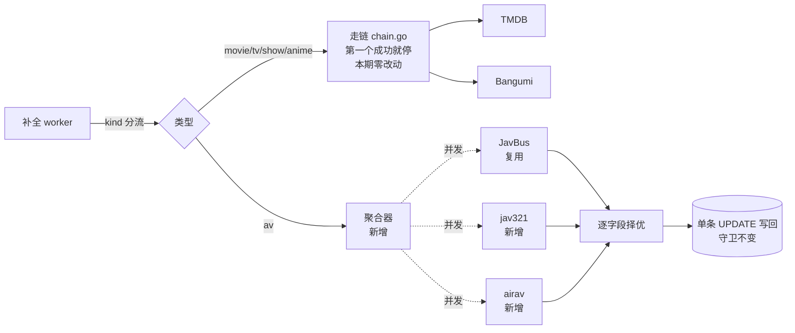
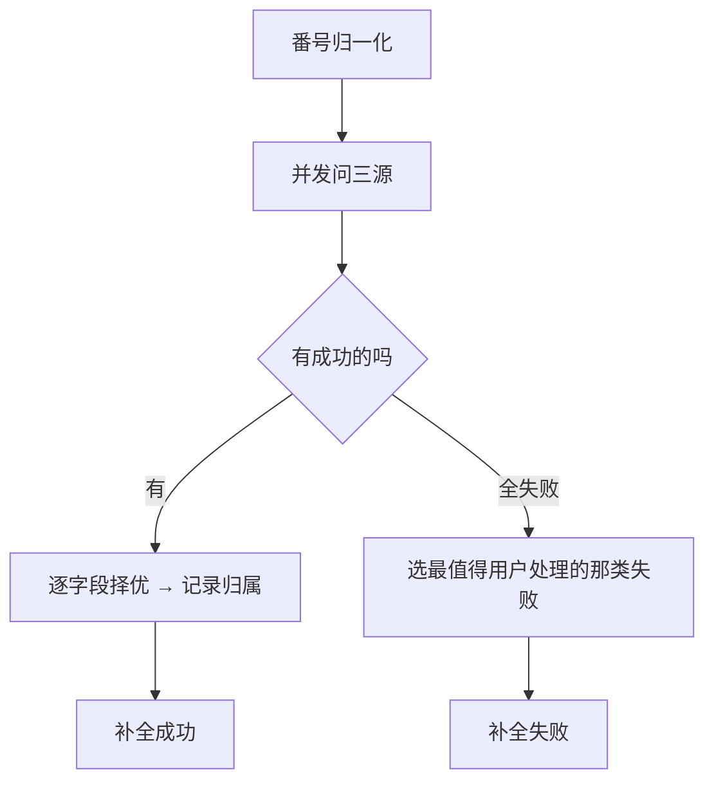

# AV 在线补全多源聚合 · 概要设计（评审版）

| 项 | 内容 |
|---|---|
| 变更等级 | **L2** —— 新增两列存储、变更设置读写与探测两个对外载荷 |
| 版本 | v1.4 · 已确认（用户 2026-09-13 口径确认，未开评审会） |
| 需求来源 | `.loopx/intake/2026-09-13-watchlist-online-source-reduction/requirements.md`（AC-01～AC-09 / TC-01～TC-08） |
| 文档权威 | 本文拥有架构、核心流程与模块划分；字段级契约在详细设计，本文不重复 |
| 详细设计 | [需求设计文档.md](./需求设计文档.md)；方案取舍与被否方案在 [设计提案.md](./设计提案.md) |
| 实现状态 | **已完成**（2026-09-13，prompt-first）。原 P-003 的 airav 因 Cloudflare 未能接入，缩为两源；余下**进行中**：P-001 已按 prompt-first 落地并双后端验证通过（用户 2026-09-13 裁决绕过计划就绪门）；jav321 / airav 接入与 FANZA 代码清除待做 |

| 版本 | 日期 | 说明 |
|---|---|---|
| v1.0 | 2026-09-13 | 初稿 |
| v1.4 | 2026-09-13 | 实施期变更：airav 未能接入（Cloudflare JS 挑战），候选替代 freejavbt 数据质量不达标，本期缩为 JavBus + jav321 两源。「中文片名/简介」这一立项理由未达成，中文只落在标签上；「简介从恒为空变成有值」已达成 |
| v1.3 | 2026-09-13 | 第四轮计划评审指出 §2 与 §4 仍写「JavBus 零改动」，与已落地的年龄门修复冲突；两处已改。同步勘误变更等级（一列→两列）与需求来源的 AC/TC 区间 |
| v1.2 | 2026-09-13 | **决策修正**：第二轮独立计划评审发现「主标题优先中文」（原 §6 Q2）在本仓库是空裁决——补全写回从不写 `title`，条目标题永远是用户手输的番号。用户裁决新增一列存源站片名（D-AVM11 / AC-09）。据此改写 §1.2 范围、§3.1 规则表、§3.3、§4 改动清单，并把 §6 Q2 的结论从「主标题优先中文」改为「片名另存一列并列展示」 |
| v1.1 | 2026-09-13 | **决策确认**：§6 待确认 Q1（源名保留值 `aggregate`）、Q2（主标题优先中文）、Q3（字段级归属本期不展示）经用户确认全部接受；三条转入已接受，不再阻塞实施。R1（三源字段映射零真实请求验证）仍为未消除风险，转为实施后人工验证项 |

---

## 1. 背景与范围

### 1.1 背景与目标

想看片单的 av 补全现在是死的。链路排成「FANZA 首选 → JavBus 兜底」，但只有
「查无此片」才会触发兜底；FANZA 没配凭证时返回的是「凭证缺失」，属于当场早退。
于是**零认证、本来就能用的 JavBus 一次都不会被问到**。而 DMM 联盟凭证要求
日本地址与收款方式，对单机用户不是「暂时没配」，是拿不到。

就算把顺序修好，JavBus 也填不满——它的详情页没有简介，代码里 `Overview` 写死为空。
av 条目的简介会永远空着。

做完之后达到两件事：**av 补全不再需要任何凭证**；**简介、中文标题这些今天拿不到的
字段会有值**。

### 1.2 范围

**做**

- av 补全改为 **多源并问**（本期落地 JavBus + jav321；airav 因 Cloudflare 未能接入），每个字段按固定优先级取第一个非空值
- 新增 1 个抓取适配器（jav321）；复用 JavBus 适配器并修掉它的年龄门缺陷
- 新增 1 个聚合模块
- 新增 2 列存储：一列记录每个字段最终采纳了哪个源，一列存**源站片名**（中文优先）
- 界面在条目标题旁并列展示源站片名，**不覆盖**用户手输的番号
- FANZA 适配器与它的 2 项凭证整体下线

**不做**

| 不做 | 理由/归属 |
|---|---|
| 改 TMDB（电影/电视剧/综艺） | 不在本期范围，链路一行不动 |
| 改 Bangumi（动画） | 同上 |
| 接 javdb | 需要 cookies 与会话维护，与本期「摆脱凭证配置」的核心动机直接冲突 |
| 接 r18dev | 它不发 HTTP，查的是本地 R18 数据库 dump，需用户自备并维护数据 |
| 读本地 NFO / 监控磁盘 / 重命名归档 | 那是刮削器的工作流；想看片单的条目还没有文件 |
| 演员资料库（生日、三围、评分） | 独立能力，本期不含 |
| 给补全结果加新字段（时长、厂商等） | jav321/airav 能给，但当前结构装不下；加字段会牵动两条不在范围内的链路 |
| 界面上展示「这个字段来自哪个源」 | 数据本期入库，展示形态需要 UI 设计，不在本期 |
| 存日文原题 | 本仓库没有存它的列，也没有需求要求看它；本期只加「源站片名」一列 |
| 用抓到的片名**覆盖**用户手输的番号 | 既有裁决 D-WM06「用户输入永远优先」；覆盖后用户在列表里按番号就找不着片了 |
| 回填历史条目 | 见 §3.3 |

## 2. 总体设计

**模块划分**

| 模块 | 一句话职责 |
|---|---|
| 聚合器 | 只管 av：并发问三源、逐字段挑、失败归类。纯计算，不碰数据库 |
| jav321 / airav 适配器 | 各问一个站点并映射成统一结构，不落库、不下图 |
| JavBus 适配器 | 同上。**本期只修它的年龄门缺陷**（缺 `dv=1` cookie 导致每次查询都失败），其余零改动 |
| 走链 `chain.go` | 仍是其余四个类型的唯一策略，**本期零改动** |
| 补全 worker | 按类型分流；认领、下海报、写回——**全部维持原样** |

**跨模块的关键技术决策**

| 决策 | 为什么 | 代价 |
|---|---|---|
| 聚合与走链**并存**，不是取代 | 走链的「第一个成功就停」是其余四个类型的既定合同。为 av 一个类型改写它，会波及四个不在范围内的类型 | 两套策略共存，边界靠一处按类型分流承担 |
| 三源**并发**而非串行 | 串行下最慢的源决定总耗时；并发后仍在原有超时窗口内 | 单条补全的出网请求数从最多 2 个变 3 个 |
| 补全结果**不归属单一源** | 没有任何一个源能填满这张表，这正是做聚合的原因 | 源名列要写一个保留值 `aggregate`，并另开一列记字段级归属 |
| 存量条目**不回填** | 回填等于把所有历史 av 条目重新出网跑一遍，既无需求也有风险 | 历史条目的源名仍是 `fanza`/`javbus`，与新条目形态不一致 |
| **不加任何自动降级** | 沿用仓库既有原则：需求没命名的 fallback 一律不加，失败就如实报分类 | 站点改版时 av 补全直接失败，靠改代码恢复 |

## 3. 分模块方案

### 3.1 聚合器

**诉求**（AC-01/02/03/05）：零凭证可用；单源失败不阻断其余；缺字段由他源补齐。

**设计**：把用户手输的番号归一化后，同时问三个源，各自走「搜索 → 取首个候选 → 取详情」，
然后逐字段合并。

**规则与理由**

| 规则 | 为什么 |
|---|---|
| 只要**有一个源成功**，整体就算成功 | 另外两个炸了也不该让用户什么都拿不到 |
| 每个字段有**固定的源顺序**，取第一个非空值 | 规则必须可复现。「取更长的简介」这类启发式说不清为什么，且更长不等于更好 |
| 片名、简介、标签优先 **airav** | 界面是中文的，airav 给中文 |
| 新增的两列**只在 av 条目上写**，其余类型恒为空串 | 写入这两列的代码路径是全类型共用的。不判类型的话，一条电影条目也会跟着变样——那是本次明确保证不动的东西 |
| 抓到的片名存进**单独一列**，用户手输的番号一字不动 | 条目标题是用户敲进去的，补全不许覆盖（既有裁决 D-WM06）。界面并列显示 `ABC-123 · 中文片名`，两者都在 |
| **只择优真正能落库的字段** | 早先版本把日文原题也排了优先级，但本仓库根本没有存它的列——那是在为观察不到的事排序 |
| 封面优先 **JavBus** | 已验证可用 |
| 评分取 **jav321** | 它的详情页有「平均評価」（2026-09-13 真实页面确认） |
| 优先级表是**代码常量，不可配置** | 可配置要带 UI、校验、迁移和配错兜底，本期没有任何需求提出过 |
| 三源全失败时，**只有全是「查无此片」才报查无此片** | 否则会把代理不通伪装成查无此片，用户会去核对番号，而真正该做的是修代理 |
| 某个源的**页面结构变了，必须报「源出错」而不是「查无此片」** | 报查无此片会把用户支去核对番号，真正该做的是修适配器。这是既有 JavBus 适配器已有的约定，新适配器沿用 |

> **技术辅助 · 并发与失败归类**：三个请求共用已有的出网客户端（自带连接池），
> 统一超时与取消；单源 panic 不得带倒其余源。失败分类沿用既有的六类，
> 不新增第七类。见《详细设计》§4.1，评审不必展开。

### 3.2 三个数据源

**诉求**（AC-01/06）：全部零认证，全部经用户所配代理出网。

**设计**：

| 源 | 认证 | 请求形态 | 主要贡献 |
|---|---|---|---|
| JavBus | 无（需 `dv=1` 年龄门 cookie，2026-09-13 已修） | 番号即详情页路径，一跳 | 封面、导演、年份、中文类别、演员 |
| jav321 | 无 | `GET /video/{番号}`，一跳 | 演员、年份、简介、原题 |
| ~~airav~~ | —— | —— | **本期未能接入**：全站挡在 Cloudflare JS 挑战后 |

**规则与理由**

| 规则 | 为什么 |
|---|---|
| 三个源全部零认证 | 这是本期的核心目的：把「拿不到凭证」这件事从链路上彻底移除 |
| 出网一律走用户配的代理客户端，**没有任何源例外** | 配了代理却有请求从本机裸奔出去，是最不该悄悄发生的事 |
| 搜索命中多条时**取第一条**，不重排 | 源给出的就是匹配度顺序；番号本来也只该命中一条 |
| 取不到的字段**留空，不猜** | 猜出来的值会在用户看不见的地方变成错数据 |

> **技术辅助 · 抓取脆弱性**：jav321 与 airav 都是 HTML 抓取，站点改版即失效。
> 这是接受的维护成本，与既有 JavBus 适配器同类。见《详细设计》§9.3。

### 3.3 存量数据与 FANZA 下线

**诉求**（AC-07/08）：FANZA 从界面消失；老条目不丢数据。

**规则与理由**

| 规则 | 为什么 |
|---|---|
| 存量 av 条目**一条不动**，不回填 | 回填=把历史条目全部重新出网跑一遍。无需求，有风险 |
| 设置表里 FANZA 的两列**留在库里不删** | 迁移器本来就不删列；专门写个删列迁移反而会让回退到旧版本时读不到列。留着的成本是两个静置的空列 |
| 前端保留 `FANZA` 这个展示名 | 历史条目的源名仍是 `fanza`，删掉展示名会让它们显示成裸字符串 |
| 用户仍配着 FANZA 环境变量时**不报错，静默不读** | 那不是错误配置，只是失效配置 |

## 4. 改动清单

**存储**

- 既有表 `watchlist_entries`：**加 2 列**（字段级归属、源站片名），迁移器自动补，老行得空值
- 既有表 `settings`：**无结构变更**。两个 FANZA 列保留在库，只是程序不再读写
- 无新增表，无数据初始化

**接口**

| 面 | 接口 | 变化 |
|---|---|---|
| 设置页 | 设置读取 / 保存 | **删** 2 个 FANZA 字段 |
| 设置页 | 在线资料源连接探测 | **删** fanza 项；可测源变为 tmdb / bangumi / javbus / jav321 / airav |
| 想看页 | 条目列表 / 详情 | **加** 2 个字段（字段级归属、源站片名），加性变更，旧前端忽略即可 |

**代码**

- 新增：聚合模块、jav321 适配器、airav 适配器、番号归一化
- 改动：补全入口加类型分流；源路由表的 av 链；设置结构体与保存逻辑；探测表；设置页与想看页前端（含片名并列展示）
- 删除：FANZA 适配器及其测试
- **既有核心路径零改动**：走链策略、TMDB/Bangumi 两个适配器（JavBus 另有一处年龄门修复，见 §3.2）、
  补全的认领与写回机制，全部不动。验证方式见 §7

## 5. 对外影响与配合事项

| 相关方 | 要配合的事 |
|---|---|
| 用户 | 无需任何操作。**不再需要申请 FANZA 凭证**；已填的值会静置失效 |
| 用户（国内网络） | 三个站点大概率仍需代理，代理配置项与用法不变 |
| 测试 | av 补全的预期结果变了：简介从「恒为空」变为「通常有值」；源名显示为「多源合并」 |

## 6. 风险与待确认

**风险**

| # | 风险 | 应对 |
|---|---|---|
| R1 | 三家源的字段映射**零真实请求验证**——这是照公开页面结构写的，没有用真番号跑过 | 实施后必须用真实番号做一次三源对照核对。这是本设计唯一无法靠自动化测试覆盖的部分 |
| R2 | HTML 抓取，站点改版即失效 | 硬约定：解析失效必须报「源出错」，不得报「查无此片」，否则会把用户引向错误的排查方向 |
| R3 | 先摘 FANZA 再建聚合会留下一段 av 完全没有源的窗口 | 实施顺序固定：先建聚合器（先只挂 JavBus，行为等价于今天）→ 再加两个源 → 最后摘 FANZA |
| R4 | 回退到旧版本后，新补全的条目源名显示为裸字符串 `aggregate` | 不崩，仅显示不美观。不为此加兼容代码 |

**待确认** —— 三项均已于 2026-09-13 由用户确认接受，无未决议题（Q2 的结论已在 v1.2 修正，见版本记录）。

| # | 议题 | 结论 |
|---|---|---|
| Q1 | 源名列写保留值 `aggregate` 表示「多源合并」，占用一个源名 | **已接受** → §2 |
| Q2 | 中文片名怎么落地 | **已裁决（v1.2 修正）**：抓到的片名**另存一列**，界面与用户手输的番号并列展示，互不覆盖；日文原题本期不存 → §3.1、§4 |
| Q3 | 字段级归属本期只入库、不在界面展示 | **已接受** → §1.2 |

## 7. 验收要点

**片名与标题**（待验证）

- 补全后条目的用户标题仍是输入的番号，源站片名列另存中文片名，界面两者并列
- 源站片名取不到时只显示番号，不留空位、不显示分隔符

**聚合器**（待验证）

- 三源各给互补字段 → 合并结果字段齐备，且归属记录正确
- 其中一源返回 500 → 仍补全成功，缺的字段由存活源补上
- 三源全「查无此片」→ 报「查无此片」
- 两源「查无此片」+ 一源代理不通 → 报**代理不通**（不是查无此片）

**数据源**（待验证）

- 三个源在**未配置任何凭证**下均可完成一次补全
- 配一个必定不可达的代理 → 三源全部报代理不通，且抓包确认**无任何直连**

**FANZA 下线**（待验证）

- 设置保存与探测的请求体中不含两个 FANZA 字段
- 探测接口传 `fanza` 返回「未知的资料源」，不静默忽略

**存量与不变行为**（待验证）

- 建一个含 `source_name='fanza'` 已补全行的库 → 升级 → 内容仍可读可展示（SQLite 与 PostgreSQL 双后端）
- **技术红线**：movie/tv/show/anime 四个类型的补全行为零变化。
  验证方式：走链与既有适配器的测试全绿。注意 `watchlist_metadata_javbus.go`
  **已不在零改动之列**——它有一处年龄门缺陷必须修（见 §3.2）。

## 附录 · 技术细节备忘（评审可略过）

- D 锚点：D-AVM01（聚合与走链并存）、D-AVM02（源清单）、D-AVM03（择优表）、
  D-AVM04（归属存储）、D-AVM05（番号归一化）、D-AVM06（存量不动）、
  D-AVM07（FANZA 列留库）、D-AVM08（手动重选仍单源）、D-AVM09（并发共用客户端）、
  D-AVM10（失败分类聚合）、D-AVM11（源站片名另存一列）。决定正文在 [设计提案.md](./设计提案.md)，
  完整索引在《详细设计》§11.4。
- 番号归一化口径：只做去空白、转大写、分隔符统一成半角连字符；
  **不做**补零/去零等源专有编码换算——这是收窄既有裁决的适用范围，不是推翻它。
- 手动重选候选（用户自己挑一条）仍是**单源**语义，聚合只作用于自动补全。
- 评审状态：未开评审会。三项待确认已由用户直接确认（2026-09-13），据此转入实施。
