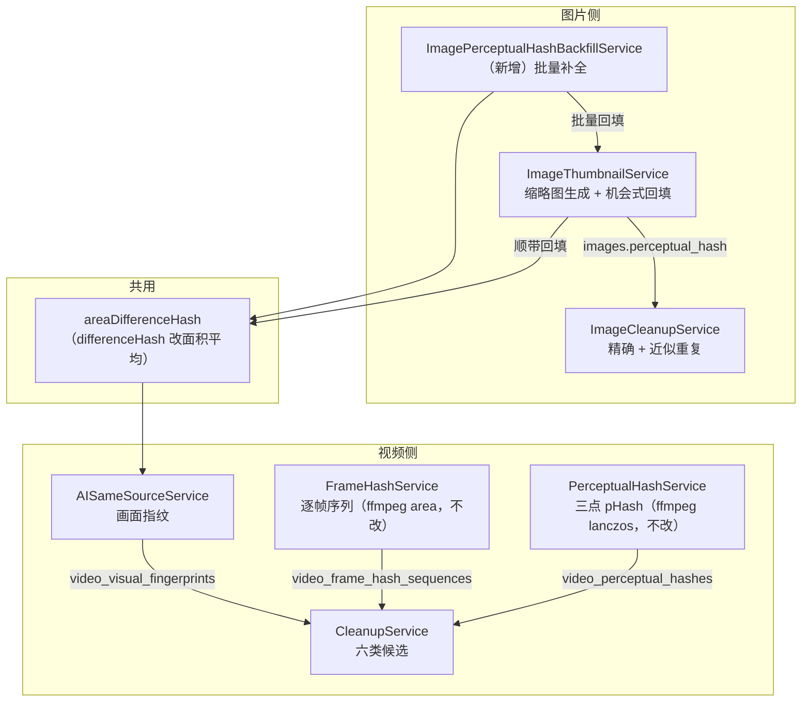
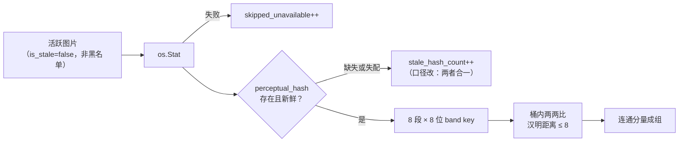

# 清理候选检测修复 · 概要设计

| 项 | 内容 |
|---|---|
| 变更等级 | **L2** —— 新增一个后台服务与一个设置列；变更两处哈希算法与一处清理分析的元数据来源；一次性清空既有图片指纹 |
| 版本 | v1.0 · 全部决定 **已接受**（用户 2026-09-20 就四项取舍逐项裁决，见 §6） |
| 需求来源 | 无 intake 文档。用户 2026-09-20 会话：诊断「图片候选删除效果远差于视频」与「视频候选经常遗漏」，确认六条修复项全做 |
| 文档权威 | 本文拥有问题判定、总体方案、模块关系与 D-CD\* 决定；字段级契约在详细设计，本文不重复 |
| 详细设计 | [需求设计文档.md](./需求设计文档.md) |
| 实现状态 | **已实现并独立评审**（2026-09-20，prompt-first）。双后端各一轮 `go test ./...`，只剩既有基线失败（已在 HEAD 上复跑确认与本次无关）；前端全绿。评审 0 Critical / 4 Important / 16 Minor，Important 全部已修，见详细设计 §11.1 与 V1.0.2 |

| 版本 | 日期 | 说明 |
|---|---|---|
| v1.0 | 2026-09-20 | 初稿。D-CD01~08 按用户四项裁决记录为已接受 |
| v1.2 | 2026-09-20 | 独立评审回写。四条 Important 全部已修，其中两条落在本文的判断上：① D-CD02 的一次性判据必须紧贴 `AutoMigrate`——本文 §7 写了「迁移与算法必须同批发布」，但没说判据被消费与执行之间不能夹可失败步骤，夹着就等于把「只发其一」这个禁止状态留了一条静默的到达路径；② D-CD02 的边界（不动 `deleted_at`）此前没有任何用例钉住。其余见详细设计 §11.1 |
| v1.1 | 2026-09-20 | 实施回写：D-CD05 补上「库里从无元数据的记录仍不得进候选」这条受保护行为——初稿只写了「探测失败仍参与精确重复」，漏了它会把历史误入库的源码文件列成删除候选（既有测试当场证伪）。另见详细设计 V1.0.1 的另两处 |

---

## 1. 背景与范围

### 1.1 现状判定

图片与视频的「清理候选」被当成同一个能力对外呈现，实现却是两套，图片那套
在**指纹质量**和**候选生成**两处各有一个实质缺陷，叠加后近似重复检测基本只
能命中精确重复本就能命中的那些。视频那套算法是对的，但**未回填的指纹不进任何
计数**，界面因此从不提示去补全，近似重复恒为空。

三项实测（数据取自 `~/.CineInsight/library.db`，2026-09-19 18:02 最后写入；该库
无 `.env`、未设 `PG_HOST`，`ResolveBackend` 判定为 sqlite，是当前生效的库）：

| 观测 | 数值 | 含义 |
|---|---|---|
| 同一张图 480px 与 2560px 两版的汉明距离 | 现实现中位数 **4**（最大 7）；面积平均 dHash 中位数 **0**（最大 1） | 阈值总共 8，一半预算被「同图不同尺寸」吃掉 |
| 库内距离 2~8 的图片对能进入比对的比例 | 单段前缀 **60%**（52/86）；8 段×8 位 **100%**（86/86） | 四成候选对连比都没比 |
| `video_perceptual_hashes` 行数 | **0**（`auto_perceptual_hash=0`） | 视频近似重复恒为空，且 `stale_hash_count=0` 使提示与按钮永不出现 |

第三行的口径问题是既有决定的直接后果：
[capability-batch V1.0.12 的 P-008 ②](../2026-09-02-capability-batch/需求设计文档.md)
写明「`stale_frame_hash_count` = 未回填 + 失效（pHash 同名计数只数失效）」。帧哈希
那条因此会提示，感知哈希那条不会。本次推翻后半句。

### 1.2 本次范围

六项修复，全部落在既有模块内：

1. 图片 dHash 从点采样改为面积平均（连带修共用同一函数的「同源视频」画面指纹）
2. 图片近似重复分桶从单段 16 位前缀改为 8 段 × 8 位
3. 图片与视频的「指纹待补全」计数统一为「未回填 + 失效」
4. 清理分析复用库内已有的时长/分辨率，不再每轮全量 ffprobe
5. 分析结果新增「本轮跳过」计数并在界面呈现
6. 新增图片感知哈希批量补全服务（镜像 `ImageEXIFBackfillService`）

**不在范围**：库内 1969 张图片全部处于软删状态这一现象（用户 2026-09-20 裁决
「不处理」）。本次不读、不改、不恢复任何 `images.deleted_at`。它会使图片侧的
端到端人工验收暂时无数据可跑，验证策略据此调整（详见详细设计 §10）。

---

## 2. 总体方案与模块关系

模块归属不变：图片指纹仍由 `ImageThumbnailService` 拥有写入口径，新服务只是
批量驱动它，不自建解码路径——HEIC/RAW 的 sips 分支、缩略图缓存淘汰、EXIF 方向
都在那里，复制一份必然漂移。视频的两条哈希流水线（三点 pHash、逐帧序列）本
来就用 ffmpeg 做正确的降采样，本次一行不改。

### 2.1 为什么图片走 Go 面积平均而不是 ffmpeg

视频侧两条流水线都让 ffmpeg 直接缩到 9×8（`flags=lanczos` / `flags=area`），因为
那边本来就要起 ffmpeg 抽帧。图片侧不同：缩略图已经解码在内存里，只为缩一个
9×8 再起一个子进程，代价与收益不成比例。Go 侧对 9×8 网格做 box 平均与
`flags=area` 是同一语义，两边不互相比对，数值不需要逐位一致。

### 2.2 为什么图片旧指纹清空而不是加版本列

`VideoVisualFingerprint` 已有 `AlgorithmVersion` 列，`ensureFingerprint` 的
`cacheValid` 判据带版本比较（`services/ai_same_source_service.go:195`），所以视频
同源侧只要把 `sameSourceFingerprintVersion` 从 `same-source-dhash-v1` 递增就自动
失效重算，不需要迁移。

图片侧没有版本列。用户裁决走清空：缩略图缓存在本地、重算不碰原文件、不需要
外置盘在线，代价只是补全完成前近似重复暂时为空。加版本列反而把「空窗期」换成
「长期割裂」——旧版本的图永远和新版本的图比不上。

---

## 3. 核心流程

### 3.1 图片近似重复（改动后）

与改动前的差别只在三处：`C` 分支下「缺失」不再静默丢弃、`E` 从单段变八段、
`B` 失败进入可见计数。判定阈值 8、邻居上限 64、候选上限 256、连通分量成组、
`Original` 选择规则、忽略表语义全部不变。

### 3.2 清理分析的元数据（改动后）

原流程对每个视频无条件 ffprobe，拿不到完整的时长+分辨率就 `continue`，而这个
`continue` 在按大小分桶之前——连不需要元数据的精确重复也一起丢了。改动后：

| 情况 | 元数据来源 | 参与精确重复 | 参与低清/短视频 |
|---|---|---|---|
| 库内记录新鲜 | `videos` 表 | 是 | 是 |
| 库内记录陈旧或缺失，ffprobe 成功 | ffprobe | 是 | 是 |
| 库里曾有元数据，此刻 ffprobe 失败 | 无 | **是**（改动点） | 否，计入 `skipped_metadata` |
| 库里从无元数据且 ffprobe 失败 | 无 | 否（受保护行为） | 否，计入 `skipped_metadata` |
| `os.Stat` 失败 | 无 | 否 | 否，计入 `skipped_unavailable` |

「新鲜」判据直接复用扫描侧既有的 `needsTechnicalRefreshDuringScan`
（`services/video_scan.go:928`）：`Duration==0 || Resolution=="" || Height==0 ||
磁盘 size != videos.size`，另加 `Width > 0`。不新引入判据，避免两处口径分叉。

倒数第二行不可省略：「库里从来没有过元数据、探测也失败」正是历史上误入库的源码
文件（`.ts` 既是 MPEG-TS 也是 TypeScript）的特征。早先靠「探测失败整条丢弃」顺带
挡住了它们，拆开之后必须显式保留，否则清理面板会引导用户去删自己的源文件。

`skipped_unavailable` 解决的是一个当前完全不可见的失真：5 个扫描根里 4 个在
`/Volumes`，1439 个视频中 1316 个在外置盘上。盘没挂载时这些视频全部静默跳过，
界面与插盘时长得一模一样。

---

## 4. 决定

**D-CD01｜面积平均 dHash（behavior contract）**
`differenceHash` 由逐点取样改为对 9×8 网格做面积平均，图片与「同源视频」画面
指纹共用。同源侧 `sameSourceFingerprintVersion` 同步递增到 `same-source-dhash-v2`，
既有行靠既有的版本判据自然失效（当前该表 0 行）。
*边界*：`PerceptualHashService`（ffmpeg lanczos）与 `FrameHashService`
（ffmpeg area，D-026）两条视频流水线不改。
*状态*：已接受（用户 2026-09-20 裁定「一起修」）。

**D-CD02｜既有图片指纹清空重算（data contract）**
迁移把 `images` 的 `perceptual_hash` 置 `''`、`hash_source_size` 与
`hash_source_mod_time_ns` 置 0，由 D-CD07 的补全服务重算。
*边界*：不动 `images.deleted_at`、不动缩略图缓存文件、不碰原图。
*状态*：已接受（用户 2026-09-20 裁定「清空重算」）。

**D-CD03｜图片近似重复改 8 段 × 8 位分桶（behavior contract）**
镜像 `perceptualBandKeys` 的分段方式，band key 为 `段序号:两位 hex`；单段 16 位
前缀常量 `imageCleanupBandPrefixLen` 退役。
*边界*：汉明阈值 8、`imageCleanupMaxBandNeighbors=64`、
`imageCleanupMaxCandidates=256`、连通分量成组、`MaxHammingDistance` 的采样口径
全部不变。
*状态*：已接受。

**D-CD04｜指纹待补全计数统一为「未回填 + 失效」（behavior + interface contract）**
图片 `ImageCleanupAnalysis.StaleHashCount` 与视频 `CleanupAnalysis.StaleHashCount`
都改为「范围内、文件可访问、但没有可用指纹的条目数」，与既有
`stale_frame_hash_count` 同口径。视频侧因此需要额外统计在扫描范围内、
`video_perceptual_hashes` 无行的视频。
*推翻*：capability-batch V1.0.12 P-008 ② 的「pHash 同名计数只数失效」。
*边界*：字段名与类型不变，前端文案对齐帧哈希那条。
*状态*：已接受。

**D-CD05｜清理分析复用库内元数据（behavior contract）**
按 §3.2 的四档表执行。ffprobe 只在库内记录不新鲜时触发；探测失败但**库里曾经
成功探测过**的视频仍参与精确重复分桶，只退出低清/短视频两类。
*边界*：低清/短视频的判定阈值与 `CleanupCriteria` 入参不变；不新增元数据存储。
**库里从来没有过元数据、探测又失败的记录（历史误入库的源码文件之类）仍然整条
排除**——这条是受保护行为，早先由「探测失败就整条丢弃」顺带实现，拆开之后必须
显式保留，否则用户会被引导去删自己的源文件。
*状态*：已接受（V1.1 补齐受保护行为）。

**D-CD06｜分析结果新增跳过计数（interface contract）**
`CleanupAnalysis` 与 `ImageCleanupAnalysis` 各新增 `SkippedUnavailable`；
`CleanupAnalysis` 另加 `SkippedMetadata`（图片侧无 ffprobe 环节，不设此字段）。
两个审阅界面各加一行提示。
*边界*：纯增量字段，既有字段语义不变；不新增按钮与动作。
*状态*：已接受。

**D-CD07｜图片感知哈希批量补全服务（operational + workflow contract）**
新增 `ImagePerceptualHashBackfillService`，形态逐项镜像
`ImageEXIFBackfillService`：`Start` / `StartWithPauseHook` / `Status` / `Cancel` /
`StopAndWait`、进度事件、`BackgroundTaskRegistry` 新 key `image_phash`。
指纹计算复用 `ImageThumbnailService.ResolveImageThumbnail`，不自建解码路径。
装钩子与翻 `Running` 必须同锁（D-032）；自动路径经空闲门，显式 `Start` 不过门
（D-030）。
*边界*：不处理 `is_stale=true` 的图片；不新建表。
*状态*：已接受（用户 2026-09-20 裁定「独立服务 + 独立开关」）。

**D-CD08｜自动开关与面板位（data + interface contract）**
`settings` 新增 `auto_image_perceptual_hash`（bool，默认 false）。默认值为零值，
按仓库既有规则**不带 gorm default 标签**（D-032 V1.0.7 的推广规则，避免迁移器
把显式 false 翻回默认）。图片扫描后按此开关触发自动补全，入口与
`AutoImageEXIFBackfill` 在 `SyncImageDirectories` 中并列。
*边界*：不改既有任何 `auto_*` 开关的语义；`image_phash` 追加在
`backgroundTaskKeyOrder` 中 `BackgroundTaskEXIF` 之后，不重排既有顺序。
*状态*：已接受。

---

## 5. 受保护的既有行为

| 行为 | 出处 | 本次保证 |
|---|---|---|
| 视频三点 pHash 与逐帧序列的计算方式 | D-026 | 一行不改 |
| 截取片段候选（ClipGroups）的计算与阈值 | D-028 | 一行不改 |
| 精确重复的分组判据（size + 采样 MD5） | D-012 | 不变 |
| 图片近似重复的汉明阈值 8 与连通分量成组 | D-012 | 不变 |
| 默认勾选规则（精确全勾、近似不勾） | D-012 2026-08-08 修订 | 不变 |
| 忽略表语义与两张否决表合并过滤 | 既有实现 | 不变 |
| 失效条目只标 stale 不软删 | 2026-09-08 裁决 | 不变；本次不触碰任何删除路径 |
| 空闲门的装钩子同锁与显式路径不过门 | D-030 / D-032 | 新服务照此实现 |

## 6. 用户裁决记录（2026-09-20）

| 问题 | 裁决 | 落点 |
|---|---|---|
| 旧图片指纹怎么处理 | 迁移时清空，靠新任务重算 | D-CD02 |
| 补全任务形态 | 独立服务 + 独立开关 | D-CD07 / D-CD08 |
| 点采样缺陷是否连同源一起修 | 一起修 | D-CD01 |
| 1969 张软删图片 | 不处理 | §1.2 范围外 |

## 7. 风险与代价

| 风险 | 说明 | 处置 |
|---|---|---|
| 图片近似重复的空窗期 | D-CD02 清空后，补全跑完之前该类别为空 | D-CD04 的计数会把「待补全 N 张」显示出来，不是静默为空 |
| 同源视频判定结果变化 | D-CD01 改了画面指纹，下游接 AI 复核 | 该表当前 0 行，无存量影响；仍需按详细设计 §10 的 TC 重验阈值 |
| 图片侧无法端到端人工验收 | 库内图片全部软删（范围外） | 以夹具单测覆盖；人工验收记为遗留项 |
| Postgres 分支零覆盖 | 本机无可用 Postgres，双后端那一轮未跑 | 记为遗留项，见详细设计 §10 |
| 面积平均改变既有图片指纹分布 | 与 D-CD02 同一件事 | 迁移与算法改动必须同批发布，不可只发其一 |
