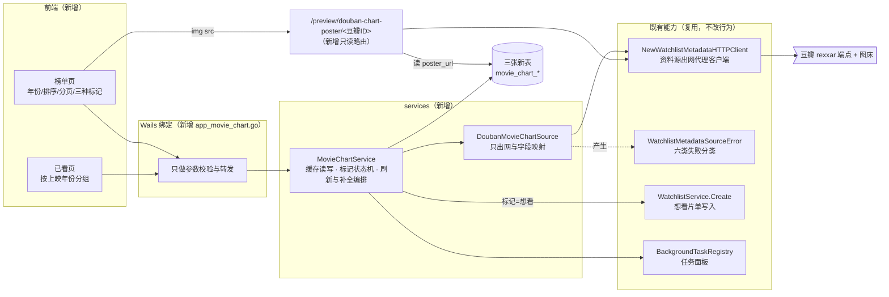
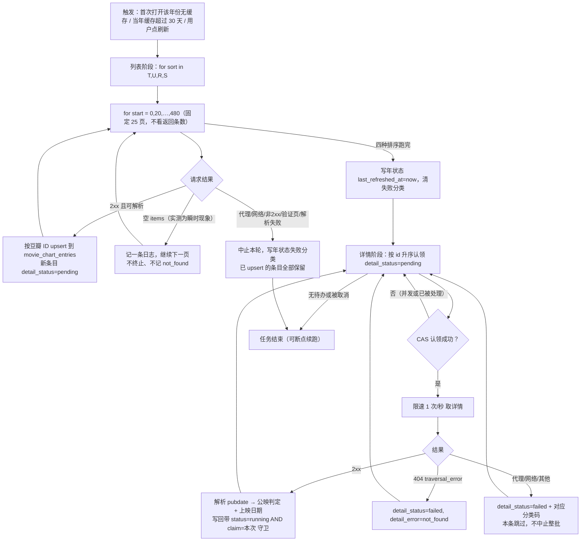
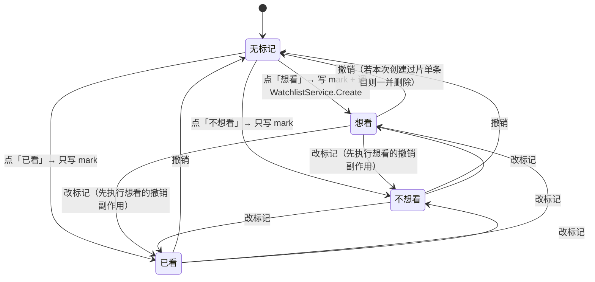

# 年度电影榜单 · 概要设计

状态：**accepted**（2026-09-21 用户以 `/exec` 指令批准并授权实现）。实现进行中；本文中的性能与行为描述在 P-009 回填真机结果前仍是设计意图，不是验证结论。
来源：用户需求（2026-09-21 对话原文，含 4+4 项裁决，记于 §7）。详细设计见 [需求设计文档.md](需求设计文档.md)。
修订：2026-09-21 初稿。

## 一、背景与范围

用户要解决的是「想找片但不知道今年上映了什么」。现有「想看片单」（`services/watchlist_service.go`）只能按片名逐条手输，无法回答"这一年有哪些片"。本次新增两个页面：

- **榜单页**：按年份浏览在内地公映的电影（含尚未上映的），每条可一键「想看 / 不想看 / 已看」。
- **已看页**：把榜单上手动标过「已看」的电影按**影片上映年份**分组展示。

**明确排除**：

- 不合并本地片库的 `videos.is_watched`。已看页只收榜单上的手动标记，两者是不同的事实来源，合并会让"我在榜单上确认看过"与"这个文件被播放过"无法区分。
- 「不过滤」开关只解除**标记造成的隐藏**，不解除「内地公映」取数口径。口径是这个榜单是什么的定义，不是一个筛选项。
- 不引入 TMDB 或任何第二数据源。实测确认豆瓣可用（§2），没有触发用户设定的"实测不通就停下来裁决换源"的前提。
- 不改动 `watchlist_entries` 的 `(title, kind)` 唯一约束、索引名与列顺序（`models/watchlist.go:29-43` 声明它们是承重的）。

## 二、豆瓣端点实测结论（设计依据）

2026-09-21 本机直连实测（无代理）。**下列结论是本设计每一处取舍的依据，实现时若发现端点行为已变，应回到本文而不是就地改代码。**

**主端点** `GET https://m.douban.com/rexxar/api/v2/movie/recommend`，无凭证，需 `User-Agent`（浏览器标识）与 `Referer: https://movie.douban.com/explore`。

| 观察 | 事实 | 对设计的约束 |
|---|---|---|
| 过滤维度 | `selected_categories` **不起过滤作用**（带 `{"地区":"中国大陆"}` 仍返回德国/加拿大片）；真正过滤的是 `tags=<年份>[,<地区>]` | 只用 `tags` 传年份，不传地区（见口径裁决） |
| 排序 | 服务端自述 `T`=综合 `U`=近期热度 `R`=首映时间 `S`=高分优先，**只有降序** | 「旧片在前」必须靠本地 `pubdate` 重排，服务端给不了 |
| 深度 | `total` 恒为 `500`（占位值，非真实计数）；`start=500` 起恒返回 0 条 | 每个（年份, 排序）最多约 500 条，**一年的实际产量远大于此** |
| 截断后果 | `tags=2024&sort=R` 全年只能回溯到 **2024-11-22**；`tags=2026,中国大陆&sort=R` 的约 461 条**全是未定档条目**，已上映的《飞驰人生3》(2026-02-17) 在 `sort=T` 里有、在 `sort=R` 可达范围内够不到 | 单一排序拿不到一个可用的年度榜单 |
| 排序去重率 | 四种排序各取 50 条 = 200 条原始 → **157 条唯一**；`R` 与其余三种**零重叠**（只有它翻得到未定档条目），`T&U` 重叠 31 | 四排序合并是有效的扩容手段，按 4×480 推算一年约 1500 条唯一条目 |
| 分页稳定性 | 密集请求时 `start=300` 返回 0 条、`start=400` 返回 2 条，而 `start=420~480` 各返回 20 条；隔一会重试 `start=300` 连续三次都是 20 条 | **HTTP 200 的空页既不是"到底了"也不是"无数据"**，不能用作终止条件，更不能映射成 `not_found` |
| 上映日期 | 列表项**没有**上映日期，只有 `year` | 日期只能来自详情端点 |

**详情端点** `GET https://m.douban.com/rexxar/api/v2/movie/<id>`（`services/watchlist_metadata_douban.go` 已在用）给出 `pubdate` / `is_released` / `countries` / `genres` / `intro`。`pubdate` 的五种实测形态决定了内地公映的判定规则：

| 实测样本 | `pubdate` | `countries` | 判定 |
|---|---|---|---|
| 奥德赛 | `["2026-08-14(中国大陆)"]` | 美国 加拿大 … | **内地公映·有档期**（引进片可检测） |
| 挽救计划 | `["2026-03-20(美国/中国大陆)"]` | 美国 | **内地公映·有档期**（多地区用 `/` 合并，必须拆） |
| 三心两意 | `["2026(中国大陆)"]` | 中国大陆 | **内地公映·未定档到日** |
| 她的小梨涡 | `["2026(未定)"]` | 中国大陆 | **内地待映**（按裁决收，见 D-MC02） |
| 爱上透明的你 | `["2026(中国大陆网络)"]` | 中国大陆 | 网络上线，**不收** |
| 酉卯司鸣 | `["2026(圣塞巴斯蒂安国际电影节)"]` | 中国大陆 | 电影节，**不收** |

**图床防盗链** `img*.doubanio.com`：无 `Referer` → **418**；`Referer` 为 `https://img2.doubanio.com/` 或 `https://movie.douban.com/` → 200（`image/jpeg` 101 KB）；`Referer` 为 `http://localhost:34115/`、`wails://wails/`、`https://example.com/` → **403**。**前端 `` 直连远程地址不可行**，海报必须经 Go。

**被否决的备选源** `movie.douban.com/j/new_search_subjects` 能翻到 `start=2000+`，覆盖远好于主端点；但它只返回 `{id,title,rate,star,cover,casts,directors,url}`，**无年份、无日期、无 type**，且**混入剧集**（`37353574`「天桥风云之胜券在握」的详情 301 跳到 `/rexxar/api/v2/tv/`）。要把它变成可用的电影榜单，每一条都得再取一次详情，一年数千次请求，比主端点方案更贵而不是更省。

## 三、总体方案与模块关系

箭头表示调用方向。**依赖方向是单向的**：`DoubanMovieChartSource` 不碰数据库、不反向依赖 `MovieChartService`——与 `WatchlistMetadataSource` 同一条既有边界（`services/watchlist_metadata_source.go` 开头的注释声明了它）。`MovieChartService` 是三张新表的唯一写入者。

**为什么新建服务而不是扩 `WatchlistService`**：`WatchlistService` 的主体是"用户手输的片名备忘"，它的状态机（`pending/running/succeeded/failed/manual`）、唯一键 `(title, kind)`、以及"用户输入永远优先"的约定都是围绕手输条目建立的。榜单条目由外部列表批量产生、以豆瓣 ID 为身份、没有用户输入要保护，把它塞进同一个服务会让两套生命周期共用一张表和一个 worker。**复用的是更下层的东西**：出网客户端、失败分类、以及"想看"这一个动作调用 `WatchlistService.Create`。

## 四、核心流程

### 4.1 年度刷新（列表）与详情补全

两个阶段跑在同一个后台任务里，列表阶段结束后才进详情阶段。

流程图展示的是**拟采用**的设计。三处需要解释的取舍：

- **固定翻 25 页，不用空页当终止条件**。实测证明空页是瞬时的（§2），用它终止会随机漏掉整段数据。代价是每个排序最多浪费几次空请求，一年 100 次列表请求，换来确定性。
- **列表阶段单页失败即中止整轮**，不重试、不降级。仓库既有约定是"需求没点名的场景不加 fallback / retry"。已写入的条目保留（增量更新从不删除），下一次刷新从头再跑一遍——`upsert` 幂等，重跑没有副作用。代价：一次偶发的 5xx 会让这一轮白跑大半。
- **详情阶段单条失败只影响该条**，因为它天然是逐条独立的，失败条目留在 `failed` 状态、榜单里标"上映信息待确认"，用户点刷新可重试。

### 4.2 榜单读取与缓存回落

读取**永远只查本地表**，不在请求路径上出网。这是"豆瓣不可达时直接读本地缓存渲染"这条要求的实现方式：读路径根本不知道豆瓣存不存在，出网只发生在后台刷新任务里。

因此页面顶部的状态条由**年状态表**驱动，三种形态互斥且都不是空榜单：

| 年状态 | 页面顶部 | 列表内容 |
|---|---|---|
| 有 `last_refreshed_at`，无失败码 | 「数据更新于 <时间>」 | 缓存内容 |
| 有 `last_refreshed_at`，有失败码 | 「**数据来自缓存（<时间>）**，最近一次更新失败：<六类文案>」 | 缓存内容 |
| 无 `last_refreshed_at`，有失败码 | 「暂无该年数据，更新失败：<六类文案>」 | 空态 + 重试按钮 |

**凭证 / 代理 / 网络错误一律不得渲染成"查无数据"**——这是 `services/watchlist_metadata_source.go` 上既有的六类不合并约定在本功能上的延续。

### 4.3 标记生命周期

一个条目同时只有一个标记（`movie_chart_marks.douban_id` 唯一）。`不想看` 与 `已看` 都从榜单隐藏，区别只在于 `已看` 会出现在已看页。

**「想看」的归属边界**是这里唯一不平凡的规则：写片单时若撞上既有同名同类型条目，`WatchlistService.Create` 返回 `ErrWatchlistTitleExists`（`services/watchlist_service.go:129-131`），此时**标记照样记下，但不记录片单条目 ID**。撤销时只删"本次由榜单创建的"那条片单记录；用户自己早先手输的那条**不动**。理由：榜单没有权限删除用户手工维护的数据。

## 五、决定

| 锚点 | 决定 | 边界 / 非目标 | 状态 |
|---|---|---|---|
| **D-MC01** | 数据源为豆瓣 `rexxar/api/v2/movie/recommend`（列表）+ `rexxar/api/v2/movie/<id>`（详情），无凭证，出网一律经 `NewWatchlistMetadataHTTPClient` | 不接第二数据源；不新建裸 `http.Client` | proposed |
| **D-MC02** | 取数口径＝**在内地公映（含引进片）**。判定读详情 `pubdate`：括号内按 `/` 拆分，任一段等于「中国大陆」即收；段为「未定」且 `countries` 含「中国大陆」也收；「中国大陆网络」与电影节标注不收 | 不按产地 `tags=中国大陆` 过滤——那会滤掉全部引进片 | proposed（用户裁决） |
| **D-MC03** | 年度覆盖＝四种排序（T/U/R/S）各固定翻 25 页后按豆瓣 ID 合并去重，约 1500 条/年。**不以空页为终止条件** | 不追求全量；界面须说明"非全量" | proposed（用户裁决） |
| **D-MC04** | 缓存表按豆瓣 ID upsert，**只新增与更新，从不删除本地已有条目** | 换年、换排序、刷新失败都不清表 | proposed |
| **D-MC05** | 标记独立成表，按**豆瓣 ID**（非缓存行主键）关联，并快照片名/上映年份/海报地址 | 缓存被清空或条目下架，已看页仍完整可用 | proposed |
| **D-MC06** | 详情补全用条件更新认领（`WHERE id=? AND detail_status='pending'` + 32 字符随机 claim；写回带 `status='running' AND claim=本次` 守卫），限速 1 次/秒，可取消可续跑。**禁止 `SELECT ... FOR UPDATE`** | 沿用 `services/watchlist_enrichment.go` 既有模式，不另发明一套 | proposed |
| **D-MC07** | 失败沿用既有六类且**不合并**。`HTTP 200 + 空 items` **不是** `not_found`，只记日志继续 | 凭证/代理/网络错误不得渲染成"查无数据" | proposed |
| **D-MC08** | 读路径只查本地表，出网只在后台任务。页面状态条由年状态表驱动，三形态见 §4.2 | 读接口不返回"正在出网"这种中间态 | proposed |
| **D-MC09** | 海报经新增只读路由 `/preview/douban-chart-poster/<豆瓣ID>` 即时转发，**不落盘**。地址从本地表取，只放行 `doubanio.com` | 不接受调用方传 URL（防 SSRF）；不做磁盘缓存 | proposed（用户裁决） |
| **D-MC10** | 默认排序＝上映时间**升序（旧片在前）**，未定档条目置底；可切换评分降序。每页 20 条 | 服务端只有降序，排序在本地做 | proposed（用户裁决） |
| **D-MC11** | 已看页按**影片上映年份**分组，年份取标记时的快照 | 不按标记时间分组；不合并 `videos.is_watched` | proposed（用户裁决） |
| **D-MC12** | 刷新时机：当年数据在打开榜单页、距上次成功刷新 **≥30 天**、**且上一次尝试没有失败**时后台自动重抓；往年只在从未尝试过时抓一次；任何时候都可手动刷新 | 不做进页面即刷新；上一次失败后不自动重试，等用户点刷新 | accepted（用户裁决 + 2026-09-21 执行期修订） |
| **D-MC13** | 「想看」调用 `WatchlistService.Create(title, "movie")`；撞名走既有 `ErrWatchlistTitleExists` 提示，标记仍记录但不关联片单 ID；撤销只删本次创建的片单条目 | 不改 `watchlist_entries` 的约束、索引名与列顺序 | proposed |

## 六、受保护的既有行为

以下是本次**不能**改变的东西，实现后须逐条验证而不是假定：

- `watchlist_entries` 的 `(title, kind)` 唯一索引名 `idx_watchlist_title_kind` 与列顺序。`services/watchlist_service.go:411-415` 的 `watchlistTitleConflict` 靠索引名字符串匹配识别撞名，改名或调列序会让撞名静默退化成一条通用数据库错误。
- `WatchlistService` 既有的补全 worker（任务 key `watchlist_enrich`）与其状态机。本次新增的是**另一个**任务 key，两者不共用 worker、不共用状态列。
- `NewWatchlistMetadataHTTPClient` 的语义：代理地址填错返回 `ErrWatchlistMetadataProxyInvalid` 而**不退回直连**。
- `models.AllModels()` 的拓扑序约束与 `models.TestAllModelsIsTopologicallyOrdered`。
- 2026-09-02 的 gorm default 禁令：不得给布尔/数值列写**非零** default。本次三张表的所有 default 都等于该列零值语义。

## 七、用户裁决记录（2026-09-21）

第一轮（实测后）：

1. 「国内上映」＝**在内地公映（含引进片）**，接受逐条详情的请求成本。
2. 年度覆盖＝**多排序合并抓取**。
3. 已看页「年度」＝**影片上映年份**。
4. 海报＝**本地代理即时取**，不落盘。

第二轮（量化成本后）：

5. 内地公映判定＝**「中国大陆」+ 国产未定档**，排除电影节与纯网络上线。
6. 请求预算＝**后台全量补全**，进页面先渲染已有数据，界面显示补全进度。
7. 默认时间排序＝**旧片在前**（原需求未定方向，此处定为升序）。
8. 刷新时机＝**每个月拉取一次当年的数据**。

**第 8 项的推断部分**（用户只说了"每个月拉取一次当年的数据"，以下由设计补全，需在评审时确认）：计时基准取"上次成功刷新时间 + 30 天"而非自然月；触发点是打开榜单页而不是常驻定时器；**往年**不参与月度刷新，只在本地无缓存时抓一次；手动刷新按钮任何时候可用。

## 八、风险与代价

| 风险 | 后果 | 当前处置 |
|---|---|---|
| 首次填充一年约 100 次列表请求 + 约 1500 次详情请求，限速 1 次/秒约 25 分钟 | 用户第一次打开某年榜单后，要等相当久才能看到完整且已过滤的列表 | 后台跑、可取消、可续跑、界面显示 N/M；未补全条目照常显示并标「上映信息待确认」 |
| 海报不落盘，每次浏览重新回源 | 反复翻页会反复打图床，可能触发限流 | 代理响应带长 `Cache-Control`，靠 webview 的 HTTP 缓存兜住重复访问。若实测证明不够，落盘是已经评估过的备选（本轮被裁决否决） |
| 榜单非全量（约 1500/年） | 往年榜单会缺片，尤其缺非热门片 | 界面明说"非全量"；这是用户在知情下的裁决 |
| 豆瓣端点无稳定性承诺 | 字段或过滤语义变更会让抓取整体失效 | 失败走六类分类并在页面显示；读路径不受影响，缓存照常渲染 |
| 未定档条目占比高（实测 2026/中国大陆 `sort=R` 的约 461 条几乎全是未定档） | 「旧片在前」排序下它们全部置底，用户翻到底才看到——但那正是设计意图 | 界面对未定档条目单独分段并标注 |

## 九、验证要点

评审人需要判断的验收点，完整覆盖矩阵见[详细设计的 Verification Strategy](需求设计文档.md#verification-strategy)：

- 同一条目二次抓取不产生重复行（`upsert` 幂等），且四种排序合并后按豆瓣 ID 唯一。
- 六类失败分类映射逐条可验，**空 items 不映射成 `not_found`**。
- 三种标记的写入与撤销在**重启后仍保持**；撤销「想看」不会删除用户自己手输的同名片单条目。
- 豆瓣不可达时页面显示缓存内容 + 缓存时间 + 失败原因，不是空榜单。
- 双后端（Postgres / SQLite）迁移与读写均通过。
- 真机跑通当前年与一个往年，排序切换生效。

**本文尚未经过任何评审，也未经实现验证。**
