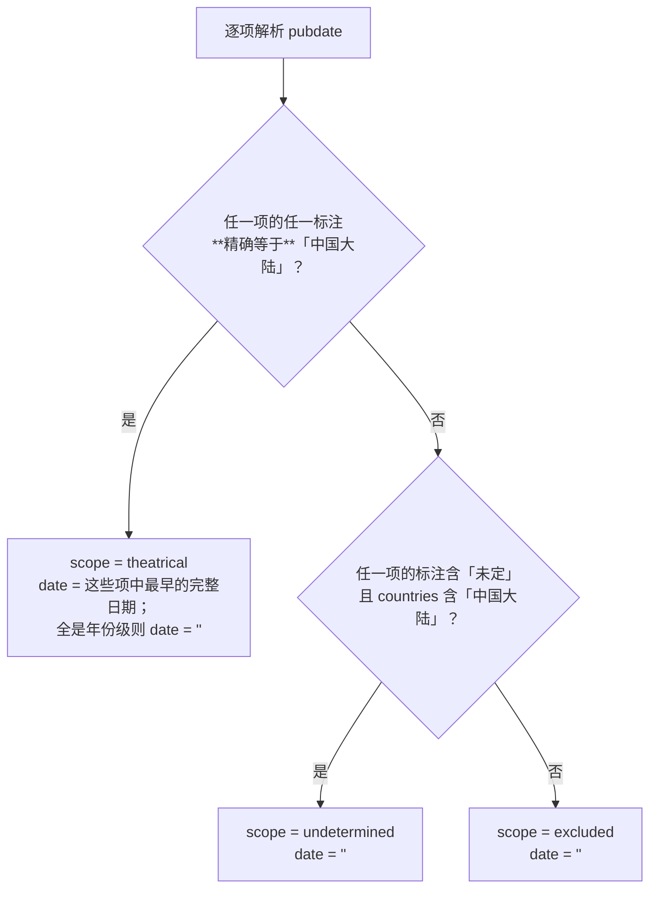
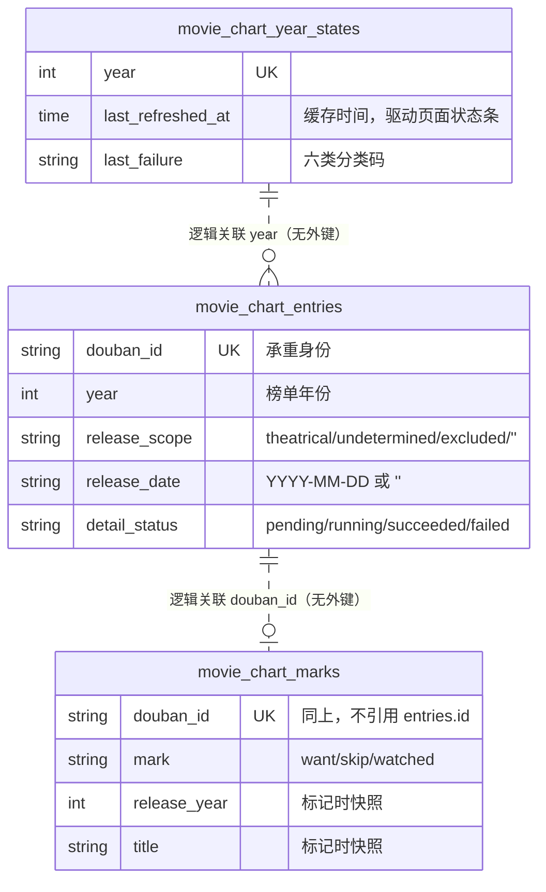

# 年度电影榜单设计

状态：**accepted**（2026-09-21 用户以 `/exec` 指令批准并授权实现）。实现进行中，尚未评审。
来源：用户需求（2026-09-21 对话原文）与 [概要设计.md](概要设计.md)。端点实测结论由概要设计 §2 拥有，本文不复写。
修订：2026-09-21 初稿。2026-09-22 §6.2 与 TC-11 随 D-MC14 改写（海报改落盘，路由零出网）。2026-09-21 §3 澄清「置底」的适用范围：仅 `release_scope=''` 在两种排序下强制置底，另两行的置底是按上映时间排序的自然结果。2026-09-21 D-MC12 修订：当年的自动刷新增加「上一次尝试未失败」这一条件——原规则下源持续不可用时，每打开一次榜单页就重跑约 100 次请求，而 §7 给往年定的「避免每次打开页面都重试」同样适用于当年。2026-09-21 §6.2 补入重定向逐跳校验（原文只要求校验首地址，漏了 302 转出白名单这条路径）。2026-09-21 §7 修订往年自动抓取的判据：原表述与 D-MC12 对「往年、无缓存、从未尝试」这一格自相矛盾（D-MC12 说抓一次，§7 说不自动出网），现按 `last_attempt_at` 区分「从未尝试」与「尝试过失败」，两者才同时成立。2026-09-21 §2.3 修订 401/403 的分类（`credential_invalid` → `source_error`），原因见该节。

Support lenses：`sql-style`（三张新表的键、索引、双方言 upsert，结论已并入 §4）。`architecture-designer` 未单独加载——模块归属、依赖方向与故障边界沿用 `services/watchlist_metadata_source.go` 已确立的同一条边界，没有新的架构问题；理由记在[概要设计 §3](概要设计.md#三总体方案与模块关系)。

## 一、范围与设计依据

本文补充概要设计不拥有的东西：端点的精确参数与字段映射、`pubdate` 判定算法、三张表的字段级契约与并发不变量、Wails 绑定与海报路由的接口形状、边界条件与验证策略。

**复用判断（架构证据）**：

| 需要的能力 | 复用的既有实现 | 为什么够用 |
|---|---|---|
| 出网（含用户配置的资料源代理） | `services/watchlist_metadata_config.go:85` `NewWatchlistMetadataHTTPClient(config, timeout)` | 语义完全匹配：代理配置来源统一、地址填错返回 `ErrWatchlistMetadataProxyInvalid` 而不静默直连。需求点名的 `buildWatchlistMetadataClient` **在本仓库中不存在**，同文件里的这个工厂是它实际指代的对象 |
| 失败分类 | `services/watchlist_metadata_source.go` 的 `WatchlistMetadataFailure` 六类 + `classifyWatchlistMetadataTransportError` / `classifyWatchlistMetadataHTTPStatus` | 六类与本功能的失败面一一对应，直接复用函数而不是抄一份 |
| 写想看片单 | `services/watchlist_service.go:113` `WatchlistService.Create(title, kind)` | 撞名已经返回 `ErrWatchlistTitleExists`，无需改动 |
| 后台任务面板 | `services/background_task_registry.go` | 新增一个 key 即可 |
| 双后端测试 | `internal/dbtest` | 已有 `CINEINSIGHT_TEST_PG_DSN` 切换机制 |

**没有找到可复用的**：进程内图片字节缓存。仓库里的 LRU 都是磁盘缓存（`services/image_thumbnail_service.go:361`、`services/playback_proxy_store.go:429`），与"不落盘"的裁决冲突。本设计因此不引入内存 LRU，改用 HTTP 缓存头（§6.2），代价记在[概要设计 §8](概要设计.md#八风险与代价)。

## 二、豆瓣端点契约

适配器 `services/movie_chart_douban.go` 的 `DoubanMovieChartSource`，构造时注入共用 `*http.Client`。它**不碰数据库**。

### 2.1 列表请求

```
GET https://m.douban.com/rexxar/api/v2/movie/recommend
  ?refresh=0&start=<offset>&count=20&uncollect=false&playable=false
  &selected_categories={}&tags=<year>&sort=<T|U|R|S>
Header: User-Agent: <watchlistPosterUserAgent>
        Referer: https://movie.douban.com/explore
        Accept: application/json
```

`selected_categories` 实测不起过滤作用（[概要设计 §2](概要设计.md#二豆瓣端点实测结论设计依据)），传空对象只为贴合真实客户端形态。`tags` **只带年份，不带地区**——地区是产地维度，带上会滤掉全部引进片（[D-MC02](概要设计.md#D-MC02)）。

响应中本设计**实际使用**的字段，其余（`comment` / `photos` / `alg_json` / `honor_infos` / `vendor_*` 等）一律丢弃：

| 响应字段 | 落到 | 说明 |
|---|---|---|
| `items[].id` | `douban_id` | 承重身份。非 `^[0-9]{1,16}$` 即判响应异常 |
| `items[].title` | `title` | 空串判响应异常 |
| `items[].year` | 仅用于校验 | 与请求年份不符的条目**跳过并计数**，不写库 |
| `items[].type` | 仅用于过滤 | 非 `"movie"` 跳过 |
| `items[].card_subtitle` | `card_subtitle` | 原样存，前端直接展示（已含产地/类型/导演/主演） |
| `items[].rating.value` / `.count` | `rating` / `rating_count` | 缺失为 0 |
| `items[].pic.large` → `.normal` | `poster_url` | 取第一个非空 |
| `total` / `start` / `count` | **不使用** | `total` 恒为 500 的占位值，用它会算出错的分页；翻到尽头时响应里连 `total` 键都没有 |

**空页与异常响应必须区分开（2026-09-21 实测补充）**：真正的空页**带 `items` 键且值为空数组**，信封其余部分（`filters` / `sorts` / `recommend_categories` 等）照常齐全——
`GET …/movie/recommend?tags=2026&sort=R&start=500` 实测 HTTP 200、3700 字节、`"items": []`。
因此解析时必须把「`items` 键缺失或为 `null`」与「`items` 为空数组」分开：前者说明拿到的根本不是预期载荷
（限流信封 `{"code":1002,"msg":"rate limited"}` 就是这种形态），判 `source_error`；后者才是合法空页，继续翻下一页且不记失败码。
两者混为一谈会让一次限流变成「整年抓取成功但没有数据」，页面显示空榜单配「数据更新于 刚刚」——正是需求禁止的「静默显示空榜单」。
同一条界线在姊妹适配器 `services/watchlist_metadata_douban.go:56-59` 上已经划过。

### 2.2 详情请求

```
GET https://m.douban.com/rexxar/api/v2/movie/<douban_id>
Header: 同上，Referer: https://m.douban.com/movie/subject/<douban_id>/
```

| 响应字段 | 落到 |
|---|---|
| `pubdate[]` + `countries[]` | `release_scope` / `release_date` / `release_pubdate`（算法见 §3） |
| `is_released` | `is_released` |
| `countries[]` | `countries`（`\n` 分隔，沿用仓库既有多值列写法） |
| `genres[]` | `genres` |
| `directors[].name` / `actors[].name` | `directors` / `cast`（各取前 8 人） |
| `intro` | `overview` |
| `rating.value` / `.count` | 覆盖列表阶段的值（详情更准） |
| `original_title` | `original_title` |
| `is_tv` / `type` | 任一表明是剧集 → `release_scope='excluded'`，`detail_status='succeeded'` |

### 2.3 失败分类映射（[D-MC07](概要设计.md#D-MC07)）

六类**互不合并**。直接调用既有的两个分类函数，不重写判定：

| 场景 | 分类码 | 依据 |
|---|---|---|
| 代理地址无效（`ErrWatchlistMetadataProxyInvalid`） | `proxy_unreachable` | `classifyWatchlistMetadataTransportError` |
| `*net.OpError` 且 `Op == "proxyconnect"` | `proxy_unreachable` | 同上 |
| 超时 / DNS / 连接被拒 | `network_unreachable` | 同上 |
| HTTP 401 / 403 | `source_error` | 见下方「为什么 401/403 不算凭证错」 |
| 响应最终 `Host` ≠ 请求 `Host`（豆瓣验证页跳转） | `source_error` | 沿用 `watchlist_metadata_douban.go` 既有判定 |
| 详情 404 且响应体 `{"code":404,"msg":"traversal_error"}` | `not_found` | 同上 |
| 其他非 2xx | `source_error` | |
| 响应超 2 MiB / JSON 解析失败 / `id` 或 `title` 缺失 | `source_error` | |
| **列表 200 且 `items` 为空** | **不是失败** | 实测空页是瞬时现象，记日志继续翻下一页 |
| `credential_missing` | 本源无凭证，永不产生 | 保留枚举值，不因"用不到"而合并 |

**为什么 401/403 不算凭证错（2026-09-21 修订）**：本源**没有任何凭证**——用户没有可配置的 key，
`credential_missing` 与 `credential_invalid` 对它都不可达。把 403 归成 `credential_invalid`
会让界面提示用户去检查一个不存在的配置项，而豆瓣的 403 实际上是反爬拦截。同一主机上的既有适配器
`services/watchlist_metadata_douban.go` 早已把全部非 2xx 归 `source_error` 且不调用
`classifyWatchlistMetadataHTTPStatus`，两个适配器对同一主机的同一状态码不能给出相反的解释。
六类仍然各自独立、互不合并，也没有任何错误被伪装成「查无数据」，因此这条修订不触碰既有约束。
传输层错误仍走 `classifyWatchlistMetadataTransportError`，不变。

日志沿用既有形态：只记 `source / path / status / bytes / elapsed_ms`，**不记搜索词、响应正文或验证页参数**。

## 三、`pubdate` 判定算法（[D-MC02](概要设计.md#D-MC02)）

输入 `pubdate []string` 与 `countries []string`，输出 `(scope, date, pubdateRaw)`。

对 `pubdate` 的每一项按 `^(\d{4})(?:-(\d{2})-(\d{2}))?\((.+)\)$` 匹配；不匹配的项跳过。取括号内文本按 `/` 拆分并逐段 `TrimSpace`，得到该项的地区标注集合。



**必须用精确相等而不是子串包含**：`strings.Contains(标注, "中国大陆")` 会让 `2026(中国大陆网络)` 误判成院线公映，而裁决明确排除纯网络上线。同理 `/` 拆分不能省——`2026-03-20(美国/中国大陆)`（《挽救计划》实测样本）不拆就永远匹配不上。

`release_pubdate` 存 `pubdate` 原文（`\n` 连接），供界面展示与事后审计判定是否正确。

判定结果对榜单的作用：

| `scope` | 榜单是否显示 | 界面 |
|---|---|---|
| `theatrical` + 有 `date` | 是 | 显示上映日期 |
| `theatrical` + 无 `date` | 是 | 「<年份>年内地上映·未定档」，按上映时间排序时自然置底 |
| `undetermined` | 是 | 「档期未定」，按上映时间排序时自然置底 |
| `excluded` | 否 | —— |
| `''`（详情未补全） | 是 | 「上映信息待确认」，**两种排序下都置底** |

**「置底」按排序模式区分（2026-09-21 执行期澄清）**：`theatrical`-无日期 与 `undetermined` 的置底是**按上映时间排序的自然结果**（没有日期可排），不是一条独立规则——它们已经通过了内地公映判定，评分是可信的，按评分排序时就该正常参与排名。真正需要在**两种排序下都强制置底**的只有 `release_scope = ''`：它还没被内地公映口径判定过，详情一落地可能根本不该出现在榜单上，而它携带的评分是列表阶段的粗值。把一个可能马上要撤下去的条目放在「按评分」榜首，展示的是我们即将收回的东西。
（原表述对三行统一写「排序置底」且未限定排序模式；若按字面实现，§8 记录的「2026 年中国大陆条目几乎全是未定档」会让评分榜单几乎为空。）

## 四、数据契约

三张新表，文件 `models/movie_chart.go`。追加到 `models.AllModels()` **末尾**：三者之间与对其他表都**没有外键**（标记表按豆瓣 ID 字符串关联，是逻辑关联不是强制外键），因此不引入新的拓扑序约束，`models.TestAllModelsIsTopologicallyOrdered` 照常通过。



**为什么标记表按 `douban_id` 而不是 `entries.id` 关联（[D-MC05](概要设计.md#D-MC05)）**：缓存表的主键是本地自增值，缓存重建或换机器后会变；豆瓣 ID 是需求点名的"跨请求稳定的标识"。快照 `title` / `release_year` / `poster_url` 三列让已看页在缓存被清空、或该条目从豆瓣下架后仍然完整可用——已看记录是用户产生的事实，不能因为缓存变动而丢失。

### 4.1 `movie_chart_entries`

| 列 | 类型与标签 | 说明 |
|---|---|---|
| `id` | `uint` `primarykey` | |
| `douban_id` | `size:16;not null;uniqueIndex:idx_movie_chart_entry_douban` | upsert 冲突目标 |
| `year` | `int` `not null;default:0;index:idx_movie_chart_entry_list,priority:1` | 抓取时使用的 `tags` 年份 |
| `title` | `size:200;not null;default:''` | |
| `original_title` | `size:200;not null;default:''` | 详情阶段写 |
| `card_subtitle` | `type:text;not null;default:''` | |
| `release_scope` | `size:16;not null;default:'';index:idx_movie_chart_entry_list,priority:2` | §3 的判定结果 |
| `release_date` | `size:10;not null;default:''` | `YYYY-MM-DD` 或空 |
| `release_pubdate` | `type:text;not null;default:''` | 原文，供审计 |
| `is_released` | `bool` `not null;default:false` | |
| `rating` | `float64` `not null;default:0` | |
| `rating_count` | `int` `not null;default:0` | |
| `countries` / `genres` / `directors` / `cast` | `type:text;not null;default:''` | `\n` 分隔 |
| `overview` | `type:text;not null;default:''` | |
| `poster_url` | `type:text;not null;default:''` | 远程地址，只给海报代理用 |
| `detail_status` | `size:16;not null;default:'pending';index:idx_movie_chart_entry_detail,priority:1` | |
| `detail_error` | `size:32;not null;default:''` | 六类分类码 |
| `detail_claim` | `size:32;not null;default:''` | **32 个十六进制字符**，见 §5 |
| `list_fetched_at` / `detail_fetched_at` | `*time.Time` | 可空 |
| `created_at` / `updated_at` | `time.Time` | |

**gorm default 禁令核对**：上表每个 `default` 都等于该列零值该有的语义（`''`、`0`、`false`、`'pending'`、`'movie'` 式的初始态）。双向迁移器的 `Unscoped().Create` 会把零值字段替换成标签默认值，替换后值不变，因此无害——与 `models/watchlist.go:33-39` 记录的判断口径一致。**本表没有任何非零默认值的布尔或数值列**。

索引：

- `idx_movie_chart_entry_douban` UNIQUE(`douban_id`) —— upsert 冲突目标 + 标记关联的访问路径。
- `idx_movie_chart_entry_list` (`year`, `release_scope`) —— 榜单主查询的过滤路径。排序列不进索引：`ORDER BY CASE WHEN release_date = '' THEN 1 ELSE 0 END, release_date, id` 不是可索引表达式，而单年约 1500 行、十年约 15000 行的排序代价可以忽略。**没有实测过的行数不作为性能结论**，这是按数据规模的估计。
- `idx_movie_chart_entry_detail` (`detail_status`, `id`) —— 补全 worker 取待办的访问路径，按 `id` 升序让认领顺序确定。与 `idx_watchlist_enrichment` 同形。

### 4.2 `movie_chart_marks`

| 列 | 类型与标签 | 说明 |
|---|---|---|
| `id` | `uint` `primarykey` | |
| `douban_id` | `size:16;not null;uniqueIndex:idx_movie_chart_mark_douban` | 一个条目同时只有一个标记 |
| `mark` | `size:16;not null;default:'';index:idx_movie_chart_mark_group,priority:1` | `want` / `skip` / `watched` |
| `release_year` | `int` `not null;default:0;index:idx_movie_chart_mark_group,priority:2` | **标记时快照**，已看页按它分组（[D-MC11](概要设计.md#D-MC11)） |
| `title` | `size:200;not null;default:''` | 标记时快照 |
| `poster_url` | `type:text;not null;default:''` | 标记时快照 |
| `watchlist_entry_id` | `uint` `not null;default:0` | 非 0 表示这条片单记录由榜单创建，撤销时一并删除；0 表示撞名或非 `want` |
| `marked_at` | `time.Time` `not null` | |
| `created_at` / `updated_at` | `time.Time` | |

索引 `idx_movie_chart_mark_group` (`mark`, `release_year`) 是已看页的访问路径（`WHERE mark='watched' ORDER BY release_year DESC`）。

### 4.3 `movie_chart_year_states`

| 列 | 类型与标签 | 说明 |
|---|---|---|
| `id` | `uint` `primarykey` | |
| `year` | `int` `not null;uniqueIndex:idx_movie_chart_year` | |
| `last_refreshed_at` | `*time.Time` | 仅在整轮列表阶段成功后写。驱动[概要设计 §4.2](概要设计.md#42-榜单读取与缓存回落)的三形态与 30 天判定 |
| `last_attempt_at` | `*time.Time` | 每轮结束都写 |
| `last_failure` | `size:32;not null;default:''` | 六类分类码，成功时清空 |
| `created_at` / `updated_at` | `time.Time` | |

### 4.4 迁移

三张表由 `AutoMigrate` 依标签建出，**不需要手写迁移**：没有存量数据要改造，没有需要在 `AutoMigrate` 前后插队的步骤（对比 `database/watchlist_kind_schema.go` 那种必须前后夹住的情形）。重复运行天然安全。部分失败的处置就是下次启动重跑 `AutoMigrate`。

## 五、并发契约

单进程桌面应用，并发只来自同进程内的后台 worker 与前端调用。按 loopx 的共享并发合同（`shared/database-concurrency.md`）逐条记录不变量。**全程不使用 `SELECT ... FOR UPDATE`、`LOCK TABLES` 或数据库咨询锁。**

| 转换 | 不变量 | 条件谓词 | 零行时 | 回滚单元 |
|---|---|---|---|---|
| 列表 upsert 条目 | 一个 `douban_id` 一行 | `ON CONFLICT (douban_id) DO UPDATE` | 不可能为零行 | 单条语句 |
| 认领待补全条目 | 同一条目不被两个 worker 同时处理 | `WHERE id=? AND detail_status='pending'` | 已被处理或用户改了状态 → **跳过下一条** | 单条 UPDATE |
| 写回详情 | 迟到的结果不覆盖新一轮 | `WHERE id=? AND detail_status='running' AND detail_claim=<本次>` | **丢弃结果并记日志，不报错** | 单条 UPDATE |
| upsert 标记 | 一个条目一个标记 | `ON CONFLICT (douban_id) DO UPDATE` | 不可能为零行 | 与片单写入**不同一事务**，见下 |
| upsert 年状态 | 一年一行 | `ON CONFLICT (year) DO UPDATE` | 不可能为零行 | 单条语句 |

**ABA**：`detail_status` 会从 `failed`/`succeeded` 回到 `pending`（用户点刷新），只比对状态值无法区分"同一次认领"与"新一轮认领"，一次慢响应会落到重试后的新一轮上。因此写回必须**同时**比对状态与 `detail_claim`。`detail_claim` 用 `hex.EncodeToString` 于 16 字节得到的 **32 个十六进制字符**；**不得用 `uuid.NewString()`**——它是 36 字符，SQLite 不校验长度会默默存下，Postgres 直接报 `value too long`（`models/watchlist.go:52-55` 记录的既有踩坑）。

**「想看」的跨边界写入不是一个原子单元**：`movie_chart_marks` 的 upsert 与 `WatchlistService.Create` 是两次独立写入，中间进程崩溃会留下"标了想看但片单里没有"或反过来。**顺序固定为先建片单条目、再写标记**，并把返回的片单 ID 写进 `watchlist_entry_id`：这样崩溃只会留下一条用户可见、可自行删除的片单记录，而不会留下一个指向不存在片单条目的标记。反过来则会让撤销去删一个不存在的 ID。

**批内去重**：列表阶段按页批量 upsert。同一批里出现两条相同 `douban_id` 时，Postgres 会报 `ON CONFLICT DO UPDATE command cannot affect row a second time`（21000）而整批失败，SQLite 不报。**必须在构造批次前按 `douban_id` 去重**，不能依赖数据库容忍。

**`DoUpdates` 只列列表阶段拥有的列**（`title` / `card_subtitle` / `rating` / `rating_count` / `poster_url` / `year` / `list_fetched_at` / `updated_at`）。**绝不包含 `detail_*` 与 `release_*`**——否则每次列表重抓都会把已补全的条目打回 `pending`，一年白跑 1500 次详情。`updated_at` 必须显式写进 `Assignments`，GORM 在 `DoUpdates` 路径上不会自动维护它（`services/image_ai_tagging_service.go:773` 即此写法）。SET 右侧引用目标表列时必须带表名限定，否则 Postgres 报 42702（同文件 767 行记录了这个坑）。

**失败条目的重试**：列表阶段结束后，把该年 `detail_status='failed'` 的条目一次性重置为 `pending` 并清空 `detail_claim`。不这样做，失败条目永远不会再被补全。这条重置是刷新语义的一部分，不是重试机制——它由用户点刷新或月度刷新驱动，不自行发生。

## 六、接口契约

### 6.1 Wails 绑定（`app_movie_chart.go`）

绑定层只做参数校验与转发，业务在 `MovieChartService`。**非法枚举值一律拒绝，不静默回退**——沿用 `app_watchlist.go:15` 记录的既有态度。

| 方法 | 入参 | 出参 | 语义 |
|---|---|---|---|
| `ListMovieChart` | `year int, sort string, page int, showMarked bool` | `*MovieChartPage` | 只读本地表。`sort ∈ {release, rating}`，`page ≥ 1`，`year ∈ [1900, 当前年+5]`；越界返回错误 |
| `RefreshMovieChart` | `year int` | `error` | 启动后台刷新任务；已在跑则返回错误，不排队 |
| `CancelMovieChartRefresh` | —— | `error` | |
| `MarkMovieChartEntry` | `doubanID string, mark string` | `*MovieChartMarkResult` | `mark ∈ {want, skip, watched}`；条目不在缓存中返回错误 |
| `ClearMovieChartMark` | `doubanID string` | `error` | 撤销；无标记时幂等返回 nil |
| `ListWatchedMovies` | —— | `[]WatchedMovieYearGroup` | 已看页，按上映年份倒序分组 |
| `ListMovieChartYears` | —— | `[]int` | 年份下拉：本地有缓存的年份 ∪ {当前年}，倒序 |

响应结构逐字段只给调用方要用的东西，**不透传存储对象**：

```go
type MovieChartPage struct {
    Year     int                  // 回显，供前端丢弃过时响应
    Sort     string               // 同上
    Page     int
    PageSize int                  // 恒为 20
    Total    int64                // 本地表中符合条件的总数，供分页器
    Items    []MovieChartItemView
    Cache    MovieChartCacheState // 驱动页面顶部状态条
    Backfill MovieChartBackfill   // 驱动「补全中 N/M」
}

type MovieChartItemView struct {
    DoubanID     string
    Title        string
    OriginalTitle string
    CardSubtitle string  // 豆瓣原样：「2026 / 中国大陆 / 纪录片 / 张凌赫」
    ReleaseDate  string  // "" 表示未定档
    ReleaseScope string  // theatrical / undetermined / ""（待确认）
    Rating       float64
    RatingCount  int
    HasPoster    bool    // 前端据此决定是否请求代理路由，避免必然 404 的请求
    Mark         string  // "" / want / skip / watched
    DetailStatus string  // 供「上映信息待确认」与失败提示
    DetailError  string  // 六类分类码，空表示无失败
}

type MovieChartCacheState struct {
    LastRefreshedAt *time.Time // nil 表示该年从未成功抓取过
    LastFailure     string     // 六类分类码，空表示上次成功
    Refreshing      bool
}

type MovieChartBackfill struct {
    Pending int // detail_status IN ('pending','running') 的条数
    Total   int // 该年条目总数
}

type MovieChartMarkResult struct {
    Mark              string
    WatchlistCreated  bool // 是否新建了片单条目
    WatchlistConflict bool // true 时前端出既有的「该片名已在想看片单中」提示
}

type WatchedMovieYearGroup struct {
    Year  int // 影片上映年份（标记时快照）；0 表示年份未知，单列一组
    Items []WatchedMovieView
}

type WatchedMovieView struct {
    DoubanID  string
    Title     string
    HasPoster bool
    MarkedAt  time.Time
}
```

`Overview` / `Countries` / `Genres` / `Directors` 不进列表响应——需求里的榜单条目不展示它们，`CardSubtitle` 已经带了产地、类型与导演。将来要详情弹窗时再加一个方法，不在列表里预先透传。

### 6.2 海报路由（[D-MC14](概要设计.md#D-MC14) 取代 [D-MC09](概要设计.md#D-MC09)）

> **2026-09-22 推翻**：本节原先描述的是「即时转发、不落盘」。真机一天内豆瓣图床开始返 403/418，
> 且原方案依赖的缓解手段（长 `Cache-Control` + webview HTTP 缓存）**从未生效过**——海报经 Wails
> `AssetServer.Handler`（`main.go:41`）即自定义协议提供，WKWebView 不对自定义协议响应做 HTTP 缓存。
> 现行方案：**下载移入详情补全 worker**（继承其 1 次/秒限速、取消与断点续跑），落盘经
> `ManagedImageService`（entityType `movie_chart`），条目新增 `poster_path` 列；**本路由退化为纯本地
> 磁盘读、零出网**，未命中返回 404 让前端显示占位，**不即时回源**——UI 渲染路径上的即时出网正是
> 被限流的直接原因。下面列出的白名单、逐跳重定向复检、Referer 与 UA **全部移到下载侧**
> `services/movie_chart_artwork.go`，语义不变。
> 补图取件判据：`poster_url <> '' AND poster_path = '' AND (release_scope <> 'excluded' OR douban_id 有标记)`，
> **不看 `detail_status`**（覆盖从未下载／下载失败／被 LRU 淘汰三种情形）。「或有标记」那一支是承重的：
> 已看页读标记表、**不按 `release_scope` 过滤**，一刀切排除会让「标了已看之后才被判成 excluded」的卡片
> 永远只有占位图。LRU 上限 **1 GiB**，淘汰顺序 **先清行、后删文件**。往年靠 `OpenMovieChartYear` 起的
> 「只补海报」轮次够得着。


在 `preview_asset_handler.go` 新增一条只读路由，与既有 `/preview/watchlist-poster/` 等并列：

```
GET /preview/douban-chart-poster/<douban_id>
```

- 路径段须匹配 `^[0-9]{1,16}$`，否则 400。
- 地址**从本地库取**：先查 `movie_chart_entries.poster_url`，未命中查 `movie_chart_marks.poster_url`（已看页在缓存清空后仍要有图）。两处都没有 → 404。**不接受调用方传入 URL**，这是这条路由不成为 SSRF 跳板的唯一依据。
- 二次校验取到的地址：`scheme == "https"` 且 `host` 等于 `doubanio.com` 或以 `.doubanio.com` 结尾（**两个分支分开写**，`strings.HasSuffix(host, "doubanio.com")` 会放行 `evildoubanio.com`）；不接受内嵌凭证与显式端口。不满足 → 404。库里的值来自豆瓣响应，仍然是外部输入。
- **同一套校验必须挂在 `http.Client.CheckRedirect` 上逐跳执行**（2026-09-21 执行期补入）。只校验首地址的话白名单只覆盖第一跳，上游一个 302 跳到 `169.254.169.254` 这类地址就会被跟随——这条路由不接受调用方 URL 的全部意义都在这里失守。跳数上限 5。
- 用 `NewWatchlistMetadataHTTPClient` 的客户端取图，带 `Referer: https://<host>/`（图片自身站点根，实测 200）与 `watchlistPosterUserAgent`。上游非 2xx 或非 `image/*` → 502。
- 响应体限 20 MiB（`managedImageMaxBytes` 同值），透传 `Content-Type`，加 `Cache-Control: public, max-age=604800`——不落盘的前提下，重复浏览靠 webview 的 HTTP 缓存兜住。

### 6.3 后台任务

新增 `BackgroundTaskKey` 值 `movie_chart`，加入 `backgroundTaskKeyOrder`。**不进空闲门**：刷新由用户打开页面或点按钮触发，与 `browser_download`、`watchlist_enrich` 同口径（`services/background_task_registry.go:30-34` 记录了这条判断标准）。

## 七、边界条件

| 情形 | 行为 |
|---|---|
| 往年无缓存且**从未尝试过**抓取 | 打开时自动抓一次（[D-MC12](概要设计.md#D-MC12) 的「无该年缓存时抓一次」） |
| 往年无缓存但**已尝试过并失败** | 空态 + 失败原因 + 「点刷新获取」；**不**自动出网，避免每次打开页面都重试 |
| 某年有缓存但上次刷新失败 | 显示缓存 + 缓存时间 + 六类失败文案；**不显示空榜单**；**打开页面不自动重试**，等用户点刷新 |
| 抓取中途被取消 | 已 upsert 的条目全部保留，`last_refreshed_at` **不**更新，`last_failure` 不写（取消不是失败） |
| 同一条目在四种排序里各出现一次 | 按 `douban_id` upsert，四次写入合成一行；批内先去重（§5） |
| 列表返回的条目 `year` 与请求年份不符 | 跳过并计数，不写库。豆瓣的 `tags` 过滤不保证严格 |
| 详情判定为剧集 | `release_scope='excluded'`、`detail_status='succeeded'`，不显示，**不删行**（增量更新从不删除，[D-MC04](概要设计.md#D-MC04)） |
| 「想看」撞上用户手输的同名条目 | 标记照记，`watchlist_entry_id=0`，`WatchlistConflict=true`；撤销时**不动**那条片单记录 |
| 对同一条目重复点同一个标记 | 幂等，只刷新 `marked_at` |
| 标记一个不在缓存里的豆瓣 ID | 拒绝。标记的快照字段要从缓存行取，没有行就没有可信的片名与年份 |
| 已看条目的 `release_year` 为 0（详情未补全就标了已看） | 单列一组「年份未知」，不猜 |
| `poster_url` 为空 | `HasPoster=false`，前端不发代理请求 |
| 分页请求越过末页 | 返回空 `Items` 与真实 `Total`，不报错 |
| 刷新任务已在跑时再点刷新 | 返回错误「正在刷新」，不排队、不并发 |

## 八、验证与交接

### Verification Strategy

需求 §验收 的每一条都有归属。**以下全部为待执行**——本设计尚未实现，任何"通过"都还不存在。

| TC | 来源 | 覆盖方式 | 实际结果（2026-09-21） |
|---|---|---|---|
| TC-01 分页与排序参数拼装 | 需求·单测 | `TestMovieChartDoubanListRequestShapeAndPageWalk` | **通过**。断言 `tags` 只带年份且不含 `,`、四排序 × 25 页、`start=0…480` |
| TC-02 增量更新不产生重复 | 需求·单测 | `TestMovieChartSecondListRoundKeepsBackfilledDetails` | **通过**。第二轮不把已补全条目打回 pending（变异验证） |
| TC-03 三种标记的写入与撤销 | 需求·单测 | `TestMovieChartMarkWriteAndClearEachMark` / `...Transitions` | **通过**（双后端）。界面侧由 `MovieChartPage.test.js` 覆盖 |
| TC-04 六类失败分类映射 | 需求·单测 | `TestMovieChartDoubanFailureClassification`（15 行）+ `...AuthStatusesStaySourceError` | **通过**。含「不得合并」的反向断言；界面侧断言 `new Set(reasons).size === 6` |
| TC-05 不可达时回落缓存 | 需求·单测 | `TestMovieChartListPageCacheStates` + 界面侧「三种缓存状态条」 | **通过**。失败态下 `Items` 仍非空（变异验证） |
| TC-06 真机当前年 + 往年 | 需求·真机 | 手动 | **待执行**。需真实豆瓣请求，本机未跑 |
| TC-07 双后端迁移与读写 | 需求·双后端 | `internal/dbtest` 两条腿 | **通过**。PG：`services 433.0s` / `database 44.5s` / `models 1.2s`，真实 exit 0 |
| TC-08 空页不终止、不记 `not_found` | 实测发现 | `TestMovieChartDoubanEmptyPageDoesNotStopWalk` | **通过**。另有 `...MissingItemsKeyIsSourceError` 区分「空数组」与「键缺失」 |
| TC-09 `pubdate` 判定 | 实测发现 | `TestMovieChartReleaseJudgement`（14 行，含六个真实样本） | **通过**。`Contains` 与去掉 `/` 拆分两种变异均被杀 |
| TC-10 撤销「想看」不误删 | 边界 | `TestMovieChartMarkKeepsUserTypedWatchlistEntry` | **通过**。断言全程 `watchlist_entries` 零 DELETE |
| TC-11 海报的地址来源与域名白名单 | 安全边界 | **断言对象已随 D-MC14 改变**：白名单与逐跳复检移到下载侧 `TestMovieChartPosterRejectsAddressesOutsideWhitelist`（10 拒 + 0 请求）与 `TestMovieChartPosterFollowsWhitelistedRedirectOnly`；路由侧改为断言**零出网** `TestDoubanChartPosterRouteNeverFetchesOnMiss` | **通过**。含 `evildoubanio.com` 近似命中；26 次变异全部被抓 |
| TC-12 批内重复 `douban_id` | 并发契约 | `TestMovieChartUpsertDedupesDuplicateDoubanIDInOneBatch` | **通过（仅 Postgres 有效）**。**该用例在 SQLite 上天然空转**——去掉去重 SQLite 照样绿，PG 报 21000 |
| TC-13 写回守卫 | 并发契约 | `...LateDetailWriteBackIsDiscardedOnNewClaim` / `...RequiresRunningStatus` | **通过**。状态与 claim 两个守卫项分别被变异杀死 |

**最终全量验证（2026-09-21，真实退出码）**：`go test ./...` exit 0；前端 `npm test`（全部 15 个脚本）exit 0，67 文件 / 748 测试；Postgres 腿 `services`+`database`+`models` exit 0。改动前基线已记录在[计划](../../plans/2026-09-21-movie-year-chart.md)：根包 `TestDeleteImageDirectoryHidesItsImages` 当时既有失败，本批次顺带修复（断言测的是 `b35e618` 有意移除的软删副作用）。

**尚未验证的部分**，不得当作已通过：TC-06 全部；豆瓣端点的真实响应（字段映射、`items[].year` 是字符串还是数字、验证页形态）**零次真实请求**；海报代理对真实图床的行为；标记重启后仍在；断网时的界面表现。

文档推演已做的两处：①《挽救计划》`2026-03-20(美国/中国大陆)` 走 §3 算法 → 拆 `/` 后命中「中国大陆」→ `theatrical` + `2026-03-20`，与实测语义一致。②断网场景走 §4.2 → `last_refreshed_at` 非空 + `last_failure=network_unreachable` → 第二形态，显示缓存而非空榜单，符合需求"不静默显示空榜单"。

**呈现检查**：Mermaid 未经渲染验证（本地无渲染工具），语法按仓库既有 11 份含 Mermaid 的设计文档的同一写法。文档内链接与 `D-MC*` 锚点已逐个对照 `概要设计.md` §5 的 `<a id>`。

### Design Contract Index

全部决定由概要设计 §5 拥有，本文只链接不复制：

| 锚点 | 决定 | owner |
|---|---|---|
| [D-MC01](概要设计.md#D-MC01) | 数据源与出网复用 | 概要 §5 |
| [D-MC02](概要设计.md#D-MC02) | 内地公映口径与 `pubdate` 判定 | 概要 §5，算法细节本文 §3 |
| [D-MC03](概要设计.md#D-MC03) | 四排序合并、固定 25 页、空页不终止 | 概要 §5 |
| [D-MC04](概要设计.md#D-MC04) | 增量 upsert，从不删除 | 概要 §5，列级契约本文 §5 |
| [D-MC05](概要设计.md#D-MC05) | 标记独立成表 + 快照字段 | 概要 §5，字段本文 §4.2 |
| [D-MC06](概要设计.md#D-MC06) | 认领 CAS 与限速 | 概要 §5，不变量本文 §5 |
| [D-MC07](概要设计.md#D-MC07) | 六类失败不合并 | 概要 §5，映射表本文 §2.3 |
| [D-MC08](概要设计.md#D-MC08) | 读路径不出网 + 三形态状态条 | 概要 §4.2 |
| [D-MC09](概要设计.md#D-MC09) | 海报即时代理 | 概要 §5，路由本文 §6.2 |
| [D-MC10](概要设计.md#D-MC10) | 旧片在前、未定档置底、每页 20 | 概要 §5，排序表达式本文 §4.1 |
| [D-MC11](概要设计.md#D-MC11) | 已看页按上映年份分组 | 概要 §5 |
| [D-MC12](概要设计.md#D-MC12) | 刷新时机 | 概要 §5，推断部分见概要 §7 |
| [D-MC13](概要设计.md#D-MC13) | 「想看」写入与撤销边界 | 概要 §5，顺序约束本文 §5 |

### Planning Handoff

**已固定**：§2 端点契约、§3 判定算法、§4 三张表的字段与索引、§5 并发不变量、§6 接口形状、§7 边界条件。实现不得改动这些而不回到本文。

**下游可自行决定**：服务内部的函数切分与文件组织、前端组件拆分与样式、日志文案、进度事件的具体载荷。

**待用户确认，不阻塞其余设计**：

1. [D-MC12](概要设计.md#D-MC12) 的推断部分（30 天计时基准、触发点在打开页面、往年不参与月度刷新）——用户原话只给了"每个月拉取一次当年的数据"。
2. 「不过滤」开关的范围被定为"只解除标记造成的隐藏"，不解除内地公映口径（[概要设计 §1](概要设计.md#一背景与范围)的排除项）。需求原文"显示全部条目（含已隐藏的）"可以读成更宽的意思。

**阻塞项**：本设计整体尚未获批。用户的硬约束是「动手前先出 spec……需要先有获批设计再写代码」，因此在批准前不开始实现。
