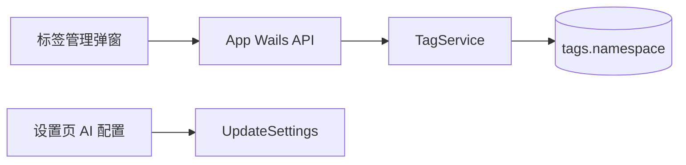
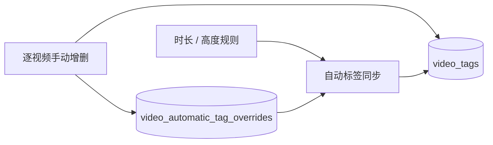

# 标签分类与统一管理（2026-09-23）

## 已确认范围

视频页顶部按主题切换筛选标签；视频行不分组。普通标签与 AI 标签在「标签管理」维护，设置页只保留 AI 打标配置。分类可新建、改名、删除；普通和 AI 标签共用分类。分类由实际标签的 `namespace` 派生，不保留空分类；删除后标签归「未分类」。

## 设计

**D-001 分类来源。** 非自动、未删除标签的非空 `namespace` 去重即分类列表。新建分类时必须同时选择至少一个普通或 AI 标签；操作在一个数据库事务里更新所选标签。自动标签不能参与。`未分类` 对应空字符串，不是持久化分类。

**D-002 共享分类变更。** 改名、删除按原分类一次更新所有普通与 AI 标签。目标名已存在时拒绝改名，避免隐式合并；删除写入空 `namespace`，不删除标签、视频关联或 AI 身份。数据库失败整笔回滚。AI 标签分类发生变化时复用 AI 标签库的待审候选校验与无标签任务重排逻辑，并唤醒后台打标。

`自动` 是保留的只读系统分类：分类管理显示它，但不能用这个名字新建、改名或删除。历史上误归入它的普通/AI 标签仍可在各自编辑器里迁出，避免片库顶部的系统标签与手工标签共组却只被部分删除。

**D-003 编辑入口。** 标签管理内提供普通标签、AI 标签库与分类管理。普通标签的新建和编辑用分类下拉；AI 标签库保留颜色、启用、移出词表和显式清空确认。移出 AI 标签库只改变标签类型，保留原主题分类与视频关联。设置保存不再读取或写入 AI 标签库，因此标签库加载失败不会阻止不相关设置保存。

**D-004 未分类 AI 标签。** AI 标签库允许 `namespace=""`，使删除分类后的 AI 标签仍保留 AI 身份、启用状态和关联。AI 编辑器显示「未分类」，新建 AI 标签可以选现有分类；新增主题先在分类管理中给至少一个标签指定它。服务端仍拒绝空标签名和重复名称。

## 接口与验收

`CreateTagCategory(name, tagIDs)` 要求非空名称、非空且有效的标签 ID 列表，且名称尚不存在。`RenameTagCategory(oldName, newName)` 要求原分类存在、新名非空且不冲突。`DeleteTagCategory(name)` 要求原分类存在并把它的全部标签归入未分类。三者失败不产生部分更新。弹窗成功后刷新标签和 AI 标签库；跨主题多选与标签行展示保持原行为。

验收：普通与 AI 标签同属「内容」时改名为「题材」，两者一起移动；删除「题材」后两者进入「未分类」，AI 标签仍在词表。空库可新建普通标签后在分类管理把它分给新分类；不能单独留下空分类。AI 标签库读取失败时不允许保存其空白草稿，设置页仍能保存 AI 模型配置。

## 追加裁定：自动标签逐视频人工覆盖

用户确认短视频和低清两种自动标签都可逐视频手动添加或移除，人工决定在后续扫描、元数据刷新和设置变更后持续有效，直到再次手动改动。

**D-005 自动规则。** 保留现有短视频时长阈值规则；新增 `automatic_kind=low_resolution` 的「低清」标签，视频未失效且 `height > 0 AND height < 1080` 时自动关联。高度为 0 或恰好 1080 不自动关联。两种标签各有固定名称和独立身份，启动时创建标签实体以便不符合规则的视频也能手动选择；使用现有自动标签名称冲突让位规则，不接管原普通标签的视频关联。启动、扫描、迁移与单视频元数据更新均通过原自动标签同步路径对账。

**D-006 人工覆盖。** 新表 `video_automatic_tag_overrides` 以 `(video_id, automatic_kind)` 唯一，`present` 为人工指定的关联状态。手动添加或移除自动标签时，在同一个事务中写覆盖和 `video_tags` 关联。同步只增删没有覆盖记录的视频；因此手动添加到不满足规则的视频、或从满足规则的视频移除，都会持续保留。再次手动操作覆写同一条记录。表由 `VideoService` 写、`TagService` 同步时读，仍只有 `video_tags` 是视频当前标签关系；覆盖表是规则例外的持久来源。标签整体不能改名/删除/并入 AI 库，图片侧继续禁止自动标签。

两条同步分支：有覆盖记录时保持 `present` 指定的状态；无覆盖记录时按规则增删。写人工覆盖任一步失败即回滚关联修改。旧库没有覆盖记录，升级后第一次同步仍沿用原短视频关联规则。`video_automatic_tag_overrides` 随双向数据库迁移复制，引用的视频行排在前面。
