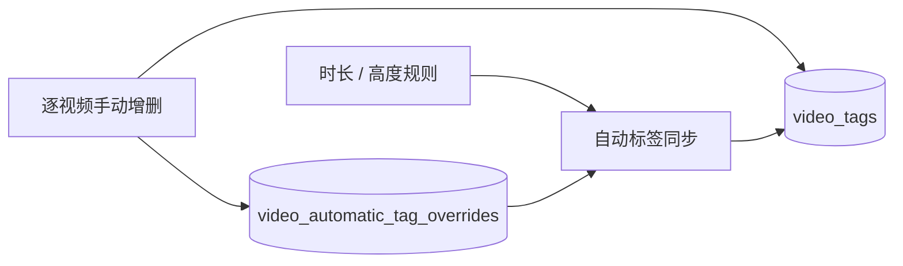

# 标签分类与统一管理（2026-09-23）

## 已确认范围

用户本轮明确裁定：“是，统一管理，全部标签都可供 AI 选择”。标签与分类在同一页面管理，不再区分普通标签和 AI 标签库。视频页顶部主题筛选和视频行展示保持不变。

## 设计（本轮裁定替代原 D-003 / D-004 的类型区分）

**D-001 分类来源。** 分类仍由标签的非空 `namespace` 派生，不保留空分类。新建分类必须同时指定至少一个非自动标签；未分类对应空字符串。

**D-002 分类变更。** 新建、改名、删除复用 `TagService` 原事务；改名撞分类拒绝，删除只清空分类，不删除标签或媒体关联。`自动` 分类只读，历史误归其中的非自动标签可以迁出。

**D-003 单一编辑入口（已批准）。** `TagManagerDialog` 同页提供新建、搜索、名称/颜色/分类编辑、合并、删除与分类维护；取消普通/AI 类型页签、类型筛选、AI 库整库保存和启用开关。已有两类标签在同一列表使用 `CreateTagWithCategory` / `UpdateTagWithCategory` / `DeleteTag` 等逐项接口。标签名称唯一，自动标签的名称、颜色、分类与整体删除限制不变。失败保留输入并报告错误。

**D-004 统一 AI 词表（已批准）。** 视频和图片 AI 的加载、提示词、候选匹配、审核都使用所有未删除且 `automatic_kind` 为空（含历史 NULL）的标签。`is_system`、`is_active` 仅作为历史字段保留，不再决定 AI 资格，不做删列、重建标签或 ID 迁移。旧 AI 库 API 暂保留原历史字段读写以维持已有绑定，但无管理界面调用，不能改变统一词表的资格。AI 仍是闭集：空库暂停，出集结果丢弃，不能因全库只有旧普通标签而允许模型创建新词。

管理复用 `TagService`，AI 服务直接读现有 `tags`，不增加服务、存储或跨层依赖。新增/恢复、改名、分类变更、合并、删除在事务内同步原任务重排；改名同步视频待审名称，图片待审按原策略作废。删除使两侧对应待审失效，合并转移视频候选到目标，图片侧沿用作废过期候选策略。洞察标签 Top 同样去除旧 AI 身份过滤。更新失败整个事务回滚。页面保存成功唤醒原 AI 视频任务，图片侧沿用既有触发方式。

**D-007 历史重名与候选身份。** 原普通库可以与 AI 库并存 `Action` / `action`。统一后不得按小写映射覆盖标签 ID，也不得自动合并历史标签。名称匹配先取原文精确命中；只有归一化结果唯一时才沿用既有大小写容错，歧义且无精确命中的建议丢弃。两侧已匹配候选的去重、审批联动和图片拒绝记录统一按 `matched_tag_id`；`normalized_name` 保留为名称快照。前端局部移除使用同一 ID 口径，AI 分批结果合并保留大小写不同的标签建议。

图片待审唯一索引从 `(image_id, normalized_name)` 迁移到 `(image_id, matched_tag_id)`（只约束 pending 且匹配 ID 非空）。`EnsureImageAITaggingIndexes` 在事务中把历史同图同标签 ID 的重复 pending 保留最新 ID、其余置 superseded，创建新索引后移除旧索引；失败整体回滚并阻止启动。不同标签 ID、批准/拒绝历史与媒体关联保留，重复启动幂等。不修改标签记录或重写名称。验证覆盖 SQLite/PostgreSQL 升级、重复迁移、失败回滚、同名不同 ID 可共存与同 ID 去重。

## 验收与边界

- 历史普通、AI、停用标签均可统一编辑，均进入视频和图片 AI 提示词并可审核；自动和软删除标签均排除。
- 只有普通标签、只有自动标签、空库、未分类、历史 NULL 自动类型、出集高置信建议均有回归覆盖。
- 改名保留 ID 和媒体关联，候选名称保持一致；删除清除媒体关系并使候选失效；合并不再因目标是旧普通标签而让视频候选失效。
- 分类新建/改名/删除保留原事务与自动分类保护；单页可以直接维护全部非自动标签。
- 本轮不提交、不安装应用，不改变 AI 网络配置、人工审批要求或自动标签逐视频覆盖。

验证范围：标签/视频与图片 AI 服务、直接 App 调用方、前端组件和构建。原先关于普通/AI 资格与旧编辑器的断言由本裁定替代。Support lenses: `go-style`, `sql-style`。实现前已检查 `TagService`、两条 AI 加载/提示词/审核路径和管理弹窗；不存在新所有权边界。

## 本轮验证（2026-09-23）

已按用户原始要求核对：单页统一管理，不再区分标签类型；全部非自动标签供视频和图片 AI 使用。实现不改变标签 ID、既有媒体关联或自动标签人工覆盖。

- 修改前标签管理相关前端 25 项、Go 标签/AI 相关基线通过。
- 最终 `go test ./...`、`go vet ./...` 通过（默认 SQLite）。
- 最终 `npm --prefix frontend test` 通过：67 个组件测试文件、761 项测试及全部脚本检查；前端生产构建通过。构建仍提示已有大 chunk / 混合静态动态导入告警。
- 独立 PostgreSQL 测试库通过 `Test(Unified|SharedTagCategoryLifecycle|TagCategory|MergeTagsRetainsPending|ImageAITagCandidatesFollowTagLibraryChanges)`：包含事务回滚、名称重名、两侧审批及候选索引迁移/重跑/失败回滚。
- 测试钩子守卫只退役已删除的独立 AI 库重载入口；另用隔离夹具验证正常、缺失有效钩子、退役入口重新出现及空基线四条路径。
- 独立评审先发现大小写重名的 ID 冲突、再发现同标签跨批置信度覆盖；均修复并回归，最终复审无 Important/Critical。`git diff --check` 通过。

未安装应用、未执行生产数据库迁移、未调用真实 AI 接口；桌面真机视觉尚未验收。没有提交或部署。

## 追加裁定：自动标签逐视频人工覆盖

用户确认短视频和低清两种自动标签都可逐视频手动添加或移除，人工决定在后续扫描、元数据刷新和设置变更后持续有效，直到再次手动改动。

**D-005 自动规则。** 保留现有短视频时长阈值规则；新增 `automatic_kind=low_resolution` 的「低清」标签，视频未失效且 `height > 0 AND height < 1080` 时自动关联。高度为 0 或恰好 1080 不自动关联。两种标签各有固定名称和独立身份，启动时创建标签实体以便不符合规则的视频也能手动选择；使用现有自动标签名称冲突让位规则，不接管原普通标签的视频关联。启动、扫描、迁移与单视频元数据更新均通过原自动标签同步路径对账。

**D-006 人工覆盖。** 新表 `video_automatic_tag_overrides` 以 `(video_id, automatic_kind)` 唯一，`present` 为人工指定的关联状态。手动添加或移除自动标签时，在同一个事务中写覆盖和 `video_tags` 关联。同步只增删没有覆盖记录的视频；因此手动添加到不满足规则的视频、或从满足规则的视频移除，都会持续保留。再次手动操作覆写同一条记录。表由 `VideoService` 写、`TagService` 同步时读，仍只有 `video_tags` 是视频当前标签关系；覆盖表是规则例外的持久来源。标签整体不能改名/删除/并入 AI 库，图片侧继续禁止自动标签。

两条同步分支：有覆盖记录时保持 `present` 指定的状态；无覆盖记录时按规则增删。写人工覆盖任一步失败即回滚关联修改。旧库没有覆盖记录，升级后第一次同步仍沿用原短视频关联规则。`video_automatic_tag_overrides` 随双向数据库迁移复制，引用的视频行排在前面。
