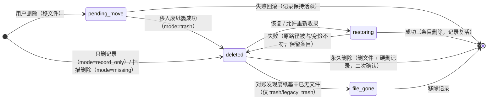
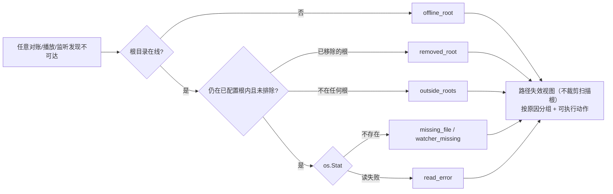

# 产品完善度修复批次 · 概要设计

| 项 | 内容 |
|---|---|
| 变更等级 | **L3**：新增多张表与多列、改变回收站/可见性/收藏/观看判定四条核心语义，推翻或收窄 2026-09-01、09-07、09-13 等多项既有裁决 |
| 版本 | v1.1 · **全部决定已接受**（2026-09-29：8 项逐项裁决 R1–R8，另 3 项产品取舍 R9–R11，其余由用户批量确认 R12，见 §2） |
| 需求来源 | [问题清单.md](./问题清单.md)，共 88 条（用户 2026-09-29 裁定全部修复） |
| 文档权威 | 本文负责方案、模块关系和 `D-PC*` 决定；字段级契约在 [需求设计文档.md](./需求设计文档.md)，问题事实在问题清单 |
| 实现状态 | 未实现。基线：HEAD `43efd8a`，`go test ./...`（SQLite）全绿，`npm test` 774/774 全绿（2026-09-29） |

| 版本 | 日期 | 说明 |
|---|---|---|
| v1.1 | 2026-09-29 | 用户确认 D-PC36/43/48 按推荐方案执行（R9–R11），并批量确认其余提议（R12）；全部 `D-PC*` 改为 Accepted，§8 待确认清空 |
| v1.0 | 2026-09-29 | 初稿。写入用户的 8 项裁决，其余标 Proposed |

---

## 1. 背景与范围

### 1.1 问题的形状

88 条问题分布在 6 个领域，但根因集中在 8 类横向缺失（问题清单 §1–§6 的每一条都能归进其中一类）：

| 类别 | 本质 | 代表条目 |
|---|---|---|
| 删除只进不出 | 回收站、屏蔽、恢复、迁移残留各自为政，空间与记录都不闭环 | LIB-04/05/11/12、IMG-02/09/12 |
| 「看不见」无法解释 | 失效、排除、移出扫描根、扫描删除、用户删除都表现为消失 | LIB-01/02/07/08/09/10、PLAY-12 |
| 同一概念多份真值 | 收藏、点赞、已看、想看、人物、短视频/低清、播放次数 | PLAY-02/07、APP-05/06/07、META-02/10 |
| 用户决定不被记住 / 不可撤销 | 拒绝、忽略、转换、否决、覆盖 | META-01/04/06/13、IMG-07、META-02 |
| 覆盖文件无保护 | 生成、翻译、编辑、重命名直接改用户文件 | LIB-03、MEDIA-01/02/05/06 |
| 后台结果不可见 | 没有统一任务视图，失败与待确认结果随弹窗关闭而丢失 | APP-03/04、MEDIA-04/10/11、PLAY-04 |
| 可见性边界不一致 | 手机 Feed 绕过黑名单，且无访问控制 | PLAY-01 |
| 数据安全只为 PG 写 | 默认 SQLite 下备份、恢复、切换不可用或丢写 | APP-01/02/09 |

因此本方案**先补四块横向底座**（回收站体系、可见性模型、任务中心、待处理收件箱），再按领域修单点问题。只修单点、不补底座，同类问题会在新功能里再出现一遍。

### 1.2 范围

- 问题清单全部 88 条（其中 3 条并入他条）。
- 同批修正问题清单里列出的文档与代码不一致（D-PC62）。

### 1.3 不在范围

- 问题清单 §7 的真机验收项（超分运行时打包、M4 样片验收、FSEvents 物理拔盘、IINA 行为确认等）。本批只保证代码与自动化测试，真机项在交接时列为待办。
- 审查报告中「评估收缩」的建议（年度榜单、AV 源、Jellyfin、超分、双后端去留）。那是建议，不是问题，用户未裁决，本批不删减任何功能。
- 非 macOS 平台的新能力。回收站在非 darwin 平台一律按「不支持废纸篓」处理（D-PC02），不另建第二套回收站。

---

## 2. 用户裁决（已接受）

2026-09-29 用户逐项裁决，以下决定已接受，是其余设计的前提：

| # | 问题 | 裁决 | 落点 |
|---|---|---|---|
| R1 | 回收站形态 | 改用 macOS 废纸篓 | [D-PC01](#D-PC01) |
| R2 | 卷不支持废纸篓 | 明确告知，由用户在「永久删除（二次确认）」与「只删记录」中选择 | [D-PC02](#D-PC02) |
| R3 | 「仅删除记录」语义 | 按文件身份屏蔽，可撤销；视频与图片都进回收站、都可恢复 | [D-PC03](#D-PC03) |
| R4 | 手机端访问控制 | 开关 + 可选 PIN；新装默认关，升级保持开 | [D-PC45](#D-PC45) |
| R5 | 收藏与点赞 | 收藏只存一份，各端直接读写，升级取并集；点赞保留并加桌面入口 | [D-PC40](#D-PC40) |
| R6 | 「看完」判定 | 片尾区间 `min(5%, 3 分钟)`；应用发起的 IINA 播放，断点文件被删且最后位置已在片尾区间或超过 90% 时判看完 | [D-PC41](#D-PC41) |
| R7 | AI 打标与人工标签 | 仍只自动分析无人工标签的媒体；人工标签不再使候选作废；记住拒绝；只有标签增删改名才重排队；可手动重新分析；词表排除「人物」分类；视频与图片规则一致 | [D-PC28](#D-PC28) |
| R8 | 已看、想看与榜单 | 分开存储、可关联后同步；顶栏「已看」改名「观影记录」；片单记录豆瓣 ID 并与榜单「想看」双向同步；提示「片库中可能已有」，一键关联；关联后已看状态双向同步 | [D-PC52](#D-PC52) |
| R9 | 低清定义 | 长边 < 1920 且短边 < 1080；未知尺寸不标 | [D-PC36](#D-PC36) |
| R10 | 观看统计口径 | 有效观看阈值 `min(60 秒, 50%)`；桌面启动标为「启动播放」；30 秒内「换一个」回滚上次随机计数 | [D-PC43](#D-PC43) |
| R11 | 清理保留建议 | 整理成果优先；删除时默认合并元数据到保留项 | [D-PC48](#D-PC48) |
| R12 | 其余提议 | 全部按本文执行；实施中与代码冲突再单独提出 | 本文全部 `D-PC*` |

**这些裁决推翻或收窄的既有决定**（实施时要同步改 AI-CONTEXT，见 D-PC62）：

- 回收站实现：AI-CONTEXT 2.7「删除语义」。
- 仅删记录不自动恢复：2.7「删除归因与自动恢复」中「用户删除不自动恢复」部分改为按身份判定。
- 收藏只投影一次：2.3「手机端点赞投影」。
- 1 秒完成容差：2.5「算看完的统一口径」。
- IINA 断点文件消失不判已看：2.5。
- 统一词表全部标签可供 AI：2.3「统一标签库」D-004，改为排除人物分类。
- D-030 收窄：R7 并未直接裁决空闲门，由用户「全部修复」的总裁决推出，见 [D-PC19](#D-PC19)。
- 「扫描入库与下载不自动修改片单」：2.29，改为可关联，但仍不自动删除。

---

## 3. 横向底座

### 3.1 回收站体系

<a id="D-PC01"></a>
**D-PC01 · Behavior + Data Contract · Accepted（R1）**：「删除并移除文件」一律调用 macOS `NSFileManager trashItemAtURL:resultingItemURL:error:`，把文件移到该卷的系统废纸篓，回收站条目记录系统返回的实际路径。

- 恢复：从废纸篓同卷移回原路径，不覆盖；移动前核对文件身份（大小 + mtime + inode/dev）。
- 对账：每次列出回收站时核对条目文件是否还在废纸篓；用户在访达清空后，条目转为「已从废纸篓清除」，只剩「移除记录」一个动作。
- 应用内「永久删除」：删掉废纸篓里的文件，并硬删媒体记录与条目（级联播放账本、代理等），二次确认。
- 回收站显示「在废纸篓中的占用」合计。
- 移入废纸篓不再计算整文件 SHA-256，身份核对足以保证恢复安全，也顺带修掉 IMG-12 的删除耗时。
- 旧版 `trash/` 目录里的条目标为 `legacy_trash`，仍可恢复，也可批量永久删除。
- 扫描跳过 `trash` 的规则收窄为：仍被 `legacy_trash` 条目引用的目录，加上系统 `.Trash`/`.Trashes`。用户自己名为 `Trash` 的目录恢复正常扫描（LIB-14）。
- 界面文案统一为「移到废纸篓」；清理中心的「可释放」改为「移到废纸篓后，在访达清空废纸篓即可释放 X」。
- 解决：LIB-05、IMG-01、IMG-12 的删除耗时部分、LIB-14 的 Trash 目录部分。

<a id="D-PC02"></a>
**D-PC02 · Behavior Contract · Accepted（R2）**：`trashItemAtURL` 报「不支持」（SMB、部分 exFAT）时，以及非 darwin 平台上，服务返回 `ErrTrashUnsupportedVolume`，不创建任何本地回收目录。

- 前端弹窗说明「该磁盘不支持废纸篓」，让用户二选一：永久删除（列出文件名并二次确认），或只删记录（走 D-PC03）。
- 批量删除中遇到这类项，先完成其余项，再把它们归到一个后续弹窗里统一选择。
- 其余错误（权限、文件不存在、盘离线）按原因报告，**不降级**为只删记录，修正 LIB-04 补充场景中的静默降级。

<a id="D-PC03"></a>
**D-PC03 · Behavior + Data Contract · Accepted（R3）**：视频与图片的「只删记录」都创建回收站条目，模式为 `record_only`，并记下删除时的文件身份（大小 + mtime）。

- 扫描遇到同路径文件时：身份一致 → 计「已屏蔽（用户删除）」并跳过；身份不同 → 作为新文件正常新建记录（原软删行不动）。
- 恢复 `record_only` 条目即「允许重新收录」：还原原记录（原 ID、标签、人物）。
- 历史遗留的软删行没有条目，不猜来源：只在文件大小与记录大小相同时屏蔽，大小不同即当新文件。
- 「删除并移入回收站」后原位置出现的新文件，同样当新文件收录。此时恢复旧条目会因路径被占而失败，明确提示「原位置已收录了新文件」。
- 解决：LIB-04、IMG-02。

<a id="D-PC04"></a>
**D-PC04 · Behavior Contract · Accepted**：回收站界面与撤销闭环。

- 回收站按类型（视频/图片）、模式、删除人筛选，支持搜索、游标分页、多选恢复、多选永久删除。
- 每次删除操作写同一个 `delete_batch_id`；撤销条提供「撤销本次全部」（按批次恢复），批量删除也能一步撤回。
- 图片删除补上成功反馈与撤销条，并遵守 `confirm_before_delete`。
- 「删除文件夹」的文案按实际模式显示。
- 解决：LIB-12、IMG-09 的恢复与反馈部分、IMG-02 的文案部分。

<a id="D-PC05"></a>
**D-PC05 · Behavior + Data Contract · Accepted**：跨盘迁移留下的隐藏源文件登记进 `migration_staged_sources`，回收站增加「迁移残留」页签，列出路径、大小与时间，提供「移到废纸篓」与「永久删除」。保留暂存这条安全设计不变，只补上管理入口。解决：LIB-11。



*图 3.1：回收站条目生命周期（Accepted 设计，D-PC01~04）。新增 `file_gone` 状态和「永久删除」转换，`rollback` 等既有中断对账状态沿用，图中省略。`record_only` 与 `missing` 模式不会进入 `file_gone`。*

### 3.2 可见性模型：为什么看不见

<a id="D-PC06"></a>
**D-PC06 · Behavior + Data Contract · Accepted**：视频新增 `stale_reason`，每个把 `is_stale` 置 true 的路径都写上原因。

- 原因取值：`offline_root` 磁盘未连接、`missing_file` 文件不存在、`removed_root` 目录已移除、`outside_roots` 不在任何扫描目录、`play_failed` 播放失败、`read_error` 读取失败、`watcher_missing` 实时监听发现消失。
- 「路径失效」视图**不做扫描根裁剪**，列出全部失效记录并按原因分组，提供：重新定位（接入既有 `RelocateVideo`）、重新检查所选（窄对账）、加回目录（`removed_root` / `outside_roots`）、删除。
- 其余视图、随机播放、Jellyfin、手机端继续共用 `applyLibraryFilter` 的可见边界，不变。
- 头部计数、洞察页统计与列表使用同一可见口径（排除失效）。
- 图片侧：回收站弹窗增加「扫描隐藏」页签，列出被扫描器软删或标失效的图片及原因，可重新检查。
- 解决：LIB-01、LIB-10、IMG-09 的失效部分，以及 LIB-08、PLAY-07 的计数口径部分。

<a id="D-PC07"></a>
**D-PC07 · Behavior Contract · Accepted**：编辑扫描目录路径时，要求用户在两种含义间选择：

- 「目录搬到了新位置（保留数据）」：复用 `RenameDirectory` 的数据库路径改写（视频含软删、回收站条目、黑名单、字幕索引、扫描目录），再做窄对账。旧路径不可用时默认选这一项。
- 「换成另一个目录」：沿用现有行为，但先说明旧记录会进入「路径失效 · 目录已移除」。
- 解决：LIB-02。

<a id="D-PC08"></a>
**D-PC08 · Behavior Contract · Accepted**：外接盘运行中卸载时，该根下的记录按 `offline_root` 标失效，与启动时行为一致。

- 根重新可用时，自动对该根做一次窄对账，清除 `offline_root` 失效。触发条件有三：`RetryRoot` 成功、监听恢复、每 60 秒检查一次不可用根的存在性。
- 任何时候，同一块盘都只有一种表现：离线 = 隐藏在「磁盘未连接」分组，重连后自动恢复。
- 解决：LIB-07。

<a id="D-PC09"></a>
**D-PC09 · Behavior Contract · Accepted**：扫描结果如实回报。

- `ScanSyncResult` 的跳过数拆分为：已在库、用户删除屏蔽、刚修改暂缓、临时文件、非视频、读取失败。
- 启动扫描、改目录触发的扫描与手动扫描，共用增量扫描条展示摘要与失败明细；有变化时刷新列表与头部计数。
- 「扫描新目录」加根之前先确认；添加目录时做去重与嵌套提示；设置页增删目录失败显示错误。
- 解决：LIB-08、LIB-14。

<a id="D-PC10"></a>
**D-PC10 · Behavior Contract · Accepted**：`MoveDirectory` 复用 `RenameDirectory` 的整套路径改写（回收站条目、黑名单、字幕索引），成功后重配监听。视频或文件夹要迁移到任何扫描根之外时先确认，并提供「同时把目标加入扫描目录」。解决：LIB-06、LIB-09。

<a id="D-PC11"></a>
**D-PC11 · Behavior Contract · Accepted**：播放失败的处理。

- 先判断卷是否在线（复用 `scan_volume_*`）：离线直接报「磁盘未连接」并标 `offline_root`，不做重定位扫描。
- 在线但文件缺失时，立即返回「文件不存在」，重定位搜索转到后台，结果以事件回推。
- 前端就地把该行改为失效态，并给出「重新定位 / 去路径失效视图」，不再整页重载。
- 解决：LIB-13、PLAY-12。



*图 3.2：失效原因的判定顺序（Accepted，D-PC06/08/11）。`play_failed` 由播放入口直接写入，不经此判定；全量扫描对 `missing_file` 的软删规则沿用 2026-09-11 裁决。*

### 3.3 任务中心与待处理收件箱

两块底座都是**读侧聚合**：数据仍由各服务持有，App 层只汇总、不新建状态源。唯一例外是字幕队列需要持久化（D-PC20），而它本来就归字幕服务所有。

```mermaid
flowchart TB
    subgraph 前端
      TB[顶栏：任务角标 / 待处理角标]
      TC[任务中心抽屉]
      PH[待处理工作台<br/>复用现有审阅面板]
    end
    subgraph App 层（新增只读聚合）
      AGG1[GetTaskCenterSnapshot]
      AGG2[GetPendingWorkSummary]
    end
    subgraph 既有服务（状态所有者不变）
      REG[BackgroundTaskRegistry]
      GATE[IdleGate 等待清单]
      SVC[各服务 Status / 失败明细]
      SQ[字幕队列 + subtitle_jobs（新）]
      AI[AI 候选 / 同源 / 人脸 / 建议作品集 / 清理 / 本地资料]
    end
    TB --> TC & PH
    TC --> AGG1 --> REG & GATE & SVC & SQ
    PH --> AGG2 --> AI
```

*图 3.3：任务中心与待处理收件箱的依赖方向（Accepted，D-PC18/27）。箭头表示调用；App 聚合只读服务状态，写操作仍调用各服务既有方法。*

<a id="D-PC18"></a>
**D-PC18 · Interface + Behavior Contract · Accepted**：任务中心。

- `GetTaskCenterSnapshot()` 覆盖登记表全部 20 个 key，每项给出：运行中/等待空闲（含原因）/空闲、进度、最近一轮结果（成功/失败计数与失败明细）、可用动作（启动/取消/立即运行/重试）。
- 字幕、超分、下载、播放代理另附最近结束的任务列表。
- 顶栏常驻入口，角标 = 运行中数量，有失败时标红点。
- 片库页的状态条保留；所有 key 都补上中文名，缺名不再显示原始 key。
- 解决：APP-03、MEDIA-04 的入口部分、MEDIA-11 的面板部分、IMG-12 的登记部分。

<a id="D-PC27"></a>
**D-PC27 · Interface + Behavior Contract · Accepted**：待处理收件箱。

- `GetPendingWorkSummary()` 一次返回：视频/图片 AI 候选总数与最近失败轮次、未确认同源、待命名人脸簇与待追加、待审建议作品集、清理候选（按配对去重）、本地资料有更新。
- 顶栏「待处理」角标取代「管理」菜单徽标，点开进入工作台，各页签复用现有审阅面板。
- 同源只在切到同源页签时才标已读。
- 「确认同源」后提供「去清理」，清理中心把该对标为「已确认同源」，用户只需决定删哪一个。
- 解决：META-08、APP-11。

---

## 4. 领域方案

### 4.1 文件写入保护

<a id="D-PC12"></a>
**D-PC12 · Behavior Contract · Accepted**：重命名时，新名称的后缀只有落在「视频扩展名」设置里才视为改扩展名，否则一律补回原扩展名；名称未变时直接关闭对话框。解决：LIB-03。

<a id="D-PC13"></a>
**D-PC13 · Behavior + Data Contract · Accepted**：所有 `.srt` 写入者（生成、翻译、工作台保存、编码转换）走同一个写入器。

- 写入流程：先写临时文件 → 需要时校验 → 把现有文件备份到 `~/.CineInsight/subtitle-backups/<videoID>/`（每个视频保留最近 5 份）→ 原子替换（复用 `subtitle_atomic_replace_*`）。
- 生成校验失败：临时文件作为待确认产物保留，原字幕不动；选「强制生成」才替换。
- 空结果不写入；取消不动原文件。
- 行菜单与工作台提供「恢复上一版字幕」。
- 已有字幕时，生成确认框写明「将覆盖现有字幕（会先备份）」；与其他同名视频共用字幕文件时一并说明。
- 解决：MEDIA-01、MEDIA-05、MEDIA-08 的共用覆盖部分。

<a id="D-PC14"></a>
**D-PC14 · Behavior Contract · Accepted**：字幕编码处理。

- 读取时识别编码：UTF-8 / UTF-8 BOM / UTF-16 BOM 直接解码；否则按 GB18030、Big5 试解（`golang.org/x/text`，已在依赖图中）。
- 非 UTF-8 时，工作台与翻译拒绝直接写入，提示「字幕编码为 GBK（推测），可一键转换为 UTF-8（会先备份）」。
- 字幕搜索索引使用解码后的文本。
- 解决：MEDIA-02。

<a id="D-PC15"></a>
**D-PC15 · Behavior Contract · Accepted**：工作台容错。

- 零时长、重叠在加载时作为「待修问题」而非错误。工作台提供问题导航与一键修复；仍有问题时保存被拦住，并提示第一个问题的位置。
- 视频没有字幕时提供「新建空白字幕」。
- 错误文案改为中文，不带绝对路径。
- 解决：MEDIA-06。

<a id="D-PC16"></a>
**D-PC16 · Behavior + Data Contract · Accepted**：三个翻译入口语义一致。

- 工作台重译分两种模式：「只替换译文行」（双语默认）与「整条替换」。
- 三个入口共用同一套空译文回退。
- 术语条目增加可空的 `target_language`（空 = 所有语言），只在匹配目标语言时注入。
- 解决：MEDIA-07。

<a id="D-PC17"></a>
**D-PC17 · Behavior Contract · Accepted · 收窄 2026-09-13 的影响面**：「有字幕」统一定义为以下任一成立：

- 同名 `.srt`；
- 同名前缀的旁挂字幕（`名称.*.srt/.ass/.ssa/.vtt`）；
- 技术快照中有字幕流。

「无字幕」视图与 Jellyfin `HasSubtitles` 用同一判定。编辑与翻译仍只作用于同名 `.srt`，2026-09-13 裁决不变。只有内嵌或旁挂字幕时，入口说明「该字幕不是同名 .srt，暂不支持编辑/翻译」，不再引导重新语音识别。解决：MEDIA-08。

### 4.2 后台任务与结果

<a id="D-PC19"></a>
**D-PC19 · Behavior Contract · Accepted（由用户「全部修复」推出，推翻 D-030 的收窄）**：AI 打标 worker 的启动批次与 5 分钟定时轮次，在开启空闲调度时都经过空闲门；显式触发照旧直通。

- 保存设置只在 AI 相关字段变化时触发打标。
- 空闲调度说明文案列出实际受控的任务清单。
- 解决：APP-04。

<a id="D-PC20"></a>
**D-PC20 · Data + Behavior Contract · Accepted**：字幕队列持久化到 `subtitle_jobs`。

- 状态：queued / running / succeeded / failed / cancelled / needs_confirmation / interrupted。
- `needs_confirmation` 行记录待确认产物的临时文件路径，任务中心可直接「强制生成」或「放弃」，放弃即删除临时文件。
- 失败发 `subtitle-failed` 事件；保留最近 100 条历史。
- 启动时把 running 改为 interrupted，并提示「上次中断 N 个字幕任务，重新排队？」。
- 通知文案指向任务中心。
- 解决：MEDIA-04、MEDIA-10 的字幕部分。

<a id="D-PC21"></a>
**D-PC21 · Behavior Contract · Accepted**：退出保护与下载记录。

- 通过 Wails `OnBeforeClose`：有运行或排队的字幕、下载、超分、代理、翻译任务时，列出任务并确认退出。
- 下载任务持久化元数据（URL、文件名、状态、错误），**不含请求头与 Cookie**。重启后显示为「已中断」，提示在浏览器重新推送；同一会话内的失败任务可「重试」，因为请求头仍在内存中。
- 解决：MEDIA-10、MEDIA-09 的重试部分。

<a id="D-PC22"></a>
**D-PC22 · Behavior Contract · Accepted**：翻译支持「后台继续」，进度显示在列表行与任务中心。字幕引擎准备可取消（pip 走 `CommandContext`），结果发通知，状态缓存；设置页「字幕」分区显示引擎状态与准备入口。解决：MEDIA-12、MEDIA-13。

<a id="D-PC23"></a>
**D-PC23 · Behavior Contract · Accepted**：「无字幕」视图与字幕搜索改为先返回缓存结果，后台做节流同步（间隔 ≥10 分钟，或显式刷新）。批量操作栏新增「批量生成字幕」，走既有 FIFO 队列。解决：MEDIA-14。

<a id="D-PC24"></a>
**D-PC24 · Behavior Contract · Accepted · 收窄超分设计 §199 与 §311**：超分的磁盘与产物处理。

- 每批复检改为「所需下限 − 本任务已写出字节」。
- `disk_insufficient` 等可恢复失败保留检查点，重试从断点继续。
- 任务中心展示中文原因、`error_summary` 与「查看产物」。
- EnhanceDialog 增加「把原片的标签、人物、作品集与外挂字幕复制到产物」，默认勾选。
- 运行时未就绪时，菜单项标「未就绪」并链接设置页。
- 解决：MEDIA-03、MEDIA-11。

<a id="D-PC25"></a>
**D-PC25 · Behavior Contract · Accepted**：下载的入库与重试。

- 文件已保存但未入库时，给出「把下载目录加入扫描目录」「重新入库」「打开所在目录」。
- 设置页选择下载目录时，提示它是否在扫描范围内。
- 删除后端从不发出的 `remuxing` 状态分支，去掉重复文案。
- 解决：MEDIA-09、MEDIA-15 的下载部分。

<a id="D-PC26"></a>
**D-PC26 · Behavior Contract · Accepted**：播放代理的反馈。

- 抽屉订阅 `playback-proxy-state`，显示排队与进度；本项完成后自动重取预览会话并切到内嵌播放。`in_progress` 显示为「生成中」，不当失败。
- `GetPreviewSession` 在有有效代理时优先使用代理，包括白名单命中的文件；`inlinePreviewMIMEs` 本身不改。
- `<video>` 报错时显示「改用系统播放器 / 生成播放代理」。
- 解决：PLAY-04、PLAY-05。

### 4.3 审阅、AI 打标与人脸

<a id="D-PC28"></a>
**D-PC28 · Behavior Contract · Accepted（R7）**：

1. 自动分析只针对没有人工（非自动）标签的媒体，视频与图片同一规则。
2. 人工标签不再使已有候选作废。批准照常生效；候选对应的标签已在媒体上时，候选自动判为「已存在」并退出待审。
3. 视频侧记住拒绝：同一媒体、同一 `matched_tag_id` 被拒过的候选，此后不再生成（与图片侧口径一致）。
4. 只有 AI 可用词表的**内容**变化才重排队：新建、删除、改名、合并、转人物、改分类。改颜色不算；词表指纹不再包含 `UpdatedAt`。
5. 已有人工标签的媒体可以手动「重新分析」（视频、图片都提供）。
6. 分类名去首尾空白后等于「人物」的标签，不进入 AI 词表。

解决：META-01、META-06、META-12、IMG-08、IMG-14（已删除图片允许全部拒绝，计数排除已删除媒体）。

<a id="D-PC29"></a>
**D-PC29 · Behavior Contract · Accepted**：批量审阅。支持「批准本组全部」「批准当前筛选中置信度 ≥ 阈值的候选」「按标签批量批准」。`ListFaceClusters` 改为服务端游标分页。解决：META-11。

<a id="D-PC30"></a>
**D-PC30 · Behavior Contract · Accepted**：人脸操作可逆。

- 忽略需二次确认，文案改正。
- 新增「已忽略」列表，可恢复为未命名；列表显示忽略后又吸收的新观测数。
- 已命名簇可「解除关联」（回到未命名）或「改派给其他人物」，改派时迁移该簇写入的 `video_people`/`image_people` 关系。
- 追加可逐条勾选；已命名簇的来源可逐条移除。
- 解决：META-04。

<a id="D-PC31"></a>
**D-PC31 · Behavior + Data Contract · Accepted**：清理忽略可控。

- 近似重复支持「把此成员移出本组」（只否决它与组内其他成员的配对）。
- 忽略前确认；新增「已忽略」管理列表，可撤销。
- 近似重复忽略记录双方文件指纹，任一侧变化即失效，与截取片段一致。
- 极短片段、极低分辨率两类候选也可忽略，徽标随之消退。
- 解决：IMG-07、APP-11 的永挂徽标部分。

### 4.4 人物与标签

<a id="D-PC32"></a>
**D-PC32 · Interface + Behavior Contract · Accepted**：人物管理。

- 新增「合并人物」：关系去重合并；人脸簇改指向目标；目标无头像时继承来源头像；来源人物删除。
- 新增显式「删除人物」：确认框显示关联视频与图片数；删除后关系移除，人脸簇回到未命名。
- 详情抽屉移除人物的最后一条关系时，复用既有确认；「新建并加入」推迟到保存时才落库。
- NFO 批量导入中，同一来源名在一个批次里只决策一次；选「新建」时只建一个，后续视频复用。
- 解决：META-03、META-05。

<a id="D-PC33"></a>
**D-PC33 · Behavior Contract · Accepted**：视频片库支持人物筛选。

- `LibraryFilter` 增加 `person_ids`（AND 语义，同图片侧），保存视图持久化该条件。
- 随机播放、Jellyfin 经共享筛选自动获得这个能力；片库顶部新增人物筛选组合框。
- 「未打标签」只看非自动标签。
- 解决：META-02 的筛选部分、META-10 的「未打标签」部分。

<a id="D-PC34"></a>
**D-PC34 · Data + Behavior Contract · Accepted**：标签转人物可撤销。

- 每次转换记录到 `tag_person_conversions`：标签 ID、人物 ID、是否新建人物、原打标关系、新增的人物关系。
- 「撤销转换」恢复软删的标签及其打标关系，移除本次新增的人物关系；本次新建的人物若已无其他关系，一并删除。
- 转换前的预览页写明后果：顶部筛选会改用人物筛选、AI 词表不再包含它。
- 解决：META-02。

<a id="D-PC35"></a>
**D-PC35 · Behavior Contract · Accepted**：保存视图一致。

- 合并标签时，把视图里的来源 ID 改写为目标 ID。
- 删除或转换标签时，视图仍保留原 ID；桌面与 Jellyfin 都忽略已不存在的 ID（行为一致），桌面在视图上提示「N 个条件已失效」。
- 保存视图支持「用当前条件更新」与改名。
- 解决：META-07、LIB-15。

<a id="D-PC36"></a>
**D-PC36 · Behavior Contract · Accepted · 修改 D-005**：自动标签与清理类别。

- 「低清」= 已知宽高且 `长边 < 1920 且 短边 < 1080`：1920×800 与 1440×1080 不算低清，1280×720 算，未知尺寸不标。
- 自动标签被人工覆盖时，行标签上显示标记，并提供「恢复自动」。
- 清理中心两类改名为「极短片段」「极低分辨率」，阈值（默认 5 秒、480×320）进入设置并显示在类别标题上。
- 解决：META-10、META-13。

<a id="D-PC37"></a>
**D-PC37 · Behavior Contract · Accepted**：防止误删标签。

- 去掉片库筛选标签上的 ×，删除只在标签管理里进行。
- 删除与合并的确认框显示受影响的视频/图片数。
- 标签管理有未保存的行时，点「完成」要确认。
- 解决：META-14。

<a id="D-PC38"></a>
**D-PC38 · Behavior + Data Contract · Accepted**：建议作品集。

- 忽略改按 `(扫描根, 规范化系列名)` 记忆，新增一集不会让已忽略的系列重新出现。
- 已确认作品集的系列又出现新集时，即使只有一集，也提示「追加到现有作品集」。
- 解决：META-15。

<a id="D-PC39"></a>
**D-PC39 · Behavior Contract · Accepted**：本地资料更新可见。

- 新增智能视图「本地资料有更新」，并在列表行加标记。
- 导入对话框显示片名，人物差异列出具体姓名（新增/移除）。
- 写出 NFO 后同步回写已应用状态。
- 解决：META-09。

### 4.5 观看状态

<a id="D-PC40"></a>
**D-PC40 · Data + Behavior Contract · Accepted（R5）**：

- 收藏的唯一数据是 `videos.is_favorite` / `images.is_favorite`。手机端、桌面、Jellyfin 都直接读写它，停止投影。
- 新增 `favorited_at`，手机收藏页按它排序。
- 升级迁移取并集：`short_feed_interactions.favorited=true` 的项写入 `is_favorite=true`，`favorited_at` 取互动表时间。
- 点赞的唯一数据是 `is_liked`，桌面在行菜单与抽屉提供点赞开关，手机端直接读写。
- 互动表的 `favorited/liked` 列保留不删（迁移器不删列），但不再读写。
- 设置页的相关文案同步修改。
- 解决：PLAY-02。

<a id="D-PC41"></a>
**D-PC41 · Behavior Contract · Accepted（R6）**：看完判定。

- 片尾区间 `tail = min(duration × 5%, 180 秒)`；`position > 0` 且 `position ≥ duration − tail` 即判看完。
- 看完时标已看，并把断点清零（沿用 2026-09-13 的其余语义）。
- 内嵌播放器、Jellyfin、IINA 三条上报路径共用这一判定；前端 `resumePositionFor` 与 `watchProgressPercent` 同步对齐。
- 应用发起的 IINA 播放（本次会话登记过的视频）：`watch_later` 文件被删除时，若最后已知位置 `≥ duration − tail` 或 `≥ 90%`，判为已看。
- 手动 `SetVideoWatched(true)` 仍不动断点。
- 解决：PLAY-03、PLAY-11。

<a id="D-PC42"></a>
**D-PC42 · Behavior Contract · Accepted**：断点在各端互通。

- 应用启动 IINA 时，若库内断点 > 0，带 `--mpv-start=<秒>`。
- IINA 同步改为「最近一次写入为准」：比较 `watch_later` 文件 mtime 与 `watch_progress_updated_at`，取代「只前进」。
- 内嵌预览只有在从断点或片头开始的会话里才允许回写更早的位置；从字幕命中或跳转开始的会话只允许前进。
- 重看：断点 > 0 即续播，不论是否已看。
- 「继续观看」= 断点 > 0，按 `watch_progress_updated_at` 倒序。
- Jellyfin：已看时也如实报告断点，`IsResumable = 断点 > 0`，`DatePlayed = max(last_played_at, watch_progress_updated_at)`。
- 解决：PLAY-06、PLAY-09、PLAY-10。

<a id="D-PC43"></a>
**D-PC43 · Behavior Contract · Accepted**：统计口径。

- `play_events` 新增 `inline_view`、`jellyfin_view` 两种来源：同一会话的播放进度首次越过 `min(60 秒, 50% × 时长)`，或判定看完时，记一条。
- `mobile_feed` 改为达到同一阈值才记。
- 桌面 `desktop_play` / `desktop_random` 不变，界面标为「启动播放」。
- 随机结果出现后 30 秒内点「换一个」，回滚上一次随机的计数与事件。
- 观看覆盖率不再单凭 `random_play_count > 0` 算「看过」。
- 洞察页所有总数使用片库可见口径。
- 解决：PLAY-07。

<a id="D-PC44"></a>
**D-PC44 · Behavior Contract · Accepted**：随机播放。

- 结果条提供「换一个」。
- 随机模式与「最近 12 次」排除表持久化（本机 `localStorage`），当前模式显示在按钮上。
- 语义搜索模式下禁用随机按钮并说明原因。
- 文案「优先未看」改为「仅未看」。
- 解决：PLAY-08。

<a id="D-PC45"></a>
**D-PC45 · Security + Behavior Contract · Accepted（R4）**：手机端访问控制与可见边界。

- 新增 `short_feed_enabled`：新库默认 false，升级迁移为 true，保持现状（该列**不带** gorm default，按默认开布尔列的既有规则）。开关即时启停服务，无需重启。
- 可选 PIN（bcrypt 存哈希）：设置后，页面与全部 `/short-api/*` 都要求会话 Cookie。同一客户端 IP 连续失败 5 次锁 1 分钟，避免局域网内逐个试 PIN。
- 视频与图片候选改用和桌面相同的可见边界（扫描根 + 黑名单 + 失效）。
- 老用户升级后设置页提示「建议设置 PIN」。
- 解决：PLAY-01。

<a id="D-PC46"></a>
**D-PC46 · Behavior Contract · Accepted**：手机端体验。

- 手机端单独维护容器白名单：在桌面白名单之外，增加快照编码为 h264/hevc + aac 的 `.mov`/`.m4v`。桌面的 `inlinePreviewMIMEs` 不改。
- 范围面板显示「N 条因格式暂不可播，可生成播放代理」。
- 网络错误保留浏览历史并提供重试；点赞、收藏失败给出提示；收藏页加载失败显示错误态。
- 解决：PLAY-13。

<a id="D-PC47"></a>
**D-PC47 · Behavior + Data Contract · Accepted**：抽屉动作条与诊断。

- 抽屉顶部动作条：播放 / 收藏 / 点赞 / 已看 / 星级评分，评分即时保存。
- 设置页显示 IINA 同步状态与最近同步时间，以及 Jellyfin 最近连接与最近失败原因。
- 手机访问地址旁显示二维码。
- Jellyfin 会话持久化：存令牌哈希，30 天过期，配置变更、账号变更或关闭服务时全部作废。
- 端口冲突提示改为中文。
- 解决：PLAY-14。

### 4.6 清理中心

<a id="D-PC48"></a>
**D-PC48 · Behavior Contract · Accepted**：保留建议优先看用户的整理成果。

- 视频优先级：整理成果分（收藏、点赞、评分、人物、非自动标签、外挂字幕、作品集、观看进度）> 分辨率 > 体积 > ID 小。
- 图片优先级：收藏、评分、人物、标签 > 像素 > 体积 > ID。
- 候选卡片显示这些信息。
- 删除确认提供「把元数据合并到保留项」，默认勾选：标签并集、人物并集、收藏/点赞取或、评分取高、作品集加入保留项、已看取或、断点取大；保留项没有外挂字幕时移入被删项的字幕（经 D-PC13 写入器）。
- 解决：IMG-03。

<a id="D-PC49"></a>
**D-PC49 · Behavior Contract · Accepted · 恢复图片设计「近似重复一律不勾」**：视频与图片清理用统一的勾选规则。

- 精确重复的非保留项默认勾选；近似重复、同源、截取片段默认不勾。
- 保留项锁定，要先「设为保留」切换。
- 「按建议勾选本组」只作用于本组。
- 删除前总是显示汇总确认：条数、体积、其中近似重复几条。
- 按钮统一命名「不是重复」。
- 解决：IMG-04、IMG-05。

<a id="D-PC50"></a>
**D-PC50 · Behavior Contract · Accepted**：每个类别标出前置条件与覆盖率（例如「指纹已算 X / Y」）。覆盖率为 0 时，空态显示「尚未计算」并给出入口；同源类别说明它来自 AI 打标。解决：IMG-11。

<a id="D-PC51"></a>
**D-PC51 · Behavior Contract · Accepted**：「只删记录」不做哈希；批量删除按项发进度事件，项与项之间可取消；清理分析可取消；图片清理分析登记进后台任务登记表。解决：IMG-12。

### 4.7 片单

<a id="D-PC52"></a>
**D-PC52 · Data + Behavior Contract · Accepted（R8）**：

- 顶栏「已看」改名「观影记录」，命令面板同步改名。
- 榜单「想看」建片单条目时写入 `source_name=douban`、`source_item_id=<豆瓣ID>`，补全直接用这个 ID，不再按片名重搜。
- 片单与榜单「想看」双向同步：删除片单条目 ⇄ 撤销榜单标记；手动条目补全得到豆瓣 ID 后，榜单上显示为想看；同名且没有 ID 的手动条目，被榜单复用并补上 ID。
- 片名唯一约束扩展为 `(title, kind, source_item_id)`，索引名仍以 `idx_watchlist_title` 开头，保住撞名识别。
- 新增片库关联 `movie_video_links(douban_id, video_id)`。「片库中可能已有」按显示标题、原始标题、文件名的规范化匹配，只读提示，用户一键关联。
- 关联后已看双向同步：视频判为已看或手动标已看 ⇄ 观影记录标已看；任一侧撤销已看 ⇄ 另一侧撤销。
- 观影记录页提供撤销与跳转（去榜单 / 去片库）。
- 片单仍**不会**因入库而自动删除条目，只提示并提供一键移除。
- 解决：APP-05、APP-06、APP-07。

### 4.8 数据安全

<a id="D-PC54"></a>
**D-PC54 · Behavior Contract · Accepted**：备份可用性按当前后端判断：SQLite 永远可用（`VACUUM INTO`），PG 需要客户端工具。修复 SQLite 恢复路径：安全快照在进入维护围栏**之前**完成，并补一条 SQLite 恢复的集成测试。设置页显示实际备份目录，提供「在访达中显示」。解决：APP-01。

<a id="D-PC55"></a>
**D-PC55 · Behavior Contract · Accepted**：后端切换。

- 复制在与恢复相同的维护模式下进行：停后台服务、拒绝写入。
- 成功后提供「立即重启」（重新拉起应用）。
- 新增「切回之前的后端」：只改配置不迁移，明确警告「切换后的改动不会带回」。
- 迁移失败时显示目标库位置，提供「清空目标库」：SQLite 删文件；PG 只删本应用 `AllModels` 的表，需要输入确认。
- 解决：APP-02。

<a id="D-PC56"></a>
**D-PC56 · Behavior Contract · Accepted**：应用运行期间每小时调用一次 `MaybeBackup`，按间隔设置判断是否需要备份。解决：APP-09。

### 4.9 设置、导航与文案

<a id="D-PC57"></a>
**D-PC57 · Behavior Contract · Accepted**：设置页记录未保存状态，离开时确认。每个分区标明「即时生效 / 需保存」；依赖未保存字段的即时动作（如立即备份）先提示保存。解决：APP-08。

<a id="D-PC58"></a>
**D-PC58 · Behavior Contract · Accepted**：首次使用与空状态。

- 片库空状态分三种：未配置目录、筛选无结果（附「清除条件」）、目录里确实没有文件，各配可点按钮。
- 启动错误页按当前后端给出文案。
- 设置页「扫描目录」挪到前三个分区。
- 解决：APP-10。

<a id="D-PC59"></a>
**D-PC59 · Behavior Contract · Accepted**：信息架构。

- 顶栏分三组：片库（视频/人物/作品集/图片）、片单（想看/榜单/观影记录）、工具（洞察/下载）。「下载」只在启用浏览器桥接时显示。
- Jellyfin 独立成设置分区并有锚点。
- 「播放代理」改名「播放兼容缓存」，与「资料源出网代理」区分。
- 「管理」菜单去掉已并入任务中心与待处理收件箱的项。
- 解决：APP-14、APP-11 的菜单部分。

<a id="D-PC60"></a>
**D-PC60 · Behavior Contract · Accepted**：命令面板把所有页面、任务中心、待处理、回收站、标签管理、清理、扫描图片目录、保存设置注册为全局命令，执行成功统一提示。解决：APP-12。

<a id="D-PC61"></a>
**D-PC61 · Behavior Contract · Accepted**：零散文案修正。

- 图片语义搜索如实写「按文件名与标签匹配」。
- 代理保护窗口文案改为 120 秒。
- 手机端点赞文案改为 `is_liked`。
- 抽屉代理注释修正。
- 解决：IMG-06、PLAY-15、MEDIA-15 的文案部分。

<a id="D-PC62"></a>
**D-PC62 · Operational Contract · Accepted**：文档校正。以代码为准修订 AI-CONTEXT、README、GUIDE、ALGORITHM、`browser-extension/README.md`，写入本批全部新语义，并标出被推翻的旧裁决。解决：APP-13、PLAY-15、MEDIA-15。

---

## 5. 变更与影响

- **数据**：新增 7 张表（`migration_staged_sources`、`subtitle_jobs`、`tag_person_conversions`、`movie_video_links`、`jellyfin_sessions`、`browser_download_tasks`、`cleanup_video_dismissals`）；回收站条目、`videos`、`images`、`settings`、术语表、近似重复忽略表、建议作品集、片单唯一索引各有列或索引变化。全部进 `AllModels`（拓扑序），迁移器往返夹具每表至少一行，默认 true 的布尔列与非零数值默认列不带 gorm default（既有硬规则）。
- **接口**：新增 App 方法约 40 个，改动若干既有方法的入参（`LibraryFilter` 增加 `person_ids`、`ScanSyncResult` 拆分跳过数等）。Wails 绑定需重新生成。
- **外部可见**：手机端新增 PIN 鉴权；Jellyfin 的 `IsResumable`、`DatePlayed`、`HasSubtitles` 口径变化；回收站文件的位置从媒体目录改为系统废纸篓。
- **受保护行为**：
  - `inlinePreviewMIMEs` 不改；正式播放永远打开源文件。
  - 随机算法打分仍只读三列；`play_events` 只追加。
  - 扫描删除的软删规则（2026-09-11）不改；watcher 不直接软删。
  - 用户输入的片名不被补全覆盖；Cookie 不落盘。
  - 手机端写操作的同源校验与请求体纪律不变。

## 6. 风险

| 风险 | 影响 | 处置 |
|---|---|---|
| 废纸篓 API 需要 cgo + Cocoa，影响签名与沙盒 | 删除不可用 | 复用已有 cgo 入口的构建方式；`wails build` 必须出包验证（交接真机项） |
| 回收站模式回填对历史行判断错误 | 历史条目恢复失败 | 回填只依据 `file_moved` 与 `deleted_by` 两个确定字段；未知归 `record_only` |
| 收藏并集迁移让用户手工取消过的收藏复活 | 少量误收藏 | R5 已接受该代价；迁移只运行一次，有守卫 |
| 片尾区间放宽后误判看完 | 断点被清零 | 仅 `≥ duration − tail`；手动撤销已看不动断点；R6 已接受 |
| 同批改动集中在热点文件（`VideoListPage.vue`、`library_service.go`、`models`、迁移） | 并发修复互相覆盖 | 计划按文件所有权分波，模型与迁移一次性前置（见计划） |
| PG 独有陷阱（21000/42702/22001） | 只测 SQLite 会漏 | 触及 upsert、唯一索引或长度的切片必须跑 PG 腿 |

## 7. 验证策略概要

- 每条问题清单条目都对应至少一条自动化回归（Go 或前端），测试名在详细设计 §V 列出；真机项另列。
- 全量回归：双后端 `go test ./...`（PG 腿用一次性 Postgres 容器，`-timeout` ≥ 1500s）+ `npm test` + `wails build`。
- 涉及删除、安全与兼容的切片（D-PC01/02/03/45/40/52/55）必须由独立子代理评审实际 diff，不采纳实现者的自评。

## 8. 待确认

无。2026-09-29 用户确认：

- R9：D-PC36 低清按「长边 < 1920 且短边 < 1080」；
- R10：D-PC43 采用有效观看阈值，并支持「换一个」回滚计数；
- R11：D-PC48 优先保留有整理成果的一份，默认合并元数据；
- R12：其余提议全部按本文执行（含 D-PC19、D-PC24、D-PC47），实施中若与代码冲突再单独提出。

实施中新发现的冲突按 [详细设计 Planning Handoff](./需求设计文档.md#planning-handoff) 的升级规则处理。

## 9. 基线

- HEAD `43efd8a`（2026-09-29 拉取后）。
- `go test -timeout 1500s ./...`（SQLite）：全部 ok。
- `npm test`：vitest 774/774，其余脚本全部通过。
- PG 腿：已于 2026-09-29 补跑，结果全部 ok（exit 0）。环境为一次性容器 `postgres:18-alpine`（`fsync=off`），命令 `go test -p 1 -timeout 1800s ./...`。
