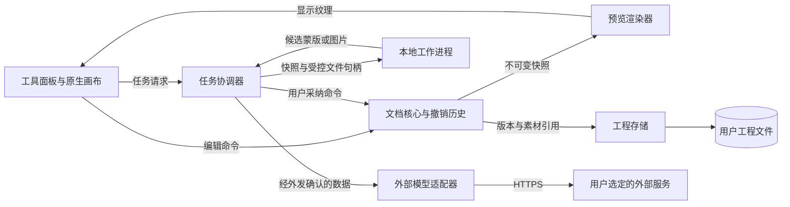
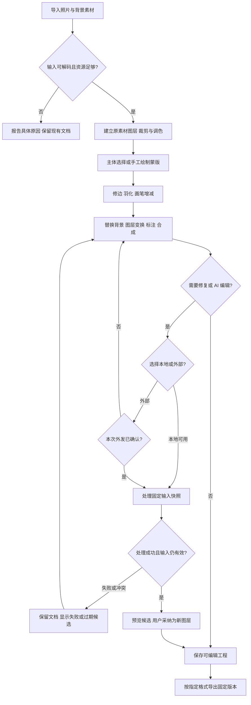

# 独立图片编辑项目 · 概要设计

状态：**V0.1 / proposed / 待评审，未实施**。2026-10-10 首稿。用户已确认完整能力范围、独立项目归属及本轮仅出方案；平台、技术栈、工程格式、模型和下文细化规则均为建议，不能据此开工。

详细合同与检查记录：[需求设计文档](需求设计文档.md)。Support lenses：`architecture-designer`，用于比较宿主、编辑核心、状态和故障边界；没有设计 SQL 数据库。

## 来源与目标

需求权威是本轮 [intake 的 AC-11 及 Q5 / Q6 / Q13](../../../../.loopx/intake/2026-10-10-media-workbench/requirements.md#AC-11)：

- “都需要。抠图、蒙版等等。”范围包括基础处理、局部修复与 AI 编辑、图层和蒙版。本方案将基础处理展开为裁剪、旋转、调色、标注，将局部处理展开为抠图、消除物体与修复，将图层和蒙版用于合成；这些能力全部保留。
- “这个部分我考虑还是单独一个项目吧。暂时可以不与 CineInsight 打通，可以是一个全新的项目。”
- “本轮可以使用一个 subagent 出该部分的方案，但是不执行，不影响主流程。”

产品目标建议为：从照片或多张素材开始，完成可反复调整的修图与合成，保存可继续编辑的工程，再导出普通图片。裁剪小图、复杂人物抠图与多层 AI 合成都使用同一个文档模型；不能用只有滤镜和扁平画布的轻量编辑器代表交付完成。

用户尚未裁定用途偏重摄影后期、海报合成还是日常配图；因此本方案保留通用的栅格编辑主干，不预设商用印前、数字绘画或 Photoshop 完全兼容的承诺。相关能力深度列在[待决表](#open-decisions)，未裁定不等于非目标。CineInsight 的“场景检索本地优先、外部可选”裁定属于另一个功能，**不构成本项目外发图片或采用某种 AI 模式的授权**。

## 项目与平台

**D-IE01 · Behavior / Operational Contract · proposed**：AC-11 已确认独立项目；建议首个宿主为 Apple Silicon 上的 macOS 原生文档应用，候选最低系统 macOS 14。首个版本与其他平台的关系由 Q-IE1 裁定。下游须先保留项目隔离，再依据平台裁定选择实现，不把本仓库 Wails 技术栈自动继承成新项目合同。

| 路线 | 对完整编辑能力的适配 | 主要代价与成立条件 |
|---|---|---|
| **建议：原生 macOS**，Swift + SwiftUI / AppKit，Core Image + Metal | 原生文件与窗口交互；能直接接色彩管理、系统图像编解码、Vision / Core ML；画布与工具面板各用适合的 UI 技术 | 需维护 Swift、渲染与图像算法；跨平台时重做宿主和部分渲染；系统 API 不提供现成工程、图层和历史 |
| Wails / Tauri 等桌面 Web 宿主 + 原生编辑核心 | 可以沿用团队熟悉的 Web 界面方式，文件与后台任务仍放本地 | 一个复杂画布跨 WebView、宿主、GPU 三层；大像素不能逐帧经 JSON / base64 桥接；若仍选原生渲染，双 UI 技术减少不了核心开发量 |
| 纯网页，CanvasKit / WebGPU + Worker | 分发方便，可做完整编辑；适合跨设备访问优先且接受浏览器资源限制的目标 | 需单独处理编解码、ICC、大图分块、持久保存与浏览器差异；OPFS 不是用户可直接管理的工程文件，浏览器存储可能被清理；本地重模型适配和数据外发策略仍需设计 |
| 基于成熟开源编辑器做独立发行版 | 可复用已有图层、蒙版、画笔、工程和成熟工具；最快覆盖较广编辑深度的可信候选 | 如采用 GIMP，需接受其产品结构、GTK 与 GPLv3+ 分发约束，并承担长期合并上游的成本；这应是明确选择的发行版路线，不能当作可随意嵌入的闭源 SDK |

判断依据：当前 [AI-CONTEXT.md](../../../../AI-CONTEXT.md) 记录了用户的 Mac 桌面工作流，但未声明新项目平台；原生优先是据此作出的建议。Apple 的 [Core Image](https://developer.apple.com/documentation/coreimage) 提供滤镜组合；[Vision 主体提取](https://developer.apple.com/videos/play/wwdc2023/10176/) 可把蒙版接到合成流程。网页方面，[CanvasKit](https://docs.skia.org/docs/user/modules/canvaskit/) 是 Skia 的 WebAssembly 图形接口，[WebGPU 规范](https://www.w3.org/TR/webgpu/) 要求查询设备限制，不能假定单张纹理可容纳任意大图。[WebKit 存储策略](https://webkit.org/blog/14403/updates-to-storage-policy/) 说明配额与回收条件。[GIMP 官方 FAQ](https://www.gimp.org/docs/userfaq.html) 说明其 GPLv3+ 许可和修改发行要求。

不建议同时建设桌面版、网页版和云服务。平台确定后只落一个宿主；可迁移的数据格式和独立核心接口是可维护性的必要边界，不是提前做通用插件平台的理由。

## 最小架构与所有权

**D-IE02 · Data / Interface Contract · proposed**：AC-11 的全部工具共用一个文档核心和一个渲染器；工程是唯一编辑事实来源，缩略图、预览和缓存均为可重建结果。只有文档核心可以提交图层变更。AI、解码和导出工作进程只接受快照并返回结果，不能直接修改工程。下游不得另建 AI 专用工程、数据库或第二套图层状态。

下图为建议的 macOS 部署和依赖，箭头表示调用或数据传递；主应用持有编辑状态，工作进程隔离编解码与模型任务。网络出口仅存在于显式启用后的外部模型适配器。

| 模块 | 持有的状态与责任 | 失败边界 |
|---|---|---|
| 应用宿主 | 文档窗口、快捷键、文件授权、可访问性、设置 | 关闭窗口先处理未保存状态；不在 UI 主线程做解码、渲染等待或推理 |
| 文档核心 | 图层树、蒙版、参数、素材引用、单调修订号、命令与撤销 | 唯一写者；非法命令整条拒绝；渲染、AI 失败不提交半条编辑 |
| 工程存储 | 原素材副本、不可变资源、已保存版本、恢复草稿 | 保存失败保留上一个完整工程及未保存状态；缓存清理不得删除素材和恢复内容 |
| 渲染器 | 从文档快照派生的图、可见瓦片、颜色变换 | 预览可取消旧请求；导出固定快照；算法和混合顺序两端相同 |
| 任务协调器 | 本次任务、输入修订号、取消和候选生命周期 | 迟到结果不能覆盖用户新编辑；任务失败不会破坏工程 |
| 本地工作进程 | 有限输入、临时产物、模型内存 | 解码、导出和 AI 共用受控的长任务基础；按任务类型分开的有界执行槽避免推理堵住交互。不运行远程下载的脚本 |
| 外部适配器 | 选定服务配置和短期请求状态 | 只接本次确认的导出快照；不读取工程目录、隐藏图层或 Keychain 外的凭证 |

工作进程建议使用 App 内签名 XPC service，首个实现可只有一个服务可执行文件与清楚的任务类型，不需要守护进程、HTTP 本机服务、账号、业务数据库或微服务。Apple 的 [XPC 文档](https://developer.apple.com/library/archive/documentation/MacOSX/Conceptual/BPSystemStartup/Chapters/CreatingXPCServices.html) 支持这种应用内分进程边界；是否使用一个还是多个进程须由峰值内存与取消实验决定，不能仅因画了方框就新增常驻进程。

现有仓库最近的能力是 [ImageService](../../../../services/image_service.go) 的扫描/查询/回收站、[图片 App 入口](../../../../app_image.go) 和 [ImageSourceDialog](../../../../frontend/src/components/ImageSourceDialog.vue) 的预览。它们以片库媒体 ID 和本项目生命周期为前提，不是文档编辑核心。本方案只借鉴“原文件保护、受控资源、后台取消”的经验；不复制 CineInsight 数据库、账户、模型安装目录或媒体路径，不新增两项目协议。

## 用户如何完成一次编辑

建议工作区为中央画布，左侧工具，右侧图层/蒙版/参数，顶部文档与保存/导出，底部短暂任务状态。无需进入另一个页面才能从抠图切回蒙版笔刷。图层与蒙版必须能明确区分当前编辑目标；局部操作显示选区叠加，导出前显示实际尺寸、背景、色彩与元数据规则。

本流程展示抠图合成的关键分支。手工工具和 AI 的差异只在产生蒙版或像素的方式，结果都回到同一个文档。

主体分割只是蒙版初稿，不能把“自动找到主体”当作头发、玻璃、半透明织物均已合格。工具必须允许放大检查、前景/背景增减、边缘羽化、收缩/扩张与颜色去边。物体消除保留原图，生成新的修复层；文字和形状保持独立可编辑层。AI 生成也不自动覆盖底图或立即导出。

## 编辑核心的几项取舍

**非破坏编辑。** 保留不可变原素材；裁剪、变换、调色、蒙版和文字存参数；画笔、克隆修复和生成结果存新瓦片或新图层。非破坏不等于所有历史都能无限参数化，也不等于必须保存无限次操作。工程和导出是两种产品：工程保留编辑语义，PNG/JPEG/TIFF 是某个修订的渲染结果。详见 [D-IE03](需求设计文档.md#D-IE03)、[D-IE04](需求设计文档.md#D-IE04)。

**工程容器。** 建议自包含的目录包，素材按摘要引用，原图复制一份进入工程；保存提交小的根清单，不反复重压整个工程。代价是磁盘占用以及分享时需要打包。直接复用 OpenRaster 可以交换栅格图层，但它不能成为未经验证的全部语义容器；[OpenRaster 规范](https://www.openraster.org/) 的扩展兼容性须逐项评估，PSD 也不能先承诺无损往返。工程不依赖模型仍在磁盘上才能打开已经采纳的 AI 图层。

**一致渲染。** 交互使用缩放预览与可见瓦片，导出使用完整分辨率的同一图层算法；掩码只代表覆盖率，不参与颜色转换。ICC、EXIF 方向、线性色彩和透明边缘是基础设计，不留到“支持大图”时再补。大图成本由像素、层、滤镜中间面和推理工作集共同决定，不能按压缩后的 JPEG 大小估内存。详见 [D-IE07](需求设计文档.md#D-IE07)。

**AI 本地与外部。** 建议主体分割及传统编辑可以离线，重生成支持按用户裁定选本地或外部。此建议仍待 Q-IE2；本地不可用时不自动外发，外部失败也不自动改模型重试。完整 AI 编辑所需的局部重绘、提示词编辑、背景生成与扩图必须都有明确能力项和验收，不能拿文字生成一张新图替代。详见 [D-IE05](需求设计文档.md#D-IE05)。

## 编辑核心和模型候选

以下是 2026-10-10 从官方资料核实的候选，尚未下载、转换、运行或审定分发。许可名称是来源事实；能否用于本产品还取决于用户的发行方式、确切版本、权重、依赖和素材许可。

| 候选 | 可承担的能力 / 已核实事实 | 维护与选择意见 |
|---|---|---|
| Apple Core Image / Metal / Image I/O | 系统图像处理、GPU 渲染与编解码；[Image I/O 文档](https://developer.apple.com/library/archive/documentation/GraphicsImaging/Conceptual/ImageIOGuide/imageio_basics/ikpg_basics.html) 要求运行时查询输入和输出类型 | 原生路线优先。系统更新也可能影响解码、滤镜或颜色，需要固定回归样图；它们不是开源编辑器授权包 |
| Skia / CanvasKit | 图形绘制核心；[Skia LICENSE](https://raw.githubusercontent.com/google/skia/main/LICENSE) 为三条款 BSD 许可 | 跨平台路线可信，仍需自行写图层/历史/文件格式，并审计所构建的第三方组件。原生路线暂不叠加第二个主要渲染器 |
| libvips | 官方为 [LGPL-2.1-or-later、按需图像处理库](https://www.libvips.org/)，有多种格式和色彩操作 | 适合大图导入/导出候选，不是完整交互编辑核心；只有系统编解码无法满足获批大图规格时再评估，引入它要承担打包和依赖维护 |
| GIMP 衍生发行 | 成熟完整编辑器，GPLv3+；已有非破坏滤镜 | 如果优先广泛专业功能且接受开源衍生发行，值得选为主路线；不同时自建一套编辑核心再把整个 GIMP 嵌进去 |
| Apple Vision 主体分割 | 官方演示生成软蒙版与选定主体；蒙版可接 Core Image | 原生路线的首个抠图候选，零独立权重分发；需要实测复杂边缘和目标系统。不是任意对象提示词编辑模型 |
| SAM 2.1 | [官方仓库](https://github.com/facebookresearch/sam2) 将模型权重、训练和演示代码列为 Apache-2.0，另有第三方组件许可；可作点/框提示分割 | 跨平台或系统分割不满足时的候选。官方安装涉及 PyTorch/CUDA；不能据其 A100 成绩声称 M4 可用。Core ML 转换、后处理和端侧质量需单独验证 |
| LaMa | [作者仓库](https://github.com/advimman/lama) 的图像修复实现；[代码 LICENSE](https://raw.githubusercontent.com/advimman/lama/main/LICENSE) 为 Apache-2.0 | 用于内容修复候选。仓库明示旧权重下载链接失效，原示例依赖较旧；权重来源、许可适用范围、Mac 转换和稳定分发尚待核实，不直接打包第三方转换产物 |
| Apple Core ML Stable Diffusion + 经核实权重 | [Apple 仓库](https://github.com/apple-aiml-research/ml-stable-diffusion) 提供 MIT 代码、模型转换与 Swift 推理接口；[SDXL 模型卡](https://huggingface.co/stabilityai/stable-diffusion-xl-base-1.0) 和[权重许可](https://huggingface.co/stabilityai/stable-diffusion-xl-base-1.0/blob/main/LICENSE.md) 使用 CreativeML Open RAIL++-M | 本地生成可行性的候选依据，不等于已经覆盖精确局部修复和指令编辑。代码 MIT 不会把权重变为 MIT；需验证编辑能力、模型输出边界、资源占用和许可条款 |
| 外部图片编辑 API | 本轮未选服务商，也未核实任何一家的具体留存、价格或地域条款 | 用一个窄适配器接获批服务，不以“OpenAI 兼容”假定图片编辑、蒙版、输出尺寸与计费语义相同。选定后再依据该服务官方合同定稿 |

推荐的最小自研路线是“原生文档核心 + 系统渲染 + 一个本地推理运行方式 + 至多一个首发外部适配器”。模型下载、校验、版本回滚由应用自己的受控模型管理负责；是否允许下载以及下载体积必须对用户可见。不能为了接几个模型默认向最终用户机器安装 Python、Homebrew 或一整套训练环境。

## 能力交付关系

以下分层用于看清依赖和评审风险，**不是实施计划，也未获准把后三层延期或删除**。完整交付仍包含 AC-11 的全部能力；各层达到什么质量后对用户发布，须另行裁定。

| 能力层 | 完成后可独立验证的结果 | 依赖 |
|---|---|---|
| 文档与基础编辑 | 原图导入、裁剪旋转、调色标注、撤销、重开工程、准确导出 | 保存与渲染合同首先成立 |
| 图层与蒙版合成 | 多素材、组、图层变换、局部调色、手工蒙版、透明导出 | 完整文档模型从开始就容纳这些能力，不先做扁平结构再推翻 |
| 抠图与修复 | 自动主体初稿、可手工修边、克隆/修复、物体消除结果可调整 | 蒙版/画笔/候选层与获批的本地修复模型 |
| AI 编辑 | 局部重绘、自然语言调整、换背景与扩图；本地/外部按裁定提供 | 输入快照、候选审阅、外发边界、模型能力验收 |

## 待决问题与影响

这些问题由主代理统一汇总；本轮文档继续完成，不阻塞 CineInsight。没有用户答复的建议不能当作批准。

| 问题 | 建议起点与候选选择 | 哪部分依赖裁定 |
|---|---|---|
| Q-IE1 平台与发行目标 | 建议 Apple Silicon / macOS 14+ 首个版本；或要求 Intel Mac、Windows、浏览器也同版可用 | 宿主、渲染核心、系统抠图可用性、签名与打包 |
| Q-IE2 AI 数据与离线要求 | 是“所有 AI 均须离线”，还是“本地常用能力 + 显式外部高级编辑”？外部是否只允许自己的 API Key / 私有服务？ | 模型选择、下载量、网络权限、费用与留存。尚未授权任何图片外发 |
| Q-IE3 主要素材与专业格式 | 请确定 JPEG/PNG/HEIC/WebP/TIFF 之外，是否必须 RAW 显影、PSD 可编辑往返、CMYK/印刷、HDR、动画/多页；这些不能只用扩展名“能打开”验收 | 色彩工作流、工具深度、工程交换和额外编解码依赖 |
| Q-IE4 真实工作负载与设备 | 建议以常用 Mac 的内存、最大照片/合成尺寸和典型图层数定目标；是否需要压感笔/绘图板 | 资源预算、交互和导出目标；本稿的 24 MP / 100 MP 样例仅供容量分析 |
| Q-IE5 使用与分发方式 | 仅个人自用，还是要向他人分发/商业发行；是否接受 GPL 衍生发行？ | 自研与 GIMP 路线选择，模型/字体/编解码分发许可审定 |
| Q-IE6 工程与隐私偏好 | 建议原图不覆盖、显式保存工程+自动恢复草稿；分享工程是否保留历史和 AI 提示词，是否默认清理 EXIF/GPS？ | 历史/恢复保留策略和分享导出的数据合同；可继续细化机制，不先执行清理 |
| Q-IE7 AI 效果的验收深度 | 建议用用户真实的人物、头发、透明物、物品和复杂背景建立样例；自然语言编辑是否要求严格保持人物身份/文字/未选区域？ | 模型可行性和质量标准。局部未选区域像素保护已作为技术建议，不能承诺模型天然遵守 |

交付风险集中在专业兼容深度、模型质量与维护、工程可靠保存和颜色/大图性能；没有证据支持具体人日或“实时 AI”的承诺。源码与资料核查、场景推演、链接检查以及 Mermaid 呈现限制见[验证与交接](需求设计文档.md#verification)。文档完成不表示设计获批，也不表示已有可运行产品。
