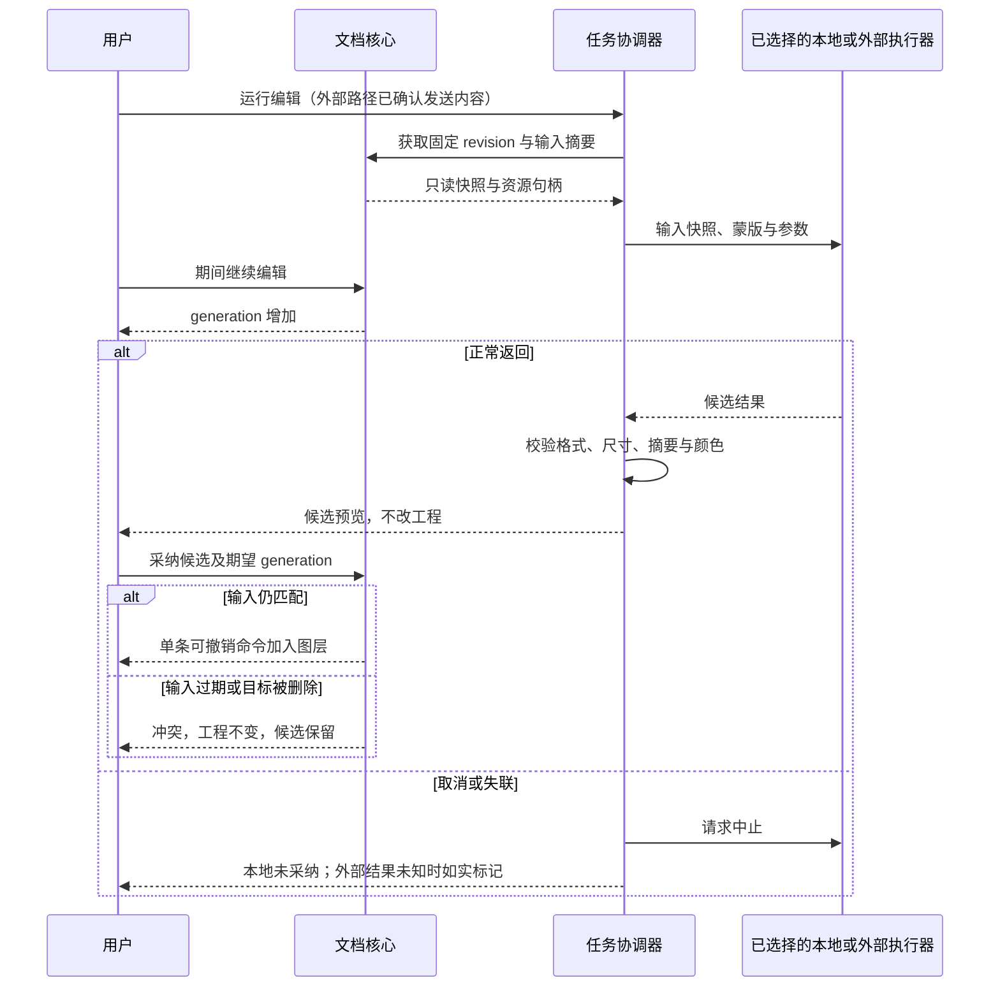

# 独立图片编辑项目 · 需求设计文档

状态：**V0.1 / proposed / 未实施**。2026-10-10 首稿。本稿细化[概要设计](概要设计.md)推荐的原生 Mac 路线；具体栈、默认值、限额和合同均须随独立项目裁定收敛。已确认的需求只有 [AC-11、Q5 / Q6 / Q13](../../../../.loopx/intake/2026-10-10-media-workbench/requirements.md#AC-11) 及[来源原话](概要设计.md#sources)。本轮不创建应用项目、安装运行时、下载模型、调用图片 API 或集成 CineInsight。

## 能力与可观察结果

表中“建议验收”是对已确认能力的可评审展开，不声称用户已批准具体工具集合或性能值。全部能力属于目标范围，不能把只做完其中一行称为完整交付。

| 能力 | 建议的工具与结果 | 关键失败或边界 |
|---|---|---|
| 裁剪、旋转、几何 | 自由/比例裁剪、90°/任意角旋转、翻转、缩放；裁剪保留画布外内容，可再次展开 | 零尺寸、非有限数、不可逆矩阵拒绝；重开工程仍能改裁剪 |
| 调色 | 曝光、白平衡、对比度、高光/阴影、饱和度、曲线；全图或蒙版限定，参数可回改 | 不是反复编码 JPEG；渐变和透明边缘无明显断阶/色边，色彩验收见 D-IE07 |
| 标注 | 独立文字、箭头、矩形/椭圆、路径与自由笔画；颜色、线宽、位置可调整 | 中文输入法和缺字体有明确结果；不静默把未批准的字体替代写进工程 |
| 抠图 | 自动主体、点/框/套索选择、手工蒙版笔刷；羽化、收缩/扩张、边缘修整、颜色去边 | 未找到主体不是空透明“成功”；头发、毛发、玻璃需要专项样图，不用简单白底代替 |
| 消除与局部修复 | 克隆取样、修复笔刷、蒙版内内容修复；删除物体后能比较候选、重新画蒙版或撤销 | 保留原始像素；跨边界/重复纹理/大遮挡须人工判断；生成失败不污染文档 |
| AI 编辑 | 带提示词的局部重绘与整图调整、背景替换、扩图；候选比较与采纳 | 本地/外部能力不能互相冒充；未选区域通过合成限制，不能仅信任模型的蒙版参数 |
| 图层、蒙版、合成 | 栅格、文字/矢量、调整层、组；排序、可见、锁定、透明度、混合；灰度蒙版、矢量蒙版、剪贴蒙版；多素材合成 | 变换后的蒙版坐标、组隔离与混合顺序有唯一定义；图层删除可撤销 |
| 工程、历史、导入导出 | 保存可编辑工程，恢复草稿，撤销/重做，另存，指定格式导出 | 导出不是保存工程；原素材、已保存工程、恢复草稿、缓存分开管理 |

布局与总体业务流程由[概要设计的核心流程](概要设计.md#D-IE02)拥有。工具采用统一“预览 → 提交一条命令 / 取消”的手势事务；一次拖拽或一笔画对应一次撤销，不按鼠标事件生成数百条历史。

<a id="D-IE03"></a>
## 文档与工程格式

**D-IE03 · Data Contract · proposed，源 AC-11**：一个工程自包含原素材、文档语义与已采纳的像素资源；派生缓存不承担唯一数据。建议使用目录包，暂用 `.improj` 表示候选扩展名，产品名和正式 UTI 尚未确定。下游在格式批准前只可做格式验证实验，不能向用户发布长期兼容承诺。

建议结构如下。路径是新项目格式提案，不是本仓库将新增的运行目录。

```text
<name>.improj/
  head.json                   # 唯一已保存根，指向一个完整 revision
  revisions/<revision>.json   # 不可变文档快照与可保留历史引用
  objects/<sha256>            # 原素材、像素瓦片、蒙版、ICC、已采纳 AI 结果
  previews/<revision>.png     # 可删的查看预览，不用于重新生成文档
```

运行中尚未显式保存的版本、临时任务和渲染缓存放在应用自己的 Application Support / Caches 中，按项目 ID、会话 ID 隔离；无标题文档也有恢复 ID。工程复制到另一台符合支持范围的机器后无需原素材路径或模型即可打开、重新合成已采纳内容。使用目录包的依据是 Apple [FileWrappers 文档](https://developer.apple.com/library/archive/documentation/FileManagement/Conceptual/FileSystemProgrammingGuide/FileWrappers/FileWrappers.html)；实际保存协议仍须满足 D-IE06，不能只因使用该 API 就宣称已验证断电安全。

| 实体及基数 | 必要字段 / 语义 | 约束 |
|---|---|---|
| Project 1 → N Revision | `project_id` 随机稳定 ID；`schema_version`、`required_features`、`head_revision`、标题 | 标题不是文件路径；新建工程不同 ID，另存副本产生新 ID 并可记来源；不会包含 CineInsight 媒体 ID |
| Revision 1 → N Layer / Asset 引用 | 不复用的 `revision_id`，`generation`，画布大小/裁剪、工作色彩、图层树、历史游标、渲染语义版本 | `generation` 只增加；撤销产生新修订，不把版本号改回旧值；图层引用的资源全部可验证 |
| Layer 0..1 → parent Group | `layer_id`、`kind`、父 ID、有序子 ID、可见/锁定/透明度、混合模式、变换、内容/滤镜引用 | 树无环、ID 唯一、每层单父；空组允许；同名层允许，操作按 ID |
| Layer 0..1 → RasterMask / VectorMask / ClipBase | 各自 ID、启用、反相、密度、羽化、坐标变换/链接状态 | 精确组合和顺序由 D-IE04 拥有；蒙版资源不能靠预览图重建 |
| Asset N → 1 Object | `asset_id`、内容摘要、媒体类型、尺寸/帧数、方向、ICC 引用、解码语义版本 | 素材导入成功后不可变；原字节与方向元数据保留，复制中断不插入图层 |
| Raster / Mask 1 → N Tile | 瓦片坐标、尺寸、样本格式、对象摘要、边缘有效区域 | 相同对象可复用；先写新瓦片，再换引用，不能原地改被历史引用的瓦片 |
| Operation / Candidate → 输入 Revision | 操作种类、输入图层/蒙版、参数、输入快照摘要、结果对象 | AI 模型 ID/版本可作本地来源信息；凭证、远端鉴权链接不得入工程 |

`head.json` 只保存根字段与所指 revision 的摘要；大图、蒙版和提示词不塞进一个巨型 JSON。像素瓦片建议按 512×512 的版本化二进制容器保存，头部声明长宽、通道、字节序和样本类型，主体为无损数据；默认 RGBA16F，蒙版单通道 16 位覆盖率。压缩库及最终容器编码属于格式试验待定项，不能把尚无解析器的描述当作兼容标准。原图字节保持导入格式，瓦片是有版本的编辑结果或派生解码数据，引用必须区分二者。

导入先将授权文件复制到本地候选资源，核对源文件复制前后的身份/大小/修改时间，再对复制后的不可变字节解码、读取元数据和计算摘要；发现源变化就拒绝该项，不能让显示尺寸来自一个版本、工程像素来自另一个版本。文件系统上不受控的并发写入仍可能造成混合字节，故不承诺任意外部写者下的源文件快照；解码与完整性校验失败同样拒绝导入。

打开工程先校验版本、必需能力、整数乘法溢出、资源数量/解压后长度、摘要和引用闭包。拒绝包内符号链接、绝对路径、`..`、重复 ID、循环引用及可执行内容。未知必需特性阻止编辑和重新保存；可展示独立预览并说明“仅预览”，不以扁平图另存覆盖工程。可忽略的扩展字段须能原样保留，否则不得声称向前兼容。格式升级只产生新副本，成功打开并校验前不替换旧格式工程。

建议不做首发“链接原文件”模式，避免离线盘或源图外改破坏可重开能力；若用户更看重磁盘空间，需要单独裁定链接、缺失重定位和打包收集的合同。PSD / OpenRaster 是交换入口/出口，不是内部主数据；支持深度未定，详见 Q-IE3。

<a id="D-IE04"></a>
## 图层、蒙版与渲染语义

**D-IE04 · Behavior Contract · proposed，源 AC-11**：所有工具写同一图层树，预览与导出共用相同计算次序；原素材不因编辑改变。下游必须用合成样图验证蒙版、变换、混合与颜色次序，而不只验证 JSON 可以序列化。

文档坐标以左上角为原点、向右为 x 正方向、向下为 y 正方向，几何单位为文档像素、坐标可以是小数；像素中心为 `n + 0.5`。平台 API 的坐标差异只在适配层转换。画布裁剪是文档输出矩形，改变它不会裁掉层资源；导出时裁切，编辑时允许查看画布外内容。

| 层/蒙版种类 | 唯一渲染规则 |
|---|---|
| 栅格层 | 原素材解码并规范方向 → 层内像素补丁 → 按序的层内调整 → 几何变换 → 蒙版/透明度 → 与下方混合。重采样直接取当前原始资源，不连续缩放已缩略预览 |
| 文字与矢量层 | 保存字符/文字属性或矢量路径；由布局结果在目标尺度栅格化后进入同一层合成。字体未嵌入时记录明确字体标识，缺失时用户选择替代或取消，不偷偷改排版 |
| 调整层 | 在所属组中读取其下方已合成结果，经参数变换后，按自己的蒙版覆盖率与原合成混合；不影响上方层或其他组 |
| 组 | 组内从底到顶合成到透明中间面，再应用组自身变换、蒙版、透明度和混合。建议首个语义固定“隔离组”；若要穿透组，必须另增明确模式，不能混用 |
| 栅格/矢量蒙版 | 白=可见、黑=隐藏；取值覆盖率 0..1。矢量蒙版栅格化成覆盖率后与栅格蒙版相乘；密度、反相、羽化各有参数。蒙版不走 ICC / gamma 转换 |
| 链接与取消链接 | 链接蒙版随层变换；取消链接时固定在文档坐标，可独立移动。切换链接本身不改变当前可见结果，需重算相对变换 |
| 剪贴蒙版 | 显式引用同一父组中位于下方的基础层的有效 alpha（该基础层应用自身蒙版和透明度后、与背景混合前）；不能引用自己、上方或另一组；基础层删除时预览受影响层，并在一个可撤销命令中解除关系 |
| 选区 | 当前文档的暂态覆盖率，限制新笔画/修复/填充/AI 输入；选区可转成持久蒙版。更改选区不自动改已经存在的层蒙版 |

建议基础混合模式包含正常、正片叠底、滤色、叠加、变暗、变亮、差值；列表是待批准的工具深度，工程以带版本的枚举存储，不通过显示名称猜算法。透明合成使用预乘 alpha，工作空间内正常 `over` 合成；需要非线性显示参考空间计算的混合模式必须显式定义转换并纳入同一渲染语义版本，不能依赖系统默认值漂移。

克隆与修复笔画记录取样快照和结果瓦片引用，重开/撤销时恢复确切结果，不重新对变化后的下层取样。调色/几何仍可回改参数；生成像素的步骤可隐藏、蒙版、替换或重新运行，不能承诺像素结果都能还原成可编辑对象。蒙版“应用到像素”和“合并图层”若提供，须创建新内容且保留本次撤销所需资源；不把它们做成默认保存动作。

## 核心内部接口

本项目尚未选公共 API；下列是模块间的类型化合同提案，不是 HTTP 服务或 CineInsight 绑定。像素以受控资源句柄传递，不经 JSON/base64 反复复制。

| 操作 | 最小请求 | 可观察结果 |
|---|---|---|
| `ImportAssets` | 文档 ID、期望 generation、系统文件授权句柄列表、已确认的帧/颜色选择 | 逐项预检供用户确认；用户确定的本次导入提交为一条命令。任一必要资源复制失败则该命令整体不提交，不悄悄少一张素材 |
| `ApplyCommand` | 文档 ID、期望 generation、操作 ID、类型化负载 | 新 generation 与受影响范围；冲突时零修改；重复操作 ID 在该会话返回已提交结果，不能生成两层 |
| `RenderPreview` | 不可变 revision、视口/缩放、请求序号、显示 profile | 纹理和质量/错误状态；旧请求结果不得替换新视口；不改变已保存状态 |
| `BeginAI` | revision、输入层范围、蒙版、操作枚举、模型/服务标识、参数、外发授权引用（若适用） | 任务 ID 与当前阶段；尚未执行不返回假进度；预检失败不创建网络副作用 |
| `AcceptCandidate` | 候选 ID、当前期望 generation | 原输入仍匹配时一条新图层/蒙版命令；不匹配返回冲突，保留候选供用户比较或重新运行 |
| `SaveProject` | revision、目标授权句柄、打开时根 token、保存意图 | `saved_revision` 或明确失败；若期间有新编辑，只标该 revision 已保存，新版本仍显示未保存 |
| `ExportImage` | revision、格式、尺寸、profile、位深、透明背景处理、元数据策略、目标授权句柄 | 保存出的版本、实际参数、目标；既不改文档也不自动清除未保存标记 |

候选通用错误包括 `invalid_input`、`unsupported_format`、`unsupported_feature`、`resource_limit`、`permission_denied`、`disk_full`、`project_conflict`、`asset_corrupt`、`model_unavailable`、`provider_failed`、`outcome_unknown`、`cancelled`。错误载荷只含 code、可操作中文信息、涉及层/任务 ID；原始系统路径、提示词和密钥不能进入日志。错误名只是本稿提案，实施时需在输入、内核、IPC、界面之间验证可达映射。

<a id="D-IE05"></a>
## AI 输入、候选与数据边界

**D-IE05 · Behavior / Operational Contract · proposed，源 AC-11**：AI 是产生候选图片或蒙版的工具，不持有工程写权限。平台与 AI 模式由 Q-IE1 / Q-IE2 裁定后才选择模型。下游不能从“需要 AI”推断有上传、本地模型下载或重试计费的权限。

每个 provider 以能力描述公开：分割 / 消除修复 / 提示词编辑 / 扩图、输入与输出尺寸/格式、蒙版规则、是否保留 alpha、颜色空间、取消支持和资源估算。未实现的能力不能通过换个按钮名称声称已支持。候选模型与许可证据由[概要候选表](概要设计.md#candidates)拥有。

| 路径 | 送入模型的数据 | 工程中的结果 |
|---|---|---|
| 本地主体分割 | 用户指定层的固定快照、点/框等选择信息 | 软蒙版候选；采纳成为可编辑蒙版，不擦掉背景像素 |
| 本地消除/修复 | 选区及必要上下文的合成快照、蒙版 | 结果贴片和位置；采纳成为独立修复层 |
| 本地生成/指令编辑 | 指定快照、提示词、蒙版/扩图范围与模型参数 | 固化结果像素和来源摘要；再次打开不重新推理 |
| 外部编辑 | 用户确认的可见合成图或局部上下文、蒙版、提示词、必要尺寸；默认不含 EXIF/GPS、原路径、隐藏图层和工程文件 | 先存本地候选再解码校验；采纳路径与本地相同 |

裁剪上下文可能包含选区外人物或敏感内容，不能把“只修改局部”显示成“只发送蒙版内像素”。外发前明确展示实际发送图、服务商/目的主机、发送内容种类与可取得的费用/数据条款；授权绑定本次输入摘要、provider 和请求参数，改变输入或 provider 后失效。若用户以后批准持久信任模式，需另定覆盖范围，不能在当前方案暗中开启。

局部操作的几何映射在任务建立时固定：文档坐标 → 上下文裁剪 → 模型尺寸；记录逆变换用于将返回图贴回。模型要求的 8 位 sRGB 输入是一次显式转换，不把工程整体转成 8 位。局部操作的最终合成只覆盖批准的软蒙版支撑区域；羽化延展在运行前可见。模型即使改动整张返回图，蒙版外的工作像素仍取原快照。扩图只在新画布区域和用户确认的边界过渡区合成。输入/输出尺寸不符、结果为空或输出无法解码均失败，不自动拉伸后称成功。

下面时序解释异步候选的提交边界。外部请求已发出后，本地取消无法证明远端停止处理或不收费；此时状态必须保留未知事实。



任务状态转换采用完整表，未列出的转换拒绝，终态不会收到迟到回调后复活。每轮运行有唯一 attempt ID，重跑创建新 attempt，不复用旧任务身份。

| 当前状态 | 事件与守卫 | 下一状态 / 效果 |
|---|---|---|
| `prepared` | 输入/预算/模型通过，外部路径授权匹配 | `running`；此时才允许推理或出网 |
| `prepared` | 校验失败或取消 | `failed` / `cancelled`；不启动执行器 |
| `running` | 有效结果完整落地 | `candidate`；不修改文档 |
| `running` | 本地明确失败 / 远端明确拒绝 | `failed`；保留原因分类，文档不变 |
| `running` | 本地取消且进程退出已确认 | `cancelled`；清理本次未采纳临时结果 |
| `running` | 外部请求后失联/取消，不能确认远端终态 | `outcome_unknown`；停止本地采纳、不自动重发；如 provider 支持查询只能查本次 request ID |
| `running` | 应用异常退出后重新启动 | 本地为 `interrupted`；已外发且未确认终态为 `outcome_unknown`；不自动再运行 |
| `candidate` | 用户采纳且输入 revision/目标/蒙版摘要一致 | `accepted`；一次文档命令，与新增图层同一提交 |
| `candidate` | 用户采纳但条件不符 | 保持 `candidate`，显示过期原因；不自动 rebase |
| `candidate` | 用户丢弃 | `discarded`；只释放无人引用的临时对象 |

候选不能在目标变化后自动贴回，也不能仅因撤销后 generation 数字相似就通过；依据不可复用 revision 和输入摘要避免 ABA。用户若要把过期候选当普通素材导入，是新的明确操作，仍保留其原输入说明。

凭证建议存 macOS Keychain，工程和诊断不包含密钥。外部 provider 只使用用户配置并验证的 HTTPS 主机，不跟随跨主机鉴权重定向；返回远端图片 URL 不能触发任意本机/内网资源获取，适配器须核对 provider 允许的 HTTPS 资源主机和每次重定向。默认不支持工程文件中的自动远端资源链接。模型包来自明确版本清单，校验签名/摘要、大小和解压边界；只加载数据权重，不允许工程附带脚本执行。

日志只记录任务 ID、模型/能力 ID、阶段、耗时、输入输出尺寸与脱敏错误。提示词、原图/蒙版、候选和模型缓存均留本地；提示词是否随工程分享由 Q-IE6 决定，建议分享副本默认去掉提示词和历史，但应显示将丢弃的可编辑信息。应用不自动上传诊断或训练数据。

<a id="D-IE06"></a>
## 保存、撤销与恢复

**D-IE06 · Data / Workflow Contract · proposed，源 AC-11**：工程保存与图片导出分别提交；原素材不覆盖。所有持久化引用只指向已完成的对象。下游须用故障注入验证“新对象完成 → 新版本完成 → 根切换”的顺序，不以单测序列化成功替代真实存储验证。

建议采用显式保存工程、自动保存恢复草稿。界面分别显示“未保存”“已保存 revision”“有恢复草稿”；自动恢复草稿不等于已保存工程，也不在重启时静默覆盖用户明确保存的版本。建议一笔/一次拖拽完成后触发草稿检查点，合并短时密集修改；时间间隔、保留量和可恢复损失窗口必须在实现测试后给出准确说明。

| 操作 / 边界 | 建议规则 |
|---|---|
| 文档写入 | 单文档一个串行执行者。预览、导出和 AI 使用不可变快照；返回的结果以期望 generation 条件提交。相同项目重复打开在同一进程复用会话 |
| 多进程 | 通过本地 OS 文件排他写句柄/协调机制拒绝第二个写者，允许只读；不做基于时钟的租约。根 token 另作冲突校验。网络盘或同步软件不保证遵守本地协调时，必须明确支持边界，不能承诺协同编辑 |
| 一次保存 | 写不可变 objects 并同步 → 写并同步 revision → 在同目录写新 head 临时文件并校验 → 在已持有写权限且原根 token 未变时原子切换 head → 同步目录并确认保存结果。任一步失败不得先删除旧根引用资源 |
| 新建与另存 | 在目标父目录建临时完整包，验证后以不覆盖方式发布；已存在同名工程要求用户选择新名或明确替换。另存成功才切换活动工程身份 |
| 保存期间继续编辑 | 保存快照 r10 时已编辑到 r11，成功只记录 r10 已保存，r11 仍 dirty；不得用“保存调用返回成功”抹掉后续编辑 |
| 崩溃或磁盘满 | head 切换前旧工程可读，孤立新对象可稍后整理；切换后响应丢失，重新打开按 head 与对象校验判定实际版本。OS/设备落盘保证不足时不能声称绝对断电无损 |
| 外部变更 | 根 token/文件身份变化时拒绝覆盖并提供重新打开或另存副本；不自动合并。任意不遵守文件协调的第三方原地改包不在无冲突保证内；检测后停止写入 |
| 撤销/重做 | 参数保存前后状态，像素保存前后瓦片引用；撤销产生新 revision。撤销后新编辑清除 redo 分支的可达入口，不能立即删仍被保存/恢复版本引用的素材 |
| 历史保留 | 建议持久保留最近 100 个提交动作，受单独的磁盘预算约束；预算到限不默默少保留，提示整理/提高预算/另存。无法容纳本次前后状态时，该编辑命令不提交，已有工程仍可保存。更早状态压成完整基线后才能回收历史资源，已保存根和恢复根仍需保留 |
| 恢复 | 启动检测完整恢复草稿并提示时间与预览，用户选择恢复为副本或丢弃；损坏草稿不覆盖已保存工程。上次未完成推理不自动再发起 |
| 清理 | 渲染缓存可删；历史/草稿/候选有不同所有权。整理只删除不被任何已保存根、保留历史、恢复根和运行任务快照引用的对象。删除工程或原文件是另一项用户动作 |

工程包内部当前只由这个应用写，不为未来多机协同引入服务器或数据库。OS 文件协调与根 token 不足以约束任意第三方写文件，故本稿不承诺“所有外部编辑绝不冲突”。云盘存储及 SMB 支持应由 Q-IE4 的真实使用方式和存储实验决定。

导出使用固定 revision，所有格式先写目标同目录临时文件，成功编码、关闭并检查后才发布；取消在发布前删除临时，不产生假成品。若发布已经成功才收到取消，返回“导出已完成”，不删成品。首次建议只提供另存导出，避免原图覆盖合同；若用户要求覆盖，须另定覆盖确认、备份与恢复策略。

<a id="D-IE07"></a>
## 导入导出、颜色与资源预算

**D-IE07 · Behavior / Operational Contract · proposed，源 AC-11**：颜色、透明度和大图规格必须可验证，预算根据解码后数据估算。所有数字是建议验证样例/初始预算，不是已达到的性能承诺。下游应在用户目标机器上测量后定支持矩阵；不自动缩小图片、减少图层、降低位深或改用外部 AI 来绕过限制。

### 格式与颜色

| 项目 | 建议合同 |
|---|---|
| 首组通用格式 | JPEG、PNG、HEIC、WebP、TIFF；分别列导入和导出能力，系统不支持某编码时明确不可用，不能把“系统能读”当作“能写”。最终首发必须支持的集合待 Q-IE3 |
| RAW / PSD / 动画 / 多页 | 都是待裁定的能力深度。RAW 显影需相机、白平衡和曝光流程；PSD 需图层/文字/滤镜的往返矩阵；动画和多页不能静默取第一帧。未支持时导入前说明，用户明确选帧才创建静态文档 |
| EXIF 方向 | 原字节保留；解码进入统一正向坐标，导出像素方向正确且 orientation=1/省略，不能像素旋转后再写旧方向标记 |
| 输入色彩 | 有效嵌入 ICC 用于输入转换；无 profile 时提示当前按 sRGB 解释并允许指定；损坏 profile 报错并让用户明确选择解释，不能静默当正确颜色 |
| 工作色彩 | 建议采用扩展线性 sRGB、RGBA16F 预乘 alpha，保留超出 0..1 的可表示颜色到输出转换阶段；原素材 ICC 仍保存。CMYK/Lab 输入若要转换须披露，原生编辑及印刷分色能力未定 |
| 预览与导出 | 预览按显示器 profile 转换，导出按用户选的 sRGB / Display P3 / 其他获支持目标 profile 转换并嵌入；输出渲染意图与位深明确。屏幕截图不作像素级颜色真值 |
| JPEG | 无 alpha，必须预览选定背景色后的扁平图；质量与尺寸明确，不使用黑背景的隐式默认 |
| PNG / TIFF | 在支持矩阵内保留 alpha、位深和 ICC；8 位与 16 位导出区分。HDR 的完整输入/编辑/输出链需另验，使用 float16 内核本身不证明 HDR 产品支持 |
| 元数据 | 建议导出默认去掉 GPS、设备序列号和可识别位置字段，可选择保留拍摄时间/版权等；工程可保留原素材元数据。最终策略待 Q-IE6，ICC 和方向处理不受隐私选项误删 |
| 字体 | 工程保留可编辑文本；嵌入字体须有分发权限，缺字体需要显式替换。不能用缓存预览既声称排版准确又声称字体可继续编辑 |

Apple [Core Image 性能/颜色文档](https://developer.apple.com/library/archive/documentation/GraphicsImaging/Conceptual/CoreImaging/ci_performance/ci_performance.html) 说明线性空间处理、复用渲染 context 与尺寸限制；本方案据此建议显式工作空间并测量设备约束，不借“关掉色彩管理”获取速度。较旧文档只用来确认机制；最低系统上的实际 API 与格式支持仍需编译和运行验证。

### 大图与交互

瓦片缓存按 `revision + 层/子图摘要 + 分辨率层级 + 坐标 + 颜色/渲染语义版本` 标识。几何和蒙版改变只使依赖区域失效；全局曲线可能使整层失效。大半径模糊/羽化需要带 halo 的输入范围，不能独立处理瓦片后留下接缝；全局统计类滤镜先做全图统计再应用结果，不冒充局部滤镜。需要全图推理的模型同样不能随意切块称作等价计算。

| 建议容量样例 | 未压缩成本（十进制像素量，内存按 MiB） | 设计影响 |
|---|---|---|
| 24 MP、RGBA16F | 每完整面约 183 MiB，单通道 16 位蒙版约 46 MiB | 20 层全展开约 3.58 GiB，尚不含滤镜、解码、历史、显示纹理和模型；不能每层各存一张全尺寸内存图 |
| 100 MP、RGBA16F | 每完整面约 763 MiB | 作为大图压力样例；导入/编码器若整图展开，瓦片渲染本身不能解决峰值内存 |
| 512×512 RGBA16F 瓦片 | 每块 2 MiB；同尺寸蒙版约 0.5 MiB | 可见瓦片、临时滤镜面与在飞渲染统一计入预算，不以 CPU/GPU 名义把 Apple 统一内存重复分配 |

建议用 16 GiB Apple Silicon Mac、24 MP / 20 层常用工程作为起始测量档，100 MP / 多蒙版作为压力档；这只是待 Q-IE4 确认的样例。交互预览目标可先设拖拽反馈 p95 ≤50 ms、显示完整视口细节 ≤300 ms，再以真实图层/滤镜场景实测，不能拿空白画布帧率验收复杂工程。导出记录时间、峰值内存、磁盘占用与产物一致性，暂不编造速度 SLA。

建议初始交互瓦片和中间面软预算 2 GiB，推理单槽且加载模型前按测得峰值和系统余量准入；模型不能承诺使用某个固定显存值，因为 Mac 为统一内存。释放可重建缓存仍不足时返回 `resource_limit`，原工程继续可保存；用户可明确减小本次处理区域或选择更小模型，应用不自动改变结果规格。本地长任务按类型有界执行，交互优先；同一时刻仅一个重 AI 任务。

项目素材、历史、恢复草稿、渲染缓存、模型分别展示磁盘占用。导入预检同时看压缩文件大小、解码像素量和编码器峰值；保存/导出预留新对象、临时输出及保留旧版本的空间。预检后仍可能遇到磁盘满，失败保护由 D-IE06 承担。所有文件读取、IPC 大小和模型返回都有限额且在分配前检查溢出；实际限额由格式/设备试验定稿。

大图支持必须验证解码、重采样、滤镜、推理和编码整条链。Image I/O 无法在批准的最大规格下满足内存预算时，应明确评估流式编码/解码库（概要中的 libvips 等）或调整获批支持规格；不能先声称支持任意大图，再用静默降采样掩盖缺口。

<a id="verification"></a>
## 验证与交接

### Verification Strategy

源 AC-11 没有独立图片编辑的 `TC-*` 编号。本节使用具体场景保留覆盖，不替主 intake 伪造已批准验收。下表的“推演”是**文档检查**；所有系统自动化、真机、模型质量和故障实验均待未来实施授权后执行。

| 源能力 / 场景 | 对应合同 | 本次文档推演结果 | 后续实际证据 |
|---|---|---|---|
| 基础编辑：带 EXIF 方向的照片旋转裁剪调色后重开 | D-IE03/04/07 | 原字节、方向转换和裁剪参数有不同归属；重开仍可展开裁剪；导出不重复旋转 | 已知方向/ICC/透明度夹具，保存重开与参考渲染比较 |
| 图层蒙版：两张素材、发丝抠图、替换背景、文字标注 | D-IE02/04 | 主体生成蒙版，经手工修边后仍在同一图层系统；标注不烘焙到原图 | 用户样片在黑/白/彩色背景与 100% 缩放检查边缘；矩阵变换、组与蒙版合成黄金图 |
| 抠图失败、空蒙版、1 像素选区和全画布蒙版 | D-IE04/05 | 自动无主体明确失败；用户画空选区执行修复被拒绝；非空极小选区按 provider 最小尺寸预检；不凭补齐后的上下文扩大最终写区 | 验证最小/最大坐标、插值/halo、反相与不可见区域 |
| 局部消除：任务期间用户移动目标层，随后采纳 | D-IE05/06 | revision/输入摘要不再匹配，拒绝提交，保留候选；无迟到覆盖 | 延迟/取消/重复回调测试，候选采纳前后对象引用检查 |
| 外部 AI 请求后断网或取消 | D-IE05 | 本地文档不变，任务 outcome_unknown；不能声称不收费，也不自动重发 | 用可控假服务记录精确上传字段、跳转、超时和取消；真实 provider 合同验收 |
| 保存 10 个图层后再编辑，导出期间新增第 11 层 | D-IE03/06 | 固定导出 revision 不受后续编辑影响；保存状态只覆盖已保存版本 | 并发编辑/导出/保存测试，产物对应明确 revision |
| 保存新素材时磁盘满，及 head 发布前后崩溃 | D-IE06 | 根未切换时旧工程完整；已切换后按真实根核对；草稿不会自动覆盖工程 | 各写入/同步/替换位置故障注入与重启检查；本地盘与获批外置盘真机 |
| 导入 5 张素材，第 3 张不可读 | D-IE03/接口 | 预检指出该项；用户未重新确认新集合时不提交部分图层；零项请求拒绝而非假成功 | 批次原子提交、取消、路径/权限/源变动实验 |
| 撤销、重做、撤销后新编辑，关闭后重开 | D-IE06 | 不复用 revision；分支资源只有全部根都不引用才可清；保留范围待裁定 | 引用图、历史游标、模型不在时重开、对象清理失效注入 |
| 大图加多层、羽化和曲线 | D-IE04/07 | 瓦片边界需 halo，全局统计单独计算；所有内存含中间面，不能只测 JPEG 字节数 | 目标 Mac 的峰值、交互 p50/p95、导出全分辨率与瓦片接缝图 |
| 分享工程、坏工程、恶意资源路径 | D-IE03/05/06 | 自包含资源；字体/提示词/历史共享策略未定；路径越界/脚本/摘要错误拒绝 | 工程解析 fuzz/边界测试、文件授权、最小网络权限和日志审查 |

**本次已执行的语义自查：** 对上述正常、失败、取消、异步竞争、部分批次和资源压力场景逐项走读；检查了唯一文档写者、不可变快照、候选采纳、根发布、旧工程保留与缓存清理的边界。已明确“工作空间是浮点”不等于“已支持 HDR”，“提供模型代码”不等于“允许分发全部权重”，“按需渲染”不等于“编解码全链路低内存”。未发现必须缩减 AC-11 才能成立的方案冲突；平台、专业格式、数据外发和质量目标仍依赖待决裁定。

**本次实际证据：** 已读取主 intake、AI-CONTEXT、现有图片服务/App 入口与预览组件职责；核查概要所引的 Apple、WebKit、W3C、Skia、GIMP、libvips、OpenRaster、SAM 2、LaMa 与 SDXL 官方来源。来源访问不构成运行测试；Apple 当前 Image I/O 动态文档未提供可读正文，引用改用官方归档的机制说明，不凭它宣称 2026 年各格式支持已测。许可核查只覆盖列出的来源及候选，不是完整依赖/权重审定。

**呈现检查：** 已用本地只读检查脚本核对 25 个相对链接/锚点目标、11 个显式锚点（含 D-IE01 至 D-IE07）、代码围栏平衡，全部通过。两份新文档的 whitespace diff 检查无问题。本机未发现 `mmdc`，可用工具也没有 Mermaid 渲染入口，本轮未安装工具；3 张 Mermaid 图仅做了节点、分支、时序和正文一致性走读，**未渲染，也未完成视觉布局检查**。19 处外部引用所指的一手资料已在资料核查阶段访问；没有把来源链接存在当作模型可运行的证据。

本轮没有新项目代码，故不运行 CineInsight 业务测试，不以已有项目测试通过证明新编辑器可用。没有执行外部 AI 请求、图片上传、模型下载、安装、提交或发布。最终改动检查仅覆盖本目录新增的两份 Markdown；仓库内其余代码、intake 和设计变更属于主任务，未修改或回退。

### Design Contract Index

全部设计锚点来自 AC-11；已确认范围与具体 proposed 规则分别在来源及各锚点中标明。

| 锚点 | 唯一规则归属 | 下游检查重点 |
|---|---|---|
| [D-IE01](概要设计.md#D-IE01) | 项目隔离与平台提案 | 不把 Mac 建议当作已裁定，不连接 CineInsight |
| [D-IE02](概要设计.md#D-IE02) | 状态、模块和进程边界 | 一个文档事实来源；AI 无工程写权 |
| [D-IE03](#D-IE03) | 自包含工程及数据关系 | 完整资源闭包、版本、不可变对象与解析边界 |
| [D-IE04](#D-IE04) | 图层、蒙版与渲染次序 | 所有工具一致、预览导出一致、可撤销结果 |
| [D-IE05](#D-IE05) | AI 候选与内外部数据合同 | 明确授权、输入固定、冲突拒绝、未知远端结果 |
| [D-IE06](#D-IE06) | 保存、历史、恢复与导出提交 | 唯一写者、版本冲突、旧版本保护、引用清理 |
| [D-IE07](#D-IE07) | 格式、颜色、资源与验证规格 | 实测支持矩阵，不能静默降规格 |

### Planning Handoff

可继续评审的材料已形成，不存在应用工程或实现切片。用户已确定的三点保持固定：完整图片编辑能力、独立项目、当前轮只设计。待决问题唯一维护于[概要 Q-IE1 至 Q-IE7](概要设计.md#open-decisions)，由主代理统一询问；它们不会阻塞 CineInsight 的主任务。

平台、AI 权限、格式深度与分发方式会改变架构，相关代码不得在裁定前实施。瓦片大小、内部类型名称等可以在获批边界内通过实验选择；实验仍需要新的实施授权，本轮不执行。任何后续计划和实现应重读原始 AC-11，而不是只按本稿 D 编号交付。设计自查与交付不代表用户接受，也未进行独立外部评审。
