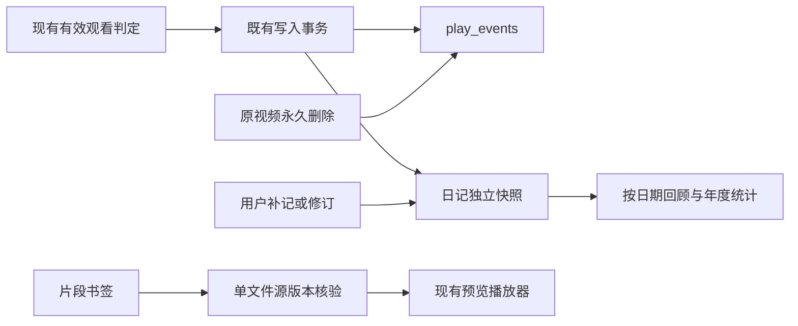

# 片段书签、观影日记与年度回顾

2026-10-10，Ready（独立合同评审已闭合）；对应AC-04/AC-09、TC-13/TC-19。用户Q17–Q19已裁定：逐次观看独立记录、原片永久删除后保留笔记与日记、支持手填片库外片名。不得再按视频级联删除这些用户记录。

## 责任与既有行为

新增BookmarkService与ViewingDiaryService，分别拥有书签和日记记录；仍使用当前SQLite/PostgreSQL数据库、既有维护围栏与备份/迁移。它们不拥有媒体文件，不改文件内容、播放计数、随机排序或已看同步。VideoService、手机端与Jellyfin继续裁定何时产生有效观看。

书签/日记引用视频ID作为逻辑关联，不设删除级联外键；标题、时间与用户正文独立存储。原片软删、永久删除或不可用时，记录仍可阅读与编辑，播放入口显示原片不可用；不自动关联同名新文件。新媒体重新导入产生新ID，不把旧笔记偷偷转移过去。

主导航新增“观看笔记”入口，包含片段书签、观影日记与单列的播放记录。原按上映年份组织的“观影记录”、洞察页和榜单保留原有口径。视频详情也可直接添加/查看本视频书签，两处共用书签面板。

## 书签数据与操作

`video_bookmarks`：ID、VideoID（逻辑引用）、VideoTitle（保存时标题快照）、StartMS、EndMS（NULL表示时间点）、Title、Note、TagsJSON、SourceSize、SourceModTimeNS、Revision、CreatedAt、UpdatedAt。

- 时间为整数毫秒，0合法；上限为JS安全整数范围。区间为[start,end)，end必须大于start。已确认且与当前源一致的技术元数据有时长时，不接受越界位置；未知时长不伪造上限。
- 标题≤200 rune、备注≤10,000 rune；片段标签最多20个、每个≤40 rune，去首尾空白、去重、保持显示文字。它们仅组织书签，不给整部视频打标，不建第二套全局标签注册表。TagsJSON是可迁移的JSON字符串，写入统一校验。
- 新建必须有活跃媒体记录与可读普通文件。GetPreviewSession在已有stat检查后新增source_version，摘要绑定videoID与源文件size/mtimeNS（代理预览也绑定原片），不可用会话没有token。编辑器在打开时固定捕获该预览token，不随之后的后台会话刷新替换；新建请求必须提交source_token。服务在既有路径读锁下重新stat并比对token，一致才保存，编辑期间换源返回source_changed，不把旧位置认领给新源。沿用现有帧哈希/代理的源版本口径；这不是全文件密码学哈希。仓库重命名与跨盘迁移保留mtime，书签跟随videoID继续可用。
- 列表为数据库分页，不对全部书签做文件stat。只有新建、跳转或明确重新核对源时读单个文件。源size/mtimeNS发生变化时拒绝直接套用旧位置，返回source_changed；可打开当前文件人工检查，再确认书签位置。
- 对外用不透明source_token表达size/mtimeNS，不把纳秒整数交给JS往返。确认新源的保存请求必须携带刚核对的token，服务再次stat并比较；源又变了则失败，不自动接受新内容。普通文字编辑不更新源指纹，不能借保存备注清掉复核提示。
- 更新与删除携带Revision，使用条件更新/删除；版本冲突明确报错，不覆盖另一处编辑。Revision由代码初始化/递增，不使用非零GORM默认值。删除书签只删除该记录。

App接口：`ListVideoBookmarks(BookmarkQuery)`、`SaveVideoBookmark(BookmarkInput)`、`DeleteVideoBookmark(id,revision)`、`ResolveVideoBookmark(id)`。Query包括可选video_id、keyword、cursor_id、limit（默认50/最多200），按ID降序；关键词覆盖标题、备注、标签与媒体标题快照，保持字面子串语义。Input创建时带video_id及source_token，已有记录不允许换绑视频；可选accept_source_token仅用于明确重新核对。

Resolve返回ready/source_changed/unavailable、记录版本、起止毫秒、可用时的视频DTO及当前source_token；常规列表只根据记录标识不可用状态，不宣称已检查磁盘。列表失败不报假空集，过期响应不能覆盖新的条件。

跳转复用现有VideoListPage/PreviewDrawer与预览会话。时间点从指定时间开始；区间默认到终点暂停，可明确继续整片。传递独立的定位请求代次，使重复点击同一书签、跳到0、视频尚未loadedmetadata时都可靠。进入其他详情视频或普通预览清掉区间边界。区间暂停不伪造自然ended，不修改原播放账本的有效观看判定。

## 日记数据、事实与手工修订

`viewing_diary_entries`：ID、VideoID（可空逻辑引用）、Title、WatchedOn（YYYY-MM-DD）、RecordedAt（可空原始事实时刻）、DateBasis、UTCOffsetSeconds（可空日期解释偏移）、Origin、Source、SourcePlayEventID（可空且全表唯一，无外键）、SourceSessionKey（可空且全表唯一、来源/视频/观看会话的摘要）、Rating（可空）、Note、Revision、CreatedAt、UpdatedAt、DeletedAt。

- Origin为automatic/historical/manual。一次已确认的播放事件最多产生一条自动日记；有明确会话标识时也按SourceSessionKey持久去重，不能依赖1024项内存LRU保证全部历史幂等。同日重看只要有新的可靠观看会话就独立，不按日期合并。手动补记的SourcePlayEventID为空，不按片名/日期自动去重或与自动记录合并。
- 自动条目沿用当前已批准的有效观看规则，是产生过有效观看的事实，不等于完整看完；不改变现有threshold/完成判定或计数。新自动条目初始评分为空，不能把文件当前评分伪装成这次观看的评分。
- 自动记录的RecordedAt保留真实事件时间。WatchedOn以记录时的本地日历日期保存，并保存该解释使用的UTC偏移；用户手填日期是纯日期，不转成UTC午夜。用户修改展示日期时DateBasis改为manual_override，原RecordedAt仍保留。
- 手动补记可选择片库视频，也可只填写片名；若绑定视频，新建时核验其存在并快照片名。必填有效日历日期，标题≤200 rune、备注≤10,000 rune；评分沿用0–10、0.5步长，NULL表示未评分。手工评分只属于该条日记，不同步到视频或版本组。片库标题快照保留既有完整标题（可能超过手填200字限制）；未改该标题时仍可补短评，用户重写标题则遵守200字限制。
- 更新按Revision比较并递增。自动条目的事件来源、RecordedAt和原VideoID不可改写；标题、展示日期、评分和短评可修订。原片已删除不妨碍修订文本。删除自动/历史日记清除正文、标题、评分与展示日期等用户内容，保留已删除的SourcePlayEventID/SourceSessionKey去重占位，后续迁移不能把用户移除的条目重新生成；手动条目不需防回填，直接删除。删除不改原始播放事实。

App接口：`ListViewingDiary(DiaryQuery)`、`SaveViewingDiary(DiaryInput)`、`DeleteViewingDiary(id,revision)`、`GetViewingYearReview(year)`、`ListUnconfirmedPlaybackHistory(HistoryQuery)`。DiaryQuery按watched_on降序、id降序游标分页，带year、keyword、cursor_date、cursor_id、limit（50/200）；keyword匹配标题/短评。默认当前年，可以切换年份。DateBasis、Origin和空评分原样表达，不合成数据。

播放记录独立显示无法确认观看的历史，允许用片名快速打开手动补记表单；只有用户保存后才成为日记，原播放行不改、不自动消失。补记日期由用户确认，不把播放启动时长转成观看时长。

## 写入接缝与迁移

现有`play_events`仍是不可变播放流水，不加更新/删除路径，也不改变其随视频永久删除而级联清理的旧规则。新日记是拥有用户修订与独立生命周期的记录，不能作为可任意重建的缓存。

- `viewEvents.record`（inline_view/jellyfin_view）将原事件创建与日记快照放到同一既有数据库事务；读出视频快照，会话去重查询包括已删除占位，已存在则不再写事件；事件写入后取得事件ID，再调用日记拥有的事务内追加函数。并发重复会话由唯一约束裁决，失去认领的一方回滚本次事件/计数，读取已存在结果返回，不另做播放重试。其他失败整体回滚，失败不写入既有内存去重表，保留原错误行为，不新增自动重试。
- 手机页面每次activateCurrent生成独立view_session_id，越过现有门槛后随play请求提交；自动loop复用该标识。ShortFeedPlayRequest增加可选字段，保留source=short_feed验证与原鉴权/可见性检查。服务在视频现有计数/事件事务内为有标识的mobile_feed追加日记，重复同一标识不重复记账；图片浏览不生成观影日记。旧移动页面不带标识的请求继续保留原播放计数/流水行为，作为无法进一步确认的播放记录，不报错、不擅自补成自动日记。
- 正式外部播放与随机播放启动不写日记，仍只记启动事实。新播放队列接入以后如有真实观看证据，必须通过同一事实追加接口，不能用预计时长或派发成功代替。
- ApplySchema在新表建立后分批迁移已有inline_view/jellyfin_view事件，包括媒体已软删除的事件；保留PlayedAt，标题是迁移时可得的快照，Origin=historical、DateBasis=imported_local（日期按迁移时本地时区解释），不冒充已知原始时区、当时评分或观看时长。历史mobile_feed在旧版本可能是启动事件，无法可靠区分，留作单列播放记录；新写入的已确认mobile_feed有明确日记关联。
- 迁移按ID最多500条一批，用SourcePlayEventID唯一约束和“不存在任何日记行（含已删除）”筛选做到可重入。无效/缺失PlayedAt不编造日期，仍留在播放记录侧。每批提交后崩溃可继续，无需额外后台工作流或数据库锁。
- 两个模型加入AllModels，双向数据库迁移与备份携带全部记录和删除占位。迁移器在修改目标之前读取源库各自增ID序列的已消耗高水位：SQLite读sqlite_sequence，PostgreSQL读模型对应owned sequence的last_value/is_called（从未取号不算已消耗）；表缺席/从未插入可为0，读取失败必须报错。复制后、完成标记前，两个后端都以max(已复制主键,源已消耗高水位)设定目标序列，不只看存活行MAX(id)。源序列仅查询，不调用nextval/setval。覆盖所有AllModels中的自增ID，避免迁移器硬编码笔记表的逻辑引用。这样硬删最高视频/事件后再双向迁库，新记录不会占用这些旧ID；序列校准失败仍是半迁移，不报告完成。它们没有媒体/事件外键，不给媒体删除增加清理职责。测试必须证明原片及play_events真正硬删后这些快照仍存在。

## 再次观看的会话边界

Q17的“每次”包括自然结束后明确再次播放同一视频，不能保留“打开抽屉一次永远只记一条”的限制。

- 桌面内嵌：真正的video ended标记本次结束；之后下一次play才创建新的观看session/累计器。单纯暂停、seek、书签跳转或区间边界暂停不重置session，不把timeupdate本身当新观看。新会话重新达到原有有效观看条件后才追加下一条日记。重复ended或同一会话的进度回调仍只写一次。
- 手机短视频：保留当前每次进入条目的观看会话；浏览器自动loop不产生新的观看会话。离开后明确重新进入按既有入口形成新一次观看，不能因循环回到0增加条目。
- Jellyfin：只有客户端提供的新播放会话标识，才能确认独立的再次观看。若客户端复用PlaySessionId，同一个ItemId/会话ID/位置的迟到Stopped和新Stopped无法区分，内部token也不能补出不存在的证据。因此保留同一标识只认一次，不按Playing/Stopped到达顺序推测新一轮，暂停/进度更不能拆分。缺少或复用独立标识的重看按Q16的“不确定记录支持手动补记”处理，界面说明这一能力边界，不承诺捕获所有第三方客户端的每次重看。有新可靠标识的重看、桌面自身重播和手机重新进入仍逐次记录；不修改既有Jellyfin位置/已看同步规则。

## 年度回顾与查询成本

年度回顾只统计未删除日记：记录总数、自动/历史/手动条数、覆盖日数、12个月分布、已评分条数和可空平均分、重复观看最多的前10个视频/手填片名。视频按原video_id分别汇总，手填项按其片名分组，不猜测同一作品或合并多个文件版本。条数称“观看记录”，不能称“完整看完电影数”。没有实际持续观看时长字段，因此不提供推测观看小时数。

统计以本地WatchedOn年份范围读取必要标量、按500条分批处理，不加载全部备注或媒体DTO；列表仅水合当前页。SQL与维护句柄通过WithOperationContext/TransactionWithContext，新增App读取遵守数据库未初始化/维护/待重启状态。这里没有文件导出任务；既有数据库备份覆盖所有记录，书签真正导出视频片段归后续视频编辑服务。

## 验证

- 新建编辑期间换源、token误用到其他视频、点0、单点、区间、空字段、UTF-8长度/标签上限、非法时间/日期/评分、陈旧Revision与源token；重命名、跨盘保留mtime、源替换、缺失文件；全部文件字节不变。
- 书签重复定位、元数据延迟、区间停止/继续整片、跨视频不沿用边界；原有字幕seek和观看状态回归。
- 三条有效观看写入路径、同会话去重、同一播放器自然结束后重播、Jellyfin独立ID重看与同ID重复上报不多记、手机自动loop不拆分、同日重看多条、两阶段写入失败回滚；手动补记不去重、不改视频评分/播放计数。
- 历史迁移可重复/部分完成恢复/不复活删除项；硬删最高ID后SQLite→PG→SQLite，再创建媒体/事件不复用旧ID；未知历史来源与日期不冒充真实观看；原片硬删后日记、书签仍可编辑但不能播放。
- 年度边界、闰日、跨年本地时区、空评分、重复观看、手填片名和多个版本独立计数；SQLite/PG、模型顺序与双向迁移保真。
- 前端新旧请求、错误/空态、页末、长列表、保存冲突；新增绑定均有生产调用。数据生命周期与公开接口的精确差异需独立评审，修复后重验。

实施前独立评审发现3 Important：迁库只按存活MAX(id)会复用旧关联；新建书签未绑定编辑时源token；同一播放器重播被旧会话去重吞掉。前两项已补齐高水位/预览token合同；重播边界另经两次定点复核，最终明确不推断不可区分的Jellyfin上报、采用持久SourceSessionKey与移动端可选标识、旧请求保留原行为。最终复核无新的阻实施缺口。生产实现与代码差异仍须另行验证。

## 实现与验证记录

P-004工作区实现已闭合，未提交、安装或发布。新增9个Wails入口均已有生产调用（全应用378个绑定）。观看笔记页首次进入才挂载、之后保留草稿；返回刷新列表。保存期间锁定全部编辑字段；新源核对挂起弹窗、重新加载预览，可回到原草稿。每次预览会话刷新都重建媒体元素，包含source_version不变的刷新。分页只在最新成功响应时一起提交内容/游标/历史；失败或重新激活不会留下虚假上一页。

- SQLite全仓`go test ./... -count=1 -timeout 600s`退出0（services87.792s）；新增移动HTTP用例另经双库定向与race验证。`go vet ./...`退出0。
- 最终PG四包定向退出0（services46.958s、database9.760s、migrator13.756s、App7.960s），包括真正SQLite→PG→SQLite的删除高水位往返。四包race退出0。这里只是PG定向，不称全仓PG已跑。
- 最终前端107文件/1543项及全部脚本退出0，378个绑定全部有生产调用；最终macOS Wails本地构建退出0（11.031s）。未安装到`/Applications`。
- 原生`bash scripts/test_viewing_notes_webkit.sh`退出0，合成3秒无声视频实际解码；重复0定位、500ms区间暂停、继续整片、两次自然观看的独立会话、同地址换版本/同版本两次重载、50条日记与620px编辑框均通过。[原始结果](notes-webkit-results.json)。脚本FFmpeg失败退出17并清理临时目录，build缺参非零。桥接为夹具，不读写用户片库，不代表完整应用人工验收。
- 8个承重Go变异均被测试阻止（源token、删除Revision条件、删除占位会话、事务追加、历史来源、半分评分、时长边界、高水位）；前置Revision快速判断的单独变异被后续条件更新守住，另改删记录SQL的承重条件验证。12个有效UI变异均被阻止；源变化用例补了非零续播位置后能拦住错误套用旧断点。Go用overlay、UI用隔离副本，源文件SHA不变。一次断言对缺失事件直接取at抛TypeError，改为显式比较缺失事件后重跑，不将该初次运行计入有效数。
- 独立后端评审无遗留问题。迁移context覆盖导致维护内无法读取的Important已修正并核对直接调用方。UI/App评审中保存丢输入、核对无法实际播放、source被清空的Important及零日期/隐藏草稿/返回刷新/分页恢复边界均已修复；source地址与两类分页错误先观测到回归红灯再修复。最后独立复核无Critical/Important/Minor遗留。

日志位于`/tmp/cineinsight-notes-*`；以对应命令的退出状态为据。完整用户片库操作、不可可靠区分会话的第三方播放器重看仍在上述明确验证/能力边界内。
