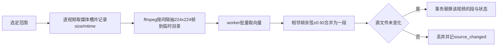

# 字幕与画面场景检索

2026-10-10，Ready（主代理按已授权的“设计后开发”收敛，解除P-007阻碍）。对应源AC-08、Q10–Q11与TC-17–TC-18，概要决定见[D-MW-SCENES](概要设计.md#D-MW-SCENES)。不改变既有字幕索引、语义搜索（pgvector）、AI打标或人脸运行时的行为。

## 选型与实测

| 部分 | 选定 | 依据 |
|---|---|---|
| 对白 | 复用既有`subtitle_segments`（同名`.srt`的逐条索引及其节流同步），返回全部命中条目的起止时间 | 已有双后端、PG有trgm索引；全片覆盖，不另建第二份字幕事实 |
| 画面 | 本地Chinese-CLIP ViT-B/16量化ONNX（`Xenova/chinese-clip-vit-base-patch16`，提交`f26904860903e70e050b8f48255e5f48401816e9`），onnxruntime CPU推理 | 中文图文对齐模型，无需torch |
| 向量存储 | 普通表BLOB（int8量化）+ Go侧点积，SQLite与PostgreSQL相同 | 沿用人脸向量的可移植做法；pgvector只在PG可用，不满足Q11 |
| 外部（可选） | 显式选择后用AI打标已配置的OpenAI兼容视觉模型为采样帧生成中文短描述，按字面检索 | Q11要求外部可选且须显式启用 |

2026-10-10本机实测（M系列CPU，onnxruntime 1.31）：`model_quantized.onnx`对三张公开示例图与五个中文描述做零样本匹配，“灯笼和春节装饰”“猫和狗在弹奏音乐”“足球比赛”均排第一；32张224×224批量约1.02秒（约31帧/秒），单条文本约34毫秒。这只证明管线与中文能力可用，不是检索质量基准；真实片库质量由用户验收。模型许可：Chinese-CLIP官方仓库为MIT；ONNX转换件来自Xenova，以上述提交固定。

模型文件（全部校验sha256，固定提交，基址可由设置`scene_model_mirror_url`替换为镜像主机，例如`https://hf-mirror.com`）：

| 文件 | 字节 | sha256 |
|---|---|---|
| `onnx/model_quantized.onnx` | 190842404 | `a2c2849329eafb24100acec5a9421a39f8cb445296444c5c98855b69e5e7a751` |
| `tokenizer.json` | 439124 | `7dfbf1966ebf99d471c3796e9b457329d2b2182b817e144f1e904b957745c839` |
| `preprocessor_config.json` | 546 | `61a78fdd2c7ac17b54b6190c0f4cb23423192c535003d52528d01e318a47608b` |

预处理按`preprocessor_config.json`：直接缩放到224×224（bicubic，不裁切），RGB/255后按mean/std归一化。组合模型一次需要文本与图像两种输入：只取图像向量时给最短文本`[CLS][SEP]`，只取文本向量时给一张全零图，取对应输出并L2归一化。模型标识`cn-clip-vit-b16-q8@1`。

## 本地运行时

`SceneRuntime`（`services/scene_runtime.go`，仿`FaceRuntime`）：目录`<dataDir>/scene-runtime/{python,venv,models/cn-clip-vit-b16-q8,scene_worker.py}`；复用`ensureManagedPythonRuntime`/`findPythonInterpreter`与3.10–3.13区间；依赖逐个pin（onnxruntime、numpy、pillow、tokenizers，以实际可安装版本为准）；状态`available/missing_python/missing_venv/missing_model/download_failed/incompatible`；就绪靠标记文件+大小，哈希只在下载时校验。`PrepareSceneRuntime`显式触发、可取消、事件`scene-runtime-state`，网络出口仅PyPI、托管Python与上述模型文件。健康面板只读`CachedStatus()`，不启动Python。

`scene_worker.py`嵌入并写入运行时目录，stdout只走协议（加载日志到stderr），先输出`{"ready":true,"model":"cn-clip-vit-b16-q8@1"}`。请求一行一条：`{"id":n,"op":"embed_images","paths":[…]}`（≤32张）与`{"id":n,"op":"embed_text","texts":[…]}`（≤8条，每条≤77 token截断），返回`{"id":n,"embeddings":["base64 float32×512",…]}`或`{"id":n,"error":"<code>"}`。会话管理仿`face_worker_process.go`（一问一答、超时/kill、读协程不泄漏）；检索用的常驻会话空闲5分钟后关闭。

## 画面索引

- 抽帧：`ffmpeg -v error -nostdin -i <src> -map 0:V:0 -vf fps=1/<间隔>,scale=224:224:flags=bicubic -q:v 3 <tmp>/f_%06d.jpg`，第n帧（从0起）代表`n×间隔`毫秒；默认间隔5秒，设置`scene_visual_interval_seconds`可选2–30。临时目录在`<dataDir>/scene-runtime/.tmp/<videoID>/`，每项结束删除。
- 段：首帧开新段，后续帧与段首向量余弦≥0.92时延长段终点，否则开新段；段向量取段首帧向量。段时间区间为`[首帧时间, 末帧时间+间隔)`，夹到视频时长。
- 存储：int8对称量化：`scale=max|x|`，`q=round(x/scale×127)`，BLOB为4字节小端float32的scale + 512字节int8，共516字节。
- 任务：`StartSceneIndex(request{video_ids|filter, provider})`由服务端解析为活跃、非失效、在扫描范围内的视频；候选为当前模型没有状态、状态失败、源size/mtime或间隔变化的视频。单worker、FIFO、可取消，每项先取共享`MediaWorkSlot`，登记表键`scene_index`，事件`scene-index-state`。项间检查取消；退出时`StopAndWait`，不阻止退出（派生数据，已完成项已落库）。失败写状态`failed`与擦除路径的原因，下一轮重试。没有自动触发。
- 失效：查询只使用`state.model_id`为当前模型、`state.source_size = videos.size`且视频活跃非失效的段；源变化后旧位置不再返回（TC-17）。切换模型或间隔后旧段不参与查询，重建该视频时一并删除；“清理旧索引”删除非当前模型的全部段与状态。

## 外部视觉描述（可选）

设置`scene_visual_provider`取`local`（默认）或`external`。切换到`external`时界面先显示披露（将把采样帧缩略图发送到AI打标设置里的接口地址与模型），确认后才保存；后端只在该值为`external`时调用外部接口。外部建索引复用同一抽帧与分段，但以每8帧一次请求让视觉模型输出每帧不超过30字的中文描述，存为该段`caption`，模型标识`external-caption:<模型名>@1`，不存向量。

本地运行时不可用、准备失败或推理出错时，只报告错误并提示准备模型；绝不改用外部（TC-18）。外部未配置或调用失败同样只报错，不改用本地或其他接口。

## 查询

`SearchScenes(request)`：`query`（1–200字符）、`mode`（`all|dialogue|visual`）、`filter LibraryFilter`（可空，复用`applyLibraryFilter`的视频范围，忽略排序与`collapse_versions`）、`limit`（默认50，最大200）。

- 对白：`subtitle_segments`与视频范围联接，`LOWER(text) LIKE`字面子串（`%`/`_`/`\`转义），返回每条命中`{start_ms,end_ms,text,前后各一条上下文}`，按视频再按时间。首次查询前沿用既有10分钟节流同步。
- 画面（本地）：worker取查询文本向量，按段ID分批（每批2,000行）流式读取范围内当前模型的段，Go侧int8点积，维护top-`limit`最小堆；同一视频相邻（间隔≤1个采样间隔）的命中段合并，分数取最大。
- 画面（外部描述）：对`caption`做与对白相同的字面匹配。
- `all`：两路各取`limit`条，按倒数排名融合（k=60）排序；每条保留来源`dialogue|visual`，不把两种分数直接相加。
- 返回`{hits:[{video_id, title, start_ms, end_ms, source, score, text, context_before, context_after}], coverage, notices[]}`。`coverage`为范围内视频总数、有字幕索引数、仅有其他格式/内嵌字幕而未索引数、当前模型画面已索引数；`notices`如`scene_runtime_unavailable`（画面部分未执行）、`visual_index_empty`。不把未索引内容说成没有命中。

读取全程带context与维护准入；查询词不写日志。

## 数据

新增两个`AllModels`成员（`videos`之后，无非零gorm default，随迁移器往返；BLOB走既有二进制列夹具）：

- `scene_index_states`：`video_id`主键→videos ON DELETE CASCADE、`model_id`、`provider`、`source_size`、`source_mtime_ns`、`interval_ms`、`segment_count`、`status`(`indexed|failed`)、`last_error`、`indexed_at`、`updated_at`。
- `scene_visual_segments`：`id`、`video_id`→videos ON DELETE CASCADE、`model_id`、`start_ms`、`end_ms`、`embedding` BLOB（外部描述为空）、`caption`（本地为空）。索引`(model_id, id)`与`(video_id)`。

单视频结果在一个事务内删除旧段、插入新段并upsert状态；worker是该视频派生行的唯一写者。设置新增`scene_visual_provider`、`scene_visual_interval_seconds`（不带gorm default，新库显式行+迁移补默认5）、`scene_model_mirror_url`。

## 界面与入口

顶栏工具组新增“场景检索”页面：输入框、模式（全部/对白/画面）、覆盖率条与“准备模型/为全部建立画面索引/取消/清理旧索引”。结果按视频分组，每条显示`/preview/frame/{id}?ms=`缩略帧、时间区间、来源标签、对白文本或描述；点击打开详情抽屉并从区间起点（提前2秒，不小于0）内嵌播放，沿用字幕命中跳转机制。片库工具栏“在当前筛选中搜场景”带当前`LibraryFilter`进入该页。设置页新增“场景检索”分区（运行时状态与准备、模型镜像、采样间隔、提供方及外部披露）。任务中心与健康面板显示运行时缓存状态、索引覆盖与运行中的任务。

## 验证

| 场景 | 证据 |
|---|---|
| TC-17 后半段对白 | 夹具srt命中位于片尾的条目，返回正确起止时间；两后端 |
| TC-17 无字幕画面 | worker替身返回可控向量：命中正确段与合并区间；int8量化排序与float32一致性；真实worker在本机已准备时可选跑一次合成视频冒烟 |
| TC-17 源变化与模型更换 | `videos.size`变化或模型标识不同的段不返回；重建替换旧段 |
| TC-18 本地不可用且未启用外部 | 返回`scene_runtime_unavailable`且外部客户端替身调用次数为0；本地失败时provider不切换 |
| 规模 | 合成20万段的点积扫描基准记录耗时（不作为SLA） |
| UI | 模式切换、请求代次丢弃晚到结果、覆盖率与空态、点击跳转、外部披露确认 |

运行时安装、真实片库检索质量与外部服务实调用由用户真机验收。

## 实现与验证记录（2026-10-11）

已按本合同实现（`models/scene_index.go`、`database/scene_migrations.go`、`services/scene_*.go`、`scene_worker.py`、`app_scenes.go`，前端`ScenesPage.vue`、`settings/SceneSection.vue`、`utils/sceneSearch.js`）。实测安装：托管Python 3.10.20，`onnxruntime==1.23.2`（1.31需Python≥3.11）、`numpy==2.2.6`、`pillow==12.3.0`、`tokenizers==0.23.3`；临时数据目录冷准备48.2秒（托管Python 4秒、pip 18.5秒、模型22秒），worker冷启动+6帧1.56秒、热0.21秒，两条中文文本45毫秒，检索41毫秒，“红色的画面”命中合成视频纯红半段。20万段内存点积扫描约70毫秒/次（不含数据库读取，不作SLA）。实现细化：外部描述没有向量，只合并相邻相同描述；`all`模式融合后截到limit；额外notice `subtitle_index_empty`、`scene_visual_failed`、`scene_external_not_configured`；额外只读接口`GetSceneCoverage`；点击命中定位到起点前2秒但不自动播放（与字幕命中一致）。

独立差异评审报2 Important与若干Minor，已修正并补先红回归：外部描述在每项与每批前重读设置，提供方改回本地或端点/模型/密钥变化即停止外发（`scene_external_revoked`，剩余项跳过）；源文件不可读不再删除已有有效索引；空闲关闭不会关掉使用中的会话；采样间隔变化后旧段不参与检索与覆盖统计；取消尚未结束时启动返回`scene_index_cancelling`；本地运行时不可用时整轮中止而不逐个解码；画面检索未执行时空态不说“没有找到”；worker输出单行上限1MiB。未改：传递依赖未逐个pin、共享路径擦除对含空格路径只擦一部分（与既有人脸运行时/帧哈希一致）。

验证：场景/帧预览定向测试与`-race`、SQLite全量、一次性PostgreSQL全量、前端全量与绑定守卫通过；首轮6个承重变异均被检测（模型条件首轮存活后补夹具）。真实片库检索质量与外部服务实调用由用户真机验收。
