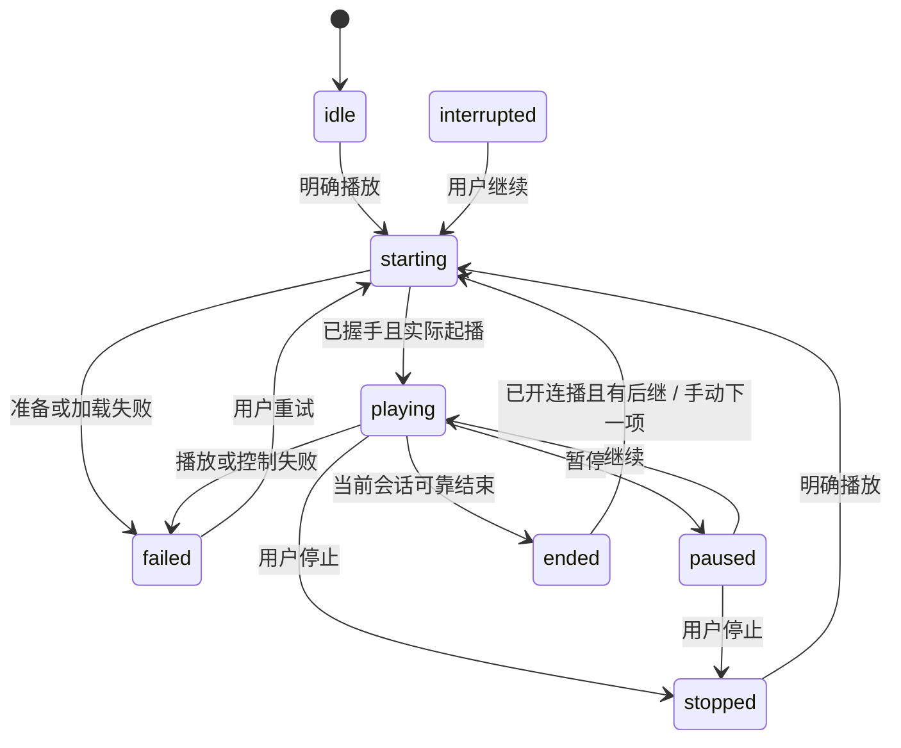

# 下一集与待播队列

2026-10-10，Ready，实施前独立审阅已闭合。对应AC-06、Q12、TC-15。P-004已实现真实观看/日记事实接缝；本合同不改变普通播放、随机计分或作品集已有顺序。

## 入口和使用边界

全局只有一条“待播队列”，顺序、当前位置、播放器选择及自动连播开关保存在现有数据库。条目可重复，每个出现位置都有独立entry ID；手动重复加入表示重新观看，不按video ID偷偷去重。默认播放器为“系统默认（手动）”，自动连播默认关闭。用户可以明确选择“应用内”或“专用IINA窗口”以使用可靠连播；缺少能力会解释原因，不自动切换播放器。

- 视频行、详情及已选操作可加入队尾；作品集详情可按其现有position/video ID顺序加入队尾，或选择“从本集顺序播放”。替换已有队列之前预览替换数量并确认，不删除媒体。作品集没有下一项时明确提示已到末尾，不猜测集号或跨作品集跳转。
- “下一集”请求携带所选原成员的start_video_id与start_after=true，由同一SQL快照按当前顺序寻找下一活跃成员，不用前端已加载的旧列表推算后继；启动该后继时形成从该项到末尾的队列。一个视频属于多个作品集时在对应作品集入口选择，不静默猜其中一个。
- 加入时冻结作品集当前顺序；以后修改作品集不自动改写队列。队列内可上移/下移或移动到某项之前、移除、清空；更改未来条目只影响之后播放。当前项移除或清空会先停止本队列的托管播放，界面明确提示；不触碰普通播放窗口。
- 重启恢复队列和上次选中项，但一律暂停，不自行起播。重启前starting/playing/paused运行态记为interrupted，旧运行token作废。自动连播偏好可保留，但不能因此自动启动。
- 不可用的后继停在该项并显示错误，不自动跳过一串文件。用户可手动下一项、移除或处理后重新播放。暂停、手动停止、窗口关闭、IPC断开、崩溃、加载失败、重复结束回调都不能自动推进。
- 队列面板50条一页（最多200），总容量10,000项。单次最多1,000个显式视频ID；作品集加入可至剩余队列容量。超限整次拒绝并说明，不做隐式截断或部分加入。原片软删/永久删时队列保留名称快照并显示不可用，不自动绑定重导入文件。

## 责任、持久化与并发

`PlaybackQueueService`拥有队列状态和唯一活动播放会话；`VideoService`继续拥有正式起播统计、播放纠偏、进度/已看及有效观看；`CollectionService`拥有作品集顺序。播放器适配只报告真实事件，不自行选下一项，不直接写数据库。App负责启动、事件投递、维护与退出生命周期；前端只展示状态与表达明确操作。

新增两个AllModels成员，两个后端与备份迁移均覆盖：

- `playback_queue_states`：固定ID=1（不自增）、Revision、Autoplay、Player(system/inline/iina)、CurrentEntryID可空逻辑引用、Status、ActiveToken（32字符随机会话标识或空）、LastErrorCode、LastErrorMessage、UpdatedAt。状态不含文件路径或IPC地址。新行显式初始化默认值，非零业务值不依赖GORM default。
- `playback_queue_entries`：自增ID、VideoID逻辑引用、Title快照、Position、CreatedAt。索引(Position,ID)。不设视频删除级联外键；不在此复制已看、评分或进度。

初始化只在应用服务启动/维护失败恢复时运行；读取不偷偷创建状态。残留ActiveToken在恢复时清空，状态改为interrupted。队列结构、选择和设置修改须带expected_revision，在同一事务先条件更新state.Revision，再执行条目变更；失败回滚全部。没有新FOR UPDATE或应用自行执行的数据库锁。移动当前项保留其entry ID，结束时按最新已提交队列顺序找后继；改序不会把旧EOF认给另一项。

列表读取携带revision及(position,id)游标。后续页发现revision改变返回queue_changed，前端刷新首屏并保留当前项标识，不混合两个排序版本。只有最新成功请求一起提交内容、游标和历史。单次API中的相关数据库语句共用WithOperationContext/TransactionWithContext，全部读取有30秒期限。

运行时使用服务内串行命令/事件处理，只有一个活动token；耗时IPC连接/文件准备通过可取消的子操作完成，回调带token。进度更新不使队列Revision每秒增长；结构、选择、设置与运行终态才生成新的权威状态。对外状态带独立递增event sequence，前端忽略旧事件。运行token不是可跨重启恢复的租约。

## 既有服务的取消与数据库接缝

不能把现有无context方法包在外层围栏里就宣称可取消。实施明确补以下内部接缝，旧App/Wails签名与普通调用结果保持兼容；已有公开服务方法继续委托同一个核心实现，不另写一套计分或播放纠偏：

- VideoService的正式播放、准备预览源、观看进度分别增加接受context的入口；其内部的媒体读取、设置读取、返回含Tags的DTO、markWatchedFromCompletion均使用该context绑定的数据库句柄。正式播放在最后一次派发前检查取消，已经交给系统播放器的窗口仍不宣称可撤回。所有派发工作登记在队列生命周期内，维护必须等它返回，不能在立围栏后才启动。
- 正式统计改为可接context的TransactionWithContext核心；旧recordFormalPlaybackStats调用该核心保持原统计失败只警告的语义。system模式由原正式派发核心负责记账，队列不再额外记一次；inline/IINA在首个起播事实调用同一统计核心。
- 预览源准备下沉的代理消费查询、失效处理/last_used_at更新均使用传入的context/DB句柄；queue严格入口能区分“无可用代理”与数据库错误。旧resolveValidProxy的已存在错误行为仍由旧wrapper保留，不把原调用方改变成另一种错误处理。源版本核验与媒体FD交付见下节，不调用无期限的旧GetPreviewSession后再假贴token。
- viewEvents增加context写入核心，事务与唯一键冲突后的再读取均跟随context。P-004的持久唯一键已承担幂等，LRU互斥只保护短暂的内存查询/记忆，不跨数据库等待；否则队列即使有context也会被另一个无期限写库者卡在LRU锁上。重复并发认领仍由数据库唯一键和回滚裁决。
- 观看状态通知的内部WatchStateObserver合同向下传context：VideoService→App注入观察者→MovieChartService关联更新及其实际SQL，直到返回DTO；MovieChart原有markMu的等待也须可取消，保留同一串行责任与锁序；自动watched会撤销榜单创建的想看片单时，DeleteForChart的实际SQL和ManagedImageService.RemoveContext的锁等待同样传context，不改先删记录再清理海报的顺序；取消海报清理仍报告“记录已删除但海报清理失败”，不自动补删。两处原串行责任使用同一小型contextMutex原语，不跨锁复制服务对象，不引入新数据库锁。不把被取消的队列调用遗留在榜单写库里。旧NotifyWatchStateChanged/榜单普通入口用原默认context委托，旧单向通知/不反复回写规则不变。全部内部实现者与测试替身一并调整，不新增第二个观察者注册表。
- 正式播放失败的同步纠偏（扫描根读取、离线判定、失效标记及返回视频）也传递context；必要的异步重定位继续由VideoService既有生命周期拥有。现有StopPlaybackRelocation返回即重开准入，不能用于维护期的持续停机，具体围栏见下段。不为队列创建另一套重定位任务，库句柄不可被子操作跨维护保存。

正式播放与重定位共同补进程级的持续维护准入（不是数据库锁）：

1. 在任何可能采集媒体并派发的公共入口PlayVideo、PlayRandomVideo、PlayRandomVideoWithFilter、RerollRandom进入时，登记一次formal attempt、获得该代context；内部调用复用同一登记，不能只在失败时才登记。筛选/配置读取到派发结果处理均属于该登记，随机分数与30秒换片语义不变。
2. `QuiescePlayback`先关闭formal与重定位新准入，取消尚在准备/查库的派发以及已有重定位，等待在途formal（包含可能派生重定位的失败处理）和重定位退出；返回的是幂等release函数，返回时仍然关闭准入。既有StopPlaybackRelocation的临时取消/等待/重开语义对旧直接调用方保留，不冒充持续围栏。
3. App在停止队列之后、进入路径/数据库围栏之前取得该持续关闭句柄。收敛在途formal后再FlushPendingRandomCommit，使这之前实际起播的最后一份未决事实也有机会落库；已成功派发后的统计结算是事实收尾，不能用已取消的准备context直接丢弃。结算用独立最多30秒的context并由生命周期等待，数据库失败沿用原记录警告语义、不自动重试。原定时结算同样有界，不在持槽位状态下无限等待连接池。
4. 进入维护的每个早退失败路径和恢复失败续跑，都在数据库/路径围栏解除且服务已指向当前句柄后释放该关闭句柄。成功恢复退出、切换待重启与应用退出不释放准入。退出先在播放生命周期互斥区设单向终态并关闭准入，再取消数据库迁移；迁移的恢复回调不能解除这个终态。由于旧formal已被计入并排空，不会在release后用旧视频快照给新库派生一次扫描。
5. 队列关闭时作废外部回调token，取消准备；已实际发生的最后进度/观看事实用收尾context尝试一次，再结束服务。停止时的最终快照不靠迟到外部事件补齐。已发生事实写入失败可见，不因此自动起播、重试或绕过数据库维护。应用不在任何后台队列仍持有数据库相关工作时关闭句柄。

后台重定位继续下传context到扫描配置/旧回收站索引、RelocateVideo及MediaProbe的真实SQL。MediaProbe原有“取消也记录尝试状态”保留：已知失败状态用独立最多5秒的收尾context写入，不覆盖成功快照、不重新探测。路径锁的context入口复用既有等待/放弃机制，取消后迟到取得锁的等待者只解锁，不再执行数据库或文件操作。

30秒/取消覆盖数据库和IPC等可取消等待。已有操作系统文件stat/open可能受离线文件系统影响，不能声称context会中断OS调用；路径锁顺序仍先路径后数据库，文件操作完成后再次检查取消，再发布任何播放/写库结果。测试用占满连接池逐个证明上述实际下游语句能取消，而不只验证外层ctx.Err。

## 状态与一次推进

持久Status为idle/starting/playing/paused/ended/stopped/dispatched/interrupted/failed。不存在“起播成功等于看完”。操作及原因在面板展示，当前项始终独立于页码。

1. Play(entryID,expected_revision)验证成员、媒体、播放器能力；新token写入starting，取消旧会话并停止它的托管播放，然后为新项准备资源。旧token的所有后续回包和事件失效。
2. 文件加载与来源握手成功才允许开始播放。启动失败落failed并保留当前项，用户重试产生新token；不得自动重试启动或切换播放器。
3. 首个实际起播通知为此token记一次正式播放启动（play_count与desktop_play事件同事务，复用现有统计函数）；暂停/恢复与重复通知不增加次数。统计失败沿用正式播放既有语义：不关闭已经开始的播放器，但状态显示统计未记录的警告；不自动重试记账。
4. 当前token收到可信自然结束，先消费本次结束事实并落ended；仅当该操作观察到Autoplay=true且有后继，才为后继创建一个新token。同token再次上报结束没有效果。
5. 手动Next携带观察到的active_token与expected_revision；并发Next/EOF只允许一个旧会话被消费。失去竞争的一方返回queue_changed，不再多跳一项。自动连播关闭时仍可手动Next；到末尾保持ended，队列不删除。
6. Stop使token作废，停止托管播放并保留当前项；仅系统默认播放器无法可靠停止其外部窗口，文案明确“已停止队列；请在系统播放器中停止当前视频”。退出与维护采用同一失效顺序，绝不把因Stop收到的EOF样消息当新结束。

## 播放器接入

### 系统默认

复用现有VideoService.PlayVideo，不改变普通播放器派发、纠偏和统计。队列仅知道派发结果；不声称知道正在播放、看完或观看时长。状态标为“已派发，手动下一项”，使用dispatched表达能力边界，不能写成可信playing。该模式不接受打开自动连播（设置保留旧值也不得在本模式执行自动推进），切换播放器是用户显式操作。

### 应用内

新增小型`QueueInlinePlayer`，只负责当前队列会话的video元素、实际播放事件与控制。复用GetPreviewSession的媒体/代理定位、已有播放累计工具与观看阈值，不复制视频详情编辑器。PreviewDrawer包含人物/作品集导航及书签区间暂停，其ended不能不带来源地当作全局队列结束，因此不将队列推进隐含塞进所有详情预览。

播放器随active_token重新挂载；实际事件包含固定token、video ID、source_version及播放位置/时长，不能从更新后的全局对象给旧DOM事件贴新token。loadedmetadata后采用现有resume/restart/restart_watched设置；播放失败明确failed，不自动生成代理或外派。无inline能力时给原片详情/代理准备入口和明确的播放器选择，用户再次播放后重新预检。

暂停与seek打断观看累计；区间或UI隐藏不伪造ended。原生video ended才上报自然结束。关闭队列列表不停止其正在播放的视频，当前播放与停止/下一项入口保持可见；停止/切换模式/维护/退出会卸载托管video并作废旧token。

应用内媒体使用新的`/preview/queue/{active_token}`专用只读路由，原`/preview/media/{video_id}`及普通预览locator不变。该路由由队列服务提供已授权的当前inline媒体租用：

1. 准备时在既有路径读锁下，通过VideoService的context入口取得活跃媒体和原片size/mtime；PlaybackProxyService仍负责选出有效代理。打开实际交付的原片或代理FD，并用Fstat与打开前观测核对普通文件、大小/mtime和文件身份；原片版本不符即拒绝。runtime保存FD及版本，不把后来重新解析的路径冒充原会话。
2. 返回前再次核验当前token；只有这个token能拿到该FD。每次Range请求都核验token尚有效、媒体仍活跃、当前原片版本仍符合以及交付FD的Fstat未变；请求不可自行提供文件路径或选择新proxy。不存在/已过期token返回410，源变化返回409并使队列失败，均不提供新源字节。
3. 同一token的Range读取用独立SectionReader/ReadAt，不共享Seek游标；替换pathname不会让已打开的FD悄悄变成新文件。元数据读取持数据库维护围栏，正文流不持数据库事务或路径锁。Stop/换项/维护作废token、取消并关闭媒体租用，后来的请求不能取得旧流。
4. size/mtime仍是本项目既有版本口径，不等同不可变内容快照；原片在播放期间被外部原位写入，观察到变化即停止，不能承诺OS调用之间的瞬时外部改写不可见。应用自身的路径变动继续通过既有路径锁；队列不会锁住整部视频或复制用户原片。

### 专用IINA窗口（macOS）

本机1.5.0已验证，优先直接启动应用包内IINA可执行文件，拥有明确Process句柄；不接管用户原有IINA窗口，不使用killall/pkill，不绕由LaunchServices复用未知实例。未安装或非macOS时能力不可用，用户仍可明确选应用内或系统默认。

使用本机私有0700临时目录内Unix socket，路径长度适配Darwin限制。只接受本队列查库得到的普通本地文件，不把用户输入拼成命令字符串；命令采用JSON数组和独立argv，不开放TCP。启动时暂停，禁用本进程的自动加目录/自动播放后继、循环、插件和mpv脚本；与身份控制相关的参数仅作用本次专用进程，不写defaults。生产进度回写CineInsight，watch_later采用私有目录，避免既有IINAProgressService重复推断。

每次IINA装载与inline采用同一个起播计算：本次读取playback_resume_mode快照；restart从0开始，restart_watched且本文件已看时从0开始，其余仅在既有resumable(video)为真时使用库内WatchPositionSeconds，否则从0开始。显式传入start并关闭mpv隐式resume；私有watch_later不是续播真值来源。origin为resume（使用有效断点）或start（0起播），不因用户稍后seek改写本次origin；普通播放的已有设置规则不变。

必须核对已加载path、playlist entry ID及源size/mtime，安装事件观察后才解除暂停。源文件打开前后变化则拒绝本次播放，队列停下等待处理。路径读锁只围住准备/握手，与维护一致先路径后数据库，不跨整段播放持锁。

实测`keep-open=no`时首个EOF之后IINA会异步关闭窗口，立即loadfile会被其收尾stop掉，不能靠固定sleep假装修好。采用`keep-open=yes`及可靠`eof-reached=true`属性事件保持播放器，文件只有队列当前一项；下项用loadfile replace在暂停状态加载。这个属性表示播放器抵达播放末尾，区别于解复用线程的eof、pause、idle或时长计时。

- read loop维护当前start-file的playlist_entry_id；自然结束候选必须属于已握手当前token。消费前再次查询当前entry ID、path、eof-reached及seeking，确认仍是本次文件且非seek途中；旧代次/错误身份拒绝推进。
- end-file(stop/quit/error/redirect/unknown)明确是停止或失败；本模式正常EOF不依赖end-file。pause=true本身不算结束。用户在专用IINA中换入其他文件会使身份校验失效，停止队列控制并说明，不能为未知文件记账或自动推进。
- IPC连接/加载握手期限15秒；单条控制命令5秒。只用于有界等待，不用于推测影片结束。JSON单消息上限1MiB，读循环分别投递请求响应与事件；事件通道有界，溢出/协议错误停止控制并报失败，不丢掉关键结束后继续猜测。
- 同一个受控IINA进程可顺序loadfile，当前token与mpv entry ID一一绑定；每次替换先使旧token失效。停止时只关闭本次专用进程；quit与等待有界，必要时只终止仍受管理的Process并Wait，清理私有目录。若外部窗口已被用户改作其他文件，不再发自动播放命令；进程归属和关闭提示必须明确。

依据[mpv官方手册](https://mpv.io/manual/stable/)的loadfile、keep-open、eof-reached与事件定义，以及[IINA 1.5.0 PlayerCore](https://raw.githubusercontent.com/iina/iina/v1.5.0/iina/PlayerCore.swift)的idle窗口收尾实现。调查与本机合成样片证据见[连播接入调查](连播接入调查.md)。eof-reached回调只是结束候选，结束去重与后继认领分开：即使auto=false已经确认ended，用户随后手动Next仍可认领后继；同一次结束的重复通知本身不再推进。不能将本机版本验证扩大成所有IINA版本支持；握手不满足必须失败，不默默使用时长定时。

## 观看事实、文件及生命周期

队列专用受控播放使用`queue_view`来源追加有效观看；复用P-004的事务内日记写入与持久session key，不按日合并。内嵌和IINA只统计实际位置推进，按现有viewThreshold与完成判定生成事实；暂停/seek打断累计，未知时长用现有60秒阈值。系统默认不产生自动日记。进度与已看调用VideoService.UpdateVideoWatchProgress及既有通知，不在队列直接写这些字段。

进度采样最多每秒一次，保存断点沿用10秒节流，暂停/停止/自然结束强制最后一次；只有确认实际结束才传completed。数据不是用于估算结束的计时器。每次独立托管播放有新运行token和观看session。运行token用于队列控制，观看session用于日记，两者分开：同一媒体自然结束后再次实际play，保留其运行token但新建观看session、递增view_cycle并重新开始累计；单纯seek/暂停不拆分。可信结束的消费键为运行token+view_cycle，迟到seq不得重开旧cycle。新一次观看的日记独立；播放计数仍按明确派发一次，原生控件重播不伪造一次新的外部启动。重复观看事实由P-004键防重。

维护入口先令队列不再接受新命令、取消准备与停止受控会话、等待所有数据库相关回调退出，再立路径/数据库围栏。失败恢复重建暂停状态，不自动续播；退出同样先关闭队列，再关库。任何后台回包不能在围栏后重启动播放。普通系统播放器派发出去的窗口不归队列终止。

媒体删除不增加级联清理任务；下次准备/定位发现媒体记录不可用即失败。活动播放中媒体被外部更换、移动或删除产生的错误不触发自动跳过。队列操作从不修改媒体字节、字幕或图片。

## App合同与界面

新增公开方法必须同步有生产调用；具体DTO保持snake_case：

- `GetPlaybackQueue(QueueQuery)`：状态、能力、条目当前页与revision；失败不报空队列。
- `EditPlaybackQueue(QueueEdit)`：append_videos、append_collection、replace_collection、move、remove、clear、configure。请求带expected_revision及该动作所需字段，拒绝不适用字段组合；replace/clear的预览数量由最新状态给出，Revision变化要求重新确认。
- `PlayPlaybackQueue(entry_id,expected_revision)`、`NextPlaybackQueue(active_token,expected_revision)`、`StopPlaybackQueue(active_token)`：分别明确起播、下一项、停止；只有拥有当前token才操作运行态。停止对已停止同token幂等，不能停止后来新会话。
- `ControlPlaybackQueue(active_token,action)`：仅受控播放器支持pause/resume；系统默认明确不支持，不假报已暂停。
- `ReportInlineQueuePlayback(InlineQueueEvent)`：只接受当前inline模式的token/video/source身份，载荷有token内递增seq、类型为loaded/playing/progress/paused/seeking/ended/error；服务拒绝迟到seq，IINA事实由其适配器内部输入，不能由这个入口伪装。
- 状态事件`playback-queue-state`只做通知，客户端读当前有界快照；sequence单调隔离旧回包。操作错误、能力不可用和统计警告在队列面板内展示，不让用户去日志猜当前在播哪项。

顶部“待播队列”入口和持续可见的当前播放条；面板有播放器选择、连播开关、当前项、下一项、暂停/继续（受控播放器）、停止及分页顺序编辑。作品集详情每项提供“下一集/从此集播放”，视频选择栏提供加入队尾。只给系统默认显示“手动下一项”，不能把自动开关显示为已生效。

## 验证范围

- 空队列、单项/末尾、重复video ID独立entry、1/1000/1001与总容量边界；全量失败不部分加入。作品集顺序、成员删除/变动后的Revision与冻结顺序。
- 两个后端的并发append/move/remove与CAS；当前项移动后后继、删除当前、清空、失败页重试和请求中重新激活。
- 内嵌真ended、重复ended、旧DOM回调、暂停/seek/错误、0断点、模式切换和播放失败；自然重播生成独立日记。
- IINA真实启动暂停握手，同进程两项、手动stop、缺失文件、关闭窗口、IPC断开、取消准备、错entry ID/旧EOF、相同路径源变化及退出无遗留；自动关闭时不推进、打开时只推进一次。
- 占满连接池时的取消须覆盖正式播放/代理读取与touch/进度返回DTO/观看事实/榜单观察者/纠偏；stream会话后换源、过期token/Range并发读/FD被原位改变均不把新源当旧源。
- Next与EOF并发、数据库写入失败、事实追加失败、不改变随机计分与普通PlayVideo旧行为；系统默认只保留启动事实。
- 普通播放在途失败与Quiesce返回/立围栏的间隙、恢复失败后的release、多个停止者并发，以及随机未决项最终结算；关闭句柄持有期间始终拒绝新formal/重定位，失败恢复后只接受新请求。
- 应用退出与数据库维护排空，重启只恢复暂停队列；模型拓扑及迁移往返、绑定消费者、相关包和全量检查、race、承重变异与独立精确差异审阅。

实施前审阅已闭合，按已记录责任边界进入实现；新增生产差异仍须独立审阅与实际验证。

实施前独立审阅发现2 Important（旧播放链未传context、inline旧locator不绑定实际源）和2 Minor（IINA续播规则、概要事件口径）。本稿已补逐层接缝、专用媒体租用与两种起播规则，并同步概要；等待定点复核。生产队列代码仍未开始。

复审另指出StopPlaybackRelocation返回会重新开准入；已改为覆盖普通正式播放、随机派发及重定位的持续关闭句柄，在途派发先排空、已发生事实有界收尾、维护成功终态不释放，失败恢复明确释放。该增量已定点复核通过，无剩余实质发现。

## 实施检查记录（进行中）

- 退出迁移恢复窗口的回归先红后绿，独立复核通过。原HEAD任务中心测试延时变量race在隔离副本复现，测试写入改与生产读取同锁；不变更任务中心生产机制。
- 存储与媒体准备增量独立审阅已闭合。指定作品集起点、活跃集合与顺序用同一SQL快照；分页当前项缺失先复核Revision。SQLite/PG定向与迁库通过，代理/预览兼容回归通过。
- 7个存储/媒体有效变异最终全被检测，初轮2个存活为测试缺口，补强后重测通过；均使用overlay，生产源未被变异改写。
- 队列控制器/事件处理已开始，尚未完成播放器适配和界面，也未做P-005最终独立差异复核，不能把本节当作功能验收完成。

控制器差异复核补充（2026-10-10，修复中）：停止先按本实例token失效并关闭托管资源，再尝试一次持久写；数据库读/写失败都保留明确的内存终态投影和警告，不能让写库成为停止前提，不自动补写。停止型编辑先在store完成资格/容量检查并冻结完整成员快照，在同一命令所有者内停止资源后，按原Revision CAS应用该计划；资格拒绝不停止播放，提交失败不再发第二次状态写。没有新持久表或数据库锁，数据库事务中不调用播放器/观看事实。

通知sequence采用进程内单调计数，服务恢复重建也不归零，不作为数据库Revision或跨重启租约。IINA非当前entry的start-file先核验实际播放器身份，已过期自有事件不误停新项；加载握手读取实际duration，确实未知则0/60秒阈值，不用旧库时长替代实际时长。持久错误和运行警告统一清洗路径并限长。

最终差异复核与修正（2026-10-11，P-005收尾）：独立复核报2 Important/3 Minor，均先补失败回归后修正，并经同一复核者定点复审确认，无新增实质问题。

- 拖动到末尾：新增事件`seeked`结束seek守卫（暂停时也上报）；seek之后必须观察到越过落点的实际播放，才把随后的`ended`/`eof-reached`视为自然结束，否则返回`queue_end_ignored`，会话、观看周期与有效观看均不变。两种播放器一致；IINA在seek完成时读取实时time-pos作为落点。观看周期只在后端接受结束后递增。
- IINA观察者：每个受控进程只注册一次（`observed`标记，连接后立即注册，部分失败即关闭进程）；复用进程时先读当前playlist entry再loadfile，只绑定其后新建的entry。
- 应用内`play()`被暂停打断的AbortError不再判失败；NotAllowedError与媒体错误仍失败。
- IPC事件改为有序队列：连续time-pos按最新值合并，其他事件保序，积压超过128条仍停止控制。残留风险：数据库长时间停顿时的快速拖动仍可能积压seek事件对。
- 同一token的旧/重挂载序号返回`queue_stale_event`，不让会话失败；播放器暂停并提示重新播放。
- 验证：`go test ./services -run 'Queue|PlaybackLifecycle'`、`-race`、相关3个vitest文件通过；修复阶段有效变异共15个中14个被检测，存活1个为等价的比较符写法已还原。真实IINA集成测试（`CINEINSIGHT_TEST_IINA=1`）未在本轮运行，交用户真机验收。
