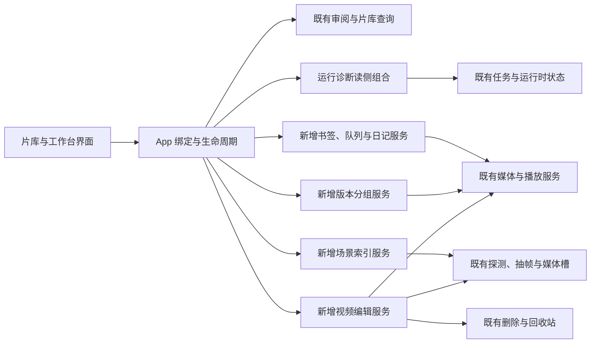
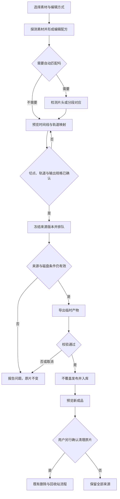

# 片库性能、运行诊断与视频工作台 · 概要设计

状态：v0.1，2026-10-10。用户已确认需求方向及 Q1–Q14；本文为技术方案草案，未将新功能写成已经实现。图片选择与发布名称已独立修复，见原有设计和验证记录。

来源：[本轮需求与裁定](../../../../.loopx/intake/2026-10-10-media-workbench/requirements.md)。详细合同：[需求设计文档](需求设计文档.md)。独立图片编辑仅出[另一个项目的方案](../2026-10-10-image-editor-project/概要设计.md)，不接入此架构。

## 目标与优先级

先让大库的查找、审阅和问题定位保持可控，再在同一份媒体记录上增加片段书签、选片、队列、多版本、场景检索、观影日记和视频编辑。保留本地片库定位、默认 SQLite、可选 PostgreSQL、用户对删除和外发的明确控制。

性能优化不缩小搜索范围；诊断不建立第二份任务状态；编辑结果另存，原文件只有在结果确认后才进入既有删除流程。用户需要的字幕、画面检索和两种片头处理均在范围内，没有以“首期”名义删除这些要求。

## 所有权与复用

下图表示拟增加能力与既有模块的依赖方向。浏览与诊断保持读侧聚合，新持久状态由对应业务服务拥有，App 只接线。

新建编辑服务的理由：超分服务拥有超分任务，清理服务拥有候选与文件集中整理，两者都不拥有可编辑时间线、多素材轨道和导出配方。只复用媒体探测、进程执行、资源槽、产物发布及入库的边界，不把编辑塞进清理服务，也不把现有后台服务重构成通用工作流引擎。

## 先解决大库与诊断

**D-MW-PERF · Behavior / Operational Contract · 查询/批量/有界渲染已实施并验证**，对应 AC-01。

审阅查询在所属服务中按筛选条件分页，前端不再为一次搜索装载全部候选详情。名称、路径、现有标签、候选标签和理由仍属于搜索内容；中文、大小写和特殊字符有共享样例。搜索、筛选、下一页与局部审批由请求版本隔离，旧请求不得覆盖新结果。已删除媒体的候选仍可查看和拒绝，批准限制不变。

用户已裁定两种批准入口：已加载范围与全部筛选范围都先由服务创建有数量的预览，再确认执行；已加载范围从调用方复制的ID开始，全部范围按完整筛选匹配。预览固定成员和版本，不把确认期间新产生的候选纳入；执行仍使用逐项审批事务，报告成功、已失效与失败，不把部分成功当作全部成功。

视频列表、网格和审阅面板需要有界渲染。图片网格已有二维虚拟化，继续保护它的多选与锚点。发现现有 macOS Wails/WebKit 分支会主动关闭主视频列表虚拟化，不能只改一个开关就宣称解决；必须先复现窗口/滚动问题，修正并在真实 WebKit 验证后再启用。标签仍全部换行展示，不能靠隐藏标签降低行高。 渲染继续由VirtualVideoList/virtualList.js拥有，用逻辑行高度索引复用测量；审阅只新增行投影封装。索引按同排最大卡片高度支持网格，宽度变化先保留旧可见ID再重算，隐藏页面停止处理共用宿主。详细合同见需求设计文档§2。

先以临时数据测量 1 万/5 万视频、10 万图片、2 万/10 万候选，包含大量候选落在同一媒体、稀疏命中和无命中。以上是测试负载，不是对用户真实库规模的猜测。记录数据库耗时、IPC 字节、首屏/查询延迟、DOM 数量和滚动锚点；数值收益须来自实际前后对比。

**D-MW-HEALTH · Operational / Security Contract · 已实施并完成独立差异评审**，对应 AC-02；真实图形保存与故障磁盘未实测。

从现有任务中心进入“运行状态”，按数据库、扫描磁盘、依赖与模型、索引、任务、缓存分区。每项展示状态、检查时间、原因和已有处理入口；未检查、暂不可读、不支持与正常必须区分。日常读取不做全盘扫描、模型安装、外网测试或修复。

昂贵的依赖检查显式触发，分项更新，一项失败不遮住其他项。维护模式下只展示可读的进程状态及维护原因，不绕过维护围栏。磁盘状态优先读 watcher 已有事实，不能用“没有在监听”替代“磁盘离线”。

诊断导出为本地白名单 JSON，带版本和时间，只含结构化状态、计数、错误码、耗时、平台和后端类型。媒体名称、路径、字幕、图片、外部接口地址、凭证及原始日志不进入导出；不上传文件。界面可显示本机根目录供定位，导出使用序号替代。

## 日常观看与内容组织

**D-MW-BOOKMARK · Behavior / Data Contract · 已实施并通过独立差异评审（P-004）**，对应 AC-04。

详情播放器可收藏一个时间点或闭开时间区间，填写标题、备注与标签，列表可搜索并回跳。书签引用媒体 ID 和内容版本，不绑定路径；普通重命名/迁移继续可用，内容已换须标记待复核。书签不生成剪辑文件；“导出片段”由视频编辑服务承接。原媒体丢失后保留用户笔记，回跳明确不可用。完整数据与验证见[书签与日记合同](书签与日记合同.md)。

**D-MW-DISCOVERY · Behavior Contract · 已实施并通过独立差异评审（P-012）**，对应 AC-05。

“今晚看什么”使用用户给出的时长、标签/人物、评分与观看状态，先严格筛选，再给少量候选及来源于真实字段的理由。第一版使用本地可解释规则，不额外调用大模型、不改变现有均衡随机计分。具体接口、排序与空态见[选片助手合同](选片助手合同.md)。未知时长不能冒充符合时间上限；无命中显示空态，不自动放宽条件。

**D-MW-QUEUE · Behavior / Data Contract · 已实施并通过独立差异复核（P-005，2026-10-11）**，对应 AC-06。

待播队列保存顺序和当前项，支持加入、移出、重排和手动下一项。作品集“下一集”依据已有顺序寻找后续可播放项；跨集号排序仍由作品集维护。自动连播默认关闭、可开启；应用重启恢复队列但保持暂停，不自行播放。

推进必须来自当前播放会话的可靠自然结束事件。内嵌播放器用 ended；IINA采用独立受控进程/私有mpv IPC；本机已验证keep-open=yes的eof-reached播放末尾事实，消费前复核当前entry/path/非seek状态。keep-open=no的end-file EOF后窗口异步收尾会中断立即装载的后继，不作为正式复用路径。暂停、关闭、播放器崩溃、启动成功、观看阈值或文件时长计时均不代表自然结束。未接入可靠事件的播放器仅支持手动下一项，并明确显示原因。不能把旧 IINA watch_later 删除推断当作连播信号。模型、取消接缝、源版本交付与状态机见[播放队列合同](播放队列合同.md)。

**D-MW-VERSIONS · Behavior / Data Contract · 已实施并通过独立差异评审（P-006，2026-10-11，详见[版本分组合同](版本分组合同.md)）**，对应 AC-07。

新增人工确认的版本分组，支持一张卡片展开原版、高清版或编辑版并选择播放。现有同源关系只提出分组建议，不自动把截取片段当成等价版本；作品集继续表示集合与顺序。每份文件的字幕、评分、收藏、进度、已看和删除独立保存，不自动从一个版本覆盖另一个。

分组按匹配筛选的可见成员呈现；播放前按所选具体文件校验。删除一个版本不删除其他版本，原有单文件视图可随时使用。片库在原查询上加“每组取符合筛选的首位成员作代表”的窗口条件，原排序与游标不变；成员以视频ID为主键保证一个视频至多一组，组版本号做CAS。

**D-MW-DIARY · Behavior / Data Contract · 已实施并通过独立差异评审（P-004）**，对应 AC-09。

新增按实际观看日期浏览的日记入口，允许手动补记影片、日期、当次评分和短评，并展示可追溯的有效观看记录。现有按上映年份组织的观影记录和榜单保留。自动记录与主动日记区分，手动修订不修改原始播放账本；历史缺失的日期、时长或评分变化不合成。年度回顾按可用事实统计，启动外部播放器仍单独列出。逐次观看、删除占位、手工片名与年度口径见[书签与日记合同](书签与日记合同.md)。

## 场景检索

**D-MW-SCENES · Data / Operational / Security Contract · 已实施并通过独立差异评审（P-007，2026-10-11，详见[场景检索合同](场景检索合同.md)）**，对应 AC-08。

字幕分段与画面采样分别建索引，返回视频、起止时间、证据类型与预览入口，覆盖整部视频而不是只截取开头文本。字幕和画面向量属于不同模型空间，不直接相加比较；混合结果用排序融合，并保留命中来源。实际检索中文的模型能力必须用固定场景集验证。

SQLite 和 PostgreSQL 均支持。本地推理为默认；外部端点须显式启用并告知会发送的内容，不能把本地失败自动切成外发。运行时、模型下载与索引构建都可见、可取消，接入现有任务中心与媒体槽。没有索引显示覆盖率和准备入口，不把尚未分析的内容说成没有命中。

索引是可重建派生数据，按来源指纹、模型、维度和生成版本区分；源变化后旧位置不再参与查询。选型：对白复用既有`.srt`逐条索引；画面用本地Chinese-CLIP量化ONNX（本机实测中文零样本可用、约31帧/秒），int8向量存普通BLOB并在Go侧点积，两后端一致；外部只在用户显式切换并确认披露后为采样帧生成中文描述。规模数字只记基准，不作为SLA。

## 视频编辑

**D-MW-EDIT · Behavior / Data / Operational Contract · 已实施并通过独立差异评审（P-008，2026-10-11，详见[视频编辑合同](视频编辑合同.md)）**，对应 AC-10，用户已裁定的业务边界不重新询问。

工作台有顺序合并、批量去片头、高清替换三种任务入口，共用可保存的编辑配方与导出队列。去片头既支持统一时间并逐个调整，也支持重复片头检测后确认。高清替换以长版为主时间线，自动找连续或多段对应位置，用户逐段预览、调整并确认；不承诺变速、镜像或空间裁剪的自动匹配。

清理使用的两秒帧哈希只负责粗召回，编辑切点必须局部细化和复核，不能直接拿来剪片。检测不到、低信息画面或存在多个相似段时，明确留下未匹配区间，不能猜出替换。

精确模式默认启用，必要时重编码；快速模式保留编码流，仅在兼容条件成立时可选，提前显示实际切点。不能为了快速模式默默丢音轨、字幕或放大/裁掉画面。多音轨、字幕、字体附件和颜色/HDR 元数据必须出现在预检中；规格冲突时要求明确选择，编码器无法保留时返回具体限制而不冒充保留成功。

高清替换默认沿用长版音轨与字幕时间线，可逐段切换音频来源；来源变化、长度不匹配或音画偏移须在预览显示。导出始终另存，成功后入库；输出重名不得覆盖。完成确认与原片清理是独立动作，复用废纸篓、不可用磁盘与永久删除确认合同。

## 验证与当前交付状态

图片主体选择已实现并覆盖照片流、时间线、文件夹内、占位图、清空选择和动作按钮；全量前端 99 文件 / 1466 测试、绑定使用检查和构建通过。发布名称修复已通过 macOS/Linux 临时归档夹具和缺失输入检查，Windows 未实跑。

运行诊断已实施并完成独立差异评审，见详细验证记录。2026-10-11：AC-01–AC-10、AC-12 对应能力均已实施并经独立差异评审，验证记录见各合同；真实媒体、真实片库与图形会话的验收交用户真机执行。默认Go全量及诊断修复后的定向/race检查通过。性能数字、实际 WebKit 和真实媒体质量不能由这些既有测试推出。

Support lenses：architecture-designer（复用/所有权）、sql-style（双后端与查询）、go-style（有界工作及测量）。图示的语义与链接需在详细设计完成后检查；未渲染前不声称视觉验证通过。
