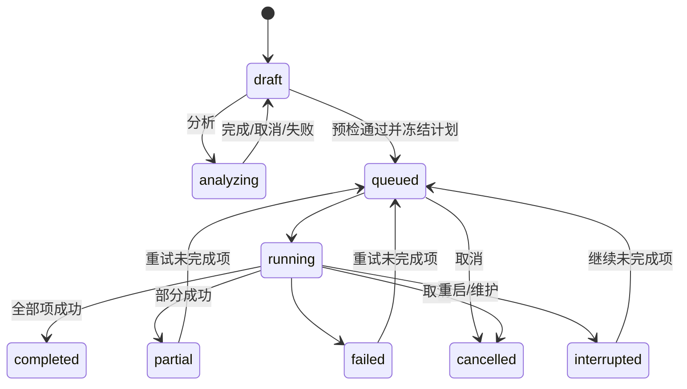

# 视频工作台：合并、去片头与高清替换

2026-10-10，Ready（主代理按已授权的“设计后开发”收敛，解除P-008阻碍）。对应源AC-10、Q1–Q4、Q7–Q9与TC-20–TC-23，概要决定见[D-MW-EDIT](概要设计.md#D-MW-EDIT)。本合同不改变清理、超分、播放代理或回收站的既有行为。

## 责任与复用

新增`VideoEditService`（`services/video_edit_*.go`）拥有编辑配方、冻结计划、执行日志和工作目录；App只接线。它不是清理或超分的扩展：清理拥有候选与集中整理，超分拥有模型管线，二者都没有多素材时间线与轨道映射。

| 复用点 | 用法 | 不做的事 |
|---|---|---|
| `MediaWorkSlot` | 分析与每个导出项执行前各取一次 | 不另建并发槽 |
| `MediaProbeService.Refresh` | 成品入库后刷新技术快照 | 预检自己跑一次有界ffprobe读取附件/侧数据，不写快照表 |
| `ffmpegFrameHashRawFrames`同类读取器与`clipHashInformative`/汉明判定 | 片头检测与分段对齐的粗召回 | 不读写`video_frame_hash_sequences`，不改清理阈值；两秒指纹只作参考，切点一律局部细化 |
| 超分`publishOutput`的发布方式 | `lockLibraryPaths`内Lstat+库记录占用检查→rename→同事务建`videos`行与`syncShortVideoTagForVideo` | 不建同源关系（编辑结果与原片内容不同），不复制元数据 |
| `SubtitleFileWriter` | 成品旁挂`.srt`的写入 | 不覆盖已存在文件；成品名保证`.srt`同名也空闲 |
| 既有删除/废纸篓（`DeleteVideos`与前端`DeleteConfirmDialog`） | 原片清理 | 编辑服务从不删除来源 |
| `BackgroundTaskRegistry`、退出确认、维护围栏 | 键`video_edit`；有排队/运行项时退出先确认；维护前停止并把运行项标中断 | 不新增任务事实库 |

## 三种任务与配方

所有时间为整数毫秒；`video_id`引用片库活跃视频。配方存为带`"v":1`的JSON，修改须带`expected_revision`。

- **顺序合并 merge**：`sources[]`按用户顺序（2–50个）。默认输出规格取第一个来源；来源分辨率/帧率/动态范围不同时，预检返回规格选项，用户必须选定`spec_source_video_id`才可导出。
- **批量去片头 trim_intro**：`items[]`每项一个来源和一个移除区间`remove_start_ms < remove_end_ms`（1–200项，每项单独产出）。两种来源均支持（Q1）：
  - 统一时间：填写统一区间后批量写入每项，再可逐项调整，`origin=uniform|manual`。
  - 自动识别：≥2项时分析重复片头，写入`origin=detected`及置信度；未识别项明确标`undetected`，必须手填或移出。所有项`confirmed=true`后才可导出。
- **高清替换 hd_replace**：`long_video_id`为主时间线，`hd_video_id`为高清来源。`segments[]`为`{long_start_ms,long_end_ms,hd_start_ms,hd_end_ms,audio_source:"long"|"hd",origin,confirmed}`；长版区间不得重叠，`hd_end-hd_start`须等于`long_end-long_start`（不变速，Q7）。未覆盖的长版区间保留长版画面。音频默认长版，可逐段切到HD来源（Q3）；字幕始终沿长版时间线（Q9）。

## 分析：片头识别与分段对齐

分析是可取消的后台操作（同一时间一轮），状态`analyzing`，进度经`video-edit-state`事件。读取帧用参数数组的`ffmpeg -fflags +discardcorrupt -i <src> -vf fps=4,scale=9:8:flags=area,format=gray -f rawvideo pipe:1`（片头只读前`min(时长,600s)`，可设1–20分钟），按72字节一帧计算dHash；结果只驻内存与`analysis_json`。

- **片头**：两两寻找最长的恒定偏移连续匹配（汉明≤8、低信息帧不计票、至少10秒），以与最多其他项匹配的一项为参照，得到每项`[start,end]`。再对两端±1秒取原帧率32×32灰度帧，以平均绝对差定位首/末匹配帧，精度到帧。多个等长候选或无匹配均不猜，标`undetected`/`ambiguous`。
- **高清对齐**：两侧全片4fps指纹。HD每秒取一个有信息量的锚点，在长版全序列中暴力找最小距离（≤8，且次优需差≥3或位于同一偏移附近，否则该锚点作废）。相邻锚点偏移一致（±1步）连成段，间隔≤3秒的同偏移段合并，短于3秒的段丢弃；段边界先按4fps外扩，再按片头相同方法做帧级细化。输出段按长版时间排序；长版区间冲突时保留匹配率高者并把另一段标`conflict`。变速、镜像、裁剪不做匹配（Q7），表现为未匹配区间。
- 分析结果写入配方时`confirmed=false`；用户逐段预览、调整、确认（Q2）。分析失败或取消不改已确认的配方项。

## 预检、规格与轨道映射

`PreflightEditProject`对每个来源跑`ffprobe -show_streams -show_format`（30秒期限，输出上限与`MediaProbeService`相同），返回：

| 字段 | 内容 |
|---|---|
| `sources[]` | 时长、视频流（编码、宽高、帧率、像素格式、色彩、HDR/杜比视界侧数据）、音频流（编码、语言、声道、标题）、字幕流（编码、文本/图形）、字体附件数、同名旁挂字幕 |
| `output` | 容器、视频编码、宽高、帧率、像素格式/色彩、音频编码；预计大小与输出目录、工作目录可用空间 |
| `tracks` | 输出音轨/字幕轨与每个来源（或HD段）映射到的流序号，或`silence`/`none`；无法按语言+序号对应的项列入`conflicts`，须用户明确选择（Q9） |
| `fast` | `available`与不可用原因；可用时列出每个切点的请求时间和实际关键帧时间（Q8） |
| `warnings[]` | 需确认的限制，如“长版画面将放大到1920×1080”“图形字幕跨切点的一条会被截断”“旁挂.ass不随成品复制”“杜比视界元数据无法保留” |
| `errors[]` | 阻止导出：来源缺失/失效/变化、编码器不可用、HDR与SDR混合、未选规格、未解决映射、区间越界或重叠、空间不足 |

规则：

- 输出规格：merge取所选来源；trim取各自来源；hd_replace取HD来源的宽高，长版段按比例缩放并居中加黑边，不裁切（警告必须确认）。帧率取规格来源。HDR与SDR混合返回`hdr_sdr_mix_unsupported`，不偷偷映射色调。
- 容器：来源都是mp4/mov且映射后没有字幕流、附件或多于一条音轨时保持mp4，否则mkv。
- 编码器：macOS用`h264_videotoolbox`/`hevc_videotoolbox`（HDR或HEVC来源走HEVC Main10并保留色彩元数据），其他平台用`libx264`/`libx265`；以`ffmpeg -encoders`探测，缺失返回`encoder_unavailable`，不换用其他编码。码率取规格来源视频码率（缺失时按大小×8/时长估），夹在2–80 Mbps。音频精确模式统一AAC、48kHz、保持声道数。
- 旁挂字幕：同名`.srt`经`subtitleparser`按时间线重写（切掉区间内条目、跨切点条目截断、后续平移；merge按累计偏移拼接）；hd_replace复制长版`.srt`。其他旁挂格式只给警告。
- 内嵌字幕与附件：文本/图形字幕按片段随剪切复制；mkv字体附件从全部来源按文件名去重后附加。

快速模式只在以下条件全部成立时可选：所有参与片段的每条映射流编码参数一致（编码、profile、宽高、像素格式、帧率/时基、音频编码/采样率/声道），无`silence`/`none`填充，且无缩放。切点向前取到不晚于请求时间的关键帧（`ffprobe -skip_frame nokey -read_intervals`窗口查询），预检返回实际时间；用户确认的是实际时间。不满足时返回原因，不静默改为精确模式。

## 执行与发布

`QueueEditProject(id, expected_revision, acknowledged_warnings)`重新预检，存在错误或未确认的警告即拒绝；通过后为每个输出项冻结`plan_json`：来源路径与`size:mtimeNS`、片段列表（来源、入点、时长）、映射、编码参数、输出目录与计划文件名。排队后配方只读。单worker按项ID先进先出：

1. 取`MediaWorkSlot`；核对来源指纹，变化报`source_changed`，缺失报`source_missing`。
2. 以`statfs`检查输出目录与工作目录（输出目录下隐藏的`.cineinsight-edit-<itemID>/`）可用空间≥预计大小×1.2，否则`disk_full`。
3. 精确模式逐段`ffmpeg -ss <in> -i <src> -t <dur> -map …`重编码为统一规格的mkv片段；快速模式逐段`-c copy`。之后用concat demuxer`-c copy`拼接为工作目录内`final.part`（显式`-f`指定容器）。进度来自`-progress pipe:1`。
4. 校验：ffprobe读取成品，时长与计划差≤max(0.5秒,0.5%)，流数量与映射一致；再次核对来源指纹。
5. 发布：在`lockLibraryPaths`内选择不冲突的文件名（`<名称>.<ext>`，被文件/旁挂.srt/库记录占用时依次试` (2)`… ` (99)`，均占用报`output_conflict`），先把`publish_target`与`staged_size`写入项行，再rename，然后单事务创建`videos`行、同步短视频标签并把项置`completed`+`output_video_id`。事务失败把文件移回工作目录并报`publish_failed`。事务外刷新技术快照，写旁挂字幕（失败只写警告）。
6. 任一失败：删工作目录，`error_code`取`source_missing|source_changed|disk_full|encoder_unavailable|encode_failed|verify_failed|output_conflict|publish_failed|cancelled|interrupted`，ffmpeg stderr只留尾部2KB并擦除路径。

取消：排队项直接`cancelled`；运行项取消context、等待ffmpeg退出并清理后`cancelled`。已发布项保持完成。应用启动：`running`/`queued`项改`interrupted`，`publish_target`存在且文件大小等于`staged_size`而没有库记录时补做第5步的事务，否则删除该文件以外的工作目录并标中断；只删匹配`.cineinsight-edit-<数字>`且对应项不在运行的目录。中断/失败项可“继续未完成项”，重新预检并冻结，已完成项不重做。

维护与退出：维护前停止worker，运行项标`interrupted`；有排队/运行项时退出走既有退出确认。数据库读写全程带context，SQLite与PostgreSQL行为一致。

## 状态模型

新增两个`AllModels`成员（排在`videos`之后，都不带非零gorm default）：

- `video_edit_projects`：`id`、`kind`、`title`(≤200)、`status`、`revision`、`mode`(`precise|fast`，新行显式写precise)、`recipe_json`、`analysis_json`、`acknowledged_json`、`error_code`、`error_message`、`created_at`、`updated_at`、`queued_at`、`finished_at`。索引`(status,id)`。
- `video_edit_items`：`id`、`project_id`→projects ON DELETE CASCADE、`seq`（与project唯一）、`status`、`phase`、`progress`、`plan_json`、`output_name`、`publish_target`、`staged_size`、`output_path`、`output_video_id`（逻辑引用，无外键，成品删除后保留历史）、`work_dir`、`error_code`、`error_message`、`started_at`、`finished_at`。

配方修改：`UPDATE … SET recipe_json=?, revision=revision+1 WHERE id=? AND revision=? AND status IN ('draft')`，零行时重读并返回`edit_project_conflict`。状态迁移均为带当前状态谓词的条件更新；worker是项状态的单写者。不使用数据库锁。

## 接口

App新增（`app_video_edit.go`），全部有前端调用方：`CreateEditProject`、`ListEditProjects`、`GetEditProject`、`UpdateEditRecipe`、`AnalyzeEditProject`、`CancelEditAnalysis`、`PreflightEditProject`、`QueueEditProject`、`CancelEditProject`、`RequeueEditProject`、`DeleteEditProject`（仅非排队/运行，不删成品）、`GetVideoEditStatus`。事件`video-edit-state`只带项目/项ID、状态与进度。

帧预览使用与场景检索共用的`/preview/frame/{videoID}?ms=&w=`（`ThumbnailService.RenderFrameAt`）：精确定位抽一帧JPEG（默认宽480，夹在64–960），10秒期限、最多2个并发、内存LRU 64帧并按源size/mtime失效，不暴露路径。

`DuplicateEditProject(project_id)`（2026-10-11补充）：以任意状态项目的配方新建草稿副本（标题加“（副本）”、revision=1、不复制分析结果与已确认警告），供排队后配方只读、来源变化导致预检不再通过的失败/部分成功/取消/中断项目重新编辑；原项目、执行项与成品不变。

## 界面

新增“视频工作台”页面（顶栏入口与命令面板），左侧项目列表（状态、进度、取消/继续/删除），右侧按类型编辑：

- 合并：来源排序、规格选择、轨道映射表。
- 去片头：统一区间“应用到全部”、逐项区间编辑、“自动识别片头”、逐项/全部确认。
- 高清替换：长版/HD选择、“自动对齐”、段列表（长版与HD首尾帧并排、±1帧/±1秒/毫秒输入、音频来源、确认）、未匹配区间提示。

每个切点显示切点前后帧（快速模式显示实际关键帧）。导出前展示预检的规格、映射、警告与空间。完成后“预览成品”打开详情抽屉；“确认成品无误”勾选后才出现“清理原片…”，调用既有删除确认与废纸篓（TC-23）。hd_replace与trim成品可一键“与原片建立版本组”（调用版本分组接口，用户确认）。

入口：片库批量栏“合并为新视频”“批量去片头”，行菜单“高清替换…”。

## 验证

| 场景 | 证据 |
|---|---|
| TC-20 合并/统一剪头+逐项/自动片头 | ffmpeg合成夹具（带时间码画面、两条音轨、文本字幕）：成品时长、切点帧、轨道数；片头检测用共享片头的合成剧集；旁挂srt重写单测 |
| TC-21 删减/插入后的多段替换 | 合成长版与删去/插入片段的HD版：对齐段数与偏移、帧级边界误差≤1帧、未匹配区间保留、音频来源切换 |
| TC-22 取消/崩溃/磁盘不足/输入变化/重名 | 服务单测：取消清理工作目录、启动对账、`disk_full`桩、来源指纹变化、` (2)`命名与库记录占用；原片字节哈希不变 |
| TC-23 原片清理 | 前端：未确认成品不出现清理入口；清理走既有删除对话框 |
| 双后端 | SQLite与一次性PostgreSQL的项目CAS、状态迁移、迁移往返 |

真实多轨/HDR素材、长片性能和图形会话由用户真机验收。

## 实现与验证记录（2026-10-11）

实现与合同的差异（均为细化，不改变业务边界）：预检返回`outputs[]`（每个导出项一份规格、音轨/字幕映射与片段列表）而非单个`output`与顶层`tracks`；精确模式片段内音频用PCM、拼接时一次编码AAC，避免逐段编码器延迟累积；片段时长对齐整帧，<50ms碎片跳过；新增映射选项`drop`（整条输出轨不导出，图形字幕无法“空白”时的唯一出口），文本字幕`none`用不可见40ms占位；文本字幕统一为`srt/ass/webvtt`；取消为异步（ffmpeg退出并清理后置cancelled）；磁盘检查要求可用≥（预计成品+片段空间）×1.2。分析由纯计算包`services/editalign`实现（4fps dHash、锚点暴力最近邻+次优拒绝、链/合并/外扩，再以原帧率32×32灰度帧做帧级细化；灰度读取器用framecrc旁路取真实PTS，需ffmpeg≥5.1）。

验证：编辑服务24个测试含7个真实ffmpeg端到端（三源合并、精确/快速去片头、参数不同拒绝快速、高清替换、mp4输出、字体附件去重）与2个真实分析端到端（4集共享12秒片头的识别、含删减/插入/静止彩条的高清对齐，边界与真值一致）；editalign 32个测试含真实ffmpeg夹具，2小时对2小时对齐基准约0.2秒。服务7个、editalign 8个、前端3个、复制草稿1个承重变异均被检测。SQLite全量、一次性PostgreSQL定向通过；前端全量与绑定消费守卫通过。真实多轨/HDR/杜比视界素材、PGS字幕、开放GOP快速切点、Windows与图形会话由用户真机验收。

独立差异评审（2026-10-11）报2 Important与若干Minor，已修正并补先红回归：认领后立即检查停止标记，维护/退出不再等完一整次编码；快速模式关键帧查询按容器`start_time`换算（mpegts等），切点取整到关键帧毫秒并加`-copypriorss 0`，显示切点与实际一致；错误文本先替换已知来源/工作/输出路径（含空格）再走正则；高清替换旁挂字幕一律按分段重写；快速模式切点落在上一保留段末尾之前报`fast_cut_invalid`；成品已不在片库时不出现确认与清理入口；worker只认领本进程启动后排队的项目；输出名检查的文件系统错误报`output_unavailable`，成品基础名上限180字节；指向普通文件的符号链接来源可用；最终rename在darwin/linux用排他rename（RENAME_EXCL/RENAME_NOREPLACE，撞名换下一个空闲名，最多5次），其他平台在路径写锁内Lstat后rename，与超分发布同级。遗留：B帧来源的快速切点在段内可能晚约2帧。
