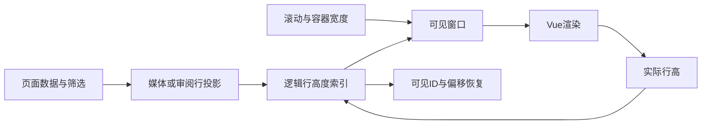

# 片库性能与媒体工作台 · 实施合同

状态：v0.1，2026-10-10。需求 Q1–Q14 已确认；本文按能力完善实施合同。性能和诊断优先，其余能力的技术选择仍为 proposed，不能把本文件存在视为全部设计已完成或全部功能已实现。

来源：[requirements.md](../../../../.loopx/intake/2026-10-10-media-workbench/requirements.md)、[概要设计](概要设计.md)。已完成的局部修复分别由[图片选择合同](../2026-08-07-image-library/需求设计文档.md#D-IMAGE-SELECTION)、[发布名称合同](../2026-10-10-release-packaging.md#D-RELEASE-NAME)拥有。

## 1. 现有所有权与不可绕过的边界

| 能力 | 现有证据与复用点 | 新实现的边界 |
|---|---|---|
| 视频/图片候选查询 | `AITaggingService.ListCandidatePage`、`ImageAITaggingService.ListImageAITagCandidatePage`；`aiTagReview.js` 的关键词匹配 | 查询仍由对应服务拥有；审批仍调用其事务，不由 App 直接写关系表 |
| 列表窗口 | `VirtualVideoList.vue`、`utils/virtualList.js`、照片二维窗口 `photoGrid.js` | 保留全部标签、动态行高及 `.main-view` 滚动宿主；Mac WebKit 守卫须有实测才能解除 |
| 任务与运行时 | `GetTaskCenterSnapshot`、watcher / subtitle / face / enhancement / semantic / proxy 状态方法 | 诊断是 App 的只读投影，不另建任务数据库，不暗中跑重建或修复 |
| 媒体与播放 | `VideoService`、`PreviewDrawer`、IINA 与 Jellyfin 适配层 | 新消费能力不改既有随机计分、统计来源和删除语义 |
| 媒体处理 | `MediaProbeService`、`MediaWorkSlot`、`frame_hash_service.go`、`clip_verify.go` | 编辑服务拥有新时间线，既有两秒指纹只是粗召回，不修改清理阈值来满足剪辑 |
| 产物与删除 | 超分原子发布、`AddVideo`、`TrashService`、系统废纸篓 | 导出是新文件；来源清理单独确认并沿用已存在的删除合同 |

所有新表在 `models.AllModels()` 中按外键拓扑注册，并纳入迁移往返夹具。并发持久状态采用条件更新/版本比较和事务，不新增应用控制的数据库锁。实际新增模型前必须补齐本文件相应数据合同。

## 2. 审阅查询与批量操作

实施依据：[D-MW-PERF](概要设计.md#D-MW-PERF)。首要收益是避免全量详情跨 Wails IPC 和 DOM 渲染；不以额外派生搜索库作为默认方案。

### 查询合同

`ReviewSearchRequest` 包含 `media_id`（0=全部）、`keyword`、`tag_id`（0=全部）、`confidence`、`status`（空=pending）、`cursor_id`（0=首屏）和 `limit`（默认50、最大200）。视频、图片由各自服务入口调用同一私有查询辅助能力，不把媒体类型交给 SQL 标识符拼接。

结果沿用现有 `items / next_id` 页形状。结构筛选下推 SQL，按候选 ID 倒序；关键词覆盖文件名、路径、已有标签名、建议名、匹配标签名和理由。优先用有界批次筛选、只水合命中的一页，避免 SQLite/PG 的 `LOWER` 差异改变 Unicode 匹配；中文、Unicode 大小写、`%`、`_`、反斜杠与跨字段不匹配都需对照前端旧规则。后续全文索引只有在前后基准证明必要且检索语义一致时再选型。

游标指向已消费的稳定候选 ID，不以数组长度计算。搜索/筛选变更重置游标并丢弃过时响应；下一页复用同一筛选快照。单项操作更新本地已加载数据，当页处理空且还有后页时补页。搜索错误保留旧内容并显示错误，不把它当空集。

查询实现选定（2026-10-10）：新增视频/图片各自的 `Search*AITagCandidatePage(request)`，无筛选入口保留现有分页接口。服务内每批最多256条只读名称/路径/建议名/匹配标签名/理由，必要时按当前批媒体ID读取标签关系；全局标签词表按ID分页读取，只保留命中标签ID。匹配用与前端样例对齐的 Unicode 小写与字面子串，命中的至多一页再由既有 DTO 水合；不把查询词写日志。读取有 context，可取消；多次 SELECT 是当前数据的观察，不承诺全局事务快照。全量审批的冻结合同不借此推断，仍按下节独立实现。

视频与图片候选新增 `(status, id DESC)` 非唯一索引。现有视频 `(status, approved_at)` / `(status, rejected_at)` 索引服务质量统计，保留不动。临时 SQLite 等价表的 EXPLAIN 显示旧分页使用 `status_rejected` 并建立 ORDER BY 临时 B-tree，新增索引后变为 `status=? AND id<?` 的有序范围读取；实际 GORM 夹具及一次性 PostgreSQL18 的索引存在/查询回归已通过。索引随现有 AutoMigrate 纯增量创建，不改变数据字段、状态、主键、外键或删除行为。

前端输入防抖200ms，查询身份与ID游标共同拒绝过时页；失败保留上次结果，筛选尚未成功时禁用该筛选的批量按钮。同源/汇总独立于关键词代次，首次慢加载不会被搜索丢弃；辅助读取加载或失败不显示为零/空集。标签选项合并完整标签库，未加载候选的标签仍可选择。

### 两种审批范围

- 已加载结果：在按钮点击时冻结当前可批准候选 ID，沿用现有逐项审批。
- 全部筛选结果：先取预览，返回令牌、候选数量、到期时间；成员集合和候选版本留在所属服务的进程内预览状态。确认只消费此令牌，不重新按过滤器扩大集合。预览过期/重启失效需重新预览，不能自动新建并批准。
- 每项执行前复查 pending、媒体可批准、标签可用及预览中的候选版本；失效项报告，不把用户看到的旧候选改批成新内容。逐项事务保持部分成功语义。
- 预览集合有生命周期和容量上限，达到容量时明确拒绝新预览。执行、取消/维护、容量与令牌合同已收敛到[批量审阅合同](批量审阅合同.md)，依该合同实施；不能把查询分页本身当成批量审批已经完成。

### 渲染与测量

审阅窗口必须同时覆盖“很多媒体”和“单媒体很多候选”，不能只限制媒体组数。选择/审批范围基于数据，不能绑定可见 DOM。视频网格使用二维行窗口，每行高度取同排最高卡片的实际测量值，窗口宽度或标签变化后以可见媒体 ID 重锚定。图片网格沿用既有实现。

#### 渲染实施合同（P-011）

继续由 `VirtualVideoList` 拥有滚动宿主、几何缓存与测量；`virtualList.js` 提供同一套可复用的高度索引。采用按逻辑行存储的前缀和树：初次构建/数据重排为O(N)，高度修正、视口定位和前缀查询为O(log N)，滚动事件不再遍历整份数据。已有纯计算入口和rangeEngine调用形状保持，未传入可复用索引时构造同一实现的一次性索引，不维护第二套计算规则。

- 列表一项一行；网格按当前列数分行，每行高度取同排卡片的实测最大值，行间距单独计入。宽度由容器实际宽度决定，网格保留200px最小列宽与12px间距。可见卡片放在内部grid，外层上下占位为普通块，避免占位节点参与网格排版或重复计入间距。
- 测量使用实际CSS像素，候选/标签保持全文和自然换行；不以固定高度裁掉内容。索引是视图派生状态，选择、筛选、批准范围始终来自页面数据，与可见DOM无关。
- 宽度、列数或密度改变时，先按旧高度索引与旧列表位置确定可见媒体ID/像素偏移，再重建新几何；等Vue提交占位和窗口后恢复锚点。测量修正同样保留真正可见的行，不能把overscan首行当成锚点。行变矮时将内部偏移夹在该行范围内；被移除的锚点维持当前滚动位置，交给宿主作边界钳制。
- 数据追加/原地更新保留同查询的锚点；关键词/筛选组成的queryKey变化开启新范围，不能恢复上个查询的锚点。Vue提交后合并测量，布局重建期间不测旧窗口；连续重建保留首个恢复位置，落定后才判断加载更多。异步测量带布局代次；过时测量、旧查询和卸载后回调不回写滚动位置。
- 首页仍以`.main-view`为宿主，新增active传入pageActive，隐藏的视频页暂停监听/测量，不能响应图片页在共用宿主上的滚动。激活恢复只归`VirtualVideoList`所有，删除父页独立的像素回写：离开前保存本页可见ID/偏移与顶部位置（包含0），隐藏时数据和宽度变化只标记待重建；激活后提交布局再恢复，回调核对活跃状态、查询及布局代次。无锚点或锚点已删除时仅恢复本页旧像素并由宿主钳制。父页原地刷新通过相同的capture/restore入口，隐藏时只更新待恢复状态；旧查询返回的锚点不可生效。`scrollToItem`也遵守活跃/查询代次，不对共用宿主的其他页面写入。覆盖隐藏期间变宽/删行、顶部0及快速往返切页。审阅窗口显式使用各自滚动容器。找不到宿主时保留现有错误提示及原有完整渲染行为，不在正常大库路径中使用该分支。
- 两侧审阅将媒体组投影为“媒体头 + 逐条候选”的稳定键列表，复用上述窗口；不把一个包含十万候选的组当成一个不可拆行。通过小型`ReviewCandidateWindow`封装投影和上下文提示，候选业务动作仍在原面板；本组批准依然针对该组全部已加载数据。

不直接移除Mac WebKit守卫：先修复并在现有原生WKWebView夹具复验宽度变化，再用实际列表/网格/审阅组件验证首尾、追加、删除、标签换行和隐藏页面；达到这些验证后再启用Wails/WebKit主列表与网格窗口。jsdom只验证状态与调用，不能代替原生布局证据。滚动DOM数量、几何计算成本、锚点误差分别记录，不把后端搜索毫秒数当作界面帧率。

基准记录放在本设计目录，包含机器、后端、夹具生成种子、行数、标签/命中分布、命令和原始结果。SQL 使用临时库，禁止为测试改用户片库。WebKit 缺少实际图形验收时明确保留该限制，不能用 jsdom 或 Chromium 结果证明其修复。

## 3. 运行状态与诊断

实施依据：[D-MW-HEALTH](概要设计.md#D-MW-HEALTH)。扩展任务中心的入口，新增独立 `SystemHealthPanel.vue` 承载状态，不把页面逻辑继续塞入 `App.vue`。

### 分项读取

App 在 `app_health.go` 组合已有服务。`GetSystemHealthSection(section)` 只接受 `database / storage / runtimes / indexes / tasks / caches` 六个 key，未知值返回明确错误。前端分项并发读取并逐项显示结果，不等待最慢的一项才展示整个页面；重开/刷新以请求代次隔离旧响应。

启动失败页也提供同一诊断面板，供数据库未初始化时查看和导出；该入口关闭处理动作，只保留读取与导出，不挂载原任务中心或假装可以进入未就绪的设置页。

返回 `HealthSection {key, checked_at, items[]}`；每项 `HealthItem {key, label, state, reason_code, detail, local_detail, action_id, metrics[]}`。

| 字段 | 合同 |
|---|---|
| `key / label` | 固定能力标识/中文名称；磁盘用本次快照中的序号 key，不以路径作导出键 |
| `state` | `ok / warning / unavailable / disabled / unknown`；未知绝不映射成正常 |
| `reason_code` | 由聚合层白名单映射的稳定码，不直接使用错误文本 |
| `detail` | 聚合层生成的用户解释；不得混入原始异常、凭证或请求地址 |
| `observed_at` | 缓存状态的原检查时间；与分区本次读取时间分开，也进入安全报告，不能把旧缓存伪装为刚检查 |
| `local_detail` | 仅本机界面需要的根路径等定位信息，导出剔除 |
| `action_id` | 已有命令注册表中的固定动作，例如打开字幕设置、扫描目录设置、任务中心；不接受任意可执行绑定名 |
| `metrics` | 有名称的数值与单位；不可用的值缺席，不用 0 伪装读取成功 |

数据库维护、待重启与未初始化沿用 `databaseUnavailableReason`；依赖数据库的部分返回不可读，其余进程状态正常返回。存储读取 watcher 的既有状态；disabled 表示监听关闭，不能因此推断磁盘离线。字幕运行时读取既有有界探测/缓存，检查不自动安装。运行时能力、索引覆盖和缓存用量由原服务提供，不在 App 重写 SQL 口径。

昂贵或会访问网络盘的深度检查不在默认读取里执行；“重新检查/准备/重建”跳到对应已有入口，由用户显式触发。轮询只在面板可见时进行，首版以手动刷新和现有状态事件为主，不能让隐藏诊断页持续制造负载。

2026-10-10 独立审阅修正：默认运行时分区只读取字幕/人脸服务已经产生的缓存快照，不执行 Python import 或解释器版本命令，也不调用人脸镜像配置回调；无快照标记“尚未检查”，已有快照带原检查时间并明确为缓存。索引读取采用服务拥有的有期限 profile/计数查询，不调用会同步读配置的旧 `Status()`，展示的是已发布索引数据而不是外部查询接口的可达性。数据库、目录、备份和缓存的新增诊断查询同样全程传递 context；设置读失败时指标缺席。缓存默认只聚合数据库已登记的代理占用，磁盘孤儿文件计量留给既有显式缓存管理入口，不能把未计量报成零。

复审补充：任务分区读取 `IdleGate.WaitingSnapshot` 的内存等待清单，不调用会读设置并启动系统探测的 `GetIdleSchedulerStatus`。等待锁正被占用时该指标缺席并显示未知，不等待、不输出假零；已有运行中计数仍来自登记表。

### 本地导出

`ExportSystemHealthReport()` 先打开原生保存对话框；取消返回 `saved=false`，不写文件。导出由后端重建白名单 DTO，不接收前端任意 JSON、日志内容或任意待读取路径。

`DiagnosticReport {schema_version:1, generated_at, platform, architecture, backend, sections[]}`。section/item 只含固定 key、归一化 state/reason_code、检查时间和数值指标；不含 local_detail、媒体名、目录/用户名称、模型请求正文、图片、字幕、原始日志、接口地址、Cookie、Authorization 或 API Key。未识别错误只记 `check_failed`。

输出只写用户选定的本地文件；新建以排他方式避免覆盖既有文件。写出失败不宣称成功，清理本次未完成输出时必须确认仍为本次创建的文件。不开 HTTP 诊断端点，不上传报告。接口返回 `saved / message`，不回传报告里的私密路径。

安全回归使用带密钥、绝对路径、媒体名和控制字符的伪造提供者，逐字检查报告不含这些标记。保存取消、目录不可写、同名文件、数据库维护、单提供者失败均需验证。此范围属于敏感信息边界，精确 diff 必须独立只读评审后才能声称完成。

## 4. 其他能力的合同收敛

以下为选定方向与必须补齐的实施约束，尚不授权用字段猜测直接建表。

| 能力 | 已明确的实现约束 | 尚需完成的技术证据/合同 |
|---|---|---|
| 书签 | `video_id`、时间点/区间、标题、备注、源指纹；时间用整数毫秒/微秒；源变化提示复核；笔记不随媒体物理删除丢失 | 已按Q18收敛到[书签与日记合同](书签与日记合同.md)，合同评审已闭合，实施中 |
| 选片 | 复用 `LibraryFilter`；本次可用时间属于独立选片请求，不新增通用筛选字段；规则推荐不改随机计分 | 已收敛到[选片助手合同](选片助手合同.md)，P-012已实施并验证 |
| 队列 | 持久队列顺序；重启暂停；完成事件附队列版本/播放会话并幂等推进；失败暂停而不私自跳片 | IINA IPC 支持真机验证；队列修改/完成并发的 CAS、具体模型及客户端范围 |
| 多版本 | Q15：观看进度、已看、评分均按文件独立，分组只汇总；新分组不替代作品集或同源关系；文件级元数据与进度独立；建议经确认后建组 | 已收敛到[版本分组合同](版本分组合同.md)（2026-10-10 Ready） |
| 日记 | Q16：真实观看自动进入回顾并可手动补记；外部启动历史单列；手动日记和原始播放事实分开；影片/日期/当次评分/短评快照；缺失历史不回填 | 已按Q17–Q19收敛到[书签与日记合同](书签与日记合同.md)，合同评审已闭合，实施中 |
| 场景 | 字幕和画面分开索引、按模型空间隔离；源指纹和生成版本控制发布；SQLite/PG；本地优先、外部显式 | 已收敛到[场景检索合同](场景检索合同.md)（2026-10-10 Ready，含本机模型实测） |
| 视频编辑 | 持久配方与不可变执行计划；主时间线、分段映射、多音轨/字幕、精确/快速模式；新文件入库；来源清理独立确认 | 已收敛到[视频编辑合同](视频编辑合同.md)（2026-10-10 Ready） |

FFmpeg 的 streamcopy 只能复用编码包，滤镜处理需要解码/编码；concat 滤镜对对应流参数和片段时间戳有约束，不能把不同规格源直接串起来并承诺精准无损。依据：[FFmpeg streamcopy](https://ffmpeg.org/ffmpeg.html#Streamcopy)、[concat](https://ffmpeg.org/ffmpeg-filters.html#concat)。具体已安装构建支持的编码器/滤镜仍要在受控夹具中验证。

## 5. Verification Strategy 与交接

| 来源场景 | 合同 | 验证形式/当前状态 |
|---|---|---|
| TC-01–05 | D-IMAGE-SELECTION | 先观察 3 个新回归失败，再修复；当前全量前端 1466 项通过，构建通过 |
| TC-06–07 | D-RELEASE-NAME | macOS/Linux 中文临时产物归档与缺失输入通过；Windows 仅静态核对 |
| TC-08 | D-MW-PERF 查询 | 双库字段/Unicode/游标/有界水合及索引测试通过；组件分页/竞态/失败保留通过，临时库性能对比完成 |
| TC-09 | D-MW-PERF 审批 | 两侧冻结、过期/并发/取消/维护、提交与回放核对已实现；双库/race/独立复审通过 |
| TC-10 | D-MW-PERF 渲染 | 已完成高度索引/列表网格/逐条候选窗口与原生WKWebView复验；详见性能基线，完整Wails人工交互与RSS未测 |
| TC-11–12 | D-MW-HEALTH | 已实施；分项失败、nil DB、只读缓存、查询期限、白名单、真实临时文件写出/同名/符号链接、取消和启动失败入口回归通过，独立评审修正完成；原生保存对话框/故障磁盘未图形实测 |
| TC-13 | D-MW-BOOKMARK | 源版本、移动/重命名/删除回归；待详细合同 |
| TC-14 | D-MW-DISCOVERY | 完整范围/预算/未知时长/偏好/空态与播放接线已实现；双库、全量、独立复审通过，见选片助手合同 |
| TC-15 | D-MW-QUEUE | 重复 EOF、暂停/停止/失败、并发重排，真实播放器；待详细合同 |
| TC-16 | D-MW-VERSIONS | 双后端、游标、独立元数据和删除；见[版本分组合同](版本分组合同.md#验证) |
| TC-17–18 | D-MW-SCENES | 中文对白/画面固定语料、后半段、模型代际、双库、无许可零外发；见[场景检索合同](场景检索合同.md#验证) |
| TC-19 | D-MW-DIARY | 事实来源、日期、重复与历史空值；待详细合同 |
| TC-20–23 | D-MW-EDIT | 合成和真实多轨素材、分段对应、精确/快速切点、失败恢复/磁盘/清理；见[视频编辑合同](视频编辑合同.md#验证) |
| TC-24 | 独立项目 AC-11 | 子代理两份 proposed 方案已交付并由主代理核对范围；没有实现或集成，3图未渲染 |

基线：`go test ./... -count=1 -timeout 1500s` 默认后端退出 0，services 101.983s；不是 PostgreSQL 验证。`npm test` 退出 0，99 文件/1466 测试，362 个绑定均有调用；`npm run build` 退出 0，保留既有大 chunk 与静态/动态混合导入提示。

诊断交付：默认Go全量退出0（services178.099s），最后等待清单修复另跑App/服务定向与race退出0；go vet全仓退出0。最终前端100文件/1474项及所有脚本退出0，364个绑定有真实消费；Go1.24.9 Wails macOS构建退出0。10个Go、4个UI有效手动变异均被测试杀死，0存活，全部在overlay或隔离副本运行。

独立 `review_health_diff` 首轮3 Important/1 Minor、复审补1 Important均已逐项修正并对影响范围复审，无剩余实质发现；审阅前后SHA一致。启动失败只读入口单独复审通过。一次全量前端检查发现新弹窗没有沿用BaseModal深层样式约定，已改为scoped `:deep` 并重跑全量。生成models.ts的空白行tab由Wails生成器输出，未手工修剪；其余手写diff需保持格式检查通过。

### Design Contract Index

| 决定 | 源 AC | 实施范围 |
|---|---|---|
| [D-MW-PERF](概要设计.md#D-MW-PERF) | AC-01 | 查询、审阅、窗口与测量 |
| [D-MW-HEALTH](概要设计.md#D-MW-HEALTH) | AC-02 | 运行状态和本地诊断 |
| [D-RELEASE-NAME](../2026-10-10-release-packaging.md#D-RELEASE-NAME) | AC-03 | 已完成名称修复 |
| [D-MW-BOOKMARK](概要设计.md#D-MW-BOOKMARK) | AC-04 | 书签及回跳 |
| [D-MW-DISCOVERY](概要设计.md#D-MW-DISCOVERY) | AC-05 | 本地规则选片 |
| [D-MW-QUEUE](概要设计.md#D-MW-QUEUE) | AC-06 | 下一集与待播队列 |
| [D-MW-VERSIONS](概要设计.md#D-MW-VERSIONS) | AC-07 | 人工确认的版本分组 |
| [D-MW-SCENES](概要设计.md#D-MW-SCENES) | AC-08 | 双后端场景索引 |
| [D-MW-DIARY](概要设计.md#D-MW-DIARY) | AC-09 | 观影日记 |
| [D-MW-EDIT](概要设计.md#D-MW-EDIT) | AC-10 | 视频编辑 |
| [独立图片项目](../2026-10-10-image-editor-project/概要设计.md) | AC-11 | 只出方案，无实现 |
| [D-IMAGE-SELECTION](../2026-08-07-image-library/需求设计文档.md#D-IMAGE-SELECTION) | AC-12 | 已完成选择修复 |

本轮技术设计不新增审批仪式。已明确范围可推进基线、设计及实现；未完成的模型/接口/故障合同只阻止相应新增实现，不影响图片选择、发布修复或运行诊断。当前尚不能把全部新功能交接为可执行完成态。
