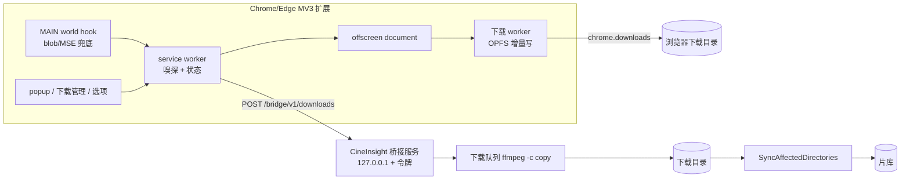

# 浏览器流媒体抓取插件与 CineInsight 桥接下载

## Goal And Boundaries

交付一个 Chrome / Edge Manifest V3 扩展，能在任意网页上嗅探出正在播放的流式媒体
（HLS `.m3u8`、MPEG-TS 分片、直链 `.mp4`/`.mkv` 等），列出可选码率与来源信息，并把
选中的流下载到本地；同时在 CineInsight 桌面端新增一条本地 HTTP 桥接通道，插件检测
到桌面端在跑时多出一个「发送到 CineInsight」的去处，由 Go 侧排队、用 ffmpeg 拉流、
落到用户指定目录并走既有扫描链路入库。

用户在开工前已裁决的三件事，本计划不重开：

- **两条下载路径都要**。插件内置下载器是默认路径，任何机器装上就能用；桥接是检测到
  CineInsight 时多出来的一个选项，不是替代。
- **只做 Chrome / Edge（MV3）**。Firefox 与 Safari 明确不在本批范围内。
- **功能做完整版**：AES-128 解密、master playlist 多码率选择、断点续传、直链 Range
  分块下载、blob/MSE 捕获兜底、请求头透传、文件名取自网页标题。

开工时补充确定、同样不重开的实现口径：

- **D-B01 浏览器内不做转封装**。MPEG-TS 流在浏览器内输出 `.ts`，fMP4 流输出
  `init + 分片` 拼接的 `.mp4`。想要规范 mp4 的走桥接，由 ffmpeg `-c copy` 无损转封装。
  理由：浏览器内 TS→MP4 remux（ADTS、时间戳不连续、纯音轨）边界情况多，产出坏文件的
  概率远高于收益，而这个能力在桥接侧已经免费拿到了。
- **D-B02 SAMPLE-AES 与 DRM 一律明确失败**。`METHOD=SAMPLE-AES`、`SAMPLE-AES-CTR`
  以及带 Widevine / FairPlay `KEYFORMAT` 的流，识别出来后直接报「受 DRM 保护，无法
  下载」并终止，不产出半成品文件，也不静默降级成"下载了但播不了"。
- **D-B03 桥接是独立的环回服务，不挂在手机端 feed 服务上**。手机端 feed 服务绑
  `0.0.0.0`、无鉴权，那条边界是"同一 WiFi 下能看能删"；桥接端点能让桌面端去取任意
  URL 并往磁盘写文件，风险等级完全不同。因此桥接单独监听 `127.0.0.1`，端口区间
  `18110..18130`，每个变更请求必须带令牌，CORS 只放行 `chrome-extension://` 源。
- **D-B04 下载任务既不进空闲门也不占 `MediaWorkSlot`**。空闲门只挡自动触发的任务，
  下载是用户显式发起的；`-c copy` 是网络与 IO 密集而非 CPU 密集，排到重媒体槽里会被
  超分、转封装这类长任务饿死。它自带一个并发上限。
- **D-B05 入库复用既有扫描链路**。下载完成后落到用户配置的下载目录，调既有的
  `SyncAffectedDirectories` 把那一个目录追平，缩略图与技术信息按既有路径自然产生，
  不另写一套入库逻辑。下载目录不自动加进扫描目录列表——那是用户的决定。
- **D-B06 令牌由桌面端生成、用户手工复制进插件**。不做自动配对、不做局域网发现广播。

全局约束：不改任何现有 Wails 导出方法签名与事件名；数据库只加列不删列，SQLite /
Postgres 双后端都要过既有测试基座；扩展不引入任何远端 CDN 依赖，全部代码本地打包，
无构建步骤（原生 ESM，直接「加载已解压的扩展程序」即可）；扩展除用户显式发起的媒体
请求与桥接的 `127.0.0.1` 之外没有别的网络出口，不做遥测；Claude 不提交、不推送。

非目标：Firefox / Safari 打包；DRM 解密；浏览器内 TS→MP4 转封装；绕过付费墙、登录墙
或反爬机制；下载内容的上传与分享；扩展商店上架材料；下载目录自动进扫描列表。

## P-001 扩展骨架与嗅探引擎

交付可加载的扩展骨架与它的核心能力：认出网页正在取的流式媒体。`manifest.json` 声明
MV3 所需的最小权限集合，service worker 通过 `webRequest` 的只读监听（不阻塞）观察
请求与响应头，按「URL 后缀 + `Content-Type` + 响应体特征」三路判定命中 HLS 播放列表、
独立 TS 分片还是可直接下载的媒体直链，并在命中时留存该请求的 `Referer`、`Origin`、
`User-Agent` 与 Cookie 归属信息——这些是后续能否取到分片的关键，事后无法补。

结果按标签页聚合、按规范化 URL 去重（同一条流被反复请求只留一条并累加命中次数），
标签页导航或关闭时清理，命中数量实时反映在扩展图标角标上。分片流只登记它所属的
播放列表，不把几千条 `.ts` 逐条列给用户。

完成的判据：在装载扩展后打开任意 HLS 播放页，角标出现计数，后台可查询到该标签页的
命中列表，每条命中带类型、URL、发现时间与请求头快照；关闭标签页后该页记录消失。

> writes: `browser-extension/manifest.json`, `browser-extension/src/background/**`, `browser-extension/src/common/**`, `browser-extension/icons/**`
> anchors: 嗅探 m3u8 / ts / 直链；按标签页聚合；请求头透传的采集端
> verify: `cd browser-extension && npm test`（嗅探判定与去重的单测）；人工加载扩展在 HLS 页面观察角标与命中列表
> review: 权限集合是否最小；请求头与 Cookie 快照不得写入任何持久化位置之外的地方，也不得随下载产物外泄

## P-002 HLS 播放列表解析器

交付一个不依赖浏览器 API 的纯解析模块，供下载引擎与 UI 共用，可独立单测。它要能解开
master playlist（`EXT-X-STREAM-INF` 的 `BANDWIDTH`、`RESOLUTION`、`CODECS`、
`FRAME-RATE`，以及 `EXT-X-MEDIA` 的独立音轨渲染）与 media playlist（`EXTINF`、
`EXT-X-BYTERANGE`、`EXT-X-MAP` 初始化分片、`EXT-X-KEY`、`EXT-X-DISCONTINUITY`、
`EXT-X-ENDLIST` 与直播判定），把相对 URI 按基址解析成绝对地址，并算出总时长。

加密信息按 D-B02 分级：`METHOD=NONE` 与 `METHOD=AES-128` 判为可下载并带出密钥 URI
与 IV（IV 缺省时按媒体序号推导）；`SAMPLE-AES`、`SAMPLE-AES-CTR` 或带 DRM
`KEYFORMAT` 的判为不可下载并给出明确原因。没有 `EXT-X-ENDLIST` 的直播流单独标记，
下载时按"从当前起录制"处理而不是假装它有终点。

完成的判据：单测覆盖 master / media / 加密 / 字节范围 / 初始化分片 / 直播 / 畸形输入
七类样本，畸形输入不抛异常而是给出可读的失败原因。

> writes: `browser-extension/src/common/hls/**`, `browser-extension/test/hls/**`
> anchors: master playlist 多码率选择；AES-128 识别；D-B02
> verify: `cd browser-extension && npm run test:hls`

## P-003 下载引擎：offscreen + OPFS + AES-128

交付扩展内置下载器的主干。MV3 的 service worker 会被随时回收，长下载不能待在里面，
因此实际传输放在 offscreen document 托管的 worker 里，worker 用 OPFS 的同步访问句柄
把分片增量落盘，避免把整个片子堆在内存里，也让断点续传有据可依：已完成分片数与写入
偏移持久化在扩展存储里，任务恢复时从下一个分片继续而不是从头再来。

分片按可配置的并发度取，失败按退避重试，重试耗尽则整个任务失败并保留断点。AES-128
分片用 WebCrypto 的 AES-CBC 解密，IV 取自 `EXT-X-KEY` 或由媒体序号推导；遇到未按
PKCS#7 补齐的分片（现实中存在）走一条不校验补齐的解密路径，而不是让整条流失败。分片
请求带上 P-001 采集的请求头，`Referer` / `Origin` / `User-Agent` 这类受限头通过
`declarativeNetRequest` 的会话规则附加，规则只作用于扩展自身发出的、不属于任何标签页
的请求。全部分片就绪后按 D-B01 拼接落盘并交给 `chrome.downloads`。

完成的判据：一条明文 HLS 与一条 AES-128 HLS 都能完整下载出可播放文件；下载中途关闭
popup 不影响进度；主动暂停后重启浏览器仍能从断点续传；DRM 流按 D-B02 明确失败。

> writes: `browser-extension/src/offscreen/**`, `browser-extension/src/download/**`, `browser-extension/src/background/**`, `browser-extension/test/download/**`
> anchors: 并发分片；断点续传；AES-128 解密；请求头透传；D-B01；D-B02
> verify: `cd browser-extension && npm run test:download`（解密、断点账本、拼接顺序的单测）；人工跑通明文与 AES-128 两条真实流
> review: 断点账本与 OPFS 文件是否可能不一致而产出静默损坏的文件；DNR 会话规则的作用域是否可能外溢到用户正常浏览的请求

## P-004 直链媒体的分块下载

交付非 HLS 直链（`.mp4`、`.mkv`、`.webm` 等）的下载路径，复用 P-003 的 OPFS 落盘、
重试与断点账本。先用一次 `HEAD` 或带 `Range` 的探测请求判断服务端是否支持范围请求：
支持则按固定块大小并发取、按偏移写入；不支持则退化为单请求流式写入，并如实告诉用户
这条流不支持断点续传，而不是假装支持。

完成的判据：支持 Range 的直链能并发下载并在中断后续传；不支持 Range 的直链能完整
下载且 UI 明确标注不可续传；两种情况产出的文件大小与服务端声明的 `Content-Length` 一致。

> writes: `browser-extension/src/download/**`, `browser-extension/test/download/**`
> anchors: 直链 Range 分块下载
> verify: `cd browser-extension && npm run test:download`；人工验证一条支持 Range 与一条不支持 Range 的直链

## P-005 blob / MSE 捕获兜底

交付网络层看不见流时的兜底：页面用 MSE 喂数据、只暴露 `blob:` 地址的情况。在
`document_start` 注入 MAIN world 脚本，挂钩 `URL.createObjectURL`、
`MediaSource.prototype.addSourceBuffer` 与 `SourceBuffer.prototype.appendBuffer`，
把 blob 地址还原成真实来源，并在用户为该标签页显式开启捕获后记录 appendBuffer 的
数据。

捕获默认关闭且必须由用户逐标签页开启：它要在页面内缓存整段媒体，内存代价真实存在，
不能替用户默认承担。开启后需要用户重新从头播放才能拿到完整数据，UI 要直说这一点，
而不是让用户拿到一段从中间开始的残片还以为是完整的。

完成的判据：在一个纯 MSE 播放页上，关闭捕获时命中列表只显示"检测到 MSE 播放，未捕获"，
开启并重播后能导出与页面播放内容一致的媒体文件。

> writes: `browser-extension/src/content/**`, `browser-extension/src/background/**`, `browser-extension/manifest.json`
> anchors: blob/MSE 捕获兜底
> verify: 人工在一个 MSE 播放页验证开关两态；`cd browser-extension && npm test`
> review: MAIN world 注入是否会破坏宿主页面的播放行为（挂钩必须透明转发，异常不得冒泡到页面）

## P-006 扩展界面：弹窗、下载管理与选项

交付三个界面。弹窗列出当前标签页命中的流：类型、分辨率与码率（master playlist 展开
成可选清单）、时长、估算体积，每条可下载、复制链接、复制等价的 ffmpeg 命令。下载
管理是独立页面而非弹窗内的一块——弹窗一失焦就关，长任务的进度必须有个关不掉的地方看，
它显示每个任务的进度、速度、剩余分片、暂停 / 继续 / 取消。选项页管并发度、重试次数、
文件名模板、默认输出目录规则与 MSE 捕获默认值。

文件名默认取自网页标题并按平台规则清洗（去掉路径分隔符与控制字符、限长、去尾部空点），
多码率时附上分辨率后缀，重名时追加序号而不是覆盖。

完成的判据：弹窗能反映真实命中并触发下载；下载管理页在弹窗关闭后仍能看到进度并操作
任务；选项修改后对新任务立即生效。

> writes: `browser-extension/src/popup/**`, `browser-extension/src/downloads-page/**`, `browser-extension/src/options/**`, `browser-extension/src/common/**`
> anchors: 多码率选择的用户出口；文件名取自网页标题；ffmpeg 命令导出
> verify: `cd browser-extension && npm run test:ui`（文件名清洗与命令拼装的单测）；人工走查三个界面

## P-007 桌面端桥接设置项与迁移

在 `models.Settings` 上加桥接所需的列：开关、令牌、下载目录、并发上限。开关与令牌
决定桥接服务起不起、认不认；下载目录是 D-B05 的落点，为空时桥接拒绝建任务并说明原因，
而不是替用户挑一个目录。

布尔列按仓库既有的硬规则处理：默认为 `false` 的开关零值即默认，不需要迁移；任何默认
为真或"0 是有意义取值"的列都不得带 `gorm default` 标签，默认值由新库 `ApplySchema`
带值插入、老库由显式迁移函数刷出。新增列要在 SQLite 与 Postgres 双后端上都通过。

完成的判据：老库升级后新列存在且取到预期默认值；新库初始化后同样；双后端测试都通过。

> writes: `models/video.go`, `database/database.go`, `database/*_test.go`
> anchors: D-B05；D-B06；仓库既有的 gorm default 禁令
> verify: `go test ./models/... ./database/...`，SQLite 与 Postgres 各一次
> review: 新列是否触碰双向迁移器的 `Unscoped().Create` 陷阱

## P-008 桥接 HTTP 服务

交付按 D-B03 收口的本地服务：只绑 `127.0.0.1`，在 `18110..18130` 取第一个可用端口，
随桌面端启动与退出。`GET /bridge/v1/ping` 不需要令牌，只回一个足以让插件认出
CineInsight 的最小标识，不泄露版本以外的任何信息；其余端点一律要求请求头里的令牌与
设置中的令牌按定长比较相等。CORS 只放行 `chrome-extension://` 形态的源——普通网页
带不上自定义令牌头且过不了预检，这是防止任意网站借环回地址驱使桌面端下载的第二道闸。

请求体沿用仓库既有的 JSON 纪律：必须是 `application/json`、限长、拒绝未知字段。桥接
关闭或令牌为空时服务不启动，已启动时改设置要能停掉。

完成的判据：令牌正确的请求通过、错误或缺失的被拒；非扩展源的预检被拒；开关关闭后
端口不再监听；单测覆盖鉴权、CORS、端口回退与请求体纪律。

> writes: `services/browser_bridge_server.go`, `services/browser_bridge_server_test.go`
> anchors: D-B03；D-B06
> verify: `go test ./services/ -run BrowserBridge`
> review: 鉴权比较是否恒定时间；`ping` 的信息暴露面；是否存在绕过令牌的路径；绑定地址是否确实不上局域网

## P-009 下载队列与入库

交付桥接背后的执行体：一个带上限的任务队列，每个任务用 ffmpeg `-c copy` 拉流落到下载
目录，从 ffmpeg 的进度输出解析已处理时长换算成百分比，支持取消，失败保留原因。按
D-B04，队列自成一档并发，不进空闲门也不占重媒体槽。

产物落盘后按 D-B05 调既有扫描把该目录追平，让视频以正常方式进入片库；扫描失败不吞掉，
任务状态要能区分"下载成功但入库失败"与"下载失败"。任务在后台任务登记表里占一个新的
固定 key，让设置页的任务面板与 Dock 角标能反映它。目标文件名冲突时另起名字，绝不覆盖
磁盘上已有的文件。

完成的判据：给定一条 HLS 地址与请求头能产出可播放的 mp4 并出现在片库里；取消能真正
终止 ffmpeg 且不留半截文件占位；下载目录未配置时建任务被明确拒绝。

> writes: `services/browser_download_service.go`, `services/browser_download_service_test.go`, `services/background_task_registry.go`, `frontend/src/utils/idleScheduling.js`
> anchors: D-B04；D-B05
> verify: `go test ./services/ -run BrowserDownload`；人工用一条真实 HLS 走通下载到入库
> review: 外部传入的 URL 与请求头拼进 ffmpeg 参数是否存在注入面；文件名是否可能逃出下载目录；取消路径是否有残留进程或残留文件

## P-010 Wails 绑定与设置页分区

把桥接的开关、令牌（显示 / 重新生成 / 复制）、下载目录选择、服务状态与任务列表接到
桌面端界面上，作为设置页的一个新分区，沿用既有分区的结构与样式令牌，不新造视觉语言。
令牌是凭据，界面上默认遮蔽、点一下才显示，重新生成时明确告知旧令牌立即失效、已配对的
插件需要重填。

完成的判据：在设置页开关桥接能看到服务状态随之变化；令牌可复制并能在插件里配对成功；
任务列表能看到进行中与失败的任务及失败原因。

> writes: `app_browser_bridge.go`, `main_bindings.go`, `app.go`, `frontend/src/components/settings/BrowserBridgeSection.vue`, `frontend/src/components/SettingsPage.vue`, `frontend/wailsjs/**`
> anchors: D-B06
> verify: `go build ./...`；`cd frontend && npm test`；人工在设置页走查

## P-011 插件侧桥接客户端

在扩展里加一条去处：探测 `127.0.0.1` 端口区间找到 CineInsight 后，界面上多出「发送到
CineInsight」；未探测到或未配对时这个入口置灰并说明原因（没检测到 / 需要填令牌 /
令牌无效），不是默默消失。推送的载荷带上流地址、类型、选中的码率、网页标题与 P-001
采集的请求头，让桌面端能取到同一条流。

探测有代价，不能每次开弹窗都扫 21 个端口：命中的端口缓存起来，失效时再重扫。

完成的判据：桌面端在跑且令牌正确时推送成功并能在桌面端任务列表里看到；桌面端未运行时
入口置灰且文案说明原因；令牌错误时给出可区分的提示。

> writes: `browser-extension/src/common/bridge.js`, `browser-extension/src/popup/**`, `browser-extension/src/options/**`, `browser-extension/test/bridge/**`
> anchors: 两条下载路径并存；D-B06
> verify: `cd browser-extension && npm test`（桥接客户端的状态分支）；人工在桌面端开关桥接两态下验证入口状态

## P-012 文档与集成验收

补齐两侧文档：扩展的安装与使用说明（含权限逐条为什么要）、桥接的配对步骤与安全边界
（对照手机端 feed 那份文档的写法，把"为什么这条只绑环回、为什么要令牌"写清楚），以及
`README.md` 与 `AI-CONTEXT.md` 里对应位置的更新。

完成的判据：一个没参与开发的人照文档能装上扩展、完成配对、下载一条流并在片库里看到它。

> writes: `docs/browser-extension.md`, `browser-extension/README.md`, `README.md`, `AI-CONTEXT.md`
> anchors: 全量集成验收
> verify: 照文档从零走一遍安装与配对

## Integration And Final Verification

- `go build ./...` 与 `go test ./...` 全绿；桥接与下载队列的新测试在 SQLite 与
  Postgres 双后端各跑一次。
- `cd frontend && npm test` 全绿；`cd browser-extension && npm test` 全绿。
- `gofmt -l $(git ls-files -co --exclude-standard '*.go' | grep -v '^search/')` 无输出。
- 端到端：一条明文 HLS、一条 AES-128 HLS、一条直链、一条 MSE 页面，四种来源分别走
  「插件内置下载」与「发送到 CineInsight」（MSE 除外，它没有可转交的地址）两条路径。
- 关闭桥接开关后确认端口不再监听；任意网页发起的跨源请求确认被拒。

## Handoff And Residual Risks

- Blockers: 无。
- Residual risks: MV3 的 offscreen document 生命周期由浏览器裁量，超长下载仍有被回收
  的可能，断点账本是对这件事的兜底而不是消除；直播流没有终点，只能"从开始录制到用户
  停止"；`chrome.downloads` 对超大文件的 blob 落盘在低内存机器上可能失败，这条要在
  文档里写明而不是假装不存在。
  另外三条来自独立评审、已确认无法在本层消除，只能收窄并写明：
  (1) MV3 没有"只匹配本扩展请求"的 DNR 条件，`tabIds:[-1]` 同时会匹配**页面自己的
  service worker** 发出的 xmlhttprequest，因此任务运行期间同主机上那类请求的三个头也会
  被改写——规则只在任务运行期间存在是唯一的压缩手段；
  (2) 勾选「推送时附带 Cookie」后，Cookie 会进入 ffmpeg 的 argv，同用户的其他进程可见，
  ffmpeg 没有从文件读请求头的入口；
  (3) 桥接会取插件推来的任何 http(s) 地址，含私网与环回——这是"下载这条流"本身的含义，
  闸门在令牌与只绑环回两条上，没有另加地址段限制。
- 评审后已修复并补了回归用例的缺陷：断点账本在写盘前就推进游标（暂停或写失败会静默产出
  零填充/缺片的文件却判定成功）、OPFS 短写被忽略、AES 密钥错误时无声产出乱码文件、
  `-protocol_whitelist` 含 `file`、为占名预建的 0 字节最终文件会被扫描入库、桥接每次保存
  设置都重启并泄漏 goroutine、DNR 规则 ID 绕回复用与撤销失败后失去追踪、续传不校验播放列表
  是否还是同一份、请求头规则只按播放列表主机装、`KEYFORMAT` 非 identity 被当成 identity、
  探测 Range 时把整个响应体读进内存、令牌写入影响 0 行仍报成功。
- Resume note: 进度以本文件 frontmatter 的 slice status 为准。
