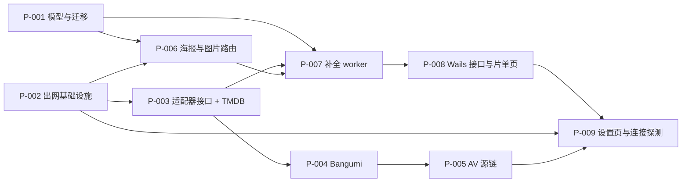

# 想看片单在线补全

## Goal And Boundaries

想看条目从「只有一个片名」变成「有类型、有影片信息、有海报」的条目。用户添加时选类型（默认电影，输入番号自动切 AV），条目立即入库，后台按类型去对应的源取信息并回填；任何源故障都只标记在该条目上。

设计已接受，以下结论不在本计划内重新讨论，执行时按原样保留：

- 五个类型 `movie` / `tv` / `anime` / `show` / `av` 只属于想看片单，**不外溢**到 `models.Video`、Jellyfin 兼容层或 NFO 解析（[D-WM02](../design/2026-09-11-watchlist-online-metadata/设计提案.md#D-WM02)）。
- 唯一约束改为 (title, kind)（[D-WM03](../design/2026-09-11-watchlist-online-metadata/设计提案.md#D-WM03)）。索引的**列顺序和名字前缀是承重的**——`watchlistTitleConflict` 靠子串匹配识别撞名，详见详细设计 §2.2 的实测记录。
- 补全任务用条件更新加认领标识认领，**不用 `SELECT ... FOR UPDATE`**（[D-WM05](../design/2026-09-11-watchlist-online-metadata/设计提案.md#D-WM05)）。仓库现有 `person_service.go` / `ai_tagging_service.go` / `face_review_service.go` 在用数据库锁，本次刻意不沿用，**也不改写它们**。
- 用户编辑永远优先于后台写回（[D-WM06](../design/2026-09-11-watchlist-online-metadata/设计提案.md#D-WM06)）。
- AV 兜底只在源明确返回「无此条目」时触发；网络、代理、凭证错误一律不兜底（[D-WM07](../design/2026-09-11-watchlist-online-metadata/设计提案.md#D-WM07)）。
- 海报复用 `ManagedImageService`，不新建图片存储（[D-WM09](../design/2026-09-11-watchlist-online-metadata/设计提案.md#D-WM09)）。
- 失败分六类且不合并（[D-WM14](../design/2026-09-11-watchlist-online-metadata/需求设计文档.md#D-WM14)）。
- 用户触发的补全不过空闲门；将来的存量批量回填才过（[D-WM11](../design/2026-09-11-watchlist-online-metadata/设计提案.md#D-WM11)）。

非目标：不做想看条目与已入库视频的自动关联；不引入下载任务；Jellyfin 与手机端仍不暴露片单；不做存量条目的批量回填（迁移后一律 `manual`，不自动出网）。

受保护、执行中不得破坏的行为：片单的增删改查与搜索在外部源不可用、凭证为空、代理错误时必须照常工作；主片库、扫描、Jellyfin、手机端、本地元数据链路零改动。

用户裁决（2026-09-11）：「不处理存量数据，这还没使用，不存在存量数据」。想看片单虽已随 9d9724b 发布，但用户未使用过，库中无条目。因此：`EnrichmentStatus` 维持 `default:'pending'`（是否改 `default:''` 的问题随存量数据一起消失）；P-007 不需要为首次升级后的扫描设界；P-001 已写好并通过测试的存量行改判逻辑原样保留，不再为存量场景投入更多工作。

执行期修正（2026-09-11，控制者）：P-004 与 P-005 的 `writes` 原先漏了 `services/watchlist_metadata_registry_test.go`。P-003 的该测试显式断言 `anime` 与 `av` 返回「尚无适配器」，因此注册新类型必然要改它——两片不碰这个文件就无法通过自己的验证门。这是计划缺陷，已补进两片的 writes。P-005 执行时又暴露同一缺陷的第二处：P-004 的 `watchlist_metadata_bangumi_test.go` 也断言了 `Chain(av)` 不支持，同样已补进 P-005 的 writes。第三处出在 P-007：`background_task_registry_test.go` 硬编码断言 key 总数为 17，新增 `watchlist_enrich` 必然让它失败，已同样补进 writes。第四处出在 P-008：`Create(title)` 改签名会打断三个测试文件里 21 处调用，而那三个文件不在 writes 内，已补入。四处同属一类缺陷——切片要改的东西，既有测试正断言着它的旧值；列 writes 时必须连带检查谁在断言它。不改变依赖、并行性（两片本就串行在 P-003 之后）与架构，故未回 `plan2exec` 重走一轮。

执行前置：先跑一次 `go test ./...` 与 `cd frontend && npm test` 取得基线，后续每片的失败才可归因。三家源的凭证与代理由用户自行配置，执行期不得把「凭证未配置」当成实现缺陷。

图：切片依赖（箭头＝前置关系）。P-001 与 P-002 无前置，可并行；P-006 等 P-001 与 P-002 就绪后可与 P-003→P-005 链并行——它要下载海报，属于外部请求，必须用 P-002 的代理客户端（AC-06 要求「所有外部资料源请求经它发出」）。

## P-001 想看条目带上类型与补全状态，唯一约束改为标题加类型

交付一个可以承载补全结果的数据模型：`WatchlistEntry` 增加 `Kind` 与补全状态字段族，唯一约束从 `idx_watchlist_title` 换成 `idx_watchlist_title_kind`，存量行迁移为 `kind='movie'` 且 `enrichment_status='manual'`（不自动出网）。

新迁移必须放在 `ApplySchema` 中 `AutoMigrate` **之后**——它依赖 `AutoMigrate` 创建的 `kind` 列，这与既有 `migrateWatchlistTitleUniqueness`（`database/database.go:307`，在 `AutoMigrate` 之前）相反。迁移只做集合写与 DDL，因此**不需要** `LOCK TABLE`，不要照抄既有迁移的加锁写法。

**同一切片内必须把既有 `migrateWatchlistTitleUniqueness` 退役**，否则删掉 `idx_watchlist_title` 会让它的守卫失效放行，接着按 title 单键硬删除 D-WM03 刚允许共存的同名不同类型记录（该模型无 `DeletedAt`），再因 `CreateIndex` 找不到已改名的索引而让 `ApplySchema` 报错、应用起不来。退役方案与三种存量库状态的推演见详细设计 §2.3 的专节。退役后它不再创建任何索引，`migrateWatchlistTitleUniqueness` 这个名字就成了误称，顺手改成名副其实的（如 `dedupeWatchlistTitlesBeforeSchema`）；`database/watchlist_schema_test.go` 的既有用例断言的是旧行为，必须一并改写。

字段族里**点名需要 `EnrichmentClaim`**（认领标识，`size:32`）与 `idx_watchlist_enrichment`（enrichment_status, id）索引。前者是 P-007 认领 CAS 的守卫列，缺了会让 ABA 防护无从实现；后者是 worker 取待办的访问路径，也是本次唯一有理由新增的非唯一索引。两者都只有本切片能写 `models/` 与 `database/`。

完成的判据：三种存量库状态（从未做过唯一性迁移、已是 title 唯一、已是复合唯一）在两个后端上都能迁移成功，且**连续执行两次 `ApplySchema` 不报错也不删行**。第三种状态的夹具**必须包含至少一对同名不同类型的记录**，并断言两次执行后行数与内容都不变——这是 B 类回归的唯一防线：夹具若用互不相同的标题构造，测试会永远绿，却抓不住「旧迁移被重新武装后按 title 硬删」的复发。同名不同类型可以共存，同名同类型仍然报「该片名已在想看片单中」——后者要有测试钉住报错文案，因为 `watchlistTitleConflict` 是靠子串匹配识别冲突的，索引一旦改名或调换列顺序它会静默失效；`EnrichmentClaim` 与 `idx_watchlist_enrichment` 随迁移就位；片单原有的增删改查、搜索、分页行为不变。

> writes: `models/watchlist.go`, `database/watchlist_kind_schema.go`, `database/watchlist_schema.go`, `database/watchlist_schema_test.go`, `database/database.go`, `database/watchlist_kind_schema_test.go`, `services/watchlist_service.go`, `services/watchlist_service_test.go`
> anchors: `AC-01, D-WM02, D-WM03, TC-06`
> architecture: 扩展既有 `WatchlistService` 与 `database` 迁移族（含退役 `migrateWatchlistTitleUniqueness`），不新建模型或服务；`watchlist_entries` 仍是片单唯一持久来源，依赖方向 App → services → GORM 不变；`Kind` 不进入 `models.Video`/Jellyfin/NFO，故障边界仍限于片单表；维护检查＝新增迁移幂等测试与撞名文案测试
> verify: `go test ./database/... ./services/... ./models/...`；PostgreSQL 侧经 `internal/dbtest` 的 `CINEINSIGHT_TEST_PG_DSN` 环境变量接入，两个后端各跑三种存量状态并连续执行两次验证幂等
> review: 旧迁移退役是否覆盖三种存量状态（漏掉会硬删数据并使启动失败）；索引列顺序与名字前缀是 `watchlistTitleConflict` 的承重条件，PostgreSQL 侧的报错文案在设计中标为未实测推断，需实测确认；迁移顺序放错会在缺列上建索引

## P-002 三家凭证与出网代理可配置，外部请求经统一客户端发出

交付补全链路的出网底座：`Settings` 增加资料源出网代理地址与 TMDB、Bangumi、FANZA 的凭证列，并提供一个按该配置构造 `http.Client` 的入口，所有外部源请求（含 P-006 的海报下载）都从这里拿客户端。代理要同时支持 HTTP 与 SOCKS5——AC-06 点名了两者，`http.Transport` 的 `Proxy` 原生接受 `socks5://`，只做 HTTP 不算完成。

配置优先级照仓库既有次序：**Settings 的非空值覆盖环境变量**，不是反过来。`services/ai_tagging_config.go:80` 先 `config := envConfig` 再逐项覆盖，既有测试 `services/ai_tagging_service_test.go:149` 同时设置 env 与 DB 值并断言取到 DB 值。

新列必须同时加进 `services/settings_service.go` 的 `UpdateSettings`——它是逐字段显式赋值的白名单，漏加的列前端发过来也存不下。该文件 `:38-42` 就留着这个坑的事故记录：「用户拨了开关、提示保存成功、重开设置页又变回去」。

新增的都是字符串列，`AutoMigrate` 直接补上即可，不需要写迁移函数。但**不要给任何新增布尔列加 `gorm:"default:true"`**——`models/video.go` 中 `IdleSchedulingEnabled` 的注释记录了原因：双向迁移器的 `Unscoped().Create` 会把用户关掉的开关翻回 true。

完成的判据：Settings 非空值覆盖环境变量，有测试断言这一方向；`socks5://` 与 `http://` 两种代理都能生效；代理地址为空时客户端直连，配置非法时给出可区分的错误而不是静默直连；新列经设置页保存后重开仍在（即真的进了 `UpdateSettings` 白名单）；`models/schema_test.go::TestAllModelsIsTopologicallyOrdered` 与 `database/migrator` 往返测试仍然通过。

> writes: `models/video.go`, `services/settings_service.go`, `services/watchlist_metadata_config.go`, `services/watchlist_metadata_config_test.go`, `services/settings_service_test.go`
> anchors: `AC-06, AC-07, D-WM10`
> architecture: 复用 `Settings` 表、`ai_tagging_config.go` 的读取形态与 `settings_service.go` 的既有持久化白名单，不新建配置存储或第二条保存路径；配置归 services 层拥有，适配器与 P-006 的下载入口只消费不写入；客户端工厂无持久状态，故障边界限于单次请求；维护检查＝配置优先级方向、SOCKS5 生效、非法代理地址与保存往返的单测
> verify: `go test ./services/... ./models/... ./database/...`
> review: 新增列不得带布尔 `gorm default`，且必须进 `UpdateSettings` 白名单否则存不下；配置优先级方向（Settings 覆盖 env）不得写反；代理配置错误不得静默退化为直连

## P-003 定义源适配器契约并接入 TMDB

交付适配器抽象与第一个实现：一个源适配器接口（按片名或番号搜索候选、按源条目 ID 取详情）、一张按类型选链的路由表，以及覆盖电影、剧集、综艺纪录片的 TMDB 适配器。

适配器只负责「向外部要数据并映射成内部结构」，不碰数据库、不反向依赖 `WatchlistService`。依赖方向是 `WatchlistService` → 路由表 → 适配器 → `net/http`。这条边界是后面三个源能平行接入的前提。

完成的判据：路由表按类型返回预期的适配器链；TMDB 适配器能把搜索响应映射成内部候选结构并保留源条目 ID；HTTP 401/403、超时、非 2xx、响应无法解析分别映射到 `credential_invalid`、`network_unreachable`、`source_error` 而不是合并成一个错误。字段映射以公开文档为准，实现时若真实响应与文档不符，以真实响应为准并在详细设计 §四 记录差异。

> writes: `services/watchlist_metadata_source.go`, `services/watchlist_metadata_registry.go`, `services/watchlist_metadata_tmdb.go`, `services/watchlist_metadata_tmdb_test.go`, `services/watchlist_metadata_registry_test.go`
> anchors: `AC-02, D-WM01, D-WM14（错误分类的适配器侧）`
> architecture: 新增能力，无既有等价物——仓库内没有任何外部影视资料源客户端（`grep -ril tmdb|douban|bangumi` 仅命中设计文档）；owner 为 services 层新文件族，依赖方向单向指向 `net/http` 与 P-002 的配置；适配器无持久状态，失败边界限于单次补全；维护检查＝以 `httptest` 桩替身覆盖成功与四类失败
> verify: `go test ./services/ -run 'WatchlistMetadata'`
> review: 适配器不得写数据库或回调片单服务；错误分类不得合并

## P-004 动画类型接入 Bangumi

交付 `anime` 类型的源实现，并把它注册进 P-003 的路由表。与 P-003 共用同一张路由表文件，因此必须在 P-003 之后串行推进，不能并行编辑。

Bangumi 的匿名可读范围与 User-Agent 规范未经实测，详细设计中的映射是按公开文档写的。若实际响应要求携带 token 或特定 User-Agent，按真实情况实现并回写详细设计 §四，不要为了让文档成立而保留失效的映射。

完成的判据：`anime` 类型路由到 Bangumi；候选映射保留源条目 ID；四类失败分类与 TMDB 一致。

> writes: `services/watchlist_metadata_bangumi.go`, `services/watchlist_metadata_bangumi_test.go`, `services/watchlist_metadata_registry.go`, `services/watchlist_metadata_registry_test.go`
> anchors: `AC-02, D-WM01`
> architecture: 复用 P-003 的适配器接口与路由表，不新建抽象；与 P-003 共享 `watchlist_metadata_registry.go`（可变共享文件，故为串行依赖而非并行）；维护检查＝桩替身单测
> verify: `go test ./services/ -run 'WatchlistMetadata'`
> review: 路由表编辑不得覆盖 P-003 已注册的条目

## P-005 AV 类型走 FANZA 优先、JavBus 兜底的有序源链

交付 `av` 类型的两个适配器与它们之间的兜底策略。兜底是用户明确要求的行为，不是自行添加的降级路径，但触发条件很窄：**只有源明确返回「无此条目」时才请求 JavBus**。FANZA 报凭证错误、网络错误或超时一律不兜底——那会把配置问题伪装成「查无此片」，并在每次失败时多打一次抓取请求。

兜底做成路由表上的有序两跳，不藏在 FANZA 适配器内部，这样「结果来自哪个源」可追溯。写入条目的 `SourceName` 必须是真正产出结果的那个源。

JavBus 依赖 HTML 结构，源站改版即失效，解析失败要落到 `source_error` 而不是 `not_found`。FANZA 的凭证由用户自行申请，执行期拿不到凭证不算实现缺陷——用桩替身完成验证即可。

完成的判据：`not_found` 触发第二跳，其余五类失败都不触发；两跳都无结果时最终状态是 `not_found`；`SourceName` 如实反映产出源。

> writes: `services/watchlist_metadata_fanza.go`, `services/watchlist_metadata_javbus.go`, `services/watchlist_metadata_chain.go`, `services/watchlist_metadata_chain_test.go`, `services/watchlist_metadata_registry.go`, `services/watchlist_metadata_registry_test.go`, `services/watchlist_metadata_bangumi_test.go`
> anchors: `AC-02, D-WM07`
> architecture: 复用 P-003 接口与路由表；兜底策略归路由层拥有，不下沉进适配器，保证来源可追溯；与 P-003/P-004 共享 `watchlist_metadata_registry.go`，故串行；维护检查＝六类失败各一条用例断言是否触发第二跳
> verify: `go test ./services/ -run 'WatchlistMetadata'`
> review: 兜底触发条件必须严格限于 `not_found`；`SourceName` 不得记成首选源

## P-006 海报落进既有受管图片存储并可被前端取到

交付海报的落盘与读取能力：把 `ManagedImageService.Import` 的 entityType 白名单从 `people` / `collections` / `videos` 扩到含 `watchlist`，提供「下载到临时文件再交给 Import」的入口，并照 `preview_asset_handler.go:107 servePersonAvatar` 的形状新增 `/preview/watchlist-poster/<id>` 路由。

复用而非新建的理由已经定了：该服务已提供内容寻址去重、临时文件加 rename 的原子发布、20 MiB 上限、仅 JPEG/PNG/WebP、路径必须落在根目录内。不要新写一套更弱的副本。

顺序上有一条硬约束：**先落盘图片，再写回数据库**；写回失败时删除刚落盘的图片。反过来会留下指向不存在文件的路径。

本切片会改变 `WatchlistService` 的构造形态：它现在是 `struct{}`（`services/watchlist_service.go:14`），由 `app.go:154` 以 `&services.WatchlistService{}` 构造，既没有 `dataDir` 也没有 `ManagedImageService`。要让它承担海报生命周期，就得照 `NewPersonService(dataDir)` / `NewCollectionService(dataDir)` 的形态改构造，并同步 `services/watchlist_service_test.go` 里 5 处 `&WatchlistService{}`。

完成的判据：海报下载经 P-002 的代理客户端发出，不自建绕过代理的客户端；条目删除时海报被 `Remove` 清理，不留孤儿文件；超限或非图片格式被 `Import` 拒绝时，文字字段仍然保留、只是没有海报；下载入口对超大响应有上限，不会把任意大小的响应读进内存。

> writes: `services/managed_image_service.go`, `services/watchlist_artwork.go`, `services/watchlist_artwork_test.go`, `preview_asset_handler.go`, `services/watchlist_service.go`, `services/watchlist_service_test.go`, `app.go`
> anchors: `AC-05, D-WM09, TC-04`
> architecture: 扩展既有 `ManagedImageService`（`services/managed_image_service.go:41`）而非新建图片存储，仅放宽 entityType 白名单，不改其落盘、去重与路径约束；下载入口消费 P-002 的代理客户端工厂，不自建 HTTP 客户端；`WatchlistService` 构造改为携带 `dataDir` 与图片服务，照 `NewPersonService` 形态，依赖方向不变；图片文件归 `ManagedImageService` 拥有，片单服务只持相对路径；故障边界＝下载失败不影响文字字段；维护检查＝删除清理、格式拒绝、经代理发出各一条用例
> verify: `go test ./services/... ./`；断言 `dataDir/media-details/watchlist/` 下无孤儿文件
> review: 白名单放宽不得削弱既有路径校验与体积上限；落盘与写回的先后顺序；下载不得绕过代理客户端

## P-007 补全任务按状态机后台运行，用户编辑永远优先

交付补全的执行主体：状态机（`pending` / `running` / `succeeded` / `failed` / `manual`）、条件更新加认领标识的认领、六类失败分类、启动时把残留 `running` 刷回 `pending`，以及新的后台任务 key `watchlist_enrich`。

认领用 `UPDATE ... WHERE id=? AND enrichment_status='pending'` 判断影响行数，写回再带一次 `status='running' AND claim=<本次标识>` 的守卫。认领标识不能省：状态会回到 `pending`（重试），只比对状态值会让一次慢响应落到用户重试后的新一轮上。写回守卫不成立时**丢弃结果并记日志**，这是设计意图不是错误路径。

任务不过空闲门——参照 `services/background_task_registry.go` 中 `BackgroundTaskBrowserDownload` 的注释，那道门只挡自动触发的任务，而这里是用户添加或点重试触发的。

状态变化要经 Wails 事件 `watchlist-enrich-progress` 推送出去（D-WM13 指定的事件名，沿用仓库既有 kebab-case 约定，如 `image-ai-tagging-progress`、`directory-scan-progress`）。这是 AC-03「列表先出现再填充」的服务端一半，P-008 负责订阅端。

完成的判据：详细设计 §3.1 转换表的每一行都有对应行为；六类失败分类互不合并，`credential_missing` 不发出任何请求；认领后编辑再写回时影响 0 行且字段不变；进程重启后残留 `running` 能恢复；补全全程不阻塞片单的增删改查；每次状态落定都发出一次 `watchlist-enrich-progress`。

> writes: `services/watchlist_enrichment.go`, `services/watchlist_enrichment_test.go`, `services/background_task_registry.go`, `services/background_task_registry_test.go`, `services/watchlist_service.go`, `app.go`
> anchors: `AC-03, AC-07, D-WM04, D-WM05, D-WM06, D-WM11, D-WM12, D-WM13（事件推送端）, D-WM14, TC-02, TC-03`
> architecture: 复用 `BackgroundTaskRegistry`、`ai_run_service.go:91` 的中断恢复思路，以及 `app.go:295` 那个带 `ctx.Err()` 短路的 `emit` 闭包（注释已写明「后台 worker 在应用退出时仍会发事件，那时前端已经没了」，补全 worker 正是这种情形），不新建任务框架或第二处事件发射；补全状态归 `WatchlistService` 拥有，worker 不绕过它直写；并发协调用条件更新与认领标识，**不引入 `SELECT ... FOR UPDATE`**，也不改写仓库内既有的加锁代码；故障边界＝外部源故障止于 worker，片单 CRUD 不受影响；维护检查＝转换表逐行用例与并发竞争用例
> verify: `go test ./services/ -run 'WatchlistEnrich'`；并发用例断言认领后编辑再写回影响 0 行
> review: 认领标识不可省略（ABA）；**认领标识必须 ≤32 字符**——`EnrichmentClaim` 是 `size:32`，36 字符的 `uuid.NewString()` 在 SQLite 上静默截断、在 PG 上报错，用 32 位十六进制；写回守卫不成立时必须丢弃而非报错；不得引入数据库锁或自动重试；事件名须与 D-WM13 一致

## P-008 片单页支持选类型、看状态、改结果与重试

交付用户能真正用起来的界面与接口：`CreateWatchlistEntry` 增加类型入参，新增 D-WM13 列出的三个方法（`RetryWatchlistEnrichment`、`ListWatchlistCandidates`、`ApplyWatchlistCandidate`），条目结构增量返回类型、状态、错误码、海报有无与影片字段；片单页加类型下拉（默认电影）、番号输入时自动切到 AV、补全状态与失败原因展示、重试按钮、候选重选入口。

番号识别只是输入辅助：它改的是下拉框的值，用户可以改回去，提交时以下拉框为准。**不存在后端偷偷改用户选定类型的路径。**

用户编辑触发状态转 `manual`，这是 P-007 里「用户编辑优先」的前端触发点。

新增的交互元素要带 `data-test` 钩子——`frontend/scripts/data-test-set.test.mjs` 是基线守卫，允许新增、不允许缺失。本切片会重新生成 Wails 绑定（`frontend/wailsjs/`），P-009 也会，两者因此串行。

页面要订阅 P-007 发出的 `watchlist-enrich-progress` 事件并刷新对应行——这是 AC-03「条目先出现、补全完成后填充」的用户可见一半，没有它用户必须手动刷新才看得到结果。

完成的判据：五个类型各能添加并路由到预期源；番号输入切换后用户改回去，提交的是改回后的类型；补全完成后该行**自动**刷新，无需手动操作；手动重试能让失败条目回到补全流程；请求失败保留输入和已加载列表（沿用 2026-09-10 的既有行为）；失败原因按六类显示不同文案。

> writes: `app_watchlist.go`, `frontend/src/components/WatchlistPage.vue`, `frontend/src/components/WatchlistPage.test.js`, `frontend/wailsjs/go/main/App.js`, `frontend/wailsjs/go/main/App.d.ts`, `frontend/wailsjs/go/models.ts`, `services/watchlist_service.go`, `services/watchlist_service_test.go`, `services/watchlist_artwork_test.go`, `services/watchlist_enrichment_test.go`
> anchors: `AC-01, AC-03, AC-04, D-WM08, D-WM13, TC-01, TC-02（手动重试入口）`
> architecture: 扩展既有 `app_watchlist.go` 与 `WatchlistPage.vue`，不新建页面或并行入口；App 层只转发、校验留在服务层，沿用 2026-09-10 的既有分层；生成的 `frontend/wailsjs/` 是与 P-009 共享的产物，故 P-009 串行在后；维护检查＝组件测试加 `data-test` 基线守卫
> verify: `go test ./...`；`cd frontend && npm test`（含 `test:data-test-set` 基线守卫）
> review: 番号识别不得成为后端改类型的路径；绑定重新生成不得丢掉其他方法

## P-009 设置页提供资料源凭证、出网代理与连接探测

交付配置界面：设置页新增「在线资料源」分区，填三家凭证与出网代理，每个源一个连接探测按钮，照 `services/ai_tagging_connection.go:41 ProbeAITaggingConnection` 的形状实现。

**代理项必须叫「资料源出网代理」。** 设置页已有 `ProxySection.vue`，标题是「播放代理」，指的是本地转码缓存，与出网无关；两者同名会造成真实误解。

探测要能区分凭证缺失、凭证无效、代理不通、网络不可达四种情况，每种给一句能动手排查的中文——这是 AC-07 的落点。探测结果不回传也不记日志任何 API Key，沿用既有连接测试的处置。

新分区要挂进 `frontend/src/components/SettingsPage.vue`——它是分区的唯一挂载点，import、`components` 注册、模板三处都要加，漏了组件不会出现在设置页。

**还有第四处，比前三处更危险**（P-002 集成时发现并已核验）：`SettingsPage.vue` 的保存动作把载荷写成**显式对象字面量**（`UpdateSettings({ confirm_before_delete: ..., ... })`，约 285 行起），不是展开。五个新列不加进这个字面量，任何一次设置保存都会把它们以零值回传，而 `UpdateSettings` 的白名单会照单赋值——**存好的代理和三家凭证会被清空**。这与该文件已记录过的 `BrowserBridgeToken` 是同一类故障。若本切片另起一个带独立载荷字面量的面板，两个面板还会互相清空对方的字段。判据里必须有一条：在「在线资料源」以外的分区改一项设置并保存，代理与凭证不丢。

完成的判据：代理开、关、地址错误、凭证缺失各产生不同且可读的错误；探测用表单当前值发起，不必先保存；**填写并保存后重开设置页值仍在**（验证 P-002 的 `UpdateSettings` 白名单确实生效）；片单页在凭证未配置时仍可正常增删改查。

> writes: `services/watchlist_metadata_probe.go`, `services/watchlist_metadata_probe_test.go`, `app_settings.go`, `frontend/src/components/settings/OnlineSourceSection.vue`, `frontend/src/components/settings/OnlineSourceSection.test.js`, `frontend/src/components/SettingsPage.vue`, `frontend/wailsjs/go/main/App.js`, `frontend/wailsjs/go/main/App.d.ts`, `frontend/wailsjs/go/models.ts`
> anchors: `AC-06, AC-07, D-WM10, TC-05`
> architecture: 复用 `ProbeAITaggingConnection` 的探测形态与设置页分区结构，不新建配置通道；探测复用 P-005 完成的适配器，不另写一套请求逻辑；与 P-008 共享生成的 `frontend/wailsjs/`，故串行；维护检查＝四类错误文案的组件与服务单测
> verify: `go test ./...`；`cd frontend && npm test`
> review: 分区与代理项命名不得与既有「播放代理」混淆；任何路径不得回传或记录 API Key

## Integration And Final Verification

- 全量回归：`go test ./...` 与 `cd frontend && npm test` 对齐执行前基线；`wails build` 能出包。
- TC-01 端到端：五个类型各添加一条，确认路由到预期源；番号输入自动切 AV 且可被用户改回。
- TC-04 端到端：断网后重开应用，已补全条目的海报仍显示；删除条目后 `dataDir/media-details/watchlist/` 无孤儿文件。
- 受保护行为回归：外部源全部不可用、凭证为空、代理地址错误三种状态下，片单的增删改查与搜索均照常工作。
- 零改动确认：主片库、扫描、Jellyfin 兼容层、手机端、本地元数据链路的既有测试全绿，且 `models.Video` / Jellyfin `Type` / NFO 根节点校验未被本次改动触碰。
- 双后端迁移：PostgreSQL 侧经 `internal/dbtest` 的 `CINEINSIGHT_TEST_PG_DSN` 环境变量接入，与 SQLite 各跑三种存量库状态（从未做过唯一性迁移、已是 title 唯一、已是复合唯一）并连续执行两次；`database/migrator` 往返测试的每表至少一行夹具仍然满足。
- 补全闭环：添加条目后不做任何手动操作，该行应在补全完成后自动刷新（`watchlist-enrich-progress` 事件的发出端与订阅端对接成功）。
- 整体架构复核：适配器无一处写数据库或回调片单服务；全仓无新增 `SELECT ... FOR UPDATE`；无第二套图片存储或第二份片单真相来源；六类失败分类在服务层与界面层一致未被合并。
- 出网收敛复核：**本次新增的**资料源请求、海报下载与连接探测三条路径都经 P-002 的客户端工厂发出，没有自建 `http.Client`。检查范围限于本次改动，不要对全仓 grep `http.Client{`——那会命中 `ai_tagging_client.go`、`subtitle_translation.go`、`browser_stream_proxy.go` 等十来处与本次无关的既有代码。
- 文档回写：提案被接受后，把 `docs/loopx/design/2026-07-30-video-details-metadata/设计提案.md` 第 40/97 行与 `docs/loopx/design/2026-09-10-watchlist/概要设计.md` D-W01 的前向引用改为正式的被取代说明，并更新 `AI-CONTEXT.md` 的想看片单条目。

## Handoff And Residual Risks

- Review evidence: 独立只读评审者（host-native 子代理，`plan-reviewer`）两轮。第一轮对本计划初版裁定 blocked，提出 B1~B6 六条阻塞问题；六条经本方独立核验后全部确认属实（B1 的因果链——守卫失效放行、按 title 单键硬删、`CreateIndex` 因 `LookIndex` 返回 nil 而报错——已独立复现）。修订后第二轮复评裁定 **ready**，并逐条推演了退役方案在五种存量/重入路径下的正确性。复评所读内容：本计划 9 切片 12 条依赖边、`需求设计文档.md` V1.0.3、`设计提案.md`（D-WM10 已改）、`概要设计.md` v1.2。复评所列 6 条非阻塞建议已全部落实，其中「S3 夹具必须含同名不同类型记录」已写入 P-001 判据。
- Blockers: `none`
- Residual risks:
  - 三家源的接口细节全部未实测（Bangumi 匿名可读范围与 User-Agent 规范、TMDB 限流口径、JavBus 当前可达性与 HTML 结构）。详细设计 §四、§五 的映射以公开文档为准，执行时须以真实响应校正并回写文档。
  - FANZA 的 API ID 与联盟 ID 由用户自行申请。若最终拿不到，`av` 类型退化为 JavBus 单链，[D-WM07](../design/2026-09-11-watchlist-online-metadata/设计提案.md#D-WM07) 的优先级语义需要重新裁决，不能由执行者自行改写。
  - JavBus 依赖 HTML 结构，源站改版即失效；这是接受兜底时一并接受的维护代价。
  - 明文凭证数量从 3 个增加到 6 个，沿用仓库既有做法但扩大了范围。
  - 唯一约束放宽后回滚窗口止于第一条同名不同类型记录写入之时。
  - 本计划的全部验证均为设计期推演，**没有任何测试被编写或运行**；执行前须先取 `go test ./...` 与 `npm test` 的基线。
  - 退役 `migrateWatchlistTitleUniqueness` 的正确性经两轮文档推演（覆盖全新库、两种未升级状态、已升级状态、删索引前后中断重入），但**未经实际执行验证**。P-001 的三种存量夹具是它的第一次真实检验。
- Resume note: 九片全部 `done`，执行完成。所有改动**留在工作区未提交**（45 个代码文件 + 5 个文档）。
  基线 HEAD `18e635d` 未变；用户原有的四份文档改动完好。
- 执行结果（2026-09-11）：
  - `go test ./...` 仅剩执行前就红的 `TestDeleteImageDirectoryHidesItsImages`（根包，与本次无关），与基线一致。
  - `cd frontend && npm test` 59 文件 / 645 用例全绿（基线 58 / 621）；data-test 守卫 424 钩子，一个未丢。
  - `wails build` 出包成功。
  - 零改动确认：`models.Video` 无分类字段、Jellyfin 兼容层与 NFO 解析未被触碰。
  - 架构复核：适配器不 import database/models、不引用 WatchlistService（仅注释提及）；
    全仓无新增 `clause.Locking`；自建 `http.Client` 仅工厂一处；无第二个图片服务类型；
    六类分类码前后端一致。
  - **PostgreSQL 侧已实测（2026-09-11 补跑）**：起一次性 postgres:18-alpine 容器（宿主端口 55432），
    `CINEINSIGHT_TEST_PG_DSN` 指向它，`./database`、`./database/migrator`、`./services` 三个包全绿。
    注意 `./services` 在 PG 上要 **648s**，超过 `go test` 默认的 600s 超时，必须加 `-timeout`。
    撞名文案（判据 A 靠索引名前缀命中）与六个迁移用例都在 PG 上验证通过，不再是源码推断。
    先前记录的「本机无 PG」是错的：判断依据 `pg_isready` 未安装，命令必然失败并打印该结论。
  - 迁移：SQLite 上六个用例覆盖全新库、遗留库去重、title 唯一库、复合唯一库幂等、
    「有 kind 列但无索引」与默认值插入，全绿；**S3 夹具含「沙丘」movie+tv 同名不同类型对**，
    B1 回归防线到位。
  - 集成期两次收口：兜底策略去重（委托 `walkWatchlistMetadataChain`）、
    `Create` 合并为单一 `Create(title, kind)`。
  - 文档回写已完成：2026-07-30 第 40/97 行与 2026-09-10 D-W01/§1 已转为正式的被取代说明，
    `AI-CONTEXT.md` 想看片单条目已补齐在线补全全部要点。
- **未验证（需真机与凭证）**：四家源的字段映射全部来自公开文档，零真实请求；
  五类路由端到端未跑通；FANZA 番号→content_id 无公开规则，预期会落到 JavBus；
  JavBus 正则解析 HTML，源站改版即失效。
