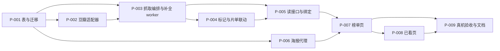

# 年度电影榜单

## Goal And Boundaries

做完之后，用户能按年份浏览在内地公映的电影（含尚未上映的），每条一键「想看 / 不想看 / 已看」，
并在已看页按影片上映年份回看自己标过的片。豆瓣连不上时页面显示缓存内容和缓存时间，**不是空榜单**。

### 这个计划为什么存在

用户的硬约束：「动手前先出 spec……需要先有获批设计再写代码」。设计已出（`docs/loopx/design/2026-09-21-movie-year-chart/`，
状态 **accepted**）。用户于 2026-09-21 以 `/exec` 指令批准设计并授权实现，本计划随之转 `ready`。

### 源文档已裁定的结论（不在本计划内重开）

十三项 `D-MC*` 决定由[概要设计 §5](../design/2026-09-21-movie-year-chart/概要设计.md#五决定) 拥有。
执行时需要反复回看的是这几条：

- **D-MC02** 取数口径＝在内地公映（含引进片）。`tags` **只带年份不带地区**；判定读详情 `pubdate`，
  按 `/` 拆分后**精确相等**匹配「中国大陆」，`strings.Contains` 会把 `2026(中国大陆网络)` 误判成院线。
- **D-MC03** 四种排序（T/U/R/S）各**固定翻 25 页**，不以空页为终止条件。实测空页是瞬时现象。
- **D-MC04** 增量 upsert，**从不删除**本地已有条目；`DoUpdates` 绝不包含 `detail_*` 与 `release_*`。
- **D-MC06** 详情补全用条件更新认领 + `claim` 守卫，**禁止 `SELECT ... FOR UPDATE`**；
  `claim` 是 **32 个十六进制字符**，`uuid.NewString()`（36 字符）会让 Postgres 报 `value too long`。
- **D-MC07** 六类失败**互不合并**；**HTTP 200 + 空 `items` 不是 `not_found`**。
- **D-MC09** 海报走只读代理，地址**只从本地库取**，不接受调用方传 URL。
- **D-MC13** 「想看」固定**先建片单条目、再写标记**；撞名时标记照记但不关联 ID，撤销**不动**用户手输的条目。

### 受保护的既有行为

- `watchlist_entries` 的 `(title, kind)` 唯一索引名与列顺序不得改动——`services/watchlist_service.go:411`
  的 `watchlistTitleConflict` 靠索引名字符串匹配识别撞名。
- `WatchlistService` 既有的 `watchlist_enrich` worker 与其状态机不共用、不改动。
- `NewWatchlistMetadataHTTPClient` 的语义：代理地址填错返回错误而**不退回直连**。
- 2026-09-02 的 gorm default 禁令：不得给布尔/数值列写**非零** default。
- `models.AllModels()` 的拓扑序与 `models.TestAllModelsIsTopologicallyOrdered`。

### 非目标

不合并本地片库的 `videos.is_watched`；不接第二数据源；不做海报落盘；不追求年度全量（约 1500 条/年，界面明说）。

### 切片关系

`P-002` 与 `P-006` 在 `P-001` 完成后可与彼此并行（写盘路径不相交）。`P-008` 依赖 `P-007` 的唯一理由是
两者都要改 `frontend/src/App.vue` 的导航与页面切换。

## P-001 三张表在两个后端上建得出来

交付 `models/movie_chart.go` 的三张表（榜单缓存、标记、年状态）并注册进 `models.AllModels()`。
字段与索引以[需求设计文档 §4](../design/2026-09-21-movie-year-chart/需求设计文档.md#四数据契约) 为准。

做完的标志：`AutoMigrate` 在 SQLite 与 Postgres 上都建出三张表与五个索引
（`idx_movie_chart_entry_douban` 唯一、`idx_movie_chart_entry_list`、`idx_movie_chart_entry_detail`、
`idx_movie_chart_mark_douban` 唯一、`idx_movie_chart_mark_group`、`idx_movie_chart_year` 唯一）；
测试断言三张表**没有任何非零默认值的布尔或数值列**；`TestAllModelsIsTopologicallyOrdered` 仍通过。
标记表**不得**对缓存表建外键——两者按 `douban_id` 逻辑关联，加外键会让缓存重建连带删掉用户的已看记录。

> writes: `models/movie_chart.go`, `models/schema.go`, `models/schema_test.go`, `database/movie_chart_schema_test.go`
> anchors: `D-MC04（缓存表结构）, D-MC05（标记表独立 + 快照列）, D-MC11（release_year 快照列）; TC-07`
> architecture: `新表归 models，无外键因而不引入新的拓扑序约束（追加到 AllModels 末尾即可）；列默认值全部等于该列零值语义，遵守 2026-09-02 禁令，判断口径见 models/watchlist.go:33-39；无需手写迁移——没有存量数据要改造，也不存在必须夹在 AutoMigrate 前后的步骤（对比 database/watchlist_kind_schema.go 那种情形）；共享状态边界＝三张表只由后续 MovieChartService 写入，本切片不产生写入方；维护检查＝database/movie_chart_schema_test.go 断言索引名与列清单，经 internal/dbtest 在两个后端各跑一遍`
> verify: `go build ./... && go test ./models/... ./database/...`；`CINEINSIGHT_TEST_PG_DSN=<dsn> go test ./database -timeout 40m`
> review: `索引名与列顺序须与需求设计文档 §4 逐行一致；确认没有非零默认值的布尔/数值列；确认标记表未对缓存表建外键；确认 AllModels 追加位置不破坏拓扑序`

## P-002 豆瓣榜单适配器按六类失败分类返回结果

交付 `DoubanMovieChartSource`：列表请求（`rexxar/api/v2/movie/recommend`）、详情请求
（`rexxar/api/v2/movie/<id>`）、字段映射、`pubdate` 判定算法。契约见
[需求设计文档 §2](../design/2026-09-21-movie-year-chart/需求设计文档.md#二豆瓣端点契约)
与 [§3](../design/2026-09-21-movie-year-chart/需求设计文档.md#三pubdate-判定算法d-mc02)。

适配器**只出网与映射**，不碰数据库、不反向依赖服务层——这是 `services/watchlist_metadata_source.go`
开头声明的既有边界，本切片沿用而不是新立一条。

做完的标志：六类失败各有一条桩测试且**互不合并**（含反向断言：凭证/代理/网络错误不得变成 `not_found`）；
中间页返回 `{"items":[]}` 时抓取继续、不记失败码；[概要设计 §2](../design/2026-09-21-movie-year-chart/概要设计.md#二豆瓣端点实测结论设计依据)
表里的六个真实 `pubdate` 样本逐个断言出正确的 `scope` 与 `date`，其中
`2026-03-20(美国/中国大陆)` 必须判成 `theatrical`、`2026(中国大陆网络)` 必须判成 `excluded`。

> writes: `services/movie_chart_source.go`, `services/movie_chart_douban.go`, `services/movie_chart_douban_test.go`
> anchors: `D-MC01, D-MC02, D-MC03（参数拼装与固定翻页序）, D-MC07; TC-01, TC-04, TC-08, TC-09`
> architecture: `复用 services/watchlist_metadata_config.go:85 NewWatchlistMetadataHTTPClient 拿客户端（构造时注入，不自建 http.Client），复用 services/watchlist_metadata_source.go 的 WatchlistMetadataFailure 六类与 classifyWatchlistMetadataTransportError / classifyWatchlistMetadataHTTPStatus 两个函数，不抄第二份分类逻辑；适配器归 services，依赖方向单向 服务 → 适配器 → net/http，不碰数据库；故障边界＝适配器只产出带分类码的错误，落库与状态机不在此；维护检查＝httptest 桩覆盖六类失败 + 空页 + 六个真实 pubdate 样本，日志只记 source/path/status/bytes/elapsed_ms`
> verify: `go build ./... && go test ./services/...`
> review: `空 items 不得映射成 not_found（D-MC07）；pubdate 判定必须按 / 拆分后精确相等，不得用 strings.Contains；确认未自建 http.Client；确认 total 字段未被用于分页计算（它恒为 500 的占位值）`

## P-003 一次刷新能把某一年的条目抓齐并补全详情

交付 `MovieChartService` 的骨架与写路径：列表阶段（四排序 × 25 页、按 `douban_id` upsert）、
年状态维护、详情补全 worker（认领 CAS、限速 1 次/秒、可取消、可断点续跑），以及新的
`BackgroundTaskKey` 值 `movie_chart`（**不进空闲门**，与 `watchlist_enrich` 同口径）。
流程见[概要设计 §4.1](../design/2026-09-21-movie-year-chart/概要设计.md#41-年度刷新列表与详情补全)，
并发不变量见[需求设计文档 §5](../design/2026-09-21-movie-year-chart/需求设计文档.md#五并发契约)。

做完的标志：同一条目在两轮抓取、四种排序里各出现一次，表内恒为一行，且第二轮**不把已补全的条目打回
`pending`**；批内重复 `douban_id` 先去重再 upsert（不去重 Postgres 会报 21000 整批失败）；
认领后把状态改回 `pending`，迟到的写回被丢弃且**不报错**；列表阶段单页失败即中止整轮、已写入条目全部保留、
年状态记下六类分类码；取消时 `last_refreshed_at` 不更新且不写失败码。

> writes: `services/movie_chart_service.go`, `services/movie_chart_refresh.go`, `services/movie_chart_refresh_test.go`, `services/background_task_registry.go`, `services/background_task_registry_test.go`, `services/watchlist_enrichment_test.go`（2026-09-21 执行期扩入：`e71dae2` 在此留了一条快照式断言「watchlist_enrich 必须是面板顺序最后一个」，任何人追加新 key 都会让它失效，需就地泛化）
> anchors: `D-MC03, D-MC04, D-MC06, D-MC07, D-MC12; TC-02, TC-08, TC-12, TC-13`
> architecture: `新增 MovieChartService 而不是扩 WatchlistService——后者的状态机、唯一键 (title, kind) 与「用户输入永远优先」都是围绕手输条目建立的，理由见概要设计 §3；认领与写回照搬 services/watchlist_enrichment.go 的条件更新 + claim 模式，不发明第二套，禁止 SELECT ... FOR UPDATE；复用 BackgroundTaskRegistry（services/background_task_registry.go:30-34 记录了「用户触发的任务不进空闲门」这条判断标准）；三张表的唯一写入者是本服务，依赖方向 服务 → 适配器，适配器不反向依赖；故障边界＝列表阶段单页失败中止本轮但不清数据，详情阶段单条失败只影响该条；维护检查＝refresh 测试用假适配器注入，覆盖空页、单页失败、取消、重复 ID、迟到写回五条路径`
> verify: `go build ./... && go test ./services/...`；`CINEINSIGHT_TEST_PG_DSN=<dsn> go test ./services -timeout 40m`（批内去重与 upsert 的 Postgres 腿只有跑 PG 才覆盖得到）
> review: `确认 DoUpdates 的赋值集合不含任何 detail_* 与 release_* 列；确认 claim 是 32 个十六进制字符而非 uuid.NewString()；确认写回同时比对状态与 claim（ABA）；确认批内按 douban_id 去重；确认 ON CONFLICT DO UPDATE 的 SET 右侧引用目标表列时带表名限定（否则 Postgres 报 42702，见 services/image_ai_tagging_service.go:767）；确认没有任何未经需求要求的 retry / 降级分支`

## P-004 三种标记可写可撤销，且不会误删用户手输的片单条目

交付标记状态机：`want` / `skip` / `watched` 的 upsert、改标记、撤销，以及 `want` 与想看片单的联动。
状态机见[概要设计 §4.3](../design/2026-09-21-movie-year-chart/概要设计.md#43-标记生命周期)。

写入顺序是承重的：**先调 `WatchlistService.Create` 建片单条目、再写标记行**，并把返回的片单 ID 写进
`watchlist_entry_id`。反过来会在崩溃时留下一个指向不存在片单条目的标记，而撤销会去删那个不存在的 ID。

做完的标志：三种标记各自可写、可改、可撤销；撞上用户手输的同名同类型条目时走既有
`ErrWatchlistTitleExists`，标记照记、`watchlist_entry_id=0`、`WatchlistConflict=true`，
**撤销时那条片单记录仍在**；标记一个不在缓存里的豆瓣 ID 被拒绝；重复点同一标记幂等。

> writes: `services/movie_chart_marks.go`, `services/movie_chart_marks_test.go`
> anchors: `D-MC05, D-MC13; TC-03, TC-10`
> architecture: `复用 services/watchlist_service.go:113 WatchlistService.Create 及其既有撞名错误，不改 watchlist_entries 的约束、索引名或列顺序；标记表由 MovieChartService 独占写入，依赖方向 MovieChartService → WatchlistService（单向，片单侧不感知榜单）；共享状态边界＝watchlist_entries 是两个服务都会写的表，但榜单侧只经 Create 与按 ID 删除两条既有路径进入，不直接拼 SQL；故障边界＝标记写入与片单写入不在同一事务，靠固定顺序把崩溃后果收敛为「多一条用户可自行删除的片单记录」；维护检查＝测试覆盖撞名、撤销不误删、改标记的副作用顺序`
> verify: `go build ./... && go test ./services/...`
> review: `确认「先建片单、后写标记」的顺序未被调换；确认撞名时不记录 watchlist_entry_id 且撤销不触碰用户手输条目（TC-10）；确认未改动 watchlist_entries 的任何约束或索引`

## P-005 读接口只查本地表并暴露给前端

交付榜单分页查询、已看页分组查询与 `app_movie_chart.go` 的七个 Wails 绑定，形状见
[需求设计文档 §6.1](../design/2026-09-21-movie-year-chart/需求设计文档.md#61-wails-绑定app_movie_chartgo)。

读路径**不在请求线程上出网**——出网只发生在 P-003 的后台任务里。这是「豆瓣不可达时读缓存」
这条要求的实现方式：读路径根本不知道豆瓣存不存在。

做完的标志：排序按 `CASE WHEN release_date = '' THEN 1 ELSE 0 END, release_date, id`（旧片在前、未定档置底），
两个后端结果一致；非法 `sort` / `mark` / 越界 `year` 一律拒绝而**不静默回退**；
代理或网络失败后读接口仍返回缓存条目且 `Cache.LastFailure` 非空、`Items` 非空；
已看页按上映年份倒序分组，`release_year=0` 单列一组。

> writes: `services/movie_chart_query.go`, `services/movie_chart_query_test.go`, `app_movie_chart.go`, `app.go`, `frontend/wailsjs/go/main/App.d.ts`, `frontend/wailsjs/go/main/App.js`, `frontend/wailsjs/go/models.ts`, `services/movie_chart_service.go`, `services/movie_chart_marks.go`, `services/movie_chart_marks_test.go`, `services/movie_chart_refresh_test.go`, `services/watchlist_artwork.go`, `services/managed_image_service.go`, `preview_asset_handler.go`, `preview_asset_handler_test.go`, `app_settings.go`, `app_movie_chart_test.go`, `services/movie_chart_refresh.go`（2026-09-21 执行期扩入：本切片是唯一同时打开服务层、根包与 app 装配的切片，四笔前序切片为守 writes 边界而必须留下的债在此一次还清——见正文）
> anchors: `D-MC08, D-MC10, D-MC11; TC-05`
> architecture: `查询归 MovieChartService（与写路径同一 owner，不另起只读服务造成第二个真相来源）；绑定层只做参数校验与转发，沿用 app_watchlist.go:15 记录的「非法枚举值拒绝、不静默回退」态度；响应结构按调用方需要逐字段裁剪，不透传 models 存储对象（Overview/Countries/Genres/Directors 不进列表响应，CardSubtitle 已带产地类型导演）；共享状态边界＝只读，不写任何表；维护检查＝排序与分页在两个后端各跑一遍，确定性由 id 兜底`
> verify: `go build ./... && go test ./services/...`；`CINEINSIGHT_TEST_PG_DSN=<dsn> go test ./services -timeout 40m`；重新生成 Wails 绑定并确认 `frontend/wailsjs/` 的 diff 只含本次新增的方法与类型
> review: `确认排序表达式在 SQLite 与 Postgres 上语义一致且分页确定；确认读路径没有任何出网调用；确认响应未透传存储对象`

## P-006 海报经只读代理取得，且不能被当成 SSRF 跳板

在 `preview_asset_handler.go` 新增 `/preview/douban-chart-poster/<douban_id>`，契约见
[需求设计文档 §6.2](../design/2026-09-21-movie-year-chart/需求设计文档.md#62-海报代理路由d-mc09)。

这条路由**不接受调用方传入 URL**——地址只从 `movie_chart_entries.poster_url` 取，
未命中再查 `movie_chart_marks.poster_url`（已看页在缓存清空后仍要有图）。这是它不成为 SSRF 跳板的唯一依据。
库里的值来自豆瓣响应，仍是外部输入，因此取出后还要二次校验 `scheme == "https"` 且
host 等于或以 `.doubanio.com` 结尾。

做完的标志：非 `doubanio.com` 的库内地址返回 404；路径段非 `^[0-9]{1,16}$` 返回 400；
两张表都没有该 ID 的海报返回 404；上游非 2xx 或非 `image/*` 返回 502；
成功响应带 `Cache-Control: public, max-age=604800`（不落盘的前提下靠 webview 的 HTTP 缓存兜住重复浏览）。

> writes: `preview_asset_handler.go`, `preview_asset_handler_test.go`
> anchors: `D-MC09; TC-11`
> architecture: `与既有 /preview/watchlist-poster/ 等并列新增一条受控路由，复用同一处理器的既有形态而不新起 HTTP 服务；取图复用 NewWatchlistMetadataHTTPClient（走用户配置的资料源代理）与 watchlistPosterUserAgent，Referer 用图片自身站点根——services/watchlist_artwork.go:143-146 记录了这条既有做法及其末尾斜杠的必要性；不引入内存 LRU：仓库现有 LRU 都是磁盘缓存（services/image_thumbnail_service.go:361、services/playback_proxy_store.go:429），与「不落盘」的裁决冲突，代价记在概要设计 §8；共享状态边界＝只读两张表，不写；维护检查＝测试覆盖域名白名单、路径校验、两表回退、上游失败四条路径`
> verify: `go build ./... && go test ./...`（根包测试即 `preview_asset_handler_test.go` 所在处）
> review: `确认路由不接受任何调用方传入的 URL 参数；确认对库内地址做了 scheme 与域名二次校验；确认响应体有字节上限；确认未绕过资料源出网代理`

## P-007 榜单页可用

交付 `MovieChartPage.vue`：年份切换（默认当前年）、排序切换（上映时间/评分）、每页 20 条、
三种标记按钮、「不过滤」开关、页面顶部的缓存状态条与「补全中 N/M」，以及 `App.vue` 的导航接入。

做完的标志：三种状态条形态（更新于 / 来自缓存+失败原因 / 无数据+失败原因）各自可见且
**任何情况下都不把凭证、代理、网络错误显示成「查无数据」**；未补全详情的条目照常显示、置底、
标「上映信息待确认」；「不过滤」开关打开后被标记隐藏的条目重新出现并可就地撤销；
提交期间禁用重复动作、过时响应丢弃（沿用 `WatchlistPage.vue` 的既有做法）。

> writes: `frontend/src/components/MovieChartPage.vue`, `frontend/src/components/MovieChartPage.test.js`, `frontend/src/App.vue`, `frontend/src/App.test.js`
> anchors: `D-MC08, D-MC10, D-MC13（撞名提示文案）; TC-03（界面侧）, TC-05（界面侧）`
> architecture: `新增页面组件与既有页面平级挂在 App.vue 的 currentPage 切换上（frontend/src/App.vue:20,69 即 watchlist 的同一处接入点），不引入路由库；海报经 P-006 的代理路由取，前端据 HasPoster 决定是否发请求，不直接引用 doubanio 地址；共享状态边界＝App.vue 的导航与页面切换是与 P-008 共用的可变文件，故 P-008 依赖本切片而非并行；维护检查＝组件测试覆盖三种状态条、未补全条目的呈现、不过滤开关、标记与撤销`
> verify: `cd frontend && npm run test:components && npm run test:data-test-set`
> review: `确认六类失败在界面上不被合并成一句笼统文案，尤其 credential/proxy/network 不得呈现为「查无数据」`

## P-008 已看页可用

交付 `WatchedMoviesPage.vue`：按影片上映年份倒序分组展示手动标过「已看」的电影，
`release_year=0` 单列「年份未知」一组，并接入 `App.vue` 的导航。

做完的标志：只显示榜单上手动标记的条目，**不掺任何来自 `videos.is_watched` 的数据**；
缓存被清空后已看记录仍完整显示（片名与海报来自标记行的快照列）。

> writes: `frontend/src/components/WatchedMoviesPage.vue`, `frontend/src/components/WatchedMoviesPage.test.js`, `frontend/src/App.vue`, `frontend/src/App.test.js`, `frontend/src/utils/appCommands.js`, `frontend/src/utils/appCommands.test.js`（2026-09-21 执行期扩入：命令面板 COMMAND_PAGES 缺榜单与已看两条，P-007 守边界未改）
> anchors: `D-MC05（快照列的界面消费）, D-MC11`
> architecture: `与 P-007 同一接入点与同一海报代理路由，不新增前端基础设施；共享可变文件 frontend/src/App.vue 与 App.test.js 与 P-007 重叠，故串行执行；维护检查＝组件测试断言分组顺序、年份未知分组、以及缓存清空后仍有内容`
> verify: `cd frontend && npm run test:components && npm run test:data-test-set`
> review: `not_applicable —— 无对外契约变更、无破坏性操作、无迁移顺序问题；风险集中在 P-003/P-004/P-006`

## P-009 真机验收与文档同步

跑完需求点名的真机验收并把结论回填进设计文档，同时把本功能写进 `AI-CONTEXT.md`
（该文件是项目的 single source of truth，新能力必须在那里可查）。

做完的标志：当前年与一个往年各跑通一次完整闭环——列表非空、两种排序切换生效、
三种标记与撤销**重启应用后仍保持**、断网时显示缓存数据与提示；
`需求设计文档.md` 的 Verification Strategy 表把每条 TC 从「待执行」改成实际结果（含失败与限制，
不得把未跑的写成通过）；设计文档状态从 `proposed` 改为实际状态。

> writes: `AI-CONTEXT.md`, `docs/loopx/design/2026-09-21-movie-year-chart/需求设计文档.md`, `docs/loopx/design/2026-09-21-movie-year-chart/概要设计.md`
> anchors: `TC-06; 以及 TC-01…TC-13 的实际结果回填`
> architecture: `not_applicable —— 仅文档与人工验收，不改代码、不动模块边界；证据：本切片 writes 中无 .go / .vue 文件`
> verify: `人工：当前年与一个往年各跑一次完整闭环，记录实际观察；断网场景须真的断网而不是 mock`
> review: `确认回填的是真实命令输出与真实观察，未把待执行写成通过`

## P-010 海报落盘，渲染路径零出网

2026-09-22 真机暴露：用户测试中豆瓣图床开始返回 403/418。根因有两层——海报按 [D-MC09](../design/2026-09-21-movie-year-chart/概要设计.md#D-MC09) 不落盘、每次渲染回源；而那条决定所依赖的缓解手段**从一开始就无效**，因为海报经 Wails `AssetServer.Handler`（`main.go:41`）即自定义协议提供，WKWebView 不对自定义协议响应做 HTTP 缓存，`Cache-Control: max-age=604800` 从未生效。用户裁决改为落盘，[D-MC14](../design/2026-09-21-movie-year-chart/概要设计.md#D-MC14) 取代 D-MC09。

交付后：海报由详情补全 worker 随详情一并下载落盘，复用它已有的 1 次/秒限速、取消与断点续跑；只读路由 `/preview/douban-chart-poster/<豆瓣ID>` 变成**纯本地磁盘读，零出网**，未命中返回 404 让前端显示占位，**不即时回源**。UI 渲染路径上不再有任何出网，这是本切片的全部意义。

做完的标志：路由的实现里不存在任何 HTTP 客户端调用（可 grep 证明）；`movie_chart_entries` 新增 `poster_path` 列存托管相对路径；已补全但无 `poster_path` 的存量条目会被后续刷新拾起补图；落盘遵循既有的**先落盘再写库、写回失败即删图**顺序；`ManagedImageService` 的 entityType 白名单加 `movie_chart`；磁盘有上限与 LRU 清理，不会逐年无限增长。

> writes: `services/movie_chart_refresh.go`, `services/movie_chart_refresh_test.go`, `services/movie_chart_service.go`, `services/movie_chart_artwork.go`, `services/movie_chart_artwork_test.go`, `services/movie_chart_query.go`, `services/movie_chart_query_test.go`, `services/managed_image_service.go`, `models/movie_chart.go`, `database/movie_chart_schema_test.go`, `preview_asset_handler.go`, `preview_asset_handler_test.go`
> anchors: `D-MC14（取代 D-MC09）; TC-11（重新界定：白名单仍在，但断言对象从「代理转发」变成「本地读」）; TC-06 真机的海报一项`
> architecture: `复用 ManagedImageService（内容寻址、原子发布、体积与格式约束，entityType 白名单加一项即可），复用 services/watchlist_artwork.go:68 DownloadPoster 已确立的「先落盘再写库、写回失败即删图」顺序与 Referer 取图片站点根的做法；下载归详情补全 worker 所有，因此自动继承它的限速/取消/续跑，不新建第二套调度；路由退化为磁盘读，依赖方向由「路由 → 出网客户端」缩为「路由 → 磁盘」，故障面从「外部 CDN」缩到「本地文件缺失」；维护检查＝grep 证明路由无出网，且磁盘上限有测试`
> verify: `go build ./... && go test -count=1 ./services/... ./`；`CINEINSIGHT_TEST_PG_DSN=<dsn> go test -count=1 ./services ./database -timeout 40m`（新增列走 AutoMigrate，双后端必跑）；`cd frontend && npm run test:components`
> review: `必须 grep 证明渲染路径零出网；落盘顺序（先盘后库）与写回失败删图；SSRF 白名单与逐跳重定向校验在下载侧仍然成立；磁盘上限与清理；存量已补全条目的补图路径`

## Integration And Final Verification

- **改动前基线（2026-09-21 实测，供最终验收对照）**：`go test ./...` 在 HEAD `7da05fe` 上**不是全绿**——根包
  `TestDeleteImageDirectoryHidesItsImages` 既有失败（`app_test.go:994` 删除图片目录后仍剩 1 张）。已在不含本次
  任何改动的干净 worktree 上独立复现，属既有问题，**不由本计划修复，也不得被当成回归**。前端 `npm run test:components`
  65 文件 / 695 测试全绿；`go test ./database` 的 Postgres 腿 `ok 31.017s`。
- 全量后端：`go build ./... && go test ./...`；Postgres 腿 `CINEINSIGHT_TEST_PG_DSN=<dsn> go test ./services ./database ./models -timeout 40m`
  （**必须含 `./database`**：P-001 的 schema 测试落在那里，只跑 `./services` 覆盖不到 PG 腿）。
- 全量前端：`cd frontend && npm run test`。
- Wails 绑定重新生成后，确认 `frontend/wailsjs/` 的 diff 只含本次新增的方法与类型，没有无关漂移。
- 整体 diff 的架构检查：三张新表只有 `MovieChartService` 一个写入者；适配器没有反向依赖服务层或触碰数据库；
  六类失败分类只有一份实现（复用既有函数，未抄第二份）；`watchlist_entries` 的约束、索引名与列顺序零改动；
  没有出现未经需求要求的 retry / 降级 / 兼容垫片。
- 跨切片回归：想看片单页在本次改动后行为不变（`watchlist_enrich` worker 与状态机未被波及）。
- 只在集成层覆盖的源锚点：`TC-06`（真机闭环，落在 P-009）、`TC-07`（双后端，由 P-001 建表 + 各切片的 PG 腿共同覆盖）。

## Handoff And Residual Risks

- Review: `作者自查已完成（源锚点覆盖、依赖与写盘范围不相交、验收可核对）。本计划含三处需要独立评审的具体风险——P-003 的并发 CAS 与 upsert 列集合、P-004 的跨服务写入顺序、P-006 的 SSRF 边界——按工作约定在对应切片实现后交独立只读子代理评审该切片的实际 diff，评审人身份、受审内容与结论回填本节。尚未进行。`
- Blockers: `none。设计已于 2026-09-21 获批（用户以 /exec 指令授权实现）。已按设计写明的默认值消解两项窄决定：D-MC12 的刷新推断部分（30 天计时基准、触发点在打开榜单页、往年不参与月度刷新）落到 P-003；「不过滤」开关只解除标记隐藏、不解除内地公映口径，落到 P-007。`
- Residual risks: `**`cast` 是 SQL 保留字**——`movie_chart_entries.cast` 由 GORM 生成的 DDL/DML 自带引号，双后端实测均可读写（P-001 的往返测试覆盖），但后续切片若手写 SQL 触到这一列必须自己加引号（Postgres `"cast"`、SQLite `` `cast` ``），裸写是语法错误；首次填充一年约 100 次列表请求 + 约 1500 次详情请求（限速 1 次/秒约 25 分钟），用户第一次打开某年榜单后要等很久才看到完整且已过滤的列表；海报不落盘意味着反复浏览会反复回源，仅靠 HTTP 缓存头兜底，若真机证明不够，落盘是已评估过但本轮被裁决否决的备选；豆瓣端点无稳定性承诺，字段或过滤语义变更会让抓取整体失效（读路径不受影响，缓存照常渲染）。`
- Resume note: `2026-09-21：P-001…P-008 全部 done 并各自过了独立评审；P-009 的文档部分（AI-CONTEXT.md §2.30、设计文档验证回填）已完成，**真机验收未执行**，由用户在另一台机器拉取代码后进行。最终全量验证真实退出码：go test ./... = 0；前端 npm test（15 脚本）= 0，67 文件 / 748 测试；Postgres 腿 services+database+models = 0。计划整体**不得标记 complete**，直到 TC-06 有真实结果回填。`
- 执行期发现并修复的计划外缺陷：`根包 TestDeleteImageDirectoryHidesItsImages 既有失败（b35e618 把隐藏机制从软删换成 is_stale，测试仍在断言被移除的软删副作用）。断言已改为走图库列表，生产代码零改动。`
- 执行期对设计的四处修订（均已回填源文档）：`§2.3 401/403 改判 source_error；§2.1 补入「items 键缺失 ≠ 空数组」的实测契约；§6.2 补入重定向逐跳校验；§3 澄清「置底」只对 release_scope='' 在两种排序下强制；D-MC12 增加「上一次尝试未失败」条件；§7 修正往年自动抓取与 D-MC12 的自相矛盾。`
- 已知遗留（不阻塞交付）：`命令面板 COMMAND_PAGES 仍缺 downloads（早于本批次）；services/movie_chart_marks.go 有四处守卫删掉测试也不会红（已在报告中逐条列明）；ListWatched 的 id DESC 兜底无法用删除来钉住（两个后端的自然顺序恰好相同，已实测并写入注释）。`
