# 产品完善度修复批次 · 执行计划

## Goal And Boundaries

这份计划落地 [问题清单](../design/2026-09-29-product-completeness/问题清单.md) 的全部 88 条问题，实现 [概要设计](../design/2026-09-29-product-completeness/概要设计.md) 中已接受的 `D-PC01`–`D-PC62`，契约以 [详细设计](../design/2026-09-29-product-completeness/需求设计文档.md) 为准。

- **完成标准**：每条问题 ID 至少有一条回归测试（命名规则见详细设计 §0 G-4）；双后端 `go test ./...`、`npm test`、`wails build` 全部通过；删除、安全、迁移、同步、撤销事务类切片都经过独立评审。
- **不在本计划**：概要设计 §1.3 所列排除项；问题清单 §7 的真机验收；详细设计 §8.2 标注的 IINA「从头播完」缺口，需真机实验后再由用户决定。
- **受保护行为**：概要设计 §5 列出的所有项，外加详细设计 §0 的 G-1 到 G-6。任何切片若需要违反它们，都要停下来回报。
- **执行方式（用户指定）**：切片由 Sonnet 5.5 leaf 子代理实现，主代理负责调度、整合、全量验证和评审。子代理不得再派生子代理。

**所有权与分波依据**：
- 后端大部分代码都在同一个 Go 包 `services` 里。并发实现要求每个切片在独立 worktree 中进行，同一波内各切片写入的文件互不相交，并由主代理按顺序整合。
- 热点文件每一波只归一个切片：`video_service.go`、`library_service.go`、`video_scan.go`、`app_*.go`、`app.go`、`main.go`、`VideoListPage.vue`、`LibraryToolbar.vue`、`PreviewDrawer.vue`、`SettingsPage.vue`、`App.vue`。
- `app.go`、`main.go` 与生成的 `frontend/wailsjs/**` 只由 P-029 修改。其他切片不得给 `App` 结构体加字段；需要启动接线的，写成接线函数或服务方法，并在交付说明里列出，由 P-029 接上。

```mermaid
flowchart LR
  P001[P-001 schema+契约] --> B1
  subgraph B1[后端一波]
    P010 & P011 & P012 & P013 & P015 & P017 & P019 & P021 & P025
  end
  B1 --> B2
  subgraph B2[后端二波]
    P014 & P016 & P018 & P020 & P023 & P027
  end
  B2 --> B3
  subgraph B3[后端三波]
    P022 & P024
  end
  B3 --> P029[P-029 接线+绑定]
  P029 --> F1
  subgraph F1[前端一波]
    P030 & P031 & P032 & P033 & P035
  end
  F1 --> F2
  subgraph F2[前端二波]
    P034 & P037
  end
  F2 --> P036[P-036 前端三波] --> P039[P-039 文档]
```

*图：切片依赖的波次视图（示意）。精确依赖以 frontmatter 为准；同一波内只有写入范围不相交的切片才并行。*

**切片通用约束**（每个子代理的提示词都要带上）：
- 测试文件：只改自己所拥有源文件对应的 `_test.go` / `.test.js`，新增测试文件以本切片领域命名。
- 共享测试脚本 `frontend/scripts/*.test.mjs`：归其主要断言对象的所有者，同一波内只有一个切片可以改同一个脚本。
- `data-test` 钩子：只增不删。确需删除元素时，同步更新基线文件 `.loopx/workspace/2026-09-02-capability-batch/baseline/data-test-set-2026-09-02.txt`，并在交付中列出删掉的钩子。
- 发现详细设计与代码事实冲突时，停止该项并回报（详细设计 Planning Handoff「升级规则」）。

## P-001 Schema、迁移与共享契约

一次性落地详细设计 §1 的全部表结构变化，以及 §6.4 的 `ignored_at`、§7.2 的 `saved_library_views.person_ids_json`、§7.7 的 `target_collection_id`。同时写好下游切片要用的共享常量与接口：
- 失效原因常量、回收站模式常量；
- `personTagNamespace`、登记表 key `image_cleanup`；
- 哨兵错误 `ErrVideoBlockedByUserDelete`、`ErrTrashUnsupportedVolume`、`ErrTrashPermissionDenied`、`ErrTrashIdentityMismatch`；
- 接口 `WatchStateObserver` 与 `LinkedVideoWatchSetter`（§10）。

以下迁移全部在这里实现：
- 回收站 `mode` 回填；
- `short_feed_enabled` 升级迁移：「列刚建出来」的判据必须紧贴 `AutoMigrate`；
- 三个清理阈值；
- 收藏并集迁移（§8.1），用 `favorites_unified_at` 做一次性守卫；
- 片单唯一索引与术语表唯一索引的替换。

`UpdateSettings` 白名单纳入三个清理阈值；`short_feed_enabled` 与 `short_feed_pin_hash` 排除在通用保存之外，同 bridge token 的做法。

完成标准：
- `TestAllModelsIsTopologicallyOrdered` 通过；
- 迁移器往返夹具覆盖全部新表；
- 每个迁移函数都有「老库升级」与「新库」两种用例，在两个后端上都通过；
- 迁移可重复执行、结果不变；
- 旧库中已关闭的开关不会被翻回。

> writes: `models/**`, `database/database.go`, `database/migrations*.go`（若存在）, `database/migrator/**`, `internal/dbtest/**`, `services/errors.go`, `services/contracts_product_completeness.go`（新）, `services/background_task_registry.go`, `services/background_task_registry_test.go`, `services/settings_service.go`, `services/settings_service_test.go`, `database/*_test.go`
> anchors: 详细设计 §1（D-PC01/03/04/05/06/16/17/20/21/31/33/34/36/38/40/45/47/52 的数据部分）、§6.4 `ignored_at`、§7.2、§7.7；G-1
> architecture: 扩展既有 `ApplySchema` / `migrateXxx` 与 `AllModels()` 机制，不引入新的迁移框架；schema 的唯一所有者是 `models` + `database`，下游切片只读这些字段；共享契约集中在一个文件，便于核对；维护检查依赖拓扑序测试与往返夹具
> verify: `go test ./models/... ./database/... ./services/ -run 'Settings|Registry|Migrat'`；主代理整合时在一次性 Postgres 上跑 `CINEINSIGHT_TEST_PG_DSN=… go test -timeout 1500s ./database/... ./models/...`
> review: 独立评审迁移顺序、一次性判据是否紧贴 AutoMigrate、并集迁移只执行一次、PG 三陷阱、唯一索引替换时撞名识别前缀是否保持

## P-010 回收站、删除与按身份屏蔽（后端）

实现详细设计 §2 的后端部分：
- 系统废纸篓 cgo 入口与非 darwin 实现；
- 删除入口的单项结果码，包括 `trash_unsupported` 与不降级的 `volume_offline`；
- 永久删除；统一的回收站列表、用量、恢复、按批次恢复、清除接口；
- `addVideo` / `addImage` 的身份屏蔽表（§2.2）；
- 迁移残留的登记与管理接口（§2.4）；
- 图片「扫描隐藏」的列出与重查（§3.1 图片部分）；
- 批量删除的进度与取消（§9.4）；
- `record_only` 删除不做哈希；
- 图片收藏 setter 维护 `favorited_at`（若该 setter 在 `image_service.go` 中）。

完成标准（每项都有回归测试）：
- LIB-04 三个场景的扫描结果符合 §2.2；
- IMG-02 只删记录后可以恢复，且同一文件不会被重新收录；
- 废纸篓不可用时，记录与条目保持原状；
- 身份不符时拒绝恢复；
- `file_gone` 对账正确；
- `legacy_trash` 旧行仍可恢复。

废纸篓的 cgo 实现在单元测试中通过函数变量注入替身，另写一条仅在 darwin 上运行的真实废纸篓用例：用临时文件，完成后清理。

> writes: `services/trash_service.go`, `services/system_trash_darwin.go`（新）, `services/system_trash_other.go`（新）, `services/video_service.go`, `services/image_service.go`, `services/image_library_service.go`（仅收藏 setter 的 `favorited_at`）, `services/image_visibility.go`, `services/scan_restore.go`, `services/file_migration_io.go`, `services/*trash*_test.go`, `services/video_service*_test.go`, `services/image_service*_test.go`, `services/scan_*_test.go`, `app_trash.go`（新）, `app_video.go`, `app_image.go`
> anchors: D-PC01, D-PC02, D-PC03, D-PC04（后端）, D-PC05, D-PC06（图片隐藏部分）, D-PC51（删除部分）；LIB-04, LIB-05, LIB-11, LIB-12, IMG-01, IMG-02, IMG-09, IMG-12
> architecture: 扩展 `TrashService` 与既有删除和恢复事务（`video_service.go` 的 pending_move → deleted 状态机），不新建第二套回收站；cgo 写法与 `desktop_notify_darwin.go` 同构；状态转换全部用条件更新（G-2）；`video_scan.go` 的调用方通过 P-001 的哨兵错误识别屏蔽，不直接改扫描文件
> verify: `go test ./services/ -run 'Trash|Delete|Restore|Block|Staged|Hidden|LIB04|LIB05|LIB11|LIB12|IMG02|IMG09|IMG12'`，以及 `go test ./...`（SQLite）
> review: 独立评审删除、恢复、永久删除的数据安全性；身份核对能否被绕过；不支持废纸篓时有无静默降级；历史行回填与屏蔽判定是否会误屏蔽或误收录

## P-011 可见性、扫描与迁移（后端）

实现以下内容：
- §3.1：所有 `is_stale` 写入点都带失效原因，并加守卫测试；
- §3.2：抽出 `rewriteLibraryPathPrefixTx`，`RenameDirectory` 与 `MoveDirectory` 共用；「重映射」接入扫描目录更新；
- §3.3：离线标记、重连对账、60 秒巡检；
- §3.4：`skip_breakdown`、`library-scan-summary` 事件、`ValidateScanDirectory`，以及 `isTrashPath` 收窄为只跳过 legacy 目录与系统废纸篓；
- §3.5：`MoveDirectory` 路径改写与 `CheckMoveTarget`；
- §4.1：重命名只把视频扩展名当扩展名，名称未变时不操作（LIB-03）；
- §3.6：播放失败的原因与后台重定位。

`MoveDirectory` 成功后重配监听的那一行在 `app_video.go`，交给 P-029 接线。

完成标准：
- LIB-02：重映射后原 ID 与标签都在；
- LIB-06：迁移后回收站条目与黑名单同步改写；
- LIB-07：卸载后记录标为 `offline_root`，重连后自动恢复；
- LIB-13 / PLAY-12：离线时立即返回，不再同步扫描；
- LIB-14：用户自己名为 `Trash` 的目录能正常扫描，跳过数分项正确。

> writes: `services/video_scan.go`, `services/library_watcher.go`, `services/library_watcher_backend_*.go`, `services/library_watcher_support_*.go`, `services/file_migration.go`, `services/directory_service.go`, `services/directory_scan_progress.go`, `services/video_playback.go`, `services/scan_volume_*.go`, `services/scan_removal_guard.go`, `services/video_rename_move.go`, 对应 `_test.go`, `app_settings.go`（仅目录相关方法）, `app_scan.go`（新）
> anchors: D-PC06（写入部分）, D-PC07, D-PC08, D-PC09（后端）, D-PC10, D-PC11, D-PC12（后端）；LIB-01, LIB-02, LIB-03, LIB-06, LIB-07, LIB-08, LIB-09, LIB-10, LIB-13, LIB-14, PLAY-12
> architecture: 复用 `RenameDirectory` 的数据库改写作为唯一的路径前缀改写实现（消除 MoveDirectory 的平行实现）；复用 `SyncAffectedDirectories` 做窄对账；监听仍是加速层，启动扫描与手动扫描仍是最终恢复路径（AI-CONTEXT 2.14）；扫描删除的软删规则（2026-09-11）不变
> verify: `go test ./services/ -run 'Scan|Watcher|Migration|Rename|Move|Stale|Playback|LIB0|LIB1|PLAY12'`，以及 `go test ./...`（SQLite）
> review: 独立评审重映射与迁移的事务边界，以及离线标记是否会把在线的根误判为离线

## P-012 片库查询、筛选与统计口径（后端）

实现以下内容：
- §3.1 查询部分：失效视图跳过扫描根裁剪、`stale_reason` 筛选、原因计数、头部计数与洞察页总数统一使用可见口径；
- §7.2：`person_ids` 筛选及其在保存视图中的持久化，「未打标签」排除自动标签；
- §4.6：`hasAnySubtitleSQL`（读取 P-001 的 `has_sidecar`）；
- §7.8：智能视图「本地资料有更新」；
- §7.4：`UpdateSavedLibraryView` 与 `activeTagIDs` 辅助函数（Jellyfin 侧由 P-022 接入）；
- `SetVideoFavorite` 维护 `favorited_at`。

完成标准：
- LIB-01：删除扫描目录后，这批记录出现在失效视图，其余视图不变（受保护用例钉住）；
- 人物筛选采用 AND 语义；
- 保存视图的往返结果一致；
- 「无字幕」视图按三种来源判定。

> writes: `services/library_service.go`, `services/library_stats_service.go`（仅可见口径）, `services/library_service*_test.go`, `services/library_stats*_test.go`, `app_library.go`
> anchors: D-PC06（查询）, D-PC17（判定式）, D-PC33, D-PC35（桌面部分）, D-PC39（视图）, D-PC40（`favorited_at`）；LIB-01, LIB-08（计数）, LIB-15, META-02（筛选）, META-07, META-10（未打标签）, MEDIA-08（视图）, PLAY-07（总数口径）
> architecture: 扩展共享的 `applyLibraryFilter` / `LibraryFilter`，它是主片库、随机、Jellyfin 共用的边界，不另建查询路径；`hasAnySubtitleSQL` 与 `activeTagIDs` 作为唯一定义，由 P-022 复用；维护检查依赖受保护用例（默认视图边界不变）
> verify: `go test ./services/ -run 'Library|Filter|SavedView|Stats|Subtitle.*View|LIB01|LIB15|META02|META07'`，以及 `go test ./...`（SQLite）
> review: 独立评审失效视图的边界是否只放宽了失效视图本身，随机、Jellyfin、手机端是否仍排除失效记录

## P-013 字幕写入器、编码、工作台与翻译（后端）

实现以下内容：
- §4.2：`SubtitleFileWriter`（临时文件 → 备份 → 原子替换）；字幕生成改为先写临时文件、校验通过后替换；强制生成与放弃；备份的列出与恢复；`GetSubtitleOverwriteInfo`；
- §4.3：编码识别与转换（`golang.org/x/text` 改为直接依赖）；
- §4.4：工作台 issue 化、`subtitle_missing`、中文错误；
- §4.5：重译两种模式、共用的空译文回退、术语表目标语言；
- §4.6：`subtitle_not_sidecar_srt` 错误码。

完成标准：
- MEDIA-01：遇到幻觉、空结果或取消时，原字幕逐字节不变；
- MEDIA-02：GBK 字幕在确认转换前拒绝写入，转换后可以从备份恢复；
- MEDIA-05：翻译后能恢复上一版；
- MEDIA-06：零时长字幕可以打开并一键修复；
- MEDIA-07：双语字幕只替换译文行，术语按目标语言注入。

队列持久化不在本切片（见 P-014）。

> writes: `services/subtitle_file_writer.go`（新）, `services/subtitle_service.go`, `services/whisperx_runtime.go`（仅 `writeSRT` 目标路径）, `services/subtitle_translate_file.go`, `services/subtitle_translation.go`, `services/subtitle_workbench.go`, `services/subtitle_atomic_replace_*.go`, `services/subtitleparser/**`, `services/translation_glossary_service.go`, 对应 `_test.go`, `app_subtitle.go`, `go.mod`, `go.sum`
> anchors: D-PC13, D-PC14, D-PC15, D-PC16, D-PC17（错误码）；MEDIA-01, MEDIA-02, MEDIA-05, MEDIA-06, MEDIA-07, MEDIA-08（共用覆盖提示）
> architecture: 复用 `subtitle_atomic_replace_*` 与 `lockSubtitleFile`（调用方持锁）；写入器是全部 `.srt` 写入的唯一入口，下游 P-016 与 P-025 复用，不再各自写文件；DeepL 请求体保持不变（沿用 D-033 的基线快照）
> verify: `go test ./services/ ./services/subtitleparser/ -run 'Subtitle|Glossary|Workbench|Translate|Encoding|MEDIA0'`，以及 `go test ./...`（SQLite）
> review: 独立评审覆盖保护：每条失败路径上原文件是否不变，备份保留数量，权限恢复，编码探测会不会误判 UTF-8

## P-015 AI 打标语义、批量审阅与空闲门（后端）

实现以下内容：
- §6.2：规则 2、3、5、6 以及 IMG-14。其中规则 4 的调用点在 `tag_service.go`，由 P-017 负责；本切片负责词表指纹的改造和「手动加标签时作废对应候选」的服务函数，该函数的调用点在 `video_service.go`，由 P-020 接入。
- §6.3：批量批准。
- §5.2：worker 的启动批次与定时轮次经过空闲门。门的注入若需要改 `app.go`，交给 P-029。

规则 6 的词表查询如果实际在 `tag_service.go`，交给 P-017 实现，本切片在交付中注明。

完成标准：
- META-01：被拒绝的标签不会再次生成候选；只改颜色时不重排队（指纹不变）；
- META-06：先手动加标签，再批准其他候选，批准照常生效；
- META-12：「人物」分类的标签不进入提示词；
- IMG-08：已打标图片可以手动重新分析；
- IMG-14：已删除图片可以整体拒绝；
- APP-04：开启空闲门时，定时轮次在门后等待。

> writes: `services/ai_tagging_service.go`, `services/ai_tagging_extractor.go`, `services/ai_tagging_client.go`, `services/ai_tagging_agent.go`, `services/ai_tagging_types.go`, `services/image_ai_tagging_service.go`, `services/image_ai_tagging_review.go`, `services/image_ai_tagging_client.go`, `services/idle_gate.go`（仅在需要暴露门给 worker 时）, 对应 `_test.go`, `app_ai.go`（仅 AI 打标相关方法）
> anchors: D-PC28, D-PC29（批量批准）, D-PC19（worker 部分）；META-01, META-06, META-11（批量）, META-12, IMG-08, IMG-14, APP-04
> architecture: 在既有候选状态机内修改（pending / approved / rejected / superseded），不新增状态；拒绝记忆与图片侧 `image_ai_tagging_service.go:649-683` 对齐，不另建表；空闲门复用 `IdleGate.Run` 与 `RunGatedTaskNow` 的语义；质量评估的分母口径（pending 与 superseded 不计入）不变
> verify: `go test ./services/ -run 'AITagging|ImageAITagging|Candidate|IdleGate|META01|META06|META12|IMG08|IMG14|APP04'`，以及 `go test ./...`（SQLite）
> review: 独立评审空闲门接入后显式触发是否仍然直通、有无丢唤醒；拒绝记忆是否会误伤改名或合并后的标签

## P-017 标签、人物、本地资料与建议作品集（后端）

实现以下内容：
- §6.2 规则 4：`resetAITaggingAfterLibraryChange` 只在词表内容变化时调用；规则 6 若查询在本文件，一并实现；
- §7.1：合并人物、删除人物及其影响统计；NFO 同一批次内同一来源名只决策一次；
- §7.3：标签转人物的记录与撤销；
- §7.4：合并标签时改写保存视图；
- §7.5：新的低清判定、覆盖标记查询、`ClearVideoAutomaticTagOverride`；
- §7.6：`GetTagUsageCounts`；
- §7.7：`dismiss_key` 与 `append` 候选；
- §7.8：差异中带片名与人名列表，NFO 写出后回写状态。

完成标准：
- META-02：撤销转换后标签、关系、人物都恢复到转换前（含撞名回滚）；
- META-03：同一批次内同名只建一个人物；
- META-05：删除人物后，人脸簇回到未命名；
- META-07：合并标签后保存视图的 ID 被改写；
- META-10：1920×800 不再标低清；
- META-13：清除覆盖后恢复跟随规则；
- META-14：影响计数正确；
- META-15：忽略过的系列加一集后不再出现，已确认系列的新集生成 `append` 候选；
- META-09：差异带名字。

> writes: `services/tag_service.go`, `services/tag_person_conversion.go`, `services/person_service.go`, `services/video_detail_service.go`, `services/local_metadata_*.go`, `services/collection_suggestion_*.go`, `services/collection_service.go`, 对应 `_test.go`, `app_media_details.go`
> anchors: D-PC28（规则 4/6）, D-PC32, D-PC34, D-PC35（合并改写）, D-PC36（标签部分）, D-PC37（计数）, D-PC38, D-PC39（差异与写出）；META-02, META-03, META-05, META-07, META-09, META-10, META-13, META-14, META-15
> architecture: 在 `TagService` 原有事务内同步任务重排和候选失效（AI-CONTEXT 2.3 统一标签库 D-003 的既有做法）；人物合并与删除复用 `personHasRemainingRelations` 与 `reconcileFaceClusterPeople` 的口径；建议作品集确认沿用「每步原子 + 整体可重入」，不套外层事务（SQLite 自锁约束）
> verify: `go test ./services/ -run 'Tag|Person|People|LocalMetadata|CollectionSuggestion|Conversion|META0|META1'`，以及 `go test ./...`（SQLite）
> review: 独立评审撤销转换事务在各种中间状态下的回滚完整性，以及合并人物时关系去重与人脸簇改指向

## P-019 片单、榜单与片库关联（后端）

实现详细设计 §10 的后端部分：
- 榜单建片单条目时带豆瓣 ID，补全直接按 ID 查询；
- 片单与榜单「想看」双向同步；
- 手动新建条目时服务层按全部条目查 `(title, kind)` 冲突；
- `movie_video_links` 相关接口与 `SuggestLibraryMatches`；
- `MovieChartService` 实现 P-001 的 `WatchStateObserver`；反向同步通过 `LinkedVideoWatchSetter` 接口调用视频侧（实现在 P-020，接线在 P-029）。

完成标准：
- APP-07：删除片单条目后榜单标记被撤销；同名但豆瓣 ID 不同的两部电影可以共存；手动条目的撞名文案不变；
- APP-06：能给出「片库中可能已有」的建议；
- APP-05：关联后，观察者回调会给榜单标记已看，内部写入不会反向触发回调。

> writes: `services/movie_chart_*.go`, `services/watchlist_*.go`, `services/movie_video_link.go`（新）, 对应 `_test.go`, `app_watchlist.go`, `app_movie_chart.go`, `app_movie_chart_test.go`
> anchors: D-PC52；APP-05, APP-06, APP-07
> architecture: 复用 `watchlist_entries.source_name/source_item_id` 存豆瓣 ID，不新增列；依赖方向是 App 分别注入两个服务，服务之间不互相 import；认领与 claim 的规则（32 位十六进制，禁止 FOR UPDATE）不变；`upsertListPage` 的 DoUpdates 禁用列不变
> verify: `go test ./services/ -run 'Watchlist|MovieChart|MovieVideoLink|APP05|APP06|APP07' ; go test ./ -run MovieChart`，以及 `go test ./...`（SQLite）
> review: 独立评审双向同步有无循环触发，唯一索引替换后撞名识别是否仍然成立（PG 腿）

## P-021 手机端访问控制、可见性与体验（后端）

实现以下内容：
- §8.6：`SetShortFeedEnabled`、PIN 的设置与清除、鉴权中间件、`/short-api/auth` 接口、按 IP 限次、会话 Cookie；视频候选、收藏页、`ResolveMedia` 套用可见边界；
- §8.1 手机端部分：收藏与点赞直接读写 `videos` / `images` 列，删除投影与对账，收藏页按 `favorited_at` 排序；
- §8.7：手机端容器白名单、`unplayable_count`；
- §8.8：二维码 cgo 实现与 `GetShortFeedQRCode`；端口冲突改为中文提示。

启动时是否拉起服务的判断在 `app.go`，交给 P-029 接线。

完成标准：
- PLAY-01：黑名单目录下的视频不会出现在 feed、收藏页和媒体接口中；设置 PIN 后未登录返回 401；连续 5 次错误后被锁；
- PLAY-02：手机端与桌面端收藏一致；桌面取消收藏后，手机端随之取消；
- PLAY-13：h264 编码的 `.mov` 可以播放，范围面板显示不可播放计数；
- 既有写操作的同源校验与请求体纪律测试全部通过。

> writes: `services/short_feed_service.go`, `services/short_feed_server.go`, `services/short_feed_interactions.go`, `services/short_feed_mobile_fit.go`, `services/short_feed_types.go`, `services/short_feed_auth.go`（新）, `services/short_feed_mobile_mime.go`（新）, `services/qrcode_darwin.go`（新）, `services/qrcode_other.go`（新）, 对应 `_test.go`, `app_short_feed.go`（新）
> anchors: D-PC40（手机侧）, D-PC45, D-PC46（后端）, D-PC47（二维码与端口文案）；PLAY-01, PLAY-02, PLAY-13, PLAY-14（部分）
> architecture: 可见性直接调用 P-012 维护的 `applyScanRootScope` 与 `is_stale` 条件，不复制规则；鉴权中间件叠加在既有同源、内网与请求体防线之上，不替换它们；与 `browser_bridge_server.go` 是两条不同边界，不共用鉴权；`inlinePreviewMIMEs` 不改
> verify: `go test ./services/ -run 'ShortFeed|Feed|PIN|Auth|Mobile|QR|PLAY01|PLAY02|PLAY13'`，以及 `go test ./...`（SQLite）
> review: 独立安全评审：PIN 比较、限次、会话 Cookie 属性，是否有路由漏挂鉴权，可见性边界是否与桌面一致，以及收藏迁移之后的读写一致性

## P-025 下载、超分与预览代理优先（后端）

实现以下内容：
- §5.4 下载部分：任务持久化（不含请求头与 Cookie）、启动时标为中断、同会话内重试；
- §5.7：加入扫描目录、重新入库、在访达中显示；
- §5.6：磁盘复检扣除已写字节、可恢复的失败保留检查点、`copy_metadata`（字幕复制经 P-013 的写入器）、未就绪状态；
- §5.8：`GetPreviewSession` 优先使用有效代理。

完成标准：
- MEDIA-03：已写出的分段计入空间后，任务不再中途报失败；`disk_insufficient` 之后可以续跑；
- MEDIA-09：未入库时三个动作都可用，失败任务可以重试；
- MEDIA-10（下载部分）：重启后显示为中断，且表里没有请求头；
- MEDIA-11：产物继承原片的标签和人物；
- PLAY-05：白名单命中且有代理时使用代理，`TestInlinePreviewMIMEsUnchanged` 仍然通过。

> writes: `services/browser_download_service.go`, `services/browser_bridge_server.go`（仅状态字段）, `services/enhancement_*.go`, `services/preview_service.go`, 对应 `_test.go`, `app_browser_bridge.go`, `app_tasks.go`（仅超分与下载方法）
> anchors: D-PC21（下载持久化）, D-PC24, D-PC25（后端）, D-PC26（会话部分）；MEDIA-03, MEDIA-09, MEDIA-10, MEDIA-11, PLAY-05
> architecture: 下载安全规则（协议白名单、CR/LF、O_EXCL、`-protocol_whitelist`）不变；超分续跑复用既有检查点机制，把失败码纳入可续跑范围；预览只调整代理与白名单的判断顺序，正式播放仍然永远打开源文件
> verify: `go test ./services/ -run 'Download|Enhancement|Preview|Proxy|MEDIA03|MEDIA09|MEDIA10|MEDIA11|PLAY05'`，以及 `go test ./...`（SQLite）
> review: 独立评审持久化的下载记录中确实不含请求头、Cookie 与 URL query

## P-014 字幕队列持久化、引擎准备与索引节流（后端）

实现以下内容：
- §5.3：`subtitle_jobs` 的写入、`ResolveSubtitleJob`、启动时标为中断、`subtitle-failed` 事件、通知文案；
- §5.5：引擎准备可取消、状态缓存、`GetSubtitleEngineStatus`、字幕索引同步节流与 `subtitle-index-synced` 事件；
- §4.6：索引同步时写入 `has_sidecar`。

完成标准：
- MEDIA-04：后台任务失败或需要确认时能被查到，并能强制生成或放弃；
- MEDIA-10（字幕部分）：重启后任务显示为中断，可以重新排队；
- MEDIA-13：准备过程可以取消；
- MEDIA-14：10 分钟内重复打开「无字幕」视图不会再次全库 stat。

> writes: `services/subtitle_queue.go`, `services/subtitle_service.go`, `services/whisperx_runtime.go`, `services/qwen_runtime.go`, `services/subtitle_search_service.go`, `services/subtitle_config.go`, `services/subtitle_contracts.go`, 对应 `_test.go`, `app_subtitle.go`
> anchors: D-PC20, D-PC22（后端）, D-PC23（后端）, D-PC17（has_sidecar 写入）；MEDIA-04, MEDIA-10, MEDIA-13, MEDIA-14
> architecture: 队列仍是单一 FIFO，只把状态持久化；待确认的产物使用 P-013 定义的临时文件与写入器；转写槽与 Agent 临时字幕共享的串行槽不变
> verify: `go test ./services/ -run 'SubtitleQueue|SubtitleJob|Engine|SubtitleIndex|MEDIA04|MEDIA10|MEDIA13|MEDIA14'`，以及 `go test ./...`（SQLite）

## P-016 清理中心（后端）

实现以下内容：
- §9.1：保留建议改为元组排序（修复漏掉的 `Preload`）、`curation` 字段、`MergeMediaMetadata`（字幕迁移经 P-013 的写入器）；
- §9.3：`coverage` 覆盖率；
- §9.4：分析可以取消，图片清理分析登记为 `image_cleanup`；
- §6.5：忽略记录带指纹与失效判断、移出单个成员、忽略列表与撤销、极短与极低类别的忽略；
- §7.5：清理阈值改为读取设置。

完成标准：
- IMG-03：带收藏或评分的副本被建议保留；合并后标签、人物、评分、作品集、字幕都迁到保留项；合并失败时不执行删除；
- IMG-07：移出成员后，其余配对仍被报出；文件变化后忽略失效；可以撤销忽略；
- IMG-11：覆盖率计数正确；
- IMG-12：分析可以取消；
- APP-11：极短与极低类别可以忽略。

> writes: `services/cleanup_service.go`, `services/cleanup_review.go`, `services/perceptual_hash_cleanup.go`, `services/image_cleanup.go`, `services/clip_cleanup.go`, `services/media_metadata_merge.go`（新）, 对应 `_test.go`, `app_cleanup.go`
> anchors: D-PC31, D-PC36（清理阈值）, D-PC48, D-PC50, D-PC51（分析部分）；IMG-03, IMG-07, IMG-11, IMG-12, APP-11（忽略部分）, META-10（清理侧）
> architecture: 扩展 `cleanup_review.go` 的统一过滤，所有决定仍在 Status 回读和分析结束前生效；合并是独立事务，放在 P-010 删除事务之前，不嵌套；旧五类快照用例保持通过（允许按新排序更新预期，但必须在交付中说明）
> verify: `go test ./services/ -run 'Cleanup|Dismiss|Merge|Coverage|Clip|NearDuplicate|IMG03|IMG07|IMG11|IMG12'`，以及 `go test ./...`（SQLite）
> review: 独立评审合并元数据的正确性（作品集位置、评分 NULL 语义、字幕迁移失败时的警告路径），以及忽略失效的判断

## P-018 人脸可逆与分页（后端）

实现以下内容：
- §6.4：忽略列表与恢复、解除关联与改派（含关系迁移的预览）、逐条确认追加、放开已命名簇的来源移除；
- §6.3：`ListFaceClusterPage` 键集分页。

完成标准（META-04）：
- 恢复后簇回到未命名；
- 解除关联时，`removeRelations` 只删除没有被该人物其他簇覆盖的媒体；
- 改派后关系迁移且去重；
- 逐条确认只写入所选观测涉及的媒体；
- META-11：分页游标在多簇观测数相同时保持稳定。

> writes: `services/face_review_service.go`, `services/face_review_detail.go`, `services/face_analysis_service.go`（仅写 `ignored_at`）, `services/face_cluster.go`, 对应 `_test.go`, `app_ai.go`（仅人脸方法）
> anchors: D-PC30, D-PC29（人脸分页）；META-04, META-11（人脸部分）
> architecture: `face_review_service.go` 仍是人脸链路中唯一写入 `video_people` / `image_people` 的文件；分析路径依旧绝不写关系；并发命名的保护（`WHERE status=…` 加上影响行数判断）同样用于恢复、解除、改派
> verify: `go test ./services/ -run 'Face|META04|META11'`，以及 `go test ./...`（SQLite）

## P-020 观看状态（后端）

实现以下内容：
- §8.2：`isWatchCompleted`，三条上报路径都改用它；IINA 会话登记与删除事件的判定（含墙钟推算）；
- §8.3：`resumable` 判定、`--mpv-start`、IINA 以最近一次写入为准、`origin` 参数、「继续观看」的条件与排序；
- §8.1 桌面部分：`SetVideoLiked`；
- `VideoService` 实现 `LinkedVideoWatchSetter`，并在 `is_watched` 发生翻转时回调观察者；
- 在 `AddTagToVideo` 中接入 P-015 的候选作废函数；
- 把 P-017 的覆盖清除接到视频标签载荷上（如需要）。

Jellyfin 相关的改动由 P-022 负责。

完成标准：
- PLAY-11：2 小时片停在 1:57:30 判为看完；
- PLAY-03：续播场景判为看完，从头播场景保持不判（符合已知缺口）；
- PLAY-06：续播启动时参数里带上断点，IINA 文件比库内新时覆盖库内断点；
- PLAY-09：「继续观看」按进度更新时间排序；
- PLAY-10：`jump` 来源不会把断点往回写，已看后重看的断点可以续播；
- 2026-09-13 的受保护用例（手动标已看不动断点、完成判定排在守卫之前）按新公式更新后仍然通过。

> writes: `services/library_service.go`, `services/iina_progress_service.go`, `services/playback_launcher.go`, `services/video_service.go`, 对应 `_test.go`, `app_video.go`
> anchors: D-PC40（桌面点赞）, D-PC41, D-PC42（非 Jellyfin 部分）, D-PC28（手动加标签接入）, D-PC52（视频侧回调）；PLAY-02（桌面）, PLAY-03, PLAY-06, PLAY-09, PLAY-10, PLAY-11, META-06（接入点）
> architecture: 完成判定只保留 `isWatchCompleted` 这一处，前端的 JS 版本由 P-037 用同一组样例对齐；观察者在事务提交后回调，失败只记日志，不回滚观看状态；`SetVideoWatchedFromLink` 不触发观察者，防止循环
> verify: `go test ./services/ -run 'Watch|IINA|Resume|Progress|Liked|Launcher|PLAY0|PLAY1'`，以及 `go test ./...`（SQLite）
> review: 独立评审看完判定对短片与未知时长的边界；IINA 以最近写入为准后，陈旧的 watch_later 能否把已看的片拉回「在看」

## P-023 有效观看事件与随机延迟提交（后端）

实现以下内容：
- §8.4：`RecordViewEvent` 与会话去重、手机端 `mobile_feed` 改为按阈值上报（后端侧）、随机播放延迟 30 秒提交、`RerollRandom`、关闭时提交未决项、洞察页口径（热力图按来源分列、`viewed_count` 条件）；
- §8.5：后端文案。

关闭时提交未决项需要在 `shutdown` 中接线，交给 P-029。

完成标准（PLAY-07 / PLAY-08）：
- 30 秒内「换一个」时，计数与播放事件都不写入；
- 超过 30 秒或应用关闭时写入一次；
- 同一会话的 `inline_view` 只记一次；
- 覆盖率不再单凭随机次数把视频算作「看过」；
- 账本只追加的受保护测试仍然通过。

> writes: `services/video_random.go`, `services/video_playback.go`, `services/library_stats_service.go`, `services/play_view_events.go`（新）, 对应 `_test.go`, `app_library.go`
> anchors: D-PC43, D-PC44（后端）；PLAY-07, PLAY-08
> architecture: 统计提交仍是「计数 + 事件」同一事务；账本不引入任何 UPDATE 或 DELETE；随机算法的打分仍只读三列（`random_score_order_test.go` 不变）
> verify: `go test ./services/ -run 'Random|PlayEvent|View|Stats|PLAY07|PLAY08'`，以及 `go test ./...`（SQLite）

## P-027 数据安全（后端）

实现详细设计 §11：
- 备份可用性按后端判定；
- SQLite 恢复路径修复，并加集成测试；
- `RevealBackupDirectory`；
- 后端切换进入维护模式（停服清单补上 `FrameHashService`）；
- `RelaunchApp`、`SwitchBackendConfigOnly`、`ClearMigrationTarget`；
- `BackupService.StartPeriodic`（接线交给 P-029）。

完成标准：
- APP-01：在 SQLite 上走完「备份 → 修改数据 → 恢复」，数据回到备份点；
- APP-02：切换期间写入被拒绝；清空目标库后可以重试；只改配置的切换返回 `relaunch_required`；PG 清空只删除 `AllModels` 中的表；
- APP-09：定时检查调用了 `MaybeBackup`。

> writes: `services/backup_service.go`, `services/database_switch_service.go`, `database/maintenance.go`, `database/backend*.go`（若存在）, 对应 `_test.go`, `app_settings.go`（仅备份与切换方法）
> anchors: D-PC54, D-PC55, D-PC56；APP-01, APP-02, APP-09
> architecture: 复用 `enterDatabaseRestoreMode` 作为唯一的维护模式入口；迁移器 `database/migrator` 只读使用，不修改；`ClearMigrationTarget` 的删除范围由 `AllModels()` 决定
> verify: `go test ./services/ ./database/... -run 'Backup|Restore|Switch|Maintenance|APP01|APP02|APP09'`，以及 `go test ./...`（SQLite）；主代理整合时在 PG 上跑同一组
> review: 独立评审 `ClearMigrationTarget` 的删除范围与确认、维护模式期间是否存在写入口，以及 SQLite 恢复失败时的状态

## P-022 Jellyfin 口径统一与会话持久化（后端）

实现以下内容：
- §8.3 Jellyfin 部分：真实断点、`IsResumable` 使用 `resumableSQL`、`DatePlayed` 取两者较大值；
- §8.4：`jellyfin_view` 会话去重事件；
- §8.8：会话持久化（令牌哈希、30 天滑动过期、配置变更时全部作废）与诊断信息 `GetJellyfinDiagnostics`；
- §4.6：`HasSubtitles` 改用 `hasAnySubtitleSQL`；
- §7.4：标签组查询先经 `activeTagIDs` 过滤。

完成标准：
- PLAY-09：「继续观看」与 DatePlayed 一致；
- PLAY-14：重启后令牌仍然有效，配置变更后失效；
- META-07：已删除的标签不会把视图变成空结果；
- 既有 Fileball 回放用例与日志脱敏用例全部通过。

> writes: `services/jellyfin_*.go`, 对应 `_test.go`, `app_jellyfin.go`
> anchors: D-PC42（Jellyfin）, D-PC43（jellyfin_view）, D-PC47（会话与诊断）, D-PC17（HasSubtitles）, D-PC35（Jellyfin 侧）；PLAY-09, PLAY-14, META-07, MEDIA-08
> architecture: 复用 P-012 的 `hasAnySubtitleSQL` / `activeTagIDs` 与 P-020 的 `resumable`，不复制判定；外部 offset 分页仍只在适配层；进度回报本身不产生播放账本事件，只有跨过阈值的会话写一条 `jellyfin_view`
> verify: `go test ./services/ -run 'Jellyfin|PLAY09|PLAY14|META07'`，以及 `go test ./...`（SQLite）
> review: 独立安全评审：只存令牌哈希、过期与作废；诊断信息不泄露令牌、路径或搜索词

## P-024 任务中心、待处理汇总与退出保护（后端）

实现以下内容：
- §5.1：`GetTaskCenterSnapshot`，21 个 key 的适配表与守卫测试，`task-center-changed` 事件；
- §6.1：`GetPendingWorkSummary`，清理候选按配对去重；
- §5.4 退出部分：`beforeClose` 判定、`quit-confirm-required` 事件、`ConfirmQuit`（状态放在 `app_quit.go`，不给 `App` 加字段；在 `main.go` 注册交给 P-029）。

完成标准：
- APP-03：21 个 key 全部覆盖，缺失会被测试发现；运行中、等待空闲、空闲三种状态正确；最近任务列表包含字幕、超分、下载、代理；
- META-08：各项计数与服务口径一致，已删除媒体不计入；
- MEDIA-10：有任务时 `beforeClose` 返回 true。

> writes: `app_task_center.go`（新）, `app_pending.go`（新）, `app_quit.go`（新）, `app_tasks.go`, 对应 `_test.go`（根包）
> anchors: D-PC18（后端）, D-PC27（后端）, D-PC21（退出保护）；APP-03, META-08, MEDIA-10
> architecture: 只读聚合，状态仍由各服务持有（概要设计图 3.3）；不新建状态源；事件合并只在 App 层进行
> verify: `go test ./ -run 'TaskCenter|Pending|Quit|APP03|META08|MEDIA10'`，以及 `go test ./...`（SQLite）

## P-029 后端接线与绑定生成

把前面各切片列出的全部启动与关闭接线都接到 `app.go` / `main.go`：
- 观察者注入（P-019 / P-020）；
- 手机端服务按开关启动（P-021）；
- AI worker 接入空闲门（P-015，如需要）；
- 定时备份（P-027）；
- 关闭时提交随机未决项（P-023）；
- `OnBeforeClose`（P-024）；
- `MoveDirectory` 成功后重配监听（P-011）；
- 其他切片交付中列出的接线项。

重新生成 `frontend/wailsjs/**`（`GOTOOLCHAIN=go1.24.9`，用 wails 生成模块绑定；生成失败时停止并回报，不手工编辑）。这一步还是后端整体的集成检查点：双后端全量测试加上 `wails build`。

完成标准：
- 每个接线项都有集成测试或启动冒烟用例；
- 绑定文件包含所有新方法，已删除的旧方法不再出现在绑定里；
- `go test ./...` 在 SQLite 与 PG 上都通过（PG 由主代理单容器执行）；
- `wails build` 成功出包。

> writes: `app.go`, `main.go`, `app_video.go`（仅重配监听一行）, `app_test.go`, `frontend/wailsjs/**`
> anchors: 各后端切片的接线项；G-5
> architecture: `app.go` 只保留结构体、构造、`startup` / `shutdown`（AI-CONTEXT §3 的约定）；新增字段仅限接线确实需要的
> verify: `go test ./...`（SQLite）；`CINEINSIGHT_TEST_PG_DSN=… go test -timeout 1500s ./...`（PG，单容器）；`GOTOOLCHAIN=go1.24.9 wails build`
> review: 主代理对整个后端做一次整合 diff 审查：是否重复实现、依赖方向、有无平行的真值来源

## P-030 回收站与删除（前端）

实现详细设计 §2.3 与 D-PC02 的前端部分：
- `TrashCenterDialog`，四个页签，替换两个旧弹窗；
- 不支持废纸篓时的选择弹窗，永久删除需二次确认；
- 撤销条支持撤销整批删除，并按实际结果显示文案；
- 删除确认框说明「只删记录」的后果；
- 图片页的删除反馈、撤销与 `confirm_before_delete`，「删除文件夹」的真实文案；
- 图片「扫描隐藏」列表；
- 批量删除的进度与取消；
- 图片页的零散文案（D-PC61），以及图片 AI「重新分析」入口（D-PC28 规则 5）。

完成标准：LIB-05、LIB-12、IMG-02、IMG-09 以及 D-PC02 流程都有组件测试；`trash-restore.test.mjs` 更新并通过；清理中心与图片页上「可释放」的文案符合 D-PC01。

> writes: `frontend/src/components/TrashCenterDialog.vue`（新）, `frontend/src/components/TrashUnsupportedDialog.vue`（新）, `frontend/src/components/TrashRestoreDialog.vue`, `frontend/src/components/PhotoTrashDialog.vue`, `frontend/src/components/video-list/TrashUndoBanner.vue`, `frontend/src/components/DeleteConfirmDialog.vue`, `frontend/src/components/VideoListPage.vue`, `frontend/src/components/PhotoLibraryPage.vue`, `frontend/src/components/PhotoAITaskPanel.vue`, 以上组件的 `.test.js`, `frontend/scripts/trash-restore.test.mjs`, `frontend/scripts/video-list-ui.test.mjs`, `frontend/scripts/visual-library.test.mjs`
> anchors: D-PC01（文案）, D-PC02, D-PC04, D-PC05（迁移残留页签）, D-PC06（图片隐藏）, D-PC28（图片重新分析入口）, D-PC51（删除进度）, D-PC61（图片文案）；LIB-05, LIB-12, IMG-02, IMG-06, IMG-08, IMG-09
> architecture: 复用 `BaseModal` 与 `confirmAction`；跨组件共用的类放在 `styles/components.css`（`sharedClassScope.test.js` 门禁）；列表局部移除的做法沿用审阅分页后的局部更新规则
> verify: `cd frontend && npm run test:components && npm run test:trash-restore && npm run test:video-list-ui && npm run test:data-test-set && npm run test:visual-library`

## P-031 任务中心、待处理工作台与导航（前端）

实现以下内容：
- `TaskCenterDrawer` 与 `PendingWorkHub`（复用既有审阅面板，只使用它们现有的 props 与 emits）；
- 顶栏三组分组、「下载」按桥接开关显示、「观影记录」改名（D-PC52）；
- 退出确认弹窗；
- 离开设置页时的确认。SettingsPage 通过 `update:dirty` 事件上报，由 P-033 实现；契约是一个布尔值；
- 命令面板新增全局命令，执行成功统一提示；
- `LibraryToolbar` 的全部改动：精简管理菜单、删除旧徽标、去掉筛选标签上的删除 ×、人物筛选组合框、随机按钮显示当前模式、智能视图新增「本地资料有更新」、语义模式下禁用随机；
- 标签表补齐缺失的 key，并加守卫测试。

完成标准：APP-03、APP-11、APP-12、APP-14、META-08、META-14（×）、META-02（筛选入口）、PLAY-08（按钮）都有测试；命令面板中的智能视图防漂移断言同步更新。

> writes: `frontend/src/App.vue`, `frontend/src/App.test.js`, `frontend/src/components/TaskCenterDrawer.vue`（新）, `frontend/src/components/PendingWorkHub.vue`（新）, `frontend/src/components/QuitConfirmDialog.vue`（新）, `frontend/src/components/CommandPalette.vue`, `frontend/src/utils/appCommands.js`, `frontend/src/utils/taskCommands.js`, `frontend/src/utils/commandRegistry.js`, `frontend/src/utils/idleScheduling.js`, `frontend/src/components/video-list/LibraryToolbar.vue`, `frontend/src/components/video-list/BackgroundTaskStatusBars.vue`, 以上的测试, `frontend/scripts/library-2.test.mjs`
> anchors: D-PC18（前端）, D-PC27（前端）, D-PC21（退出确认）, D-PC33（筛选入口）, D-PC37（×）, D-PC39（视图入口）, D-PC44（按钮）, D-PC52（改名）, D-PC57（离开确认的 App 侧）, D-PC59, D-PC60；APP-03, APP-11, APP-12, APP-14, META-08, META-14, PLAY-08（部分）
> architecture: 工作台只挂载既有面板，不复制它们的逻辑；命令注册沿用 `commandRegistry`；顶栏只重新排列，页面职责不变
> verify: `cd frontend && npm run test:components && npm run test:library-2 && npm run test:data-test-set`

## P-032 清理中心（前端）

实现以下内容：
- `utils/cleanupSelection.js`，视频与图片两边共用；
- 统一的勾选与锁定规则；
- 删除前的汇总确认，以及「合并元数据到保留项」选项（默认勾选）；
- 在卡片上展示整理成果；
- 覆盖率显示与「尚未计算」空态；
- 移出单个成员、「已忽略」页签与撤销、极短与极低类别的忽略；
- 类别改名并显示阈值；
- 分析可以取消；
- 设置页里的阈值输入（`AutomationSection`）。

完成标准：IMG-03（界面部分）、IMG-04（近似重复默认不勾，改掉旧测试第 42 行的断言）、IMG-05、IMG-07、IMG-11、META-10（清理侧）都有测试。

> writes: `frontend/src/components/video-list/CleanupReviewPanel.vue`, `frontend/src/components/PhotoCleanupPage.vue`, `frontend/src/components/CleanupThumbnail.vue`, `frontend/src/utils/cleanupSelection.js`（新）, `frontend/src/components/settings/AutomationSection.vue`, 以上的测试
> anchors: D-PC31（前端）, D-PC36（清理阈值）, D-PC48（前端）, D-PC49, D-PC50；IMG-03, IMG-04, IMG-05, IMG-07, IMG-11, META-10
> architecture: 两个页面共用同一个纯函数模块，勾选规则只在一处维护
> verify: `cd frontend && npm run test:components`

## P-033 设置、数据安全、片单、下载与超分（前端）

实现以下内容：
- `SettingsPage` 的脏状态、`update:dirty` 事件、分区的 `saveMode`，依赖未保存字段的即时动作先提示保存；
- 只在 AI 字段有变化时才触发打标（D-PC19）；
- 扫描目录分区排到第 2 位；
- Jellyfin 独立成一个分区；
- `ProxySection` 改名；
- `MobileSection`：开关、PIN、二维码、建议设置 PIN 的提示条；
- `DatabaseSection`：显示实际备份目录并可在访达中显示、立即重启、只切配置、清空目标库；
- `IdleSchedulingSection` 显示实际受控的任务清单；
- `SubtitleSection` 显示引擎状态；
- `BrowserBridgeSection` 校验下载目录；
- 片单、榜单、观影记录三个页面：关联、建议、撤销、来源；
- 下载页的三个动作与重试；
- `EnhanceDialog`：复制元数据选项、中文原因、未就绪提示；
- 新增的设置列进入 `SettingsPage` 的显式载荷。

完成标准：APP-01、APP-02、APP-05、APP-06、APP-07、APP-08、APP-09（文案）、APP-10（设置顺序）、MEDIA-09、MEDIA-11、MEDIA-13（设置部分）、PLAY-01（设置部分）、PLAY-14（诊断与二维码）都有测试。

> writes: `frontend/src/components/SettingsPage.vue`, `frontend/src/components/settings/*.vue`（除 `ScanDirectoriesSection.vue`、`AutomationSection.vue`）, `frontend/src/components/settings/JellyfinSection.vue`, `frontend/src/components/WatchlistPage.vue`, `frontend/src/components/MovieChartPage.vue`, `frontend/src/components/WatchedMoviesPage.vue`, `frontend/src/components/DownloadsPage.vue`, `frontend/src/components/downloads/DownloadRow.vue`, `frontend/src/components/video-list/EnhanceDialog.vue`, `frontend/src/utils/enhancement.js`（新）, 以上的测试
> anchors: D-PC19（前端）, D-PC24（前端）, D-PC25（前端）, D-PC45（设置）, D-PC47（诊断与二维码）, D-PC52（页面）, D-PC54–D-PC58（前端）；APP-01, APP-02, APP-05, APP-06, APP-07, APP-08, APP-09, APP-10, MEDIA-09, MEDIA-11, MEDIA-13, PLAY-01, PLAY-14
> architecture: 沿用 `form` prop 与父组件保存的模式；专用接口（PIN、开关、令牌）不走通用保存，与 bridge token 同理；`SETTINGS_SECTIONS` 仍是唯一的锚点来源
> verify: `cd frontend && npm run test:components`

## P-035 审阅、人脸、标签与人物（前端）

实现以下内容：
- AI 审阅：批量批准、同源切到页签时才标已读、「去清理」、不再因手动加标签而作废整组的提示；
- 人脸面板：分页加载、已忽略列表与恢复、解除关联与改派（含预览）、逐条确认追加、忽略前确认；
- 标签管理：未保存修改的确认、删除与合并时显示影响数、最近转换与撤销；
- 转换页说明转换后果；
- 添加标签弹窗与抽屉：覆盖角标与「恢复自动」；
- 人物页：合并与删除人物；
- 抽屉：「新建并加入」推迟到保存时，删除最后一条关系前确认；
- 本地资料弹窗显示片名与人名差异；
- 建议作品集的 `append` 候选。

既有面板的 props 与 emits 只做增量修改，保证 P-031 的挂载可以直接使用。

完成标准：META-02、META-03（界面部分）、META-04、META-05、META-06、META-09、META-11、META-13、META-14、META-15 都有测试。

> writes: `frontend/src/components/AITagReviewDialog.vue`, `frontend/src/components/AIQualityPanel.vue`, `frontend/src/components/ImageAITagReviewPanel.vue`, `frontend/src/components/FaceClusterReviewPanel.vue`, `frontend/src/components/FaceClusterDetailDialog.vue`, `frontend/src/components/TagManagerDialog.vue`, `frontend/src/components/TagPersonConversionPanel.vue`, `frontend/src/components/TagDeleteDialog.vue`, `frontend/src/components/AddTagDialog.vue`, `frontend/src/components/EntityLibraryPage.vue`, `frontend/src/components/PreviewDrawer.vue`, `frontend/src/components/LocalMetadataDialog.vue`, `frontend/src/components/CollectionSuggestionPanel.vue`, `frontend/src/utils/aiTagReview.js`, 以上的测试, `frontend/scripts/ai-tag-review.test.mjs`, `frontend/scripts/media-details.test.mjs`, `frontend/scripts/add-tag-selection.test.mjs`, `frontend/scripts/migration-tag-management.test.mjs`
> anchors: D-PC27（同源标读时机）, D-PC28–D-PC30（前端）, D-PC32, D-PC34, D-PC36（覆盖角标）, D-PC37, D-PC38, D-PC39；META-02, META-03, META-04, META-05, META-06, META-09, META-11, META-13, META-14, META-15
> architecture: 面板组件的对外接口只增不改；局部移除与补页沿用既有的审阅分页规则
> verify: `cd frontend && npm run test:components && npm run test:ai-tag-review && npm run test:media-details && npm run test:add-tag-selection && npm run test:migration-tag-management`

## P-034 可见性与扫描（前端）

实现以下内容：
- 「路径失效」视图按原因分组，行动作包括重新定位（接入 `RelocateVideo`）、重新检查、加回目录；
- 扫描结果摘要显示在 `IncrementalScanBar`，列表与头部计数随之刷新；
- `ScanDialog`：加入扫描根前确认，嵌套时提示；
- 设置里「编辑扫描目录」提供重映射二选一，错误不再吞掉；
- 迁移到扫描根之外前确认，可选同时加入扫描目录；
- 播放失败时原地把该行标为失效；
- 三种空状态；
- 重命名对话框：名称未改时直接关闭，扩展名显示规则与后端一致。

完成标准：LIB-01、LIB-02、LIB-03、LIB-08、LIB-09、LIB-10、LIB-14、PLAY-12、APP-10 都有测试。

> writes: `frontend/src/components/VideoListPage.vue`, `frontend/src/components/ScanDialog.vue`, `frontend/src/components/settings/ScanDirectoriesSection.vue`, `frontend/src/components/video-list/IncrementalScanBar.vue`, `frontend/src/components/video-list/RenameDialogs.vue`, 以上的测试, `frontend/scripts/video-list-ui.test.mjs`
> anchors: D-PC06–D-PC12（前端）, D-PC58（空状态）；LIB-01, LIB-02, LIB-03, LIB-08, LIB-09, LIB-10, LIB-14, PLAY-12, APP-10
> architecture: 列表的局部修补沿用 `reconcile result` 的既有机制（AI-CONTEXT 2.6）；视图元数据来自 `smartViewOptions` 这唯一来源
> verify: `cd frontend && npm run test:components && npm run test:video-list-ui && npm run test:virtual-list`

## P-037 观看、播放、手机端与洞察（前端）

实现以下内容：
- 抽屉：动作条（播放、收藏、点赞、已看、星级评分）；代理排队与进度，完成后自动切到内嵌；`<video>` 出错时给回退动作；起播来源 `origin`；
- `VideoListRow`：点赞、失效原因、已看后重看的进度显示；
- `RandomPickBanner`：「换一个」，发出 `reroll` 事件，由 P-036 接入；
- `mediaDetails.js`：`isWatchCompleted` / `resumable` 的 JS 版本，与 Go 共用同一组样例；
- `playbackProxy.js`：「进行中」的映射；
- 手机端：PIN 页、有效观看阈值、网络错误保留历史并可重试、失败提示、收藏页错误态、不可播放计数提示；
- 洞察页：热力图按来源分列并改名、各口径说明。

完成标准：PLAY-02（桌面点赞）、PLAY-04、PLAY-05、PLAY-07、PLAY-10（前端）、PLAY-11（前端公式）、PLAY-13、PLAY-14（抽屉）都有测试；`short-feed.test.mjs` 更新并通过。

> writes: `frontend/src/components/PreviewDrawer.vue`, `frontend/src/components/VideoListRow.vue`, `frontend/src/components/video-list/RandomPickBanner.vue`, `frontend/src/utils/mediaDetails.js`, `frontend/src/utils/playbackProxy.js`, `frontend/src/short-feed/**`, `frontend/short.html`, `frontend/src/components/InsightsPage.vue`, `frontend/src/components/insights/**`, 以上的测试, `frontend/scripts/short-feed.test.mjs`, `frontend/scripts/subtitle-seek.test.mjs`
> anchors: D-PC26（前端）, D-PC40（桌面点赞）, D-PC41, D-PC42（前端）, D-PC43（前端）, D-PC44（结果条）, D-PC45（PIN 页）, D-PC46（前端）, D-PC47（抽屉）；PLAY-02, PLAY-04, PLAY-05, PLAY-07, PLAY-10, PLAY-11, PLAY-13, PLAY-14
> architecture: 完成与续播判定的 JS 版本是 Go 版本的镜像，两边用同一组样例互相钉住；手机端沿用既有的手势与面板约束（AI-CONTEXT 2.3 的手机端条目）
> verify: `cd frontend && npm run test:components && npm run test:short-feed && npm run test:subtitle-seek`

## P-036 字幕与随机接线（前端）

实现以下内容：
- 字幕生成确认框：覆盖提示与共用字幕名单；
- 恢复上一版字幕；
- 工作台：问题导航、一键修复、新建空白字幕、重译两种模式、编码转换提示；
- 术语表增加语言列；
- 翻译可以转到后台继续，并显示进度；
- 批量生成字幕；
- 只有内嵌字幕时的入口说明；
- 中断任务提示条（重新排队 / 忽略）；
- `VideoListPage` 的随机接线：处理 `reroll`，模式与排除表的持久化。

完成标准：MEDIA-01、MEDIA-02、MEDIA-04、MEDIA-05、MEDIA-06、MEDIA-07、MEDIA-08、MEDIA-12、MEDIA-14、PLAY-08 都有测试；`subtitle-workflow.test.mjs` 更新并通过。

> writes: `frontend/src/components/VideoListPage.vue`, `frontend/src/components/video-list/SubtitleGenerateDialog.vue`, `frontend/src/components/video-list/SubtitleTranslateDialog.vue`, `frontend/src/components/video-list/SubtitlePreviewModal.vue`, `frontend/src/components/SubtitleWorkbench.vue`, `frontend/src/components/GlossaryEditor.vue`, `frontend/src/components/video-list/BatchActionBar.vue`, 以上的测试, `frontend/scripts/subtitle-workflow.test.mjs`, `frontend/scripts/video-list-ui.test.mjs`
> anchors: D-PC13–D-PC17（前端）, D-PC20（前端）, D-PC22（前端）, D-PC23（前端）, D-PC44（片库侧）；MEDIA-01, MEDIA-02, MEDIA-04, MEDIA-05, MEDIA-06, MEDIA-07, MEDIA-08, MEDIA-12, MEDIA-14, PLAY-08
> architecture: 字幕对话框仍由片库页持有；随机逻辑沿用 `PlayRandomVideoInFilter` 加 `RerollRandom`，不另建随机路径
> verify: `cd frontend && npm run test:components && npm run test:subtitle-workflow && npm run test:video-list-ui`

## P-039 文档校正

按详细设计 §12 的「文档」清单，修订 AI-CONTEXT、README、GUIDE、ALGORITHM、`browser-extension/README.md` 与超分设计。写入本批的全部新语义，并注明被推翻的旧裁决及日期。在问题清单与概要设计中回写实现状态。

完成标准：
- APP-13、PLAY-15、MEDIA-15 所列的每一处不一致都已修正；
- 用 grep 核对：旧说法「PostgreSQL 为主存储」「dispatch success」「6 个页面」「16 项」已不再出现在当前说明中（历史记录段落除外）。

> writes: `AI-CONTEXT.md`, `README.md`, `GUIDE.md`, `ALGORITHM.md`, `browser-extension/README.md`, `docs/browser-extension.md`, `docs/loopx/design/2026-08-04-video-super-resolution/需求设计文档.md`, `docs/loopx/design/2026-09-29-product-completeness/**`
> anchors: D-PC62；APP-13, PLAY-15, MEDIA-15（文档部分）
> architecture: AI-CONTEXT 仍是唯一的权威上下文，其他文档只链接、不复述
> verify: 对上述旧说法做 grep 断言；文档内的链接与锚点可以解析

## Integration And Final Verification

- 每一波结束时，主代理按顺序把各切片的 worktree 结果并回主工作区，检查合并后的 diff，然后跑 `go test ./...`（SQLite）加 `cd frontend && npm test`。失败的由主代理修复，或派出修复子代理。
- PG 腿：P-001、P-029 和收尾时各跑一次，每次只用一个一次性容器（配方见记忆 cleanup-detection-fix-2026-09-20：OrbStack 的 docker 加 key=value DSN），**不并行跑多个 PG 全量**。
- 收尾：
  - 双后端 `go test -timeout 1500s ./...`；
  - `npm test`；
  - `GOTOOLCHAIN=go1.24.9 wails build`；
  - 问题覆盖 grep（详细设计 §V.2）：88 个 ID 全部命中，3 条并入项豁免；
  - 整体 diff 的架构检查：`SubtitleFileWriter`、`rewriteLibraryPathPrefixTx`、`isWatchCompleted`、`resumable`、`hasAnySubtitleSQL`、`activeTagIDs` 都是唯一实现，没有平行实现；新表都进了 `AllModels()`；没有新增数据库锁。
- 最后对照问题清单，逐条确认期望的行为，而不只是测试名能 grep 到。
- 只在集成层面覆盖的锚点：D-PC18、D-PC27（前后端联调，由 P-031 在真实绑定上做冒烟测试），以及 G-5（绑定没有遗漏）。

## Handoff And Residual Risks

- Review：本计划涉及破坏性删除、安全（手机端 PIN、Jellyfin 会话）、迁移顺序（P-001）和共享资源协调（单个 Go 包、热点文件），需要独立的计划评审。评审结果见下面的「计划评审记录」。
- Blockers：无。Git 授权已于 2026-09-29 取得：
  - 从 master 新建本地分支 `feat/product-completeness`；
  - 先提交设计文档，此后每一波整合并验证通过后提交一次；
  - 子代理不提交，由主代理收集各 worktree 的改动后合入；
  - 不推送，也不合并到 master。
- 执行约束（用户 2026-09-29）：同时运行的子代理不超过 4 个，波次内超出的切片分批执行；PG 始终只开一个容器；剩余磁盘低于 5 GiB 时暂停并告知用户。
- Residual risks：
  - 磁盘只剩约 13 GiB（2026-09-29 `df`），多个 worktree 编译加 PG 容器可能把磁盘写满。每一波结束后清理 worktree，并监控剩余空间。
  - IINA「从头播完」的缺口（详细设计 §8.2）。
  - 废纸篓在 SMB 与 exFAT 上的错误码映射需要真机确认。
  - 负载高时 vitest 可能出现 5 秒超时的误报，单文件重跑即可。
- Resume note：执行前没有进度。基线为 HEAD `43efd8a`，SQLite 全量与 `npm test` 均通过（见概要设计 §9）。

### 计划评审记录

（待独立评审）
