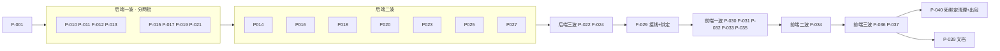

# 产品完善度修复批次 · 执行计划

## Goal And Boundaries

本计划落地[问题清单](../design/2026-09-29-product-completeness/问题清单.md)的全部 88 条问题，实现[概要设计](../design/2026-09-29-product-completeness/概要设计.md)中已接受的 `D-PC01`–`D-PC62`。契约以[详细设计](../design/2026-09-29-product-completeness/需求设计文档.md) v1.1 为准，其中 Planning Handoff 的「固定约束」与「升级规则」对本计划同样有约束力。

完成标准：
- 88 个问题 ID 都能在测试中找到，命名规则见 G-4；
- 双后端 `go test ./...`、`npm test`、`wails build` 全部通过；
- 高风险切片经过独立评审。

不在本计划范围内：概要设计 §1.3 所列的排除项、问题清单 §7 的真机项、详细设计 §8.2 的 IINA「从头播完」缺口。受保护行为见概要设计 §5 与详细设计 §0 的 G-1 到 G-6。

执行方式（用户 2026-09-29 指定并授权）：
- 由 leaf 子代理实现，每个切片使用独立的 git worktree。
  - 2026-09-29 起，用户要求后续子代理一律使用 Opus 5.5、推理强度 xhigh；此前的 P-001～P-021 及其修复、P-018 用的是 Sonnet 5.5。
  - xhigh 需要通过 `.claude/agents/opus-xhigh.md` 定义，会话重载之后才能使用。在那之前，暂时用 `general-purpose` 加 `model: opus`。
- 主代理负责调度、按顺序整合、全量验证与评审；
- 在本地分支 `feat/product-completeness` 上，每个整合点验证通过后提交一次；不推送，不合并到 master；
- 同时运行的子代理不超过 4 个；PG 只开一个容器；剩余磁盘低于 5 GiB 时暂停并告知用户。

*图：波次视图。以 frontmatter 的依赖为准；同批次内只有写入范围不相交的切片才并行。*

### 执行约定（每个子代理的提示词都要包含）

- **对齐基线**：Agent 工具创建 worktree 时以 master（`43efd8a`）为基线，而不是功能分支（P-001 执行时实测确认）。所以子代理开工前的第一步是 `git merge --ff-only feat/product-completeness`，完成后核对 `git log -1` 与主代理给出的基线提交一致，不一致就停下来回报。
- **准备 worktree 环境**：worktree 里缺少被 gitignore 的内容，开始前从主工作区补齐：
  - 复制 `frontend/dist/`（`assets.go` 的 `go:embed` 需要）；
  - 复制 `.loopx/workspace/2026-09-02-capability-batch/baseline/`（`subtitle_translation_test.go` 与 `data-test-set.test.mjs` 会读取）；
  - 软链 `frontend/node_modules`。
  
  在 worktree 中修改了基线文件的，要在交付中列出，由主代理同步回主工作区。
- **写入范围**：只改本切片 `writes` 中列出的源文件。
  - 测试文件（`*_test.go`、`*.test.js`、`frontend/scripts/*.test.mjs`）与 `frontend/src/styles/components.css` 属于**共享追加文件**：同批次的多个切片都可以改，但只能改动或新增与自己行为对应的用例或规则，不得重写或重排别人的用例。主代理整合时按 3-way 合并。
  - 某个既有行为被本切片改变、而它被测试钉住时，由本切片同步修正该断言，并在交付中说明。
- **验证**：
  - 后端切片跑 `go test ./...`（SQLite，全量）；
  - 前端切片跑 `cd frontend && npm test`（全量）；
  - PG 由主代理在每个后端整合点统一跑，子代理不启动任何容器。
- **`is_stale` 写入**：任何写 `is_stale` 的代码都必须同时写入或清空 `stale_reason`（详细设计 §3.1）。全局守卫测试由 P-029 添加。
- **接线**：不得修改 `app.go`、`main.go`、`frontend/wailsjs/**`，也不得给 `App` 结构体加字段。需要接线的地方写成函数或服务方法，并在交付中列出「接线项」。
- **冲突处理**：发现设计与代码事实不符，或者需要改 `writes` 以外的文件时，立即停下该项并回报。不得自行派生子代理，不得提交。

## P-001 Schema、迁移与共享契约

一次性落地详细设计 §1 的全部 schema 变化，外加 §6.4 的 `face_clusters.ignored_at`、§7.2 的 `saved_library_views.person_ids_json`、§7.7 的 `collection_suggestions.target_collection_id`。

迁移部分：
- 回收站 `mode` 回填（只看 `file_moved` 与 `deleted_by`）；
- `short_feed_enabled` 的升级判定，一次性判据必须紧贴 `AutoMigrate`；
- 三个清理阈值；
- 收藏与点赞的并集迁移，用 `favorites_unified_at` 做一次性守卫（§8.1 与 §2.2「点赞升级合并」）；
- 片单唯一索引替换：同步修改 `database/watchlist_kind_schema.go` 与 `watchlist_schema.go` 中的索引断言，老库显式删除旧索引；
- 术语表唯一索引替换；
- **退役 `cleanupReimportedSoftDeletedVideos`**，并把它的测试改为断言相反的行为（§2.2）。

`UpdateSettings` 的白名单纳入三个清理阈值；`short_feed_enabled`、`short_feed_pin_hash`、`favorites_unified_at` 加进整行 `Save` 的 `Omit`（评审 I4），并用测试证明通用保存不会回写这三列。

同时提供共享契约，供下游切片直接调用：
- 常量：失效原因、回收站模式、`personTagNamespace`、登记表 key `image_cleanup`；
- 哨兵错误：`ErrVideoBlockedByUserDelete`、`ErrTrashUnsupportedVolume`、`ErrTrashPermissionDenied`、`ErrTrashIdentityMismatch`；
- 接口：`WatchStateObserver`、`LinkedVideoWatchSetter`；
- 服务层方法：`SetVideoLiked`（在 `library_service.go`，与 `SetVideoFavorite` 同处）与 `SetImageLiked`；两个收藏 setter 维护 `favorited_at`。

完成标准：
- `TestAllModelsIsTopologicallyOrdered` 通过，迁移器往返夹具覆盖全部新表；
- 每个迁移函数都有老库升级与新库两类用例，双后端通过；
- 迁移可重复执行，结果不变；
- 用户关掉的开关不会被翻回；
- 同路径的活跃行在 `ApplySchema` 之后仍然活跃。

> writes: `models/**`, `database/**`, `internal/dbtest/**`, `services/errors.go`, `services/contracts_product_completeness.go`（新）, `services/background_task_registry.go`, `services/settings_service.go`, `services/library_service.go`（仅收藏与点赞 setter）, `services/image_library_service.go`（仅收藏与点赞 setter）
> anchors: 详细设计 §1、§2.2（退役函数、点赞合并）、§6.4、§7.2、§7.7；D-PC01/03/04/05/06/16/17/20/21/31/33/34/36/38/40/45/47/52 的数据部分；G-1
> architecture: 扩展既有的 `ApplySchema` / `migrateXxx` / `AllModels()`，不引入新框架；schema 的唯一所有者是 `models` 与 `database`；共享契约集中在一个文件；维护依靠拓扑序测试与往返夹具
> verify: `go test ./...`（SQLite）；整合时由主代理在 PG 上跑 `CINEINSIGHT_TEST_PG_DSN=… go test -p 1 -timeout 1800s ./...`
> review: 独立评审迁移顺序与一次性判据的位置、并集迁移只执行一次、唯一索引替换后撞名识别前缀是否仍然成立、`Omit` 是否完整、退役清理函数后的依赖方、PG 的三个陷阱

## P-010 回收站、删除与按身份屏蔽（后端）

实现详细设计 §2.1–§2.3 的后端部分：
- 系统废纸篓的 cgo 入口、非 darwin 实现与错误映射；
- 带结果码的新删除方法（`DeleteVideo` / `DeleteImage` 签名不变，遇到不支持的卷返回 `ErrTrashUnsupportedVolume`）；`volume_offline` 不降级；
- 永久删除；
- 统一的回收站列表、用量、恢复、按批次恢复与清除接口；
- `pending_move` 的崩溃恢复；
- `addVideo` / `addImage` 的身份屏蔽表；
- `TrashStagedSources`：把迁移残留移入废纸篓（表由 P-001 提供，登记由 P-011 负责）；
- 图片「扫描隐藏」的列出与重新检查；
- 批量删除的进度与取消；`record_only` 模式不做哈希。

完成标准：
- LIB-04 的三个场景符合 §2.2，并有一条经过 `ApplySchema` 的端到端回归；
- IMG-02：图片只删记录后可以恢复，且不会被重新收录；
- 卷不支持废纸篓时，记录与条目都保持原状；
- 身份不符时拒绝恢复；
- `file_gone` 对账与崩溃恢复的三个分支都正确；
- `legacy_trash` 条目仍可恢复。

cgo 调用在单元测试中通过函数变量注入替身；另写一条只在 darwin 上运行的真实废纸篓用例，只操作临时文件。

> writes: `services/trash_service.go`, `services/system_trash_darwin.go`（新）, `services/system_trash_other.go`（新）, `services/video_service.go`, `services/image_service.go`, `services/image_visibility.go`, `services/scan_restore.go`, `app_trash.go`（新）, `app_video.go`, `app_image.go`
> anchors: D-PC01, D-PC02, D-PC03, D-PC04（后端）, D-PC05（移入废纸篓）, D-PC06（图片隐藏）, D-PC51（删除）；LIB-04, LIB-05, LIB-12, IMG-01, IMG-02, IMG-09, IMG-12
> architecture: 扩展 `TrashService` 与既有的 pending_move → deleted 状态机，不另建回收站；cgo 写法与 `desktop_notify_darwin.go` 同构；状态变更用条件更新；`video_scan.go` 通过 P-001 的哨兵错误识别屏蔽；旧删除签名保持不变，手机端与 Jellyfin 调用方不受影响
> verify: `go test ./...`（SQLite）
> review: 独立评审删除、恢复、永久删除的数据安全；身份核对能否被绕过；有没有静默降级；崩溃恢复是否可能认错文件；历史行的屏蔽判定是否会误屏蔽或误收录

## P-011 可见性、扫描、迁移与重命名（后端）

实现以下内容：
- §3.1 写入部分：本切片文件中的 `is_stale` 都带上原因；`RecheckVideos`、`ReaddRemovedRoot`；
- §3.2 `rewriteLibraryPathPrefixTx` 与重映射；
- §3.3 离线标记、重连对账、60 秒巡检；
- §3.4 跳过原因分项、`library-scan-summary`、`ValidateScanDirectory`；`isTrashPath` 签名不变，内部改用缓存的旧版回收站目录集合，只认旧版回收站与系统废纸篓；`addScannedVideo` 把 `ErrVideoBlockedByUserDelete` 计入 `blocked_user_delete`；
- §2.4 迁移残留登记（与迁移同一事务）、`ListStagedSources` / `DeleteStagedSources`；
- §3.5 `MoveDirectory` 路径改写与 `CheckMoveTarget`；
- §4.1 重命名时的扩展名规则；
- §3.6 播放失败的原因与后台重定位。

接线项：`MoveDirectory` 之后重新配置监听（P-029）。

完成标准：
- LIB-02：重映射后保留原 ID 与标签；
- LIB-03：三个样例文件名都正确；
- LIB-06：回收站与黑名单同步改写；
- LIB-07：离线时标为 `offline_root`，重连后自动恢复；
- LIB-11：暂存文件已登记；
- LIB-13 / PLAY-12：离线时立即返回；
- LIB-14：名为 `Trash` 的目录能正常扫描，跳过原因分项正确；
- LIB-09：`CheckMoveTarget` 的判断正确。

> writes: `services/video_scan.go`, `services/library_watcher.go`, `services/library_watcher_backend_*.go`, `services/library_watcher_support_*.go`, `services/file_migration.go`, `services/file_migration_io.go`, `services/directory_service.go`, `services/directory_scan_progress.go`, `services/video_playback.go`, `services/video_rename_move.go`, `services/scan_volume_*.go`, `services/scan_removal_guard.go`, `app_settings.go`（仅目录相关方法）, `app_scan.go`（新）
> anchors: D-PC05（登记）, D-PC06（写入）, D-PC07, D-PC08, D-PC09（后端）, D-PC10, D-PC11, D-PC12；LIB-01, LIB-02, LIB-03, LIB-06, LIB-07, LIB-08, LIB-09, LIB-10, LIB-11, LIB-13, LIB-14, PLAY-12
> architecture: `rewriteLibraryPathPrefixTx` 是唯一的前缀改写实现，消除 MoveDirectory 的平行实现；窄对账复用 `SyncAffectedDirectories`；监听仍只是加速层；2026-09-11 的扫描删除规则不变
> verify: `go test ./...`（SQLite）
> review: 独立评审重映射与迁移的事务边界、离线判定会不会误判在线的根、`isTrashPath` 收窄后是否会收录旧回收站里的文件

## P-012 片库查询、筛选与可见口径（后端）

实现以下内容：
- §3.1 查询部分：失效视图跳过根裁剪；`stale_reason` 的筛选与计数；`GetLibraryCounts` 与洞察页总数使用可见口径；
- §7.2 `person_ids` 筛选与保存视图持久化；「未打标签」排除自动标签；
- §4.6 `hasAnySubtitleSQL`；
- §7.8 智能视图「本地资料有更新」；
- §7.4 `UpdateSavedLibraryView` 与 `activeTagIDs`。

完成标准：
- LIB-01：删除目录后的记录出现在失效视图里；其余视图的边界由受保护用例钉住，保持不变；
- 人物筛选按 AND 语义生效；
- 保存视图往返一致；
- 「无字幕」视图按三种来源判定。

> writes: `services/library_service.go`（收藏与点赞 setter 以外的部分）, `services/library_stats_service.go`（仅可见口径）, `app_library.go`
> anchors: D-PC06（查询）, D-PC17（判定式）, D-PC33, D-PC35（桌面）, D-PC39（视图）；LIB-01, LIB-08（计数）, LIB-15, META-02（筛选）, META-07, META-10（未打标签）, MEDIA-08（视图）, PLAY-07（口径）
> architecture: 扩展共享的 `applyLibraryFilter` / `LibraryFilter`（主片库、随机、Jellyfin 共用的边界），不另建查询路径；`hasAnySubtitleSQL` 与 `activeTagIDs` 各只定义一次
> verify: `go test ./...`（SQLite）
> review: 独立评审放宽是否只作用于失效视图，随机、Jellyfin、手机端是否仍然排除失效记录

## P-013 字幕写入器、编码、工作台与翻译（后端）

实现以下内容：
- §4.2 `SubtitleFileWriter`：生成时先写临时文件，校验通过后再替换；强制生成与放弃；备份的列出与恢复；`GetSubtitleOverwriteInfo`；
- §4.3 编码识别与转换（`golang.org/x/text` 改为直接依赖）；
- §4.4 工作台把格式问题做成 issue；缺少字幕时返回 `subtitle_missing`；错误信息中文化；
- §4.5 两种重译模式、共用的空译文回退、术语表的目标语言；
- §4.6 `subtitle_not_sidecar_srt`。

完成标准：
- MEDIA-01：遇到幻觉、空结果、取消时，原字幕逐字节不变；
- MEDIA-02：GBK 字幕在转换前拒绝写入，转换后可以从备份恢复；
- MEDIA-05：可以恢复上一版；
- MEDIA-06：零时长条目可以打开并一键修复；
- MEDIA-07：只替换译文行；术语按目标语言注入；
- DeepL 的请求体与基线一致。

> writes: `services/subtitle_file_writer.go`（新）, `services/subtitle_service.go`, `services/whisperx_runtime.go`（仅 `writeSRT` 路径）, `services/subtitle_translate_file.go`, `services/subtitle_translation.go`, `services/subtitle_workbench.go`, `services/subtitle_atomic_replace_*.go`, `services/subtitleparser/**`, `services/translation_glossary_service.go`, `app_subtitle.go`, `go.mod`, `go.sum`
> anchors: D-PC13, D-PC14, D-PC15, D-PC16, D-PC17（错误码）；MEDIA-01, MEDIA-02, MEDIA-05, MEDIA-06, MEDIA-07, MEDIA-08（共用覆盖）
> architecture: 复用 `replaceSubtitleFileAtomically` 与 `lockSubtitleFile`（由调用方持锁）；写入器是 `.srt` 唯一的写入入口，P-016 与 P-025 复用它
> verify: `go test ./...`（SQLite）
> review: 独立评审每条失败路径是否保持原文件不变、备份数量与文件权限、编码探测是否会误判 UTF-8

## P-015 AI 打标语义、批量审阅与空闲门（后端）

实现以下内容：
- §6.2 规则 2、3、5、6 与 IMG-14，其中规则 6 落在 `loadActiveTags` / `loadActiveLibraryTags`；
- 提供「手动加标签时作废对应候选」的服务函数，视频与图片两侧的调用点由 P-020 接入；
- 词表指纹去掉 `UpdatedAt`；
- §6.3 批量批准；
- §5.2 worker 的启动批次与定时轮次经过空闲门；需要注入时写成服务方法，接线项交给 P-029。

完成标准：
- META-01：被拒绝的标签不会再次生成，改颜色不会导致重新排队；
- META-06：已有人工标签时，批准不会被作废；
- META-12：「人物」分类的标签不进入提示词；
- IMG-08：可以手动重新分析；
- IMG-14：已删除的图片可以整体拒绝；
- APP-04：定时轮次会在空闲门后等待，显式触发照常直通。

> writes: `services/ai_tagging_service.go`, `services/ai_tagging_extractor.go`, `services/ai_tagging_client.go`, `services/ai_tagging_agent.go`, `services/ai_tagging_types.go`, `services/image_ai_tagging_service.go`, `services/image_ai_tagging_review.go`, `services/image_ai_tagging_client.go`, `services/idle_gate.go`（仅在需要时）, `app_ai.go`（仅 AI 打标方法）
> anchors: D-PC28（规则 2/3/5/6、指纹）, D-PC29（批量批准）, D-PC19（worker）；META-01, META-06, META-11（批量）, META-12, IMG-08, IMG-14, APP-04
> architecture: 在既有的候选状态机内修改，不新增状态；拒绝记忆与图片侧 `image_ai_tagging_service.go:649-683` 对齐；空闲门复用 `IdleGate.Run` / `RunGatedTaskNow`；质量评估的分母口径不变
> verify: `go test ./...`（SQLite）
> review: 独立评审空闲门接入后显式触发是否仍然直通、是否会丢失唤醒、拒绝记忆是否误伤改名或合并过的标签

## P-017 标签、人物、本地资料与建议作品集（后端）

实现以下内容：
- §6.2 规则 4 与规则 6 的另一半：`resetAITaggingAfterLibraryChange` 只在内容变化时调用；`isAITagEligible` 与重置时的候选作废条件都排除「人物」分类；
- §7.1 合并人物、删除人物、影响统计；NFO 同一批次内的同名人物只决策一次；
- §7.3 标签转人物的转换记录与撤销；
- §7.4 合并标签时改写保存视图；
- §7.5 新的低清判定、`GetVideoAutomaticTagOverrides`、`ClearVideoAutomaticTagOverride`；
- §7.6 `GetTagUsageCounts`；
- §7.7 用哈希构造 `dismiss_key`，新增 `append` 候选；
- §7.8 差异中带名字，写出 NFO 后同步状态；
- §8.8 `UpdateVideoRating`：评分即时保存，属于 `video_detail_service`。

完成标准：
- META-02：撤销后完整复原，包括撞名时的回滚；
- META-03：同一批次内的同名人物只建一个；
- META-05：删除人物后，人脸簇回到未命名；
- META-07：合并后保存视图被改写；
- META-09：差异中带名字；
- META-10：1920×800 不算低清；
- META-13：恢复后重新跟随自动规则；
- META-14：计数正确；
- META-15：被忽略的系列新增一集后不再出现；已确认的系列新增一集时生成 `append` 候选。

> writes: `services/tag_service.go`, `services/tag_person_conversion.go`, `services/person_service.go`, `services/video_detail_service.go`, `services/local_metadata_*.go`, `services/collection_suggestion_*.go`, `services/collection_service.go`, `app_media_details.go`
> anchors: D-PC28（规则 4/6）, D-PC32, D-PC34, D-PC35（合并改写）, D-PC36（标签）, D-PC37（计数）, D-PC38, D-PC39（差异与写出）, D-PC47（评分）；META-02, META-03, META-05, META-07, META-09, META-10, META-13, META-14, META-15, PLAY-14（评分）
> architecture: 在 `TagService` 原事务内同步（统一标签库 D-003 的做法）；人物相关的口径复用 `personHasRemainingRelations` / `reconcileFaceClusterPeople`；建议作品集不套外层事务（SQLite 会自锁）
> verify: `go test ./...`（SQLite）
> review: 独立评审撤销事务在各种中间状态下的回滚、合并人物时关系去重与人脸簇的改指向

## P-019 片单、榜单与片库关联（后端）

实现详细设计 §10 的后端部分：
- 豆瓣 ID 的传递，补全时直接按 ID 查询；
- 片单与榜单双向同步；
- 服务层做撞名检查；
- `movie_video_links` 与 `SuggestLibraryMatches`；
- `MovieChartService` 实现 `WatchStateObserver`，反向通过 `LinkedVideoWatchSetter` 调用。

接线项：两个方向的注入（P-029）。

完成标准：
- APP-07：删除片单条目时同步撤销榜单标记；同名但豆瓣 ID 不同的两部片可以共存；手动添加时的撞名文案不变；
- APP-06：给出片库关联建议；
- APP-05：回调会把榜单标为已看，且不会循环触发。

> writes: `services/movie_chart_*.go`, `services/watchlist_*.go`, `services/movie_video_link.go`（新）, `app_watchlist.go`, `app_movie_chart.go`
> anchors: D-PC52；APP-05, APP-06, APP-07
> architecture: 复用 `source_name/source_item_id` 两列；由 App 分别注入两个服务，两者互不 import；claim 与 `DoUpdates` 的禁用列不变
> verify: `go test ./...`（SQLite）；整合时主代理必须跑 PG（涉及唯一索引与 upsert）
> review: 独立评审双向同步是否会循环、PG 上撞名识别是否正确

## P-021 手机端访问控制、可见性与体验（后端）

实现以下内容：
- §8.6 开关与 PIN：
  - 鉴权覆盖 `/short-api/*`、`/short-media/`、`/short-thumb/` 以及今后新增的数据路由；
  - 按 IP 限次，使用会话 Cookie，加路由全集守卫测试；
  - `startShortFeedServer` 的开关检查通过服务方法提供，接线由 P-029 完成；
  - 视频候选、收藏页、`ResolveMedia` 都套用可见边界。
- §8.1 手机侧：收藏与点赞直接调用 P-001 的 setter，删除旧的投影与对账逻辑；收藏页按 `favorited_at` 排序；核对「反馈回流」开关除此之外还控制什么，并写进交付说明。
- 删除遇到 `ErrTrashUnsupportedVolume` 时返回 409。
- §8.7 手机端白名单、`unplayable_count`。
- §8.8 二维码与端口的中文文案。
- 本切片中的 `is_stale` 写入带上原因。

完成标准：
- PLAY-01：黑名单内的视频在 feed、收藏、媒体、缩略图中都不可见；设置 PIN 后，所有数据路由未登录时返回 401；连续 5 次失败后锁定；
- PLAY-02：手机端与桌面端收藏一致；
- PLAY-13：`.mov` 可以播放，并统计不可播放数量；
- 既有的同源与请求体纪律测试通过。

> writes: `services/short_feed_*.go`, `services/short_feed_auth.go`（新）, `services/short_feed_mobile_mime.go`（新）, `services/qrcode_darwin.go`（新）, `services/qrcode_other.go`（新）, `app_short_feed.go`（新）
> anchors: D-PC40（手机侧）, D-PC45, D-PC46（后端）, D-PC47（二维码与文案）；PLAY-01, PLAY-02, PLAY-13, PLAY-14（部分）
> architecture: 可见性直接调用 P-012 维护的 `applyScanRootScope` 与失效条件，不复制规则；鉴权叠加在既有防线之上；与浏览器桥接是两条独立的边界；`inlinePreviewMIMEs` 不改
> verify: `go test ./...`（SQLite）
> review: 独立安全评审 PIN 比较、限次与 Cookie 属性、是否有路由漏挂鉴权、可见性是否与桌面端一致

## P-014 字幕队列持久化、引擎准备与索引节流（后端）

实现以下内容：
- §5.3 `subtitle_jobs`、`ResolveSubtitleJob`、中断标记、`subtitle-failed`、通知文案；
- §5.5 引擎准备可取消、状态缓存、索引同步节流；
- §4.6 写入 `has_sidecar`。

完成标准：
- MEDIA-04：失败和待确认的任务都能查到并处理；
- MEDIA-10：中断的任务可以重新排队；
- MEDIA-13：引擎准备可以取消；
- MEDIA-14：10 分钟内不会重复对全库做 stat。

> writes: `services/subtitle_queue.go`, `services/subtitle_service.go`, `services/whisperx_runtime.go`, `services/qwen_runtime.go`, `services/subtitle_search_service.go`, `services/subtitle_config.go`, `services/subtitle_contracts.go`, `app_subtitle.go`
> anchors: D-PC20, D-PC22（后端）, D-PC23（后端）, D-PC17（has_sidecar）；MEDIA-04, MEDIA-10, MEDIA-13, MEDIA-14
> architecture: 仍是单一 FIFO 队列，只把状态持久化；待确认的产物使用 P-013 的临时文件与写入器；转写槽不变
> verify: `go test ./...`（SQLite）

## P-016 清理中心（后端）

实现以下内容：
- §9.1 元组排序（修复漏掉的 `Preload`）、`curation`、`MergeMediaMetadata`：字幕经写入器处理，已看状态经过观察者；
- §9.3 覆盖率；
- §9.4 分析可以取消，图片分析登记为 `image_cleanup`；
- §6.5 忽略记录带指纹并在文件变化后失效；移出单个成员；忽略列表与撤销；极短与极低两类的忽略；
- §7.5 清理阈值读取设置。

完成标准：
- IMG-03：保留建议与合并正确，合并失败时不删除；
- IMG-07：移出、失效、撤销都正确；
- IMG-11：覆盖率正确；
- IMG-12：分析可以取消；
- APP-11：可以忽略。

> writes: `services/cleanup_service.go`, `services/cleanup_review.go`, `services/perceptual_hash_cleanup.go`, `services/image_cleanup.go`, `services/clip_cleanup.go`, `services/media_metadata_merge.go`（新）, `app_cleanup.go`
> anchors: D-PC31, D-PC36（阈值）, D-PC48, D-PC50, D-PC51（分析）；IMG-03, IMG-07, IMG-11, IMG-12, APP-11（忽略）, META-10（清理侧）
> architecture: 扩展 `cleanup_review.go` 的统一过滤；合并是独立事务，在删除之前执行、不嵌套；旧的五类快照如按新排序更新了预期，需在交付中说明
> verify: `go test ./...`（SQLite）
> review: 独立评审合并的正确性（作品集位置、评分为 NULL 的语义、字幕迁移失败时的警告、已看回调）以及忽略的失效条件

## P-018 人脸可逆与分页（后端）

实现以下内容：
- §6.4 忽略列表与恢复、解除关联与改派（含预览）、逐条确认追加、已命名簇的来源移除；
- §6.3 键集分页。

完成标准（META-04 / META-11）：
- 恢复后簇回到未命名；
- 解除关联时只删除「未被该人物其他簇覆盖」的关系；
- 改派时迁移关系并去重；
- 逐条确认只写入所选观测；
- 分页游标稳定。

> writes: `services/face_review_service.go`, `services/face_review_detail.go`, `services/face_analysis_service.go`（仅 `ignored_at`）, `services/face_cluster.go`, `app_ai.go`（仅人脸方法）
> anchors: D-PC30, D-PC29（人脸分页）；META-04, META-11（人脸）
> architecture: `face_review_service.go` 仍是唯一写关系的地方，分析路径绝不写关系；并发保护沿用 `WHERE status=…` 加影响行数判断
> verify: `go test ./...`（SQLite）
> review: 独立评审解除关联与改派时删除关系的范围，以及并发下的状态转换

## P-020 观看状态与手动标签接入（后端）

实现以下内容：
- §8.2 `isWatchCompleted` 统一三条上报路径；IINA 会话登记：在 `playback_launcher.go` 加 `onPlaybackLaunched` 钩子，在 IINA 服务里加登记方法，接线由 P-029 完成；删除事件时结合墙钟推算。
- §8.3 `resumable`、`--mpv-start`、IINA 以最近写入为准、`origin` 参数、「继续观看」的条件与排序。允许修改 `jellyfin_playback.go` 中调用 `UpdateVideoWatchProgress` 的那一处，以保持包能编译。
- §8.8 `GetIINASyncStatus`。
- `SetVideoLiked` 的 App 绑定。
- `VideoService` 实现 `LinkedVideoWatchSetter`，并在已看状态翻转时回调观察者。
- 把 P-015 的候选作废函数接入视频 `AddTagToVideo` 与图片 `AddTagToImage`。

完成标准：
- PLAY-11：1:57:30 判为看完；
- PLAY-03：续播后看完判为看完，从头播完不判；
- PLAY-06：启动时带上断点参数，以新写入为准；
- PLAY-09：按进度更新时间排序；
- PLAY-10：`jump` 来源不回写更早的位置，重看可以续播；
- 2026-09-13 的受保护用例按新公式更新后通过。

> writes: `services/library_service.go`（观看相关函数）, `services/iina_progress_service.go`, `services/playback_launcher.go`, `services/video_service.go`, `services/image_library_service.go`（仅 `AddTagToImage` 调用点）, `services/jellyfin_playback.go`（仅 `UpdateVideoWatchProgress` 调用点）, `app_video.go`
> anchors: D-PC40（桌面点赞绑定）, D-PC41, D-PC42（非 Jellyfin）, D-PC47（IINA 状态）, D-PC28（规则 2 接入）, D-PC52（视频侧）；PLAY-02, PLAY-03, PLAY-06, PLAY-09, PLAY-10, PLAY-11, PLAY-14（IINA）, META-06, IMG-08（接入）
> architecture: `isWatchCompleted` 与 `resumable` 各只有一处定义；前端 `utils/watchState.js` 由 P-034 实现，使用同一组样例；观察者在事务提交后回调，失败只记日志；`SetVideoWatchedFromLink` 不触发观察者
> verify: `go test ./...`（SQLite）
> review: 独立评审短片与未知时长的边界、以最近写入为准后陈旧断点是否会把状态拉回、观察者是否会循环

## P-023 有效观看事件与随机延迟提交（后端）

实现以下内容：
- §8.4 `RecordViewEvent` 与会话去重；手机端 `mobile_feed` 阈值（后端侧）；随机播放延迟 30 秒提交、`RerollRandom`、关闭时提交（接线项）；洞察页口径；
- §8.5 后端文案。

完成标准（PLAY-07 / PLAY-08）：
- 30 秒内点「换一个」，不写计数也不写事件；超时或应用关闭时写入一次；
- 同一会话只记一次 `inline_view`；
- 覆盖率不再单凭随机次数把视频算作「看过」；
- 账本只追加的受保护测试通过。

> writes: `services/video_random.go`, `services/video_playback.go`, `services/library_stats_service.go`, `services/play_view_events.go`（新）, `app_library.go`
> anchors: D-PC43, D-PC44（后端）；PLAY-07, PLAY-08
> architecture: 计数与事件在同一事务中提交；账本不做 UPDATE/DELETE；随机打分只读三列
> verify: `go test ./...`（SQLite）

## P-025 下载、超分与预览代理（后端）

实现以下内容：
- §5.4 下载部分：持久化记录不含请求头；`error` 先清洗再落盘；启动时标为中断；同一会话内可重试；
- §5.7 三个入库动作；
- §5.6 复检时扣除已写字节、失败时保留检查点、`copy_metadata`（字幕经 P-013 的写入器）、未就绪状态；
- §5.8 `GetPreviewSession` 优先用代理；代理队列按项给出排位，供抽屉显示「第 N 个」。

完成标准：
- MEDIA-03：空间计算正确，可以续跑；
- MEDIA-09：三个动作可用，可以重试；
- MEDIA-10：表中不含请求头、Cookie、带签名的 query；
- MEDIA-11：产物继承原片的元数据；
- PLAY-05：有代理时优先使用代理，`TestInlinePreviewMIMEsUnchanged` 仍然通过。

> writes: `services/browser_download_service.go`, `services/browser_bridge_server.go`（仅状态字段）, `services/enhancement_*.go`, `services/preview_service.go`, `services/playback_proxy_service.go`（仅队列排位）, `app_browser_bridge.go`, `app_tasks.go`（仅超分与下载方法）
> anchors: D-PC21（下载持久化）, D-PC24, D-PC25（后端）, D-PC26（会话与排位）；MEDIA-03, MEDIA-09, MEDIA-10, MEDIA-11, PLAY-04（排位）, PLAY-05
> architecture: 下载的安全规则不变；续跑复用既有检查点；正式播放永远打开源文件
> verify: `go test ./...`（SQLite）
> review: 独立安全评审持久化的内容中不含敏感信息

## P-027 数据安全与退出放行（后端）

实现详细设计 §11：
- 备份可用性按后端判断；
- SQLite 恢复修复并加集成测试；
- `RevealBackupDirectory`；
- 后端切换进入维护模式（停服清单加入 `FrameHashService`）；
- `RelaunchApp`、`SwitchBackendConfigOnly`、`ClearMigrationTarget`；
- `StartPeriodic`（接线项）。

同时在新文件 `app_quit.go` 建立退出守卫的状态与 `allowInternalQuit()`。恢复完成与 `RelaunchApp` 退出前先调用它。`beforeClose` 的任务判定由 P-024 补全。

完成标准：
- APP-01：SQLite 上「备份 → 修改 → 恢复」后，数据回到备份时的状态；
- APP-02：切换期间拒绝写入；清空目标库后可以重试；只改配置的切换返回 `relaunch_required`；PG 上只删 `AllModels` 中的表；
- APP-09：定时调用生效；
- 内部发起的退出不会被拦住。

> writes: `services/backup_service.go`, `services/database_switch_service.go`, `database/maintenance.go`, `app_settings.go`（备份、切换、恢复相关方法，以及 `UpdateSettings` 调用 `SyncFeedback` 的那一处）, `app_quit.go`（新）
> anchors: D-PC54, D-PC55, D-PC56, D-PC21（内部退出放行）；APP-01, APP-02, APP-09
> architecture: 维护模式只有 `enterDatabaseRestoreMode` 这一个入口；迁移器只读、不修改；删除范围由 `AllModels()` 决定
> verify: `go test ./...`（SQLite）；整合时主代理跑 PG
> review: 独立评审 `ClearMigrationTarget` 的删除范围与确认、维护模式期间是否还有写入口、SQLite 恢复失败后的状态

## P-022 Jellyfin 口径统一与会话持久化（后端）

实现以下内容：
- §8.3 的 Jellyfin 部分；
- §8.4 `jellyfin_view`；
- §8.8 会话持久化：用户关闭 Jellyfin 或修改账号、配置时作废会话，`Stop()` 不作废；`GetJellyfinDiagnostics`；
- §4.6 `HasSubtitles`；
- §7.4 `activeTagIDs`；
- 删除遇到 `ErrTrashUnsupportedVolume` 时沿用既有的失败映射。

完成标准：
- PLAY-09：口径与片库一致；
- PLAY-14：重启后令牌仍然有效，关闭 Jellyfin 后失效；
- META-07：已删除的标签不会让保存视图变空；
- Fileball 回放与日志脱敏的既有用例通过。

> writes: `services/jellyfin_*.go`, `app_jellyfin.go`
> anchors: D-PC42（Jellyfin）, D-PC43（jellyfin_view）, D-PC47（会话与诊断）, D-PC17（HasSubtitles）, D-PC35（Jellyfin 侧）；PLAY-09, PLAY-14, META-07, MEDIA-08
> architecture: 复用 P-012 与 P-020 的判定，不复制；offset 分页只放在适配层；进度上报只在越过阈值时写一条事件
> verify: `go test ./...`（SQLite）
> review: 独立安全评审只存令牌哈希、过期与作废语义、诊断信息不泄露敏感内容

## P-024 任务中心、待处理汇总与退出保护（后端）

实现以下内容：
- §5.1 `GetTaskCenterSnapshot`：21 个 key 的适配表，加守卫测试；
- §6.1 `GetPendingWorkSummary`：按配对去重；
- §5.4 `beforeClose` 的任务判定、`quit-confirm-required`、`ConfirmQuit`：基于 P-027 的退出守卫；在 `main.go` 注册是接线项。

完成标准：
- APP-03：21 个 key 全部覆盖，漏掉任何一个测试即失败；三种状态都正确；最近任务涵盖四类；
- META-08：各项计数口径与对应服务一致；
- MEDIA-10：有任务在运行时拦截退出，内部发起的退出放行。

> writes: `app_task_center.go`（新）, `app_pending.go`（新）, `app_quit.go`, `app_tasks.go`
> anchors: D-PC18（后端）, D-PC27（后端）, D-PC21（退出保护）；APP-03, META-08, MEDIA-10
> architecture: 只读聚合，不新建状态源（概要设计图 3.3）；事件合并只在 App 层进行
> verify: `go test ./...`（SQLite）

## P-029 后端接线与绑定生成

把各切片交付中列出的接线项全部接到 `app.go` / `main.go`，至少包括：
- 观察者的双向注入；
- `onPlaybackLaunched` 钩子；
- `startShortFeedServer` 在内部检查开关；
- AI worker 的空闲门（如需要）；
- 定时备份；
- 关闭时提交随机未决项；
- `OnBeforeClose`；
- `MoveDirectory` 之后重新配置监听；
- 字幕中断任务的启动提示事件。

另外加一条全局守卫测试：所有写 `is_stale` 的地方都同时维护 `stale_reason`。

重新生成 `frontend/wailsjs/**`（`GOTOOLCHAIN=go1.24.9`，用 wails 生成模块绑定）。生成失败就停下报告，不手工编辑。本切片**不删除旧绑定**，也**不做** `wails build`：此时前端仍在引用旧方法，这两件事交给 P-040。

完成标准：
- 每个接线项都有集成测试或冒烟用例；
- 新方法全部出现在绑定中；
- `go test ./...` 双后端通过（PG 由主代理跑）；
- `cd frontend && npm test` 在新绑定下仍然全绿。

> writes: `app.go`, `main.go`, `main_bindings.go`, `app_video.go`（仅重新配置监听）, `app_test.go`, `services/stale_reason_guard_test.go`（新）, `frontend/wailsjs/**`
> anchors: 各后端切片的接线项；D-PC06（全局守卫）；G-5（新增部分）
> architecture: `app.go` 只保留结构体、构造函数、`startup` / `shutdown`；只加接线所必需的字段
> verify: `go test ./...`（SQLite）；PG 全量（主代理）；`cd frontend && npm test`
> review: 主代理做一次后端整合审查：有无重复实现、依赖方向是否正确、有无平行的真值来源

## P-030 回收站与删除（前端）

实现 §2.3 与 D-PC02 的前端部分：
- `TrashCenterDialog`，四个页签，替代两个旧弹窗；
- 废纸篓不可用时的选择弹窗，永久删除需二次确认；
- 撤销整批删除；删除确认框中说明后果；
- 图片页：删除反馈与撤销、`confirm_before_delete`、删除文件夹时的实际文案、扫描隐藏、删除进度与取消；
- 图片页的零散文案（D-PC61 中与图片相关的部分）；
- 图片 AI「重新分析」入口；
- 注册命令：`VideoListPage` 注册 `library.openCleanup`、`library.openAIReview`、`library.openLocalMetadataUpdates`，`PhotoLibraryPage` 注册 `photos.openAIReview`（详细设计 §6.1 的契约）。

完成标准：LIB-05、LIB-12、IMG-02、IMG-06、IMG-08（入口）、IMG-09 以及 D-PC02 的流程都有组件测试。

> writes: `frontend/src/components/TrashCenterDialog.vue`（新）, `frontend/src/components/TrashUnsupportedDialog.vue`（新）, `frontend/src/components/TrashRestoreDialog.vue`, `frontend/src/components/PhotoTrashDialog.vue`, `frontend/src/components/video-list/TrashUndoBanner.vue`, `frontend/src/components/DeleteConfirmDialog.vue`, `frontend/src/components/VideoListPage.vue`, `frontend/src/components/PhotoLibraryPage.vue`, `frontend/src/components/PhotoAITaskPanel.vue`
> anchors: D-PC01（文案）, D-PC02, D-PC04, D-PC05（残留页签）, D-PC06（图片隐藏）, D-PC27（命令注册）, D-PC28（图片重新分析）, D-PC51（删除进度）, D-PC61（图片文案）；LIB-05, LIB-12, IMG-02, IMG-06, IMG-08, IMG-09
> architecture: 复用 `BaseModal` / `confirmAction`；共享样式类放 `styles/components.css`；局部移除沿用既有规则
> verify: `cd frontend && npm test`
> review: 独立评审永久删除的二次确认、废纸篓不可用时的选择流程、整批撤销，以及文案与实际行为是否一致

## P-031 任务中心、待处理工作台与导航（前端）

实现以下内容：
- `TaskCenterDrawer`；
- `PendingWorkHub`：列出事项与计数，点击后执行命令跳转到对应页面（详细设计 §6.1），不重新挂载面板；
- 顶栏三组；「下载」只在开启时显示；改名为「观影记录」；
- 退出确认弹窗；
- 设置页离开确认：`App.vue` 监听 `SettingsPage` 的 `update:dirty`（布尔值）；
- 命令面板新增全局命令，成功时给出提示；
- `LibraryToolbar` 的全部改动：管理菜单、移除旧徽标、去掉标签上的 ×、人物组合框（通过 emit 传出筛选变化）、随机按钮显示当前模式、智能视图、语义模式下禁用随机、注册 `library.openCollectionSuggestions`；
- 补全标签表并加守卫测试。

完成标准：
- APP-03、APP-11、APP-12、APP-14、META-08、META-14（×）、META-02（入口）、PLAY-08（按钮）都有测试；
- 工作台中每一条跳转命令都断言调用了约定的命令 ID。

> writes: `frontend/src/App.vue`, `frontend/src/components/TaskCenterDrawer.vue`（新）, `frontend/src/components/PendingWorkHub.vue`（新）, `frontend/src/components/QuitConfirmDialog.vue`（新）, `frontend/src/components/CommandPalette.vue`, `frontend/src/utils/appCommands.js`, `frontend/src/utils/taskCommands.js`, `frontend/src/utils/commandRegistry.js`, `frontend/src/utils/idleScheduling.js`, `frontend/src/components/video-list/LibraryToolbar.vue`, `frontend/src/components/video-list/BackgroundTaskStatusBars.vue`
> anchors: D-PC18（前端）, D-PC27（前端）, D-PC21（退出确认）, D-PC33（入口）, D-PC37（×）, D-PC39（入口）, D-PC44（按钮）, D-PC52（改名）, D-PC57（App 侧）, D-PC59, D-PC60；APP-03, APP-11, APP-12, APP-14, META-08, META-14, META-02, PLAY-08
> architecture: 工作台只做汇总和跳转；命令统一走 `commandRegistry`；各页面职责不变
> verify: `cd frontend && npm test`

## P-032 清理中心（前端）

实现以下内容：
- `utils/cleanupSelection.js`；
- 统一的勾选与锁定规则；
- 删除前汇总确认，「合并元数据」选项默认勾选；
- 卡片显示整理成果；
- 覆盖率与空态；
- 移出单个成员、「已忽略」页签与撤销、极短与极低两类的忽略；
- 类别改名并标出阈值；
- 分析可以取消；
- `AutomationSection` 的阈值输入与 IINA 文案（PLAY-06）。

完成标准：IMG-03、IMG-04（改掉旧测试第 42 行）、IMG-05、IMG-07、IMG-11、META-10（清理侧）都有测试。

> writes: `frontend/src/components/video-list/CleanupReviewPanel.vue`, `frontend/src/components/PhotoCleanupPage.vue`, `frontend/src/components/CleanupThumbnail.vue`, `frontend/src/utils/cleanupSelection.js`（新）, `frontend/src/components/settings/AutomationSection.vue`
> anchors: D-PC31（前端）, D-PC36（阈值）, D-PC48（前端）, D-PC49, D-PC50, D-PC42（IINA 文案）；IMG-03, IMG-04, IMG-05, IMG-07, IMG-11, META-10, PLAY-06（文案）
> architecture: 两个页面共用同一个纯函数模块
> verify: `cd frontend && npm test`
> review: 独立评审先合并、失败则不删除的交互顺序，以及默认勾选不会误选近似重复

## P-033 设置、数据安全、片单、下载与超分（前端）

实现以下内容：
- `SettingsPage`：脏状态、`update:dirty`、`saveMode`、即时动作前先提示保存、只在 AI 字段变化时触发、扫描目录排第 2 位；
- Jellyfin 独立分区（含诊断）；
- `ProxySection` 改名与文案；
- `MobileSection`：开关、PIN、二维码、提示条、文案；如果 P-021 的结论是「反馈回流」开关不再控制其他行为，就删除该入口；
- `DatabaseSection`：各项功能，清空目标库时要求输入「清空」确认；
- `IdleSchedulingSection`；`SubtitleSection` 的引擎状态；`BrowserBridgeSection` 的目录校验；
- 片单、榜单、观影记录三页；下载页；`EnhanceDialog`；
- 新增的设置列进入显式载荷。

完成标准：
- APP-01、APP-02、APP-05、APP-06、APP-07、APP-08、APP-09、APP-10（设置部分）、MEDIA-09、MEDIA-11、MEDIA-13、PLAY-01（设置部分）、PLAY-14（诊断与二维码）都有测试；
- `ai-tag-library.test.mjs` 等读取这些文件的脚本通过。

> writes: `frontend/src/components/SettingsPage.vue`, `frontend/src/components/settings/*.vue`（`ScanDirectoriesSection.vue`、`AutomationSection.vue` 除外）, `frontend/src/components/WatchlistPage.vue`, `frontend/src/components/MovieChartPage.vue`, `frontend/src/components/WatchedMoviesPage.vue`, `frontend/src/components/DownloadsPage.vue`, `frontend/src/components/downloads/DownloadRow.vue`, `frontend/src/components/video-list/EnhanceDialog.vue`, `frontend/src/utils/enhancement.js`（新）
> anchors: D-PC19（前端）, D-PC24（前端）, D-PC25（前端）, D-PC45（设置）, D-PC47（诊断与二维码）, D-PC52（页面）, D-PC54–D-PC58（前端）, D-PC61（设置文案）；APP-01, APP-02, APP-05, APP-06, APP-07, APP-08, APP-09, APP-10, MEDIA-09, MEDIA-11, MEDIA-13, PLAY-01, PLAY-14
> architecture: 沿用 `form` prop 加父组件统一保存的模式；专用接口不走通用保存；`SETTINGS_SECTIONS` 是唯一的锚点来源
> verify: `cd frontend && npm test`
> review: 独立评审清空目标库、只改配置、立即重启三个流程的确认文案与防误触

## P-035 审阅、人脸、标签与人物（前端）

实现以下内容：
- AI 审阅：批量批准；切到同源页签时才标记已读；「去清理」；不再作废的提示；
- 人脸：分页、已忽略列表与恢复、解除关联与改派（含预览）、逐条确认追加、忽略前确认；
- 标签管理：未保存修改的确认、影响计数、最近的转换与撤销；转换页说明后果；
- 覆盖角标与「恢复自动」；
- 人物页：合并与删除；在 `EntityLibraryPage` 注册 `people.openFaceReview`；为 `EntityLibraryPage` 中的 `UpdateVideoWatchProgress` 调用点加上 `origin`；
- 抽屉：「新建并加入」推迟到保存时生效，删除最后一条关系前确认，评分即时保存（`UpdateVideoRating`）；
- 本地资料弹窗显示名字；
- 建议作品集的 `append` 候选。

既有面板的 props 与 emits 只增不改。

完成标准：META-02、META-03、META-04、META-05、META-06、META-09、META-11、META-13、META-14、META-15 都有测试。

> writes: `frontend/src/components/AITagReviewDialog.vue`, `frontend/src/components/AIQualityPanel.vue`, `frontend/src/components/ImageAITagReviewPanel.vue`, `frontend/src/components/FaceClusterReviewPanel.vue`, `frontend/src/components/FaceClusterDetailDialog.vue`, `frontend/src/components/TagManagerDialog.vue`, `frontend/src/components/TagPersonConversionPanel.vue`, `frontend/src/components/TagDeleteDialog.vue`, `frontend/src/components/AddTagDialog.vue`, `frontend/src/components/EntityLibraryPage.vue`, `frontend/src/components/PreviewDrawer.vue`, `frontend/src/components/LocalMetadataDialog.vue`, `frontend/src/components/CollectionSuggestionPanel.vue`, `frontend/src/utils/aiTagReview.js`
> anchors: D-PC27（同源标已读的时机、命令注册）, D-PC28–D-PC30（前端）, D-PC32, D-PC34, D-PC36（角标）, D-PC37, D-PC38, D-PC39, D-PC47（评分）, D-PC42（`origin`，人物页调用点）；META-02, META-03, META-04, META-05, META-06, META-09, META-11, META-13, META-14, META-15
> architecture: 面板的对外接口只增不改；局部移除与补页沿用既有规则
> verify: `cd frontend && npm test`
> review: 独立评审解除关联与改派的预览确认、合并与删除人物的确认、撤销转换的交互

## P-034 片库页：可见性、扫描、筛选与行菜单（前端）

`VideoListPage` 在本波次由本切片独占。实现以下内容：
- 失效视图按原因分组，提供重新定位、重新检查、加回目录；
- 扫描摘要与刷新；`ScanDialog` 的确认与嵌套提示；重映射二选一；设置页错误显示；
- 迁移到扫描根之外前先确认；播放失败的行原地标为失效；三种空状态；
- 重命名对话框；
- 行菜单新增：点赞、重新分析、视频超分（未就绪）、重新定位、重新检查；
- `matchesSmartView` 同步「继续观看」「未打标签」「本地资料有更新」「失效」的新口径；
- `person_ids` 写入 `currentLibraryFilter`；
- 保存视图显示「N 个条件已失效」，支持更新与改名（`SaveViewDialog`）；
- 新建 `utils/watchState.js`：`isWatchCompleted` / `resumable` 的 JS 版本，使用与 Go 相同的样例；把 `VideoListPage.vue:389-395,1657-1666` 改为调用它；
- `UpdateVideoWatchProgress` 调用点加上 `origin`；
- `VideoListRow`：失效原因、点赞按钮、重看进度。

完成标准：LIB-01、LIB-02、LIB-03、LIB-08、LIB-09、LIB-10、LIB-14、LIB-15、META-07（前端）、PLAY-10（前端）、PLAY-11（前端公式）、PLAY-12、APP-10 都有测试。

> writes: `frontend/src/components/VideoListPage.vue`, `frontend/src/components/VideoListRow.vue`, `frontend/src/components/ScanDialog.vue`, `frontend/src/components/settings/ScanDirectoriesSection.vue`, `frontend/src/components/video-list/IncrementalScanBar.vue`, `frontend/src/components/video-list/RenameDialogs.vue`, `frontend/src/components/video-list/SaveViewDialog.vue`, `frontend/src/utils/watchState.js`（新）
> anchors: D-PC06–D-PC12（前端）, D-PC24（菜单入口）, D-PC28（重新分析入口）, D-PC33（筛选接入）, D-PC35（前端）, D-PC40（点赞入口）, D-PC41, D-PC42（前端）, D-PC58；LIB-01, LIB-02, LIB-03, LIB-08, LIB-09, LIB-10, LIB-14, LIB-15, META-07, PLAY-02（入口）, PLAY-10, PLAY-11, PLAY-12, APP-10
> architecture: 局部修补沿用 `reconcile result`；视图元数据只来自 `smartViewOptions`；看完与续播判定只在 `watchState.js` 一处
> verify: `cd frontend && npm test`

## P-036 字幕与随机接线（前端）

实现以下内容：
- 字幕生成：覆盖提示与共用名单；恢复上一版；
- 工作台：问题导航、一键修复、新建、两种重译模式、编码转换；
- 术语表增加语言列；
- 翻译支持后台继续，并显示进度；
- 批量生成；
- 只有内嵌字幕时说明原因；
- 中断任务的提示条；
- `RandomPickBanner` 的「换一个」，以及 `VideoListPage` 的随机接线：模式与排除表持久化。

完成标准：MEDIA-01、MEDIA-02、MEDIA-04、MEDIA-05、MEDIA-06、MEDIA-07、MEDIA-08、MEDIA-12、MEDIA-14、PLAY-08 都有测试。

> writes: `frontend/src/components/VideoListPage.vue`, `frontend/src/components/video-list/SubtitleGenerateDialog.vue`, `frontend/src/components/video-list/SubtitleTranslateDialog.vue`, `frontend/src/components/video-list/SubtitlePreviewModal.vue`, `frontend/src/components/SubtitleWorkbench.vue`, `frontend/src/components/GlossaryEditor.vue`, `frontend/src/components/video-list/BatchActionBar.vue`, `frontend/src/components/video-list/RandomPickBanner.vue`
> anchors: D-PC13–D-PC17（前端）, D-PC20（前端）, D-PC22（前端）, D-PC23（前端）, D-PC44；MEDIA-01, MEDIA-02, MEDIA-04, MEDIA-05, MEDIA-06, MEDIA-07, MEDIA-08, MEDIA-12, MEDIA-14, PLAY-08
> architecture: 字幕对话框仍由片库页持有；随机播放沿用 `PlayRandomVideoWithFilter`，外加 `RerollRandom`
> verify: `cd frontend && npm test`

## P-037 抽屉、手机端与洞察（前端）

实现以下内容：
- 抽屉：动作条；代理的排位、进度与自动切换；`<video>` 出错时的回退；`origin`（使用 P-034 的 `watchState.js`）；代理相关注释；
- `playbackProxy.js`：「进行中」状态的映射；
- 手机端：PIN 页、阈值、网络错误时保留历史并提供重试、失败提示、收藏页的错误态、不可播放提示；
- 洞察页：按来源分列、改名、口径说明。

完成标准：PLAY-04、PLAY-05、PLAY-07、PLAY-13、PLAY-14（抽屉）都有测试；`short-feed.test.mjs` 通过。

> writes: `frontend/src/components/PreviewDrawer.vue`, `frontend/src/utils/mediaDetails.js`, `frontend/src/utils/playbackProxy.js`, `frontend/src/short-feed/**`, `frontend/short.html`, `frontend/src/components/InsightsPage.vue`, `frontend/src/components/insights/**`
> anchors: D-PC26（前端）, D-PC42（抽屉）, D-PC43（前端）, D-PC45（PIN 页）, D-PC46（前端）, D-PC47（抽屉）, D-PC61（代理注释）；PLAY-04, PLAY-05, PLAY-07, PLAY-13, PLAY-14
> architecture: 判定复用 `watchState.js`；手机端沿用既有的手势与面板约束
> verify: `cd frontend && npm test`

## P-040 死绑定清理与出包

在前端调用点全部改完之后执行：
- 删除旧的 App 方法与服务层兼容包装，包括旧的回收站列表与恢复方法、旧的 `ListCandidates` / `App.ListAITagCandidates`、`PlayRandomVideo` 等经确认已无调用方的方法；
- 重新生成绑定；
- 新增守卫：前端从 `wailsjs/go/main/App` 导入的每个名字都在 `App.d.ts` 中存在；
- 执行 `wails build`。

完成标准：
- 绑定中没有死方法；
- 守卫通过；
- `GOTOOLCHAIN=go1.24.9 wails build` 成功出包，包含新增的 cgo 入口（废纸篓、二维码）。

> writes: `app_*.go`（仅删除死方法）, `services/*.go`（仅删除兼容包装）, `frontend/wailsjs/**`, `frontend/scripts/bindings-usage.test.mjs`（新）, `frontend/package.json`（把新脚本挂进 `npm test`）
> anchors: G-5；评审 C3
> architecture: 只删除，不引入新行为
> verify: `go test ./...`（SQLite）；`cd frontend && npm test`；`GOTOOLCHAIN=go1.24.9 wails build`

## P-039 文档校正

按详细设计 §12「文档」一节修订 AI-CONTEXT、README、GUIDE、ALGORITHM、`browser-extension/README.md` 与超分设计。写入本批次的新语义，注明被推翻的旧裁决及其日期。在问题清单与概要设计中回写实现状态。

完成标准：
- APP-13、PLAY-15、MEDIA-15 列出的每一处都已修正；
- grep 断言以下旧说法不再作为现行描述出现：「PostgreSQL 为主存储」「dispatch success」「六个页面」「16 项」。

> writes: `AI-CONTEXT.md`, `README.md`, `GUIDE.md`, `ALGORITHM.md`, `browser-extension/README.md`, `docs/browser-extension.md`, `docs/loopx/design/2026-08-04-video-super-resolution/需求设计文档.md`, `docs/loopx/design/2026-09-29-product-completeness/**`
> anchors: D-PC62；APP-13, PLAY-15, MEDIA-15（文档部分）
> architecture: AI-CONTEXT 仍是唯一的权威上下文
> verify: 旧说法的 grep 断言；文档内链接与锚点可以解析

## Integration And Final Verification

- **每个整合点**（后端一波的两批、二波、三波、P-029、前端各波、收尾），主代理按顺序执行：
  1. 用 `git apply --3way` 依次合入各切片 worktree 的改动，并检查合并后的 diff；
  2. 运行 `go test ./...`（SQLite）与 `cd frontend && npm test`；
  3. 如果是**后端整合点**，再跑一次 PG 全量（单容器，`-p 1`，库 `cineinsight_test`）；
  4. 通过后提交，清理 worktree，检查剩余磁盘。
- **收尾**：
  - 双后端 `go test ./...`、`npm test`、`wails build`（在 P-040 中执行）；
  - 问题覆盖 grep（详细设计 §V.2）：88 个 ID 全部命中，3 条并入项豁免；
  - 对整体 diff 做架构检查：`SubtitleFileWriter`、`rewriteLibraryPathPrefixTx`、`isWatchCompleted` / `resumable`（Go 与 JS 各一份，共用样例）、`hasAnySubtitleSQL`、`activeTagIDs` 均只有唯一实现；新表都在 `AllModels()` 中；没有新增数据库锁；
  - 逐条对照问题清单，确认期望行为已经实现，而不只是测试名存在。
- **只在集成层面覆盖的锚点**：D-PC18、D-PC27（前后端联调，由 P-040 的绑定守卫与 P-031 的命令断言共同覆盖），以及 G-5。

## Handoff And Residual Risks

- Review：计划涉及破坏性删除、安全、迁移顺序与共享资源协调，已做过独立评审，记录见下文。
- Blockers：无。Git 已于 2026-09-29 获得授权：在本地分支 `feat/product-completeness` 上，每个整合点提交一次，不推送、不合并。worktree 的环境准备已写入执行约定。
- Residual risks：
  - 磁盘剩余约 11 GiB（评审时使用率 98%）。每个整合点结束后清理 worktree，低于 5 GiB 时暂停。
  - IINA「从头播完」这一缺口（详细设计 §8.2）。
  - 废纸篓在 SMB 与 exFAT 上的错误码需要真机确认。
  - 高负载下 vitest 可能出现 5 秒超时的误报，单文件重跑即可。
  - 共享追加文件在 3-way 合并时可能冲突，由主代理手工解决。
- Resume note：尚未开始执行。基线 HEAD 为 `43efd8a`，双后端与 `npm test` 全绿（概要设计 §9）。设计文档与本计划 v1.0 已于 `5f3c9f6` 提交；本次修订随下一次提交一起进入。

### 执行中追加的下游要求（来自各实施评审，执行对应切片时必须带上）

- **P-014**：用 P-012/13 修复中定义的唯一旁挂字幕判定函数写入 `has_sidecar`，不要另写判定。
- **P-020**：
  - 在 `AddTagToVideo` / `AddTagToImage` 的事务中调用 `SupersedeCandidatesForManualTag` / `SupersedeImageCandidatesForManualTag`；
  - `VideoService` 实现 `SetVideoWatchedFromLink`，调用时不触发观察者。
- **P-022**：
  - 从 Jellyfin 保存视图还原筛选条件时，同时读取 `PersonIDsJSON`，并经过 `activePersonIDs` 过滤（P-012/13 评审 I-5）；
  - 删除遇到 `ErrTrashUnsupportedVolume` 时沿用既有的失败映射。
- **P-025**：
  - 代理入队（`playback_proxy_service.go`）显式排除失效视图（P-012/13 评审 Minor 3）；
  - `playback_proxy_service.go` 里写 `is_stale` 时补上失效原因。
- **P-027**：恢复路径改为调用 P-021 修复提供的手机端生命周期函数，并先检查 `ShouldStart()`。
- **P-029 接线清单**（各切片交付报告中的接线项汇总于此，执行 P-029 时逐项勾掉）：
  - `aiTaggingService.SetIdleGate(idleGate)`；
  - 观察者双向注入：`resetMovieChartService` 重建服务后要重新注入；
  - `SetVideoRelocatedNotifier` → `video-relocated` 事件；
  - 启动扫描完成后 `emitLibraryScanSummary(startup)`，手动扫描用 `manual`；
  - `MoveDirectory` 成功后执行 `reconfigureLibraryWatcher`；
  - `startShortFeedServer` 改为走生命周期锁并检查 `ShouldStart()`；
  - 删除 `app.go` 与 `app_settings.go` 中已成为空操作的 `SyncFeedback` 调用；
  - `UndoTagPersonConversion` 的头像清理改在启动时注入；
  - P-023 / P-024 / P-027 的接线项。
  - **发布前必须完成（复审 A I-4）**：`startShortFeedServer` 内部检查 `ShouldStart()`，启动、停止、恢复续跑都走 `withShortFeedLifecycle`；`GetShortFeedQRCode` 与 `GetShortFeedAccessStatus` 读服务实例时必须持锁；
  - 应用退出时调用 `services.StopPlaybackRelocation()`。
- **P-033**：
  - 删除设置页的「反馈回流」开关入口（P-021 结论：它只控制收藏与点赞的投影）；
  - 显式载荷补上 `cleanup_*` 字段；
  - 榜单撤销「想看」时提示「同时从想看片单移除」（P-019 的已接受语义）。
- **P-020**（追加）：视频列表的载荷批量带出 `automatic_override_kinds`，用于行标签上的「手动」角标（D-PC36；P-017 改成按单个视频查询，行上逐条查询开销太大）。
- **主代理整合**（在 P-012/13 修复合入之后处理，涉及 `person_service.go`）：
  - `MergePeople` 的头像复制放到事务提交之后；
  - 来源人物的人脸候选迁移到目标人物，不直接删除；
  - 撤销转换时，如果人物已被合并，改用合并目标来删除关系。
- **P-035**：「批准筛选结果」把已加载且已过滤的 ID 交给 `ApproveAITagCandidates(ids)`；`ByFilter` 只用于按标签批量批准，先调用 `CountCandidatesByFilter` 预览数量。
- **P-014**（追加）：给 `SubtitleGenerateResult` 增加 `ErrorCode` 和 `PendingRetained`；在 `app_subtitle.go` 中把 `subtitleReplaceFailedError` 映射为 `subtitle_replace_failed`（复审 B 修复时停在这一步：`subtitle_contracts.go` 不在该轮的写入范围内）。
- **主代理整合裁决**（2026-09-29）：
  - 超分的 `copy_metadata` 落库为新列，历史任务值为 false；
  - 同一视频新建超分任务时，先清理之前保留的检查点；
  - 撤销「标签转人物」不再做全库 AI 重置；
  - 既有代码里的两处 `clause.Locking`（`ApproveCandidate`、`ConvertTagToPerson`）早于本批次，本批次不修改，只登记为遗留。
- **P-016 交付后追加**：
  - **P-029** 接线：`imageCleanupService.SetBackgroundTaskRegistry(backgroundTasks)`；`app_library.go` 中扫描后的自动清理分析改为 `StartAnalysisFromSettings()`，以使用设置中的阈值（主代理裁决，与 D-PC36 一致）。
  - **P-020**：`SetVideoWatched` 在已看状态翻转时通知 `WatchStateObserver`，合并元数据后的已看同步依赖这一点。
  - **小修（已由主代理完成，2026-09-29）**：
    - `clip_verify.go` 的画面复核改为使用分析传入的 ctx，取消时能立即中断（`TestVerifyClipPairSamplingAndFailures/IMG12…`）；
    - `ai_same_source_service.go` 的查找同源改用带指纹核对的近似重复忽略加载函数，删除不看指纹的旧加载函数（`TestAISameSourceIMG07DismissalFollowsFileFingerprint`）。
- **复审 A 第三轮修复后追加**：
  - **P-029** 接线：
    - `shutdown` 时调用 `services.StopPlaybackRelocation()`；
    - 启动与恢复续跑都走 `withShortFeedLifecycle(restartShortFeedServerLocked)`；
    - `GetShortFeedServerStatus` 在服务为 nil 时，`AllowedAccess` 文案与 `allowedAccessText` 保持同一口径。
  - **小修（已并入修复 D，主代理裁决）**：图片扫描改为按路径判定 trash 目录，与视频侧的 `isTrashPath` / 旧版启发式一致，修复 IMG-13（并入 LIB-14），并同步更新 `TestImageSyncSkipsTrashAndHiddenPaths`。
  - **前端**：
    - 回收站中处于 `put_back` 状态的行，提示「已放回原处」，只提供恢复操作；
    - 手机端 429 返回 `daily_locked` 时，提示「请在电脑上解除锁定，或 24 小时后再试」（修复 D 之后不再有 `reset_required`）；
    - 设置页 `MobileSection` 显示锁定状态（`login_locked` / `locked_until`），提供「解除锁定」（`UnlockShortFeedLogin`）；
    - 回收站：清除与「移除已清除记录」遇到已放回条目返回 `not_purgeable`，移除记录可能返回 `volume_offline`；legacy 行也可能 `put_back=true`；
    - PIN 输入下限改为 6 位；
    - 手机端新增 409 `volume_offline`、`permission_denied` 两种提示。
- **P-014 / P-027 交付后追加**（主代理整合时已修：数据目录下的 `.env` 优先加载、「需要重启」按该文件判定、PG 清空范围补上语义向量表）：
  - **P-029** 接线：
    - 启动时在数据库就绪之后、前端能入队之前调用 `subtitleService.MarkInterruptedSubtitleJobs()`；恢复续跑路径同样调用；
    - startup 已有 `backupCtx` 的分支中登记 `backupWG` 并起 `backupService.StartPeriodic(backupCtx)`，启动时那次立即检查保留；
    - `main.go` 注册 `OnBeforeClose: app.beforeClose`（任务判定由 P-024 补）；
    - 重新生成绑定：`ListSubtitleJobs`、`ResolveSubtitleJob`、`GetInterruptedSubtitleJobs`、`RequeueInterruptedSubtitleJobs`、`DismissInterruptedSubtitleJobs`、`CancelSubtitleEnginePreparation`、`GetSubtitleIndexSyncStatus`、`SyncSubtitleIndexNow`、`RevealBackupDirectory`、`SwitchBackendConfigOnly`、`ClearMigrationTarget`、`RelaunchApp`。
  - **P-024**：`beforeClose` 的任务判定点；退出时仍在跑的字幕任务可能留下隐藏的 pending 文件，启动标记中断时一并登记。
  - **前端（P-033 / 任务中心）**：
    - 恢复成功改为返回成功；「立即重启」「清空」确认输入、「切回之前的后端」「在访达中显示」；
    - 「0 表示关闭启动时自动备份」与「改回去只要选回来」两句文案要改；
    - `subtitle-failed` 带可选 `error_code`；引擎准备可取消（`phase=cancelled`）；写回失败按 `error_code=subtitle_replace_failed` 区分文案。
- **P-039**：`docs/short-feed-lan.md` 中「无登录、无 PIN、无二维码」与投影机制的描述需要更新。
- **P-040**：回收站列表方法名改回设计名（旧的 `ListTrashEntries` 删除后，把 `ListTrashEntriesPage` 改为 `ListTrashEntries`）；统一各处 `*BatchResult` 类型的命名。
- **真机交接**：
  - 系统废纸篓在没有「完全磁盘访问」权限时，恢复与清除能否正常执行（P-010 评审 I7）；
  - IINA「从头播完」的缺口。

### 计划评审记录

**评审一**（2026-09-29）
- 评审人：主会话派出的独立只读子代理（general-purpose，未参与本计划的编写）。
- 评审对象：计划 v1.0，以及问题清单、概要设计、详细设计 v1.0。
- 结论：3 个 Critical、14 个 Important，另有若干 Minor。全部已在计划 v1.1 与详细设计 v1.1 中处理：

| 评审项 | 处理 |
|---|---|
| C1 启动清理函数与 D-PC03 冲突 | 详细设计 §2.2 退役该函数；由 P-001 修改，P-010 加端到端回归 |
| C2 PIN 没有覆盖媒体与缩略图 | 详细设计 §8.6 把鉴权扩展到所有数据路由，并加路由全集守卫；同步更新 P-021 的完成标准 |
| C3 删除旧绑定与 `wails build` 冲突 | 新增 P-040 负责清理与出包；P-029 不删旧方法、不出包 |
| I1 同波次内有隐藏的接口依赖 | P-025 改为依赖 P-013；IINA 登记改走 `onPlaybackLaunched` 钩子，P-023 与 P-020 不再共享文件；P-020 获准修改 Jellyfin 的一处调用点；删除保持原签名；`isTrashPath` 签名不变；迁移残留归 P-011；点赞 setter 前移到 P-001 |
| I2 测试与脚本的归属 | 引入「共享追加文件」规则；各切片的 verify 改为全量 |
| I3 P-001 漏掉的文件与 verify | writes 改为 `database/**`；verify 改为全量 |
| I4 整行保存会覆盖 PIN | 在 P-001 的 `Omit` 中排除，并加测试 |
| I5 维护模式与退出 | `startShortFeedServer` 在内部检查开关；P-027 建立 `allowInternalQuit` |
| I6 Jellyfin「关闭」的含义 | 详细设计 §8.8 明确「关闭」指用户关闭开关或修改配置，`Stop()` 不作废会话 |
| I7 下载错误中的敏感信息 | 详细设计 §5.4 增加清洗规则与验收用例 |
| I8 `dismiss_key` 在 PG 上的问题 | 改为 sha256 十六进制，列类型 `char(64)` |
| I9 PG 覆盖偏弱 | 每个后端整合点由主代理跑一次 PG 全量；PG 基线已补跑 |
| I10 VideoListPage 上的功能没有归属 | 行菜单、`matchesSmartView`、筛选、保存视图、`watchState.js` 都归 P-034；工作台改为跳转 |
| I11 没有归属的接口 | `GetIINASyncStatus` 归 P-020；`UpdateVideoRating` 归 P-017；`RecheckVideos` / `ReaddRemovedRoot` 归 P-011；代理排位归 P-025；图片 `AddTagToImage` 的接入归 P-020 |
| I12 worktree 环境 | 执行约定写明环境准备 |
| I13 崩溃恢复与点赞合并 | 详细设计 §2.1、§2.2 补充 |
| I14 破坏性前端没有评审 | P-030、P-032、P-033、P-035、P-018 补上 review 行 |
| Minor | 符号名以代码为准（详细设计 Planning Handoff）；规则 6 在 P-015 / P-017 间分工；文案项重新分配；`main_bindings.go` 归 P-029；`SyncFeedback` 那一处归 P-027；`MergeMediaMetadata` 的已看状态经过观察者 |

**P-001 实施评审**（2026-09-29，独立只读子代理）：0 个 Critical，3 个 Important，9 个 Minor。

- 主代理已修复：
  - I1：旧版中断状态（pending_move / rollback 且有 trash_path）回填为 legacy_trash；
  - I3：jellyfin_sessions 的 device_id / client 改为 text；
  - Minor 1：数据判据迁移移到全部「列刚建出来」迁移之后；
  - PG 测试夹具的连接回收。
- 转入下游切片的要求：
  - I2 → P-019：已补全条目仍须报撞名，覆盖三条路径的回归测试；
  - Minor 3 → P-021：接线前删除投影与双向对账，加「桌面点赞经同步后保留」的回归测试；
  - Minor 4 → P-016：直接写 `is_favorite` 必须经过 setter；
  - Minor 5 → P-010：守卫——每条建条目的路径都写入非空 mode；
  - Minor 7 → P-033：显式载荷补上 cleanup_*；
  - Minor 8：已写入详细设计 §8.6。
- 验证：双后端 `go test ./...` 全绿。

**后端一波整合**（2026-09-29）：P-010、P-011、P-012、P-013、P-015、P-017、P-019、P-021 已全部合入。整合时主代理补了几处：
- P-011 停下的 `PlaybackAttemptResult.reason` 字段；
- 超分任务的 RESTRICT 外键：有进行中的任务时拒绝清除，已结束的任务随记录一并删除，附回归用例；
- 更正 P-012 测试名里的问题 ID。

验证：P-021 合入前双后端 `go test ./...` 全绿；P-021 合入后 SQLite 全绿。

P-010/P-011 的独立评审结果是 1 个 Critical（旧版无条目的 `trash/` 目录会被重新收录）、7 个 Important、13 个 Minor，交给评审修复子代理处理。P-010/P-011 在修复完成之前保持 in_progress。P-012/13、P-015/17/19、P-021 的评审仍在进行。

修订后没有重新做全量评审：计划评审规则只要求复核修改过的部分。P-001、P-010 的迁移与删除语义会在实施后另做独立代码评审。

**P-014 / P-027 整合与评审**（2026-09-29）：两片于 `422d077` 合入，双后端全量通过（PG：`-p 1`，services 922 秒，含只在 PG 上跑的删表回滚用例）。整合时主代理修了三处：
- 数据目录下的 `.env` 优先加载，否则切换后端重启后不生效；
- 「需要重启」改为按该文件判定；
- PG 清空目标库的范围补上语义向量表。

独立只读评审（opus-xhigh）：0 个 Critical，3 个 Important，8 个 Minor，全部交给修复 F。
- I-1：切换成功后撤了维护围栏，重启前的写入会落进旧库。这与 APP-02「迁移后到重启前的写入丢失」冲突。主代理裁决为：成功后保持围栏，进入「待重启」终态，已修订详细设计 §11 与 §1.2b。
- I-2：SQLite 恢复替换文件不是原子的。
- I-3：重启标记中断时，超过 100 条的中断任务会被裁剪掉。
- Minor：
  - 旧格式的数据目录 `.env`；
  - 进程环境覆盖时「需要重启」一直亮着；
  - 迁移期间退出会卡住；
  - 维护期间备份仍会写入；
  - 取消引擎准备会留下坏掉的 venv；
  - 同步性能，以及失败后仍刷新完成时间；
  - 放弃待确认字幕时产生孤儿文件、误删共用的临时文件；
  - 三处测试缺口。

评审认为 P-014 扩大的节流范围与 `has_sidecar` 的写入时机都符合 §1.2b 的口径，不构成违背。P-014、P-027 在修复 F 合入并复审之前保持 in_progress。
- **转入下游**：P-022 的 Jellyfin `HasSubtitles` 如果要用 `has_sidecar`，必须保证它已经算过：P-029 在启动完成后安排一轮无字幕索引同步，或者 P-022 改用实时判定。

**修复 D 整合**（2026-09-29）：第三轮回收站修复的复审发现（I-A、M1–M11）与 IMG-13 已全部合入。
- 主代理整合时补了一处：`scan_removal_guard.go` 的删除保护改走先解析符号链接的挂载检查，对应测试 `TestLIB07RemovalGuardResolvesSymlinkedRootToUnmountedVolume`，已做变异验证。这个缺口是修复 D 报告的，但该文件不在它的写入范围内。
- M4 公式按字面实现：条目表里如果有 2026-04-16 之前的条目，上界会回落到 07-30，效果与改动前相同。本机最早的条目是 2026-09-01，不受影响。
- 残留风险：
  - M9 只做了列表这一侧。扫描遇到放回原处的 legacy 文件时，可能新建一条记录；之后在回收站点恢复会得到 `path_occupied`。这种情况只在手工把旧版 `trash/` 里的文件挪回原处时出现。
  - 重映射确认框里的「图片路径同样改写」只能在执行后报数，要事先报需要另加预览接口，本批不做。
- P-029 接线：重新生成绑定时加入 `UnlockShortFeedLogin`。

**P-020 交付**（2026-09-29）：基于 `422d077` 完成，SQLite 全量通过，六项变异检查都会让对应测试变红。自行决定的几处已由主代理接受，记入详细设计 §1.2b 的 §8.2 / §8.3 行。
- **P-029** 接线：
  - `services.SetPlaybackLaunchedHook(iinaProgress.OnPlaybackLaunched)`；
  - `iinaProgress.SetWatchedNotifier(videoService.NotifyWatchStateChanged)`；
  - `videoService.SetWatchStateObserver(movieChartService)`，`resetMovieChartService` 重建服务后重新注入；
  - `movieChartService.SetLinkedVideoWatchSetter(videoService)`；
  - 重新生成绑定：`UpdateVideoWatchProgress` 改为 5 个参数，新增 `SetVideoLiked`、`GetIINASyncStatus`、`ListContinueWatchingWithFilter`；
  - 补一个批量查询 `GetAutomaticOverrideKinds(videoIDs)` 的 App 方法，复用 `loadAutomaticOverrideKinds`，供最近播放、语义搜索、`GetVideosByIDs` 这几处返回 `[]models.Video` 的页面补「手动」角标。
- **前端（P-034）**：
  - `VideoListPage.vue`、`EntityLibraryPage.vue` 改为 5 参调用：`origin` 取 `resume` / `start` / `jump`，时长未知传 0；
  - `utils/watchState.js` 与 Go 测试使用同一组样例；
  - 「继续观看」在均衡排序下改用新方法；`matchesSmartView` 改为按 `resumable` 判断；
  - 手动加标签后，按 `(video_id, tag_id)` 在本地移除对应候选。
- **残留风险（真机）**：
  - 应用发起播放后 12 小时内，用户若自己清空 IINA 播放记录，按墙钟推算可能误判为已看；
  - `--mpv-start` 与 IINA 自带的 watch_later 哪个优先还不确定，不生效时考虑加 `--mpv-resume-playback=no`；
  - 升级后第一次 IINA 同步，会给有断点文件、但进度时间为空的行补写一次进度时间。

**修复 E 交付**（2026-09-29）：P-018、P-025、复审 B 的评审发现全部实现，SQLite 全量通过，契约变更记入详细设计 §1.2b。
- 主代理整合时补了三处（修复 E 的写入范围够不到）：删除人物、清除人脸数据、删除空簇时，在同一事务里删掉 `face_relation_writes` 的记录；补了 `models/movie_chart.go` 中 origin 取值的注释。对应测试 `TestMETA04PersonDeleteAndClearFaceDataDropFaceRelationWrites`，已做变异验证。
- `MergePeople` 不迁移写入记录：合并后，来源人物由人脸链路写入的关系按「来源不明」处理并保留（偏保守，主代理接受）。
- **P-029** 接线：
  - 在 `RecoverOnStartup` 之后，于同一个后台 goroutine 中调用 `enhancement.SweepOrphanWorkdirs(ctx)`；
  - 重新生成绑定：新增 `DiscardEnhancementProgress`，`FaceUnlinkMediaView` 新增 `has_relation` 与 `source` 两个字段。
- **前端**：
  - `FaceClusterReviewPanel` 补上 `cluster_ignored` 与 `cluster_conflict` 的文案；解除关联与改派的预览要显示来源（来源不明的关系会保留）；
  - `DownloadRow` 处理三个新结果码；
  - 超分面板给 cancelled 与 disk_insufficient 的任务加「放弃保留的进度」。
- **P-039**：更新 AI-CONTEXT §2.26、§2.29。
- 独立评审：修复 E 涉及安全清洗与破坏性删除，需要复审，与 P-020 的评审一起安排。

**修复 D 复审**（2026-09-29，独立只读）：0 个 Critical，1 个 Important，8 个 Minor。上一轮的发现中，M9 部分修复，其余全部已修。以下由修复 G 处理，主代理已裁决：
- I-1：放回原处的 legacy 条目，如果原路径上已有活跃记录，会卡在回收站里无法处理。修法分两头：
  - 源头：扫描时 legacy 行也按「大小 + inode」判定放回，并恢复原记录；
  - 兜底：原路径上已有活跃记录时，不再报 `put_back`，改为提供「移除记录」，只删除这一行和它的条目，不动文件。
- m1：原路径如果是软链接，不算放回；删除旧版 `trash/` 里的名字之前，要求原路径是普通文件，并且硬链接数 ≥ 2。
- m2：旧版启发式要排除扫描器造成的软删。
- m3：离线条目新增「仍然移除记录（不动文件）」，需要显式确认。这是闭环补充，主代理裁决，记入设计。另外，EPERM 不再报成 `volume_offline`，改报 `permission_denied`。
- m4：用真实的 `chmod 000` 测 EPERM。
- m5：统计用量时，每个卷只检查一次；离线卷上的行不 stat。
- m6：判定其他根是否在线的检查，移到拿读锁之前。
- m7：旧版回收站目录集合每轮扫描只刷新一次。
- m8：更正注释。

**PG 全量 `d4344ae`**：7 个包通过。services 包只有 `TestMEDIA14NoSubtitleViewReturnsCacheAndSyncsInBackground` 失败，原因是后台同步在首屏查询之前就跑完了，属于测试本身的时序竞态。在 PG 上单独重跑 8 次都通过，不是回归。已交给修复 F 改成确定性的测试。
**P-020 + 修复 E 整合**：SQLite 全量通过，8 个包全部 ok。

**PG 全量 `85a570d`**：8 个包全部通过，services 包 1472 秒。

**修复 F 整合**（2026-09-29）：P-014 / P-027 评审中 I-1~I-3、M-1~M-8 的修复与 MEDIA14 时序测试都已合入。主代理整合时补了三处，均做过变异验证：
- 中断任务的保护改成持久化：`interrupted` 状态本身就是「尚未处理」的标记，不参与裁剪；提示列出全部中断行；「忽略」把它们改为 `cancelled`。修复 F 原先的内存保护在连续两次重启后会失效。测试为 `TestMEDIA10ManyInterruptedJobsSurvivePruningUntilDismissed`（新增第二次启动的断言）和 `TestMEDIA04SubtitleJobHistoryKeepsLatestHundredTerminalRows`。
- 「只改配置」成功后同样立起围栏，进入「待重启」，与 APP-02 口径一致；写配置失败时撤掉围栏。测试为 `TestAPP02ConfigOnlySwitchKeepsFenceUntilRelaunch`。
- `DB_BACKEND` 来自进程环境时拒绝切换（`backend_env_locked`）。测试为 `TestAPP02SwitchRejectedWhenBackendComesFromProcessEnv`。
- App 层签名变化：`DismissInterruptedSubtitleJobs()` 改为返回 `error`。
- **P-029** 接线：`shutdown` 在 `restoreMu.Lock()` 之前调用 `cancelDatabaseSwitchForShutdown()`。
- **前端**：
  - 切换成功或只改配置成功后，弹出不可关闭的「立即重启」，并禁用其余数据库操作；
  - `relaunch_pending:` 前缀或 `reason_code=relaunch_pending` 表示正在等待重启，`backend_env_locked` 要给出说明文案；
  - 维护期间点「立即备份」会被拒绝，需给出提示。
- **遗留**：
  - `subtitle_search_service.go` 里的目录缓存与 `subtitle_sidecar.go` 各有一份「读目录并只认普通文件」的逻辑，收尾做架构检查时合并到 `subtitle_sidecar.go`；
  - 进程组终止与原子替换沿用了超分和字幕两侧的现有函数，函数名不太贴切，但行为正确。
- **中断与恢复**：P-023、修复 G、E + P-020 评审这三个子代理因会话额度用尽（HTTP 429）被中断，21:25 从各自的 transcript 原位续跑。

**P-020 + 修复 E 独立评审**（2026-09-29，opus-xhigh 只读，中途因额度中断后续跑）：A、B 两部分都不通过，各 2 条 Important，无 Critical。
- A-I-1：mpv 续播加载时可能删掉 watch_later，导致一启动就被误判为看完。已修订详细设计 §8.2 的前提，改为两道保护。
- A-I-2：`resumableSQL` 放在 `NOT` 上下文里时，NULL 的求值与 Go 版不一致。
- B-I-1：合并人物、NFO、标签转人物「确认已有关系」时，没有清掉人脸写入记录，之后解除关联会误删这些关系。
- B-I-2：G-1 要求的 PG 证据。已补记，`85a570d` 的 PG 全量通过。
- 另有 Minor 7 条，与上面几条一起交给修复 H。
- **真机交接**（新增）：确认 mpv/IINA 续播加载 watch_later 后是否立即删除该文件。如果是，「续播后看完」的判定需要改用 §8.2 的候选方案。

**P-023 交付与整合**（2026-09-29）：P-023 全部实现，SQLite 全量通过，`-race` 干净，6 项变异检查都能被测试拦下。主代理整合时改了一处：`reroll_token` 按设计原意放进 `PlaybackAttemptResult`，由 `PlayRandomVideoWithFilter` 直接返回，删掉了 P-023 另加的 `RandomPlaybackResult` 与 `PlayRandomVideoWithReroll`，避免出现两个随机入口。另外在 `enterDatabaseRestoreMode` 开头先提交未决的随机项。这一行在 App 层没有单测：夹具属于 services 包内部，flush 本身已在 services 层测过。
- **P-029** 接线：
  - `shutdown` 在关闭数据库之前调用 `services.FlushPendingRandomCommit()`；
  - 重新生成绑定：新增 `RerollRandom`、`RecordViewEvent`，`PlaybackAttemptResult.reroll_token`、热力图 `by_source`。
- **P-022**：Jellyfin 的 `jellyfin_view` 复用 `viewEvents.record(...)`，把来源白名单放宽到 `jellyfin_view`，阈值用 `viewThreshold`。
- **前端**：
  - 随机结果条读取 `reroll_token`，30 秒内「换一个」调用 `RerollRandom`；收到 `reroll_expired` 就改为普通的再随机一次；
  - 返回的 `video` 此时计数还没变；
  - 内嵌播放器每次打开生成会话标识，播放时长首次越过阈值或 `completed` 时调用 `RecordViewEvent`；JS 版阈值与 Go 版使用同一组样例；
  - 洞察页标题改为「观看记录」，desktop 来源显示为「启动播放」，补上 `inline_view` 的标签；
  - `VideoListPage.test.js`、`RandomPickBanner.test.js` 夹具里的旧文案「优先选择未看」要同步改掉。

**修复 G 整合**（2026-09-29）：修复 D 复审的 I-1、m1–m8 全部合入。修复 G 自报 SQLite 全量通过，20 处变异检查都让对应测试变红，契约变更已记入详细设计 §1.2b 的 §2.1 行。删除入口的权限判定落在 `video_service.go` 允许范围的边缘，主代理接受。
- **残留风险**：视频文件本身就是符号链接的记录，经访达放回后不会再被认定为放回，恢复时返回 `path_occupied`。这是 m1 规则的直接后果。视频侧的旧版回收站目录集合仍然按根刷新。
- **P-029**：重新生成绑定，包括 `ForceRemoveTrashRecords` 与 `TrashEntryView.claimed_by_active`。
- **前端**：
  - `claimed_by_active` 的行只提供「移除记录」，说明文字为「原位置已由片库中的另一条记录收录，只能移除这条旧记录（不动文件）」；
  - 离线条目提供「仍然移除记录（不动文件）」，需要输入「移除记录」确认；
  - `permission_denied` 与「原位置是符号链接」两种情况的文案。
- 独立复审：待安排（数据安全）。
**PG 全量 `e40b34d`**：8 个包全部通过（services 805 秒）。**修复 G 整合**：SQLite 全量通过（8 个包全部 ok）。

**修复 F 复审**（2026-09-29，opus-xhigh 只读）：**通过**。0 个 Critical，0 个 Important，12 条 Minor。

排入收尾修复（修复 I）的 Minor：
- m1：「待重启」终态下，获取路径锁的入口会被永久阻塞。在 App 层先检查 `restoreTerminal`，是终态就立即拒绝。
- m2：取消需要带状态。Preflight 进行期间用户退出，取消落空。
- m3：复制临时库挪到关闭句柄之前做，并事先检查剩余空间。
- m4：`-wal` 非空时中止恢复；清扫崩溃后留下的恢复临时文件。
- m5：进程环境判定改用 `os.LookupEnv`。
- m6：判断共享临时文件时，在 Go 里用 `subtitleFileLockKey` 比较，不再依赖 SQL 的 `LOWER`。另外 `subtitleJobsDB` 出错时应报错，而不是照删。
- m7：「全部重新排队」没能入队的行，要写入真实的失败原因，不能标成「已忽略」。
- m8：`subtitle_search_service.go` 的目录缓存并回 `subtitle_sidecar.go`（计划已登记为遗留）。
- m9：删掉只做转调的 prune 间接层。
- m10：无生命周期版本的 `SwitchBackendConfigOnly` 改为不导出。
- m11：补测试缺口：App 层只改配置的接线与 TryLock、`Init` 调用 `resolveStartupBackend`、`message = ?` 条件、启动缓存的还原。
- m12：`s.mu` 被占用时也要发布失败终态；`backend_env_locked` 在 App 层补上前缀。

- **P-024**（已转达）：在「待重启」或恢复终态下，`beforeClose` 直接放行退出。
- **前端**：终态弹窗必须挡住所有操作。
- **设计取舍**：终态期间被拒绝的 IINA「看完」删除事件不会补回，这是「拒绝写入旧库」的代价，主代理接受。
**PG 全量 `d95821b`**（修复 G）：8 个包全部通过（services 983 秒）。
**中断与恢复（二）**：修复 H、P-022、P-024、修复 G 复审因登录失效（HTTP 403）同时中断，用户重新登录后从各自的 transcript 原位续跑。

**修复 H 整合**（2026-09-29）：P-020 与修复 E 评审提出的问题全部修复，修复 H 自报 SQLite 全量通过，变异检查覆盖了各处关键修复。主代理接受的取舍如下：
- A-m-2：已看但 `watched_at` 为空的历史行，之后会采纳新写入的 watch_later 位置。本机数据中 5 条已看记录都有 `watched_at`，不受影响。
- B-I-1：额外覆盖人物页添加、图片抽屉、`SetVideoPeople` 四个入口。这几处都是「用户确认已有关系」，改动只会让关系更不容易被删。
- 撤销标签转人物时，不恢复已释放的写入记录。
- 合并前的空间估算仍用保守上限，但摘要里会给出需要和可用的字节数。
- 契约变更已记入详细设计 §1.2b 与 §8.2。
- **真机交接**（新增）：IINA 启动时是否会写 watch_later。如果会，第二道保护会让会话过早结束。
- 独立复审：修复 H 涉及人物关系删除，属于破坏性改动，需要复审。
修复 H 整合验证：SQLite 全量中 services 包有 1 条偶发失败，`TestPlaybackMissingFileOnOnlineRootWithoutCandidateStaysMissingPLAY12` 报 TempDir 清理时「directory not empty」，原因是后台 goroutine 在测试结束后仍在写临时目录。单独跑 5 次、services 包整包重跑都通过，其余 7 个包全绿。这条测试留待改成确定性写法。

**修复 G 复审**（2026-09-29，opus-xhigh 只读，登录中断后续跑）：**不通过**。0 个 Critical，1 个 Important，6 个 Minor，全部交给修复 I-1 处理。
- **I-A（Important）**：「仍然移除记录」或 claimed 的「移除记录」硬删了 legacy 条目后，旧版 `trash/` 目录不再被登记，下一轮扫描会把里面的文件重新收录（C1 同类问题）。
  - 主代理裁决：legacy 行改为墓碑状态，不出现在任何列表和计数中，媒体记录保持软删，仍然不动任何文件；墓碑条目计入「已登记目录」。
- **Minor**：
  - m-a：原路径是指向回收站文件的符号链接时，「清除」会删掉真实文件。改为拒绝，返回 `path_occupied`。
  - m-b：条目记有哈希时，恢复前先做哈希核对；在会复用 inode 的卷上存在误判边界，写进注释。
  - m-c：扫描时跳过 restoring 行；ForceRemove 与 claimed 覆盖 restoring 行被占用的情形。
  - m-d：守卫位点的测试缺口。
  - m-e：ForceRemove 不对 record_only 开放。
  - m-f：路径相等时直接拒绝；`fileLinkCount` 改用 `//go:build unix`。
- **同时交给修复 I-1**：修复 F 复审的 m1（维护终态下取路径读锁永久阻塞，改为围栏生效即立即返回 `ErrMaintenance`），以及修复 H 整合时发现的偶发测试。
- **修复 I-2**：修复 F 复审的 m2–m12。

**PG 全量 `a6f492f`**：进行中。

**P-022 交付与整合**（2026-09-29）：六项全部实现。P-022 自报 SQLite 全量通过、`-race` 干净，17 项变异检查都能被测试拦下。契约变化已写入详细设计 §1.2b。
- **P-029**：
  - 重新生成绑定：新增 `GetJellyfinDiagnostics`；
  - 启动完成后安排一轮无字幕索引同步，写入 `has_sidecar`。`HasSubtitles` 与「无字幕」视图都依赖这一步，合并后也作为 P-014 下游要求的落点。
- **前端（P-033）**：
  - 设置页展示诊断信息，`last_failure` 可能为 null；
  - 保存 Jellyfin 配置前提示「所有已登录的客户端需要重新登录」。
- **收尾架构检查**：Jellyfin 可续播列表的排序子句与 `ListContinueWatchingWithFilter` 重复了三行，需要合并成共享函数。
- **残留风险**：
  - 从备份恢复时会话表一同回滚，备份之后作废的令牌会重新生效；
  - 会话上限 64 跨重启保留；
  - 没有 `PlaySessionId` 时，同一设备在同一次运行中重看同一部片只记一次。
- **独立安全评审**：待安排。范围是只存令牌哈希、过期与作废语义、诊断信息不泄露敏感内容。

**P-024 交付与整合**（2026-09-29）：三项交付全部实现。P-024 自报 SQLite 全量通过、`-race` 干净，18 项变异检查都能被测试拦下。

它停下的 4 个服务层只读接口，由主代理处理：
- `SubtitleService.ActiveTranslationVideoIDs`：翻译进行中也要拦截退出；
- `FaceReviewService.CountPendingReview`：原来待审人脸数恒为 0；
- `AISameSourceService.UnconfirmedCount` 与 `AITaggingService.UnconfirmedSameSourceCount`：原来同源计数超过 200 会被截断；
- 退出时字幕任务残留的 pending 文件：改动在 `subtitle_queue.go`，转交修复 I-2。

以上都已接入 `app_pending.go` / `app_quit.go`，测试见 `services/p024_pending_counts_test.go`。

- **P-029** 接线：
  - `main.go` 注册 `OnBeforeClose: app.beforeClose`；
  - 在 `backgroundTasks.SetOnChange`、`idleGate.SetEventEmitter`，以及各服务的状态回调（清单见 P-024 报告）中调用 `notifyTaskCenterChanged()`；
  - 重新生成绑定，涉及 `GetTaskCenterSnapshot`、`GetPendingWorkSummary`、`ConfirmQuit` 以及 `main.*` 新类型。
- **前端**：
  - 同时监听 `subtitle-queue` 与 `cleanup-progress` 并重新拉取快照。这两个事件由服务层直接发出，只有排队变化时 App 层收不到；
  - 处理 `quit-confirm-required`，并按 `warnings` 显示提示；
  - `TaskRecentJob.id` 是字符串，调用接受数字参数的绑定前要先转换。
- 与设计的偏差（主代理接受）：清理候选没有排除「分析之后才被删进回收站」的视频，重新分析后计数会恢复。
**PG 全量 `a6f492f`**（修复 H）：8 个包全部通过（services 874 秒）。

**修复 H + P-022 独立复审**（2026-09-29，opus-xhigh 只读，登录中断后续跑）：A（修复 H）与 B（P-022）都**通过**，没有 Critical 和 Important；Minor 分别 10 条和 7 条，已交给修复 J。

主代理裁决：
- 推翻此前对 A-m-2 的放宽。已看、且 `watched_at` 与 `watch_progress_updated_at` 都为空的行，无法判断断点新旧，照旧跳过，不采用 watch_later。
- A-m2（抽屉保存总带完整人物列表，导致释放范围偏宽）与 A-m5（PG 下 MergePeople 与 Unlink 并发时可能出现 40P01 死锁）只记录为已知，不改。

复审确认的安全结论（P-022）：
- 表里只存令牌哈希；
- `Configure` 作废会话是原子的，`Stop()` 不作废；
- 诊断只统计通过来源校验的请求，并做了脱敏；
- 累计播放时长以服务端墙钟为上限。

**修复 I-2 整合**（2026-09-29）：修复 F 复审中 m2–m12 的问题，以及 P-024 转来的中断任务残留临时文件，都已修完。修复 I-2 自报 SQLite 全量通过，17 项变异检查都被测试拦下。契约变化已记入详细设计 §1.2b 的 §5.3 与 §11 行。App 签名没有变化。
- 主代理接受一处范围扩大：「重新排队失败 → failed」时也清理残留的临时文件。
- **收尾**：服务层还导出了无生命周期的 `Switch(ctx, target)`，没有任何调用点，改为不导出。
- **前端**：
  - 需要识别 `backend_env_locked:` 前缀；
  - 两种新的 SQLite 恢复错误要给出不同文案：空间不足或复制失败属于普通失败，WAL 未写回属于致命错误；
  - 重新排队失败的行显示为 failed，并附带原因。
**PG 全量 `7d5a4c9`**（P-022 + P-024）：8 个包全部通过（services 914 秒）。修复 I-2 的 PG 验证，并入下一个整合点的 PG 全量一起跑。

**修复 I-1 整合**（2026-09-29）：修复 G 复审的 I-A、m-a~m-f，修复 F 复审的 m1，以及 PLAY12 偶发测试，全部修复。修复 I-1 自报 SQLite 全量通过，18 处变异检查都让对应测试变红，`TestPlaybackMissingFile*` 在 `-count=40 -race` 下也通过。契约变化已记入详细设计 §1.2b 的 §2.1 行。

主代理裁决，交给修复 K：
- 写锁入口在「待重启」终态下仍会永久阻塞，涉及 `RestoreTrashEntry`、`lockTrashKind`、`MoveVideo`、`PermanentlyDelete*`。改为拿写锁前先查一次围栏，围栏生效时立即返回 `ErrMaintenance`，保持写者优先。
- legacy 行在 purge 以及 file_gone 的 `remove_record` 时同样改为墓碑，与 I-A 口径一致。

接受为残留风险：
- 读者改为轮询后，在连续写锁期间会一直等待，每次最多多等约 50ms；
- `record_only` 的 restoring 行被占用时仍可能卡住；
- 在会复用 inode 的卷上，列表、清除、用量仍只按「大小 + inode」判定。可能出现误认，但只会导致拒绝操作或只删记录，不会删文件。

- **P-029**：重新生成绑定，新增 `TrashEntryView.original_symlink`。
- **前端**：
  - `original_symlink=true` 的行显示「原位置是符号链接」说明；
  - `record_only` 不提供「仍然移除记录」；
  - 墓碑对前端不可见。
**PG 全量 `9fa32de`**（修复 I-2）：8 个包全部通过（services 812 秒）。

**P-029 与修复 K 整合**（2026-09-29）：
- **P-029**：接线清单共 22 处，都有测试和变异验证；`stale_reason` 全局守卫覆盖 246 个文件、11 处视频写入，均合规；绑定用 `GOTOOLCHAIN=go1.24.9 wails generate module` 生成。
- **P-029 停下的项，由主代理补齐**：
  - 恢复失败后续跑时，改调 `rebuildMovieChartService()`，并补上 `markInterruptedSubtitleJobs()`；
  - 扫描后的自动清理分析改为 `StartAnalysisFromSettings()`；
  - `GetShortFeedQRCode` 与 `GetShortFeedAccessStatus` 读服务实例时持生命周期锁（复审 A I-4，发布前必须完成）；
  - 新增 `GetAutomaticOverrideKinds(videoIDs)`（服务层加 App 层，一次最多 1000 个）；
  - `semantic-index-state`、`image-ai-tagging-progress`、`image-semantic-index-state` 三个事件触发任务中心刷新，并有源码契约测试；
  - 播放成功时，返回的记录一并清空 `StaleReason`。成功路径上 GORM 已经回写过，这一行是在统计写入失败时兜底，测试只钉住返回行为，不防变异；
  - 扫描摘要：设计与代码冲突（后端分不清启动扫描和手动扫描），主代理裁决给 `SyncScanDirectories` 加 `trigger` 参数，不另开平行绑定，旧调用点不传时按 manual 处理；`emitLibraryScanSummary` 改走可测的 `emitRuntimeEvent`；
  - 修正 P-029 的 `TestWireStartupHooksEmitsRelocationAndTaskCenterChangesPLAY12APP03`：假的空闲探测要在一切可能触发真实探测的操作之前装上，否则一次在途的真实探测会把机器真实的空闲时长写进缓存，机器闲置超过 5 分钟时断言失败。这是环境相关的测试缺陷，不是代码回归；
  - 合入后重新生成绑定。
- **修复 K**：
  - 写锁入口走 `lockLibraryPaths()`，涉及 14 个入口，另有守卫测试；
  - legacy 行在清除以及 file_gone 的移除记录时改为墓碑；
  - 删掉死导出 `Switch`；
  - 10 处变异检查，全部被测试拦下。
- **待办**：
  - 修复 J 合入后，把 `enhancement_pipeline.go` 里 `publishOutput` 调用的 `BeginLibraryMaintenance()` 改成 `lockLibraryPaths()`，并删掉守卫里对它的放行；
  - 维护终态下，路径锁入口的报错仍是英文的 `database is in maintenance mode`，前端要翻译。
- **前端（P-034 等）**：
  - `VideoListPage.vue`、`EntityLibraryPage.vue` 调用 `UpdateVideoWatchProgress` 要改成 5 个参数，否则运行时保存进度会失败，而且 `npm test` 查不出来；
  - `App.vue` 启动扫描时调用 `SyncScanDirectories('startup')`，`IncrementalScanBar` 调用 `SyncScanDirectories('manual')`。
- **P-040**：`SetAvatarRemoverIfUnset` 的兜底已成空操作，可以删掉。
**PG 全量 `d91f36e`**（修复 I-1）：8 个包全部通过（services 931 秒）。**P-029 + 修复 K 整合**：SQLite 全量通过，8 个包全部 ok；`npm test` 通过，68 个测试文件共 774 条用例。

**修复 J 整合**（2026-09-29）：修复 H 与 P-022 复审的 Minor 全部修复。修复 J 自报 SQLite 全量通过、`-race` 干净，29 项变异检查都能被测试拦下。契约变化已记入详细设计 §1.2b（§8.2/§8.3 行与 Jellyfin 行）。
- 主代理整合时顺带做了一项：修复 K 留下的待办，把 `publishOutput` 改为调用 `lockLibraryPaths()`，并从守卫中删掉维护入口的放行名单。服务层现在已经没有任何地方把维护入口当普通写锁使用。
- **取舍**：工具单独打印出来的 1–2 字符凭证会留在报错里。URL 里的 userinfo 仍按结构剥离。
- **P-039**：更新 AI-CONTEXT §2.28 中「会话内存有界，重启 / 关闭 / 配置变更失效」的描述，改为持久化会话的语义。

**前端第一波启动**（2026-09-29）：P-031、P-033、P-035 基于 `f1b67ca` 开跑，同时开始修复 I-1 + 修复 K 的回收站数据安全复审。P-030 等复审结论出来再开，避免回收站契约再变；P-032 排在下一批。PG 全量 `f1b67ca` 在后台运行，这是后端的最终状态。

**修复 I-1 + 修复 K 复审**（2026-09-29，opus-xhigh 只读）：**通过**，0 个 Critical，0 个 Important，7 条 Minor。复审确认墓碑在所有读取路径上都被正确排除，或被正确计入「已登记目录」，`publishOutput` 已改用 `lockLibraryPaths()`。

以下几项交给修复 L 收尾（P-030 已先开，这几项都不改变前端可见的契约）：
- m1：legacy 行的哈希读不出来时，按「无法判定」处理：扫描既不恢复也不新建；
- m2：restoring 行被占用、而文件不在原处时，退回 deleted；missing 模式的 restoring 行，扫描时跳过；
- m3：路径锁不再每 50ms 轮询，改为在辅助 goroutine 里阻塞等锁，并同时监听维护通知。这样既保留读写穿插与写者优先，也避免批量写锁期间读者被饿死数小时；
- m4：判断路径占用和 `softDeleted*PathSkip` 时，墓碑对应的行按已硬删处理；trash/ 目录不存在时清理对应墓碑；
- m5：恢复成功后，如果残留的硬链接没删掉，改为留墓碑，不做硬删；
- m6：对墓碑的操作统一返回「回收站条目不存在」，并补上断言；
- m7：PLAY12 测试先等重定位真正跑完再断言；补读锁拿到后复查围栏的测试。
**PG 全量 `f1b67ca`**（后端最终状态，含 P-029、修复 J、修复 K）：8 个包全部通过（services 838 秒）。后端所有切片与各轮修复均已完成双后端验证。
**中断与恢复（三）**：P-030、P-031、P-033、P-035 因会话额度用尽（HTTP 429）同时中断，额度恢复后（2026-09-30 02:22）从各自的 transcript 原位续跑。

**P-031 交付与整合**（2026-09-30）：任务中心、待处理工作台、退出确认、顶栏三组、命令面板与片库工具栏已完成。合入后 `npm test` 全量通过：73 个测试文件、854 条用例。
- 主代理裁决：
  - 「待重启」的不可关闭遮罩只做一处，放在 App 层 `App.vue`，监听 `database-switch-state` 与 `SettingsPage` 的 `relaunch-required` emit。已通知 P-033 不再自建遮罩，改为向上 emit。
  - 启动错误页按后端显示 SQLite 或 PG 文案（D-PC58），直接用现有的 `GetDatabaseBackendStatus`，不新增后端接口。以上两项都在 P-033 合入后由主代理在 `App.vue` 补。
  - ⌘K 直接执行 `library.openCleanup`：工作台最终没有页签，接受这个理解。
- **交给后续切片的约定**：
  - P-030：在 `VideoListPage` 注册 `library.openCleanup`、`library.openAIReview`、`library.openLocalMetadataUpdates`，在 `PhotoLibraryPage` 注册 `photos.openAIReview`，均在 `mounted` 中同步注册并设为 `hidden: true`。
  - P-035：在 `EntityLibraryPage` 注册 `people.openFaceReview`。
  - P-033：`SettingsPage` 发 `update:dirty`；`IdleSchedulingSection` 改用 `backgroundTaskLabel`；`utils/enhancement.js` 合入后，任务中心的超分状态文案改为引用它。
  - P-034：`VideoListPage` 接入 `:selected-people`，推出 `person_ids`，清除条件和保存视图时一并处理；`matchesSmartView` 加入 `local_metadata_updated`；`IncrementalScanBar` 调用 `SyncScanDirectories('manual')`；清理不再使用的 `@delete-tag`、`aiTagSummary`、`cleanupBadgeCount`、`cleanupAnalyzing`。
  - P-039：改写 AI-CONTEXT §2.21「⌘K 归片库页」一句，以及 §2.19 里的 key 数量。

**P-033 交付与整合**（2026-09-30）：设置页（脏状态、保存方式标注、分区顺序、IINA 分区、清理阈值载荷）、数据库与备份（恢复、切换、切回、清空、立即重启，以及 `relaunch_pending` / `backend_env_locked` 两种前缀）、手机端（开关、PIN、锁定与解除、二维码）、Jellyfin / IINA 诊断、字幕引擎准备、空闲调度、下载、超分、片单 / 榜单 / 观影记录已全部完成。合入后 `npm test` 全量通过：79 个测试文件、928 条用例。
- 按主代理裁决，没有自建全局遮罩；`SettingsPage` 会发出 `relaunch-required` 与 `update:dirty`。
- **主代理待办（App.vue）**：
  - 挂载全局「待重启」遮罩；
  - 观影记录页的 `@navigate` / `@open-video`；
  - 启动错误页按后端显示提示（D-PC58）；
  - 共享的错误翻译（`database is in maintenance mode` 等）。
- **P-032**：`AutomationSection.vue` 里「播放代理」分区改称「播放兼容缓存」。
- **已知**：
  - 复用条目的「撤销想看」提示仍写着「会从片单移除」，实际不会移除，属于偏安全方向；
  - 下载目录校验不看黑名单，下载页用 `directory_excluded` 兜底。
- **独立评审**：清空目标库、切回之前的后端、立即重启三个流程，待安排。

**P-035 交付与整合**（2026-09-30）：已完成以下几块：
- 批量审阅：按组批准、批准筛选结果、按标签整批批准（先预览数量），显示 superseded 原因；
- 同源：切到同源页签时才标记已读，显示总数，确认后可「去清理」；
- 手动加标签只移除同标签的候选；
- 人脸：分页、三种视图、解除 / 改派预览（显示来源与 `has_relation`）、逐条确认追加、新错误码文案；
- 标签管理：未保存确认、合并与删除影响计数、最近的转换可撤销；
- 「手动」角标与「恢复自动」；
- 人物合并与删除；
- 抽屉内人物暂存与评分即时保存；
- 本地资料按批次决定来源；
- 追加型建议作品集。

合入后 `npm test` 全量通过：80 个测试文件、975 条用例。

主代理接受两处取舍：
- 逐条确认追加以媒体为单位；
- 解除关联 / 改派时，「同时删除或迁移人脸写入的关系」默认勾选。有写入记录兜底，也有预览和单独的一次确认。

**P-034** 需要接的线：
- `AITagReviewDialog` 的 `open-cleanup {relationId, videoIds}`；
- `TagManagerDialog` 的 `conversion-undone`；
- 行上「手动」角标复用 `.tag-manual-badge`；
- `VideoListPage` 的 `UpdateVideoWatchProgress` 调用改为 5 个参数。

**P-037**：抽屉 `watch-progress` 的载荷里补上 `origin` 与 `durationSeconds`。

**P-040**：
- 前端已不再调用 `ListFaceClusters`；
- `models.ts` 里缺 `services.TagUsageCount` 类型，重新生成绑定时核对。

**主代理 App.vue 收尾**（2026-09-30）：
- 全局「待重启」遮罩（D-PC55 / APP-02）不可关闭，只有「立即重启」一个出口。它监听 `database-switch-state`（completed && relaunch_required）与 `SettingsPage` 的 `relaunch-required`，`RelaunchApp` 失败时显示原因，按钮可再次点击。
- 启动错误页按 `GetDatabaseBackendStatus` 返回的后端分别给出 SQLite / Postgres 的排查提示（D-PC58 / APP-10）。
- 接好 `WatchedMoviesPage` 的 `@navigate` / `@open-video`。
- `notify` 在展示前把数据库层的英文哨兵错误翻成中文，覆盖 `database is in maintenance mode` 与 `sql: database is closed`，并导出 `translateBackendError`，内联错误也可以直接使用。
- 前端全量 `npm test` 通过：81 个测试文件、980 条用例。

**P-030 交付与整合**（2026-09-30）：回收站中心已完成，包含视频、图片、扫描隐藏、迁移残留四个页签，支持分页、用量显示和多选批量操作。特殊条目各有出口：`put_back`、`claimed_by_active`、`original_symlink`、`record_only`（允许重新收录）。「仍然移除记录」需要输入「移除记录」确认。删除统一走 `*WithResult`，按批次撤销；不支持废纸篓时弹出二选一（永久删除须二次确认）；批量删除可看进度、可取消；删除确认框写明后果。图片页、文案、「重新分析」入口，以及待处理工作台的命令注册也已完成。旧的 `TrashRestoreDialog` / `PhotoTrashDialog` 已删除。合入后 `npm test` 全量通过：81 个测试文件、1028 条用例。
- 「清空回收站」没有做：设计 §2.3 只要求多选操作，属于设计范围内，主代理确认。
- **仍调用旧删除绑定、没有「不支持废纸篓」二选一的入口**：
  - `PhotoCleanupPage.vue`：已转交 P-032；
  - `PersonMediaDeleteDialog.vue` 与 `AITagReviewDialog.vue:503`：前端收尾时统一改为 `*WithResult` 加 `TrashUndoBanner`。
- **P-034**：`smartViewOptions` / `matchesSmartView` 补上 `local_metadata_updated`。
- **P-040**：删除 `ListTrashEntries`、`RestoreTrashEntry`、`ListImageTrashEntries`、`RestoreImageTrashEntry`、`RetagImage` 这几个绑定；`ListTrashEntriesPage` 改名时，同步修改 `TrashCenterDialog.vue`。
- **已知限制**：
  - 在片库页的回收站里恢复图片后，图片页不会即时刷新；
  - 图片页恢复后会重新加载整页。
- **磁盘监测**：用户于 2026-09-30 撤销，不再监测。

**P-033 独立评审**（2026-09-30，opus-xhigh 只读）：**不通过**。Critical 0 条，Important 2 条，Minor 7 条，全部交给修复 M（前后端一起改，结束后重新生成绑定）。
- I-1：「切回之前的后端」成功后没有发布状态，页面重新挂载或 WebView 重载后「待重启」就丢了。
- I-2：「待重启」提示条把后端写反了，因为 `Status().Backend` 读的是进程环境。
- 后端真实缺陷：
  - 设置白名单里一直没有 `ImageExtensions` 和 `PlaybackResumeMode`，这两项改了存不进去；
  - `ConfigureJellyfin` 在迁移期间用阻塞的 `Lock` 等待，界面会卡住。
- 主代理裁决（m1）：后端 Preflight 单独返回 `target_half_migrated`。前端对半迁移的目标库和完整的非空目标库都保留「清空」入口；对完整库，确认文案要说明它很可能就是「切回之前的后端」要用的那个库，清空后无法恢复。
- 其余 Minor：
  - 恢复错误改为 `restore_fatal:` / `restore_committed:` 前缀；
  - 迁移失败后清掉预检结果；
  - 补测试缺口；
  - 「立即重启」时提示进行中的下载会中断；
  - PIN 输入框的 maxlength 会静默截断，去掉。

**修复 L 整合**（2026-09-30）：修复 I-1 + K 复审的 m1–m7 已全部修复。修复 L 自报 SQLite 全量通过，锁相关用例 `-race -count=20` 通过，32 处变异检查全部被测试拦下。契约变化已写入详细设计 §1.2b 的 §2.1 行。

主代理接受以下两处超出原裁决字面的处理：
- 墓碑挂在已恢复的活跃记录上时，删除或永久删除前先补做残留清理，清不掉就拒绝；
- 路径锁先 TryLock，拿不到再起辅助 goroutine。在「待重启」终态下可能留下个数有上限、且不持锁的阻塞 goroutine。

合入后 SQLite 全量通过（8 个包）。

**修复 M 整合**（2026-09-30）：P-033 评审提出的 I-1、I-2 和 m1–m7 已全部修复。新增原因码 `check_failed`（主代理接受）；`SettingsPage.test.js` 有一行 mock 改为只作用一次（主代理接受）；另外修掉一处早已存在的 panic：维护期间调用 `Status()` 建语义检索表时会崩溃。

主代理整合时把这处防护下沉到 `database` 包，`PrepareSemanticVectorStorage` 和 `PrepareImageSemanticVectorStorage` 在维护期间都直接返回 `maintenance`、不建表。这样 `app_ai` 和 `app_image` 两个调用点也一并兜住，对应测试为 `TestAPP02SemanticVectorStorageSkipsDuringMaintenance`，已做变异验证。设置白名单补上了 `ImageExtensions` 和 `PlaybackResumeMode`。绑定只多出 `next_backend` 一个字段。

合入后 SQLite 全量通过（8 个包），`npm test` 全量通过（81 个文件、1053 条用例）。

**遗留**：恢复失败的提示里会原样带出系统错误文本，可能包含绝对路径。这个问题早已存在，留到收尾时一起清洗。

**P-032 交付与整合**（2026-09-30）：清理中心已完成以下内容：
- 勾选规则：默认只勾精确重复的副本；保留项跨组锁定；可「设为保留」，按组给出建议。
- 删除前的汇总确认。
- 合并元数据到保留项：默认勾选；合并失败时整体不删，字幕相关的警告只提示、不拦截。
- 整理成果的 8 项标记。
- 忽略：先确认再执行；支持「移出本组」；新增「已忽略」页签，可撤销；极短 / 极低清也能忽略。
- 覆盖率与空态、类别改名与阈值设置、分析可取消。
- 图片清理改用 P-030 的删除宿主，支持撤销与「不支持废纸篓」二选一；文案统一为「移到废纸篓」。

合入后 `npm test` 全量通过：83 个文件、1116 条用例。

主代理接受以下取舍：
- 保留项跨组锁定也作用于极短 / 极低清条目；
- 多组中只要有一组合并失败，全部不删；
- 撤销「不是重复」时，不恢复同源判断。

- **停下的项**：「已确认同源」标记需要后端给同源组加确认字段，由主代理补。
- **给 P-034 的约定**：`open-cleanup` 转接 `cleanupPanel.open({relationId})`；`trashVideos(ids, {names})`。已转达 P-034。
- **store 字段**：`photoCleanupStore.review.removedMembers` 需要补进 `emptyReview()`，由主代理补。
- **P-040**：前端已不再调用 `StartCleanupAnalysis(5,480,320)` 和 `BatchDeleteImages`。
- **独立评审**：「删除前先合并、合并失败就不删」与「默认不勾近似重复」两处，待安排。

**P-032 停下项由主代理补齐**（2026-09-30）：
- `CleanupSameSourceGroup.confirmed` 取 `reviewed_at` 是否非空，对应测试 `TestCleanupSameSourceGroupCarriesConfirmedMETA08`；
- 清理中心同源卡片显示「已确认同源」，对应测试「META-08 已在 AI 审阅里确认的同源组标出…」；
- `photoCleanupStore.emptyReview()` 补上 `removedMembers`；
- 已重新生成绑定。

合入后 Go 全量通过，`npm test` 83 个文件、1117 条用例全部通过。

**修复 L 复审**（2026-09-30，opus-xhigh 只读）：**不通过**。Critical 0，Important 2，Minor 5。并发部分（`acquireLibraryPath`、`MaintenanceStarted`）逐项核对无问题。
- I-1：图片被扫描器软删、且挂着「恢复后残留墓碑」时，文件回来后记录不会自动恢复，之后还可能被清理硬删。
- I-2：删除前的残留收尾把「卷离线」误判为「残留已不在」，把墓碑删掉。
- **主代理裁决**：扫描器因文件缺失软删时照常软删、保留墓碑、不做收尾；墓碑的过滤与清理只针对用户删除的记录（`deleted_by <> 'scanner'`），扫描器软删的记录照常自动恢复，清理时只删条目。这一条同时解决 m1 里「扫描器每次都报删除错误」的问题。
- 其余项：m1（按当前路径判断硬链接；非硬链接残留单独给文案）、m2（只在有在线扫描根包含该路径时才清理墓碑）、m3（补测试）、m4（前端残留的 `not_restorable` 映射）交给修复 N；m4 里的设计文字已由主代理更正。
- m5：「只删记录」会删掉一个冗余的硬链接名，主代理接受，已写入 §2.1。

**PG 全量 `8f0d871`**（修复 L）：database、migrator、services 等 7 个包通过；根包有 1 条失败：`TestAPP03TaskCenterSnapshotReportsRunningWaitingIdleAndIdle`，读到的等待原因为空。
- 根因：空闲门先登记等待者、再补填原因，并发读状态会看到一瞬「在等、但原因为空」。这是真实的小缺陷，任务中心也会读到。
- 修法：主代理改为登记时就带上首次判定的原因，并补回归 `TestIdleGateWaiterAppearsWithReasonAPP03`（50 轮，已做变异验证）。
- 修改后 SQLite 全量通过。

**P-034 交付与整合**（2026-09-30）：P-034 已完成，包括：
- `watchState.js`：与 Go 使用同一组样例；`UpdateVideoWatchProgress` 改为 5 个参数；「继续观看」使用键集分页；`matchesSmartView` 按新口径判断。
- 「手动」角标：列表载荷自带；返回数组的接口用 `GetAutomaticOverrideKinds` 批量补齐。
- 人物筛选与保存视图（清理失效条件，另存、更新、改名）。
- 路径失效：按原因筛选、重新检查、加回目录。
- 播放失败时就地标记失效；收到重定位事件后自动恢复。
- 扫描摘要与跳过明细；扫描前确认；设置页扫描目录区分「搬到新位置」与「换成另一个目录」。
- 迁移到扫描根之外先确认；三种空状态；重命名的扩展名规则；行菜单新增点赞、重新分析、超分未就绪提示。
- 两处旧删除调用改走 `*WithResult` + `TrashUndoBanner`。
- 已接上 P-032 约定的接口：`cleanupPanel.open({relationId})`、`trashVideos(ids,{names})`。

合入后 `npm test` 全量通过：86 个文件、1212 条用例。

- **停下的项**：行菜单的「重新定位文件…」缺少选择视频文件的绑定。主代理补 `SelectVideoFile`，前端这一项交给 P-036（`VideoListPage` 行菜单）。
- **未做**：列表行上的「本地资料有更新」徽标。载荷里没有对应字段，而且进入该视图时每一行都属于这种情况，主代理接受不做。
- **留给后续**：
  - P-037：抽屉的 `watch-progress` 载荷要带 `origin` / `durationSeconds`；嵌套续播改用 `watchState.js`；`PersonMediaDeleteDialog` 的 `restored` 事件由 `PreviewDrawer` / `EntityLibraryPage` 接上。
  - 主代理：`LibraryToolbar` 的保存视图菜单补「用当前条件更新」「重命名」两项；后端播放失败的 `user_message` 去掉完整路径（G-3）。
  - P-040：删掉 `LibraryToolbar` 中已经不用的 `aiTagSummary`、`cleanupBadgeCount`、`cleanupAnalyzing`、`delete-tag`。

**主代理补齐 P-034 留下的三项**（2026-09-30）：
- 新增 `services.ConfiguredVideoExtensions()`（重命名规则与文件选择共用）和 `App.SelectVideoFile()`（只列「视频扩展名」里的格式）。测试 `TestConfiguredVideoExtensionsFollowsSettingsLIB10`；绑定已重新生成。
- 播放失败的 `user_message` 只写文件名，系统错误里的路径擦掉（G-3）。测试 `TestPlaybackFailureMessageOmitsAbsolutePathsPLAY12`；两条原来钉住完整路径的旧断言改为「不得含路径」。
- `LibraryToolbar` 视图菜单补「用当前条件更新该视图」「重命名该视图」，未选中视图时禁用。测试「LIB-15 视图菜单提供…」。

验证：Go 全量（SQLite）通过；`npm test` 86 个文件、1213 条用例全部通过。

**P-032 独立评审**（2026-09-30，opus-xhigh 只读，基于 `98c5926`）：**不通过**。Critical 0，Important 3，Minor 9。「删除前先合并、合并失败就不删」和「默认不勾近似重复」两项核对成立。
- I-1：视频面板删除前没有按锁定规则裁剪勾选；删除进行中勾选和「设为保留」仍可操作，可能把用户选定的保留项删掉。→ 修复 O。
- I-2：截取片段组会把片段的已看、断点（以及字幕）合并到完整片。→ 主代理裁决见详细设计 §9.1：`MergeMediaMetadata` 增加 `options {skip_playback_state, skip_subtitle}`，截取组都跳过。→ 修复 O。
- I-3：永久删除的二次确认列不出文件名。P-034 已把 `trashCleanupVideos` 改为接收面板传来的 `{names}`，主代理核对后确认已解决；「视频不在当前列表页」的父组件用例交给修复 O 补。
- Minor 1、2、3、4、5、7、8、9 交给修复 O；其中 Minor 2 按主代理裁决（「设为保留」不自动勾上原保留项），见 §9.2。
- Minor 6（撤销条被清理弹窗遮住）：这是既有行为，「可在回收站撤销」的文案准确，主代理接受不改。

**修复 N 整合**（2026-09-30）：I-1、I-2、m1–m4 全部合入，契约变化已写入详细设计 §1.2b（§2.1 恢复后残留墓碑一行）。子代理自报做了 17 处变异检查。合入后 SQLite 全量通过，`TrashCenterDialog.test.js` 23 条用例通过。
- **残留风险，交复审判断**：挂墓碑、被扫描器软删的视频没有 missing 条目，墓碑又不显示，因此不出现在回收站任何页签里。文件回来会自动恢复；文件一直不回来，这条记录就一直隐藏。如果原路径上出现一个大小不同的文件，每次扫描都会计一次 add 错误，也不会收录新文件。
- 顺带的行为变化：这种行也会像其他扫描器软删行一样，占住超分的输出路径（`enhancement_*` 复用 `withoutTrashTombstones`）。

**修复 O 整合**（2026-09-30）：P-032 评审的 I-1、I-2 与 Minor 1、2、3、4、5、7、8、9 全部合入。
- 后端：新增 `MediaMetadataMergeOptions`，App 绑定改为 4 个参数；服务层的范围放在 `Deps.Options`（§1.2b 已补）。
- 前端：删除前后都按锁定规则裁剪勾选；`mergePlan` 遇到锁定项时抛 `LockedSelectionError`；删除进行中禁用所有改勾选的控件；按组、按类别合并；确认框写明合并范围；多组合并部分失败时提示前几组已合并；图片清理页删除进行中不能离开；「本组不删」跨组锁定；「已忽略」页签下不能删除；目录栏显示「已勾 N」。
- 子代理停下的一项由主代理补上：删除进行中，视频面板成员勾选框也要显示为禁用。同步改了 `video-list-ui.test.mjs` 的源码断言，以及面板测试的选择器。
- 变异检查：子代理做了 6 组，都让对应测试变红。
- 验证：已重新生成绑定。Go 全量（SQLite）通过；`npm test` 86 个文件、1234 条用例通过。

**PG 全量**（2026-09-30）：`0d8aab9`（含空闲门修复与 P-034 之后的小修）和 `946cf4b`（修复 N）两次都通过，8 个包全部 ok。修复 O 只改了合并范围，没有新 SQL，PG 留到收尾一起跑。

**修复 N 复审**（2026-09-30，opus-xhigh 只读）：**通过**。Critical 0，Important 0，Minor 5。数据安全、I-2、m1/m2、并发逐项核对无问题；22 个变异里，14 个被现有测试杀死，7 个存活，1 个被评审自己的探针杀死。
- m-1（挂墓碑、被扫描器软删的视频没有出口）：主代理裁决采用评审的方案二。触发需要旧版恢复时是硬链接、删 trash 名失败、之后文件缺失三者同时成立，极罕见，所以不做回收站出口，只把扫描报错改成可操作的文案（把原路径上的文件改名后重新扫描），并写入交接。§1.2b 已注明这条只适用于视频（同时解决 m-5）。
- m-2（原盘弃用后删除一直报「磁盘未连接」）：文案要点明是「旧版回收站文件夹所在的磁盘」。→ 修复 P。
- m-3（测试缺口）、m-4（扫描器分支不检查影响行数）→ 修复 P。
- 交接：`deleteMissingImageRecord` 与用户删除并发时，记录可能先被扫描器标记、随后又自动恢复。这是修复 N 之前就有的问题，不在本批次范围内。

**P-037 交付与整合**（2026-09-30）：抽屉动作条（播放、收藏、点赞、已看、0.5 步进星级）、代理排位与进度、自动切换、`<video>` 出错回退、`watch-progress` 载荷带 `origin` / `durationSeconds`、嵌套续播改用 `watchState.js`、内嵌有效观看（`RecordViewEvent`，JS 阈值与 Go 用同一组样例）、洞察页「观看记录」按来源分列、手机端 PIN 页与各类失败提示、`restored` 接线全部完成。
- 子代理自定、主代理确认接受的几项：热力图按来源切换着色；`desktop_random` 叫「随机启动播放」；暂停时位置已在片尾区间也算一次内嵌观看（D-PC43「或判定看完时」）；手机端解码失败仍 350 毫秒后自动跳下一条，只是多了提示。
- 留给 P-039：`docs/short-feed-lan.md`（无登录 / 无 PIN、`playing` 计数、视频 trash 文件夹、失败与重试、图片计数时机），AI-CONTEXT §2.18 事件来源、洞察页标题、§2.5 与 §2.23 抽屉。

**P-036 交付与整合**（2026-09-30）：字幕生成（覆盖提示与共用名单、校验未通过的三种处理、`subtitle_replace_failed` 单独文案、后台失败提示）、引擎准备取消（复用 P-033 的绑定）、中断任务提示条、批量生成、字幕索引同步状态、翻译后台继续与进度、编码转换、工作台（问题导航、一键修复、新建空白字幕、两种重译、历史版本）、术语表语言列、预览说明、随机结果条（`reroll_token` / `RerollRandom`、模式与排除表持久化）全部完成。主代理追加的五项也已完成：「重新定位文件…」（`SelectVideoFile` → `RelocateVideo`）、I-3 父组件用例、抽屉 `playback-attempted` / `media-restored` 接线、窄行「已看」切换。
- 未做、主代理接受：列表行上的「翻译中 x%」徽标。进度已显示在行菜单标签和片库页进度条上。

**主代理补齐 P-036 / P-037 的接线**（2026-09-30）：
- `LibraryToolbar` 转发 `batch-subtitle`，测试「MEDIA-14 批量生成字幕…」已做变异验证；
- 任务中心：`subtitle_replace_failed` 的字幕任务，「强制生成」改名为「重试写回」；
- `PersonMediaDeleteDialog` 确认框不再显示绝对路径（G-3）；
- 后端 `RelocateVideo` 的两条报错去掉路径（G-3）。

验证：Go 全量（SQLite）通过；`npm test` 94 个文件、1372 条用例通过，脚本测试全部通过。

**修复 O 复审**（2026-09-30，opus-xhigh 只读，基于 `7ea279d`）：**不通过**。Critical 0，Important 1，Minor 3。截取组选项、按组合并、`LockedSelectionError` 的中止时机、合并失败时不删除、删除进行中禁用、图片页离开保护，逐项核对都成立。
- I-1：确认框打开期间、以及「移出本组」请求进行中，勾选和保留项仍能改，删除却沿用确认前算好的名单，保留项可能被删（键盘 Shift+Tab 或鼠标竞态都能触发）。→ 修复 Q 做两层防护：确认返回后按当前状态重新核对，不一致就中止；确认期间锁定所有改勾选的控件；组变更请求进行中禁用删除。
- m1：视频面板「移出本组」后组 key 变了，用户「设为保留」的选择会丢失。→ 修复 Q。
- m2：测试缺口（App 层 options 的透传、删除后裁剪失败项、`openTrashDialog` 的拦截）。→ 修复 Q。
- m3：补已看状态失败时，这一组的数据库合并其实已提交，提示却说没合并；前面各组的警告也会丢。→ 修复 Q：后端这类错误加 `merge_committed:` 前缀，前端据此说明。
- 附带（P-030 就有）：切走图片页后，被隐藏页面里的「不支持废纸篓」二选一看不见，删除停在那里等用户选择。记入交接。

**修复 P 整合**（2026-09-30）：修复 N 复审的 m-1 到 m-4 全部合入。
- m-1：扫描恢复时文件对不上，报错改为提示「改名后重新扫描」。
- m-2：检查顺序改为先查记录自己的两个位置；只有 trash_path 不可用时，文案才点明是「旧版回收站文件夹所在的磁盘」。主代理整合时改成自定义错误类型，只显示新文案，不再拼接原错误的文字；结果码仍按 `errors.Is` 映射。
- m-3：补齐 5 条测试。
- m-4：扫描器分支实际写入 0 行时，不计为删除。
- 子代理做了 8 组变异检查，都让对应测试变红。合入后 SQLite 全量通过。

**修复 Q 整合**（2026-09-30）：修复 O 复审的 I-1 与 m1–m3 全部合入。子代理在做变异检查时两次因流式连接超时中断，代码与它自己的新测试都已完成；变异检查和最终验证由主代理接手。
- I-1：两层防护都做了。
  - 确认前把删除名单（`deletionPlan`：裁剪后的 ID 加每组合并计划）定下来；确认返回后按当前状态再算一次（`deletionPlanUnchanged`），不一致就中止，提示「确认期间勾选或保留项有变化，请重新确认」。
  - 从确认框打开起，按删除进行中的规则锁住（视频面板提前置 `processing`，图片页用 `confirming`）。
  - 分组请求进行中（`cleanupGroupRequests` / `dismissing`），删除按钮禁用，入口也会拦截。
- m1：「移出本组」后，把保留项覆盖迁到新的组 key 下。
- m2：新增根包测试 `TestMergeMediaMetadataAppPassesOptionsToServiceIMG03`；补上删除后按失败项重新裁剪、以及 `openTrashDialog` 拦截的测试。
- m3：后端在已提交之后失败的错误带 `merge_committed:` 前缀，前端据此说明；前面各组的警告一并展示。
- 主代理变异检查共 10 处，全部让对应测试变红：两页各自的「确认后重算」、确认期间锁定、分组请求守卫、override 迁移、前端前缀识别、后端前缀、App 层 options 透传。
- 验证：Go 全量（SQLite）通过；`npm test` 94 个文件、1391 条用例通过。

**主代理补「取消关联」**（2026-09-30，P-040 核对死绑定时发现的缺口）：片单和观影记录都能一键关联片库视频，但关联错了没有地方撤回；片单刷新后也认不出已有的关联，又显示成「片库中可能已有 · 关联」。
- 观影记录页：已关联的条目新增「取消关联」，逐个解除关联的视频，之后重新给出建议。
- 片单页：加载后对本页带豆瓣 ID 的条目调用 `ListMovieVideoLinks`，认出已有的关联；新增「取消关联」，解除全部关联视频后回到建议。
- 取消关联只断开已看同步，两边已有的已看标记不变。
- 测试「APP-06 已关联的条目可以取消关联…」「APP-06 刷新后认得出已有的关联…」，两处变异都已验证。`UnlinkMovieVideo`、`ListMovieVideoLinks` 因此都有了前端调用方，P-040 守卫的白名单可以去掉。
