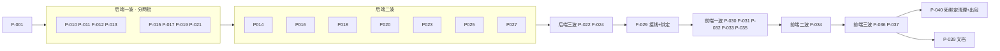

# 产品完善度修复批次 · 执行计划

## Goal And Boundaries

本计划落地[问题清单](../design/2026-09-29-product-completeness/问题清单.md)的全部 88 条问题，实现[概要设计](../design/2026-09-29-product-completeness/概要设计.md)中已接受的 `D-PC01`–`D-PC62`。契约以[详细设计](../design/2026-09-29-product-completeness/需求设计文档.md) v1.1 为准，其中 Planning Handoff 的「固定约束」与「升级规则」对本计划同样有约束力。

完成标准：
- 88 个问题 ID 都能在测试中找到，命名规则见 G-4；
- 双后端 `go test ./...`、`npm test`、`wails build` 全部通过；
- 高风险切片经过独立评审。

不在本计划范围内：概要设计 §1.3 所列的排除项、问题清单 §7 的真机项、详细设计 §8.2 的 IINA「从头播完」缺口。受保护行为见概要设计 §5 与详细设计 §0 的 G-1 到 G-6。

执行方式（用户 2026-09-29 指定并授权）：
- 由 Sonnet 5.5 leaf 子代理实现，每个切片使用独立的 git worktree；
- 主代理负责调度、按顺序整合、全量验证与评审；
- 在本地分支 `feat/product-completeness` 上，每个整合点验证通过后提交一次；不推送，不合并到 master；
- 同时运行的子代理不超过 4 个；PG 只开一个容器；剩余磁盘低于 5 GiB 时暂停并告知用户。

*图：波次视图。以 frontmatter 的依赖为准；同批次内只有写入范围不相交的切片才并行。*

### 执行约定（每个子代理的提示词都要包含）

- **对齐基线**：Agent 工具创建 worktree 时以 master（`43efd8a`）为基线，而不是功能分支（P-001 执行时实测确认）。所以子代理开工前的第一步是 `git merge --ff-only feat/product-completeness`，完成后核对 `git log -1` 与主代理给出的基线提交一致，不一致就停下来回报。
- **准备 worktree 环境**：worktree 里缺少被 gitignore 的内容，开始前从主工作区补齐：
  - 复制 `frontend/dist/`（`assets.go` 的 `go:embed` 需要）；
  - 复制 `.loopx/workspace/2026-09-02-capability-batch/baseline/`（`subtitle_translation_test.go` 与 `data-test-set.test.mjs` 会读取）；
  - 软链 `frontend/node_modules`。
  
  在 worktree 中修改了基线文件的，要在交付中列出，由主代理同步回主工作区。
- **写入范围**：只改本切片 `writes` 中列出的源文件。
  - 测试文件（`*_test.go`、`*.test.js`、`frontend/scripts/*.test.mjs`）与 `frontend/src/styles/components.css` 属于**共享追加文件**：同批次的多个切片都可以改，但只能改动或新增与自己行为对应的用例或规则，不得重写或重排别人的用例。主代理整合时按 3-way 合并。
  - 某个既有行为被本切片改变、而它被测试钉住时，由本切片同步修正该断言，并在交付中说明。
- **验证**：
  - 后端切片跑 `go test ./...`（SQLite，全量）；
  - 前端切片跑 `cd frontend && npm test`（全量）；
  - PG 由主代理在每个后端整合点统一跑，子代理不启动任何容器。
- **`is_stale` 写入**：任何写 `is_stale` 的代码都必须同时写入或清空 `stale_reason`（详细设计 §3.1）。全局守卫测试由 P-029 添加。
- **接线**：不得修改 `app.go`、`main.go`、`frontend/wailsjs/**`，也不得给 `App` 结构体加字段。需要接线的地方写成函数或服务方法，并在交付中列出「接线项」。
- **冲突处理**：发现设计与代码事实不符，或者需要改 `writes` 以外的文件时，立即停下该项并回报。不得自行派生子代理，不得提交。

## P-001 Schema、迁移与共享契约

一次性落地详细设计 §1 的全部 schema 变化，外加 §6.4 的 `face_clusters.ignored_at`、§7.2 的 `saved_library_views.person_ids_json`、§7.7 的 `collection_suggestions.target_collection_id`。

迁移部分：
- 回收站 `mode` 回填（只看 `file_moved` 与 `deleted_by`）；
- `short_feed_enabled` 的升级判定，一次性判据必须紧贴 `AutoMigrate`；
- 三个清理阈值；
- 收藏与点赞的并集迁移，用 `favorites_unified_at` 做一次性守卫（§8.1 与 §2.2「点赞升级合并」）；
- 片单唯一索引替换：同步修改 `database/watchlist_kind_schema.go` 与 `watchlist_schema.go` 中的索引断言，老库显式删除旧索引；
- 术语表唯一索引替换；
- **退役 `cleanupReimportedSoftDeletedVideos`**，并把它的测试改为断言相反的行为（§2.2）。

`UpdateSettings` 的白名单纳入三个清理阈值；`short_feed_enabled`、`short_feed_pin_hash`、`favorites_unified_at` 加进整行 `Save` 的 `Omit`（评审 I4），并用测试证明通用保存不会回写这三列。

同时提供共享契约，供下游切片直接调用：
- 常量：失效原因、回收站模式、`personTagNamespace`、登记表 key `image_cleanup`；
- 哨兵错误：`ErrVideoBlockedByUserDelete`、`ErrTrashUnsupportedVolume`、`ErrTrashPermissionDenied`、`ErrTrashIdentityMismatch`；
- 接口：`WatchStateObserver`、`LinkedVideoWatchSetter`；
- 服务层方法：`SetVideoLiked`（在 `library_service.go`，与 `SetVideoFavorite` 同处）与 `SetImageLiked`；两个收藏 setter 维护 `favorited_at`。

完成标准：
- `TestAllModelsIsTopologicallyOrdered` 通过，迁移器往返夹具覆盖全部新表；
- 每个迁移函数都有老库升级与新库两类用例，双后端通过；
- 迁移可重复执行，结果不变；
- 用户关掉的开关不会被翻回；
- 同路径的活跃行在 `ApplySchema` 之后仍然活跃。

> writes: `models/**`, `database/**`, `internal/dbtest/**`, `services/errors.go`, `services/contracts_product_completeness.go`（新）, `services/background_task_registry.go`, `services/settings_service.go`, `services/library_service.go`（仅收藏与点赞 setter）, `services/image_library_service.go`（仅收藏与点赞 setter）
> anchors: 详细设计 §1、§2.2（退役函数、点赞合并）、§6.4、§7.2、§7.7；D-PC01/03/04/05/06/16/17/20/21/31/33/34/36/38/40/45/47/52 的数据部分；G-1
> architecture: 扩展既有的 `ApplySchema` / `migrateXxx` / `AllModels()`，不引入新框架；schema 的唯一所有者是 `models` 与 `database`；共享契约集中在一个文件；维护依靠拓扑序测试与往返夹具
> verify: `go test ./...`（SQLite）；整合时由主代理在 PG 上跑 `CINEINSIGHT_TEST_PG_DSN=… go test -p 1 -timeout 1800s ./...`
> review: 独立评审迁移顺序与一次性判据的位置、并集迁移只执行一次、唯一索引替换后撞名识别前缀是否仍然成立、`Omit` 是否完整、退役清理函数后的依赖方、PG 的三个陷阱

## P-010 回收站、删除与按身份屏蔽（后端）

实现详细设计 §2.1–§2.3 的后端部分：
- 系统废纸篓的 cgo 入口、非 darwin 实现与错误映射；
- 带结果码的新删除方法（`DeleteVideo` / `DeleteImage` 签名不变，遇到不支持的卷返回 `ErrTrashUnsupportedVolume`）；`volume_offline` 不降级；
- 永久删除；
- 统一的回收站列表、用量、恢复、按批次恢复与清除接口；
- `pending_move` 的崩溃恢复；
- `addVideo` / `addImage` 的身份屏蔽表；
- `TrashStagedSources`：把迁移残留移入废纸篓（表由 P-001 提供，登记由 P-011 负责）；
- 图片「扫描隐藏」的列出与重新检查；
- 批量删除的进度与取消；`record_only` 模式不做哈希。

完成标准：
- LIB-04 的三个场景符合 §2.2，并有一条经过 `ApplySchema` 的端到端回归；
- IMG-02：图片只删记录后可以恢复，且不会被重新收录；
- 卷不支持废纸篓时，记录与条目都保持原状；
- 身份不符时拒绝恢复；
- `file_gone` 对账与崩溃恢复的三个分支都正确；
- `legacy_trash` 条目仍可恢复。

cgo 调用在单元测试中通过函数变量注入替身；另写一条只在 darwin 上运行的真实废纸篓用例，只操作临时文件。

> writes: `services/trash_service.go`, `services/system_trash_darwin.go`（新）, `services/system_trash_other.go`（新）, `services/video_service.go`, `services/image_service.go`, `services/image_visibility.go`, `services/scan_restore.go`, `app_trash.go`（新）, `app_video.go`, `app_image.go`
> anchors: D-PC01, D-PC02, D-PC03, D-PC04（后端）, D-PC05（移入废纸篓）, D-PC06（图片隐藏）, D-PC51（删除）；LIB-04, LIB-05, LIB-12, IMG-01, IMG-02, IMG-09, IMG-12
> architecture: 扩展 `TrashService` 与既有的 pending_move → deleted 状态机，不另建回收站；cgo 写法与 `desktop_notify_darwin.go` 同构；状态变更用条件更新；`video_scan.go` 通过 P-001 的哨兵错误识别屏蔽；旧删除签名保持不变，手机端与 Jellyfin 调用方不受影响
> verify: `go test ./...`（SQLite）
> review: 独立评审删除、恢复、永久删除的数据安全；身份核对能否被绕过；有没有静默降级；崩溃恢复是否可能认错文件；历史行的屏蔽判定是否会误屏蔽或误收录

## P-011 可见性、扫描、迁移与重命名（后端）

实现以下内容：
- §3.1 写入部分：本切片文件中的 `is_stale` 都带上原因；`RecheckVideos`、`ReaddRemovedRoot`；
- §3.2 `rewriteLibraryPathPrefixTx` 与重映射；
- §3.3 离线标记、重连对账、60 秒巡检；
- §3.4 跳过原因分项、`library-scan-summary`、`ValidateScanDirectory`；`isTrashPath` 签名不变，内部改用缓存的旧版回收站目录集合，只认旧版回收站与系统废纸篓；`addScannedVideo` 把 `ErrVideoBlockedByUserDelete` 计入 `blocked_user_delete`；
- §2.4 迁移残留登记（与迁移同一事务）、`ListStagedSources` / `DeleteStagedSources`；
- §3.5 `MoveDirectory` 路径改写与 `CheckMoveTarget`；
- §4.1 重命名时的扩展名规则；
- §3.6 播放失败的原因与后台重定位。

接线项：`MoveDirectory` 之后重新配置监听（P-029）。

完成标准：
- LIB-02：重映射后保留原 ID 与标签；
- LIB-03：三个样例文件名都正确；
- LIB-06：回收站与黑名单同步改写；
- LIB-07：离线时标为 `offline_root`，重连后自动恢复；
- LIB-11：暂存文件已登记；
- LIB-13 / PLAY-12：离线时立即返回；
- LIB-14：名为 `Trash` 的目录能正常扫描，跳过原因分项正确；
- LIB-09：`CheckMoveTarget` 的判断正确。

> writes: `services/video_scan.go`, `services/library_watcher.go`, `services/library_watcher_backend_*.go`, `services/library_watcher_support_*.go`, `services/file_migration.go`, `services/file_migration_io.go`, `services/directory_service.go`, `services/directory_scan_progress.go`, `services/video_playback.go`, `services/video_rename_move.go`, `services/scan_volume_*.go`, `services/scan_removal_guard.go`, `app_settings.go`（仅目录相关方法）, `app_scan.go`（新）
> anchors: D-PC05（登记）, D-PC06（写入）, D-PC07, D-PC08, D-PC09（后端）, D-PC10, D-PC11, D-PC12；LIB-01, LIB-02, LIB-03, LIB-06, LIB-07, LIB-08, LIB-09, LIB-10, LIB-11, LIB-13, LIB-14, PLAY-12
> architecture: `rewriteLibraryPathPrefixTx` 是唯一的前缀改写实现，消除 MoveDirectory 的平行实现；窄对账复用 `SyncAffectedDirectories`；监听仍只是加速层；2026-09-11 的扫描删除规则不变
> verify: `go test ./...`（SQLite）
> review: 独立评审重映射与迁移的事务边界、离线判定会不会误判在线的根、`isTrashPath` 收窄后是否会收录旧回收站里的文件

## P-012 片库查询、筛选与可见口径（后端）

实现以下内容：
- §3.1 查询部分：失效视图跳过根裁剪；`stale_reason` 的筛选与计数；`GetLibraryCounts` 与洞察页总数使用可见口径；
- §7.2 `person_ids` 筛选与保存视图持久化；「未打标签」排除自动标签；
- §4.6 `hasAnySubtitleSQL`；
- §7.8 智能视图「本地资料有更新」；
- §7.4 `UpdateSavedLibraryView` 与 `activeTagIDs`。

完成标准：
- LIB-01：删除目录后的记录出现在失效视图里；其余视图的边界由受保护用例钉住，保持不变；
- 人物筛选按 AND 语义生效；
- 保存视图往返一致；
- 「无字幕」视图按三种来源判定。

> writes: `services/library_service.go`（收藏与点赞 setter 以外的部分）, `services/library_stats_service.go`（仅可见口径）, `app_library.go`
> anchors: D-PC06（查询）, D-PC17（判定式）, D-PC33, D-PC35（桌面）, D-PC39（视图）；LIB-01, LIB-08（计数）, LIB-15, META-02（筛选）, META-07, META-10（未打标签）, MEDIA-08（视图）, PLAY-07（口径）
> architecture: 扩展共享的 `applyLibraryFilter` / `LibraryFilter`（主片库、随机、Jellyfin 共用的边界），不另建查询路径；`hasAnySubtitleSQL` 与 `activeTagIDs` 各只定义一次
> verify: `go test ./...`（SQLite）
> review: 独立评审放宽是否只作用于失效视图，随机、Jellyfin、手机端是否仍然排除失效记录

## P-013 字幕写入器、编码、工作台与翻译（后端）

实现以下内容：
- §4.2 `SubtitleFileWriter`：生成时先写临时文件，校验通过后再替换；强制生成与放弃；备份的列出与恢复；`GetSubtitleOverwriteInfo`；
- §4.3 编码识别与转换（`golang.org/x/text` 改为直接依赖）；
- §4.4 工作台把格式问题做成 issue；缺少字幕时返回 `subtitle_missing`；错误信息中文化；
- §4.5 两种重译模式、共用的空译文回退、术语表的目标语言；
- §4.6 `subtitle_not_sidecar_srt`。

完成标准：
- MEDIA-01：遇到幻觉、空结果、取消时，原字幕逐字节不变；
- MEDIA-02：GBK 字幕在转换前拒绝写入，转换后可以从备份恢复；
- MEDIA-05：可以恢复上一版；
- MEDIA-06：零时长条目可以打开并一键修复；
- MEDIA-07：只替换译文行；术语按目标语言注入；
- DeepL 的请求体与基线一致。

> writes: `services/subtitle_file_writer.go`（新）, `services/subtitle_service.go`, `services/whisperx_runtime.go`（仅 `writeSRT` 路径）, `services/subtitle_translate_file.go`, `services/subtitle_translation.go`, `services/subtitle_workbench.go`, `services/subtitle_atomic_replace_*.go`, `services/subtitleparser/**`, `services/translation_glossary_service.go`, `app_subtitle.go`, `go.mod`, `go.sum`
> anchors: D-PC13, D-PC14, D-PC15, D-PC16, D-PC17（错误码）；MEDIA-01, MEDIA-02, MEDIA-05, MEDIA-06, MEDIA-07, MEDIA-08（共用覆盖）
> architecture: 复用 `replaceSubtitleFileAtomically` 与 `lockSubtitleFile`（由调用方持锁）；写入器是 `.srt` 唯一的写入入口，P-016 与 P-025 复用它
> verify: `go test ./...`（SQLite）
> review: 独立评审每条失败路径是否保持原文件不变、备份数量与文件权限、编码探测是否会误判 UTF-8

## P-015 AI 打标语义、批量审阅与空闲门（后端）

实现以下内容：
- §6.2 规则 2、3、5、6 与 IMG-14，其中规则 6 落在 `loadActiveTags` / `loadActiveLibraryTags`；
- 提供「手动加标签时作废对应候选」的服务函数，视频与图片两侧的调用点由 P-020 接入；
- 词表指纹去掉 `UpdatedAt`；
- §6.3 批量批准；
- §5.2 worker 的启动批次与定时轮次经过空闲门；需要注入时写成服务方法，接线项交给 P-029。

完成标准：
- META-01：被拒绝的标签不会再次生成，改颜色不会导致重新排队；
- META-06：已有人工标签时，批准不会被作废；
- META-12：「人物」分类的标签不进入提示词；
- IMG-08：可以手动重新分析；
- IMG-14：已删除的图片可以整体拒绝；
- APP-04：定时轮次会在空闲门后等待，显式触发照常直通。

> writes: `services/ai_tagging_service.go`, `services/ai_tagging_extractor.go`, `services/ai_tagging_client.go`, `services/ai_tagging_agent.go`, `services/ai_tagging_types.go`, `services/image_ai_tagging_service.go`, `services/image_ai_tagging_review.go`, `services/image_ai_tagging_client.go`, `services/idle_gate.go`（仅在需要时）, `app_ai.go`（仅 AI 打标方法）
> anchors: D-PC28（规则 2/3/5/6、指纹）, D-PC29（批量批准）, D-PC19（worker）；META-01, META-06, META-11（批量）, META-12, IMG-08, IMG-14, APP-04
> architecture: 在既有的候选状态机内修改，不新增状态；拒绝记忆与图片侧 `image_ai_tagging_service.go:649-683` 对齐；空闲门复用 `IdleGate.Run` / `RunGatedTaskNow`；质量评估的分母口径不变
> verify: `go test ./...`（SQLite）
> review: 独立评审空闲门接入后显式触发是否仍然直通、是否会丢失唤醒、拒绝记忆是否误伤改名或合并过的标签

## P-017 标签、人物、本地资料与建议作品集（后端）

实现以下内容：
- §6.2 规则 4 与规则 6 的另一半：`resetAITaggingAfterLibraryChange` 只在内容变化时调用；`isAITagEligible` 与重置时的候选作废条件都排除「人物」分类；
- §7.1 合并人物、删除人物、影响统计；NFO 同一批次内的同名人物只决策一次；
- §7.3 标签转人物的转换记录与撤销；
- §7.4 合并标签时改写保存视图；
- §7.5 新的低清判定、`GetVideoAutomaticTagOverrides`、`ClearVideoAutomaticTagOverride`；
- §7.6 `GetTagUsageCounts`；
- §7.7 用哈希构造 `dismiss_key`，新增 `append` 候选；
- §7.8 差异中带名字，写出 NFO 后同步状态；
- §8.8 `UpdateVideoRating`：评分即时保存，属于 `video_detail_service`。

完成标准：
- META-02：撤销后完整复原，包括撞名时的回滚；
- META-03：同一批次内的同名人物只建一个；
- META-05：删除人物后，人脸簇回到未命名；
- META-07：合并后保存视图被改写；
- META-09：差异中带名字；
- META-10：1920×800 不算低清；
- META-13：恢复后重新跟随自动规则；
- META-14：计数正确；
- META-15：被忽略的系列新增一集后不再出现；已确认的系列新增一集时生成 `append` 候选。

> writes: `services/tag_service.go`, `services/tag_person_conversion.go`, `services/person_service.go`, `services/video_detail_service.go`, `services/local_metadata_*.go`, `services/collection_suggestion_*.go`, `services/collection_service.go`, `app_media_details.go`
> anchors: D-PC28（规则 4/6）, D-PC32, D-PC34, D-PC35（合并改写）, D-PC36（标签）, D-PC37（计数）, D-PC38, D-PC39（差异与写出）, D-PC47（评分）；META-02, META-03, META-05, META-07, META-09, META-10, META-13, META-14, META-15, PLAY-14（评分）
> architecture: 在 `TagService` 原事务内同步（统一标签库 D-003 的做法）；人物相关的口径复用 `personHasRemainingRelations` / `reconcileFaceClusterPeople`；建议作品集不套外层事务（SQLite 会自锁）
> verify: `go test ./...`（SQLite）
> review: 独立评审撤销事务在各种中间状态下的回滚、合并人物时关系去重与人脸簇的改指向

## P-019 片单、榜单与片库关联（后端）

实现详细设计 §10 的后端部分：
- 豆瓣 ID 的传递，补全时直接按 ID 查询；
- 片单与榜单双向同步；
- 服务层做撞名检查；
- `movie_video_links` 与 `SuggestLibraryMatches`；
- `MovieChartService` 实现 `WatchStateObserver`，反向通过 `LinkedVideoWatchSetter` 调用。

接线项：两个方向的注入（P-029）。

完成标准：
- APP-07：删除片单条目时同步撤销榜单标记；同名但豆瓣 ID 不同的两部片可以共存；手动添加时的撞名文案不变；
- APP-06：给出片库关联建议；
- APP-05：回调会把榜单标为已看，且不会循环触发。

> writes: `services/movie_chart_*.go`, `services/watchlist_*.go`, `services/movie_video_link.go`（新）, `app_watchlist.go`, `app_movie_chart.go`
> anchors: D-PC52；APP-05, APP-06, APP-07
> architecture: 复用 `source_name/source_item_id` 两列；由 App 分别注入两个服务，两者互不 import；claim 与 `DoUpdates` 的禁用列不变
> verify: `go test ./...`（SQLite）；整合时主代理必须跑 PG（涉及唯一索引与 upsert）
> review: 独立评审双向同步是否会循环、PG 上撞名识别是否正确

## P-021 手机端访问控制、可见性与体验（后端）

实现以下内容：
- §8.6 开关与 PIN：
  - 鉴权覆盖 `/short-api/*`、`/short-media/`、`/short-thumb/` 以及今后新增的数据路由；
  - 按 IP 限次，使用会话 Cookie，加路由全集守卫测试；
  - `startShortFeedServer` 的开关检查通过服务方法提供，接线由 P-029 完成；
  - 视频候选、收藏页、`ResolveMedia` 都套用可见边界。
- §8.1 手机侧：收藏与点赞直接调用 P-001 的 setter，删除旧的投影与对账逻辑；收藏页按 `favorited_at` 排序；核对「反馈回流」开关除此之外还控制什么，并写进交付说明。
- 删除遇到 `ErrTrashUnsupportedVolume` 时返回 409。
- §8.7 手机端白名单、`unplayable_count`。
- §8.8 二维码与端口的中文文案。
- 本切片中的 `is_stale` 写入带上原因。

完成标准：
- PLAY-01：黑名单内的视频在 feed、收藏、媒体、缩略图中都不可见；设置 PIN 后，所有数据路由未登录时返回 401；连续 5 次失败后锁定；
- PLAY-02：手机端与桌面端收藏一致；
- PLAY-13：`.mov` 可以播放，并统计不可播放数量；
- 既有的同源与请求体纪律测试通过。

> writes: `services/short_feed_*.go`, `services/short_feed_auth.go`（新）, `services/short_feed_mobile_mime.go`（新）, `services/qrcode_darwin.go`（新）, `services/qrcode_other.go`（新）, `app_short_feed.go`（新）
> anchors: D-PC40（手机侧）, D-PC45, D-PC46（后端）, D-PC47（二维码与文案）；PLAY-01, PLAY-02, PLAY-13, PLAY-14（部分）
> architecture: 可见性直接调用 P-012 维护的 `applyScanRootScope` 与失效条件，不复制规则；鉴权叠加在既有防线之上；与浏览器桥接是两条独立的边界；`inlinePreviewMIMEs` 不改
> verify: `go test ./...`（SQLite）
> review: 独立安全评审 PIN 比较、限次与 Cookie 属性、是否有路由漏挂鉴权、可见性是否与桌面端一致

## P-014 字幕队列持久化、引擎准备与索引节流（后端）

实现以下内容：
- §5.3 `subtitle_jobs`、`ResolveSubtitleJob`、中断标记、`subtitle-failed`、通知文案；
- §5.5 引擎准备可取消、状态缓存、索引同步节流；
- §4.6 写入 `has_sidecar`。

完成标准：
- MEDIA-04：失败和待确认的任务都能查到并处理；
- MEDIA-10：中断的任务可以重新排队；
- MEDIA-13：引擎准备可以取消；
- MEDIA-14：10 分钟内不会重复对全库做 stat。

> writes: `services/subtitle_queue.go`, `services/subtitle_service.go`, `services/whisperx_runtime.go`, `services/qwen_runtime.go`, `services/subtitle_search_service.go`, `services/subtitle_config.go`, `services/subtitle_contracts.go`, `app_subtitle.go`
> anchors: D-PC20, D-PC22（后端）, D-PC23（后端）, D-PC17（has_sidecar）；MEDIA-04, MEDIA-10, MEDIA-13, MEDIA-14
> architecture: 仍是单一 FIFO 队列，只把状态持久化；待确认的产物使用 P-013 的临时文件与写入器；转写槽不变
> verify: `go test ./...`（SQLite）

## P-016 清理中心（后端）

实现以下内容：
- §9.1 元组排序（修复漏掉的 `Preload`）、`curation`、`MergeMediaMetadata`：字幕经写入器处理，已看状态经过观察者；
- §9.3 覆盖率；
- §9.4 分析可以取消，图片分析登记为 `image_cleanup`；
- §6.5 忽略记录带指纹并在文件变化后失效；移出单个成员；忽略列表与撤销；极短与极低两类的忽略；
- §7.5 清理阈值读取设置。

完成标准：
- IMG-03：保留建议与合并正确，合并失败时不删除；
- IMG-07：移出、失效、撤销都正确；
- IMG-11：覆盖率正确；
- IMG-12：分析可以取消；
- APP-11：可以忽略。

> writes: `services/cleanup_service.go`, `services/cleanup_review.go`, `services/perceptual_hash_cleanup.go`, `services/image_cleanup.go`, `services/clip_cleanup.go`, `services/media_metadata_merge.go`（新）, `app_cleanup.go`
> anchors: D-PC31, D-PC36（阈值）, D-PC48, D-PC50, D-PC51（分析）；IMG-03, IMG-07, IMG-11, IMG-12, APP-11（忽略）, META-10（清理侧）
> architecture: 扩展 `cleanup_review.go` 的统一过滤；合并是独立事务，在删除之前执行、不嵌套；旧的五类快照如按新排序更新了预期，需在交付中说明
> verify: `go test ./...`（SQLite）
> review: 独立评审合并的正确性（作品集位置、评分为 NULL 的语义、字幕迁移失败时的警告、已看回调）以及忽略的失效条件

## P-018 人脸可逆与分页（后端）

实现以下内容：
- §6.4 忽略列表与恢复、解除关联与改派（含预览）、逐条确认追加、已命名簇的来源移除；
- §6.3 键集分页。

完成标准（META-04 / META-11）：
- 恢复后簇回到未命名；
- 解除关联时只删除「未被该人物其他簇覆盖」的关系；
- 改派时迁移关系并去重；
- 逐条确认只写入所选观测；
- 分页游标稳定。

> writes: `services/face_review_service.go`, `services/face_review_detail.go`, `services/face_analysis_service.go`（仅 `ignored_at`）, `services/face_cluster.go`, `app_ai.go`（仅人脸方法）
> anchors: D-PC30, D-PC29（人脸分页）；META-04, META-11（人脸）
> architecture: `face_review_service.go` 仍是唯一写关系的地方，分析路径绝不写关系；并发保护沿用 `WHERE status=…` 加影响行数判断
> verify: `go test ./...`（SQLite）
> review: 独立评审解除关联与改派时删除关系的范围，以及并发下的状态转换

## P-020 观看状态与手动标签接入（后端）

实现以下内容：
- §8.2 `isWatchCompleted` 统一三条上报路径；IINA 会话登记：在 `playback_launcher.go` 加 `onPlaybackLaunched` 钩子，在 IINA 服务里加登记方法，接线由 P-029 完成；删除事件时结合墙钟推算。
- §8.3 `resumable`、`--mpv-start`、IINA 以最近写入为准、`origin` 参数、「继续观看」的条件与排序。允许修改 `jellyfin_playback.go` 中调用 `UpdateVideoWatchProgress` 的那一处，以保持包能编译。
- §8.8 `GetIINASyncStatus`。
- `SetVideoLiked` 的 App 绑定。
- `VideoService` 实现 `LinkedVideoWatchSetter`，并在已看状态翻转时回调观察者。
- 把 P-015 的候选作废函数接入视频 `AddTagToVideo` 与图片 `AddTagToImage`。

完成标准：
- PLAY-11：1:57:30 判为看完；
- PLAY-03：续播后看完判为看完，从头播完不判；
- PLAY-06：启动时带上断点参数，以新写入为准；
- PLAY-09：按进度更新时间排序；
- PLAY-10：`jump` 来源不回写更早的位置，重看可以续播；
- 2026-09-13 的受保护用例按新公式更新后通过。

> writes: `services/library_service.go`（观看相关函数）, `services/iina_progress_service.go`, `services/playback_launcher.go`, `services/video_service.go`, `services/image_library_service.go`（仅 `AddTagToImage` 调用点）, `services/jellyfin_playback.go`（仅 `UpdateVideoWatchProgress` 调用点）, `app_video.go`
> anchors: D-PC40（桌面点赞绑定）, D-PC41, D-PC42（非 Jellyfin）, D-PC47（IINA 状态）, D-PC28（规则 2 接入）, D-PC52（视频侧）；PLAY-02, PLAY-03, PLAY-06, PLAY-09, PLAY-10, PLAY-11, PLAY-14（IINA）, META-06, IMG-08（接入）
> architecture: `isWatchCompleted` 与 `resumable` 各只有一处定义；前端 `utils/watchState.js` 由 P-034 实现，使用同一组样例；观察者在事务提交后回调，失败只记日志；`SetVideoWatchedFromLink` 不触发观察者
> verify: `go test ./...`（SQLite）
> review: 独立评审短片与未知时长的边界、以最近写入为准后陈旧断点是否会把状态拉回、观察者是否会循环

## P-023 有效观看事件与随机延迟提交（后端）

实现以下内容：
- §8.4 `RecordViewEvent` 与会话去重；手机端 `mobile_feed` 阈值（后端侧）；随机播放延迟 30 秒提交、`RerollRandom`、关闭时提交（接线项）；洞察页口径；
- §8.5 后端文案。

完成标准（PLAY-07 / PLAY-08）：
- 30 秒内点「换一个」，不写计数也不写事件；超时或应用关闭时写入一次；
- 同一会话只记一次 `inline_view`；
- 覆盖率不再单凭随机次数把视频算作「看过」；
- 账本只追加的受保护测试通过。

> writes: `services/video_random.go`, `services/video_playback.go`, `services/library_stats_service.go`, `services/play_view_events.go`（新）, `app_library.go`
> anchors: D-PC43, D-PC44（后端）；PLAY-07, PLAY-08
> architecture: 计数与事件在同一事务中提交；账本不做 UPDATE/DELETE；随机打分只读三列
> verify: `go test ./...`（SQLite）

## P-025 下载、超分与预览代理（后端）

实现以下内容：
- §5.4 下载部分：持久化记录不含请求头；`error` 先清洗再落盘；启动时标为中断；同一会话内可重试；
- §5.7 三个入库动作；
- §5.6 复检时扣除已写字节、失败时保留检查点、`copy_metadata`（字幕经 P-013 的写入器）、未就绪状态；
- §5.8 `GetPreviewSession` 优先用代理；代理队列按项给出排位，供抽屉显示「第 N 个」。

完成标准：
- MEDIA-03：空间计算正确，可以续跑；
- MEDIA-09：三个动作可用，可以重试；
- MEDIA-10：表中不含请求头、Cookie、带签名的 query；
- MEDIA-11：产物继承原片的元数据；
- PLAY-05：有代理时优先使用代理，`TestInlinePreviewMIMEsUnchanged` 仍然通过。

> writes: `services/browser_download_service.go`, `services/browser_bridge_server.go`（仅状态字段）, `services/enhancement_*.go`, `services/preview_service.go`, `services/playback_proxy_service.go`（仅队列排位）, `app_browser_bridge.go`, `app_tasks.go`（仅超分与下载方法）
> anchors: D-PC21（下载持久化）, D-PC24, D-PC25（后端）, D-PC26（会话与排位）；MEDIA-03, MEDIA-09, MEDIA-10, MEDIA-11, PLAY-04（排位）, PLAY-05
> architecture: 下载的安全规则不变；续跑复用既有检查点；正式播放永远打开源文件
> verify: `go test ./...`（SQLite）
> review: 独立安全评审持久化的内容中不含敏感信息

## P-027 数据安全与退出放行（后端）

实现详细设计 §11：
- 备份可用性按后端判断；
- SQLite 恢复修复并加集成测试；
- `RevealBackupDirectory`；
- 后端切换进入维护模式（停服清单加入 `FrameHashService`）；
- `RelaunchApp`、`SwitchBackendConfigOnly`、`ClearMigrationTarget`；
- `StartPeriodic`（接线项）。

同时在新文件 `app_quit.go` 建立退出守卫的状态与 `allowInternalQuit()`。恢复完成与 `RelaunchApp` 退出前先调用它。`beforeClose` 的任务判定由 P-024 补全。

完成标准：
- APP-01：SQLite 上「备份 → 修改 → 恢复」后，数据回到备份时的状态；
- APP-02：切换期间拒绝写入；清空目标库后可以重试；只改配置的切换返回 `relaunch_required`；PG 上只删 `AllModels` 中的表；
- APP-09：定时调用生效；
- 内部发起的退出不会被拦住。

> writes: `services/backup_service.go`, `services/database_switch_service.go`, `database/maintenance.go`, `app_settings.go`（备份、切换、恢复相关方法，以及 `UpdateSettings` 调用 `SyncFeedback` 的那一处）, `app_quit.go`（新）
> anchors: D-PC54, D-PC55, D-PC56, D-PC21（内部退出放行）；APP-01, APP-02, APP-09
> architecture: 维护模式只有 `enterDatabaseRestoreMode` 这一个入口；迁移器只读、不修改；删除范围由 `AllModels()` 决定
> verify: `go test ./...`（SQLite）；整合时主代理跑 PG
> review: 独立评审 `ClearMigrationTarget` 的删除范围与确认、维护模式期间是否还有写入口、SQLite 恢复失败后的状态

## P-022 Jellyfin 口径统一与会话持久化（后端）

实现以下内容：
- §8.3 的 Jellyfin 部分；
- §8.4 `jellyfin_view`；
- §8.8 会话持久化：用户关闭 Jellyfin 或修改账号、配置时作废会话，`Stop()` 不作废；`GetJellyfinDiagnostics`；
- §4.6 `HasSubtitles`；
- §7.4 `activeTagIDs`；
- 删除遇到 `ErrTrashUnsupportedVolume` 时沿用既有的失败映射。

完成标准：
- PLAY-09：口径与片库一致；
- PLAY-14：重启后令牌仍然有效，关闭 Jellyfin 后失效；
- META-07：已删除的标签不会让保存视图变空；
- Fileball 回放与日志脱敏的既有用例通过。

> writes: `services/jellyfin_*.go`, `app_jellyfin.go`
> anchors: D-PC42（Jellyfin）, D-PC43（jellyfin_view）, D-PC47（会话与诊断）, D-PC17（HasSubtitles）, D-PC35（Jellyfin 侧）；PLAY-09, PLAY-14, META-07, MEDIA-08
> architecture: 复用 P-012 与 P-020 的判定，不复制；offset 分页只放在适配层；进度上报只在越过阈值时写一条事件
> verify: `go test ./...`（SQLite）
> review: 独立安全评审只存令牌哈希、过期与作废语义、诊断信息不泄露敏感内容

## P-024 任务中心、待处理汇总与退出保护（后端）

实现以下内容：
- §5.1 `GetTaskCenterSnapshot`：21 个 key 的适配表，加守卫测试；
- §6.1 `GetPendingWorkSummary`：按配对去重；
- §5.4 `beforeClose` 的任务判定、`quit-confirm-required`、`ConfirmQuit`：基于 P-027 的退出守卫；在 `main.go` 注册是接线项。

完成标准：
- APP-03：21 个 key 全部覆盖，漏掉任何一个测试即失败；三种状态都正确；最近任务涵盖四类；
- META-08：各项计数口径与对应服务一致；
- MEDIA-10：有任务在运行时拦截退出，内部发起的退出放行。

> writes: `app_task_center.go`（新）, `app_pending.go`（新）, `app_quit.go`, `app_tasks.go`
> anchors: D-PC18（后端）, D-PC27（后端）, D-PC21（退出保护）；APP-03, META-08, MEDIA-10
> architecture: 只读聚合，不新建状态源（概要设计图 3.3）；事件合并只在 App 层进行
> verify: `go test ./...`（SQLite）

## P-029 后端接线与绑定生成

把各切片交付中列出的接线项全部接到 `app.go` / `main.go`，至少包括：
- 观察者的双向注入；
- `onPlaybackLaunched` 钩子；
- `startShortFeedServer` 在内部检查开关；
- AI worker 的空闲门（如需要）；
- 定时备份；
- 关闭时提交随机未决项；
- `OnBeforeClose`；
- `MoveDirectory` 之后重新配置监听；
- 字幕中断任务的启动提示事件。

另外加一条全局守卫测试：所有写 `is_stale` 的地方都同时维护 `stale_reason`。

重新生成 `frontend/wailsjs/**`（`GOTOOLCHAIN=go1.24.9`，用 wails 生成模块绑定）。生成失败就停下报告，不手工编辑。本切片**不删除旧绑定**，也**不做** `wails build`：此时前端仍在引用旧方法，这两件事交给 P-040。

完成标准：
- 每个接线项都有集成测试或冒烟用例；
- 新方法全部出现在绑定中；
- `go test ./...` 双后端通过（PG 由主代理跑）；
- `cd frontend && npm test` 在新绑定下仍然全绿。

> writes: `app.go`, `main.go`, `main_bindings.go`, `app_video.go`（仅重新配置监听）, `app_test.go`, `services/stale_reason_guard_test.go`（新）, `frontend/wailsjs/**`
> anchors: 各后端切片的接线项；D-PC06（全局守卫）；G-5（新增部分）
> architecture: `app.go` 只保留结构体、构造函数、`startup` / `shutdown`；只加接线所必需的字段
> verify: `go test ./...`（SQLite）；PG 全量（主代理）；`cd frontend && npm test`
> review: 主代理做一次后端整合审查：有无重复实现、依赖方向是否正确、有无平行的真值来源

## P-030 回收站与删除（前端）

实现 §2.3 与 D-PC02 的前端部分：
- `TrashCenterDialog`，四个页签，替代两个旧弹窗；
- 废纸篓不可用时的选择弹窗，永久删除需二次确认；
- 撤销整批删除；删除确认框中说明后果；
- 图片页：删除反馈与撤销、`confirm_before_delete`、删除文件夹时的实际文案、扫描隐藏、删除进度与取消；
- 图片页的零散文案（D-PC61 中与图片相关的部分）；
- 图片 AI「重新分析」入口；
- 注册命令：`VideoListPage` 注册 `library.openCleanup`、`library.openAIReview`、`library.openLocalMetadataUpdates`，`PhotoLibraryPage` 注册 `photos.openAIReview`（详细设计 §6.1 的契约）。

完成标准：LIB-05、LIB-12、IMG-02、IMG-06、IMG-08（入口）、IMG-09 以及 D-PC02 的流程都有组件测试。

> writes: `frontend/src/components/TrashCenterDialog.vue`（新）, `frontend/src/components/TrashUnsupportedDialog.vue`（新）, `frontend/src/components/TrashRestoreDialog.vue`, `frontend/src/components/PhotoTrashDialog.vue`, `frontend/src/components/video-list/TrashUndoBanner.vue`, `frontend/src/components/DeleteConfirmDialog.vue`, `frontend/src/components/VideoListPage.vue`, `frontend/src/components/PhotoLibraryPage.vue`, `frontend/src/components/PhotoAITaskPanel.vue`
> anchors: D-PC01（文案）, D-PC02, D-PC04, D-PC05（残留页签）, D-PC06（图片隐藏）, D-PC27（命令注册）, D-PC28（图片重新分析）, D-PC51（删除进度）, D-PC61（图片文案）；LIB-05, LIB-12, IMG-02, IMG-06, IMG-08, IMG-09
> architecture: 复用 `BaseModal` / `confirmAction`；共享样式类放 `styles/components.css`；局部移除沿用既有规则
> verify: `cd frontend && npm test`
> review: 独立评审永久删除的二次确认、废纸篓不可用时的选择流程、整批撤销，以及文案与实际行为是否一致

## P-031 任务中心、待处理工作台与导航（前端）

实现以下内容：
- `TaskCenterDrawer`；
- `PendingWorkHub`：列出事项与计数，点击后执行命令跳转到对应页面（详细设计 §6.1），不重新挂载面板；
- 顶栏三组；「下载」只在开启时显示；改名为「观影记录」；
- 退出确认弹窗；
- 设置页离开确认：`App.vue` 监听 `SettingsPage` 的 `update:dirty`（布尔值）；
- 命令面板新增全局命令，成功时给出提示；
- `LibraryToolbar` 的全部改动：管理菜单、移除旧徽标、去掉标签上的 ×、人物组合框（通过 emit 传出筛选变化）、随机按钮显示当前模式、智能视图、语义模式下禁用随机、注册 `library.openCollectionSuggestions`；
- 补全标签表并加守卫测试。

完成标准：
- APP-03、APP-11、APP-12、APP-14、META-08、META-14（×）、META-02（入口）、PLAY-08（按钮）都有测试；
- 工作台中每一条跳转命令都断言调用了约定的命令 ID。

> writes: `frontend/src/App.vue`, `frontend/src/components/TaskCenterDrawer.vue`（新）, `frontend/src/components/PendingWorkHub.vue`（新）, `frontend/src/components/QuitConfirmDialog.vue`（新）, `frontend/src/components/CommandPalette.vue`, `frontend/src/utils/appCommands.js`, `frontend/src/utils/taskCommands.js`, `frontend/src/utils/commandRegistry.js`, `frontend/src/utils/idleScheduling.js`, `frontend/src/components/video-list/LibraryToolbar.vue`, `frontend/src/components/video-list/BackgroundTaskStatusBars.vue`
> anchors: D-PC18（前端）, D-PC27（前端）, D-PC21（退出确认）, D-PC33（入口）, D-PC37（×）, D-PC39（入口）, D-PC44（按钮）, D-PC52（改名）, D-PC57（App 侧）, D-PC59, D-PC60；APP-03, APP-11, APP-12, APP-14, META-08, META-14, META-02, PLAY-08
> architecture: 工作台只做汇总和跳转；命令统一走 `commandRegistry`；各页面职责不变
> verify: `cd frontend && npm test`

## P-032 清理中心（前端）

实现以下内容：
- `utils/cleanupSelection.js`；
- 统一的勾选与锁定规则；
- 删除前汇总确认，「合并元数据」选项默认勾选；
- 卡片显示整理成果；
- 覆盖率与空态；
- 移出单个成员、「已忽略」页签与撤销、极短与极低两类的忽略；
- 类别改名并标出阈值；
- 分析可以取消；
- `AutomationSection` 的阈值输入与 IINA 文案（PLAY-06）。

完成标准：IMG-03、IMG-04（改掉旧测试第 42 行）、IMG-05、IMG-07、IMG-11、META-10（清理侧）都有测试。

> writes: `frontend/src/components/video-list/CleanupReviewPanel.vue`, `frontend/src/components/PhotoCleanupPage.vue`, `frontend/src/components/CleanupThumbnail.vue`, `frontend/src/utils/cleanupSelection.js`（新）, `frontend/src/components/settings/AutomationSection.vue`
> anchors: D-PC31（前端）, D-PC36（阈值）, D-PC48（前端）, D-PC49, D-PC50, D-PC42（IINA 文案）；IMG-03, IMG-04, IMG-05, IMG-07, IMG-11, META-10, PLAY-06（文案）
> architecture: 两个页面共用同一个纯函数模块
> verify: `cd frontend && npm test`
> review: 独立评审先合并、失败则不删除的交互顺序，以及默认勾选不会误选近似重复

## P-033 设置、数据安全、片单、下载与超分（前端）

实现以下内容：
- `SettingsPage`：脏状态、`update:dirty`、`saveMode`、即时动作前先提示保存、只在 AI 字段变化时触发、扫描目录排第 2 位；
- Jellyfin 独立分区（含诊断）；
- `ProxySection` 改名与文案；
- `MobileSection`：开关、PIN、二维码、提示条、文案；如果 P-021 的结论是「反馈回流」开关不再控制其他行为，就删除该入口；
- `DatabaseSection`：各项功能，清空目标库时要求输入「清空」确认；
- `IdleSchedulingSection`；`SubtitleSection` 的引擎状态；`BrowserBridgeSection` 的目录校验；
- 片单、榜单、观影记录三页；下载页；`EnhanceDialog`；
- 新增的设置列进入显式载荷。

完成标准：
- APP-01、APP-02、APP-05、APP-06、APP-07、APP-08、APP-09、APP-10（设置部分）、MEDIA-09、MEDIA-11、MEDIA-13、PLAY-01（设置部分）、PLAY-14（诊断与二维码）都有测试；
- `ai-tag-library.test.mjs` 等读取这些文件的脚本通过。

> writes: `frontend/src/components/SettingsPage.vue`, `frontend/src/components/settings/*.vue`（`ScanDirectoriesSection.vue`、`AutomationSection.vue` 除外）, `frontend/src/components/WatchlistPage.vue`, `frontend/src/components/MovieChartPage.vue`, `frontend/src/components/WatchedMoviesPage.vue`, `frontend/src/components/DownloadsPage.vue`, `frontend/src/components/downloads/DownloadRow.vue`, `frontend/src/components/video-list/EnhanceDialog.vue`, `frontend/src/utils/enhancement.js`（新）
> anchors: D-PC19（前端）, D-PC24（前端）, D-PC25（前端）, D-PC45（设置）, D-PC47（诊断与二维码）, D-PC52（页面）, D-PC54–D-PC58（前端）, D-PC61（设置文案）；APP-01, APP-02, APP-05, APP-06, APP-07, APP-08, APP-09, APP-10, MEDIA-09, MEDIA-11, MEDIA-13, PLAY-01, PLAY-14
> architecture: 沿用 `form` prop 加父组件统一保存的模式；专用接口不走通用保存；`SETTINGS_SECTIONS` 是唯一的锚点来源
> verify: `cd frontend && npm test`
> review: 独立评审清空目标库、只改配置、立即重启三个流程的确认文案与防误触

## P-035 审阅、人脸、标签与人物（前端）

实现以下内容：
- AI 审阅：批量批准；切到同源页签时才标记已读；「去清理」；不再作废的提示；
- 人脸：分页、已忽略列表与恢复、解除关联与改派（含预览）、逐条确认追加、忽略前确认；
- 标签管理：未保存修改的确认、影响计数、最近的转换与撤销；转换页说明后果；
- 覆盖角标与「恢复自动」；
- 人物页：合并与删除；在 `EntityLibraryPage` 注册 `people.openFaceReview`；为 `EntityLibraryPage` 中的 `UpdateVideoWatchProgress` 调用点加上 `origin`；
- 抽屉：「新建并加入」推迟到保存时生效，删除最后一条关系前确认，评分即时保存（`UpdateVideoRating`）；
- 本地资料弹窗显示名字；
- 建议作品集的 `append` 候选。

既有面板的 props 与 emits 只增不改。

完成标准：META-02、META-03、META-04、META-05、META-06、META-09、META-11、META-13、META-14、META-15 都有测试。

> writes: `frontend/src/components/AITagReviewDialog.vue`, `frontend/src/components/AIQualityPanel.vue`, `frontend/src/components/ImageAITagReviewPanel.vue`, `frontend/src/components/FaceClusterReviewPanel.vue`, `frontend/src/components/FaceClusterDetailDialog.vue`, `frontend/src/components/TagManagerDialog.vue`, `frontend/src/components/TagPersonConversionPanel.vue`, `frontend/src/components/TagDeleteDialog.vue`, `frontend/src/components/AddTagDialog.vue`, `frontend/src/components/EntityLibraryPage.vue`, `frontend/src/components/PreviewDrawer.vue`, `frontend/src/components/LocalMetadataDialog.vue`, `frontend/src/components/CollectionSuggestionPanel.vue`, `frontend/src/utils/aiTagReview.js`
> anchors: D-PC27（同源标已读的时机、命令注册）, D-PC28–D-PC30（前端）, D-PC32, D-PC34, D-PC36（角标）, D-PC37, D-PC38, D-PC39, D-PC47（评分）, D-PC42（`origin`，人物页调用点）；META-02, META-03, META-04, META-05, META-06, META-09, META-11, META-13, META-14, META-15
> architecture: 面板的对外接口只增不改；局部移除与补页沿用既有规则
> verify: `cd frontend && npm test`
> review: 独立评审解除关联与改派的预览确认、合并与删除人物的确认、撤销转换的交互

## P-034 片库页：可见性、扫描、筛选与行菜单（前端）

`VideoListPage` 在本波次由本切片独占。实现以下内容：
- 失效视图按原因分组，提供重新定位、重新检查、加回目录；
- 扫描摘要与刷新；`ScanDialog` 的确认与嵌套提示；重映射二选一；设置页错误显示；
- 迁移到扫描根之外前先确认；播放失败的行原地标为失效；三种空状态；
- 重命名对话框；
- 行菜单新增：点赞、重新分析、视频超分（未就绪）、重新定位、重新检查；
- `matchesSmartView` 同步「继续观看」「未打标签」「本地资料有更新」「失效」的新口径；
- `person_ids` 写入 `currentLibraryFilter`；
- 保存视图显示「N 个条件已失效」，支持更新与改名（`SaveViewDialog`）；
- 新建 `utils/watchState.js`：`isWatchCompleted` / `resumable` 的 JS 版本，使用与 Go 相同的样例；把 `VideoListPage.vue:389-395,1657-1666` 改为调用它；
- `UpdateVideoWatchProgress` 调用点加上 `origin`；
- `VideoListRow`：失效原因、点赞按钮、重看进度。

完成标准：LIB-01、LIB-02、LIB-03、LIB-08、LIB-09、LIB-10、LIB-14、LIB-15、META-07（前端）、PLAY-10（前端）、PLAY-11（前端公式）、PLAY-12、APP-10 都有测试。

> writes: `frontend/src/components/VideoListPage.vue`, `frontend/src/components/VideoListRow.vue`, `frontend/src/components/ScanDialog.vue`, `frontend/src/components/settings/ScanDirectoriesSection.vue`, `frontend/src/components/video-list/IncrementalScanBar.vue`, `frontend/src/components/video-list/RenameDialogs.vue`, `frontend/src/components/video-list/SaveViewDialog.vue`, `frontend/src/utils/watchState.js`（新）
> anchors: D-PC06–D-PC12（前端）, D-PC24（菜单入口）, D-PC28（重新分析入口）, D-PC33（筛选接入）, D-PC35（前端）, D-PC40（点赞入口）, D-PC41, D-PC42（前端）, D-PC58；LIB-01, LIB-02, LIB-03, LIB-08, LIB-09, LIB-10, LIB-14, LIB-15, META-07, PLAY-02（入口）, PLAY-10, PLAY-11, PLAY-12, APP-10
> architecture: 局部修补沿用 `reconcile result`；视图元数据只来自 `smartViewOptions`；看完与续播判定只在 `watchState.js` 一处
> verify: `cd frontend && npm test`

## P-036 字幕与随机接线（前端）

实现以下内容：
- 字幕生成：覆盖提示与共用名单；恢复上一版；
- 工作台：问题导航、一键修复、新建、两种重译模式、编码转换；
- 术语表增加语言列；
- 翻译支持后台继续，并显示进度；
- 批量生成；
- 只有内嵌字幕时说明原因；
- 中断任务的提示条；
- `RandomPickBanner` 的「换一个」，以及 `VideoListPage` 的随机接线：模式与排除表持久化。

完成标准：MEDIA-01、MEDIA-02、MEDIA-04、MEDIA-05、MEDIA-06、MEDIA-07、MEDIA-08、MEDIA-12、MEDIA-14、PLAY-08 都有测试。

> writes: `frontend/src/components/VideoListPage.vue`, `frontend/src/components/video-list/SubtitleGenerateDialog.vue`, `frontend/src/components/video-list/SubtitleTranslateDialog.vue`, `frontend/src/components/video-list/SubtitlePreviewModal.vue`, `frontend/src/components/SubtitleWorkbench.vue`, `frontend/src/components/GlossaryEditor.vue`, `frontend/src/components/video-list/BatchActionBar.vue`, `frontend/src/components/video-list/RandomPickBanner.vue`
> anchors: D-PC13–D-PC17（前端）, D-PC20（前端）, D-PC22（前端）, D-PC23（前端）, D-PC44；MEDIA-01, MEDIA-02, MEDIA-04, MEDIA-05, MEDIA-06, MEDIA-07, MEDIA-08, MEDIA-12, MEDIA-14, PLAY-08
> architecture: 字幕对话框仍由片库页持有；随机播放沿用 `PlayRandomVideoWithFilter`，外加 `RerollRandom`
> verify: `cd frontend && npm test`

## P-037 抽屉、手机端与洞察（前端）

实现以下内容：
- 抽屉：动作条；代理的排位、进度与自动切换；`<video>` 出错时的回退；`origin`（使用 P-034 的 `watchState.js`）；代理相关注释；
- `playbackProxy.js`：「进行中」状态的映射；
- 手机端：PIN 页、阈值、网络错误时保留历史并提供重试、失败提示、收藏页的错误态、不可播放提示；
- 洞察页：按来源分列、改名、口径说明。

完成标准：PLAY-04、PLAY-05、PLAY-07、PLAY-13、PLAY-14（抽屉）都有测试；`short-feed.test.mjs` 通过。

> writes: `frontend/src/components/PreviewDrawer.vue`, `frontend/src/utils/mediaDetails.js`, `frontend/src/utils/playbackProxy.js`, `frontend/src/short-feed/**`, `frontend/short.html`, `frontend/src/components/InsightsPage.vue`, `frontend/src/components/insights/**`
> anchors: D-PC26（前端）, D-PC42（抽屉）, D-PC43（前端）, D-PC45（PIN 页）, D-PC46（前端）, D-PC47（抽屉）, D-PC61（代理注释）；PLAY-04, PLAY-05, PLAY-07, PLAY-13, PLAY-14
> architecture: 判定复用 `watchState.js`；手机端沿用既有的手势与面板约束
> verify: `cd frontend && npm test`

## P-040 死绑定清理与出包

在前端调用点全部改完之后执行：
- 删除旧的 App 方法与服务层兼容包装，包括旧的回收站列表与恢复方法、旧的 `ListCandidates` / `App.ListAITagCandidates`、`PlayRandomVideo` 等经确认已无调用方的方法；
- 重新生成绑定；
- 新增守卫：前端从 `wailsjs/go/main/App` 导入的每个名字都在 `App.d.ts` 中存在；
- 执行 `wails build`。

完成标准：
- 绑定中没有死方法；
- 守卫通过；
- `GOTOOLCHAIN=go1.24.9 wails build` 成功出包，包含新增的 cgo 入口（废纸篓、二维码）。

> writes: `app_*.go`（仅删除死方法）, `services/*.go`（仅删除兼容包装）, `frontend/wailsjs/**`, `frontend/scripts/bindings-usage.test.mjs`（新）, `frontend/package.json`（把新脚本挂进 `npm test`）
> anchors: G-5；评审 C3
> architecture: 只删除，不引入新行为
> verify: `go test ./...`（SQLite）；`cd frontend && npm test`；`GOTOOLCHAIN=go1.24.9 wails build`

## P-039 文档校正

按详细设计 §12「文档」一节修订 AI-CONTEXT、README、GUIDE、ALGORITHM、`browser-extension/README.md` 与超分设计。写入本批次的新语义，注明被推翻的旧裁决及其日期。在问题清单与概要设计中回写实现状态。

完成标准：
- APP-13、PLAY-15、MEDIA-15 列出的每一处都已修正；
- grep 断言以下旧说法不再作为现行描述出现：「PostgreSQL 为主存储」「dispatch success」「六个页面」「16 项」。

> writes: `AI-CONTEXT.md`, `README.md`, `GUIDE.md`, `ALGORITHM.md`, `browser-extension/README.md`, `docs/browser-extension.md`, `docs/loopx/design/2026-08-04-video-super-resolution/需求设计文档.md`, `docs/loopx/design/2026-09-29-product-completeness/**`
> anchors: D-PC62；APP-13, PLAY-15, MEDIA-15（文档部分）
> architecture: AI-CONTEXT 仍是唯一的权威上下文
> verify: 旧说法的 grep 断言；文档内链接与锚点可以解析

## Integration And Final Verification

- **每个整合点**（后端一波的两批、二波、三波、P-029、前端各波、收尾），主代理按顺序执行：
  1. 用 `git apply --3way` 依次合入各切片 worktree 的改动，并检查合并后的 diff；
  2. 运行 `go test ./...`（SQLite）与 `cd frontend && npm test`；
  3. 如果是**后端整合点**，再跑一次 PG 全量（单容器，`-p 1`，库 `cineinsight_test`）；
  4. 通过后提交，清理 worktree，检查剩余磁盘。
- **收尾**：
  - 双后端 `go test ./...`、`npm test`、`wails build`（在 P-040 中执行）；
  - 问题覆盖 grep（详细设计 §V.2）：88 个 ID 全部命中，3 条并入项豁免；
  - 对整体 diff 做架构检查：`SubtitleFileWriter`、`rewriteLibraryPathPrefixTx`、`isWatchCompleted` / `resumable`（Go 与 JS 各一份，共用样例）、`hasAnySubtitleSQL`、`activeTagIDs` 均只有唯一实现；新表都在 `AllModels()` 中；没有新增数据库锁；
  - 逐条对照问题清单，确认期望行为已经实现，而不只是测试名存在。
- **只在集成层面覆盖的锚点**：D-PC18、D-PC27（前后端联调，由 P-040 的绑定守卫与 P-031 的命令断言共同覆盖），以及 G-5。

## Handoff And Residual Risks

- Review：计划涉及破坏性删除、安全、迁移顺序与共享资源协调，已做过独立评审，记录见下文。
- Blockers：无。Git 已于 2026-09-29 获得授权：在本地分支 `feat/product-completeness` 上，每个整合点提交一次，不推送、不合并。worktree 的环境准备已写入执行约定。
- Residual risks：
  - 磁盘剩余约 11 GiB（评审时使用率 98%）。每个整合点结束后清理 worktree，低于 5 GiB 时暂停。
  - IINA「从头播完」这一缺口（详细设计 §8.2）。
  - 废纸篓在 SMB 与 exFAT 上的错误码需要真机确认。
  - 高负载下 vitest 可能出现 5 秒超时的误报，单文件重跑即可。
  - 共享追加文件在 3-way 合并时可能冲突，由主代理手工解决。
- Resume note：尚未开始执行。基线 HEAD 为 `43efd8a`，双后端与 `npm test` 全绿（概要设计 §9）。设计文档与本计划 v1.0 已于 `5f3c9f6` 提交；本次修订随下一次提交一起进入。

### 执行中追加的下游要求（来自各实施评审，执行对应切片时必须带上）

- **P-014**：用 P-012/13 修复中定义的唯一旁挂字幕判定函数写入 `has_sidecar`，不要另写判定。
- **P-020**：
  - 在 `AddTagToVideo` / `AddTagToImage` 的事务中调用 `SupersedeCandidatesForManualTag` / `SupersedeImageCandidatesForManualTag`；
  - `VideoService` 实现 `SetVideoWatchedFromLink`，调用时不触发观察者。
- **P-022**：
  - 从 Jellyfin 保存视图还原筛选条件时，同时读取 `PersonIDsJSON`，并经过 `activePersonIDs` 过滤（P-012/13 评审 I-5）；
  - 删除遇到 `ErrTrashUnsupportedVolume` 时沿用既有的失败映射。
- **P-025**：
  - 代理入队（`playback_proxy_service.go`）显式排除失效视图（P-012/13 评审 Minor 3）；
  - `playback_proxy_service.go` 里写 `is_stale` 时补上失效原因。
- **P-027**：恢复路径改为调用 P-021 修复提供的手机端生命周期函数，并先检查 `ShouldStart()`。
- **P-029 接线清单**（各切片交付报告中的接线项汇总于此，执行 P-029 时逐项勾掉）：
  - `aiTaggingService.SetIdleGate(idleGate)`；
  - 观察者双向注入：`resetMovieChartService` 重建服务后要重新注入；
  - `SetVideoRelocatedNotifier` → `video-relocated` 事件；
  - 启动扫描完成后 `emitLibraryScanSummary(startup)`，手动扫描用 `manual`；
  - `MoveDirectory` 成功后执行 `reconfigureLibraryWatcher`；
  - `startShortFeedServer` 改为走生命周期锁并检查 `ShouldStart()`；
  - 删除 `app.go` 与 `app_settings.go` 中已成为空操作的 `SyncFeedback` 调用；
  - `UndoTagPersonConversion` 的头像清理改在启动时注入；
  - P-023 / P-024 / P-027 的接线项。
- **P-033**：
  - 删除设置页的「反馈回流」开关入口（P-021 结论：它只控制收藏与点赞的投影）；
  - 显式载荷补上 `cleanup_*` 字段；
  - 榜单撤销「想看」时提示「同时从想看片单移除」（P-019 的已接受语义）。
- **P-039**：`docs/short-feed-lan.md` 中「无登录、无 PIN、无二维码」与投影机制的描述需要更新。
- **P-040**：回收站列表方法名改回设计名（旧的 `ListTrashEntries` 删除后，把 `ListTrashEntriesPage` 改为 `ListTrashEntries`）；统一各处 `*BatchResult` 类型的命名。
- **真机交接**：
  - 系统废纸篓在没有「完全磁盘访问」权限时，恢复与清除能否正常执行（P-010 评审 I7）；
  - IINA「从头播完」的缺口。

### 计划评审记录

**评审一**（2026-09-29）
- 评审人：主会话派出的独立只读子代理（general-purpose，未参与本计划的编写）。
- 评审对象：计划 v1.0，以及问题清单、概要设计、详细设计 v1.0。
- 结论：3 个 Critical、14 个 Important，另有若干 Minor。全部已在计划 v1.1 与详细设计 v1.1 中处理：

| 评审项 | 处理 |
|---|---|
| C1 启动清理函数与 D-PC03 冲突 | 详细设计 §2.2 退役该函数；由 P-001 修改，P-010 加端到端回归 |
| C2 PIN 没有覆盖媒体与缩略图 | 详细设计 §8.6 把鉴权扩展到所有数据路由，并加路由全集守卫；同步更新 P-021 的完成标准 |
| C3 删除旧绑定与 `wails build` 冲突 | 新增 P-040 负责清理与出包；P-029 不删旧方法、不出包 |
| I1 同波次内有隐藏的接口依赖 | P-025 改为依赖 P-013；IINA 登记改走 `onPlaybackLaunched` 钩子，P-023 与 P-020 不再共享文件；P-020 获准修改 Jellyfin 的一处调用点；删除保持原签名；`isTrashPath` 签名不变；迁移残留归 P-011；点赞 setter 前移到 P-001 |
| I2 测试与脚本的归属 | 引入「共享追加文件」规则；各切片的 verify 改为全量 |
| I3 P-001 漏掉的文件与 verify | writes 改为 `database/**`；verify 改为全量 |
| I4 整行保存会覆盖 PIN | 在 P-001 的 `Omit` 中排除，并加测试 |
| I5 维护模式与退出 | `startShortFeedServer` 在内部检查开关；P-027 建立 `allowInternalQuit` |
| I6 Jellyfin「关闭」的含义 | 详细设计 §8.8 明确「关闭」指用户关闭开关或修改配置，`Stop()` 不作废会话 |
| I7 下载错误中的敏感信息 | 详细设计 §5.4 增加清洗规则与验收用例 |
| I8 `dismiss_key` 在 PG 上的问题 | 改为 sha256 十六进制，列类型 `char(64)` |
| I9 PG 覆盖偏弱 | 每个后端整合点由主代理跑一次 PG 全量；PG 基线已补跑 |
| I10 VideoListPage 上的功能没有归属 | 行菜单、`matchesSmartView`、筛选、保存视图、`watchState.js` 都归 P-034；工作台改为跳转 |
| I11 没有归属的接口 | `GetIINASyncStatus` 归 P-020；`UpdateVideoRating` 归 P-017；`RecheckVideos` / `ReaddRemovedRoot` 归 P-011；代理排位归 P-025；图片 `AddTagToImage` 的接入归 P-020 |
| I12 worktree 环境 | 执行约定写明环境准备 |
| I13 崩溃恢复与点赞合并 | 详细设计 §2.1、§2.2 补充 |
| I14 破坏性前端没有评审 | P-030、P-032、P-033、P-035、P-018 补上 review 行 |
| Minor | 符号名以代码为准（详细设计 Planning Handoff）；规则 6 在 P-015 / P-017 间分工；文案项重新分配；`main_bindings.go` 归 P-029；`SyncFeedback` 那一处归 P-027；`MergeMediaMetadata` 的已看状态经过观察者 |

**P-001 实施评审**（2026-09-29，独立只读子代理）：0 个 Critical，3 个 Important，9 个 Minor。

- 主代理已修复：
  - I1：旧版中断状态（pending_move / rollback 且有 trash_path）回填为 legacy_trash；
  - I3：jellyfin_sessions 的 device_id / client 改为 text；
  - Minor 1：数据判据迁移移到全部「列刚建出来」迁移之后；
  - PG 测试夹具的连接回收。
- 转入下游切片的要求：
  - I2 → P-019：已补全条目仍须报撞名，覆盖三条路径的回归测试；
  - Minor 3 → P-021：接线前删除投影与双向对账，加「桌面点赞经同步后保留」的回归测试；
  - Minor 4 → P-016：直接写 `is_favorite` 必须经过 setter；
  - Minor 5 → P-010：守卫——每条建条目的路径都写入非空 mode；
  - Minor 7 → P-033：显式载荷补上 cleanup_*；
  - Minor 8：已写入详细设计 §8.6。
- 验证：双后端 `go test ./...` 全绿。

**后端一波整合**（2026-09-29）：P-010、P-011、P-012、P-013、P-015、P-017、P-019、P-021 已全部合入。整合时主代理补了几处：
- P-011 停下的 `PlaybackAttemptResult.reason` 字段；
- 超分任务的 RESTRICT 外键：有进行中的任务时拒绝清除，已结束的任务随记录一并删除，附回归用例；
- 更正 P-012 测试名里的问题 ID。

验证：P-021 合入前双后端 `go test ./...` 全绿；P-021 合入后 SQLite 全绿。

P-010/P-011 的独立评审结果是 1 个 Critical（旧版无条目的 `trash/` 目录会被重新收录）、7 个 Important、13 个 Minor，交给评审修复子代理处理。P-010/P-011 在修复完成之前保持 in_progress。P-012/13、P-015/17/19、P-021 的评审仍在进行。

修订后没有重新做全量评审：计划评审规则只要求复核修改过的部分。P-001、P-010 的迁移与删除语义会在实施后另做独立代码评审。
